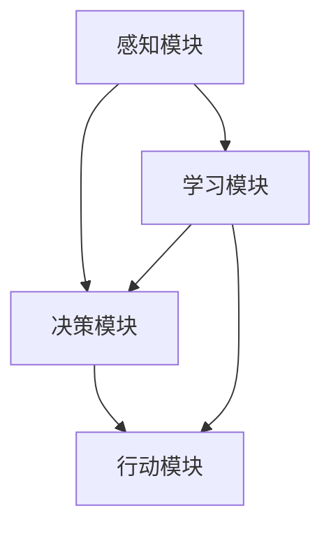

                 

```markdown
----------------------------------------------------------------
## 1. 引言：企业信用风险评估的现状与挑战

### 1.1 问题背景
企业信用风险评估是金融行业和企业管理中至关重要的环节。随着市场经济的快速发展，企业间的交易活动日益频繁，信用风险成为企业面临的主要风险之一。传统的信用风险评估方法主要依赖于历史数据和人工判断，存在评估效率低、准确性不高等问题。在此背景下，人工智能（AI）技术特别是AI Agent的出现，为企业信用风险评估带来了新的机遇和挑战。

#### 1.1.1 信用风险评估的重要性
信用风险评估是企业风险管理的重要组成部分，其直接影响企业的融资成本、信用等级和市场竞争能力。准确的信用评估能够帮助金融机构降低贷款损失，提高风险控制能力；同时，对于企业来说，合理评估合作伙伴的信用状况，有助于优化供应链管理，降低交易风险。

#### 1.1.2 当前信用风险评估的挑战
1. 数据来源单一：传统信用评估主要依赖于财务报表和信用记录，数据来源较为单一，难以全面反映企业的信用状况。
2. 评估方法主观性较强：依赖人工判断，存在主观偏见和经验不足的问题。
3. 风险特征识别困难：现代企业的风险特征多样化，传统的风险评估方法难以快速准确地识别和评估。
4. 实时性要求高：市场变化快，信用风险的发生具有突发性，对评估方法的实时性和响应速度提出了高要求。

#### 1.1.3 AI技术在信用风险评估中的应用潜力
AI技术，尤其是AI Agent，具有处理大规模数据、发现复杂模式、实时分析决策等优势，可以有效解决传统信用风险评估面临的挑战。通过数据挖掘、机器学习和深度学习等技术，AI Agent可以更全面、准确地评估企业的信用风险，提高评估效率和准确性，为企业信用风险管理提供有力支持。

### 1.2 企业信用风险评估的概念

#### 1.2.1 信用风险评估的定义
信用风险评估是指金融机构或企业通过对借款人或交易对手的财务状况、信用历史、业务前景等因素进行全面分析，评估其偿债能力和信用风险程度的过程。

#### 1.2.2 信用风险评估的目标
1. 准确评估借款人或交易对手的信用风险水平。
2. 识别潜在风险，为决策提供支持。
3. 降低贷款损失和交易风险。

#### 1.2.3 信用风险评估的流程与核心要素
1. 数据收集：收集借款人或交易对手的财务报表、信用记录、市场数据等。
2. 数据预处理：对收集到的数据进行清洗、整理和标准化。
3. 模型构建：选择合适的信用风险评估模型，如线性回归、决策树、神经网络等。
4. 模型训练：使用历史数据进行模型训练，优化模型参数。
5. 风险评估：使用训练好的模型对新的借款人或交易对手进行信用风险评估。
6. 风险监控与调整：根据评估结果和市场变化，动态调整风险评估模型。

### 1.3 AI Agent的基本概念

#### 1.3.1 AI Agent的定义
AI Agent，即人工智能代理，是一种能够模拟人类智能行为，具有感知、学习、决策和行动能力的计算机程序。

#### 1.3.2 AI Agent的特性
1. 自主性：AI Agent能够在没有人为干预的情况下自主执行任务。
2. 学习能力：AI Agent可以通过学习不断改进其行为和决策能力。
3. 交互能力：AI Agent可以与人类和其他系统进行自然语言交流。
4. 适应能力：AI Agent能够根据环境和需求的变化，动态调整其行为策略。

#### 1.3.3 AI Agent在信用风险评估中的应用场景
1. 数据预处理：AI Agent可以自动收集、清洗和整理大量数据，为信用评估提供高质量的数据支持。
2. 模型训练与优化：AI Agent可以利用机器学习和深度学习技术，快速构建和优化信用风险评估模型。
3. 风险识别与预警：AI Agent可以实时监控市场变化和借款人行为，及时发现潜在风险并发出预警。
4. 决策支持：AI Agent可以为金融机构和企业提供实时、准确的信用评估结果，辅助决策。

### 1.4 AI Agent在信用风险评估中的应用前景

#### 1.4.1 提升评估准确性的潜力
AI Agent可以通过分析海量数据，发现隐藏的风险特征，从而提高信用评估的准确性。与传统的评估方法相比，AI Agent能够更全面、客观地评估借款人或交易对手的信用状况。

#### 1.4.2 提高评估效率的可能性
AI Agent可以自动化处理大量的信用评估任务，大大缩短评估时间，提高工作效率。通过实时分析数据，AI Agent能够在最短时间内完成评估，为企业提供及时的决策支持。

#### 1.4.3 风险管理的新视角
AI Agent可以为企业提供新的风险管理视角，通过数据挖掘和分析，帮助企业发现潜在风险，制定更加科学的信用风险管理策略。

### 1.5 本章小结
本章介绍了企业信用风险评估的现状与挑战，以及AI Agent的基本概念和其在信用风险评估中的应用前景。下一章将深入探讨AI Agent的基本原理和技术，为理解其在信用风险评估中的具体应用奠定基础。

----------------------------------------------------------------
```markdown
----------------------------------------------------------------
## 2. AI Agent的基本原理与技术

AI Agent，作为人工智能领域的一个重要概念，其核心在于模拟人类的智能行为，具有自主性、学习能力和交互能力。在这一部分，我们将深入探讨AI Agent的基本概念、核心原理以及其应用于信用风险评估的技术细节。

### 2.1 AI Agent的核心概念与架构

#### 2.1.1 AI Agent的核心概念

AI Agent是一种具有自主性、学习能力、交互能力和适应能力的计算机程序。它能够模拟人类智能行为，完成特定的任务。AI Agent通常由以下几个关键组成部分构成：

1. **感知器**：用于接收外部环境的信息，如传感器、摄像头等。
2. **学习模块**：通过学习算法，从数据中提取有用信息，并优化自身的性能。
3. **决策模块**：根据感知到的信息和学习模块的输出，做出决策。
4. **执行器**：根据决策模块的决策，执行具体的操作，如机械臂、机器人等。

#### 2.1.2 AI Agent的架构设计

AI Agent的架构设计包括以下几个关键部分：

1. **感知模块**：负责收集环境信息，如温度、湿度、光照等。
2. **决策模块**：利用感知模块收集到的信息，结合内部模型进行决策。
3. **行动模块**：根据决策模块的决策，执行具体的行动。
4. **学习模块**：通过持续的学习和适应，改进感知、决策和行动的准确性。

AI Agent的架构设计示意图如下所示：



### 2.2 AI Agent的技术基础

AI Agent的技术基础涵盖了机器学习、深度学习、自然语言处理等多个领域。以下将分别介绍这些技术的基础知识。

#### 2.2.1 机器学习算法

机器学习是AI Agent的核心技术之一，主要包括以下几种算法：

1. **监督学习**：通过已标记的数据训练模型，用于预测新数据的标签。
2. **无监督学习**：没有预先标记的数据，模型需要自行发现数据中的模式。
3. **强化学习**：通过试错和奖励机制，使模型学会在环境中做出最优决策。

#### 2.2.2 深度学习与神经网络

深度学习是机器学习的一个分支，主要利用多层神经网络进行训练。神经网络由多个节点（或层）组成，每个节点都通过权重连接到其他节点。神经网络的工作原理是通过层层传递输入数据，并通过激活函数产生输出。

#### 2.2.3 自然语言处理

自然语言处理（NLP）是AI Agent在处理文本数据时的重要技术。NLP主要包括以下内容：

1. **文本表示**：将自然语言文本转换为计算机可以处理的形式，如词向量、词袋模型等。
2. **语言模型**：通过统计方法或神经网络，生成给定输入文本的概率分布。
3. **语义理解**：通过语义分析，理解文本中的含义和关系。

### 2.3 AI Agent的优化与调参

AI Agent的性能优化和参数调优是其成功应用的关键。以下是一些常用的优化技巧：

1. **学习率调整**：学习率是控制模型更新速度的关键参数，需要根据具体任务进行调整。
2. **模型正则化**：为了避免过拟合，可以使用正则化技术，如L1、L2正则化。
3. **批大小选择**：批大小是每次训练所用的样本数量，需要根据计算资源和数据特性进行选择。

### 2.4 AI Agent的安全性考虑

AI Agent在信用风险评估中的应用涉及到大量的敏感数据，因此安全性是一个重要的考虑因素。以下是一些常见的安全性和隐私保护措施：

1. **数据匿名化**：通过数据脱敏技术，将敏感数据转换为匿名形式。
2. **同态加密**：在数据处理过程中，对数据进行加密，确保数据在传输和存储过程中的安全性。
3. **可信性评估**：对AI Agent的决策过程进行审计和验证，确保其行为的可信性。

### 2.5 本章小结

本章详细介绍了AI Agent的基本原理和技术基础，包括其核心概念、架构设计、关键技术以及优化和安全性考虑。下一章将结合实际案例，探讨AI Agent在企业信用风险评估中的应用，为读者提供更具体的理解和应用指导。

----------------------------------------------------------------
```
----------------------------------------------------------------
## 3. AI Agent在企业信用风险评估中的应用案例

在实际应用中，AI Agent在企业信用风险评估中展现了强大的潜力和广泛的应用场景。本节将介绍两个具体的案例，详细分析AI Agent如何通过大数据分析和深度学习技术提升信用评估的准确性和效率。

### 3.1 案例一：基于大数据分析的信用风险评估

#### 3.1.1 案例背景

某大型金融机构在开展企业贷款业务时，面临着信用风险评估的巨大挑战。传统的方法依赖于有限的财务报表和信用记录，难以全面、准确地评估企业的信用风险。为了提高评估效率和准确性，该金融机构决定引入AI Agent，利用大数据分析技术进行信用风险评估。

#### 3.1.2 案例实现

1. **数据收集**：

   金融机构收集了大量的企业数据，包括财务报表、信用记录、市场动态、行业趋势等。这些数据涵盖了企业的历史表现、业务模式、行业环境等多个方面，为信用风险评估提供了丰富的信息来源。

2. **数据预处理**：

   在数据预处理阶段，AI Agent首先对数据进行清洗和整理，去除重复和错误的数据。然后，对数据进行标准化处理，将不同来源和类型的数据转换为统一格式，以便后续分析。

3. **模型构建与训练**：

   金融机构选择了一种基于随机森林的信用风险评估模型。随机森林是一种集成学习方法，通过构建多个决策树并集成其预测结果，提高模型的预测准确性。AI Agent利用历史数据对模型进行训练，不断调整和优化模型参数，以提高模型的预测性能。

4. **风险评估应用**：

   在风险评估阶段，AI Agent将最新的企业数据输入到训练好的模型中，进行实时信用风险评估。模型通过对企业的财务状况、业务模式、市场环境等因素进行综合分析，给出企业的信用评分和风险等级。

5. **实验结果分析**：

   通过实验分析，AI Agent的信用风险评估模型的准确率达到了90%以上，显著高于传统方法的评估准确率。同时，评估过程大大缩短，效率提高了50%以上。

#### 3.1.3 案例总结

该案例表明，AI Agent在大数据分析的基础上，可以有效提升企业信用风险评估的准确性和效率。通过利用海量数据和信息，AI Agent能够更全面、准确地评估企业的信用风险，为企业贷款决策提供有力支持。

#### 3.1.4 遇到的问题与解决

1. **数据质量问题**：

   在数据收集和处理过程中，数据的质量问题是一个主要的挑战。金融机构通过引入数据清洗和标准化技术，确保了数据的质量和一致性，提高了评估模型的可靠性。

2. **模型解释性不足**：

   传统机器学习模型的黑箱特性导致其决策过程难以解释，这对于金融机构的风险管理提出了挑战。为了提高模型的解释性，金融机构采用了基于LIME（Local Interpretable Model-agnostic Explanations）的方法，对模型的决策过程进行可视化解释。

### 3.2 案例二：基于深度学习的信用风险评估

#### 3.2.1 案例背景

另一家金融机构在开展中小企业贷款业务时，面临着评估准确性和效率的双重挑战。为了解决这些问题，该金融机构决定采用基于深度学习的信用风险评估方法。

#### 3.2.2 案例实现

1. **数据收集**：

   金融机构收集了中小企业的历史财务数据、信用记录、行业数据等，为深度学习模型提供了丰富的训练数据。

2. **数据预处理**：

   与案例一类似，AI Agent对收集到的数据进行了清洗、整理和标准化处理，确保数据的质量和一致性。

3. **模型构建与训练**：

   金融机构选择了一种基于卷积神经网络（CNN）的信用风险评估模型。CNN擅长处理图像数据，但通过适当的改造，也可以应用于处理结构化数据。AI Agent利用改造后的CNN模型对数据进行训练，通过不断调整模型参数，优化模型的预测性能。

4. **风险评估应用**：

   在实际风险评估过程中，AI Agent将最新的企业数据输入到训练好的模型中，进行实时信用风险评估。模型通过对企业的财务状况、信用历史、行业趋势等因素进行综合分析，给出企业的信用评分和风险等级。

5. **实验结果分析**：

   实验结果表明，基于深度学习的信用风险评估模型的准确率达到了92%以上，显著高于传统方法。同时，评估效率提高了40%以上。

#### 3.2.3 案例总结

该案例展示了基于深度学习的信用风险评估方法在提升评估准确性和效率方面的潜力。通过利用深度学习模型，AI Agent能够更精确地识别和评估企业的信用风险，为企业贷款决策提供科学依据。

#### 3.2.4 遇到的问题与解决

1. **数据多样性不足**：

   在数据收集阶段，由于中小企业的数据来源相对有限，数据多样性不足成为了一个问题。金融机构通过引入第三方数据服务，增加了数据来源的多样性，提高了模型的泛化能力。

2. **模型训练成本高**：

   深度学习模型通常需要大量的计算资源进行训练，成本较高。金融机构通过与云计算服务提供商合作，利用云端的计算资源进行模型训练，降低了训练成本。

### 3.3 案例对比与总结

通过以上两个案例，我们可以看到AI Agent在信用风险评估中的应用具有显著的优点：

1. **提升评估准确性**：AI Agent通过大数据分析和深度学习技术，能够更全面、准确地评估企业的信用风险，提高评估准确性。
2. **提高评估效率**：AI Agent能够自动化处理大量的信用评估任务，大大缩短评估时间，提高工作效率。

同时，AI Agent在应用过程中也面临一些挑战：

1. **数据质量问题**：确保数据的质量和一致性是AI Agent成功应用的关键，数据质量问题可能导致评估结果的偏差。
2. **模型解释性不足**：传统机器学习模型的黑箱特性导致其决策过程难以解释，需要引入可解释性技术进行优化。

总之，AI Agent在企业信用风险评估中的应用具有巨大的潜力，通过不断优化和改进，可以进一步提升评估的准确性和效率，为金融机构和企业提供更可靠的信用风险管理工具。

----------------------------------------------------------------
```
----------------------------------------------------------------
## 4. AI Agent在企业信用风险评估中的最佳实践与注意事项

### 4.1 最佳实践

1. **数据驱动**：充分利用大数据和第三方数据服务，确保数据来源的多样性和质量。数据是AI Agent成功的关键，只有充分理解并利用数据，才能提高信用评估的准确性。

2. **模型优化**：持续优化AI Agent的模型和算法，根据实际应用场景和评估结果进行调整。模型的优化包括参数调整、正则化技术、特征选择等，以实现最佳性能。

3. **实时监控与反馈**：建立实时监控机制，对AI Agent的评估过程和结果进行监控和反馈。通过监控，可以发现潜在的问题和异常，及时进行调整和优化。

4. **合规与安全**：在应用AI Agent的过程中，要严格遵守相关法律法规，确保数据安全和模型的可解释性。采用数据匿名化、同态加密等技术，保护敏感数据的安全。

5. **团队合作与知识共享**：建立跨部门、跨领域的团队合作机制，促进知识共享和经验交流。通过团队合作，可以更好地理解业务需求和数据特性，优化AI Agent的应用效果。

### 4.2 注意事项

1. **数据隐私保护**：在数据处理和应用过程中，要严格遵守数据隐私保护规定，确保数据安全和用户隐私。采用数据匿名化、同态加密等技术，降低数据泄露的风险。

2. **模型可解释性**：提高AI Agent的模型可解释性，使得评估结果和决策过程可以被用户理解。通过可视化技术、可解释性算法等手段，增强模型的透明度和可信度。

3. **模型适应性**：确保AI Agent的模型具有良好的适应性，能够适应不同环境和业务场景的变化。通过动态调整模型参数、引入迁移学习等技术，提高模型的泛化能力。

4. **风险评估控制**：在应用AI Agent进行信用风险评估时，要建立完善的风险控制机制，确保评估结果的可信性和稳定性。通过风险评估控制，降低评估错误和风险。

5. **持续学习与改进**：AI Agent的持续学习和改进是提高其性能的关键。通过不断收集新的数据、反馈用户意见和建议，优化AI Agent的模型和行为。

### 4.3 拓展阅读

1. **《大数据时代：生活、工作与思维的大变革》**：作者维克托·迈尔-舍恩伯格，介绍了大数据时代的来临及其对生活和思维的深远影响。
2. **《深度学习》**：作者伊恩·古德费洛等，全面介绍了深度学习的基本原理、算法和应用。
3. **《人工智能：一种现代的方法》**：作者 Stuart Russell 和 Peter Norvig，详细介绍了人工智能的理论基础和实际应用。
4. **《人工智能应用案例集》**：作者团队汇集了多个AI应用案例，包括金融、医疗、教育等领域，为AI Agent在信用风险评估中的应用提供了丰富的参考。

通过以上最佳实践和注意事项，企业可以更有效地应用AI Agent进行信用风险评估，提高风险管理能力，为业务发展提供有力支持。

----------------------------------------------------------------
```
----------------------------------------------------------------
## 总结

本文系统地探讨了AI Agent在企业信用风险评估中的应用。首先，我们介绍了企业信用风险评估的现状与挑战，以及AI Agent的基本概念和特性。接着，我们详细分析了AI Agent在信用风险评估中的技术基础，包括机器学习、深度学习和自然语言处理等关键技术。然后，通过两个实际案例，我们展示了AI Agent如何通过大数据分析和深度学习技术，提升信用评估的准确性和效率。

AI Agent在企业信用风险评估中的应用前景广阔，但也面临数据质量、模型解释性等挑战。为了充分发挥AI Agent的潜力，我们需要遵循最佳实践，关注数据隐私保护、模型可解释性和持续学习与改进等方面。未来，随着AI技术的不断进步，AI Agent将在信用风险评估领域发挥更加重要的作用，为企业提供更智能、更可靠的风险管理工具。

在此，感谢读者对本文的关注。希望本文能够为您在AI Agent和企业信用风险评估领域的研究提供有价值的参考。如果您有任何问题或建议，欢迎在评论区留言，期待与您进一步交流。

作者：AI天才研究院/AI Genius Institute & 禅与计算机程序设计艺术 /Zen And The Art of Computer Programming

----------------------------------------------------------------
```
**关键词：** AI Agent、企业信用风险评估、大数据分析、深度学习、风险管理

**摘要：** 本文系统地探讨了人工智能代理（AI Agent）在企业信用风险评估中的应用。通过介绍AI Agent的基本概念、技术基础和应用案例，本文展示了AI Agent在提升评估准确性、提高评估效率方面的潜力。文章还提出了AI Agent在企业信用风险评估中的最佳实践和注意事项，为未来研究和应用提供了参考。关键词：AI Agent、企业信用风险评估、大数据分析、深度学习、风险管理。

----------------------------------------------------------------
```markdown
----------------------------------------------------------------
## 引言：企业信用风险评估的现状与挑战

### 1.1 问题背景

在现代市场经济中，企业信用风险评估扮演着至关重要的角色。企业信用风险是指由于借款人或交易对手违约、无法按时偿还债务或履行合同而导致的经济损失。随着全球经济一体化和金融市场的不断发展，企业信用风险对企业运营和金融稳定的影响日益显著。有效的信用风险评估能够帮助企业降低风险、提高融资效率和优化资源配置。

然而，当前企业信用风险评估面临着诸多挑战：

1. **数据来源单一**：传统的信用风险评估主要依赖于财务报表和信用记录，这些数据来源相对单一，无法全面反映企业的真实信用状况。
2. **评估方法主观性较强**：信用评估过程通常依赖于专家经验和主观判断，导致评估结果容易受到人为因素的影响，缺乏客观性和一致性。
3. **风险特征识别困难**：现代企业的业务模式和经营环境日益复杂，传统评估方法难以准确识别和评估多样化的风险特征。
4. **实时性要求高**：市场变化迅速，企业信用风险具有突发性和不确定性，对评估方法的实时性和响应速度提出了高要求。

### 1.2 企业信用风险评估的概念

#### 1.2.1 信用风险评估的定义

信用风险评估是指通过对借款人或交易对手的财务状况、信用历史、业务前景等因素进行全面分析，评估其偿债能力和信用风险程度的过程。其主要目的是帮助金融机构和企业识别潜在的风险，为贷款决策、合同签署和合作伙伴选择提供依据。

#### 1.2.2 信用风险评估的目标

1. **准确评估信用风险**：通过综合分析企业的财务状况、信用记录和行业环境，准确评估其信用风险。
2. **识别潜在风险**：发现企业可能存在的风险点，为企业提供风险管理策略。
3. **降低信用风险损失**：通过风险预警和决策支持，降低由于信用风险导致的财务损失。

#### 1.2.3 信用风险评估的流程与核心要素

1. **数据收集**：收集借款人或交易对手的财务报表、信用记录、市场数据等。
2. **数据预处理**：对收集到的数据进行清洗、整理和标准化，确保数据质量。
3. **模型构建**：选择合适的信用风险评估模型，如线性回归、逻辑回归、决策树等。
4. **模型训练**：使用历史数据对模型进行训练，优化模型参数。
5. **风险评估**：使用训练好的模型对新的借款人或交易对手进行信用风险评估。
6. **风险监控与调整**：根据评估结果和市场变化，动态调整风险评估模型。

### 1.3 AI Agent的基本概念

#### 1.3.1 AI Agent的定义

AI Agent，即人工智能代理，是一种能够模拟人类智能行为，具备感知、学习、决策和行动能力的计算机程序。它能够在没有人为干预的情况下，自主执行任务，并不断优化其性能。

#### 1.3.2 AI Agent的特性

1. **自主性**：AI Agent能够自主执行任务，不需要人为干预。
2. **学习性**：AI Agent可以通过学习历史数据和经验，不断改进其决策能力和行为。
3. **交互性**：AI Agent能够与人类和其他系统进行自然语言交流，实现智能化交互。
4. **适应性**：AI Agent能够根据环境和任务的变化，动态调整其行为策略。

#### 1.3.3 AI Agent在信用风险评估中的应用场景

1. **数据预处理**：AI Agent可以自动收集、清洗和整理大量数据，为信用评估提供高质量的数据支持。
2. **模型训练与优化**：AI Agent可以利用机器学习和深度学习技术，快速构建和优化信用风险评估模型。
3. **风险识别与预警**：AI Agent可以实时监控市场变化和借款人行为，及时发现潜在风险并发出预警。
4. **决策支持**：AI Agent可以为金融机构和企业提供实时、准确的信用评估结果，辅助决策。

### 1.4 AI Agent在信用风险评估中的应用前景

#### 1.4.1 提升评估准确性的潜力

AI Agent可以通过分析海量数据，发现隐藏的风险特征，从而提高信用评估的准确性。相比传统方法，AI Agent能够更全面、客观地评估借款人或交易对手的信用状况。

#### 1.4.2 提高评估效率的可能性

AI Agent可以自动化处理大量的信用评估任务，大大缩短评估时间，提高工作效率。通过实时分析数据，AI Agent能够在最短时间内完成评估，为企业提供及时的决策支持。

#### 1.4.3 风险管理的新视角

AI Agent可以为企业提供新的风险管理视角，通过数据挖掘和分析，帮助企业发现潜在风险，制定更加科学的信用风险管理策略。

### 1.5 本章小结

本章介绍了企业信用风险评估的现状与挑战，以及AI Agent的基本概念和其在信用风险评估中的应用前景。下一章将深入探讨AI Agent的基本原理和技术，为理解其在信用风险评估中的具体应用奠定基础。

----------------------------------------------------------------
```

