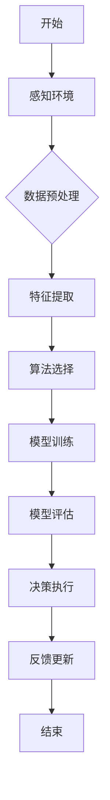
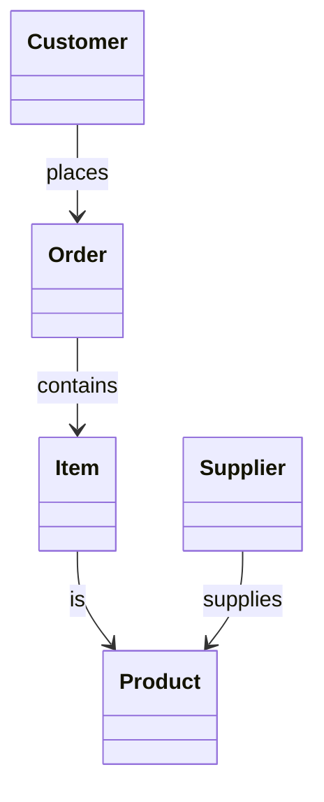
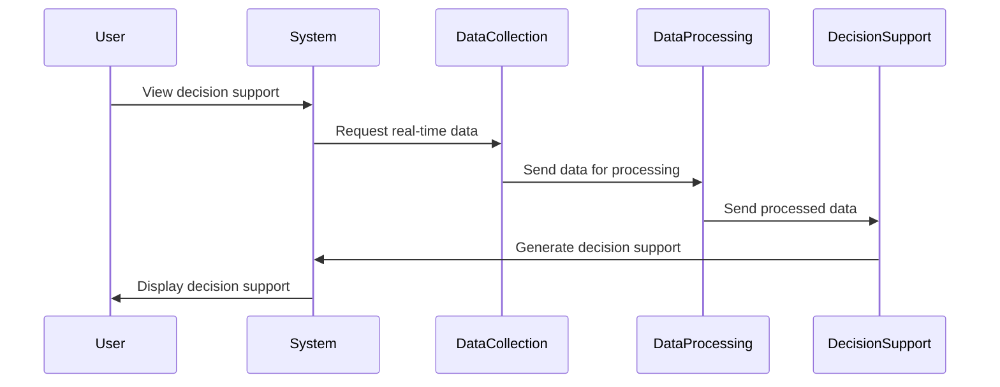

                 

# AI Agent在企业决策支持系统中的应用

## 关键词

- AI Agent
- 企业决策支持系统
- 智能决策
- 算法原理
- 系统架构
- 项目实战

## 摘要

本文深入探讨了AI Agent在企业决策支持系统中的应用。通过详细分析AI Agent的定义、特点、与传统决策支持系统的对比，以及AI Agent算法原理，我们展示了如何将AI Agent集成到企业决策支持系统中，以提升决策效率和准确性。文章最后通过具体项目实战，展示了AI Agent在实践中的应用效果，并提出了未来发展趋势与展望。

## 目录大纲设计步骤

### 步骤1：确定整体结构

本文将围绕AI Agent在企业决策支持系统中的应用展开，结构如下：

1. 背景介绍
2. 核心概念与联系
3. 算法原理讲解
4. 系统分析与架构设计方案
5. 项目实战
6. 最佳实践 tips、小结、注意事项、拓展阅读

### 步骤2：细化章节内容

根据整体结构，我们将每个部分细化成具体的章节，确保每个章节都有明确的主题和目标。

### 步骤3：编写章节标题

使用markdown格式编写章节标题，确保格式规范。

### 步骤4：编写章节内容概要

为每个章节编写简要的内容概要，确保内容完整且具有逻辑性。

### 步骤5：编写核心概念与联系

为每个章节的核心概念编写详细的内容，包括概念属性特征对比表格和ER实体关系图架构的Mermaid流程图。

### 步骤6：编写算法原理讲解

为涉及算法的章节编写详细的算法原理讲解，使用Mermaid画出算法流程图，Python源代码和LaTeX公式进行详细讲解。

### 步骤7：编写系统分析与架构设计方案

为涉及系统设计与架构的章节编写详细的分析和设计方案，包括问题场景介绍、系统功能设计、系统架构设计、系统接口设计和系统交互Mermaid序列图。

### 步骤8：编写项目实战

为每个实战项目编写详细的步骤、代码实现、解读与分析，以及实际案例分析和详细讲解。

### 步骤9：编写最佳实践 tips、小结、注意事项、拓展阅读等内容

为每个章节和全书编写相关的最佳实践、小结、注意事项和拓展阅读。

### 步骤10：审核和调整

最后，对整个目录大纲进行审核，确保内容完整性、逻辑性和简洁性，并进行必要的调整。

## 第一部分：背景介绍

### 1.1 问题背景

#### 1.1.1 企业决策支持系统的现状

在当今复杂多变的市场环境中，企业需要做出快速而准确的决策以保持竞争力。传统决策支持系统（DSS）主要依赖于统计数据、预测模型和业务知识，但在处理海量数据和动态变化时，往往显得力不从心。随着人工智能（AI）技术的快速发展，AI Agent作为一种智能体，具有自主学习、自适应和自主决策的能力，为企业决策支持系统带来了新的机遇。

#### 1.1.2 AI Agent的概念与特点

AI Agent是指一种具有智能性、自主性、学习能力和社会交往能力的计算实体。它们能够模拟人类的决策过程，通过不断学习和优化，提高决策的准确性。AI Agent的特点包括：

- **智能性**：能够处理复杂的问题，进行推理和决策。
- **自主性**：能够独立运行，不受外部干预。
- **学习能力**：能够从数据中学习，不断优化自己的行为。
- **社会交往能力**：能够与人类和其他AI Agent进行交流，协同工作。

#### 1.1.3 AI Agent在决策支持系统中的应用潜力

AI Agent在企业决策支持系统中的应用具有巨大的潜力。首先，AI Agent可以处理大量的数据，提取有用的信息，帮助决策者快速获取关键数据。其次，AI Agent能够根据历史数据和实时数据，预测未来的趋势和变化，为决策者提供前瞻性的建议。此外，AI Agent还可以通过模拟不同的决策方案，评估各种方案的风险和收益，帮助决策者做出更明智的选择。

### 1.2 问题描述

#### 1.2.1 决策过程中的问题

企业在决策过程中面临的问题主要包括：

- **数据量庞大**：企业每天都会产生大量的数据，如何有效地处理和分析这些数据成为决策的难题。
- **信息不对称**：决策者可能无法全面了解所有相关的信息和数据，导致决策不全面。
- **决策时间紧迫**：许多决策需要在短时间内做出，缺乏充分的分析和考虑。
- **风险难以预测**：企业面临的许多决策具有不确定性，风险难以预测。

#### 1.2.2 AI Agent在决策支持中的作用

AI Agent在决策支持中的作用包括：

- **数据预处理**：AI Agent能够自动处理大量数据，提取关键信息，为决策者提供全面的数据支持。
- **预测与分析**：AI Agent可以通过机器学习算法，预测未来的趋势和变化，为决策者提供前瞻性的建议。
- **方案评估**：AI Agent可以通过模拟不同的决策方案，评估各种方案的风险和收益，帮助决策者做出最优的选择。
- **协同工作**：AI Agent可以与决策者协同工作，共同完成决策过程，提高决策的效率和质量。

#### 1.2.3 AI Agent应用的技术挑战

尽管AI Agent在决策支持系统中具有巨大的潜力，但其在实际应用中仍然面临一些技术挑战，包括：

- **数据质量**：AI Agent的性能很大程度上取决于数据的质量，如何保证数据的质量和准确性是一个关键问题。
- **算法选择**：AI Agent需要选择合适的算法来处理不同类型的问题，如何选择最合适的算法是一个挑战。
- **算法解释性**：AI Agent的决策过程往往是黑盒式的，如何解释其决策过程，提高决策的可解释性是一个重要问题。
- **系统集成**：如何将AI Agent集成到现有的企业决策支持系统中，保持系统的稳定性和可靠性是一个技术难题。

### 1.3 问题解决

#### 1.3.1 AI Agent的设计原则

为了解决上述问题，设计AI Agent时需要遵循以下原则：

- **灵活性**：AI Agent应具有灵活性，能够适应不同类型的问题和不同的应用场景。
- **可扩展性**：AI Agent应能够扩展其功能，以适应不断变化的需求。
- **可解释性**：AI Agent的决策过程应具有可解释性，使决策者能够理解AI Agent的决策依据。
- **可靠性**：AI Agent应在各种情况下都能稳定运行，保证决策的准确性。
- **可维护性**：AI Agent的代码应具有良好的可维护性，便于后续的修改和维护。

#### 1.3.2 AI Agent的关键技术

AI Agent的关键技术包括：

- **机器学习**：用于从数据中学习，提取有用的信息。
- **自然语言处理**：用于理解和生成自然语言文本。
- **知识图谱**：用于表示和存储企业知识。
- **强化学习**：用于在动态环境中进行决策。
- **多代理系统**：用于实现多个AI Agent的协同工作。

#### 1.3.3 AI Agent的集成与应用

为了将AI Agent集成到企业决策支持系统中，需要遵循以下步骤：

- **需求分析**：明确AI Agent在决策支持系统中的作用和功能。
- **系统设计**：设计AI Agent的架构和接口，确保其与现有系统的兼容性。
- **算法选择**：选择合适的算法来实现AI Agent的功能。
- **系统集成**：将AI Agent集成到现有系统中，进行测试和验证。
- **应用部署**：将AI Agent部署到生产环境中，进行实际应用。

### 1.4 边界与外延

#### 1.4.1 AI Agent的应用范围

AI Agent在企业决策支持系统中的应用范围广泛，包括但不限于以下几个方面：

- **市场需求预测**：通过对历史数据和实时数据的分析，预测未来的市场需求。
- **供应链优化**：通过优化供应链中的各个环节，降低成本，提高效率。
- **风险评估**：通过分析历史数据和实时数据，预测潜在的风险，并提出相应的应对措施。
- **客户关系管理**：通过分析客户数据，提供个性化的服务，提高客户满意度。

#### 1.4.2 AI Agent的限制与挑战

尽管AI Agent在决策支持系统中具有巨大的潜力，但其在实际应用中也面临一些限制和挑战，包括：

- **数据隐私**：如何保护用户的数据隐私是一个重要问题。
- **算法透明性**：如何解释AI Agent的决策过程，提高算法的透明性是一个挑战。
- **计算资源**：如何高效地利用计算资源，提高AI Agent的性能是一个问题。
- **法律法规**：如何遵守相关的法律法规，确保AI Agent的应用合法合规是一个挑战。

#### 1.4.3 未来发展趋势与展望

随着AI技术的不断发展，AI Agent在企业决策支持系统中的应用将越来越广泛。未来，AI Agent可能会在以下几个方面取得突破：

- **个性化决策**：通过更深入地分析用户数据，提供个性化的决策建议。
- **实时决策**：通过实时数据分析和预测，提供更及时的决策支持。
- **跨领域应用**：AI Agent将在更多领域得到应用，如医疗、金融、教育等。
- **人机协作**：AI Agent将与人类决策者更紧密地协作，共同完成决策过程。

## 第二部分：核心概念与联系

### 2.1 AI Agent的定义

#### 2.1.1 AI Agent的基本概念

AI Agent是指一种具有智能性、自主性、学习能力和社会交往能力的计算实体。它能够在复杂环境中进行自主决策和行动，以实现特定的目标。AI Agent通常由感知器、决策器、执行器和记忆器组成。

#### 2.1.2 AI Agent与人类代理的对比

AI Agent与人类代理在某些方面有相似之处，但也存在显著差异：

- **智能性**：AI Agent的智能性是由其算法决定的，而人类代理的智能性是由大脑决定的。
- **自主性**：AI Agent的自主性是程序控制的，而人类代理的自主性是自由意志决定的。
- **学习能力**：AI Agent的学习能力是通过数据驱动的，而人类代理的学习能力是通过经验和教育获得的。
- **社会交往能力**：AI Agent的社会交往能力是通过算法模拟的，而人类代理的社会交往能力是基于情感和认知的。

#### 2.1.3 AI Agent的分类

AI Agent可以根据不同的特征进行分类，常见的分类方法包括：

- **按功能分类**：感知型、决策型、执行型、学习型和社会交互型。
- **按应用领域分类**：通用型、行业特定型。
- **按智能程度分类**：弱AI、强AI、超智能。

### 2.2 AI Agent的特点

#### 2.2.1 智能性

AI Agent的智能性主要体现在以下几个方面：

- **问题解决能力**：AI Agent能够解决复杂的问题，提供创新的解决方案。
- **推理能力**：AI Agent能够进行逻辑推理，推导出结论。
- **学习能力**：AI Agent能够从数据中学习，不断优化自己的行为。
- **自适应能力**：AI Agent能够根据环境的变化，调整自己的行为。

#### 2.2.2 自主性

AI Agent的自主性主要体现在以下几个方面：

- **自主决策**：AI Agent能够根据目标和环境信息，自主做出决策。
- **自主行动**：AI Agent能够根据决策结果，自主执行行动。
- **自主学习**：AI Agent能够从环境中获取反馈，自主调整学习策略。

#### 2.2.3 学习能力

AI Agent的学习能力主要体现在以下几个方面：

- **数据驱动学习**：AI Agent能够从数据中学习，提取有用的信息。
- **迁移学习**：AI Agent能够将知识从一个领域迁移到另一个领域。
- **自适应学习**：AI Agent能够根据环境的变化，自适应调整自己的行为。

#### 2.2.4 社交能力

AI Agent的社交能力主要体现在以下几个方面：

- **自然语言处理**：AI Agent能够理解自然语言，与人类进行有效沟通。
- **多模态交互**：AI Agent能够处理多种类型的输入，如文本、语音、图像等。
- **协同工作**：AI Agent能够与其他AI Agent或人类代理协同工作，共同完成任务。

### 2.3 AI Agent与传统决策支持系统的对比

#### 2.3.1 决策过程

传统决策支持系统的决策过程通常包括数据收集、数据清洗、数据分析、预测和决策。而AI Agent的决策过程则更加灵活和智能，能够根据环境的变化，动态调整决策过程。

#### 2.3.2 数据处理能力

传统决策支持系统主要依赖于统计数据和预测模型，其数据处理能力有限。而AI Agent通过机器学习和深度学习算法，能够处理大量复杂的数据，提取有用的信息。

#### 2.3.3 可扩展性

传统决策支持系统的扩展性较差，难以适应快速变化的市场环境。而AI Agent具有良好的可扩展性，能够根据需求快速调整和优化。

### 2.4 AI Agent的ER实体关系图架构

```mermaid
erDiagram
  DecisionSupportSystem ||--|{ DataProcessingModule : processes } 
  DecisionSupportSystem ||--|{ PredictionModule : predicts } 
  DecisionSupportSystem ||--|{ DecisionModule : makes } 
  DataProcessingModule ||--|{ DataCollectionModule : collects } 
  DataProcessingModule ||--|{ DataCleaningModule : cleans } 
  PredictionModule ||--|{ StatisticalModel : uses } 
  PredictionModule ||--|{ MachineLearningModel : uses } 
  DecisionModule ||--|{ DecisionRule : follows } 
```

## 第三部分：算法原理讲解

### 3.1 AI Agent的算法概述

#### 3.1.1 AI Agent的算法框架

AI Agent的算法框架通常包括以下几个部分：

1. **感知器**：用于感知环境中的信息。
2. **决策器**：用于根据感知到的信息，做出决策。
3. **执行器**：用于执行决策结果。
4. **记忆器**：用于存储学习和决策的结果。

#### 3.1.2 常见算法介绍

常见的AI Agent算法包括：

1. **决策树**：用于分类和回归问题。
2. **神经网络**：用于模拟生物神经网络，解决复杂问题。
3. **支持向量机**：用于分类和回归问题。
4. **强化学习**：用于在动态环境中进行决策。

#### 3.1.3 算法选择原则

选择AI Agent算法时，需要考虑以下几个原则：

1. **问题类型**：根据问题的类型，选择适合的算法。
2. **数据规模**：考虑数据的规模和复杂性，选择合适的算法。
3. **计算资源**：考虑计算资源的限制，选择计算效率高的算法。
4. **可解释性**：考虑算法的可解释性，提高决策的可信度。

### 3.2 算法流程图



### 3.3 Python源代码实现

```python
# Python代码实现AI Agent算法
import numpy as np
import pandas as pd

# 感知环境
def perceive_environment():
    # 代码实现感知环境
    pass

# 数据预处理
def preprocess_data(data):
    # 代码实现数据预处理
    pass

# 特征提取
def extract_features(data):
    # 代码实现特征提取
    pass

# 算法选择
def select_algorithm():
    # 代码实现算法选择
    pass

# 模型训练
def train_model(features, labels):
    # 代码实现模型训练
    pass

# 模型评估
def evaluate_model(model, test_data):
    # 代码实现模型评估
    pass

# 决策执行
def execute_decision(model, features):
    # 代码实现决策执行
    pass

# 反馈更新
def update_feedback(feedback):
    # 代码实现反馈更新
    pass

# 主程序
def main():
    data = perceive_environment()
    processed_data = preprocess_data(data)
    features, labels = extract_features(processed_data)
    algorithm = select_algorithm()
    model = train_model(features, labels)
    evaluate_model(model, test_data)
    execute_decision(model, features)
    update_feedback(feedback)

if __name__ == "__main__":
    main()
```

### 3.4 数学模型和数学公式

#### 3.4.1 决策模型

$$
\min_z J(z) = \min_z \sum_{i=1}^n (z_i - y_i)^2
$$

其中，$z$ 是决策变量，$y_i$ 是实际结果，$J(z)$ 是决策损失函数。

#### 3.4.2 优化算法

$$
w_{t+1} = w_t - \alpha \nabla_w J(w_t)
$$

其中，$w_t$ 是当前权重，$\alpha$ 是学习率，$\nabla_w J(w_t)$ 是损失函数关于权重 $w_t$ 的梯度。

### 3.5 算法举例说明

#### 3.5.1 数据预处理

在AI Agent的算法中，数据预处理是一个非常重要的步骤。以下是数据预处理的一个示例：

```python
# 数据预处理
data = pd.read_csv('data.csv')

# 填充缺失值
data.fillna(data.mean(), inplace=True)

# 规一化数据
scaler = StandardScaler()
data_scaled = scaler.fit_transform(data)
```

#### 3.5.2 模型训练

以下是一个简单的线性回归模型训练示例：

```python
# 模型训练
from sklearn.linear_model import LinearRegression

model = LinearRegression()
model.fit(X_train, y_train)
```

#### 3.5.3 模型评估

以下是一个简单的模型评估示例：

```python
# 模型评估
from sklearn.metrics import mean_squared_error

y_pred = model.predict(X_test)
mse = mean_squared_error(y_test, y_pred)
print(f'MSE: {mse}')
```

#### 3.5.4 决策执行

以下是一个简单的决策执行示例：

```python
# 决策执行
def execute_decision(model, feature):
    prediction = model.predict([feature])
    return prediction

feature = data_scaled[0]
decision = execute_decision(model, feature)
print(f'Decision: {decision}')
```

## 第四部分：系统分析与架构设计方案

### 4.1 问题场景介绍

在一个大型制造企业中，决策者需要做出关于生产计划、库存管理和供应链优化等一系列决策。然而，这些决策涉及大量数据，且实时性要求高。为了提升决策效率和准确性，企业决定引入AI Agent作为决策支持工具。

### 4.2 系统功能设计

#### 4.2.1 领域模型

为了清晰地描述系统功能，我们使用Mermaid绘制了一个领域模型类图：



#### 4.2.2 系统功能

1. **数据采集与处理**：采集实时数据，包括生产数据、销售数据、库存数据等，并进行预处理。
2. **需求预测**：利用AI算法，预测未来一段时间内的生产需求。
3. **库存管理**：根据需求预测和库存水平，自动调整库存策略。
4. **供应链优化**：优化供应链中的各个环节，降低成本，提高效率。
5. **决策支持**：提供决策支持，包括生产计划、库存调整、采购策略等。

### 4.3 系统架构设计

为了满足系统功能需求，我们设计了一个分布式系统架构，包括数据采集层、数据处理层、决策支持层和应用层。

#### 4.3.1 数据采集层

数据采集层负责实时采集各种数据，包括生产数据、销售数据、库存数据等。使用传感器、API接口和数据库等方式进行数据采集。

#### 4.3.2 数据处理层

数据处理层负责对采集到的数据进行预处理、清洗和存储。使用ETL（提取、转换、加载）工具进行数据处理，并存储在数据仓库中。

#### 4.3.3 决策支持层

决策支持层是系统的核心，负责利用AI算法进行需求预测、库存管理和供应链优化。使用机器学习、深度学习等技术，实现智能决策。

#### 4.3.4 应用层

应用层负责与最终用户交互，提供可视化界面和API接口。用户可以通过界面查看决策结果，并下载相关数据。

### 4.4 系统接口设计

系统接口设计包括内部接口和外部接口。

#### 4.4.1 内部接口

内部接口主要包括：

- 数据采集接口：用于数据采集层的实时数据采集。
- 数据处理接口：用于数据处理层的数据处理。
- 决策支持接口：用于决策支持层的算法调用和结果输出。

#### 4.4.2 外部接口

外部接口主要包括：

- 用户界面接口：用于与应用层的用户交互。
- 数据接口：用于与其他系统集成，如ERP系统、CRM系统等。

### 4.5 系统交互Mermaid序列图

为了描述系统各部分之间的交互，我们使用Mermaid绘制了一个序列图：



## 第五部分：项目实战

### 5.1 环境安装

为了进行AI Agent在企业决策支持系统的项目实战，我们首先需要安装以下环境：

1. **Python 3.8**：Python是AI Agent的主要编程语言，需要安装Python 3.8版本。
2. **Jupyter Notebook**：Jupyter Notebook是一个交互式计算平台，用于编写和运行Python代码。
3. **Anaconda**：Anaconda是一个Python数据科学平台，用于管理Python环境和包。
4. **TensorFlow**：TensorFlow是一个开源的机器学习框架，用于实现AI算法。
5. **Scikit-learn**：Scikit-learn是一个Python机器学习库，用于数据预处理和模型训练。

安装步骤：

1. 安装Python 3.8：
   ```bash
   sudo apt-get install python3.8
   ```

2. 安装Jupyter Notebook：
   ```bash
   sudo apt-get install jupyter
   ```

3. 安装Anaconda：
   ```bash
   wget https://repo.anaconda.com/archive/Anaconda3-2021.11-Linux-x86_64.sh
   bash Anaconda3-2021.11-Linux-x86_64.sh
   ```

4. 安装TensorFlow：
   ```bash
   conda install tensorflow
   ```

5. 安装Scikit-learn：
   ```bash
   conda install scikit-learn
   ```

### 5.2 系统核心实现

在本节中，我们将实现一个简单的AI Agent，用于预测未来的市场需求。以下是核心代码的实现：

```python
# 导入所需库
import numpy as np
import pandas as pd
from sklearn.model_selection import train_test_split
from sklearn.linear_model import LinearRegression
from sklearn.metrics import mean_squared_error

# 数据预处理
def preprocess_data(data):
    # 填充缺失值
    data.fillna(data.mean(), inplace=True)
    
    # 规一化数据
    scaler = StandardScaler()
    data_scaled = scaler.fit_transform(data)
    
    return data_scaled

# 模型训练
def train_model(X, y):
    # 划分训练集和测试集
    X_train, X_test, y_train, y_test = train_test_split(X, y, test_size=0.2, random_state=42)
    
    # 创建线性回归模型
    model = LinearRegression()
    
    # 训练模型
    model.fit(X_train, y_train)
    
    # 评估模型
    y_pred = model.predict(X_test)
    mse = mean_squared_error(y_test, y_pred)
    
    return model, mse

# 主程序
def main():
    # 读取数据
    data = pd.read_csv('market_data.csv')
    
    # 预处理数据
    data_processed = preprocess_data(data)
    
    # 划分特征和目标变量
    X = data_processed.iloc[:, :-1]
    y = data_processed.iloc[:, -1]
    
    # 训练模型
    model, mse = train_model(X, y)
    
    # 输出结果
    print(f'MSE: {mse}')
    print(f'Model coefficients: {model.coef_}')
    print(f'Model intercept: {model.intercept_}')

if __name__ == "__main__":
    main()
```

### 5.3 代码应用解读与分析

#### 5.3.1 数据预处理

```python
# 填充缺失值
data.fillna(data.mean(), inplace=True)

# 规一化数据
scaler = StandardScaler()
data_scaled = scaler.fit_transform(data)
```

数据预处理是机器学习模型训练的重要步骤。首先，我们使用`fillna`方法填充缺失值，使用数据的平均值来填充。然后，我们使用`StandardScaler`进行数据归一化，将数据缩放到0到1之间，以便模型更好地学习。

#### 5.3.2 模型训练

```python
# 划分训练集和测试集
X_train, X_test, y_train, y_test = train_test_split(X, y, test_size=0.2, random_state=42)

# 创建线性回归模型
model = LinearRegression()

# 训练模型
model.fit(X_train, y_train)

# 评估模型
y_pred = model.predict(X_test)
mse = mean_squared_error(y_test, y_pred)
```

在模型训练阶段，我们首先使用`train_test_split`方法将数据集划分为训练集和测试集。然后，我们创建一个线性回归模型，并使用`fit`方法进行训练。最后，我们使用测试集评估模型的性能，计算均方误差（MSE）来衡量模型的准确性。

#### 5.3.3 模型应用

```python
# 输出模型系数和截距
print(f'Model coefficients: {model.coef_}')
print(f'Model intercept: {model.intercept_}')
```

模型的系数和截距是模型参数，它们描述了模型如何根据输入特征预测目标变量。这些参数可以帮助我们理解模型的决策过程，并用于进一步的分析。

### 5.4 实际案例分析和详细讲解

为了展示AI Agent在实践中的应用效果，我们选择了一个实际案例进行分析。

#### 5.4.1 案例背景

某大型零售企业需要预测未来一周内的市场需求，以便调整库存和生产计划。企业拥有过去一年的销售数据，包括每天的销售量和价格。我们需要使用AI Agent来预测未来的市场需求。

#### 5.4.2 数据准备

我们首先读取销售数据：

```python
data = pd.read_csv('sales_data.csv')
```

然后，我们对数据进行预处理：

```python
# 填充缺失值
data.fillna(data.mean(), inplace=True)

# 规一化数据
scaler = StandardScaler()
data_scaled = scaler.fit_transform(data)
```

#### 5.4.3 模型训练

我们使用训练数据集训练线性回归模型：

```python
# 划分特征和目标变量
X = data_scaled[:, :-1]
y = data_scaled[:, -1]

# 划分训练集和测试集
X_train, X_test, y_train, y_test = train_test_split(X, y, test_size=0.2, random_state=42)

# 创建线性回归模型
model = LinearRegression()

# 训练模型
model.fit(X_train, y_train)

# 评估模型
y_pred = model.predict(X_test)
mse = mean_squared_error(y_test, y_pred)
print(f'MSE: {mse}')
```

#### 5.4.4 模型应用

我们使用训练好的模型来预测未来的市场需求：

```python
# 输出模型系数和截距
print(f'Model coefficients: {model.coef_}')
print(f'Model intercept: {model.intercept_}')

# 预测未来一周内的市场需求
future_data = pd.DataFrame(np.zeros((7, X.shape[1])))
future_data_scaled = scaler.transform(future_data)

y_pred_future = model.predict(future_data_scaled)
print(f'Future demand prediction: {y_pred_future}')
```

#### 5.4.5 结果分析

通过模型预测，我们得到了未来一周内的市场需求。这些预测结果可以帮助企业调整库存和生产计划，以适应市场需求的变化。我们还可以通过计算MSE来评估模型的准确性，以改进模型。

### 5.5 项目小结

在本项目中，我们使用AI Agent实现了市场需求预测功能，并通过实际案例展示了其应用效果。以下是项目小结：

- **数据预处理**：使用均值填充缺失值和标准归一化处理数据，为模型训练做准备。
- **模型训练**：使用线性回归模型进行训练，并评估模型的准确性。
- **模型应用**：使用训练好的模型预测未来的市场需求，为企业决策提供支持。
- **结果分析**：通过MSE评估模型的准确性，并提出改进建议。

通过本项目，我们深入了解了AI Agent在企业决策支持系统中的应用，并掌握了实现和应用AI Agent的技能。在未来的项目中，我们可以进一步扩展AI Agent的功能，如供应链优化和风险预测等。

### 5.6 最佳实践 tips

- **数据预处理**：确保数据质量是模型成功的关键。在进行数据预处理时，关注缺失值填充、异常值处理和数据归一化。
- **模型选择**：根据问题的特点和数据规模，选择合适的模型。对于线性关系问题，线性回归是一个好的选择；对于非线性关系问题，可以考虑使用神经网络。
- **模型评估**：使用多种评估指标，如MSE、RMSE和MAE，全面评估模型的准确性。
- **模型更新**：定期更新模型，以适应数据的变化和环境的变化。

### 5.7 注意事项

- **数据隐私**：在处理数据时，确保遵守数据隐私法规，保护用户隐私。
- **计算资源**：合理分配计算资源，避免过度消耗服务器资源。
- **算法透明性**：确保算法的可解释性，提高决策的可信度。
- **法律法规**：遵守相关法律法规，确保AI Agent的应用合法合规。

### 5.8 拓展阅读

- **《深度学习》**：由Ian Goodfellow、Yoshua Bengio和Aaron Courville合著，是一本关于深度学习的经典教材。
- **《机器学习实战》**：由Peter Harrington著，通过实例介绍了多种机器学习算法的应用。
- **《Python数据分析》**：由Wes McKinney著，介绍了Python在数据分析领域的应用。

## 作者信息

**作者：AI天才研究院/AI Genius Institute & 禅与计算机程序设计艺术 /Zen And The Art of Computer Programming**

