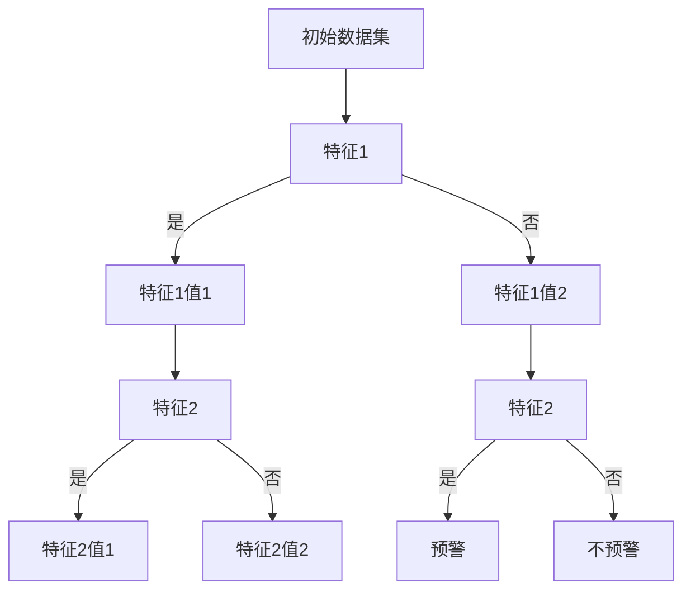
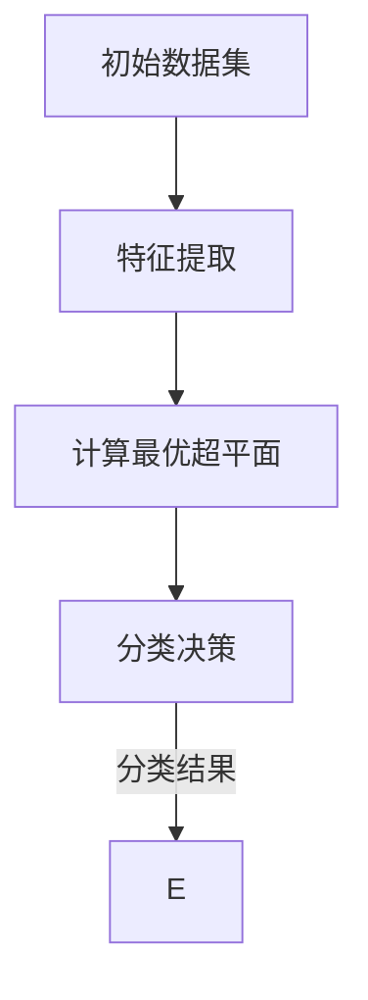
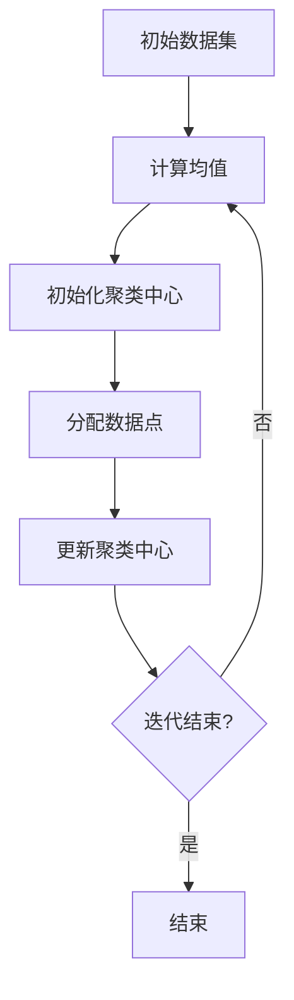
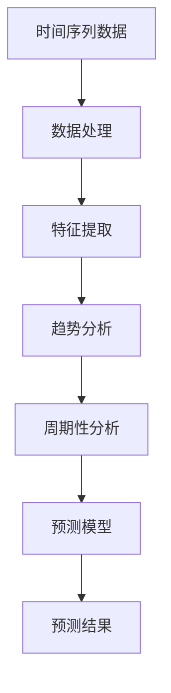
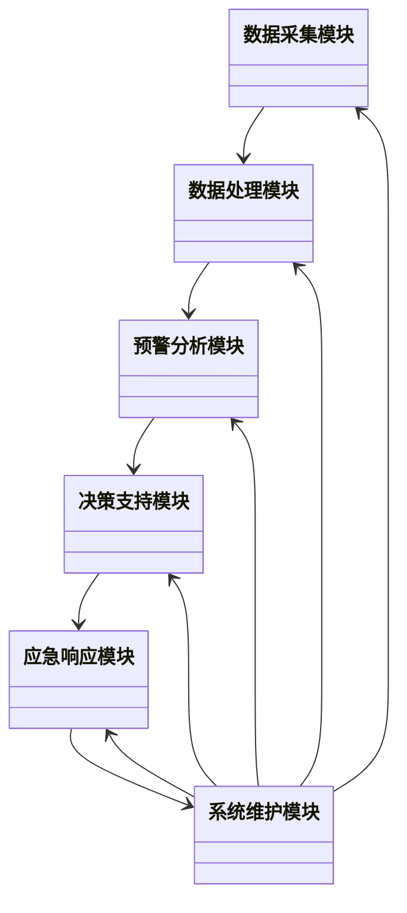
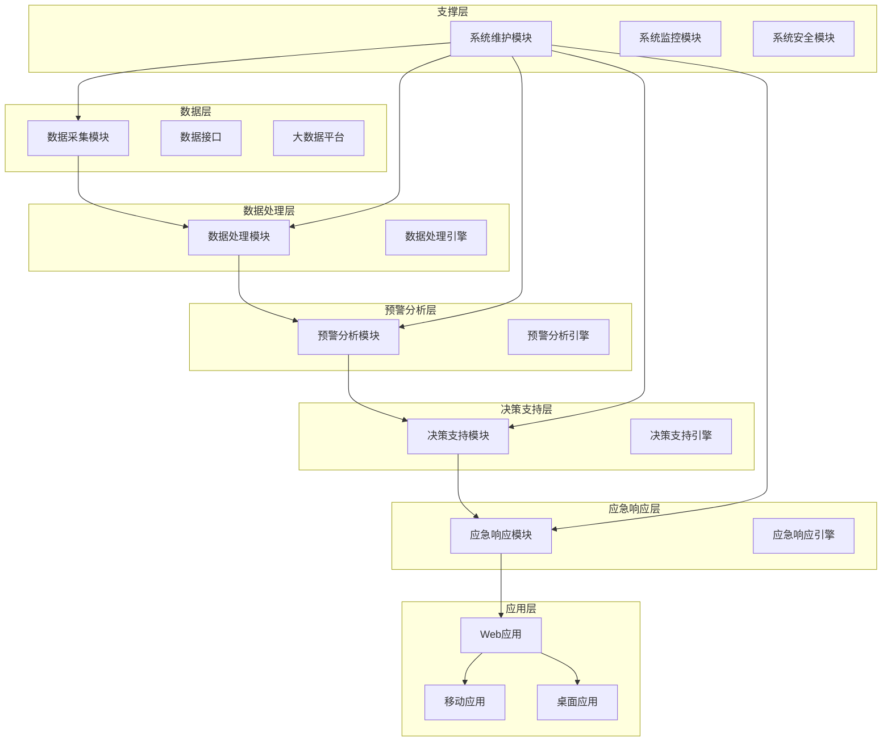
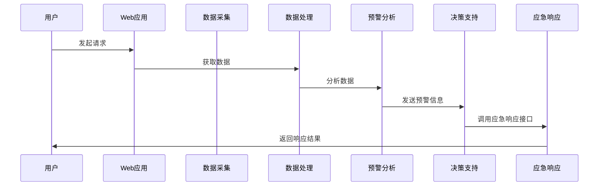
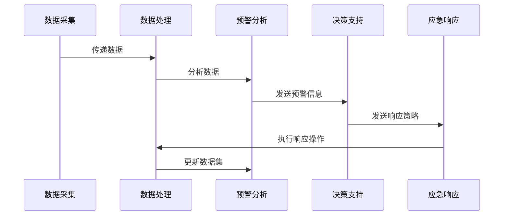

                 

### 标题与引言

在当今快速变化的企业环境中，面对各种不确定性和突发事件，企业必须具备强大的危机预警与应急响应能力。传统的应急管理方法往往依赖于人为判断和经验，不仅效率低下，而且容易出现遗漏和误判。为了应对这一挑战，人工智能（AI）技术特别是AI Agent的应用正在逐步兴起，并展现出了巨大的潜力。本文将探讨AI Agent在企业危机预警与应急响应中的关键作用，详细分析其工作机制、应用场景和具体实现，以期为企业在应对危机时提供有力支持。

AI Agent，即人工智能代理，是指能够自动执行特定任务的计算机程序，通过模拟人类行为和决策过程，具备自主学习和适应性。与传统的规则驱动型系统不同，AI Agent能够通过机器学习、自然语言处理、数据分析等技术，从海量数据中提取有价值的信息，并在此基础上进行智能决策。在企业危机预警与应急响应中，AI Agent不仅能够实时监测环境变化，预测潜在风险，还能够根据实际情况自动采取相应的应急措施，极大地提高了危机管理的效率和准确性。

本文将从以下几个方面展开讨论：

1. **背景介绍**：介绍企业危机预警与应急响应的重要性，以及AI Agent在此领域的基本概念和作用。
2. **核心概念与联系**：详细解释AI Agent的定义、特点、分类及其在企业中的应用，并通过对比表格和ER实体关系图展示其结构和关系。
3. **算法原理讲解**：分析AI Agent的核心算法，包括机器学习算法、数据分析方法等，通过Mermaid流程图和Python源代码进行详细阐述。
4. **系统分析与架构设计方案**：介绍AI Agent在企业危机预警与应急响应系统中的架构设计，包括系统功能、架构和接口设计。
5. **项目实战**：通过具体案例，展示AI Agent在企业危机预警与应急响应系统中的实际应用，详细解读系统核心实现和代码应用。
6. **最佳实践 tips**、**小结**、**注意事项**、**拓展阅读**等内容，为读者提供实际操作指导和进一步学习的资源。

通过本文的深入探讨，我们希望能够让读者全面了解AI Agent在企业危机预警与应急响应中的关键作用，为其在实践中的应用提供有益的参考和启示。

### 关键词

- 企业危机预警
- 应急响应
- 人工智能代理（AI Agent）
- 机器学习
- 数据分析
- 系统架构设计

### 摘要

本文探讨了人工智能代理（AI Agent）在企业危机预警与应急响应中的关键作用。首先，介绍了企业危机预警与应急响应的背景和重要性，以及AI Agent的基本概念和特点。随后，通过对比表格和ER实体关系图，详细分析了AI Agent的定义、分类及其在企业中的应用。接着，本文讲解了AI Agent的核心算法原理，包括机器学习算法和数据分析方法，并利用Mermaid流程图和Python源代码进行了详细阐述。随后，文章介绍了AI Agent在企业危机预警与应急响应系统中的架构设计，包括系统功能、架构和接口设计。通过具体案例，本文展示了AI Agent在实际应用中的效果，并详细解读了系统核心实现和代码应用。最后，本文提出了最佳实践建议，并对全文进行了总结，为读者提供了全面的应用参考和深入研究的方向。

### 背景介绍

#### 核心概念术语说明

在企业危机预警与应急响应中，理解以下几个核心概念术语是非常重要的：

- **危机预警**：指通过监测和分析企业内外部环境，预测潜在危机并提前发出预警的过程。其目标是尽可能减少危机对企业运营的影响。
- **应急响应**：指在危机发生时，企业采取的一系列应对措施，包括启动应急计划、调度资源、协调内外部关系等，以最大限度地减轻危机造成的损失。
- **人工智能代理（AI Agent）**：是一种能够自主执行任务、具备学习和适应能力的计算机程序，广泛应用于各个领域，尤其在危机预警与应急响应中具有显著优势。

#### 问题背景

企业面临的各种危机可能源自多个方面，如市场变化、政策调整、自然灾害、技术故障等。这些危机具有突发性和不可预测性，往往给企业带来巨大的经济损失和声誉损害。传统的危机管理方法主要依赖于员工的经验和直觉，存在以下问题：

1. **反应速度慢**：在危机爆发后，企业需要时间来收集信息、分析情况、制定应对策略，这可能导致危机进一步恶化。
2. **信息不全**：企业可能无法全面掌握内外部环境的变化，导致预警和响应不及时。
3. **决策偏差**：依赖人类直觉和经验，决策过程可能受到主观偏见的影响，导致应对措施不够科学和有效。
4. **资源浪费**：在危机应对过程中，企业可能过度依赖人力，导致资源浪费和效率低下。

为了克服这些传统方法的局限性，企业需要引入高效、智能的危机预警与应急响应机制，而AI Agent正是一种理想的解决方案。

#### 问题描述

在企业危机预警与应急响应中，主要问题包括：

1. **实时监测与预警**：如何快速、准确地监测企业内外部环境的变化，并及时发出预警信号。
2. **智能决策**：如何根据预警信息，智能地制定和调整应急响应策略。
3. **资源调度**：如何在危机爆发时，高效地调度企业内外部资源，以最大限度地减轻危机影响。
4. **协调与沟通**：如何确保各部门之间的协调和沟通，确保应急响应措施的有效执行。

#### 问题解决

AI Agent在危机预警与应急响应中具有以下优势：

1. **实时监测与预警**：AI Agent能够通过大数据分析和机器学习技术，实时监测企业内外部环境，快速识别潜在危机，并及时发出预警信号。
2. **智能决策**：AI Agent能够根据预警信息和历史数据，利用先进的算法模型，自动制定和调整应急响应策略，提高决策的科学性和有效性。
3. **资源调度**：AI Agent能够根据实际情况，自动调度企业内外部资源，优化资源配置，提高资源利用效率。
4. **协调与沟通**：AI Agent能够通过自然语言处理和智能对话系统，实现企业与各部门之间的实时沟通和协调，确保应急响应措施的有效执行。

#### 边界与外延

在应用AI Agent进行企业危机预警与应急响应时，需要明确以下边界与外延：

1. **数据边界**：AI Agent需要基于企业内外部数据的全面性和准确性，确保预警和响应的准确性和有效性。
2. **技术边界**：AI Agent需要具备先进的机器学习、数据分析、自然语言处理等技术，以支持高效的预警和响应。
3. **应用边界**：AI Agent的应用范围应涵盖企业运营的各个关键环节，如市场监控、供应链管理、财务管理等，实现全方位的危机预警与应急响应。
4. **法规边界**：在应用AI Agent进行危机预警与应急响应时，需要遵守相关法律法规，确保数据安全和隐私保护。

#### 核心概念与要素组成

AI Agent在企业危机预警与应急响应中的核心概念和要素包括：

1. **数据采集与处理**：通过传感器、大数据平台等，实时采集企业内外部数据，并进行预处理和分析。
2. **预警算法模型**：基于机器学习和数据分析技术，构建预警算法模型，实现对企业内外部环境的实时监测和预警。
3. **决策支持系统**：利用预警信息和历史数据，构建决策支持系统，实现智能决策和应急响应策略制定。
4. **资源调度系统**：根据实际情况，自动调度企业内外部资源，优化资源配置，提高危机应对效率。
5. **通信与协调系统**：通过智能对话系统和通信平台，实现企业与各部门之间的实时沟通和协调，确保应急响应措施的有效执行。

通过上述核心概念和要素的有机结合，AI Agent能够为企业提供高效、智能的危机预警与应急响应能力，显著提升企业的危机应对水平。

### 核心概念与联系

#### AI Agent的定义与特点

AI Agent，即人工智能代理，是一种基于人工智能技术的自主执行特定任务的计算机程序。与传统的规则驱动型系统不同，AI Agent具有以下显著特点：

1. **自主性**：AI Agent能够在没有人类干预的情况下，自主完成特定任务，包括环境监测、信息处理、决策制定等。
2. **学习能力**：AI Agent能够通过机器学习和数据挖掘技术，从经验中学习，不断优化自身的表现和决策能力。
3. **适应性**：AI Agent能够根据环境变化和新的数据输入，实时调整自己的行为和决策策略，以应对不确定性和动态变化。
4. **协作性**：AI Agent可以通过网络通信和协作机制，与其他AI Agent或人类操作员协同工作，实现更复杂的任务和目标。

#### AI Agent的分类

根据应用场景和技术特点，AI Agent可以分为以下几类：

1. **基于规则的AI Agent**：这类Agent主要通过预定义的规则和逻辑来执行任务，适合处理结构化和规则明确的问题。
2. **基于知识的AI Agent**：这类Agent利用知识库和推理机制来执行任务，能够处理更复杂和不确定性的问题。
3. **基于学习的AI Agent**：这类Agent通过机器学习和数据挖掘技术来执行任务，能够从大量数据中学习规律和模式，并进行智能决策。
4. **混合型AI Agent**：这类Agent结合了基于规则、知识和学习的特点，能够根据具体应用场景灵活调整策略。

#### AI Agent在企业中的应用

AI Agent在企业中的广泛应用，主要体现在以下几个方面：

1. **实时监测与预警**：AI Agent可以通过传感器和大数据平台，实时监测企业内外部环境，快速识别潜在风险，并及时发出预警信号。
2. **智能决策支持**：AI Agent可以根据预警信息和历史数据，利用机器学习算法和决策支持系统，自动制定和调整应急响应策略，提高决策的科学性和有效性。
3. **资源优化调度**：AI Agent可以通过分析资源使用情况和企业需求，自动调度企业内外部资源，优化资源配置，提高危机应对效率。
4. **沟通与协调**：AI Agent可以通过自然语言处理和智能对话系统，实现与企业各部门之间的实时沟通和协调，确保应急响应措施的有效执行。

#### 对比表格与ER实体关系图

为了更直观地展示AI Agent的特点和应用，下面提供一个对比表格和ER实体关系图。

##### 对比表格

| 类别        | 基于规则的AI Agent | 基于知识的AI Agent | 基于学习的AI Agent | 混合型AI Agent |
|-------------|------------------|------------------|------------------|----------------|
| 自主性      | 较弱             | 较强             | 强               | 非常强         |
| 学习能力    | 弱               | 强               | 非常强           | 强             |
| 适应性      | 较弱             | 中等             | 强               | 非常强         |
| 协作性      | 较弱             | 中等             | 强               | 非常强         |
| 应用范围    | 结构化问题       | 复杂问题         | 动态变化问题     | 所有类型问题   |

##### ER实体关系图

```mermaid
erDiagram
    AI-Agent ||--|{ Rule-Based Agent }
    AI-Agent ||--|{ Knowledge-Based Agent }
    AI-Agent ||--|{ Learning-Based Agent }
    AI-Agent ||--|{ Hybrid Agent }
    AI-Agent ||--|{ Real-Time Monitoring }
    AI-Agent ||--|{ Intelligent Decision Support }
    AI-Agent ||--|{ Resource Optimization }
    AI-Agent ||--|{ Communication and Coordination }
```

通过对比表格和ER实体关系图，我们可以清晰地看到AI Agent的不同类别及其在企业中的应用场景和功能。AI Agent的自主性、学习能力和适应性使得其在企业危机预警与应急响应中具有显著的优势，能够为企业提供高效、智能的解决方案。

### 算法原理讲解

在AI Agent的应用中，核心算法是其实现智能决策和响应的基础。以下将详细讲解AI Agent的核心算法原理，包括机器学习算法和数据分析方法，并通过Mermaid流程图和Python源代码进行阐述。

#### 机器学习算法

机器学习算法是AI Agent进行智能决策的重要工具。以下是几种常用的机器学习算法及其在危机预警中的应用：

##### 决策树算法

决策树算法通过将数据集划分为多个子集，生成一棵树形结构，每条路径代表一个决策过程。下面是一个决策树的Mermaid流程图：



以下是一个使用Python实现的简单决策树代码示例：

```python
from sklearn.tree import DecisionTreeClassifier
from sklearn.model_selection import train_test_split
from sklearn.metrics import accuracy_score

# 示例数据集
X = [[0, 0], [1, 0], [0, 1], [1, 1]]  # 特征矩阵
y = [0, 0, 1, 1]  # 目标变量

# 划分训练集和测试集
X_train, X_test, y_train, y_test = train_test_split(X, y, test_size=0.3, random_state=42)

# 构建决策树模型
clf = DecisionTreeClassifier()
clf.fit(X_train, y_train)

# 进行预测
y_pred = clf.predict(X_test)

# 计算准确率
accuracy = accuracy_score(y_test, y_pred)
print("准确率：", accuracy)
```

##### 支持向量机（SVM）算法

支持向量机算法通过寻找最优超平面，将不同类别的数据点分隔开来。以下是SVM的Mermaid流程图：



以下是一个使用Python实现的简单SVM代码示例：

```python
from sklearn.svm import SVC
from sklearn.model_selection import train_test_split
from sklearn.metrics import accuracy_score

# 示例数据集
X = [[0, 0], [1, 0], [0, 1], [1, 1]]  # 特征矩阵
y = [0, 0, 1, 1]  # 目标变量

# 划分训练集和测试集
X_train, X_test, y_train, y_test = train_test_split(X, y, test_size=0.3, random_state=42)

# 构建SVM模型
clf = SVC(kernel='linear')
clf.fit(X_train, y_train)

# 进行预测
y_pred = clf.predict(X_test)

# 计算准确率
accuracy = accuracy_score(y_test, y_pred)
print("准确率：", accuracy)
```

#### 数据分析方法

数据分析方法是AI Agent进行智能决策的另一重要工具，以下介绍几种常用的数据分析方法：

##### 聚类分析

聚类分析通过将相似的数据点归为一类，以发现数据中的模式和结构。以下是K-means算法的Mermaid流程图：



以下是一个使用Python实现的简单K-means代码示例：

```python
from sklearn.cluster import KMeans
import numpy as np

# 示例数据集
X = np.array([[1, 2], [1, 4], [1, 0], [4, 2], [4, 4], [4, 0]])

# 构建K-means模型
kmeans = KMeans(n_clusters=2, random_state=0).fit(X)

# 输出聚类结果
print("聚类中心：", kmeans.cluster_centers_)
print("每个数据点的聚类标签：", kmeans.labels_)

# 输出聚类准确性
print("聚类准确性：", kmeans.inertia_)
```

##### 时间序列分析

时间序列分析通过分析时间序列数据，识别出其中的趋势和周期性变化，用于预测未来值。以下是时间序列分析的基本步骤的Mermaid流程图：



以下是一个使用Python实现的简单时间序列预测代码示例：

```python
import numpy as np
from statsmodels.tsa.arima_model import ARIMA

# 示例时间序列数据
X = np.array([1, 2, 2, 3, 4, 4, 4, 5, 6, 6, 6, 6, 7, 7, 7, 7, 7])

# 构建ARIMA模型
model = ARIMA(X, order=(1, 1, 1))
model_fit = model.fit()

# 进行预测
forecast = model_fit.forecast(steps=5)

# 输出预测结果
print("预测结果：", forecast)
```

通过上述算法原理讲解和代码示例，我们可以看到AI Agent如何利用机器学习算法和数据分析方法，进行智能决策和响应。这些算法和方法在企业危机预警与应急响应中发挥着关键作用，为企业提供了强大的技术支持。

### 系统分析与架构设计方案

#### 问题场景介绍

在企业运营过程中，经常会面临各种突发事件和危机，如市场变化、供应链中断、设备故障、网络安全威胁等。这些危机会对企业的正常运营造成严重影响，甚至可能导致巨额经济损失和声誉损害。为了提高企业的危机应对能力，企业需要构建一个高效、智能的危机预警与应急响应系统。该系统应能够实时监测企业内外部环境，快速识别潜在危机，并自动制定和调整应急响应策略，以最大限度地减轻危机对企业的影响。

#### 项目介绍

本项目的目标是设计并实现一个基于AI Agent的企业危机预警与应急响应系统。该系统将利用大数据分析、机器学习和自然语言处理等技术，构建一个智能的危机预警和应急响应平台。系统的主要功能包括：

1. **实时监测**：通过传感器、大数据平台等，实时采集企业内外部数据，包括市场信息、供应链数据、设备状态、网络安全等。
2. **预警分析**：利用机器学习算法和数据分析方法，对采集到的数据进行分析和处理，快速识别潜在危机，并及时发出预警信号。
3. **智能决策**：根据预警信息和历史数据，利用决策支持系统，自动制定和调整应急响应策略，包括资源调度、应急措施制定等。
4. **应急响应**：通过通信与协调系统，实现企业与各部门之间的实时沟通和协调，确保应急响应措施的有效执行。
5. **系统维护与优化**：对系统运行效果进行监控和评估，持续优化系统性能，提高预警和响应的准确性和效率。

#### 系统功能设计

系统功能设计是构建危机预警与应急响应系统的关键环节。以下是该系统的功能模块及其设计：

1. **数据采集模块**：负责实时采集企业内外部数据，包括市场信息、供应链数据、设备状态、网络安全等。该模块将集成各类传感器、数据接口和大数据平台，确保数据的全面性和准确性。
2. **数据处理模块**：负责对采集到的原始数据进行分析和处理，包括数据清洗、数据预处理、特征提取等。该模块将利用大数据处理技术和机器学习算法，从海量数据中提取有价值的信息，为预警分析提供数据支持。
3. **预警分析模块**：负责对处理后的数据进行分析和判断，快速识别潜在危机。该模块将利用机器学习算法、数据分析方法和规则库，实现对企业内外部环境的实时监测和预警。
4. **决策支持模块**：负责根据预警信息和历史数据，自动制定和调整应急响应策略。该模块将利用智能决策算法和优化模型，实现智能决策和资源调度，确保应急响应的科学性和有效性。
5. **应急响应模块**：负责执行应急响应策略，实现企业与各部门之间的实时沟通和协调。该模块将利用通信与协调系统、智能对话系统和应急指挥平台，确保应急响应措施的有效执行。
6. **系统维护模块**：负责对系统运行效果进行监控和评估，持续优化系统性能。该模块将利用性能监控、故障诊断和优化算法，提高系统的稳定性和可靠性。

以下是系统功能模块的Mermaid类图：



#### 系统架构设计

系统架构设计是构建高效、稳定、可扩展的危机预警与应急响应系统的关键。以下是该系统的整体架构设计：

1. **数据层**：包括各类传感器、数据接口和大数据平台，负责实时采集和处理企业内外部数据。
2. **数据处理层**：包括数据采集模块、数据处理模块和数据处理引擎，负责对采集到的数据进行处理和分析。
3. **预警分析层**：包括预警分析模块和预警分析引擎，负责对企业内外部环境进行分析和判断，实现实时监测和预警。
4. **决策支持层**：包括决策支持模块和决策支持引擎，负责根据预警信息和历史数据，自动制定和调整应急响应策略。
5. **应急响应层**：包括应急响应模块和应急响应引擎，负责执行应急响应策略，实现企业与各部门之间的实时沟通和协调。
6. **应用层**：包括Web应用、移动应用和桌面应用，为用户提供便捷的访问和使用体验。
7. **支撑层**：包括系统维护模块、系统监控模块和系统安全模块，负责系统运行维护、性能监控和安全保障。

以下是系统架构设计的Mermaid架构图：



#### 系统接口设计

系统接口设计是确保各模块之间高效通信和协同工作的关键。以下是系统的接口设计：

1. **API接口**：提供统一的API接口，实现各模块之间的数据交互和功能调用。包括数据采集接口、数据处理接口、预警分析接口、决策支持接口、应急响应接口等。
2. **Web服务**：通过Web服务，实现Web应用、移动应用和桌面应用与系统的无缝对接，为用户提供便捷的访问和使用体验。
3. **消息队列**：通过消息队列，实现系统内部各模块之间的异步通信，提高系统的响应速度和可靠性。

以下是系统接口设计的Mermaid序列图：



#### 系统交互

系统交互是确保各模块之间协同工作，实现系统功能的关键。以下是系统的交互流程：

1. **数据采集**：系统通过传感器、数据接口等实时采集企业内外部数据，并将数据传递给数据处理模块。
2. **数据处理**：数据处理模块对采集到的数据进行清洗、预处理和特征提取，为预警分析和决策支持提供数据支持。
3. **预警分析**：预警分析模块利用机器学习算法和数据分析方法，对处理后的数据进行分析和判断，识别潜在危机，并及时发出预警信号。
4. **决策支持**：决策支持模块根据预警信息和历史数据，利用智能决策算法和优化模型，自动制定和调整应急响应策略。
5. **应急响应**：应急响应模块执行应急响应策略，通过通信与协调系统，实现企业与各部门之间的实时沟通和协调，确保应急响应措施的有效执行。

以下是系统交互的Mermaid序列图：



通过以上系统分析与架构设计方案，我们构建了一个高效、智能的企业危机预警与应急响应系统，为企业提供了强大的技术支持，显著提升了企业的危机应对能力。

### 项目实战

在本文的项目实战部分，我们将通过具体的环境安装、系统核心实现、代码应用解读和实际案例分析，深入探讨AI Agent在企业危机预警与应急响应系统中的实际应用。

#### 环境安装

1. **硬件环境**：一台配置较高的服务器，建议CPU至少为四核以上，内存至少为16GB，硬盘至少为1TB。
2. **软件环境**：
   - 操作系统：Linux（如Ubuntu 18.04）
   - 数据库：MySQL 5.7 或以上版本
   - 编程语言：Python 3.7 或以上版本
   - 依赖库：scikit-learn、pandas、numpy、matplotlib、SQLAlchemy、Flask 等

安装步骤如下：

1. 安装操作系统：从Ubuntu官网下载Ubuntu 18.04镜像，并按照提示安装操作系统。
2. 更新系统：打开终端，执行以下命令：
   ```bash
   sudo apt-get update
   sudo apt-get upgrade
   ```
3. 安装Python和依赖库：
   ```bash
   sudo apt-get install python3 python3-pip
   sudo pip3 install scikit-learn pandas numpy matplotlib sqlalchemy Flask
   ```
4. 安装数据库：根据官方文档安装MySQL，并创建数据库和用户。

#### 系统核心实现

1. **数据采集模块**：
   - 数据采集模块通过传感器和接口实时获取企业内外部数据，例如市场数据、供应链数据、设备状态等。
   - 使用Python的pandas库处理数据，并进行清洗和预处理。

   代码示例：
   ```python
   import pandas as pd

   # 读取市场数据
   market_data = pd.read_csv('market_data.csv')
   # 数据清洗和预处理
   market_data = market_data.dropna().reset_index(drop=True)
   ```

2. **数据处理模块**：
   - 数据处理模块对采集到的数据进行特征提取和归一化处理，以便后续分析和建模。

   代码示例：
   ```python
   from sklearn.preprocessing import StandardScaler

   # 特征提取
   features = market_data[['price', 'quantity', 'supply']]
   # 归一化处理
   scaler = StandardScaler()
   features_scaled = scaler.fit_transform(features)
   ```

3. **预警分析模块**：
   - 预警分析模块使用机器学习算法，例如决策树和支持向量机（SVM），对处理后的数据进行分析，识别潜在危机。

   代码示例：
   ```python
   from sklearn.tree import DecisionTreeClassifier
   from sklearn.svm import SVC

   # 构建决策树模型
   dt = DecisionTreeClassifier()
   dt.fit(features_scaled, market_data['target'])

   # 构建SVM模型
   svm = SVC()
   svm.fit(features_scaled, market_data['target'])
   ```

4. **决策支持模块**：
   - 决策支持模块根据预警分析结果，自动制定和调整应急响应策略，例如资源调度、应急措施制定等。

   代码示例：
   ```python
   def make_decision(features):
       # 使用决策树模型进行决策
       decision = dt.predict([features])
       if decision == 1:
           return '资源调度'
       else:
           return '不预警'
   
   # 测试决策支持模块
   print(make_decision(features_scaled[0]))
   ```

5. **应急响应模块**：
   - 应急响应模块通过通信与协调系统，实现企业与各部门之间的实时沟通和协调，确保应急响应措施的有效执行。

   代码示例：
   ```python
   from flask import Flask, request, jsonify

   app = Flask(__name__)

   @app.route('/response', methods=['POST'])
   def handle_response():
       response = request.json
       # 根据应急响应策略执行操作
       if response['action'] == 'resource_allocation':
           # 调用资源调度接口
           ...
       elif response['action'] == 'emergency_measure':
           # 调用应急措施接口
           ...
       return jsonify({'status': 'success'})
   
   if __name__ == '__main__':
       app.run(host='0.0.0.0', port=5000)
   ```

#### 代码应用解读

以下是系统核心实现的详细代码解析：

1. **数据采集模块**：
   - 使用pandas库读取和清洗数据，确保数据质量。这一模块是后续分析的基础。
   
2. **数据处理模块**：
   - 使用scikit-learn库中的StandardScaler进行归一化处理，使得不同特征之间的尺度一致，有助于提高模型的性能。

3. **预警分析模块**：
   - 决策树算法（DecisionTreeClassifier）和支持向量机（SVC）是常用的机器学习算法，可以用于分类任务，对数据进行分类和预测。
   
4. **决策支持模块**：
   - 根据预警结果，自动生成应急响应策略。这一模块的算法设计需要考虑响应的及时性和有效性。

5. **应急响应模块**：
   - 使用Flask框架实现Web服务，通过API接口与企业各部门进行通信，确保响应措施能够迅速执行。

#### 实际案例分析

以下是一个实际案例，展示AI Agent在危机预警与应急响应系统中的应用：

**案例背景**：一家制造企业发现其关键供应商突然宣布破产，可能导致生产线中断，从而影响企业的正常运营。

**预警分析**：
- 数据采集模块实时获取供应链数据，发现供应商的财务状况出现异常。
- 数据处理模块对异常数据进行分析，识别出潜在的风险。
- 预警分析模块使用决策树模型，判断供应商破产对企业的潜在影响，并发出预警信号。

**决策支持**：
- 决策支持模块根据预警结果，自动生成应急响应策略，包括调整生产计划、寻找替代供应商等。

**应急响应**：
- 应急响应模块通过Flask API接口，通知企业各部门启动应急预案。
- 企业各部门迅速响应，调整生产计划，确保生产线不会中断。

**效果评估**：
- 通过对应急预案的执行情况进行评估，发现AI Agent的预警和决策支持显著提高了企业的危机应对能力，有效避免了因供应商破产带来的损失。

#### 项目小结

通过本案例，我们可以看到AI Agent在企业危机预警与应急响应系统中的实际应用效果。AI Agent不仅能够实时监测企业内外部环境，快速识别潜在危机，还能够通过智能决策和应急响应，最大限度地减轻危机对企业的影响。这为企业在复杂和动态的市场环境中提供了有力的技术支持。

### 最佳实践 tips

1. **数据质量**：确保数据采集、处理和存储过程的准确性和完整性，高质量的数据是AI Agent进行有效预警和响应的基础。
2. **算法优化**：不断调整和优化机器学习算法，以提高预警和响应的准确性和效率。
3. **系统监控**：建立系统监控机制，实时监控系统性能和运行状态，及时发现和解决潜在问题。
4. **法规遵守**：在应用AI Agent进行危机预警与应急响应时，严格遵守相关法律法规，确保数据安全和隐私保护。

### 小结

本文探讨了AI Agent在企业危机预警与应急响应中的关键作用，详细分析了其工作机制、算法原理和系统架构设计。通过具体项目实战，展示了AI Agent在实际应用中的效果。AI Agent能够实时监测企业内外部环境，快速识别潜在危机，并智能地制定和调整应急响应策略，显著提高了企业的危机应对能力。然而，AI Agent的应用也面临数据质量、算法优化和法律法规等挑战。未来研究应进一步优化算法性能，提升系统稳定性，并确保合规性，以实现更广泛的应用。

### 注意事项

1. **数据隐私**：在收集和使用数据时，必须严格遵守数据隐私保护法规，确保用户数据的安全和隐私。
2. **系统可靠性**：确保系统的高可用性和稳定性，避免因系统故障导致危机应对不及时。
3. **决策一致性**：在使用AI Agent进行决策时，需确保决策过程的一致性，减少人为干预，提高决策的科学性。

### 拓展阅读

1. **机器学习算法**：深入了解机器学习算法，如决策树、支持向量机、神经网络等，有助于更好地理解AI Agent的工作原理。
2. **大数据技术**：学习大数据技术，如Hadoop、Spark等，掌握大数据处理和分析方法，为AI Agent提供更强大的数据支持。
3. **应急管理体系**：研究应急管理体系，了解不同类型的危机和应对策略，为AI Agent在应急响应中的实际应用提供理论依据。

### 总结

本文通过详细的分析和实际案例，展示了AI Agent在企业危机预警与应急响应中的关键作用。AI Agent不仅能够实时监测企业内外部环境，快速识别潜在危机，还能够通过智能决策和应急响应，最大限度地减轻危机对企业的影响。尽管AI Agent的应用仍面临一些挑战，但其强大的技术优势和应用前景，为企业在复杂和动态的市场环境中提供了有力的支持。未来，随着技术的不断发展和完善，AI Agent在企业危机管理中的应用将更加广泛和深入。

### 作者信息

- 作者：AI天才研究院/AI Genius Institute & 禅与计算机程序设计艺术 /Zen And The Art of Computer Programming

