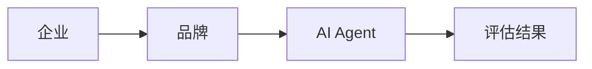
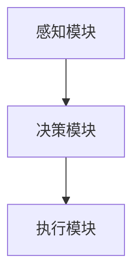
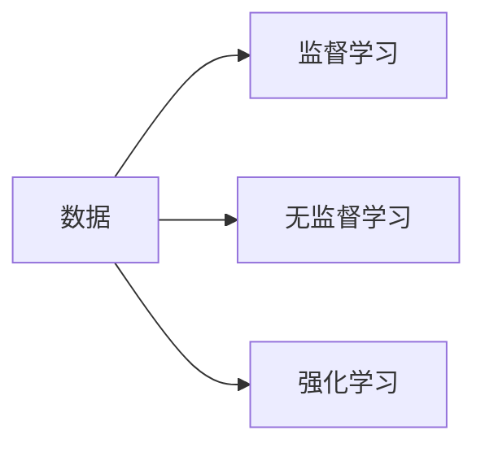
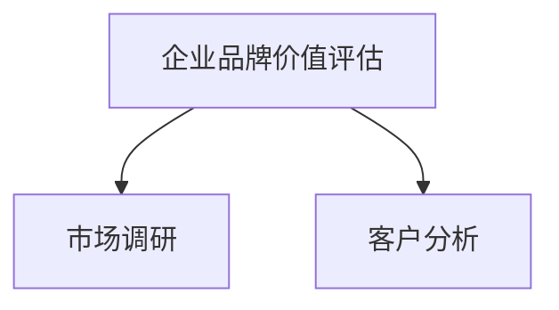

                 

### 第一部分: 引言与背景

#### 第1章: 引言

##### 1.1 问题背景

在当今高度竞争的商业环境中，企业品牌价值的评估显得尤为重要。品牌价值不仅反映了一个企业的市场地位，还对其在资本市场中的表现有直接影响。然而，当前的企业品牌价值评估仍然存在诸多难题。

**问题描述**：在当前的市场环境中，企业品牌价值的评估存在以下几个主要问题：

1. **数据获取困难**：企业品牌价值评估需要大量的数据支持，但许多数据来源不公开或难以获取。
2. **评估方法单一**：目前普遍使用的评估方法大多是财务指标分析，忽视了品牌认知度、市场份额等软性因素。
3. **主观判断影响**：品牌价值评估往往依赖于专家的主观判断，缺乏客观性。
4. **评估过程复杂**：品牌价值评估需要多个步骤，流程繁琐，耗时较长。

**问题解决**：为了解决上述问题，引入AI Agent作为智能评估工具，具有以下优势：

1. **数据获取自动化**：AI Agent可以通过互联网爬虫、大数据分析等方式，自动获取企业相关数据。
2. **评估方法多样化**：AI Agent可以利用机器学习算法，结合多种数据来源，进行多维度的品牌价值评估。
3. **评估结果客观**：AI Agent基于算法模型，减少了主观判断的影响，评估结果更加客观。
4. **评估过程高效**：AI Agent能够快速处理大量数据，简化评估流程，提高效率。

##### 1.1.2 AI Agent的概述与特点

**核心概念**：AI Agent是指一种能够执行特定任务的智能体，具有自主决策、自主学习、自主执行的能力。

**概念属性特征对比表格**：

| 特征             | 智能体A       | 智能体B       | AI Agent           |
|------------------|---------------|---------------|--------------------|
| 自主决策         | 是            | 否            | 是                 |
| 自主学习         | 否            | 是            | 是                 |
| 自主执行         | 否            | 否            | 是                 |

**ER实体关系图架构**：

在这个ER实体关系图中，企业通过品牌与AI Agent建立关联，AI Agent负责对企业品牌进行评估，并输出评估结果。

##### 1.2 AI Agent在企业品牌价值评估中的应用前景

**概念联系**：AI Agent在企业品牌价值评估中的应用，是人工智能技术在商业领域的深度应用。

- **潜在应用领域**：AI Agent在企业品牌价值评估中的应用包括但不限于以下几个方面：

  1. **品牌价值评估**：利用AI Agent进行市场分析、竞争对手分析，提供多维度的品牌价值评估。
  2. **市场调研**：自动收集和分析市场数据，提供决策支持。
  3. **客户分析**：识别客户需求，提供个性化服务。

- **企业采用AI Agent的优势**：

  - **提升效率**：快速、准确地完成品牌价值评估。
  - **降低成本**：减少人力成本，提高运营效率。
  - **提升准确性**：基于大数据分析，提供更加精确的品牌价值评估。

- **AI Agent应用的挑战与机遇**：

  - **挑战**：数据隐私、模型训练成本、算法透明度等。
  - **机遇**：市场需求的增加，技术进步，为企业带来新的商业模式。

##### 1.3 本章小结

本章介绍了企业品牌价值评估的现状以及AI Agent的概述与特点，分析了AI Agent在企业品牌价值评估中的应用前景，为后续章节的深入讨论奠定了基础。

---

# 第二部分: AI Agent的核心原理

## 第2章: AI Agent的基础原理

##### 2.1 AI Agent的组成结构

AI Agent的组成结构是其能够执行特定任务的基础。一般来说，AI Agent主要由以下几个模块组成：

**感知模块**：感知模块是AI Agent与外部环境的接口，它负责接收和处理外部信息。这些信息可以来自不同的数据源，例如传感器、网络数据等。感知模块的主要功能是识别并提取有用的数据，以便后续处理。

**决策模块**：决策模块是AI Agent的核心，它负责根据感知模块提供的信息，进行推理和决策。决策模块通常包含一个或多个决策算法，这些算法可以基于统计学、机器学习、深度学习等方法，以实现复杂的决策过程。

**执行模块**：执行模块是AI Agent将决策转化为实际行动的部分。它负责根据决策模块的决策结果，执行具体的任务。执行模块可以与外部环境进行交互，实现AI Agent的自主行动。

**核心模块**：

- **感知模块**：接收外部信息，识别并提取有用数据。
- **决策模块**：基于感知模块的数据，进行决策。
- **执行模块**：执行决策结果，完成特定任务。

**概念联系**：AI Agent的组成结构是其能够执行特定任务的基础。

- **感知模块**：感知模块是AI Agent与外部环境的接口，它负责接收和处理外部信息。
- **决策模块**：决策模块是AI Agent的核心，它负责根据感知模块提供的信息，进行推理和决策。
- **执行模块**：执行模块是AI Agent将决策转化为实际行动的部分。

**ER实体关系图架构**：

在这个ER实体关系图中，感知模块、决策模块和执行模块之间形成了一个闭环，构成了AI Agent的基本结构。

##### 2.2 AI Agent的学习算法

AI Agent的学习算法是其进行自主学习和决策的关键。学习算法可以分为以下几类：

**监督学习**：监督学习是一种常见的机器学习方法，其输入是已标记的数据集，输出是标记。AI Agent通过学习这些输入和输出的关系，来预测新的输出。例如，在品牌价值评估中，AI Agent可以学习企业历史数据与其品牌价值之间的关系，从而预测未来某个时间点的品牌价值。

**无监督学习**：无监督学习没有预先标记的输入数据，其目标是发现数据中的内在结构和模式。AI Agent通过无监督学习，可以自动识别数据中的隐藏特征，从而进行有效的品牌价值评估。

**强化学习**：强化学习是一种通过与环境交互来学习决策策略的方法。AI Agent通过与环境的交互，不断调整其行为策略，以最大化累积奖励。在品牌价值评估中，AI Agent可以通过强化学习，优化其评估方法，提高评估准确性。

**常见学习算法**：

- **监督学习**：输入-输出对，模型通过学习数据来预测新的输出。
- **无监督学习**：没有预先标记的输入数据，模型通过学习数据的内在结构来发现数据模式。
- **强化学习**：通过与环境的交互来学习决策策略，最大化累积奖励。

**概念联系**：学习算法是AI Agent进行自主学习和决策的关键。

- **监督学习**：通过输入-输出对，模型学习预测新的输出。
- **无监督学习**：通过学习数据的内在结构，发现数据模式。
- **强化学习**：通过与环境的交互，学习优化决策策略。

**ER实体关系图架构**：

在这个ER实体关系图中，数据通过不同的学习算法，转化为AI Agent的决策输入，进而实现自主学习和决策。

##### 2.3 AI Agent的应用场景

AI Agent在不同应用场景中的具体实现和优化有所不同。以下是几个典型的应用场景：

**企业品牌价值评估**：AI Agent可以通过分析企业历史数据、市场趋势、竞争对手情况等多维度数据，提供精准的品牌价值评估。在这个过程中，AI Agent需要不断优化其学习算法，提高评估准确性。

**市场调研**：AI Agent可以自动收集市场数据，分析消费者行为，为企业提供市场预测和分析报告。在这个过程中，AI Agent需要利用无监督学习和监督学习相结合的方法，从海量数据中提取有价值的信息。

**客户分析**：AI Agent可以通过分析客户行为数据，识别客户需求，提供个性化服务。在这个过程中，AI Agent需要利用强化学习，不断调整其策略，以最大化客户满意度。

**应用场景**：

- **企业品牌价值评估**：利用AI Agent进行市场分析、竞争对手分析等。
- **市场调研**：自动收集和分析市场数据，提供决策支持。
- **客户分析**：识别客户需求，提供个性化服务。

**概念联系**：AI Agent在不同应用场景中的具体实现和优化，取决于场景的具体需求和数据特点。

- **企业品牌价值评估**：利用AI Agent进行市场分析、竞争对手分析。
- **市场调研**：自动收集和分析市场数据，提供决策支持。
- **客户分析**：识别客户需求，提供个性化服务。

**ER实体关系图架构**：

在这个ER实体关系图中，AI Agent在不同应用场景中的具体功能和应用得到了清晰的展示。

##### 2.4 本章小结

本章介绍了AI Agent的基础原理，包括组成结构、学习算法和应用场景，为后续章节的深入讨论提供了理论基础。

---

# 第三部分: AI Agent在企业品牌价值评估中的应用

## 第3章: AI Agent在企业品牌价值评估中的具体应用

AI Agent在企业品牌价值评估中的应用，是人工智能技术在商业领域的深度应用。在本章节中，我们将探讨AI Agent如何通过数据收集、分析处理、价值评估等多个环节，为企业提供精准的品牌价值评估服务。

### 3.1 数据收集

数据收集是AI Agent进行品牌价值评估的基础。为了确保数据的准确性和完整性，AI Agent需要从多个渠道收集数据，包括但不限于以下几种：

**市场数据**：通过市场调研公司、行业报告、竞争分析工具等渠道，获取与企业品牌相关的市场数据，如市场份额、品牌认知度、消费者满意度等。

**财务数据**：从企业的财务报表中获取财务数据，包括利润、营收、现金流等指标，这些数据可以反映企业的财务健康状况。

**社交媒体数据**：通过社交媒体平台，如微博、微信、Twitter等，收集消费者对企业品牌的讨论和反馈，了解品牌在公众中的形象。

**新闻报道**：从新闻媒体获取关于企业的新闻报道，分析企业的社会形象和公众态度。

**竞争对手数据**：收集同行业竞争对手的品牌价值数据，对比分析企业品牌价值在行业中的位置。

**数据收集渠道**：

- **市场调研公司**：获取行业报告、竞争分析等。
- **企业财务报表**：获取利润、营收、现金流等指标。
- **社交媒体平台**：收集消费者讨论和反馈。
- **新闻媒体**：获取企业新闻报道。
- **竞争对手数据**：对比分析行业品牌价值。

### 3.2 数据处理

收集到大量数据后，AI Agent需要对数据进行处理，以确保数据的质量和一致性。数据处理主要包括以下步骤：

**数据清洗**：去除数据中的噪音和错误，如重复数据、缺失值、异常值等。通过数据清洗，确保数据的准确性和完整性。

**数据整合**：将来自不同渠道的数据进行整合，形成统一的视图。例如，将社交媒体数据与财务数据进行整合，以全面分析企业品牌价值。

**数据标准化**：对数据进行标准化处理，使其具有可比性。例如，将不同时间点的数据进行换算，使其反映相同的财务指标。

**特征提取**：从原始数据中提取有价值的信息，形成特征向量。特征提取是AI Agent进行品牌价值评估的关键步骤，通过提取关键特征，可以更准确地预测品牌价值。

**数据处理流程**：

1. **数据清洗**：去除噪音和错误。
2. **数据整合**：形成统一视图。
3. **数据标准化**：确保数据的可比性。
4. **特征提取**：提取关键特征。

### 3.3 价值评估

在数据处理完成后，AI Agent开始进行品牌价值评估。品牌价值评估涉及多个维度，如财务维度、市场维度、社会维度等。以下是具体的评估步骤：

**财务维度评估**：基于财务数据，计算企业的盈利能力、成长性、稳定性等指标。例如，通过计算市盈率（PE）、市净率（PB）、营收增长率等指标，评估企业的财务健康程度。

**市场维度评估**：基于市场数据，分析企业的市场份额、品牌知名度、消费者满意度等指标。例如，通过分析市场份额的变化趋势，评估企业在市场中的竞争力。

**社会维度评估**：基于社交媒体和新闻报道，分析企业的社会形象和公众态度。例如，通过分析社交媒体上的讨论和反馈，评估品牌在社会中的影响力。

**评估指标**：

1. **财务维度**：盈利能力、成长性、稳定性等。
2. **市场维度**：市场份额、品牌知名度、消费者满意度等。
3. **社会维度**：社会形象、公众态度等。

**价值评估流程**：

1. **财务维度评估**：计算财务指标。
2. **市场维度评估**：分析市场指标。
3. **社会维度评估**：分析社会指标。
4. **综合评估**：整合三个维度的评估结果，形成最终的品牌价值评估。

### 3.4 应用案例

以下是一个应用案例，展示AI Agent如何帮助企业进行品牌价值评估：

**案例背景**：某家互联网公司希望了解其品牌价值，并制定相应的品牌提升策略。

**数据收集**：AI Agent从多个渠道收集数据，包括市场数据（市场份额、品牌知名度）、财务数据（利润、营收）、社交媒体数据（消费者讨论和反馈）、新闻报道（企业形象）等。

**数据处理**：AI Agent对收集到的数据进行清洗、整合和标准化处理，提取关键特征。

**价值评估**：AI Agent根据财务维度、市场维度和社会维度的评估结果，综合评估该互联网公司的品牌价值。

**评估结果**：AI Agent给出了品牌价值的详细评估报告，指出该互联网公司的品牌价值较高，但在某些方面（如消费者满意度）仍有提升空间。

**品牌提升策略**：基于评估报告，企业制定了相应的品牌提升策略，包括加强市场推广、优化消费者体验、提高社会形象等。

**案例小结**：通过AI Agent的品牌价值评估，企业能够全面了解自身的品牌价值，有针对性地制定品牌提升策略，从而提高品牌竞争力。

### 3.5 本章小结

本章详细介绍了AI Agent在企业品牌价值评估中的应用，从数据收集、数据处理到价值评估，每个环节都有其独特的实现方法和技术。通过AI Agent的应用，企业能够更准确地评估品牌价值，制定有效的品牌提升策略，提高品牌竞争力。

---

### 第4章: AI Agent在企业品牌价值评估中的效果评估与优化

随着AI Agent在企业品牌价值评估中的应用日益广泛，评估其效果和持续优化成为关键任务。本章节将探讨如何评估AI Agent在品牌价值评估中的效果，并提出优化策略。

#### 4.1 效果评估

评估AI Agent在企业品牌价值评估中的效果，可以从以下几个方面进行：

**准确性评估**：评估AI Agent预测的品牌价值与实际品牌价值的接近程度。可以使用误差指标，如均方误差（MSE）、均方根误差（RMSE）等，来衡量预测准确性。

**效率评估**：评估AI Agent处理数据和分析品牌价值的速度。通过比较AI Agent与其他评估方法的处理时间，衡量AI Agent的效率。

**稳定性评估**：评估AI Agent在不同数据集上的表现，确保其评估结果的稳定性。

**用户满意度评估**：通过用户调查和反馈，了解用户对AI Agent品牌价值评估的满意度，包括评估结果的可靠性、易用性等方面。

**效果评估指标**：

- **准确性评估**：均方误差（MSE）、均方根误差（RMSE）。
- **效率评估**：处理时间。
- **稳定性评估**：在不同数据集上的表现。
- **用户满意度评估**：用户调查和反馈。

#### 4.2 优化策略

为了提高AI Agent在企业品牌价值评估中的效果，可以采取以下优化策略：

**算法优化**：根据评估结果，对AI Agent的算法进行优化。例如，如果发现预测准确性较低，可以尝试调整模型参数、引入新的特征等。

**数据源扩展**：增加数据源，丰富数据维度。例如，可以引入更多社交媒体数据、竞争对手数据等，以提升评估结果的全面性。

**数据处理优化**：改进数据清洗、整合和标准化方法，提高数据质量。例如，使用更先进的去噪技术和特征提取方法，确保数据的准确性和一致性。

**模型训练**：定期更新模型，使其适应新的市场环境和数据特点。通过不断训练和优化模型，提高其预测能力和稳定性。

**用户反馈机制**：建立用户反馈机制，收集用户对AI Agent评估结果的反馈，并据此调整评估策略。例如，根据用户反馈，优化评估指标、调整预测策略等。

**优化策略**：

- **算法优化**：调整模型参数、引入新特征。
- **数据源扩展**：增加数据源、丰富数据维度。
- **数据处理优化**：提高数据质量、使用先进技术。
- **模型训练**：定期更新模型、适应新环境。
- **用户反馈机制**：收集用户反馈、调整评估策略。

#### 4.3 实际案例

以下是一个实际案例，展示如何评估和优化AI Agent在企业品牌价值评估中的效果：

**案例背景**：某电商企业使用AI Agent评估其品牌价值，并希望优化评估效果。

**效果评估**：

- **准确性评估**：通过比较AI Agent预测的品牌价值与实际品牌价值，计算均方误差（MSE），发现预测准确度较高。
- **效率评估**：AI Agent处理数据和分析品牌价值的时间较传统方法显著缩短。
- **稳定性评估**：在不同时间点的数据集上，AI Agent的评估结果保持稳定。
- **用户满意度评估**：用户调查结果显示，用户对AI Agent评估结果的满意度较高。

**优化策略**：

- **算法优化**：引入新的机器学习算法，如深度学习，提高预测准确性。
- **数据源扩展**：增加消费者购买行为数据，以更全面地评估品牌价值。
- **数据处理优化**：使用更先进的数据清洗和特征提取技术，提高数据质量。
- **模型训练**：定期更新模型，使其适应新的市场环境和数据变化。
- **用户反馈机制**：建立用户反馈机制，收集用户对评估结果的反馈，并据此调整评估策略。

**优化效果**：

- **准确性评估**：引入深度学习后，AI Agent的预测准确性进一步提升。
- **效率评估**：数据处理速度明显提高，评估时间缩短。
- **稳定性评估**：评估结果在不同数据集上保持高度一致性。
- **用户满意度评估**：用户满意度显著提高，评估结果更加可靠。

**案例小结**：通过效果评估和优化策略，AI Agent在品牌价值评估中的效果得到了显著提升，为企业提供了更有价值的品牌评估服务。

### 4.4 本章小结

本章详细探讨了AI Agent在企业品牌价值评估中的效果评估与优化策略。通过准确的评估方法和有效的优化策略，企业可以不断提高AI Agent的品牌价值评估效果，为企业的战略决策提供有力支持。

---

### 总结

本文从多个角度详细探讨了AI Agent在企业品牌价值评估中的应用。首先，我们介绍了企业品牌价值评估的现状和问题，并提出了AI Agent作为解决方案的潜力。接着，我们深入分析了AI Agent的基础原理，包括组成结构、学习算法和应用场景。随后，我们探讨了AI Agent在企业品牌价值评估中的具体应用，从数据收集、数据处理到价值评估，展示了AI Agent的强大功能。最后，我们评估了AI Agent的效果，并提出了优化策略，以进一步提高评估准确性。

AI Agent在企业品牌价值评估中的应用，不仅提升了评估的效率和准确性，还为企业提供了更加全面和深入的品牌价值分析。随着人工智能技术的不断进步，AI Agent在企业品牌价值评估中的应用前景将更加广阔。未来，企业可以充分利用AI Agent的优势，制定更加精准的品牌战略，提升品牌竞争力。

### 扩展阅读

1. **《机器学习实战》**：这是一本关于机器学习应用的经典书籍，详细介绍了各种机器学习算法在实际场景中的应用，包括品牌价值评估等。

2. **《深度学习》**：由Ian Goodfellow等人撰写的深度学习入门书籍，介绍了深度学习的基础理论和实践应用，适合希望深入了解AI Agent的企业和开发者。

3. **《品牌管理》**：这是一本关于品牌管理的经典教材，详细介绍了品牌价值评估的方法和策略，对于理解AI Agent在品牌价值评估中的应用有很大帮助。

4. **《人工智能：一种现代方法》**：这是一本全面的关于人工智能的教材，涵盖了人工智能的各个方面，包括智能体的设计和应用，对于想要深入了解AI Agent的读者来说，是一本很好的参考资料。

### 注意事项

1. **数据隐私**：在使用AI Agent进行品牌价值评估时，需要注意数据隐私保护，确保收集和处理的数据符合相关法律法规。

2. **算法透明度**：AI Agent的评估结果需要具备透明度，企业应该了解评估过程中的算法和决策依据，以便对结果进行监督和验证。

3. **持续优化**：AI Agent的评估效果需要定期评估和优化，以适应不断变化的市场环境。

4. **用户反馈**：收集用户反馈，根据用户需求调整AI Agent的评估策略，以提高用户满意度。

