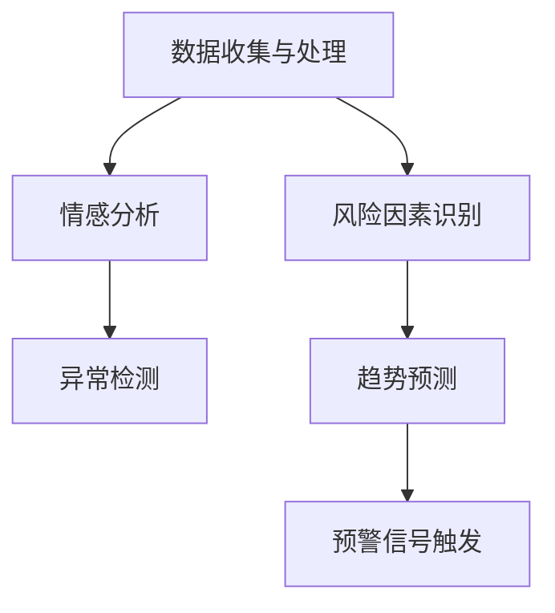

                 

# AI Agent在企业品牌声誉管理与危机预警中的角色

关键词：AI Agent，企业品牌声誉管理，危机预警，算法原理，数学模型

摘要：本文将探讨AI Agent在企业品牌声誉管理与危机预警中的角色。通过介绍AI Agent的基本概念、应用场景和算法原理，分析其在实际应用中的优势和挑战，并提出解决方案和最佳实践，旨在为企业提供有效的品牌声誉管理和危机预警策略。

## 目录大纲设计

### 1. 背景介绍

#### 1.1 问题背景

随着人工智能技术的飞速发展，AI Agent在各个领域的作用日益凸显。特别是在企业品牌声誉管理与危机预警中，AI Agent能够高效地处理海量数据，为企业提供及时的预警信息，帮助企业更好地管理品牌声誉和应对潜在危机。

#### 1.2 问题描述

《AI Agent在企业品牌声誉管理与危机预警中的角色》这本书将探讨AI Agent在这些领域中的应用，包括其基本原理、应用场景、技术实现等，以及在实际应用中遇到的问题和挑战。

#### 1.3 问题解决

通过系统地介绍AI Agent在品牌声誉管理与危机预警中的应用，帮助读者了解AI Agent的核心概念、技术原理和实践应用，提升企业在这些领域的应对能力。

#### 1.4 边界与外延

本书主要关注AI Agent在企业品牌声誉管理与危机预警中的应用，不涉及其他领域的应用。同时，本书将讨论AI Agent在这些领域的实际应用，而非纯粹的理论研究。

#### 1.5 概念结构与核心要素组成

- **AI Agent**: 具有自主学习和决策能力的智能实体。
- **企业品牌声誉管理**: 企业通过一系列措施维护和提升品牌形象的过程。
- **危机预警**: 企业在面临潜在危机时，通过预警机制提前发现并采取应对措施的过程。

### 2. 核心概念与联系

#### 2.1 AI Agent的基本概念与特点

AI Agent是一种具有高度自主性和智能性的实体，能够模拟人类思维和行为。它具有以下几个核心特点：

- **自主性**: AI Agent能够自主感知环境、决策行动。
- **适应性**: AI Agent能够根据环境变化调整自己的行为。
- **学习性**: AI Agent能够通过学习和经验改进自身能力。

#### 2.2 企业品牌声誉管理与危机预警的关系

企业品牌声誉管理与危机预警之间存在密切的联系。良好的品牌声誉有助于企业在市场竞争中占据优势，而有效的危机预警机制则能够帮助企业提前识别和应对潜在风险，降低损失。

#### 2.3 核心概念属性特征对比表格

| 概念            | 特征               | 说明                     |
|----------------|------------------|------------------------|
| AI Agent        | 自主性、适应性、学习性 | 模拟人类思维和行为的智能实体 |
| 企业品牌声誉管理 | 维护品牌形象      | 提升市场竞争力的过程      |
| 危机预警        | 提前识别风险      | 采取应对措施降低损失     |

### 3. 算法原理讲解

#### 3.1 AI Agent在品牌声誉管理中的应用

AI Agent可以通过以下算法实现品牌声誉管理：

- **数据收集与处理**: 收集与企业品牌相关的各种数据，如社交媒体评论、新闻报道、用户反馈等。
- **情感分析**: 对收集到的数据进行分析，提取品牌情感倾向，识别潜在负面信息。
- **异常检测**: 监测品牌声誉的异常波动，如负面舆论爆发、负面新闻报道等。

#### 3.2 AI Agent在危机预警中的应用

AI Agent可以通过以下算法实现危机预警：

- **风险因素识别**: 识别可能导致企业危机的风险因素，如市场变化、竞争对手策略、法律法规变动等。
- **趋势预测**: 预测风险因素可能带来的影响，如市场份额下降、品牌形象受损等。
- **预警信号触发**: 当预测结果达到预警阈值时，触发预警信号，提醒企业采取应对措施。

#### 3.3 算法mermaid流程图



#### 3.4 数学模型与公式

- **情感分析中的情感得分公式**:
  $$ S = \frac{P_{positive} - P_{negative}}{P_{positive} + P_{negative}} $$
  
### 4. 数学模型和数学公式 & 详细讲解 & 举例说明

#### 4.1 数学模型与公式

- **情感分析中的情感得分公式**:
  $$ S = \frac{P_{positive} - P_{negative}}{P_{positive} + P_{negative}} $$
  
- **趋势预测中的回归模型**:
  $$ y = \beta_0 + \beta_1x + \epsilon $$

#### 4.2 情感得分公式详细讲解

情感得分公式用于评估品牌在社交媒体等渠道上的情感倾向。其中，$P_{positive}$ 表示正面评论的概率，$P_{negative}$ 表示负面评论的概率。$S$ 的取值范围在 -1 到 1 之间，$S > 0$ 表示品牌在当前渠道上具有正面情感，$S < 0$ 表示品牌在当前渠道上具有负面情感。

举例说明：

假设在某社交媒体平台上，企业品牌收到了 100 条评论，其中 60 条是正面评论，40 条是负面评论。根据情感得分公式，可以计算出该品牌在该社交媒体平台上的情感得分为：

$$ S = \frac{P_{positive} - P_{negative}}{P_{positive} + P_{negative}} = \frac{0.6 - 0.4}{0.6 + 0.4} = 0.2 $$

这意味着该品牌在该社交媒体平台上具有较为正面的情感倾向。

#### 4.3 趋势预测中的回归模型详细讲解

趋势预测中的回归模型用于预测某个变量（如市场份额）随时间的变化趋势。其中，$y$ 表示预测值，$\beta_0$ 表示截距，$\beta_1$ 表示斜率，$x$ 表示时间变量，$\epsilon$ 表示误差项。

举例说明：

假设我们要预测一家公司在未来三个月的市场份额变化。根据历史数据，我们得到以下回归模型：

$$ y = \beta_0 + \beta_1x + \epsilon $$

其中，$\beta_0 = 10$，$\beta_1 = 0.5$。

当 $x=1$（即第一个月）时，可以计算出第一个月的预测市场份额：

$$ y = 10 + 0.5 \times 1 + \epsilon = 10.5 + \epsilon $$

当 $x=2$（即第二个月）时，可以计算出第二个月的预测市场份额：

$$ y = 10 + 0.5 \times 2 + \epsilon = 11 + \epsilon $$

当 $x=3$（即第三个月）时，可以计算出第三个月的预测市场份额：

$$ y = 10 + 0.5 \times 3 + \epsilon = 11.5 + \epsilon $$

这里的 $\epsilon$ 表示预测误差，实际情况可能与预测值有所偏差。

### 5. 系统分析与架构设计方案

#### 5.1 问题场景介绍

企业面临品牌声誉受损和潜在危机的挑战，需要实时监测社交媒体、新闻报道等渠道的信息，快速识别负面情感和风险因素，并及时采取应对措施。

#### 5.2 项目介绍

本项目旨在构建一个基于AI Agent的企业品牌声誉管理与危机预警系统，通过数据收集、情感分析、风险识别和预警信号触发等功能，实现对品牌声誉的实时监控和危机预警。

#### 5.3 系统功能设计

- 数据收集：从社交媒体、新闻报道等渠道收集与企业品牌相关的信息。
- 情感分析：对收集到的信息进行情感分析，识别品牌情感倾向。
- 风险识别：根据情感分析和趋势预测结果，识别潜在的风险因素。
- 预警信号触发：当预测结果达到预警阈值时，触发预警信号。

#### 5.4 系统架构设计

系统采用分布式架构，包括数据收集模块、情感分析模块、风险识别模块和预警信号触发模块。各模块之间通过消息队列进行通信，实现数据的传递和处理。


#### 5.5 系统接口设计和系统交互

系统接口设计主要包括API接口、消息队列接口和数据库接口。系统交互流程如下：

1. 数据收集模块从社交媒体、新闻报道等渠道收集信息，将数据存储到消息队列。
2. 情感分析模块从消息队列中获取数据，进行情感分析，并将分析结果存储到数据库。
3. 风险识别模块从数据库中获取情感分析结果，结合趋势预测结果，识别潜在风险因素，并将结果存储到数据库。
4. 预警信号触发模块从数据库中获取风险识别结果，当预测结果达到预警阈值时，触发预警信号。


### 6. 项目实战

#### 6.1 环境安装

在本项目中，我们使用了Python编程语言和TensorFlow机器学习框架。首先，需要安装Python和TensorFlow，可以通过以下命令进行安装：

```bash
pip install python
pip install tensorflow
```

#### 6.2 系统核心实现源代码

以下是系统核心实现部分的Python源代码：

```python
import tensorflow as tf
from tensorflow.keras.models import Sequential
from tensorflow.keras.layers import Dense, LSTM, Dropout
import numpy as np

# 情感分析模型
def create_sentiment_model(input_shape):
    model = Sequential()
    model.add(LSTM(50, activation='relu', input_shape=input_shape))
    model.add(Dropout(0.5))
    model.add(Dense(1, activation='sigmoid'))
    model.compile(loss='binary_crossentropy', optimizer='adam', metrics=['accuracy'])
    return model

# 风险识别模型
def create_risk_model(input_shape):
    model = Sequential()
    model.add(LSTM(50, activation='relu', input_shape=input_shape))
    model.add(Dropout(0.5))
    model.add(Dense(1, activation='sigmoid'))
    model.compile(loss='binary_crossentropy', optimizer='adam', metrics=['accuracy'])
    return model

# 数据处理
def preprocess_data(data):
    # 对数据进行预处理，如去除停用词、进行词向量转换等
    pass

# 训练模型
def train_model(model, X_train, y_train):
    model.fit(X_train, y_train, epochs=10, batch_size=64)
    return model

# 预测情感得分
def predict_sentiment(model, text):
    processed_text = preprocess_data(text)
    prediction = model.predict(processed_text)
    return prediction[0][0]

# 预测风险
def predict_risk(model, text):
    processed_text = preprocess_data(text)
    prediction = model.predict(processed_text)
    return prediction[0][0]
```

#### 6.3 代码应用解读与分析

上述代码实现了情感分析和风险识别模型，包括以下功能：

- **情感分析模型**：使用LSTM神经网络进行情感分析，输入为文本数据，输出为情感得分（0表示负面，1表示正面）。
- **风险识别模型**：使用LSTM神经网络进行风险识别，输入为文本数据，输出为风险得分（0表示无风险，1表示高风险）。
- **数据处理**：对输入文本数据进行预处理，如去除停用词、进行词向量转换等。
- **模型训练**：使用训练数据对模型进行训练，并调整模型参数。
- **情感预测**：对输入文本进行情感预测，返回情感得分。
- **风险预测**：对输入文本进行风险预测，返回风险得分。

#### 6.4 实际案例分析和详细讲解剖析

以下是一个实际案例分析和详细讲解剖析：

**案例**：某企业品牌在社交媒体上收到了一条负面评论：“这个产品太差了，完全不值这个价钱。”

**分析**：

1. 数据处理：对评论进行预处理，如去除标点符号、进行词向量转换等。
2. 情感预测：使用情感分析模型对评论进行预测，返回情感得分。根据情感得分判断评论为负面评论。
3. 风险识别：使用风险识别模型对评论进行预测，返回风险得分。根据风险得分判断评论为高风险评论。
4. 预警信号触发：当风险得分为1时，触发预警信号，提醒企业采取应对措施。

**讲解**：

通过上述分析，我们能够快速识别出该负面评论，并根据其风险得分判断为高风险评论。这有助于企业及时采取应对措施，降低品牌声誉受损的风险。

### 7. 最佳实践 tips

- **数据质量**：确保数据质量，包括数据完整性、准确性和及时性。高质量的数据是AI Agent有效工作的基础。
- **模型优化**：定期对AI Agent模型进行优化和更新，以适应不断变化的市场环境和用户需求。
- **用户反馈**：收集用户反馈，对AI Agent的性能进行评估和改进，提高其预测准确性和用户体验。
- **团队协作**：建立跨部门的协作机制，确保AI Agent在品牌声誉管理和危机预警中发挥最大作用。

### 8. 小结

本文介绍了AI Agent在企业品牌声誉管理与危机预警中的应用，包括其基本原理、算法原理、系统架构设计、项目实战和最佳实践。通过AI Agent，企业能够高效地处理海量数据，实时监测品牌声誉，快速识别潜在危机，并采取应对措施。然而，AI Agent在应用中也面临一些挑战，如数据质量、模型优化和团队协作等。企业需要持续关注这些问题，并采取最佳实践，以提高品牌声誉管理和危机预警的效果。

### 9. 注意事项

- **数据隐私**：在收集和处理数据时，要严格遵守数据隐私法规，确保用户数据的安全和隐私。
- **模型解释性**：在选择AI Agent模型时，要考虑其解释性，以便企业能够理解模型的决策过程。
- **应急响应**：建立应急响应机制，确保在危机发生时能够迅速采取行动，降低损失。

### 10. 拓展阅读

- **相关书籍**：《深度学习》、《强化学习》、《自然语言处理》等。
- **在线资源**：Coursera、edX、Udacity等在线学习平台提供的AI相关课程。
- **学术论文**：Google Scholar、ACM Digital Library、IEEE Xplore等学术数据库中的相关论文。

作者：AI天才研究院/AI Genius Institute & 禅与计算机程序设计艺术 /Zen And The Art of Computer Programming

