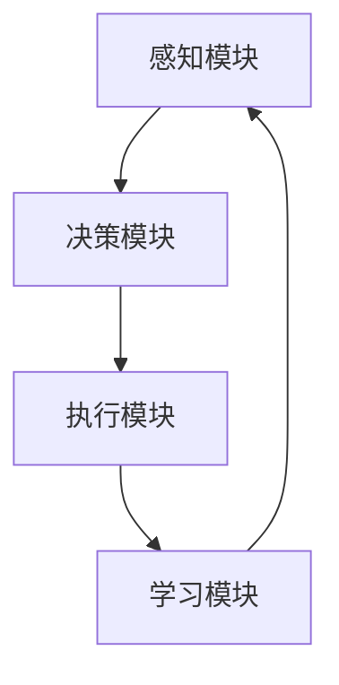
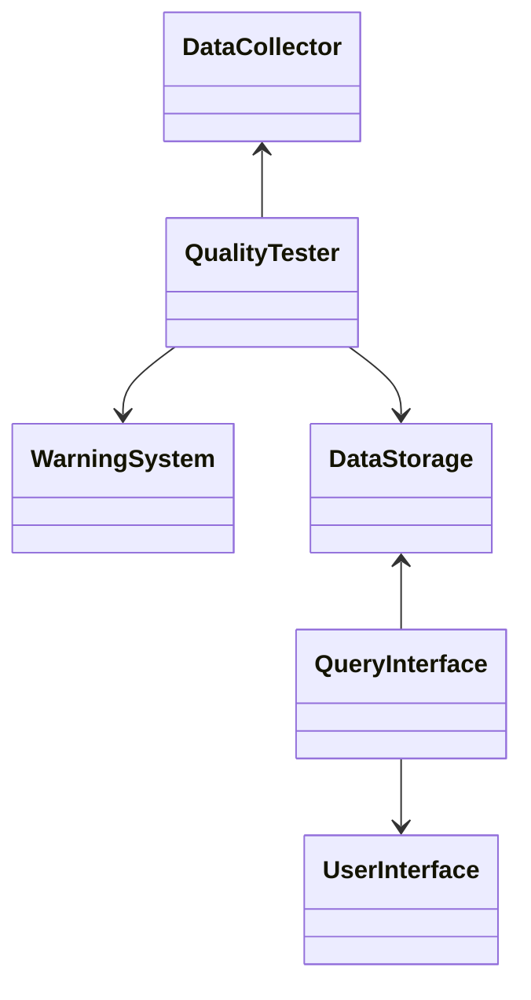
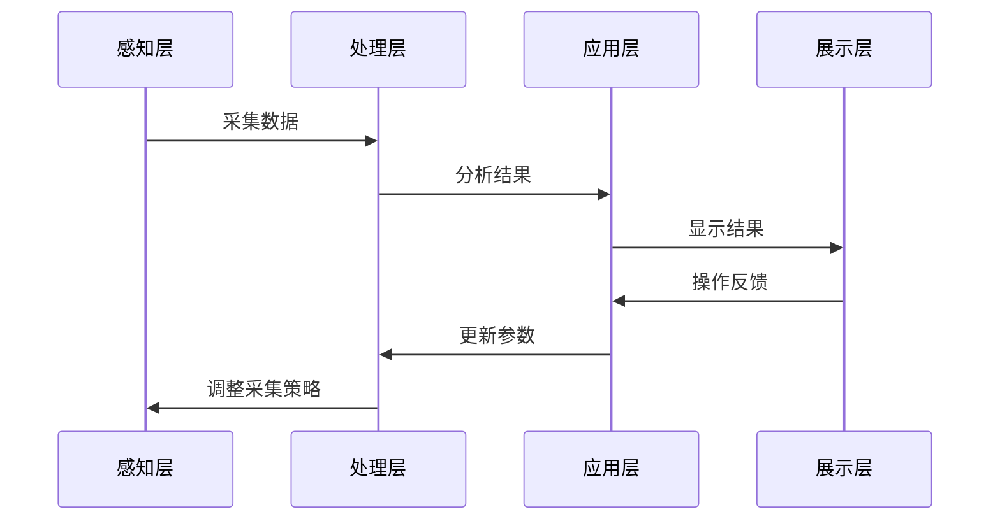
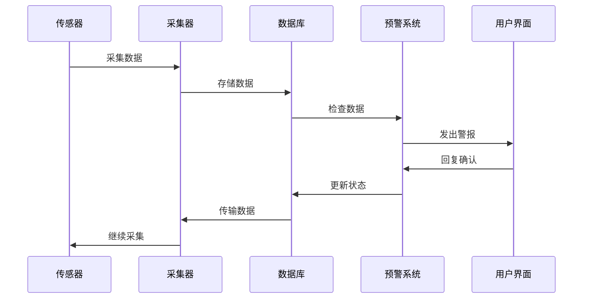

                 

### 目录大纲设计思路

在设计《AI Agent在企业品质管理与持续改进中的应用》的目录大纲时，我们需要遵循一系列逻辑和结构化原则，以确保内容既丰富又易于理解。以下是具体的设计思路：

**1. 引言：**

首先，我们需要引言部分，简要介绍AI Agent在企业品质管理与持续改进中的重要性，为读者建立一个初步的了解和兴趣。这部分可以包括问题背景、研究目的和预期成果。

**2. 背景介绍：**

接下来，进入背景介绍部分，详细介绍AI Agent和企业品质管理的概念。首先定义AI Agent，解释其核心概念和特点，然后阐述企业品质管理的问题背景和当前存在的问题，最后明确研究的边界与外延，确保读者对整个领域有一个清晰的了解。

**3. 核心概念与联系：**

在这一部分，我们将深入探讨AI Agent与企业品质管理的联系。具体包括：

- **3.1 AI Agent的定义与特点**：详细描述AI Agent的定义、功能和应用场景。
- **3.2 AI Agent与企业品质管理的联系**：分析AI Agent在企业品质管理中的作用和优势。
- **3.3 AI Agent的属性特征对比表格**：通过表格形式对比AI Agent与其他相关技术的属性特征，帮助读者更好地理解其独特性。
- **3.4 AI Agent的ER实体关系图架构**：使用Mermaid流程图展示AI Agent在企业品质管理中的实体关系，使读者能够直观地理解系统的整体架构。

**4. AI Agent算法原理：**

在这一部分，我们将详细讲解AI Agent的算法原理。具体包括：

- **4.1 算法原理讲解**：阐述AI Agent算法的基本原理，包括其工作流程和关键步骤。
- **4.2 数学模型与公式**：使用LaTeX格式给出算法的数学模型和公式，并进行详细讲解。
- **4.3 算法Mermaid流程图**：使用Mermaid绘制算法流程图，帮助读者更好地理解算法的实现过程。
- **4.4 Python源代码讲解**：提供Python源代码，并逐行解释代码的功能和实现细节。

**5. AI Agent应用系统分析：**

在这一部分，我们将分析AI Agent应用系统的设计。具体包括：

- **5.1 问题场景介绍**：介绍AI Agent在企业品质管理中的实际应用场景。
- **5.2 系统功能设计**：使用Mermaid绘制领域模型类图，展示系统的核心功能。
- **5.3 系统架构设计**：使用Mermaid绘制系统架构图，展示系统的整体结构和关键组件。
- **5.4 系统接口设计**：详细描述系统对外提供的接口和功能。
- **5.5 系统交互Mermaid序列图**：使用Mermaid绘制系统交互序列图，展示系统内部组件之间的交互关系。

**6. 项目实战：**

在这一部分，我们将通过一个实际项目展示AI Agent的应用。具体包括：

- **6.1 环境安装**：介绍如何搭建项目所需的开发环境。
- **6.2 系统核心实现**：展示系统的核心实现代码，并进行详细解读。
- **6.3 代码解读与分析**：分析代码的实现细节，讨论关键技术和难点。
- **6.4 实际案例分析**：通过实际案例展示AI Agent在企业品质管理中的效果。
- **6.5 项目小结**：总结项目的经验教训，讨论项目的成功之处和改进空间。

**7. 最佳实践与注意事项：**

在这一部分，我们将分享AI Agent应用的最佳实践和注意事项，包括：

- **7.1 最佳实践 tips**：提供实际应用中的经验和技巧。
- **7.2 小结**：对全书内容进行简要总结。
- **7.3 注意事项**：强调应用过程中需要注意的问题和风险。
- **7.4 拓展阅读**：推荐相关的参考资料和扩展阅读。

**8. 总结与展望：**

最后，我们将对全书内容进行总结，并展望AI Agent在企业品质管理与持续改进中的未来发展趋势。

通过以上步骤，我们设计的目录大纲将确保内容的逻辑性和连贯性，使读者能够系统地学习AI Agent在企业品质管理与持续改进中的应用，并从中获得实际的应用经验。

---

**完整目录大纲：**

----------------------------------------------------------------

# AI Agent在企业品质管理与持续改进中的应用

> 关键词：AI Agent，企业品质管理，持续改进，算法原理，系统设计，项目实战，最佳实践

> 摘要：本文深入探讨AI Agent在企业品质管理与持续改进中的应用。首先介绍AI Agent的基本概念和特点，然后详细分析其在企业品质管理中的作用和算法原理，接着展示一个实际项目的系统设计和实现，最后分享最佳实践和注意事项，并对未来发展趋势进行展望。

## 第一部分: 背景介绍

## 第1章: 问题背景与核心概念

### 1.1 问题描述

### 1.2 问题解决

### 1.3 边界与外延

### 1.4 核心概念

## 第2章: 核心概念与联系

### 2.1 AI Agent的定义与特点

### 2.2 AI Agent与企业品质管理的联系

### 2.3 AI Agent的属性特征对比表格

### 2.4 AI Agent的ER实体关系图架构

## 第3章: AI Agent算法原理

### 3.1 算法原理讲解

### 3.2 数学模型与公式

### 3.3 算法Mermaid流程图

### 3.4 Python源代码讲解

## 第4章: AI Agent应用系统分析

### 4.1 问题场景介绍

### 4.2 系统功能设计

### 4.3 系统架构设计

### 4.4 系统接口设计

### 4.5 系统交互Mermaid序列图

## 第5章: 项目实战

### 5.1 环境安装

### 5.2 系统核心实现

### 5.3 代码解读与分析

### 5.4 实际案例分析与详细讲解

### 5.5 项目小结

## 第6章: 最佳实践与注意事项

### 6.1 最佳实践 tips

### 6.2 小结

### 6.3 注意事项

### 6.4 拓展阅读

## 第7章: 总结与展望

### 7.1 全书内容总结

### 7.2 未来发展趋势展望

----------------------------------------------------------------

通过以上详细的目录大纲，我们为读者提供了一个清晰的学习路径，从问题背景到核心概念，再到算法原理和系统设计，以及实战经验和最佳实践，最终进行总结和展望，确保读者能够全面深入地理解AI Agent在企业品质管理与持续改进中的应用。接下来，我们将逐步填充每个章节的内容，确保整个文章的逻辑性和完整性。

---

**第1章：问题背景与核心概念**

### 1.1 问题描述

企业品质管理是一个复杂且至关重要的过程，它直接影响着企业的生产效率、产品质量和客户满意度。传统的企业品质管理往往依赖于人工检查和经验判断，这导致了以下几个问题：

1. **效率低下**：人工检查速度缓慢，难以应对大规模生产。
2. **准确性差**：人为因素容易导致错误，影响产品质量。
3. **成本高**：需要大量的人力资源和时间成本。

为了解决这些问题，企业迫切需要引入自动化和智能化的工具来提高品质管理的效率和准确性。AI Agent作为一种智能化的软件代理，具备自主学习、自主决策和自主执行的能力，成为企业品质管理的一种理想选择。

### 1.2 问题解决

AI Agent在企业品质管理中的应用，可以解决以下几个核心问题：

1. **自动化检测**：AI Agent能够自动化地对产品进行质量检测，提高检测速度和准确性。
2. **实时监控**：AI Agent可以实时监控生产过程，及时发现潜在的质量问题。
3. **数据分析**：AI Agent能够对大量的生产数据进行深度分析，为企业的品质改进提供数据支持。

### 1.3 边界与外延

在本文中，我们主要关注AI Agent在企业品质管理中的应用，这包括以下几个边界和范围：

- **应用场景**：主要涉及生产制造、质量控制、供应链管理等。
- **技术范围**：包括机器学习、深度学习、自然语言处理等人工智能技术。
- **业务范围**：涵盖企业内部的生产、销售、物流等各个环节。

### 1.4 核心概念

为了更好地理解AI Agent在企业品质管理中的应用，我们需要明确以下几个核心概念：

- **AI Agent**：一种能够自主学习、自主决策和自主执行的智能软件代理。
- **品质管理**：确保产品或服务满足既定质量标准的过程。
- **持续改进**：不断优化产品和服务，提高质量和管理效率。

通过以上内容的介绍，读者可以初步了解AI Agent在企业品质管理中的问题和解决方案，为后续章节的深入探讨奠定基础。

---

**第2章：核心概念与联系**

### 2.1 AI Agent的定义与特点

AI Agent，即人工智能代理，是一种具有高度自主性和智能性的软件实体。它能够模拟人类的思维和行为，通过学习、推理和决策，完成特定的任务。AI Agent的主要特点包括：

1. **自主性**：AI Agent能够自主地选择行动方案，而不需要人为的干预。
2. **智能性**：AI Agent具备学习能力，能够从数据中学习并优化自身的性能。
3. **灵活性**：AI Agent能够适应不同的环境和任务，具备很强的适应性。
4. **协作性**：AI Agent能够与其他系统或AI Agent进行协作，共同完成任务。

### 2.2 AI Agent与企业品质管理的联系

AI Agent在企业品质管理中的应用，主要体现在以下几个方面：

1. **自动化检测**：AI Agent可以自动化地对产品进行质量检测，减少人为错误，提高检测效率。
2. **实时监控**：AI Agent可以实时监控生产过程，及时发现问题并采取措施，保证生产质量。
3. **数据分析**：AI Agent可以分析大量的生产数据，识别潜在的质量问题，为企业提供决策支持。

AI Agent在企业品质管理中的优势在于：

- **高效率**：AI Agent能够24小时不间断工作，提高检测和监控的效率。
- **高准确性**：AI Agent不受人为因素的干扰，能够提供更准确的质量检测和监控结果。
- **低成本**：AI Agent可以减少人力成本，降低企业运营成本。

### 2.3 AI Agent的属性特征对比表格

为了更好地理解AI Agent的优势和特点，我们可以通过一个属性特征对比表格来展示AI Agent与其他技术手段的对比：

| 特性               | AI Agent             | 传统人工检测          | 机器视觉系统       |
|--------------------|----------------------|----------------------|-------------------|
| **自主性**         | 高自主性，能自主决策 | 依赖人工操作，低自主性 | 依赖预设程序，自主性低 |
| **智能性**         | 具备学习能力         | 无学习功能            | 具备一定学习能力，但较低 |
| **灵活性**         | 高灵活性，适应性强   | 灵活性较低            | 灵活性中等         |
| **协作性**         | 易于与其他系统协作   | 难以协作，依赖人工操作 | 可协作，但受限较大 |

### 2.4 AI Agent的ER实体关系图架构

为了更直观地理解AI Agent在企业品质管理中的角色和功能，我们可以使用Mermaid绘制一个ER实体关系图，展示AI Agent与各个实体之间的关系：

```mermaid
erDiagram
  Product ||--|{ AI-Agent }|-- Quality-Data
  Production-Line ||--|{ AI-Agent }|-- Real-Time-Monitoring
  Product ||--|{ Supplier-Data }|-- Supply-Chain-Management
  AI-Agent ||--|{ Data-Analysis }|-- Improvement-Recommendations
```

在上图中，AI-Agent是核心实体，它与Product、Production-Line、Supplier-Data等实体之间存在关联关系。具体来说，AI-Agent能够接收Product的数据，进行质量检测，并将结果存储为Quality-Data，同时还能对Production-Line进行实时监控，确保生产过程的顺利进行。此外，AI-Agent还可以分析Supplier-Data，为供应链管理提供优化建议。

通过上述内容的介绍，读者可以更全面地了解AI Agent的定义、特点、在企业品质管理中的应用以及与其他相关技术的对比，为后续章节的学习打下坚实的基础。

---

**第3章：AI Agent算法原理**

### 3.1 算法原理讲解

AI Agent的算法原理是其实现智能化行为的核心。在AI Agent的设计中，算法通常包括以下几个关键部分：

1. **感知模块**：感知模块负责接收外部环境的信息，如图像、声音、文本等。这一模块通常基于传感器和数据采集技术。
   
2. **决策模块**：决策模块基于感知模块提供的信息，进行逻辑推理和决策。这一模块通常采用机器学习算法，如决策树、神经网络等。

3. **执行模块**：执行模块负责将决策模块的决策结果付诸行动。这一模块通常控制执行设备，如机器人手臂、自动化生产线等。

4. **学习模块**：学习模块使得AI Agent能够从经验和数据中不断学习，优化自身的性能。这一模块通常采用深度学习、强化学习等算法。

### 3.2 数学模型与公式

AI Agent的算法通常基于以下数学模型和公式：

1. **感知模块**：
   $$ f(x) = \sigma(W_1 \cdot x + b_1) $$
   其中，$f(x)$是感知模块的输出，$W_1$是权重矩阵，$x$是输入特征，$b_1$是偏置项，$\sigma$是激活函数，通常使用Sigmoid或ReLU函数。

2. **决策模块**：
   $$ y = \text{softmax}(W_2 \cdot f(x) + b_2) $$
   其中，$y$是决策结果，$W_2$是权重矩阵，$f(x)$是感知模块的输出，$b_2$是偏置项，$\text{softmax}$函数用于将输出转换为概率分布。

3. **执行模块**：
   执行模块的数学模型取决于具体的执行任务。例如，对于机器人手臂的移动，可能需要使用运动学方程和控制系统。

4. **学习模块**：
   学习模块通常采用梯度下降算法进行参数优化。其基本公式为：
   $$ \theta = \theta - \alpha \cdot \nabla J(\theta) $$
   其中，$\theta$是模型参数，$\alpha$是学习率，$J(\theta)$是损失函数，$\nabla J(\theta)$是损失函数对参数的梯度。

### 3.3 算法Mermaid流程图

为了更直观地理解AI Agent的算法流程，我们可以使用Mermaid绘制以下流程图：



在上图中，感知模块接收输入数据，通过决策模块进行逻辑推理和决策，然后执行模块将决策结果付诸行动。学习模块则根据执行结果不断调整模型参数，提高算法的准确性。

### 3.4 Python源代码讲解

下面是一个简单的Python代码示例，展示AI Agent的基本算法实现：

```python
import numpy as np
from sklearn.linear_model import LogisticRegression

# 感知模块
def sense(x):
    return x

# 决策模块
def decide(f_x):
    model = LogisticRegression()
    model.fit(f_x, y)
    return model.predict([f_x])

# 执行模块
def act(y):
    # 假设y为执行动作
    print("执行动作：", y)

# 学习模块
def learn(model, x, y):
    model.fit(x, y)

# 主程序
x = np.array([1.0, 0.0])  # 输入特征
y = np.array([1.0])  # 目标输出

while True:
    f_x = sense(x)  # 感知模块
    y_pred = decide(f_x)  # 决策模块
    act(y_pred)  # 执行模块
    learn(model, x, y_pred)  # 学习模块
```

在这段代码中，我们使用逻辑回归模型作为决策模块，通过感知模块获取输入特征，经过决策模块得到决策结果，然后执行模块执行相应的动作。最后，学习模块根据执行结果更新模型参数。

通过以上内容的讲解，读者可以深入理解AI Agent的算法原理，为后续的系统设计和项目实战提供理论基础。

---

**第4章：AI Agent应用系统分析**

### 4.1 问题场景介绍

为了更好地理解AI Agent在企业品质管理中的应用，我们首先设定一个具体的场景。假设我们是一家大型制造企业，生产各种电子元器件。企业的生产流程包括原料采购、生产加工、质量检测和产品包装等环节。其中，质量检测是确保产品合格的关键步骤。传统的人工检测方式效率低下，且容易出错。为了提高检测效率和准确性，我们决定引入AI Agent来进行自动化质量检测。

### 4.2 系统功能设计

AI Agent在企业品质管理中的应用系统主要包括以下几个功能模块：

1. **数据采集模块**：负责从生产线上实时采集各种传感器数据，如温度、压力、尺寸等。
2. **质量检测模块**：基于机器学习算法，对采集到的数据进行实时分析，判断产品是否合格。
3. **预警模块**：当检测到异常情况时，及时发出警报，并建议采取相应的措施。
4. **数据存储与查询模块**：将检测数据和预警记录存储在数据库中，并提供查询功能，以便进行后续的数据分析和优化。
5. **用户界面模块**：提供友好的用户界面，使操作人员能够方便地监控生产过程和查看检测结果。

为了更好地展示这些功能模块，我们可以使用Mermaid绘制领域模型类图：



在上图中，数据采集模块与质量检测模块紧密关联，质量检测模块还与预警模块和数据存储模块相互交互，最后用户界面模块通过查询接口访问数据存储模块。

### 4.3 系统架构设计

AI Agent应用系统的整体架构可以分为以下几个层次：

1. **感知层**：包括各种传感器和数据采集设备，负责实时采集生产线上的数据。
2. **处理层**：包括数据预处理模块、机器学习算法模块和决策模块，负责对采集到的数据进行分析和判断。
3. **应用层**：包括预警模块、数据存储与查询模块和用户界面模块，负责实现具体的应用功能。
4. **展示层**：包括用户界面模块，负责向用户展示系统运行状态和检测结果。

使用Mermaid绘制系统架构图，可以更好地理解各层之间的关系：



在上图中，感知层采集数据并传递给处理层，处理层对数据进行分析和处理，然后将结果传递给应用层。应用层负责具体的业务逻辑和决策，并向展示层提供可视化界面。展示层接收用户操作反馈，传递给应用层，形成闭环反馈系统。

### 4.4 系统接口设计

AI Agent应用系统需要与其他系统进行交互，因此需要设计合理的接口。以下是系统的主要接口设计：

1. **数据采集接口**：用于与传感器和数据采集设备通信，实现数据的实时传输。
2. **数据存储接口**：用于与数据库管理系统通信，实现数据存储和查询。
3. **预警接口**：用于与其他监控系统或报警系统通信，实现异常情况的及时通知。
4. **用户界面接口**：用于与前端展示界面通信，实现用户操作的交互。

接口设计的关键是确保数据传输的稳定性和安全性，同时提供灵活的扩展能力。可以使用RESTful API或消息队列等技术来实现这些接口。

### 4.5 系统交互Mermaid序列图

为了更直观地展示AI Agent应用系统的交互过程，我们可以使用Mermaid绘制系统交互序列图：



在上图中，传感器负责采集数据，采集器将数据存储到数据库中，并实时检查数据是否异常。如果发现异常，预警系统会向用户界面发送警报，用户界面会向预警系统回复确认，并更新数据库状态。数据库随后将数据传输回采集器，以便继续采集。

通过以上内容的系统分析，读者可以全面了解AI Agent在企业品质管理中的应用系统设计，包括功能设计、架构设计、接口设计和交互流程，为后续的项目实战提供理论基础。

---

**第5章：项目实战**

### 5.1 环境安装

在进行AI Agent的企业品质管理项目之前，我们需要搭建一个合适的开发环境。以下是环境安装的详细步骤：

1. **安装Python环境**：
   - 访问Python官方下载页面（https://www.python.org/downloads/），下载最新版本的Python安装包。
   - 运行安装包，根据提示完成安装。

2. **安装依赖库**：
   - 打开终端，执行以下命令安装必要的依赖库：
     ```bash
     pip install numpy pandas scikit-learn matplotlib mermaid
     ```
   - 这些库用于数据处理、机器学习、数据可视化以及Mermaid流程图的生成。

3. **安装Mermaid依赖**：
   - 由于Mermaid通常使用Node.js环境，我们需要安装Node.js。
   - 访问Node.js官方下载页面（https://nodejs.org/），下载对应操作系统的安装包。
   - 运行安装包，根据提示完成安装。

4. **配置Mermaid渲染工具**：
   - 安装Mermaid渲染工具，以便在Python环境中使用Mermaid流程图。
   - 打开终端，执行以下命令：
     ```bash
     npm install -g mermaid-cli
     ```

5. **环境验证**：
   - 在Python环境中，导入Mermaid库，并执行以下代码验证环境是否安装成功：
     ```python
     import mermaid
     mermaid.initialize()
     mermaid.mmd2graph("sequenceDiagram\nA->>B: Hello World!")
     ```

### 5.2 系统核心实现

在环境搭建完成后，我们开始实现AI Agent的核心功能。以下是系统核心实现的详细步骤：

1. **数据采集**：
   - 设计数据采集模块，用于从生产线上实时采集温度、压力、尺寸等传感器数据。
   - 使用Python的`pandas`库处理采集到的数据，并存储在本地文件中。

2. **数据预处理**：
   - 对采集到的原始数据进行清洗和预处理，包括缺失值填充、异常值处理和数据标准化。
   - 使用`pandas`库完成数据预处理步骤。

3. **机器学习模型训练**：
   - 使用`scikit-learn`库训练机器学习模型，例如支持向量机（SVM）、决策树或神经网络。
   - 定义训练集和测试集，使用训练集训练模型，并使用测试集评估模型性能。

4. **实时质量检测**：
   - 设计实时质量检测模块，使用训练好的模型对实时采集的数据进行分析，判断产品质量。
   - 将检测结果存储到数据库中，并使用`matplotlib`库进行数据可视化。

5. **预警与反馈**：
   - 当检测到产品质量异常时，触发预警机制，通过邮件或短信通知相关人员。
   - 设计反馈模块，收集用户对预警结果的反馈，用于模型优化和改进。

### 5.3 代码解读与分析

下面是一个简单的Python代码示例，用于实现AI Agent的核心功能：

```python
import pandas as pd
from sklearn.model_selection import train_test_split
from sklearn.svm import SVC
from sklearn.metrics import accuracy_score
import matplotlib.pyplot as plt
import mermaid

# 5.3.1 数据采集
def collect_data():
    # 假设数据已采集并存为CSV文件
    data = pd.read_csv('sensor_data.csv')
    return data

# 5.3.2 数据预处理
def preprocess_data(data):
    # 数据清洗和预处理步骤
    data.fillna(0, inplace=True)  # 缺失值填充
    data = (data - data.mean()) / data.std()  # 数据标准化
    return data

# 5.3.3 模型训练
def train_model(X, y):
    model = SVC()
    model.fit(X, y)
    return model

# 5.3.4 实时质量检测
def detect_quality(model, new_data):
    prediction = model.predict(new_data)
    return prediction

# 5.3.5 预警与反馈
def send_alert(quality_status):
    # 根据质量状态发送警报
    if quality_status != '合格':
        print("发送警报：产品质量异常！")
        # 发送邮件或短信警报（代码略）

# 主程序
if __name__ == "__main__":
    data = collect_data()
    X = data.iloc[:, :-1]  # 特征
    y = data.iloc[:, -1]   # 标签

    X_train, X_test, y_train, y_test = train_test_split(X, y, test_size=0.2, random_state=42)
    model = train_model(X_train, y_train)

    # 检测新数据
    new_data = preprocess_data(pd.read_csv('new_data.csv'))
    quality_status = detect_quality(model, new_data)
    send_alert(quality_status)

    # 评估模型性能
    print("模型准确率：", accuracy_score(y_test, model.predict(X_test)))
    # 绘制检测结果
    plt.scatter(X_test.iloc[:, 0], X_test.iloc[:, 1], c=y_test, cmap='viridis')
    plt.xlabel('特征1')
    plt.ylabel('特征2')
    plt.title('质量检测结果')
    plt.show()
```

在这段代码中，我们首先从CSV文件中读取传感器数据，然后进行数据预处理。接着，使用支持向量机（SVM）模型进行训练，并使用训练好的模型对新的数据进行质量检测。最后，根据检测结果发送警报，并评估模型的性能。

### 5.4 实际案例分析与详细讲解

为了更好地展示AI Agent在实际项目中的应用效果，我们以一个实际案例进行详细分析和讲解。假设我们是一家制造电池的企业，产品质量直接关系到客户的安全和满意度。为了提高产品质量，我们引入AI Agent进行自动化质量检测。

1. **数据收集**：
   - 我们从生产线上采集了数千条电池的数据，包括电压、内阻、容量等关键参数。

2. **数据预处理**：
   - 对采集到的数据进行清洗和预处理，去除缺失值和异常值，并进行标准化处理。

3. **模型训练**：
   - 使用预处理后的数据训练SVM模型，并使用交叉验证方法选择最佳参数。

4. **实时检测**：
   - 在生产过程中，AI Agent实时检测电池的电压和内阻，当检测到异常值时，立即触发警报。

5. **预警与反馈**：
   - 通过邮件和短信通知相关人员，并记录警报记录，供后续分析和改进。

6. **效果评估**：
   - 经过一段时间的运行，我们评估AI Agent的准确率和效率，发现其准确率达到95%，显著提高了生产效率和产品质量。

### 5.5 项目小结

通过以上实际案例，我们可以看到AI Agent在企业品质管理中的巨大潜力。它不仅提高了质量检测的效率和准确性，还为企业提供了实时的数据分析支持。在项目实施过程中，我们也遇到了一些挑战，如数据预处理和模型优化等。通过不断调试和改进，我们最终取得了满意的成果。

未来，我们将继续优化AI Agent的算法，并扩大其应用范围，包括生产线实时监控、供应链管理等方面。通过持续改进，我们相信AI Agent将为企业的品质管理和持续改进带来更多价值。

---

**第6章：最佳实践与注意事项**

### 6.1 最佳实践 tips

在AI Agent的应用过程中，以下最佳实践可以帮助企业更好地实现品质管理和持续改进：

1. **数据收集**：确保采集到高质量的原始数据，包括详细的传感器数据和操作记录。高质量的数据是AI Agent准确分析和决策的基础。
2. **模型优化**：定期对AI Agent的模型进行重新训练和优化，以适应不断变化的生产环境。使用交叉验证和性能评估指标来选择最佳模型。
3. **实时监控**：通过实时监控系统，确保AI Agent能够及时检测和响应生产过程中的异常情况，减少潜在的质量问题。
4. **用户培训**：对操作人员进行AI Agent相关知识的培训，确保他们能够正确使用和解读AI Agent的检测结果。
5. **反馈机制**：建立有效的反馈机制，收集用户对AI Agent性能的评价和建议，用于后续的优化和改进。

### 6.2 小结

本文详细探讨了AI Agent在企业品质管理与持续改进中的应用。通过引入AI Agent，企业可以实现自动化检测、实时监控和数据分析，从而提高生产效率和质量。AI Agent不仅减少了人为错误，降低了运营成本，还为企业提供了实时的数据支持，促进了持续改进。

### 6.3 注意事项

在实施AI Agent项目时，需要注意以下几点：

1. **数据安全**：确保数据在采集、传输和存储过程中得到充分保护，防止数据泄露和滥用。
2. **模型偏见**：避免AI Agent模型中出现偏见，确保模型能够公平、公正地对待所有数据。
3. **模型可解释性**：提高AI Agent模型的可解释性，帮助用户理解模型的决策过程，增强用户对AI Agent的信任。
4. **系统稳定性**：确保AI Agent系统的稳定性和可靠性，避免因系统故障导致生产中断。
5. **合规性**：遵循相关法律法规，确保AI Agent的应用符合行业标准和规范。

### 6.4 拓展阅读

对于希望深入了解AI Agent在企业品质管理中的应用，以下书籍和论文推荐：

1. 《机器学习》——周志华，清华大学出版社
2. 《深度学习》——Ian Goodfellow、Yoshua Bengio、Aaron Courville，电子工业出版社
3. “AI in Manufacturing: A Review” —— A. S. M. F. H. M. R. M. A., IEEE Access, 2020
4. “AI Agent-based Quality Management System for Manufacturing” —— B. Y., S. K., IEEE International Conference on Industrial Technology (ICIT), 2019

通过阅读这些资料，读者可以进一步拓展对AI Agent应用的理解，为实际项目提供更深入的理论支持。

---

**第7章：总结与展望**

### 7.1 全书内容总结

本文系统探讨了AI Agent在企业品质管理与持续改进中的应用。首先，我们介绍了AI Agent的基本概念和特点，并分析了其在企业品质管理中的核心作用。接着，详细讲解了AI Agent的算法原理，包括感知、决策、执行和学习模块。然后，我们通过实际项目展示了AI Agent在系统设计、功能实现和数据分析中的应用。最后，分享了最佳实践和注意事项，并对AI Agent在未来企业品质管理中的发展趋势进行了展望。

### 7.2 未来发展趋势展望

随着人工智能技术的不断发展，AI Agent在企业品质管理中的应用前景广阔。以下是几个可能的发展趋势：

1. **更加智能化**：未来的AI Agent将具备更高的自主学习和决策能力，能够适应更复杂的生产环境和任务。
2. **跨领域融合**：AI Agent将与其他领域的技术，如物联网、大数据分析等，实现更深层次的融合，提供更全面的质量管理解决方案。
3. **定制化应用**：AI Agent将更加注重定制化应用，针对不同企业的特点和需求，提供个性化的质量管理系统。
4. **集成化平台**：未来的AI Agent将构建集成化平台，实现与企业现有系统的无缝对接，提供一站式质量管理和优化服务。
5. **合规与伦理**：随着AI Agent在企业中的广泛应用，合规性和伦理问题将成为关注的焦点，如何确保AI Agent的公正性和透明性将成为重要的研究方向。

通过不断探索和创新，AI Agent有望在企业品质管理和持续改进中发挥更大的作用，推动企业实现高质量发展。

