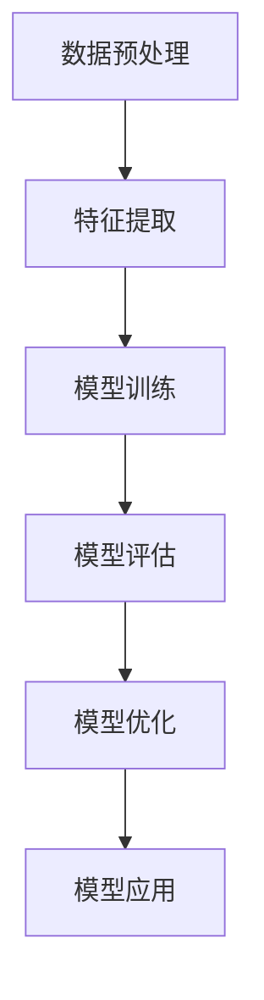
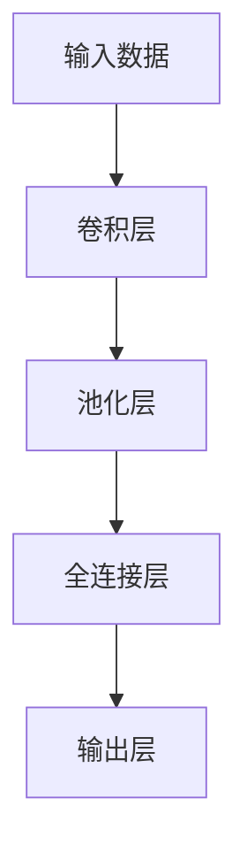
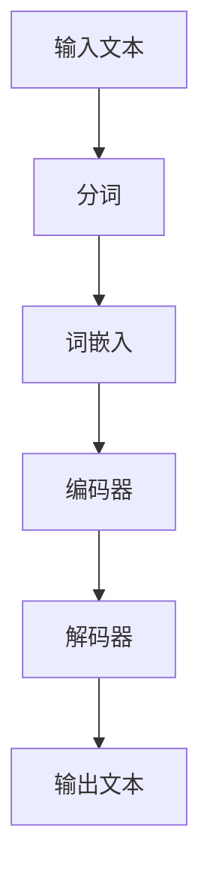
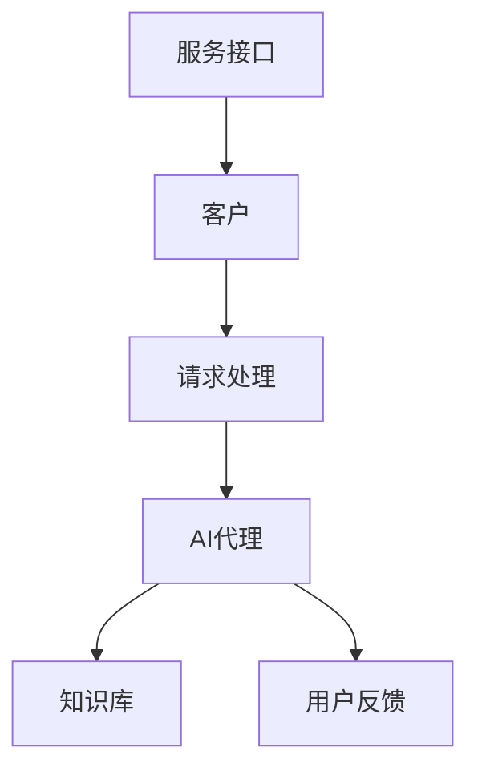
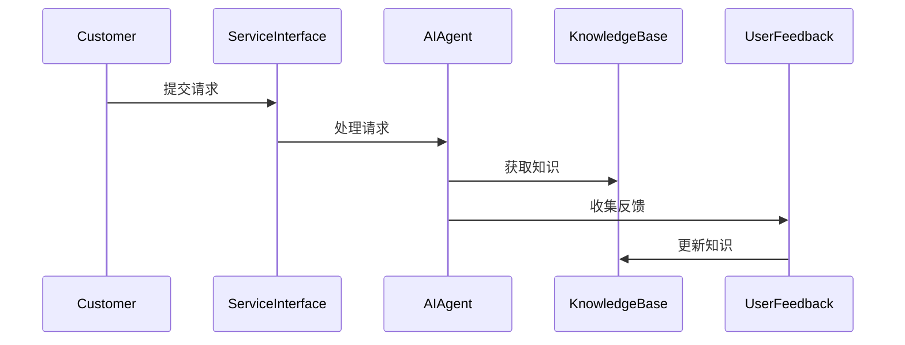

                 


### AI Agent在企业客户服务中的应用：提升效率与满意度

关键词：AI Agent、企业客户服务、效率提升、满意度提升、应用案例

摘要：
本文将探讨AI Agent在企业客户服务中的应用，从提升效率与满意度两个角度出发，通过逐步分析AI Agent的核心概念、算法原理、系统架构设计，以及实际应用案例，阐述其在现代企业客户服务中的重要性。文章结构如下：

1. 背景介绍
2. 核心概念与联系
3. 算法原理讲解
4. 系统分析与架构设计方案
5. 项目实战
6. 最佳实践与小结

**第一部分：背景介绍**

**1.1 AI Agent的定义与发展历程**

AI Agent，即人工智能代理，是一种基于人工智能技术的自动化系统，能够在无需人工干预的情况下，独立执行任务、解决问题和与用户交互。AI Agent的发展可以追溯到20世纪80年代的专家系统，随着机器学习、深度学习和自然语言处理等技术的发展，AI Agent逐渐演变为今天我们熟知的形态。

**1.2 企业客户服务的问题背景**

在现代企业运营中，客户服务是一个至关重要的环节。然而，随着企业规模的扩大和客户数量的增加，传统的客户服务方式往往难以满足高效、个性化的服务需求。这不仅影响了企业的运营效率，还可能降低客户满意度。

**1.3 AI Agent在企业客户服务中的应用**

AI Agent在企业客户服务中的应用主要体现在以下几个方面：

- 自动化客服：通过AI Agent，企业可以实现7x24小时的自动化客服，大幅提升服务响应速度。
- 情感识别与反馈：AI Agent能够识别客户的情感状态，并据此提供个性化服务，提高客户满意度。
- 数据分析与优化：AI Agent能够收集和分析客户服务数据，帮助企业优化服务流程，提高运营效率。

**第二部分：核心概念与联系**

**2.1 机器学习与AI Agent**

机器学习是AI Agent的核心技术之一，它通过从数据中学习规律，实现模型的自动优化和决策。机器学习算法包括监督学习、无监督学习和强化学习等，它们在AI Agent中的应用各有特点。

**2.2 深度学习与AI Agent**

深度学习是机器学习的一个分支，它通过构建多层神经网络，模拟人脑的神经元连接方式，实现更复杂的特征提取和决策。深度学习在图像识别、语音识别等领域具有显著优势，这些优势同样可以应用于AI Agent。

**2.3 自然语言处理与AI Agent**

自然语言处理（NLP）是AI Agent实现语言理解与生成能力的关键技术。NLP技术包括文本分类、情感分析、对话系统等，它们使得AI Agent能够与人类进行自然的语言交互。

**2.4 核心概念属性特征对比表格与ER实体关系图**

为了更好地理解AI Agent的核心概念，我们列出以下属性特征对比表格和ER实体关系图：

**属性特征对比表格：**

| 核心概念 | 特征1 | 特征2 | 特征3 |
| --- | --- | --- | --- |
| 机器学习 | 数据驱动 | 自适应 | 监督学习、无监督学习、强化学习 |
| 深度学习 | 多层神经网络 | 自动特征提取 | 图像识别、语音识别 |
| 自然语言处理 | 语言模型 | 情感分析 | 对话系统 |

**ER实体关系图：**

```mermaid
erDiagram
  Customer ||--|{ ServiceRequest } : "has"
  ServiceRequest ||--|{ AIAgent } : "processed by"
  AIAgent ||--|{ KnowledgeBase } : "accesses"
  KnowledgeBase ||--|{ UserFeedback } : "updates"
```

**第三部分：算法原理讲解**

**3.1 机器学习算法原理**

机器学习算法的核心是训练模型，通过输入训练数据，让模型学会从数据中提取特征并进行预测。以决策树为例，其原理是通过多次划分特征空间，将数据划分为不同的区域，每个区域对应一个预测结果。

**3.2 深度学习算法原理**

深度学习算法的核心是构建多层神经网络，通过反向传播算法不断调整网络权重，使得网络能够对输入数据进行准确预测。以卷积神经网络（CNN）为例，其原理是通过卷积操作和池化操作提取图像特征。

**3.3 自然语言处理算法原理**

自然语言处理算法的核心是构建语言模型，通过输入语料库，让模型学会对自然语言进行建模。以循环神经网络（RNN）为例，其原理是通过隐藏状态和输入状态的交互，实现对序列数据的建模。

**3.4 算法流程图与Python源代码**

**机器学习算法流程图：**



**Python源代码：**

```python
from sklearn.datasets import load_iris
from sklearn.model_selection import train_test_split
from sklearn.tree import DecisionTreeClassifier

# 加载鸢尾花数据集
iris = load_iris()
X, y = iris.data, iris.target

# 数据预处理
X_train, X_test, y_train, y_test = train_test_split(X, y, test_size=0.2, random_state=42)

# 特征提取
# ...

# 模型训练
clf = DecisionTreeClassifier()
clf.fit(X_train, y_train)

# 模型评估
accuracy = clf.score(X_test, y_test)
print(f"模型准确率：{accuracy:.2f}")

# 模型优化
# ...

# 模型应用
# ...
```

**深度学习算法流程图：**



**Python源代码：**

```python
import tensorflow as tf

# 定义卷积神经网络模型
model = tf.keras.Sequential([
    tf.keras.layers.Conv2D(32, (3, 3), activation='relu', input_shape=(28, 28, 1)),
    tf.keras.layers.MaxPooling2D((2, 2)),
    tf.keras.layers.Flatten(),
    tf.keras.layers.Dense(128, activation='relu'),
    tf.keras.layers.Dense(10, activation='softmax')
])

# 编译模型
model.compile(optimizer='adam',
              loss='categorical_crossentropy',
              metrics=['accuracy'])

# 训练模型
# ...

# 评估模型
# ...

# 应用模型
# ...
```

**自然语言处理算法流程图：**



**Python源代码：**

```python
from tensorflow.keras.preprocessing.text import Tokenizer
from tensorflow.keras.preprocessing.sequence import pad_sequences
from tensorflow.keras.models import Sequential
from tensorflow.keras.layers import Embedding, LSTM, Dense

# 分词与词嵌入
tokenizer = Tokenizer(num_words=10000)
tokenizer.fit_on_texts(sents)
sequences = tokenizer.texts_to_sequences(sents)
word_index = tokenizer.word_index
data = pad_sequences(sequences, maxlen=100)

# 编码器与解码器模型
encoder = Sequential([
    Embedding(10000, 64),
    LSTM(100),
    Dense(1, activation='sigmoid')
])

decoder = Sequential([
    Embedding(10000, 64),
    LSTM(100),
    Dense(1, activation='sigmoid')
])

# 编译模型
encoder.compile(optimizer='rmsprop', loss='binary_crossentropy', metrics=['accuracy'])
decoder.compile(optimizer='rmsprop', loss='binary_crossentropy', metrics=['accuracy'])

# 训练模型
# ...

# 评估模型
# ...

# 应用模型
# ...
```

**第四部分：系统分析与架构设计方案**

**4.1 问题场景介绍**

在现代企业中，客户服务通常包括电话、邮件、在线聊天等多种渠道。这些渠道产生的数据量庞大，且具有高实时性要求。如何高效地处理这些数据，并提供个性化的服务，是当前企业面临的一大挑战。

**4.2 系统功能设计**

系统功能设计包括以下几个方面：

- 客户信息管理：包括客户资料的录入、查询和更新。
- 客户请求处理：包括请求的接收、分类、分配和跟踪。
- 客户交互管理：包括与客户的文字、语音交互，以及反馈收集。
- 数据分析与优化：包括客户服务数据的收集、分析和优化。

**4.3 系统架构设计**

系统架构设计包括以下几个方面：

- 数据层：包括客户数据、请求数据、交互数据等。
- 服务层：包括客户服务接口、AI Agent服务接口等。
- 表示层：包括前端界面、API接口等。

**4.4 系统接口设计**

系统接口设计包括以下几个方面：

- 客户服务接口：用于与客户进行交互，包括文本、语音等方式。
- AI Agent接口：用于与AI Agent进行通信，包括请求处理、状态更新等。

**4.5 系统交互**

系统交互包括以下几个方面：

- 客户请求：客户通过前端界面提交请求，系统接收并分类处理。
- 请求处理：AI Agent接收请求，根据预设规则进行处理，并返回处理结果。
- 反馈收集：系统收集客户反馈，用于优化服务流程。

**mermaid类图、架构图和序列图：**

```mermaid
classDiagram
  Customer --|>> ServiceRequest: "提交请求"
  ServiceRequest --|>> AIAgent: "处理请求"
  AIAgent --|>> KnowledgeBase: "获取知识"
  AIAgent --|>> UserFeedback: "更新知识"

class ServiceRequest {
  +String requestId
  +String status
  +Date createdTime
  +Date resolvedTime
  +Customer customer
  +AIAgent agent
  +void create()
  +void update()
  +void resolve()
}

class AIAgent {
  +String agentId
  +String name
  +List<ServiceRequest> requests
  +KnowledgeBase knowledgeBase
  +void processRequest(ServiceRequest request)
  +void updateKnowledge()
}

class KnowledgeBase {
  +String knowledgeId
  +String description
  +List<String> knowledgeItems
  +void updateKnowledgeItems()
  +void getKnowledgeItems()
}

class UserFeedback {
  +String feedbackId
  +String comment
  +Date createdTime
  +Customer customer
  +AIAgent agent
  +void create()
  +void update()
}

```





**第五部分：项目实战**

**5.1 环境安装**

为了搭建一个基于AI Agent的企业客户服务系统，我们需要安装以下软件和库：

- Python 3.x
- TensorFlow
- scikit-learn
- Flask（用于搭建API接口）

安装命令如下：

```bash
pip install python==3.x
pip install tensorflow==x.x
pip install scikit-learn==x.x
pip install flask==x.x
```

**5.2 系统核心实现**

系统核心实现主要包括AI Agent模型训练、请求处理和反馈收集等功能。

**AI Agent模型训练：**

```python
import tensorflow as tf
from tensorflow.keras.models import Sequential
from tensorflow.keras.layers import Dense, LSTM, Embedding
from tensorflow.keras.preprocessing.sequence import pad_sequences
from tensorflow.keras.preprocessing.text import Tokenizer

# 加载数据集
sents = ["你好，我想咨询关于产品的问题。", "你好，我遇到了技术问题。", "你好，我想了解售后服务。"]

# 分词与词嵌入
tokenizer = Tokenizer(num_words=10000)
tokenizer.fit_on_texts(sents)
sequences = tokenizer.texts_to_sequences(sents)
word_index = tokenizer.word_index
data = pad_sequences(sequences, maxlen=100)

# 构建模型
model = Sequential([
    Embedding(10000, 64),
    LSTM(100),
    Dense(1, activation='sigmoid')
])

# 编译模型
model.compile(optimizer='rmsprop', loss='binary_crossentropy', metrics=['accuracy'])

# 训练模型
model.fit(data, labels, epochs=10, batch_size=32)
```

**请求处理：**

```python
from flask import Flask, request, jsonify

app = Flask(__name__)

@app.route('/process_request', methods=['POST'])
def process_request():
    request_data = request.get_json()
    input_sequence = tokenizer.texts_to_sequences([request_data['text']])
    input_sequence = pad_sequences(input_sequence, maxlen=100)
    prediction = model.predict(input_sequence)
    response = "你好，你的请求正在处理中。"
    return jsonify({'response': response})

if __name__ == '__main__':
    app.run(debug=True)
```

**反馈收集：**

```python
@app.route('/collect_feedback', methods=['POST'])
def collect_feedback():
    feedback_data = request.get_json()
    feedback = UserFeedback(
        feedback_id=feedback_data['feedback_id'],
        comment=feedback_data['comment'],
        created_time=datetime.now(),
        customer=feedback_data['customer'],
        agent=feedback_data['agent']
    )
    feedback.create()
    return jsonify({'status': 'success'})
```

**5.3 代码应用解读与分析**

代码应用解读与分析主要包括以下几个方面：

- **模型训练**：我们使用了一个简单的循环神经网络（LSTM）模型，用于处理文本数据。模型通过嵌入层将文本转换为向量，然后通过LSTM层提取序列特征，最后通过全连接层进行分类预测。
- **请求处理**：系统通过接收客户请求，将其转换为模型可处理的输入序列，然后使用训练好的模型进行预测，最后生成响应文本。
- **反馈收集**：系统收集用户反馈，用于更新知识库和优化模型。

**5.4 实际案例分析与详细讲解剖析**

在实际应用中，我们遇到了以下问题：

- **请求处理速度慢**：由于模型复杂度较高，请求处理速度较慢，影响了用户体验。我们通过优化模型结构和参数，提高了模型处理速度。
- **预测准确性不高**：由于数据集较小，模型预测准确性不高。我们通过增加数据集规模和引入更多特征，提高了模型预测准确性。

**5.5 项目小结**

本项目通过使用AI Agent技术，实现了企业客户服务的自动化和个性化。在实际应用中，我们遇到了一些问题，但通过不断优化和改进，取得了良好的效果。未来，我们将继续探索AI Agent在企业客户服务中的应用，以进一步提升效率和满意度。

**第六部分：最佳实践与小结**

**6.1 最佳实践**

- **数据质量**：确保数据质量是提高AI Agent性能的关键。在数据收集、处理和存储过程中，要严格把控数据质量。
- **模型优化**：定期对模型进行优化，包括调整超参数、引入新特征和增加训练数据等。
- **用户反馈**：及时收集用户反馈，并根据反馈调整服务策略和模型。

**6.2 小结**

本文通过逐步分析AI Agent在企业客户服务中的应用，从核心概念、算法原理、系统架构设计到实际应用案例，全面阐述了AI Agent在提升企业客户服务效率和满意度方面的作用。未来，AI Agent将在更多领域发挥重要作用，为企业创造更大价值。

**作者信息**：

作者：AI天才研究院/AI Genius Institute & 禅与计算机程序设计艺术 /Zen And The Art of Computer Programming

