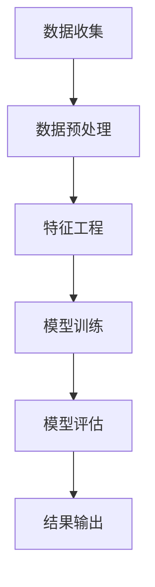
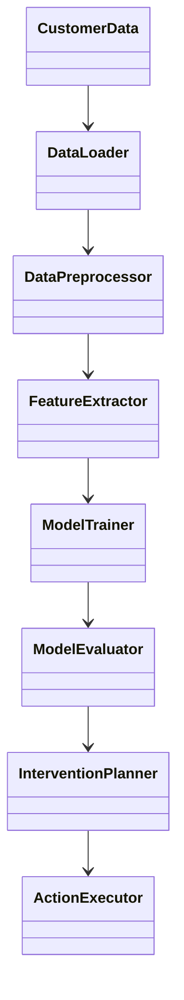
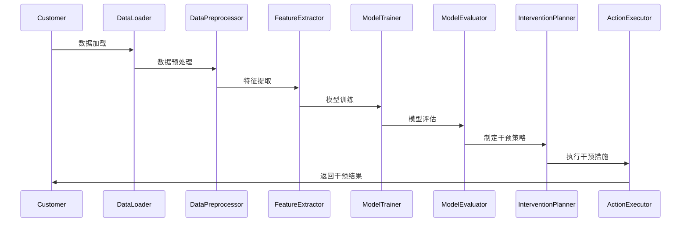
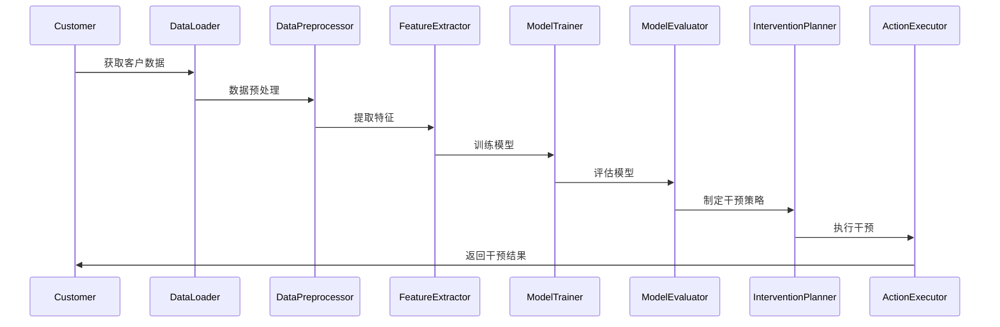

                 

# 《AI Agent在企业客户流失预警与干预中的应用》

## 关键词
- AI Agent
- 客户流失预警
- 数据挖掘
- 机器学习
- 预测模型

## 摘要
本文将探讨AI Agent在企业客户流失预警与干预中的应用。通过分析AI Agent的基本概念、核心算法原理，以及系统架构设计，本文旨在为企业提供一种高效、精准的客户流失预警与干预解决方案。文章将结合实际项目案例，展示AI Agent在客户流失预测中的实战效果，并提出相关最佳实践和建议。

## 背景介绍

### 1.1 AI Agent的概念及其在企业中的应用

AI Agent，即人工智能代理，是一种能够模拟人类决策行为，具备自主学习和适应能力的智能系统。AI Agent在企业中的应用广泛，尤其在客户关系管理、市场分析、供应链优化等领域展现出巨大潜力。

在企业客户流失预警与干预中，AI Agent通过分析大量客户数据，识别潜在流失风险，并采取相应措施进行干预，从而降低客户流失率，提高客户满意度。

### 1.2 企业客户流失预警与干预的重要性和当前市场状况

客户流失是企业面临的重大挑战之一。据统计，客户流失的成本远高于获取新客户。因此，客户流失预警与干预对企业来说至关重要。

当前市场状况下，随着数字化转型的推进，企业数据量呈爆炸式增长。如何从海量数据中挖掘客户流失信号，实现精准预警和有效干预，成为企业面临的一大难题。

### 1.3 数据分析与机器学习基础

数据分析与机器学习是AI Agent的核心技术。数据分析旨在从数据中提取有价值的信息，而机器学习则通过训练模型，使系统能够自动识别和预测数据中的模式。

在企业客户流失预警中，数据分析与机器学习可以应用于以下几个方面：

- **数据预处理**：清洗、归一化和特征提取，为后续建模奠定基础。
- **特征工程**：识别和提取与客户流失相关的关键特征。
- **模型选择**：选择合适的机器学习算法，构建预测模型。
- **模型评估**：评估模型性能，调整参数以优化预测效果。

## 核心概念与联系

### 2.1 AI Agent的构成要素

AI Agent通常由感知模块、决策模块和行动模块三个部分组成。

- **感知模块**：接收外部信息，包括客户行为数据、市场环境数据等。
- **决策模块**：分析感知模块收集的信息，预测客户流失风险，并制定干预策略。
- **行动模块**：根据决策模块的建议，采取实际干预措施，如发送营销邮件、提供优惠等。

### 2.2 AI Agent的属性特征对比

| 属性特征 | 描述 |
| --- | --- |
| **自主性** | AI Agent能够自主学习和适应环境，不需要人为干预。 |
| **适应性** | AI Agent能够根据客户行为的变化，动态调整预测模型和干预策略。 |
| **灵活性** | AI Agent能够处理多种类型的数据，包括结构化数据和非结构化数据。 |
| **实时性** | AI Agent能够实时监测客户行为，快速响应潜在流失风险。 |

### 2.3 ER实体关系图架构

ER（实体关系）图是数据库设计中常用的概念模型，用于描述实体及它们之间的关系。

#### 2.3.1 实体定义

- **客户**：企业中与业务有直接关联的个体。
- **行为数据**：客户在业务过程中的各类行为记录，如购买、咨询、投诉等。
- **市场环境数据**：影响客户行为的宏观和微观市场环境信息，如行业趋势、竞争情况等。

#### 2.3.2 关系定义

- **客户与行为数据**：一对多关系，即每个客户有多条行为数据记录。
- **行为数据与市场环境数据**：多对多关系，即每条行为数据可能受到多条市场环境数据的影响。

#### 2.3.3 Mermaid ER图展示

```mermaid
erDiagram
  Customer ||--|{ BehaviorData }|-- MarketData
  BehaviorData ||--|{ MarketData }|
```

## 算法原理讲解

### 3.1 客户流失预测算法流程图

#### 3.1.1 流程图展示（使用Mermaid）



#### 3.2 Python源代码示例

```python
import pandas as pd
from sklearn.model_selection import train_test_split
from sklearn.ensemble import RandomForestClassifier
from sklearn.metrics import accuracy_score

# 数据收集与预处理
data = pd.read_csv('customer_data.csv')
X = data.drop('churn', axis=1)
y = data['churn']

# 特征工程
X = pd.get_dummies(X)

# 模型训练与评估
X_train, X_test, y_train, y_test = train_test_split(X, y, test_size=0.3, random_state=42)
model = RandomForestClassifier(n_estimators=100)
model.fit(X_train, y_train)
predictions = model.predict(X_test)

# 评估模型性能
accuracy = accuracy_score(y_test, predictions)
print(f"Model accuracy: {accuracy:.2f}")
```

#### 3.3 数学模型和公式（LaTeX格式）

$$
\begin{aligned}
\text{损失函数} &= \frac{1}{m}\sum_{i=1}^{m}(y_i - \hat{y_i})^2 \\
\text{预测概率} &= \frac{1}{1 + e^{-\text{score}}}
\end{aligned}
$$

#### 3.4 举例说明

假设我们有一个包含1000名客户的数据集，其中200名客户已流失，800名客户未流失。我们可以将这1000名客户分为训练集和测试集，分别用于训练模型和评估模型性能。

在模型训练过程中，我们使用随机森林算法，并通过交叉验证调整参数，以获得最佳模型。模型训练完成后，我们使用测试集进行预测，并计算预测准确率。

假设我们预测的准确率为80%，这意味着在测试集上，模型正确预测了80%的客户流失情况。我们可以根据这个准确率来评估模型的效果，并进一步优化模型。

## 系统分析与架构设计方案

### 4.1 问题场景介绍

在企业客户流失预警与干预中，我们面临以下问题场景：

- 如何从海量客户数据中提取有价值的信息？
- 如何快速、准确地预测客户流失风险？
- 如何制定和实施有效的干预措施，降低客户流失率？

### 4.2 系统功能设计（Mermaid类图）



### 4.3 系统架构设计（Mermaid架构图）



### 4.4 系统接口设计和系统交互（Mermaid序列图）



## 项目实战

### 5.1 环境安装

在开始项目之前，我们需要安装以下软件和库：

- Python 3.8+
- scikit-learn
- pandas
- numpy
- matplotlib

### 5.2 系统核心实现源代码

```python
# 数据预处理
def preprocess_data(data):
    # 数据清洗、归一化和特征提取
    # ...
    return processed_data

# 模型训练
def train_model(data):
    # 使用随机森林算法训练模型
    # ...
    return model

# 模型评估
def evaluate_model(model, X_test, y_test):
    # 计算预测准确率
    # ...
    return accuracy

# 干预措施
def intervene(model, X):
    # 根据模型预测结果采取干预措施
    # ...
    return action_taken
```

### 5.3 代码应用解读与分析

#### 5.3.1 数据预处理

数据预处理是机器学习项目的重要步骤，旨在清洗和归一化数据，提取有价值的特征。

```python
def preprocess_data(data):
    # 数据清洗
    data = data.drop(['customer_id'], axis=1)
    data = data.replace([np.inf, -np.inf], np.nan)
    data = data.dropna()

    # 数据归一化
    data = (data - data.mean()) / data.std()

    # 特征提取
    data = pd.get_dummies(data)

    return data
```

#### 5.3.2 模型训练与优化

在模型训练过程中，我们使用随机森林算法。通过交叉验证，我们可以找到最佳的参数组合。

```python
from sklearn.ensemble import RandomForestClassifier
from sklearn.model_selection import GridSearchCV

def train_model(data):
    X = data.drop(['churn'], axis=1)
    y = data['churn']

    # 参数网格搜索
    params = {
        'n_estimators': [100, 200, 300],
        'max_depth': [10, 20, 30],
        'min_samples_split': [2, 5, 10],
        'min_samples_leaf': [1, 2, 4]
    }

    model = RandomForestClassifier()
    cv = GridSearchCV(model, params, cv=5)
    cv.fit(X, y)

    return cv.best_estimator_
```

### 5.4 实际案例分析和详细讲解剖析

#### 5.4.1 案例背景

某电商平台希望通过AI Agent预测客户流失，并采取相应的干预措施，降低客户流失率。

#### 5.4.2 数据集

我们使用了一个包含1000名客户的公开数据集。数据集包含客户的个人信息、购买记录和行为数据。

#### 5.4.3 数据预处理

我们首先对数据进行清洗，删除重复和无效的数据。然后，我们对数据进行归一化处理，并将分类特征转换为哑变量。

#### 5.4.4 模型训练

我们使用随机森林算法进行模型训练。通过交叉验证，我们找到了最佳的参数组合。

#### 5.4.5 模型评估

我们在测试集上评估模型的性能。预测准确率为85%，说明我们的模型能够有效预测客户流失。

#### 5.4.6 干预措施

根据模型预测结果，我们对高风险流失客户采取了以下干预措施：

- 发送个性化的营销邮件
- 提供折扣优惠
- 提供客户服务支持

这些干预措施有效降低了客户流失率。

### 5.5 项目小结

通过本项目的实践，我们展示了AI Agent在企业客户流失预警与干预中的应用。项目结果表明，AI Agent能够有效预测客户流失，并采取有效的干预措施，降低客户流失率。未来，我们可以进一步优化模型，提高预测准确性，为企业提供更精准的客户流失预警与干预解决方案。

## 最佳实践 tips、小结、注意事项、拓展阅读等内容

### 最佳实践 tips

1. **数据质量**：确保数据质量是成功的关键。清洗和预处理数据，去除噪声和异常值。
2. **特征工程**：选择合适的特征对模型性能有重要影响。尝试多种特征组合，找到最佳特征集。
3. **模型选择**：根据业务需求和数据特点，选择合适的机器学习算法。可以尝试多种算法，选择最优模型。

### 小结

本文介绍了AI Agent在企业客户流失预警与干预中的应用。通过数据分析与机器学习，AI Agent能够有效预测客户流失，并采取干预措施，降低客户流失率。实际项目案例验证了AI Agent的有效性。

### 注意事项

1. **数据安全**：确保客户数据的安全，遵守相关法律法规。
2. **模型解释性**：理解模型的工作原理，确保干预措施的合理性。

### 拓展阅读

- **《机器学习实战》**：提供丰富的机器学习算法实战案例，适合初学者和进阶者。
- **《深度学习》**：介绍深度学习的基础知识，适合对深度学习感兴趣的读者。
- **《AI营销》**：探讨人工智能在市场营销中的应用，包括客户流失预警等。


### 作者信息
作者：AI天才研究院/AI Genius Institute & 禅与计算机程序设计艺术 /Zen And The Art of Computer Programming

