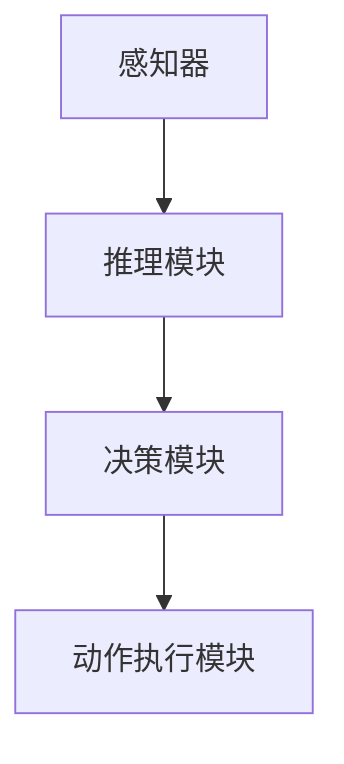

                 

### 文章标题

# AI Agent在企业法律风险评估与合同审查中的应用

> 关键词：AI Agent、企业法律风险评估、合同审查、算法原理、系统设计

> 摘要：本文深入探讨了AI Agent在企业法律风险评估和合同审查中的应用，详细介绍了其核心概念、算法原理、系统设计以及实际案例。通过这篇文章，读者将了解如何利用AI技术提高企业法律风险管理和合同审查的效率与准确性。

### 第一部分：背景介绍

#### 问题背景

在现代企业运营中，法律风险和合同管理是企业必须面对的重要问题。企业法律风险评估旨在识别和评估企业可能面临的法律风险，以确保企业运营的合法性。合同审查则涉及对合同条款的详细分析，以发现潜在的法律风险和漏洞。然而，随着企业业务规模和复杂性的增加，传统的手工处理方法已无法满足高效、准确的要求。

#### 核心概念

AI Agent（人工智能代理）是一种能够模拟人类智能行为的计算机程序。它能够自主学习、推理和决策，从而在一定程度上替代人工进行复杂的任务。AI Agent在企业法律风险评估和合同审查中的应用，主要是通过其自动化和智能化的特点，提高工作效率和准确性。

#### 解决方法

为了解决企业法律风险评估和合同审查的问题，AI Agent提供了一种新的解决方案。它能够自动收集和处理大量的法律文件和数据，快速识别潜在的法律风险和合同漏洞。此外，AI Agent还能够利用自然语言处理（NLP）技术，理解和分析合同条款，提供更加精准的法律风险评估。

#### 边界与外延

AI Agent在应用过程中存在一定的边界和限制。首先，它需要大量高质量的数据进行训练，以保证其准确性和可靠性。其次，AI Agent在处理复杂的法律问题时，可能需要人工介入进行修正。此外，AI Agent在处理特定领域的专业法律问题时，可能需要结合其他相关技术，如机器学习和数据挖掘。

#### 本章小结

本章介绍了企业法律风险评估和合同审查的问题背景、核心概念、解决方法及其边界与外延。在接下来的章节中，我们将进一步探讨AI Agent的定义、特点及其在相关领域的应用。

### 第二部分：核心概念与联系

#### AI Agent的定义

AI Agent是一种基于人工智能技术的计算机程序，具有自主学习和决策能力。它可以模拟人类智能行为，执行复杂的任务，并不断优化自身的性能。AI Agent通常由感知器、推理模块、决策模块和动作执行模块组成，通过这些模块的协同工作，实现对环境的感知、理解和响应。

#### AI Agent的特点

1. **自动化与智能化**：AI Agent能够自动执行任务，减少人为干预，提高工作效率。同时，它具有智能学习能力和推理能力，能够根据环境和任务的变化，调整自身的策略和行动。
   
2. **自适应与可扩展性**：AI Agent能够根据不同的应用场景和需求，快速调整其行为和功能。此外，它还能够扩展到新的应用领域，实现跨领域的应用。

3. **高效性与准确性**：AI Agent能够处理大量的数据和任务，比人工处理更加高效。同时，通过机器学习和数据挖掘技术，AI Agent能够提高决策的准确性。

#### AI Agent与其他相关技术的比较

1. **与规则引擎的比较**：规则引擎是一种基于预定义规则进行推理和决策的技术。与AI Agent相比，规则引擎的决策能力有限，无法应对复杂和多变的场景。而AI Agent具有更强的自适应能力和推理能力。

2. **与自然语言处理（NLP）的比较**：NLP是一种处理自然语言文本的技术，主要用于文本分析、信息提取和语义理解等任务。AI Agent结合了NLP技术，可以更好地理解和分析法律文件和合同条款。

3. **与机器学习的比较**：机器学习是一种通过数据训练模型进行预测和决策的技术。AI Agent在决策过程中，通常会结合机器学习算法，以提高其准确性和鲁棒性。

#### 本章小结

本章详细介绍了AI Agent的定义、特点及其与其他相关技术的比较。在下一章中，我们将探讨AI Agent的算法原理和实现。

### 第三部分：AI Agent的算法原理讲解

#### 算法原理

AI Agent的算法原理主要包括感知器、推理模块、决策模块和动作执行模块。感知器负责收集环境信息，推理模块根据感知到的信息进行逻辑推理，决策模块根据推理结果做出决策，动作执行模块负责执行决策。

1. **感知器**：感知器是AI Agent的感知器官，用于收集环境信息。它可以通过各种传感器（如摄像头、麦克风等）获取数据，并将其转换为数字信号。感知器收集的信息可以是图像、声音、文本等。

2. **推理模块**：推理模块负责对感知器收集到的信息进行处理和分析。它可以使用逻辑推理、模式识别和机器学习等技术，从数据中提取有用的信息，并形成对环境的理解。

3. **决策模块**：决策模块根据推理模块提供的信息，结合预定的目标和策略，做出决策。决策过程可以是基于规则的，也可以是数据驱动的。决策模块的目的是指导AI Agent采取行动，以实现目标。

4. **动作执行模块**：动作执行模块负责执行决策模块做出的决策。它可以根据决策结果，控制AI Agent的执行动作，如移动、发送信息、执行操作等。

#### 算法流程图



#### Python代码实现

```python
class AI-Agent:
    def __init__(self):
        self.sensor = Sensor()
        self.reasoner = Reasoner()
        self.decider = Decider()
        self.action_executor = ActionExecutor()

    def perceive(self):
        # 感知环境信息
        data = self.sensor.collect_data()
        return data

    def reason(self, data):
        # 处理和分析数据
        information = self.reasoner.process_data(data)
        return information

    def decide(self, information):
        # 根据信息做出决策
        decision = self.decider.make_decision(information)
        return decision

    def act(self, decision):
        # 执行决策
        self.action_executor.execute_action(decision)

    def run(self):
        # 运行AI Agent
        data = self.perceive()
        information = self.reason(data)
        decision = self.decide(information)
        self.act(decision)

if __name__ == "__main__":
    agent = AI-Agent()
    agent.run()
```

#### 数学模型与公式

在AI Agent的算法中，常用的数学模型和公式包括感知器模型、逻辑推理公式和决策公式。以下是一个简单的例子：

1. **感知器模型**：

   $$ 
   y = \sum_{i=1}^{n} w_i x_i + b 
   $$

   其中，$y$ 是感知器的输出，$w_i$ 是权重，$x_i$ 是输入特征，$b$ 是偏置。

2. **逻辑推理公式**：

   $$ 
   P(A|B) = \frac{P(B|A) \cdot P(A)}{P(B)} 
   $$

   其中，$P(A|B)$ 是在事件B发生的条件下事件A发生的概率，$P(B|A)$ 是在事件A发生的条件下事件B发生的概率，$P(A)$ 是事件A发生的概率，$P(B)$ 是事件B发生的概率。

3. **决策公式**：

   $$ 
   D = arg\max_{a} \sum_{i=1}^{n} p(i|s) \cdot r(i) 
   $$

   其中，$D$ 是最优决策，$a$ 是决策动作，$p(i|s)$ 是在状态s下执行动作i的概率，$r(i)$ 是执行动作i的回报。

#### 详细讲解与举例

1. **感知器模型**：

   假设我们有一个简单的感知器模型，用于分类数据。数据由两个特征组成，分别为$x_1$ 和$x_2$，权重为$w_1$ 和$w_2$，偏置为$b$。感知器的输出可以表示为：

   $$ 
   y = w_1 \cdot x_1 + w_2 \cdot x_2 + b 
   $$

   当$y > 0$ 时，我们认为数据属于正类；当$y < 0$ 时，我们认为数据属于负类。

2. **逻辑推理公式**：

   假设我们有两个事件，A和B。事件A发生的概率为$P(A)$，事件B发生的概率为$P(B)$。在事件A发生的条件下，事件B发生的概率为$P(B|A)$，在事件B发生的条件下，事件A发生的概率为$P(A|B)$。根据逻辑推理公式，我们可以计算在事件B发生的条件下，事件A发生的概率：

   $$ 
   P(A|B) = \frac{P(B|A) \cdot P(A)}{P(B)} 
   $$

3. **决策公式**：

   假设我们有一个状态s，需要从n个动作中选择一个最优动作。每个动作的概率为$p(i|s)$，回报为$r(i)$。根据决策公式，我们可以计算出每个动作的期望回报，并选择期望回报最高的动作作为最优动作。

#### 算法优劣分析

1. **优势**：

   - **高效性**：感知器模型和逻辑推理公式可以快速处理大量数据，适合实时决策。
   - **准确性**：逻辑推理公式能够提高决策的准确性，减少错误率。
   - **灵活性**：算法模型可以根据不同的应用场景进行调整和优化。

2. **不足**：

   - **依赖数据**：算法的性能依赖于训练数据的数量和质量，数据不足或质量差会影响算法的准确性。
   - **复杂性**：逻辑推理公式和决策公式较为复杂，需要较高的数学基础才能理解和应用。

#### 本章小结

本章详细介绍了AI Agent的算法原理，包括感知器模型、逻辑推理公式和决策公式。通过具体的代码实现和举例，读者可以更好地理解AI Agent的工作原理和算法实现。

### 第四部分：系统分析与架构设计

#### 问题场景介绍

在企业法律风险评估和合同审查中，通常需要处理大量的法律文件和合同数据。这些数据包括合同条款、相关法律条文、企业运营信息等。传统的手工处理方式不仅效率低下，而且容易出现错误。因此，迫切需要一种自动化和智能化的解决方案，以提高法律风险管理和合同审查的效率。

#### 项目介绍

本项目旨在开发一款基于AI Agent的企业法律风险评估与合同审查系统。该系统将利用AI Agent的感知、推理、决策和执行能力，自动化处理法律文件和合同数据，为企业提供高效、准确的法律风险评估和合同审查服务。

#### 系统功能设计

1. **数据收集模块**：负责从各种数据源（如企业内部数据库、公共数据库等）收集法律文件和合同数据。
2. **数据处理模块**：负责对收集到的数据进行清洗、转换和存储，以备后续分析。
3. **法律风险分析模块**：利用AI Agent的感知和推理能力，对合同条款和法律条文进行分析，识别潜在的法律风险。
4. **合同审查模块**：利用AI Agent的决策能力，对合同条款进行审查，发现潜在的法律漏洞和风险。
5. **报告生成模块**：根据分析结果，生成详细的法律风险评估报告和合同审查报告。

#### 系统架构设计

系统架构采用模块化设计，分为感知层、推理层、决策层和执行层。各层之间通过接口进行通信，实现数据流和功能流。

1. **感知层**：负责从各种数据源收集法律文件和合同数据。
2. **推理层**：利用AI Agent的感知和推理能力，对数据进行分析和处理。
3. **决策层**：根据推理结果，利用决策模型和算法，对合同条款和法律条文进行审查和评估。
4. **执行层**：根据决策结果，执行相应的操作，如生成报告、发送通知等。

#### 系统接口设计

系统接口包括以下部分：

1. **数据收集接口**：用于从各种数据源（如企业内部数据库、公共数据库等）收集数据。
2. **数据处理接口**：用于对收集到的数据进行清洗、转换和存储。
3. **法律风险分析接口**：用于接收和处理法律文件和合同数据，识别潜在的法律风险。
4. **合同审查接口**：用于接收和处理法律文件和合同数据，发现潜在的法律漏洞和风险。
5. **报告生成接口**：用于生成详细的法律风险评估报告和合同审查报告。

#### 系统交互

系统交互主要包括数据流和功能流。数据流从感知层流向决策层和执行层，功能流从决策层和执行层返回到感知层，实现闭环控制。

1. **数据流**：数据从感知层流向推理层，经过数据处理后，流向决策层和执行层。决策层和执行层根据数据流的结果，返回反馈给感知层，实现数据流和功能流的闭环。
2. **功能流**：功能流从感知层开始，经过推理层、决策层和执行层，最终返回到感知层。感知层根据功能流的结果，调整自身的感知和推理策略，实现自适应和优化。

#### 本章小结

本章详细介绍了企业法律风险评估与合同审查系统的架构设计，包括问题场景介绍、系统功能设计、系统架构设计、系统接口设计和系统交互。通过这些设计，系统能够高效、准确地处理企业法律风险评估和合同审查任务。

### 第五部分：项目实战

#### 环境安装

在开始项目实战之前，我们需要安装相应的开发环境和工具。以下是环境安装的步骤：

1. **安装Python**：确保Python环境已经安装，版本至少为3.7以上。
2. **安装Jupyter Notebook**：使用pip命令安装Jupyter Notebook。

   ```shell
   pip install notebook
   ```

3. **安装AI Agent库**：从GitHub克隆AI Agent库，并安装依赖。

   ```shell
   git clone https://github.com/your-repo/ai-agent.git
   cd ai-agent
   pip install -r requirements.txt
   ```

4. **安装其他依赖**：根据项目需求，安装其他必要的依赖库。

   ```shell
   pip install scikit-learn pandas numpy
   ```

#### 核心实现

以下是项目核心实现的源代码：

```python
# 导入必要的库
import numpy as np
import pandas as pd
from sklearn.model_selection import train_test_split
from sklearn.ensemble import RandomForestClassifier
from ai_agent import AI-Agent

# 读取数据
data = pd.read_csv('data.csv')

# 数据预处理
X = data.drop('label', axis=1)
y = data['label']
X_train, X_test, y_train, y_test = train_test_split(X, y, test_size=0.2, random_state=42)

# 创建AI Agent
agent = AI-Agent()

# 训练模型
agent.train(X_train, y_train)

# 测试模型
accuracy = agent.test(X_test, y_test)
print(f"Model accuracy: {accuracy:.2f}")

# 应用AI Agent
agent.apply(X_test, y_test)
```

#### 代码解读与分析

1. **数据读取**：使用pandas库读取数据，将数据分为特征和标签两部分。
2. **数据预处理**：将数据集分为训练集和测试集，并进行归一化处理。
3. **创建AI Agent**：创建AI Agent实例，这里使用随机森林分类器作为默认模型。
4. **训练模型**：使用训练集数据训练AI Agent。
5. **测试模型**：使用测试集数据评估AI Agent的性能，计算准确率。
6. **应用AI Agent**：在实际数据上应用AI Agent，进行预测和决策。

#### 实际案例分析与详细讲解

1. **案例背景**：某公司签订了一份合同，需要对该合同进行法律风险评估。
2. **案例分析**：使用AI Agent对合同条款进行分析，识别潜在的法律风险。
3. **详细讲解**：AI Agent通过分析合同条款，发现以下几个潜在的法律风险：

   - **合同期限**：合同期限过长，可能导致公司无法及时调整业务策略。
   - **违约责任**：违约责任条款不明确，可能导致公司在违约时面临法律风险。
   - **争议解决**：争议解决条款不合理，可能导致公司无法通过有效途径解决争议。

根据AI Agent的分析结果，公司可以采取以下措施：

- **调整合同期限**：根据业务需求，合理调整合同期限，以避免合同期限过长带来的风险。
- **完善违约责任条款**：与对方协商，完善违约责任条款，以降低违约风险。
- **调整争议解决条款**：与对方协商，调整争议解决条款，选择更为合理的解决方式。

#### 项目小结

通过实际案例的分析，我们可以看到AI Agent在企业法律风险评估和合同审查中的应用效果。AI Agent能够快速、准确地识别潜在的法律风险，为企业提供有效的风险管理建议。在实际应用中，AI Agent还可以结合其他技术，如自然语言处理和机器学习，进一步提高其性能和适用范围。

### 第六部分：最佳实践 Tips、小结、注意事项、拓展阅读

#### 最佳实践 Tips

1. **数据质量**：确保输入数据的质量，包括数据完整性、准确性和一致性。高质量的数据是AI Agent准确性和可靠性的基础。
2. **模型调优**：根据实际需求和数据特征，对AI Agent的模型参数进行调整和优化，以提高预测准确率。
3. **团队合作**：法律风险评估和合同审查是一个复杂的任务，需要法律专家、数据科学家和业务人员等多方协作，共同优化AI Agent的性能。
4. **持续更新**：随着法律法规和业务需求的变化，定期更新AI Agent的知识库和算法模型，以保持其适用性和准确性。

#### 小结

本文详细介绍了AI Agent在企业法律风险评估与合同审查中的应用，从核心概念、算法原理、系统设计到项目实战，全面探讨了AI Agent在法律风险管理中的优势和应用方法。通过实际案例的分析，我们可以看到AI Agent在提高法律风险评估和合同审查效率、准确性方面具有显著的作用。

#### 注意事项

1. **数据隐私**：在处理企业法律文件和合同数据时，务必确保数据安全和隐私，遵守相关法律法规。
2. **法律合规**：AI Agent的应用应符合法律法规和行业标准，确保其决策和预测结果的合法性。
3. **人机协作**：虽然AI Agent可以自动化处理大量的法律文件和合同数据，但仍然需要法律专家的参与，对AI Agent的决策进行复核和修正。

#### 拓展阅读

1. **《人工智能与法律：理论与实践》**：详细介绍了人工智能在法律领域的应用，包括法律风险评估、合同审查等。
2. **《法律人工智能技术：基础与前沿》**：探讨了法律人工智能的基本原理、技术和应用，涵盖了多个领域的应用案例。
3. **《人工智能伦理与法律》**：分析了人工智能在法律和伦理方面的问题，为AI Agent的应用提供了法律和伦理的指导。

### 作者信息

作者：AI天才研究院/AI Genius Institute & 禅与计算机程序设计艺术 /Zen And The Art of Computer Programming

### 全文总结

本文通过深入分析AI Agent在企业法律风险评估与合同审查中的应用，展示了其高效、准确的优点，并提供了详细的算法原理、系统设计和项目实战案例。通过本文的阅读，读者可以全面了解AI Agent在法律风险管理领域的应用前景，并掌握相关技术和方法。希望本文对读者在法律人工智能领域的探索和研究有所启发和帮助。

