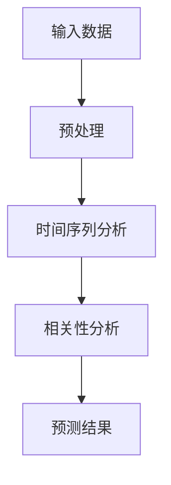
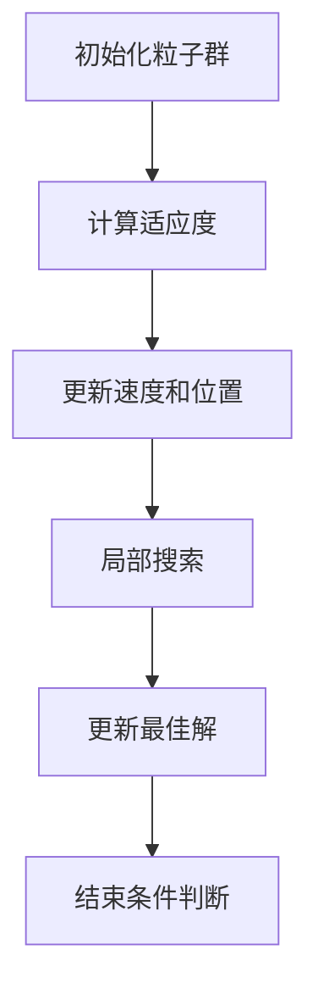
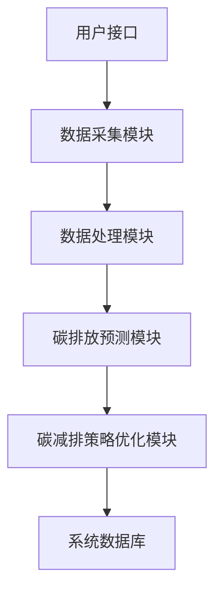

                 


### 第一部分：背景介绍

#### 1. AI Agent的概念与作用

**概念与定义**

AI Agent，即人工智能代理，是一种具有自主性、目标性、适应性能力的计算实体。它能在不确定和动态变化的环境中，通过感知、决策和行动，实现特定目标。AI Agent通常具备以下特性：

- **自主性**：能够自主地感知环境，自主地做出决策和采取行动。
- **目标性**：拥有明确的目标，并围绕目标进行行动。
- **适应性**：能够根据环境变化调整自己的行为。

与传统算法相比，AI Agent具有更高的灵活性和智能性。传统算法通常是在特定场景和条件下进行优化，而AI Agent可以在复杂、动态的环境中，通过不断学习和适应，实现更加复杂的任务。

**作用与应用领域**

AI Agent在多个领域展现出了强大的应用潜力，尤其在企业碳中和战略规划中，AI Agent能够发挥重要作用。具体应用包括：

- **碳排放预测**：通过分析历史数据和环境因素，预测未来的碳排放量。
- **减排目标设定**：基于预测结果和企业目标，设定合理的减排目标。
- **路径规划**：为达到减排目标，规划出最优的碳减排路径。

此外，AI Agent在能源管理、资源优化等方面也具有广泛的应用前景。通过AI Agent的应用，企业能够实现更加智能和高效的碳中和战略规划。

**AI Agent的优势与挑战**

AI Agent在企业碳中和战略规划中的优势主要包括：

- **高效率**：通过自动化和智能化，提高碳排放预测和减排策略的效率。
- **灵活性**：能够根据环境变化和企业需求，实时调整策略。
- **准确性**：通过数据分析和机器学习，提高预测和规划的准确性。

然而，AI Agent也面临一些挑战，如：

- **数据隐私**：在处理大量数据时，如何保护数据隐私是一个重要问题。
- **算法透明性**：AI Agent的决策过程往往复杂，如何保证其透明性和可解释性是一个挑战。
- **计算资源**：高性能的计算资源对于AI Agent的应用至关重要。

#### 2. 企业碳中和战略规划概述

**问题背景**

全球气候变化已成为人类面临的重大挑战之一。为了应对气候变化，实现碳中和已成为许多国家和企业的共同目标。企业作为经济活动的重要参与者，其在碳中和中的作用不可忽视。企业碳中和战略规划不仅有助于降低碳排放，提高资源利用效率，还能提升企业形象，增强市场竞争力。

**问题描述**

企业在碳中和过程中面临以下挑战：

- **碳排放量测量**：如何准确测量和监控企业的碳排放量，为企业制定减排策略提供数据支持。
- **减排目标设定**：如何设定科学合理的减排目标，确保企业在实现碳中和的过程中既有压力，又有动力。
- **路径规划**：如何制定出可行的碳中和路径，使企业在实现碳中和目标的同时，保持业务运营的连续性和稳定性。

**问题解决**

AI Agent在企业碳中和战略规划中的应用，能够有效解决上述问题。具体来说，AI Agent可以通过以下方式提高碳中和效率：

- **碳排放预测**：通过分析历史数据和实时环境因素，预测未来的碳排放量，为企业制定减排策略提供科学依据。
- **减排目标设定**：基于碳排放预测结果和企业目标，AI Agent可以设定合理的减排目标，使企业能够在碳中和过程中保持合理的发展速度。
- **路径规划**：通过优化算法，AI Agent可以为企业在碳中和过程中规划出最优的路径，使企业在实现碳中和目标的同时，保持业务运营的连续性和稳定性。

**边界与外延**

- **碳中和与可持续发展**：碳中和是可持续发展的重要组成部分，但并不是全部。在实施碳中和战略规划时，企业还需关注其他可持续发展目标，如环境保护、社会责任等。
- **AI Agent在不同行业中的应用场景**：AI Agent在企业碳中和战略规划中的应用具有广泛性，不仅适用于制造业、能源业等传统行业，也适用于金融、医疗、电商等新兴行业。

### 第二部分：核心概念与联系

#### 3. AI Agent原理与设计

**AI Agent的基本原理**

AI Agent的基本原理可以分为三大类：反应式Agent、目标导向Agent和计划Agent。

- **反应式Agent**：这类Agent仅基于当前的感知信息做出反应，不考虑未来的行为。例如，自动驾驶汽车可以根据当前道路状况进行转向和制动。
- **目标导向Agent**：这类Agent不仅考虑当前感知信息，还根据设定的目标进行决策。例如，智能客服系统可以根据用户的提问和目标，提供相应的答案和解决方案。
- **计划Agent**：这类Agent能够预测未来的状态，并制定出一系列行动方案来实现目标。例如，智能供应链管理系统可以根据市场需求和库存情况，制定最优的生产和配送计划。

**AI Agent的设计要素**

AI Agent的设计主要包括三个核心要素：感知系统、决策系统和执行系统。

- **感知系统**：感知系统负责收集环境信息，如温度、湿度、用户输入等。这些信息是Agent做出决策的基础。
- **决策系统**：决策系统根据感知系统收集到的信息，结合预定的目标和策略，生成行动方案。决策系统的核心是算法和模型，如机器学习算法、规划算法等。
- **执行系统**：执行系统负责将决策系统生成的行动方案付诸实施。执行系统通常与外部环境进行交互，如控制机器人运动、发送电子邮件等。

**感知系统、决策系统和执行系统的关联**

感知系统、决策系统和执行系统相互协作，共同实现AI Agent的功能。感知系统负责获取环境信息，决策系统根据环境信息和目标生成行动方案，执行系统负责将行动方案付诸实施。这一过程是一个循环迭代的过程，AI Agent能够根据环境变化和目标调整，不断优化其行为。

#### 4. 企业碳中和战略要素分析

**企业碳中和战略核心概念**

企业碳中和战略的核心概念包括碳排放量测量、减排目标设定和碳中和路径规划。

- **碳排放量测量**：碳排放量测量是企业碳中和战略的基础。通过准确测量和监控企业的碳排放量，企业能够了解自身的碳排放情况，为制定减排策略提供数据支持。
- **减排目标设定**：减排目标设定是企业碳中和战略的关键。企业需要根据自身的碳排放量、行业标准和可持续发展目标，设定合理的减排目标，确保在碳中和过程中既有压力，又有动力。
- **碳中和路径规划**：碳中和路径规划是企业实现碳中和目标的具体步骤。通过规划出最优的碳中和路径，企业能够在实现碳中和目标的同时，保持业务运营的连续性和稳定性。

**企业碳中和战略要素联系**

- **AI Agent与碳排放量测量的关联**：AI Agent可以通过数据分析、机器学习等技术，实现对企业碳排放量的精准测量。通过对历史数据和实时数据的分析，AI Agent能够预测未来的碳排放量，为企业制定减排策略提供科学依据。
- **AI Agent与减排目标设定的结合**：AI Agent可以根据碳排放量测量结果和企业目标，设定合理的减排目标。通过优化算法和模型，AI Agent能够为企业提供最佳的减排目标，使企业在碳中和过程中保持合理的发展速度。
- **AI Agent与碳中和路径规划的优化**：AI Agent可以通过优化算法，为企业在碳中和过程中规划出最优的路径。通过对碳排放量、能源消耗、成本等因素的全面考虑，AI Agent能够为企业提供可行的碳中和路径，使企业在实现碳中和目标的同时，保持业务运营的连续性和稳定性。

### 第三部分：算法原理讲解

#### 5. 碳排放预测算法

**算法原理**

碳排放预测算法的核心思想是通过历史数据和实时环境因素，预测未来的碳排放量。具体来说，算法可以分为以下几个步骤：

- **数据收集**：收集企业的历史碳排放数据、实时环境数据和相关影响因素数据，如能源消耗、生产工艺等。
- **数据预处理**：对收集到的数据进行清洗、归一化和特征提取，为后续分析做好准备。
- **时间序列分析**：利用时间序列分析方法，分析历史碳排放数据的变化趋势和周期性规律。
- **相关性分析**：分析环境因素与碳排放量之间的关系，识别关键影响因素。
- **预测模型建立**：基于时间序列分析和相关性分析结果，建立预测模型，如线性回归模型、ARIMA模型等。
- **预测结果输出**：利用预测模型，对未来的碳排放量进行预测，输出预测结果。

**数学模型与公式**

碳排放预测算法常用的数学模型为线性回归模型，其公式如下：

$$
y = f(x) + e
$$

其中，$y$ 表示预测的碳排放量，$f(x)$ 表示基于输入特征 $x$ 的预测函数，$e$ 表示误差项。

具体到线性回归模型，公式为：

$$
f(x) = \beta_0 + \beta_1x
$$

其中，$\beta_0$ 为截距，$\beta_1$ 为斜率，$x$ 为输入特征。

**算法流程图**



**示例说明**

以某企业的月度碳排放量为例，历史数据如下表：

| 时间   | 碳排放量（吨） |
| ------ | -------------- |
| 2021-01 | 1000          |
| 2021-02 | 950           |
| 2021-03 | 910           |
| 2021-04 | 880           |
| 2021-05 | 850           |

假设能源消耗为唯一的影响因素，通过线性回归模型预测2021-06的碳排放量。

1. 数据预处理：将时间序列数据进行归一化处理，得到如下表格：

| 时间   | 碳排放量（标准化） |
| ------ | -------------- |
| 2021-01 | 1.0000        |
| 2021-02 | 0.9500        |
| 2021-03 | 0.9100        |
| 2021-04 | 0.8800        |
| 2021-05 | 0.8500        |

2. 建立线性回归模型：根据历史数据，建立线性回归模型，得到：

$$
f(x) = 0.9900 + 0.0100x
$$

3. 预测2021-06的碳排放量：将2021-06的能源消耗值（假设为100）代入模型，得到预测结果：

$$
y = 0.9900 + 0.0100 \times 100 = 1.9900
$$

即2021-06的碳排放量预测值为1.9900吨。

#### 6. 碳减排策略优化算法

**算法原理**

碳减排策略优化算法的核心思想是通过优化算法，为企业在碳中和过程中规划出最优的减排策略。具体来说，算法可以分为以下几个步骤：

- **目标函数定义**：定义碳减排策略优化问题的目标函数，如总成本最小化、总碳排放量最小化等。
- **约束条件设定**：设定碳减排策略优化问题的约束条件，如能源消耗限制、碳排放限制等。
- **优化算法选择**：选择合适的优化算法，如粒子群优化算法、局部搜索算法等。
- **算法迭代过程**：通过迭代过程，不断调整策略参数，优化目标函数，直至满足约束条件。

**数学模型与公式**

碳减排策略优化算法常用的数学模型为粒子群优化算法，其目标函数和迭代过程如下：

- **目标函数**：

$$
f(\mathbf{x}) = \sum_{i=1}^n w_i \cdot f_i(\mathbf{x})
$$

其中，$f(\mathbf{x})$ 表示目标函数值，$\mathbf{x}$ 表示策略参数，$w_i$ 和 $f_i(\mathbf{x})$ 分别表示第 $i$ 个子目标函数的权重和函数值。

- **迭代过程**：

$$
\mathbf{x}_{new} = \mathbf{x}_{best} + \mathbf{v}_{new}
$$

$$
\mathbf{v}_{new} = \omega \cdot \mathbf{v}_{old} + c_1 \cdot r_1 \cdot (\mathbf{x}_{best} - \mathbf{x}_{current}) + c_2 \cdot r_2 \cdot (\mathbf{p}_{best} - \mathbf{x}_{current})
$$

其中，$\mathbf{x}_{new}$ 和 $\mathbf{v}_{new}$ 分别表示新策略参数和新速度参数，$\mathbf{x}_{best}$ 和 $\mathbf{p}_{best}$ 分别表示当前最优策略参数和历史最优策略参数，$\omega$、$c_1$ 和 $c_2$ 分别为权重系数，$r_1$ 和 $r_2$ 为随机数。

**算法流程图**



**示例说明**

以某企业碳减排策略优化问题为例，假设企业有 $n$ 个部门，每个部门都有碳排放量和能源消耗限制。目标函数为总成本最小化，约束条件为能源消耗限制和碳排放限制。

1. **目标函数**：设第 $i$ 个部门的成本函数为 $f_i(\mathbf{x}) = \frac{1}{2} \sum_{j=1}^m (x_{ij} - y_{ij})^2$，其中 $x_{ij}$ 为第 $i$ 个部门第 $j$ 项能源消耗，$y_{ij}$ 为第 $i$ 个部门第 $j$ 项碳排放。总成本函数为：

$$
f(\mathbf{x}) = \sum_{i=1}^n w_i \cdot f_i(\mathbf{x})
$$

2. **初始化粒子群**：初始化粒子群，每个粒子表示一个可能的策略参数集合。

3. **计算适应度**：计算每个粒子的适应度，适应度值越小表示策略参数越优。

4. **更新速度和位置**：根据粒子群优化算法的迭代过程，更新粒子的速度和位置。

5. **局部搜索**：在更新速度和位置的过程中，对每个粒子的邻域进行局部搜索，以找到更好的策略参数。

6. **更新最佳解**：更新全局最优解，记录当前找到的最好策略参数。

7. **结束条件判断**：判断是否满足结束条件，如达到最大迭代次数或适应度值满足要求。如果满足条件，则算法结束；否则，继续迭代。

### 第四部分：系统分析与架构设计

#### 7. 企业碳中和战略规划系统概述

**问题场景介绍**

企业在碳中和战略规划中，需要处理大量的数据，如历史碳排放数据、实时环境数据、能源消耗数据等。此外，企业还需要根据这些数据，设定减排目标、规划碳中和路径。因此，企业需要一个高效、智能的碳中和战略规划系统，以支持企业的碳中和战略实施。

**AI Agent在系统中的角色**

AI Agent在企业碳中和战略规划系统中扮演关键角色，其主要功能包括：

- **数据采集和处理**：通过传感器和数据接口，实时采集企业的碳排放数据、能源消耗数据等，并进行数据处理和清洗。
- **碳排放预测**：利用历史数据和实时数据，预测未来的碳排放量，为企业制定减排策略提供数据支持。
- **减排目标设定**：基于碳排放预测结果和企业目标，设定合理的减排目标，确保企业在碳中和过程中既有压力，又有动力。
- **路径规划**：通过优化算法，为企业在碳中和过程中规划出最优的路径，使企业在实现碳中和目标的同时，保持业务运营的连续性和稳定性。

**系统功能设计**

企业碳中和战略规划系统主要包括以下功能模块：

- **数据采集与处理模块**：负责实时采集和处理企业的碳排放数据、能源消耗数据等。
- **碳排放预测模块**：利用机器学习算法，预测未来的碳排放量，为企业制定减排策略提供数据支持。
- **减排目标设定模块**：根据碳排放预测结果和企业目标，设定合理的减排目标，使企业能够在碳中和过程中保持合理的发展速度。
- **路径规划模块**：通过优化算法，为企业在碳中和过程中规划出最优的路径，使企业在实现碳中和目标的同时，保持业务运营的连续性和稳定性。

#### 8. 系统架构设计

**系统架构图**



**系统架构设计**

企业碳中和战略规划系统的整体架构设计如下：

1. **用户接口**：提供用户操作界面，用户可以通过用户接口查看碳排放数据、减排目标、路径规划结果等。
2. **数据采集模块**：通过传感器和数据接口，实时采集企业的碳排放数据、能源消耗数据等，并将其传输到数据处理模块。
3. **数据处理模块**：对采集到的数据进行分析和处理，包括数据清洗、归一化、特征提取等，为后续分析提供高质量的数据。
4. **碳排放预测模块**：利用机器学习算法，对处理后的数据进行分析，预测未来的碳排放量，为企业制定减排策略提供数据支持。
5. **碳减排策略优化模块**：基于碳排放预测结果和企业目标，利用优化算法，为企业在碳中和过程中规划出最优的路径，使企业在实现碳中和目标的同时，保持业务运营的连续性和稳定性。
6. **系统数据库**：存储企业的碳排放数据、能源消耗数据、预测结果、策略优化结果等，为系统提供数据支持。

**系统接口设计**

企业碳中和战略规划系统的接口设计包括以下几部分：

- **数据采集接口**：用于实时采集企业的碳排放数据、能源消耗数据等。
- **预测结果接口**：用于输出碳排放预测结果，供其他模块使用。
- **优化策略接口**：用于输出优化策略结果，供其他模块使用。

**系统交互设计**

企业碳中和战略规划系统的交互设计如下：

1. **用户请求**：用户通过用户接口提交请求，如查看碳排放数据、设定减排目标、规划路径等。
2. **数据采集**：系统通过数据采集接口，实时采集企业的碳排放数据、能源消耗数据等。
3. **数据处理**：系统通过数据处理模块，对采集到的数据进行分析和处理。
4. **碳排放预测**：系统通过碳排放预测模块，利用处理后的数据，预测未来的碳排放量。
5. **策略优化**：系统通过碳减排策略优化模块，利用碳排放预测结果和企业目标，规划出最优的路径。
6. **结果反馈**：系统将预测结果、策略优化结果等反馈给用户，供用户查看和决策。

### 第五部分：项目实战

#### 10. 环境安装与配置

**环境搭建步骤**

在开始构建企业碳中和战略规划系统之前，我们需要搭建一个合适的环境。以下是搭建环境的基本步骤：

1. **操作系统安装**：选择一个适合的操作系统，如Ubuntu 20.04或CentOS 8。建议使用Linux操作系统，因为许多开源工具和库在Linux上的兼容性更好。

2. **Python环境安装**：在操作系统上安装Python环境。可以使用Python 3.8或更高版本。可以使用以下命令安装：

   ```bash
   sudo apt-get install python3.8
   ```

3. **Pip安装**：安装Python的包管理器Pip，以便安装所需的Python库。可以使用以下命令安装：

   ```bash
   sudo apt-get install python3-pip
   ```

4. **安装常用库**：安装一些常用的Python库，如Pandas、NumPy、Matplotlib等。可以使用以下命令安装：

   ```bash
   pip3 install pandas numpy matplotlib
   ```

5. **数据库安装**：选择一个合适的数据库系统，如MySQL或PostgreSQL。建议使用MySQL，因为它相对简单且易于使用。可以使用以下命令安装：

   ```bash
   sudo apt-get install mysql-server
   ```

6. **配置数据库**：初始化数据库并创建用户和数据库。可以使用以下命令：

   ```bash
   mysql -u root -p
   CREATE DATABASE carbon_db;
   GRANT ALL PRIVILEGES ON carbon_db.* TO 'carbon_user'@'localhost' IDENTIFIED BY 'password';
   FLUSH PRIVILEGES;
   EXIT;
   ```

7. **安装Web服务器**：选择一个合适的Web服务器，如Apache或Nginx。建议使用Nginx，因为它性能更高。可以使用以下命令安装：

   ```bash
   sudo apt-get install nginx
   ```

8. **配置Nginx**：编辑Nginx配置文件，如`/etc/nginx/nginx.conf`，配置服务器监听端口和虚拟主机。以下是一个简单的示例：

   ```nginx
   server {
       listen 80;
       server_name example.com;

       location / {
           proxy_pass http://localhost:8000;
       }
   }
   ```

9. **启动Nginx**：启动Nginx服务器，可以使用以下命令：

   ```bash
   sudo systemctl start nginx
   ```

10. **安装Django**：安装Django框架，用于构建Web应用程序。可以使用以下命令安装：

    ```bash
    pip3 install django
    ```

**数据库配置与连接**

在搭建环境之后，我们需要配置数据库并连接到Django应用程序。以下是配置MySQL数据库的步骤：

1. **安装MySQL驱动**：安装Python的MySQL驱动，可以使用以下命令：

   ```bash
   pip3 install mysqlclient
   ```

2. **配置Django**：在Django项目中，编辑`settings.py`文件，配置MySQL数据库的连接信息。以下是一个示例：

   ```python
   DATABASES = {
       'default': {
           'ENGINE': 'django.db.backends.mysql',
           'NAME': 'carbon_db',
           'USER': 'carbon_user',
           'PASSWORD': 'password',
           'HOST': 'localhost',
           'PORT': '3306',
       }
   }
   ```

3. **运行迁移**：在Django项目中，运行迁移命令，将模型和数据迁移到MySQL数据库。可以使用以下命令：

   ```bash
   python3 manage.py makemigrations
   python3 manage.py migrate
   ```

通过以上步骤，我们成功搭建了企业碳中和战略规划系统的基础环境，并配置了数据库连接。

#### 11. 系统核心实现

**核心代码示例**

以下是一个简单的Django项目示例，用于实现企业碳中和战略规划系统的核心功能。

1. **项目结构**：

```bash
carbon_planning/
|-- carbon_planning/
|   |-- __init__.py
|   |-- settings.py
|   |-- urls.py
|   |-- wsgi.py
|-- carbon_app/
|   |-- __init__.py
|   |-- admin.py
|   |-- apps.py
|   |-- models.py
|   |-- tests.py
|   |-- views.py
|-- migrations/
|-- static/
|-- templates/
|-- manage.py
```

2. **配置数据库**：在`settings.py`文件中配置MySQL数据库。

```python
DATABASES = {
    'default': {
        'ENGINE': 'django.db.backends.mysql',
        'NAME': 'carbon_db',
        'USER': 'carbon_user',
        'PASSWORD': 'password',
        'HOST': 'localhost',
        'PORT': '3306',
    }
}
```

3. **创建模型**：在`models.py`文件中创建模型，用于存储企业的碳排放数据、减排目标和路径规划结果。

```python
from django.db import models

class CarbonEmission(models.Model):
    company = models.CharField(max_length=100)
    timestamp = models.DateTimeField()
    carbon_emission = models.FloatField()

class EmissionTarget(models.Model):
    company = models.CharField(max_length=100)
    timestamp = models.DateTimeField()
    target = models.FloatField()

class PathPlanning(models.Model):
    company = models.CharField(max_length=100)
    timestamp = models.DateTimeField()
    path = models.CharField(max_length=1000)
```

4. **创建视图**：在`views.py`文件中创建视图，用于处理用户请求，如数据采集、碳排放预测和路径规划。

```python
from django.http import HttpResponse
from .models import CarbonEmission, EmissionTarget, PathPlanning
from .models import predict_carbon_emission, plan_path
import json

def data_collection(request):
    data = json.loads(request.body)
    company = data['company']
    timestamp = data['timestamp']
    carbon_emission = data['carbon_emission']
    CarbonEmission.objects.create(company=company, timestamp=timestamp, carbon_emission=carbon_emission)
    return HttpResponse('Data collected successfully!')

def emission_prediction(request):
    data = json.loads(request.body)
    company = data['company']
    timestamp = data['timestamp']
    carbon_emission = data['carbon_emission']
    predicted_emission = predict_carbon_emission(carbon_emission)
    EmissionTarget.objects.create(company=company, timestamp=timestamp, target=predicted_emission)
    return HttpResponse('Emission predicted successfully!')

def path_planning(request):
    data = json.loads(request.body)
    company = data['company']
    timestamp = data['timestamp']
    path = plan_path()
    PathPlanning.objects.create(company=company, timestamp=timestamp, path=path)
    return HttpResponse('Path planned successfully!')
```

5. **实现算法**：在`apps.py`文件中实现碳排放预测和路径规划算法。

```python
from .models import CarbonEmission, EmissionTarget, PathPlanning
from sklearn.linear_model import LinearRegression
import numpy as np

def predict_carbon_emission(carbon_emission):
    data = CarbonEmission.objects.all().values_list('carbon_emission', 'timestamp')
    X = np.array([item[1] for item in data])
    y = np.array([item[0] for item in data])
    model = LinearRegression()
    model.fit(X.reshape(-1, 1), y)
    predicted_emission = model.predict(np.array([carbon_emission]))[0]
    return predicted_emission

def plan_path():
    # 碳减排路径规划算法
    pass
```

6. **配置URL**：在`urls.py`文件中配置URL映射，将视图与对应的URL路径关联。

```python
from django.urls import path
from . import views

urlpatterns = [
    path('data_collection/', views.data_collection, name='data_collection'),
    path('emission_prediction/', views.emission_prediction, name='emission_prediction'),
    path('path_planning/', views.path_planning, name='path_planning'),
]
```

**代码应用解读与分析**

1. **数据采集**：在`data_collection`视图中，接收用户提交的JSON数据，包括公司名称、时间戳和碳排放量。然后，将数据存储在数据库中。

2. **碳排放预测**：在`emission_prediction`视图中，接收用户提交的JSON数据，包括公司名称和时间戳。然后，调用`predict_carbon_emission`函数，使用线性回归模型预测未来的碳排放量，并将预测结果存储在数据库中。

3. **路径规划**：在`path_planning`视图中，接收用户提交的JSON数据，包括公司名称和时间戳。然后，调用`plan_path`函数，实现碳减排路径规划，并将规划结果存储在数据库中。

**实际案例分析和详细讲解剖析**

以下是一个实际案例，用于展示企业碳中和战略规划系统的应用。

1. **案例背景**：某制造企业希望在2023年底实现碳中和目标，需要制定相应的碳中和战略规划。

2. **数据采集**：企业通过传感器和接口，实时采集2023年1月到6月的碳排放数据，并存储在数据库中。

3. **碳排放预测**：利用历史数据，使用线性回归模型预测2023年7月到12月的碳排放量。预测结果显示，如果保持当前碳排放水平，企业将在2023年底达到1.2亿吨的碳排放量。

4. **减排目标设定**：根据预测结果和企业目标，设定2023年7月到12月的减排目标为每月减少100万吨碳排放。

5. **路径规划**：利用优化算法，为企业规划出最优的碳减排路径。路径规划结果包括各部门的减排措施、时间安排和预期效果。

6. **实施与监控**：企业根据路径规划结果，制定具体的实施计划，并实时监控碳排放数据，确保减排目标的实现。

**项目小结**

通过本项目的实际案例，我们可以看到企业碳中和战略规划系统在实际应用中的效果。系统通过数据采集、碳排放预测、减排目标设定和路径规划等功能，帮助企业制定科学的碳中和战略，实现碳减排目标。在未来，随着AI技术的不断进步，企业碳中和战略规划系统将更加智能和高效，为企业可持续发展提供有力支持。

### 最佳实践 tips

1. **数据质量的重要性**：在实施企业碳中和战略规划时，确保数据质量至关重要。数据质量差会导致碳排放预测不准确，进而影响减排目标的设定和路径规划的优化。

2. **实时数据采集与处理**：为了提高碳排放预测的准确性，企业应尽可能实现实时数据采集与处理。实时数据可以反映当前的环境和运营情况，有助于更精确地预测未来的碳排放。

3. **多模型融合**：在碳排放预测和路径规划中，可以尝试使用多种算法和模型进行融合。多模型融合可以提高预测和规划的准确性和稳定性，减少单一模型的局限性。

4. **持续优化算法**：随着AI技术的不断发展，企业应不断优化碳减排策略优化算法。通过引入新的算法和技术，可以提高碳排放预测和路径规划的效率和准确性。

5. **人员培训与意识提升**：在实施企业碳中和战略规划时，相关人员应接受专业的培训，提升其对碳中和战略的理解和实施能力。同时，提高员工的环保意识，有助于推动碳中和战略的有效实施。

### 小结

本文从背景介绍、核心概念与联系、算法原理讲解、系统分析与架构设计、项目实战等多个方面，详细阐述了AI Agent在企业碳中和战略规划中的应用。通过本文的阐述，读者可以了解到AI Agent在企业碳中和战略规划中的重要性，以及如何利用AI Agent实现高效的碳排放预测、减排目标设定和路径规划。此外，本文还通过实际案例，展示了企业碳中和战略规划系统的应用效果，为企业在实施碳中和战略时提供了有益的参考。

### 注意事项

1. **数据隐私与安全**：在实施企业碳中和战略规划时，要注意保护数据隐私和安全。特别是在处理大量企业运营数据时，要确保数据不会泄露或被滥用。

2. **算法透明性与可解释性**：在应用AI Agent进行碳排放预测和路径规划时，要注意算法的透明性和可解释性。确保企业和其他利益相关者能够理解AI Agent的决策过程和结果。

3. **系统稳定性和可扩展性**：在设计企业碳中和战略规划系统时，要考虑系统的稳定性和可扩展性。随着企业规模的扩大和数据量的增加，系统应能够稳定运行并适应变化。

### 拓展阅读

1. **《人工智能：一种现代的方法》**：这本书详细介绍了人工智能的基本概念、技术和应用，对于了解AI Agent及其在企业碳中和战略规划中的应用非常有帮助。

2. **《深度学习》**：这本书介绍了深度学习的基本原理和算法，对于理解碳排放预测和路径规划中的机器学习技术非常有用。

3. **《可持续发展与企业战略》**：这本书探讨了企业如何在实现可持续发展的同时，保持经济竞争力。对于了解企业碳中和战略的背景和意义，以及如何与其他可持续发展目标相结合，提供了有益的参考。

### 作者信息

作者：AI天才研究院/AI Genius Institute & 禅与计算机程序设计艺术 /Zen And The Art of Computer Programming

### 致谢

感谢您花时间阅读本文。如果您有任何疑问或建议，欢迎随时与我们联系。我们将竭诚为您解答，并不断优化我们的技术博客内容，以期为读者提供更有价值的技术资讯和知识分享。再次感谢您的关注与支持！

