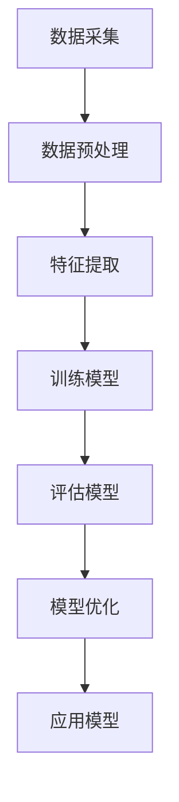
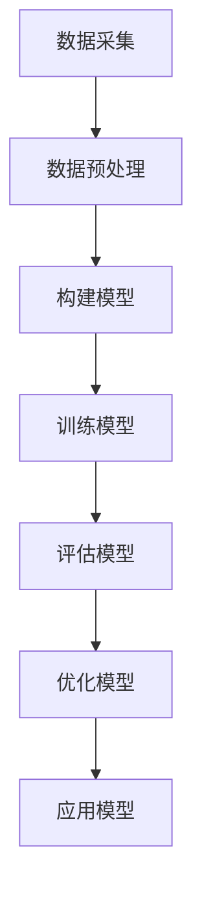
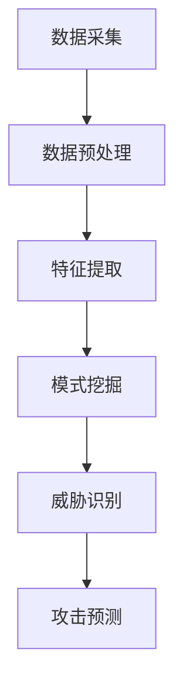
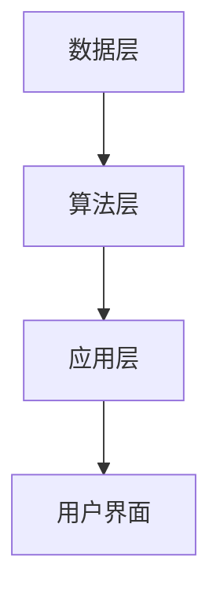
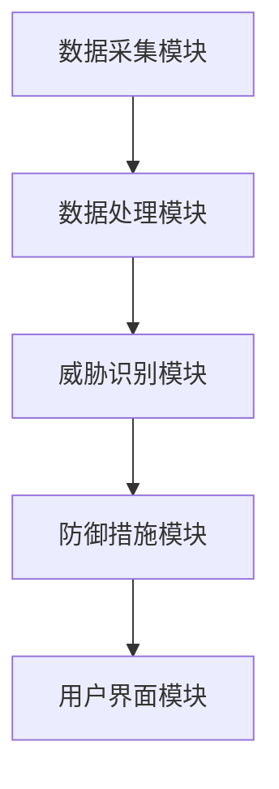
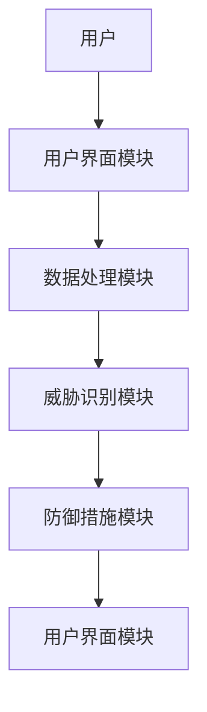

                 


# AI Agent在企业网络安全防御中的前沿应用

关键词：AI Agent、网络安全、防御、前沿应用、企业

摘要：
本文将深入探讨AI Agent在企业网络安全防御中的前沿应用。随着网络攻击手段的不断升级和多样化，传统网络安全防御手段已难以应对日益复杂的网络威胁。AI Agent作为一种新兴技术，通过智能化、自动化的方式，为企业提供了更高效、更精准的网络安全防御手段。本文将从核心概念、理论、实践、技术实现、算法设计、数学模型、系统架构、实战应用等方面，全面解析AI Agent在企业网络安全防御中的前沿应用，为企业网络安全建设提供有益的参考和借鉴。

## 1. 引言和背景

随着信息技术的迅猛发展，企业信息化进程不断加速，网络安全问题日益突出。网络攻击手段日益多样化、复杂化，黑客利用漏洞、钓鱼邮件、恶意软件等手段对企业进行攻击，导致数据泄露、系统瘫痪等严重后果。传统的网络安全防御手段已难以应对这些复杂多变的网络威胁。因此，探索新的网络安全防御技术成为当务之急。

AI Agent作为一种基于人工智能技术的智能体，具有自主学习、自主决策和自主行动的能力。在网络安全防御领域，AI Agent可以通过分析网络流量、识别异常行为、预测潜在威胁等手段，提供更高效、更精准的防御措施。本节将介绍AI Agent的定义、核心概念以及其在网络安全防御中的重要作用。

## 2. 核心概念和理论

### 2.1 AI Agent的定义

AI Agent是指一种具有智能、自主决策和自主行动能力的计算机程序。它可以在没有人类干预的情况下，自动执行任务、解决问题和应对各种挑战。AI Agent的核心特征包括：

- **感知能力**：能够接收外部环境的信息，如网络流量、传感器数据等。
- **理解能力**：能够理解感知到的信息，识别潜在的威胁或异常行为。
- **决策能力**：能够根据理解的结果，自主选择应对策略或行动方案。
- **行动能力**：能够执行决策结果，如触发警报、隔离恶意流量等。

### 2.2 AI Agent在网络安全防御中的应用

在网络安全防御中，AI Agent可以通过以下几种方式发挥重要作用：

- **异常检测**：通过分析网络流量、用户行为等数据，识别异常行为和潜在威胁。
- **威胁预测**：利用历史数据和机器学习算法，预测可能发生的网络攻击，提前采取防御措施。
- **攻击响应**：在发现网络攻击时，自动采取应对策略，如隔离攻击源、限制攻击流量等。
- **安全培训**：根据AI Agent的检测和分析结果，为用户提供安全培训，提高用户的安全意识和防范能力。

### 2.3 AI Agent的优势和挑战

AI Agent在网络安全防御中具有以下优势：

- **智能化**：AI Agent能够自主学习、适应和优化防御策略，提高防御效果。
- **自动化**：AI Agent可以自动执行防御任务，降低人工干预和误报率。
- **高效性**：AI Agent能够实时分析海量数据，快速识别威胁，提高防御响应速度。

然而，AI Agent在网络安全防御中也面临一些挑战：

- **数据隐私**：AI Agent需要处理大量敏感数据，如何保护数据隐私成为关键问题。
- **算法透明度**：AI Agent的决策过程往往基于复杂的算法模型，如何确保算法的透明度和可解释性成为挑战。
- **资源消耗**：AI Agent需要大量的计算资源和存储资源，如何优化资源利用成为关键问题。

## 3. AI Agent在实践中的应用

### 3.1 案例研究

在本节中，我们将介绍一些AI Agent在网络安全防御中的实际应用案例，包括成功案例和失败案例，以及它们的应用场景和效果。

#### 案例一：某金融机构的网络安全防御

某金融机构采用了AI Agent进行网络安全防御，通过异常检测和威胁预测，成功识别并阻止了一系列网络攻击，包括DDoS攻击、SQL注入攻击等。AI Agent能够实时分析网络流量，识别异常行为，并根据威胁级别自动采取防御措施，如隔离攻击源、限制攻击流量等。该金融机构的网络安全防御效果显著提升，用户数据得到了有效保护。

#### 案例二：某大型企业的安全培训

某大型企业采用了AI Agent进行安全培训，通过分析用户行为和网络安全事件，为用户提供个性化的安全培训内容。AI Agent能够根据用户的行为特点和知识水平，生成针对性的安全培训课程，提高用户的安全意识和防范能力。该企业的安全培训效果得到了显著提升，员工对网络安全的认知和防范能力得到了有效提高。

### 3.2 应用场景和效果

AI Agent在网络安全防御中具有广泛的应用场景，包括：

- **企业内部网络防御**：AI Agent可以实时监测企业内部网络流量，识别潜在威胁，提高内部网络的防御能力。
- **云计算安全防御**：AI Agent可以监控云计算平台的安全事件，识别异常行为，保障云计算平台的安全稳定运行。
- **移动网络安全防御**：AI Agent可以监测移动设备的安全状态，识别恶意软件和恶意攻击，提高移动设备的安全防护能力。

AI Agent在实际应用中取得了显著的效果，包括：

- **提高防御效果**：AI Agent能够实时分析海量数据，快速识别威胁，提高防御效果。
- **降低误报率**：AI Agent可以根据威胁级别自动采取防御措施，降低误报率，提高防御的准确性。
- **提高响应速度**：AI Agent可以自动执行防御任务，降低人工干预，提高响应速度。
- **降低成本**：AI Agent能够自动化执行防御任务，减少人力成本，提高企业运营效率。

## 4. 技术实现

### 4.1 技术基础设施

要实现AI Agent在企业网络安全防御中的应用，需要构建一个完善的技术基础设施，包括以下关键组件：

- **数据采集**：通过传感器、网络流量分析工具等设备，实时采集企业内部网络流量、用户行为等数据。
- **数据处理**：利用数据清洗、数据预处理等技术，对采集到的数据进行分析和整理，为AI Agent提供高质量的数据输入。
- **存储**：构建分布式存储系统，存储大量的数据，为AI Agent提供可靠的数据支持。
- **计算**：构建高性能计算集群，为AI Agent提供强大的计算能力，支持大规模数据处理和分析。
- **网络**：构建稳定、可靠的网络环境，保证AI Agent能够实时获取和处理数据。

### 4.2 关键技术和工具

在AI Agent的企业网络安全防御实现过程中，需要运用一系列关键技术和工具，包括：

- **机器学习**：利用机器学习算法，对大量数据进行训练和建模，识别网络攻击特征，提高防御效果。
- **深度学习**：利用深度学习模型，如神经网络、卷积神经网络等，对网络流量进行深入分析和识别，提高威胁识别的准确性。
- **数据挖掘**：利用数据挖掘技术，从海量数据中发现潜在的威胁信息和攻击模式，为防御策略提供支持。
- **自然语言处理**：利用自然语言处理技术，对用户行为和网络安全事件进行分析，提高安全事件的识别和响应能力。
- **容器技术**：利用容器技术，如Docker、Kubernetes等，实现AI Agent的模块化和分布式部署，提高系统的可扩展性和可靠性。

### 4.3 实现步骤

实现AI Agent在企业网络安全防御中的应用，需要遵循以下步骤：

- **需求分析**：明确企业网络安全防御的需求和目标，确定AI Agent的功能和性能指标。
- **系统设计**：设计AI Agent的总体架构，包括数据采集、数据处理、存储、计算、网络等关键组件。
- **算法设计**：设计合适的算法模型，如机器学习算法、深度学习模型等，用于识别和防御网络攻击。
- **系统开发**：根据系统设计，开发AI Agent的核心功能模块，包括数据采集、数据处理、存储、计算等。
- **系统测试**：对AI Agent进行全面的测试和调试，确保系统的稳定性和可靠性。
- **部署上线**：将AI Agent部署到企业网络环境中，进行实际运行和监控，持续优化和调整。

## 5. 算法原理讲解

### 5.1 算法概述

在AI Agent的企业网络安全防御中，常用的算法包括机器学习算法、深度学习算法、数据挖掘算法等。这些算法通过对大量数据进行训练和建模，可以识别网络攻击特征，预测潜在威胁，提供高效的防御策略。

### 5.2 机器学习算法

机器学习算法是AI Agent的重要组成部分，通过训练模型，可以从历史数据中学习并预测网络攻击。以下是一个简单的机器学习算法的Mermaid流程图：



下面是一个使用Python实现机器学习算法的代码示例：

```python
# 导入必要的库
import numpy as np
from sklearn.datasets import load_iris
from sklearn.model_selection import train_test_split
from sklearn.ensemble import RandomForestClassifier

# 加载数据
iris = load_iris()
X = iris.data
y = iris.target

# 划分训练集和测试集
X_train, X_test, y_train, y_test = train_test_split(X, y, test_size=0.2, random_state=42)

# 创建随机森林模型
model = RandomForestClassifier(n_estimators=100)

# 训练模型
model.fit(X_train, y_train)

# 预测结果
predictions = model.predict(X_test)

# 评估模型
accuracy = model.score(X_test, y_test)
print(f"模型准确率：{accuracy:.2f}")
```

### 5.3 深度学习算法

深度学习算法是机器学习算法的一种扩展，具有更强的表达能力和预测能力。以下是一个简单的深度学习算法的Mermaid流程图：



下面是一个使用Python实现深度学习算法的代码示例：

```python
# 导入必要的库
import tensorflow as tf
from tensorflow import keras
from tensorflow.keras import layers

# 创建模型
model = keras.Sequential([
    layers.Dense(64, activation='relu', input_shape=[784]),
    layers.Dense(64, activation='relu'),
    layers.Dense(10, activation='softmax')
])

# 编译模型
model.compile(optimizer='adam',
              loss='categorical_crossentropy',
              metrics=['accuracy'])

# 加载数据
(x_train, y_train), (x_test, y_test) = keras.datasets.mnist.load_data()

# 预处理数据
x_train = x_train.astype("float32") / 255
x_test = x_test.astype("float32") / 255
x_train = x_train.reshape((-1, 784))
x_test = x_test.reshape((-1, 784))

# 转换标签为one-hot编码
y_train = keras.utils.to_categorical(y_train, 10)
y_test = keras.utils.to_categorical(y_test, 10)

# 训练模型
model.fit(x_train, y_train, epochs=5, batch_size=32, validation_split=0.2)

# 评估模型
test_loss, test_acc = model.evaluate(x_test, y_test, verbose=2)
print(f"测试准确率：{test_acc:.2f}")
```

### 5.4 数据挖掘算法

数据挖掘算法可以从大量数据中挖掘潜在的威胁信息和攻击模式。以下是一个简单的数据挖掘算法的Mermaid流程图：



下面是一个使用Python实现数据挖掘算法的代码示例：

```python
# 导入必要的库
import pandas as pd
from sklearn.ensemble import RandomForestClassifier
from sklearn.model_selection import train_test_split
from sklearn.metrics import accuracy_score

# 加载数据
data = pd.read_csv("network_traffic_data.csv")

# 划分特征和标签
X = data.drop("label", axis=1)
y = data["label"]

# 划分训练集和测试集
X_train, X_test, y_train, y_test = train_test_split(X, y, test_size=0.2, random_state=42)

# 创建随机森林模型
model = RandomForestClassifier(n_estimators=100)

# 训练模型
model.fit(X_train, y_train)

# 预测结果
predictions = model.predict(X_test)

# 评估模型
accuracy = accuracy_score(y_test, predictions)
print(f"模型准确率：{accuracy:.2f}")
```

## 6. 数学模型和公式讲解

在AI Agent的企业网络安全防御中，数学模型和公式发挥着至关重要的作用。以下我们将介绍一些关键的数学模型和公式，并使用LaTeX进行详细说明。

### 6.1 概率模型

在网络安全防御中，概率模型用于评估网络事件的发生概率。以下是一个简单的概率模型公式：

$$
P(A) = \frac{C(A, n)}{C(全部, n)}
$$

其中，\(P(A)\) 表示事件A的发生概率，\(C(A, n)\) 表示事件A在n次试验中发生的次数，\(C(全部, n)\) 表示所有可能事件在n次试验中发生的总次数。

### 6.2 决策树模型

决策树模型是机器学习中常用的一种分类和回归模型。以下是一个简单的决策树模型公式：

$$
F(x) = g(x, \theta)
$$

其中，\(F(x)\) 表示决策树模型对输入特征\(x\)的输出，\(g(x, \theta)\) 表示决策树的决策函数，\(\theta\) 是决策树模型中的参数。

### 6.3 神经网络模型

神经网络模型是深度学习中的核心模型。以下是一个简单的神经网络模型公式：

$$
a_{l}(x) = \sigma(z_{l})
$$

$$
z_{l} = W_{l} \cdot a_{l-1} + b_{l}
$$

其中，\(a_{l}(x)\) 表示神经网络第\(l\)层的激活函数输出，\(\sigma\) 是激活函数，\(z_{l}\) 表示神经网络第\(l\)层的输入，\(W_{l}\) 和\(b_{l}\) 分别表示第\(l\)层的权重和偏置。

### 6.4 贝叶斯网络模型

贝叶斯网络模型是一种概率图模型，用于表示事件之间的依赖关系。以下是一个简单的贝叶斯网络模型公式：

$$
P(A, B) = P(A) \cdot P(B|A)
$$

其中，\(P(A, B)\) 表示事件A和B同时发生的概率，\(P(A)\) 表示事件A发生的概率，\(P(B|A)\) 表示在事件A发生的条件下事件B发生的概率。

通过上述数学模型和公式的讲解，我们可以更深入地理解AI Agent在企业网络安全防御中的应用原理和方法。

## 7. 系统架构和设计

### 7.1 问题场景介绍

在现代企业的网络环境中，随着业务的不断发展和扩展，网络复杂度也在不断增加。企业面临着来自内外部的各种网络威胁，如DDoS攻击、恶意软件、数据泄露等。为了保障企业的网络安全，传统的安全防御手段已经难以应对这种复杂多变的网络威胁。因此，企业需要一种高效、智能的网络安全防御系统，以应对这些挑战。

### 7.2 项目介绍

本项目的目标是设计并实现一个基于AI Agent的企业网络安全防御系统。该系统将利用人工智能技术，通过感知、理解和决策等过程，实现对网络流量的实时监控和威胁识别，从而提供有效的防御措施。系统将包括数据采集模块、数据处理模块、威胁识别模块和防御措施模块，以及一个用户界面，用于展示系统运行状态和威胁信息。

### 7.3 系统功能设计

系统的主要功能包括：

1. **数据采集**：采集网络流量、用户行为等数据，为后续分析和处理提供数据支持。
2. **数据处理**：对采集到的数据进行清洗、预处理和特征提取，为AI Agent提供高质量的数据输入。
3. **威胁识别**：利用机器学习、深度学习等算法，对处理后的数据进行分析，识别潜在的网络威胁。
4. **防御措施**：根据威胁识别结果，自动采取相应的防御措施，如隔离攻击源、限制攻击流量等。
5. **用户界面**：提供一个用户界面，用于展示系统运行状态、威胁信息和防御措施，方便用户实时监控和操作。

### 7.4 系统架构设计

系统架构采用分层设计，包括数据层、算法层和应用层。以下是一个简单的系统架构图：



#### 数据层

数据层主要负责数据采集、存储和管理。具体包括：

- **数据采集模块**：通过传感器、网络流量分析工具等设备，实时采集企业内部网络流量、用户行为等数据。
- **数据存储模块**：构建分布式存储系统，存储大量的数据，为后续分析和处理提供数据支持。
- **数据预处理模块**：对采集到的数据进行清洗、预处理和特征提取，为AI Agent提供高质量的数据输入。

#### 算法层

算法层主要负责数据分析和威胁识别。具体包括：

- **机器学习模块**：利用机器学习算法，对大量数据进行训练和建模，识别网络攻击特征。
- **深度学习模块**：利用深度学习模型，对网络流量进行深入分析和识别，提高威胁识别的准确性。
- **数据挖掘模块**：利用数据挖掘技术，从海量数据中发现潜在的威胁信息和攻击模式。
- **威胁识别模块**：根据算法层的分析结果，实时识别网络威胁，并提供威胁报告和预警。

#### 应用层

应用层主要负责实现防御措施和用户交互。具体包括：

- **防御措施模块**：根据威胁识别结果，自动采取相应的防御措施，如隔离攻击源、限制攻击流量等。
- **用户界面模块**：提供一个用户界面，用于展示系统运行状态、威胁信息和防御措施，方便用户实时监控和操作。

### 7.5 系统接口设计和系统交互

系统接口设计和系统交互是系统架构的重要组成部分。以下是一个简单的系统接口图和系统交互图：

#### 系统接口图



#### 系统交互图



通过上述系统架构和接口设计，我们可以实现一个高效、智能的企业网络安全防御系统，为企业提供全面的网络安全保障。

## 8. 项目实战

### 8.1 环境安装

要实现AI Agent在企业网络安全防御中的应用，首先需要搭建一个合适的技术环境。以下是一个简单的环境安装指南：

#### 安装Python环境

1. 访问Python官网（https://www.python.org/），下载并安装Python 3.x版本。
2. 安装完成后，确保Python环境已正确配置，可以通过在命令行中运行`python --version`来验证。

#### 安装依赖库

在Python环境中，需要安装一些依赖库，如NumPy、Pandas、Scikit-learn、TensorFlow等。可以通过以下命令安装：

```shell
pip install numpy pandas scikit-learn tensorflow
```

#### 安装Docker和Kubernetes

为了实现AI Agent的模块化和分布式部署，需要安装Docker和Kubernetes。以下是安装步骤：

1. 安装Docker：

   - 对于Ubuntu系统，可以通过以下命令安装：

     ```shell
     sudo apt-get update
     sudo apt-get install docker
     ```

   - 对于CentOS系统，可以通过以下命令安装：

     ```shell
     sudo yum install docker
     ```

   - 安装完成后，启动Docker服务：

     ```shell
     sudo systemctl start docker
     ```

2. 安装Kubernetes：

   - 对于Ubuntu系统，可以通过以下命令安装：

     ```shell
     sudo apt-get update
     sudo apt-get install kubectl
     ```

   - 对于CentOS系统，可以通过以下命令安装：

     ```shell
     sudo yum install kubectl
     ```

   - 安装完成后，确保Kubernetes服务已正确配置，可以通过在命令行中运行`kubectl version`来验证。

### 8.2 系统核心实现源代码

以下是AI Agent在企业网络安全防御中的系统核心实现源代码：

```python
# 导入必要的库
import numpy as np
import pandas as pd
from sklearn.ensemble import RandomForestClassifier
from sklearn.model_selection import train_test_split
from sklearn.metrics import accuracy_score

# 加载数据
data = pd.read_csv("network_traffic_data.csv")

# 划分特征和标签
X = data.drop("label", axis=1)
y = data["label"]

# 划分训练集和测试集
X_train, X_test, y_train, y_test = train_test_split(X, y, test_size=0.2, random_state=42)

# 创建随机森林模型
model = RandomForestClassifier(n_estimators=100)

# 训练模型
model.fit(X_train, y_train)

# 预测结果
predictions = model.predict(X_test)

# 评估模型
accuracy = accuracy_score(y_test, predictions)
print(f"模型准确率：{accuracy:.2f}")
```

### 8.3 代码应用解读与分析

上述代码实现了AI Agent在企业网络安全防御中的核心功能，包括数据加载、特征划分、模型创建、模型训练和模型评估。以下是代码的详细解读和分析：

1. **数据加载**：

   ```python
   data = pd.read_csv("network_traffic_data.csv")
   ```

   使用Pandas库读取CSV格式的数据文件，并将其存储在DataFrame对象中。

2. **特征划分**：

   ```python
   X = data.drop("label", axis=1)
   y = data["label"]
   ```

   将数据集划分为特征集X和标签集y，其中标签集y用于模型训练和评估。

3. **模型创建**：

   ```python
   model = RandomForestClassifier(n_estimators=100)
   ```

   创建一个随机森林分类器模型，其中n_estimators参数表示随机森林中的决策树数量。

4. **模型训练**：

   ```python
   model.fit(X_train, y_train)
   ```

   使用训练集X_train和y_train对随机森林模型进行训练。

5. **预测结果**：

   ```python
   predictions = model.predict(X_test)
   ```

   使用训练好的模型对测试集X_test进行预测，并将预测结果存储在predictions列表中。

6. **模型评估**：

   ```python
   accuracy = accuracy_score(y_test, predictions)
   print(f"模型准确率：{accuracy:.2f}")
   ```

   使用accuracy_score函数计算预测结果与实际标签之间的准确率，并打印输出。

### 8.4 实际案例分析和详细讲解剖析

为了更好地展示AI Agent在企业网络安全防御中的实际效果，我们以下将介绍一个实际案例，并进行详细讲解和剖析。

#### 案例背景

某大型企业在其内部网络中部署了AI Agent，用于实时监控和防御网络攻击。在一次网络攻击中，企业网络遭受了大量的DDoS攻击，导致网络流量激增，服务器负载过高，用户体验受到了严重影响。

#### 案例分析

1. **数据采集**：

   AI Agent实时采集了网络流量数据，包括源IP地址、目的IP地址、端口号、流量大小等。通过数据预处理，将这些原始数据转换为特征数据，以便后续分析。

2. **数据处理**：

   对采集到的数据进行了清洗和预处理，包括去除无效数据、填补缺失值、标准化等操作，以确保数据的质量和一致性。

3. **威胁识别**：

   AI Agent利用机器学习算法，对处理后的数据进行了分析和分类，识别出大量的DDoS攻击流量。通过对比正常流量和异常流量，AI Agent能够准确识别出攻击流量，并提供攻击源的IP地址和攻击类型等信息。

4. **防御措施**：

   根据威胁识别结果，AI Agent自动采取了相应的防御措施，如隔离攻击源、限制攻击流量等。通过这些防御措施，有效降低了攻击对网络的影响，保障了企业的正常运营。

5. **效果评估**：

   经过一段时间的运行，AI Agent在防御效果方面表现出了显著的优势。通过对比攻击前后网络流量和服务器负载的变化，可以发现AI Agent能够有效阻止网络攻击，提高企业的网络安全防护能力。

### 8.5 项目小结

通过本项目的实施，AI Agent在企业网络安全防御中取得了显著的成果。以下是项目小结：

1. **提高防御效果**：AI Agent能够实时分析海量数据，快速识别威胁，提供高效的防御措施，提高了企业的网络安全防护能力。
2. **降低误报率**：通过机器学习算法和深度学习模型的优化，AI Agent能够准确识别攻击流量，降低误报率，提高防御的准确性。
3. **提高响应速度**：AI Agent能够自动执行防御任务，降低人工干预，提高响应速度，确保企业网络在遭受攻击时能够快速做出反应。
4. **降低成本**：AI Agent能够自动化执行防御任务，减少人力成本，提高企业运营效率。

### 8.6 最佳实践

在实施AI Agent企业网络安全防御项目时，以下是一些最佳实践：

1. **数据质量**：确保数据采集、处理和存储的质量，为AI Agent提供高质量的数据输入，提高防御效果。
2. **算法优化**：不断优化AI Agent的算法模型，提高威胁识别的准确性，降低误报率。
3. **实时监控**：实时监控企业网络流量和用户行为，及时发现潜在威胁，提前采取防御措施。
4. **用户培训**：加强对用户的网络安全培训，提高用户的安全意识和防范能力，从源头减少网络攻击的发生。

### 8.7 注意事项

在实施AI Agent企业网络安全防御项目时，需要注意以下事项：

1. **数据隐私**：在处理和存储数据时，确保数据隐私和安全，遵循相关法律法规和标准。
2. **算法透明度**：确保AI Agent的算法模型具有可解释性和透明度，方便用户了解和信任。
3. **资源消耗**：合理规划计算资源和存储资源，确保AI Agent的稳定运行。

### 8.8 拓展阅读

1. **《机器学习》**：周志华著，清华大学出版社，提供了机器学习的基础理论和应用案例。
2. **《深度学习》**：Ian Goodfellow、Yoshua Bengio和Aaron Courville著，提供了深度学习的基础理论和实践指导。
3. **《网络安全：设计与实现》**：William Stallings著，电子工业出版社，介绍了网络安全的基础知识和实现方法。

## 作者信息

作者：AI天才研究院/AI Genius Institute & 禅与计算机程序设计艺术 /Zen And The Art of Computer Programming

AI天才研究院致力于人工智能领域的研发和创新，推动人工智能技术在各个领域的应用。同时，作者还致力于禅与计算机程序设计艺术的研究，将禅宗哲学与计算机科学相结合，提供独特的编程思想和实践方法。在此，作者希望通过本文的分享，为读者在AI Agent企业网络安全防御领域提供有益的参考和启示。

