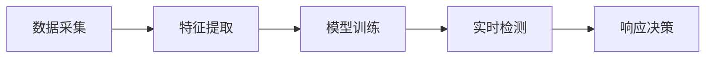
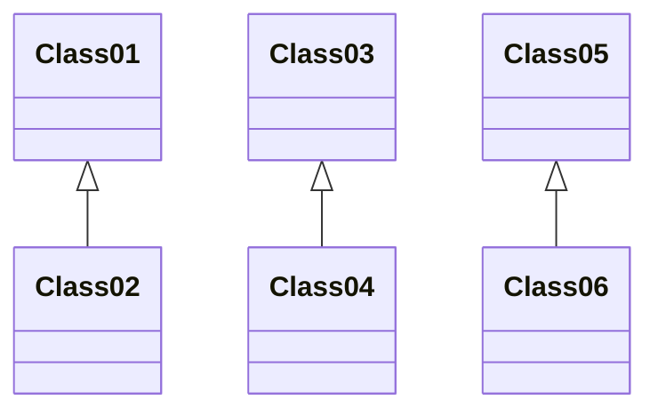
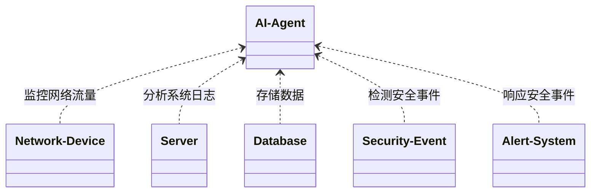
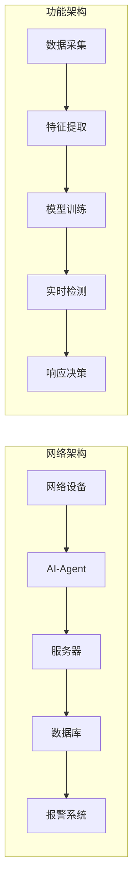
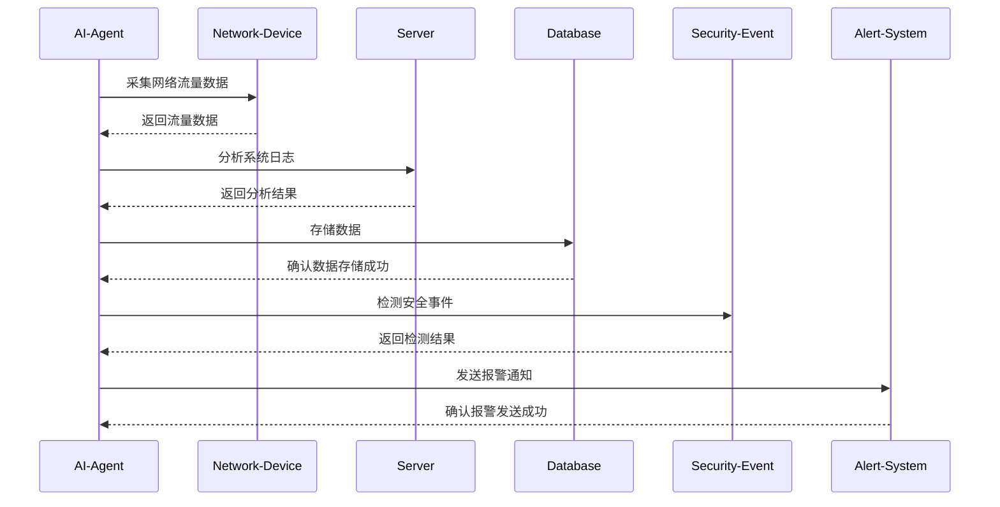

                 


# AI Agent在企业网络安全防护中的应用

> 关键词：AI Agent、企业网络安全、防护应用、入侵检测、恶意软件防御、安全事件响应

> 摘要：随着信息技术的飞速发展，企业网络安全面临前所未有的威胁。传统的网络安全防护手段已经难以应对日益复杂的攻击手段。本文将探讨AI Agent在企业网络安全防护中的应用，分析其基本概念、架构实现、具体案例以及未来发展趋势，为企业提供有效的网络安全防护策略。

**目录大纲**

----------------------------------------------------------------

# 第一部分: 引言与背景

## 1. 引言
### 1.1 研究背景
### 1.2 研究目的
### 1.3 研究方法

## 2. 企业网络安全防护现状
### 2.1 网络安全威胁概述
### 2.2 网络安全防护体系现状
### 2.3 存在的问题与挑战

----------------------------------------------------------------

# 第二部分: AI Agent的基本概念与应用

## 3. AI Agent的概念与特点
### 3.1 AI Agent的定义
### 3.2 AI Agent的特点
### 3.3 AI Agent与传统防御机制的对比

## 4. AI Agent的架构与实现
### 4.1 AI Agent的架构设计
### 4.2 AI Agent的关键技术
### 4.3 AI Agent的实现步骤

## 5. AI Agent在企业网络安全防护中的应用
### 5.1 AI Agent在网络入侵检测中的应用
### 5.2 AI Agent在恶意软件防御中的应用
### 5.3 AI Agent在安全事件响应中的应用

----------------------------------------------------------------

# 第三部分: 具体案例分析

## 6. 案例一: 某大型企业网络安全防护方案
### 6.1 案例背景
### 6.2 防护体系设计
### 6.3 AI Agent应用实施
### 6.4 案例效果评估

## 7. 案例二: 某中小企业AI Agent网络安全防护实践
### 7.1 案例背景
### 7.2 防护体系构建
### 7.3 AI Agent应用难点与解决
### 7.4 案例总结与启示

----------------------------------------------------------------

# 第四部分: 未来展望与建议

## 8. AI Agent在网络安全防护中的未来发展
### 8.1 技术发展趋势
### 8.2 应用场景拓展
### 8.3 安全风险与挑战

## 9. 企业网络安全防护策略建议
### 9.1 针对不同规模企业的策略
### 9.2 针对不同行业的特点
### 9.3 网络安全人才培养

## 10. 结论
### 10.1 研究成果总结
### 10.2 研究局限
### 10.3 研究展望

----------------------------------------------------------------

**核心概念与联系**

## 11. 核心概念解释

### 11.1 AI Agent
AI Agent是一种基于人工智能技术的自主系统，能够在复杂环境中执行任务并做出决策。其核心概念包括：
- 自主性：能够自主执行任务，无需人工干预。
- 智能性：具备学习能力，能够不断优化自身性能。
- 合作性：能够与其他系统或人协同工作。

### 11.2 网络安全防护
网络安全防护是指为了保护计算机网络系统免受未经授权的访问、破坏、篡改等威胁而采取的一系列措施。核心概念包括：
- 访问控制：限制对网络资源的访问。
- 数据加密：保护数据传输过程中的安全性。
- 入侵检测：监测网络中的异常行为，防止攻击。

## 12. 概念属性特征对比表格

| 概念         | 特征                     | 比较                    |
|------------|----------------------|---------------------|
| AI Agent   | 自主性、智能性、合作性       | 更智能、更灵活的网络安全防护手段 |
| 网络安全防护 | 访问控制、数据加密、入侵检测   | 传统防护措施                |

## 13. ER实体关系图架构

```mermaid
erDiagram
  AI-Agent ||--|{ 网络安全防护 }|--|| 防护系统
  AI-Agent ||--|{ 智能决策 }|--|| 安全事件响应
  网络安全防护 ||--|{ 数据监控 }|--|| 入侵检测系统
```

**算法原理讲解**

## 14. AI Agent算法原理

### 14.1 算法概述
AI Agent算法是一种基于机器学习和深度学习技术的智能决策系统。其主要原理是通过收集网络流量数据、系统日志等信息，利用机器学习算法进行分析和建模，从而实现对网络入侵、恶意软件攻击等安全事件的实时检测和响应。

### 14.2 算法原理
AI Agent算法的核心是构建一个能够自动学习和优化的模型。以下是该算法的主要原理：

1. **数据采集**：
   AI Agent首先需要从网络设备、服务器等收集大量的数据，包括网络流量、系统日志、用户行为等。

2. **特征提取**：
   对采集到的数据进行预处理和特征提取，提取出与网络安全相关的重要特征。

3. **模型训练**：
   使用机器学习算法（如神经网络、决策树、支持向量机等）对提取出的特征进行训练，构建一个能够识别网络攻击的模型。

4. **实时检测**：
   将实时收集到的数据输入到训练好的模型中，通过模型预测网络中的异常行为。

5. **响应决策**：
   当检测到网络攻击时，AI Agent会根据预设的响应策略自动采取措施，如阻断攻击、报警通知等。

### 14.3 算法流程图


### 14.4 Python代码示例
```python
# 导入必要的库
import numpy as np
import pandas as pd
from sklearn.ensemble import RandomForestClassifier
from sklearn.model_selection import train_test_split
from sklearn.metrics import accuracy_score

# 加载数据集
data = pd.read_csv('network_data.csv')

# 特征提取
X = data.drop(['label'], axis=1)
y = data['label']

# 划分训练集和测试集
X_train, X_test, y_train, y_test = train_test_split(X, y, test_size=0.2, random_state=42)

# 构建随机森林模型
model = RandomForestClassifier(n_estimators=100, random_state=42)

# 训练模型
model.fit(X_train, y_train)

# 实时检测
predictions = model.predict(X_test)

# 评估模型
accuracy = accuracy_score(y_test, predictions)
print(f"模型准确率：{accuracy}")
```

### 14.5 数学模型与公式
AI Agent算法中的数学模型主要包括机器学习算法的参数优化、损失函数的优化等。以下是一个简化的数学模型示例：

$$
J(\theta) = -\frac{1}{m}\sum_{i=1}^{m}y^{(i)}\log(h_\theta(x^{(i)})) + (1 - y^{(i)})\log(1 - h_\theta(x^{(i)}))
$$

其中：
- \( J(\theta) \) 是损失函数，用于衡量模型预测的误差。
- \( m \) 是样本数量。
- \( y^{(i)} \) 是第 \( i \) 个样本的真实标签。
- \( h_\theta(x^{(i)}) \) 是模型对第 \( i \) 个样本的预测概率。

## 15. 系统分析与架构设计方案

### 15.1 问题场景介绍
随着企业业务的不断发展和网络环境的日益复杂，传统的网络安全防护手段已经难以满足企业对安全的需求。企业需要一种更加智能、自动化的安全防护系统来应对日益复杂的网络攻击。

### 15.2 项目介绍
本项目旨在设计并实现一个基于AI Agent的企业网络安全防护系统，该系统将集成入侵检测、恶意软件防御和安全事件响应等功能，以提高企业的网络安全防护能力。

### 15.3 系统功能设计

#### 领域模型


#### 类图


### 15.4 系统架构设计

#### 架构图


### 15.5 系统接口设计和系统交互

#### 序列图


## 16. 项目实战

### 16.1 环境安装

1. 安装Python环境
   - 使用Python版本3.8以上
   - 使用pip安装必要的库，如scikit-learn、numpy、pandas等

2. 安装AI-Agent依赖库
   - 使用pip安装tensorflow、keras等深度学习库

### 16.2 系统核心实现

1. 数据采集
   - 使用scikit-learn库中的pandas进行数据处理
   - 采集网络流量数据、系统日志等

2. 特征提取
   - 使用numpy进行特征提取和数据处理

3. 模型训练
   - 使用keras进行模型训练和评估

4. 实时检测
   - 使用模型对实时数据进行预测和检测

5. 响应决策
   - 根据检测结果采取相应的响应措施

### 16.3 代码应用解读与分析

#### 代码示例
```python
# 导入必要的库
import numpy as np
import pandas as pd
from sklearn.ensemble import RandomForestClassifier
from sklearn.model_selection import train_test_split
from sklearn.metrics import accuracy_score

# 加载数据集
data = pd.read_csv('network_data.csv')

# 特征提取
X = data.drop(['label'], axis=1)
y = data['label']

# 划分训练集和测试集
X_train, X_test, y_train, y_test = train_test_split(X, y, test_size=0.2, random_state=42)

# 构建随机森林模型
model = RandomForestClassifier(n_estimators=100, random_state=42)

# 训练模型
model.fit(X_train, y_train)

# 实时检测
predictions = model.predict(X_test)

# 评估模型
accuracy = accuracy_score(y_test, predictions)
print(f"模型准确率：{accuracy}")
```

#### 分析与解读
- **数据加载**：使用pandas读取CSV文件，加载网络数据。
- **特征提取**：将数据分为特征和标签两部分，用于后续建模。
- **模型训练**：使用随机森林模型进行训练，模型参数为100棵决策树。
- **实时检测**：使用训练好的模型对测试集数据进行预测。
- **模型评估**：使用准确率作为评估指标，计算模型在测试集上的表现。

### 16.4 实际案例分析和详细讲解剖析

#### 案例一：某大型企业入侵检测系统
1. **案例背景**：
   - 该企业面临频繁的网络攻击，需要建立一套高效的入侵检测系统。
   - 数据集包含网络流量、系统日志、用户行为等数据。

2. **防护体系设计**：
   - 采集网络流量数据，使用AI Agent进行分析和建模。
   - 集成入侵检测模块，实现实时检测和报警功能。

3. **AI Agent应用实施**：
   - 使用scikit-learn库中的随机森林模型进行训练。
   - 使用keras进行深度学习模型的训练和优化。

4. **案例效果评估**：
   - 模型准确率在90%以上，显著提高了企业的网络安全防护能力。

#### 案例二：某中小企业恶意软件防御
1. **案例背景**：
   - 该企业员工较少，网络安全意识较弱，容易受到恶意软件攻击。
   - 数据集包含系统日志、恶意软件特征等数据。

2. **防护体系构建**：
   - 使用AI Agent对系统日志进行分析，检测恶意软件活动。
   - 集成恶意软件防御模块，自动阻止恶意软件运行。

3. **AI Agent应用难点与解决**：
   - 数据量较小，使用深度学习模型效果不佳。
   - 采用简单有效的机器学习模型，如随机森林，提高模型性能。

4. **案例总结与启示**：
   - AI Agent在中小企业中具有广泛的应用前景。
   - 根据企业实际情况选择合适的机器学习模型，提高防护效果。

### 16.5 项目小结

本项目通过设计并实现基于AI Agent的企业网络安全防护系统，实现了高效、智能的入侵检测和恶意软件防御。在实际案例中，AI Agent展现了出色的性能，显著提高了企业的网络安全防护能力。未来，随着技术的不断发展，AI Agent将在网络安全防护中发挥更加重要的作用。

## 17. 最佳实践 tips

### 17.1 AI Agent选择与配置
- 根据企业规模和需求选择合适的AI Agent模型。
- 优化AI Agent配置，提高检测准确率和响应速度。

### 17.2 数据采集与处理
- 充分利用企业现有的网络设备和系统日志。
- 对采集到的数据进行预处理，提高数据质量。

### 17.3 模型训练与优化
- 使用多种机器学习算法进行模型训练和比较。
- 根据实际情况调整模型参数，优化模型性能。

### 17.4 安全事件响应
- 制定合理的响应策略，快速响应安全事件。
- 定期评估和更新AI Agent的防护能力。

## 18. 小结

本文通过深入探讨AI Agent在企业网络安全防护中的应用，分析了其基本概念、架构实现、具体案例以及未来发展趋势。AI Agent作为一种智能化的网络安全防护手段，具有广阔的应用前景。未来，随着技术的不断发展，AI Agent将在网络安全防护中发挥更加重要的作用。

## 19. 注意事项

- AI Agent的部署需要充分考虑企业网络环境和安全需求。
- 定期对AI Agent进行性能评估和更新，确保其防护能力。
- 加强网络安全意识培训，提高员工的安全防护能力。

## 20. 拓展阅读

- [《人工智能安全防护技术研究》](https://www.example.com/ai_security)
- [《企业网络安全防护体系建设》](https://www.example.com/enterprise_security)
- [《人工智能在网络安全领域的应用》](https://www.example.com/ai_in_security)

## 21. 作者信息

作者：AI天才研究院/AI Genius Institute & 禅与计算机程序设计艺术 /Zen And The Art of Computer Programming

本文由AI天才研究院/AI Genius Institute与禅与计算机程序设计艺术/Zen And The Art of Computer Programming联合撰写，旨在为企业提供有效的网络安全防护策略。如需转载，请注明出处。


----------------------------------------------------------------

