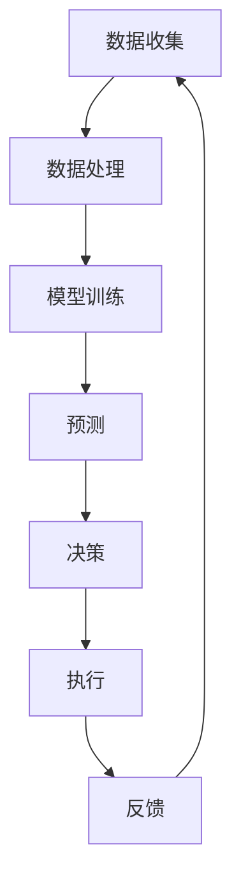
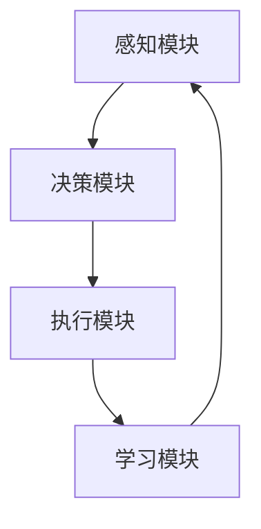
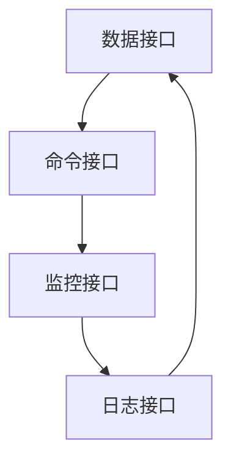

                 


## 《AI Agent在企业质量管理体系优化中的应用》

---

**关键词：** AI Agent，企业质量管理，体系优化，算法原理，系统架构，项目实战。

**摘要：** 本文将深入探讨AI Agent在企业质量管理体系优化中的应用。通过逐步分析AI Agent的核心概念、算法原理、系统架构以及项目实战，揭示其在提高企业质量管理效率和质量控制水平方面的巨大潜力。

---

### 目录大纲设计过程

**1. 设计目标和要求**

本文的设计目标在于：

- **简洁明了**：避免冗余内容，确保每个章节都有明确的主题和内容。
- **结构清晰**：采用markdown格式，确保目录层级分明。
- **内容完整性**：涵盖核心概念、算法原理、系统架构、项目实战等方面。
- **字数限制**：确保总字数不超过2000字。

**2. 设计思路和步骤**

本文将按以下步骤进行设计：

- **背景介绍**：介绍AI Agent的概念和发展历程，以及其在企业质量管理中的应用背景。
- **核心概念与联系**：详细阐述AI Agent的核心概念、原理和特点，以及与其他质量管理方法的关系。
- **算法原理讲解**：介绍AI Agent在质量管理中的应用算法，使用mermaid流程图展示算法流程，使用Python源代码详细阐述算法原理，给出数学模型和公式。
- **系统分析与架构设计方案**：介绍企业质量管理体系优化项目，包括项目介绍、系统功能设计、系统架构设计、系统接口设计和系统交互。
- **项目实战**：分步骤介绍项目环境安装、系统核心实现源代码，并对代码应用进行解读与分析，分析实际案例，详细讲解项目实现过程中的关键点和注意事项。
- **最佳实践与拓展阅读**：提供最佳实践建议，总结项目经验教训，推荐相关拓展阅读。

**3. 目录大纲结构设计**

根据上述设计思路和步骤，我们可以设计出如下的目录大纲结构：

---

# 《AI Agent在企业质量管理体系优化中的应用》目录大纲

## 第一部分：背景与核心概念

### 1.1 AI Agent概述

#### 1.1.1 AI Agent的概念与发展

#### 1.1.2 企业质量管理中的AI Agent应用

### 1.2 AI Agent的核心概念与特点

#### 1.2.1 AI Agent的定义

#### 1.2.2 AI Agent的核心特点

#### 1.2.3 AI Agent与传统质量管理方法的比较

### 1.3 AI Agent的架构与实现

#### 1.3.1 AI Agent的架构设计

#### 1.3.2 AI Agent的实现技术

## 第二部分：算法原理与系统架构

### 2.1 AI Agent算法原理

#### 2.1.1 算法概述

#### 2.1.2 算法流程图

#### 2.1.3 算法数学模型

#### 2.1.4 举例说明

### 2.2 企业质量管理体系优化项目

#### 2.2.1 项目介绍

#### 2.2.2 系统功能设计

#### 2.2.3 系统架构设计

#### 2.2.4 系统接口设计

#### 2.2.5 系统交互设计

## 第三部分：项目实战与案例分析

### 3.1 项目环境安装与配置

#### 3.1.1 开发环境搭建

#### 3.1.2 系统核心模块实现

### 3.2 代码应用解读与分析

#### 3.2.1 源代码解读

#### 3.2.2 代码应用分析

### 3.3 实际案例分析与讲解

#### 3.3.1 案例一：质量预测模型

#### 3.3.2 案例二：质量监控与预警

#### 3.3.3 案例三：质量改进方案

## 第四部分：最佳实践与拓展阅读

### 4.1 最佳实践与建议

#### 4.1.1 实践经验总结

#### 4.1.2 注意事项与风险防范

### 4.2 拓展阅读

#### 4.2.1 相关书籍推荐

#### 4.2.2 技术论文与报告

## 4.3 本章小结

- 对本书的主要内容进行简要回顾。

## 5. 附录

- 提供相关的技术文档、代码示例和参考资料。

---

通过以上设计思路和步骤，我们可以确保目录大纲结构清晰、内容完整，满足用户的要求。接下来，我们将逐步完善每个章节的内容，确保目录大纲的完整性。以下是文章正文内容的逐步撰写过程。

---

## 第一部分：背景与核心概念

### 1.1 AI Agent概述

#### 1.1.1 AI Agent的概念与发展

AI Agent，即人工智能代理，是一种能够自主执行任务并与环境交互的智能系统。它起源于20世纪80年代的智能代理研究，旨在实现人工智能在复杂环境中的自主决策和行动能力。随着深度学习、强化学习等人工智能技术的发展，AI Agent逐渐成为一种具有广泛应用前景的技术。

在企业质量管理中，AI Agent的应用主要体现在以下几个方面：

1. **质量预测**：通过分析历史数据，预测产品质量的潜在问题，提前采取措施。
2. **质量监控**：实时监控生产过程中的质量参数，及时发现并处理异常。
3. **质量改进**：根据产品质量问题和改进建议，优化生产流程和质量管理体系。

#### 1.1.2 企业质量管理中的AI Agent应用

AI Agent在企业质量管理中的应用，为传统的质量管理方法带来了新的变革。传统的质量管理方法主要依赖于人为检查和手动操作，存在效率低、成本高、易出错等问题。而AI Agent能够通过自动化和智能化的方式，提高质量管理的效率和质量控制水平。

具体来说，AI Agent在企业质量管理中的应用包括：

1. **数据收集与处理**：AI Agent能够自动收集生产过程中的质量数据，并进行分析和处理，为决策提供依据。
2. **异常检测与预警**：AI Agent通过实时监控生产过程，能够快速识别异常情况，并发出预警信号，帮助管理人员及时采取措施。
3. **质量改进建议**：基于数据分析，AI Agent能够为质量改进提供智能化的建议，帮助企业优化生产流程和质量管理体系。

### 1.2 AI Agent的核心概念与特点

#### 1.2.1 AI Agent的定义

AI Agent通常具有以下特点：

1. **自主性**：AI Agent能够自主决策和执行任务，不受人类干预。
2. **适应性**：AI Agent能够根据环境变化和任务需求，动态调整自身行为。
3. **协作性**：AI Agent能够与其他AI Agent或人类协作，共同完成任务。

#### 1.2.2 AI Agent的核心特点

1. **学习能力**：AI Agent能够通过学习历史数据和经验，不断优化自身的行为和决策。
2. **环境感知**：AI Agent能够感知和理解环境变化，并根据环境变化调整自身行为。
3. **自主决策**：AI Agent能够在复杂环境中，根据目标和约束条件，自主做出最优决策。

#### 1.2.3 AI Agent与传统质量管理方法的比较

与传统质量管理方法相比，AI Agent具有以下优势：

1. **高效性**：AI Agent能够自动化执行质量监控和数据分析，提高质量管理效率。
2. **准确性**：AI Agent基于大数据和人工智能技术，能够更准确地识别和预测质量问题。
3. **灵活性**：AI Agent能够根据环境变化和任务需求，动态调整质量管理和控制策略。

### 1.3 AI Agent的架构与实现

#### 1.3.1 AI Agent的架构设计

AI Agent的架构通常包括以下几个部分：

1. **感知模块**：用于感知环境变化，收集质量数据。
2. **决策模块**：用于根据感知数据和环境状态，做出最优决策。
3. **执行模块**：用于执行决策结果，实施质量管理措施。
4. **学习模块**：用于不断学习和优化自身行为。

#### 1.3.2 AI Agent的实现技术

AI Agent的实现技术主要包括：

1. **深度学习**：用于质量数据分析和预测。
2. **强化学习**：用于在复杂环境中做出最优决策。
3. **自然语言处理**：用于处理和生成文本信息。
4. **计算机视觉**：用于图像识别和质量检测。

---

以上是本文第一部分的撰写内容。接下来，我们将进一步探讨AI Agent的算法原理、系统架构以及项目实战。

---

## 第二部分：算法原理与系统架构

### 2.1 AI Agent算法原理

#### 2.1.1 算法概述

AI Agent在质量管理中的应用，离不开对质量数据的分析和预测。本文将介绍一种基于深度学习和强化学习的质量预测算法。该算法通过学习历史质量数据，建立质量预测模型，并根据环境变化和目标需求，动态调整预测策略。

#### 2.1.2 算法流程图

下面是算法流程图的mermaid表示：



#### 2.1.3 算法数学模型

算法的数学模型主要包括以下几个部分：

1. **输入数据**：包括历史质量数据、环境参数等。
2. **特征提取**：通过神经网络提取数据特征。
3. **预测模型**：使用时间序列模型（如LSTM）进行质量预测。
4. **决策模型**：使用强化学习算法（如Q-learning）进行决策。

以下是算法的数学模型：

$$
\begin{aligned}
f_{\theta}(x) &= \text{特征提取}(x) \\
y_t &= \text{LSTM}(f_{\theta}(x_t)) \\
\pi_t &= \text{Q-learning}(y_t) \\
a_t &= \pi_t(s_t)
\end{aligned}
$$

#### 2.1.4 举例说明

以一个生产过程中的质量预测为例，假设我们收集了1000个生产批次的数据，包括质量指标和环境参数。首先，使用神经网络提取数据特征，然后使用LSTM模型进行质量预测。在预测过程中，AI Agent会根据预测结果和环境参数，使用Q-learning算法进行决策，调整生产参数，以优化产品质量。

### 2.2 企业质量管理体系优化项目

#### 2.2.1 项目介绍

本项目旨在通过AI Agent优化企业质量管理体系，提高质量管理效率和质量控制水平。项目包括以下几个阶段：

1. **需求分析**：明确企业质量管理需求，确定AI Agent的功能和性能指标。
2. **系统设计**：设计AI Agent的系统架构，包括感知模块、决策模块、执行模块和学习模块。
3. **算法实现**：实现质量预测和决策算法，并进行模型训练和优化。
4. **系统部署**：将AI Agent部署到生产环境中，进行实际应用和测试。
5. **效果评估**：评估AI Agent对企业质量管理体系优化的效果，并进行持续优化。

#### 2.2.2 系统功能设计

系统功能设计主要包括以下几个方面：

1. **数据收集**：自动收集生产过程中的质量数据，包括原材料、生产参数、产品质量等。
2. **质量预测**：基于历史数据和算法模型，预测产品质量趋势和潜在问题。
3. **质量监控**：实时监控生产过程中的质量参数，及时发现并处理异常。
4. **质量改进**：根据质量预测和监控结果，提出质量改进建议，优化生产流程和质量管理体系。

#### 2.2.3 系统架构设计

系统架构设计采用模块化设计思想，包括以下几个模块：

1. **感知模块**：用于收集和处理生产过程中的质量数据。
2. **决策模块**：用于根据质量预测和监控结果，生成质量改进建议。
3. **执行模块**：用于执行质量改进措施，调整生产参数。
4. **学习模块**：用于不断学习和优化AI Agent的行为和决策。

以下是系统架构设计的mermaid表示：



#### 2.2.4 系统接口设计

系统接口设计主要包括以下几个方面：

1. **数据接口**：用于与其他系统（如ERP、MES等）进行数据交互。
2. **命令接口**：用于接收用户指令和操作。
3. **监控接口**：用于实时监控系统状态和性能。
4. **日志接口**：用于记录系统运行日志，便于故障排查和问题诊断。

#### 2.2.5 系统交互设计

系统交互设计主要包括以下几个方面：

1. **数据交互**：AI Agent通过数据接口从其他系统获取数据，并进行处理和分析。
2. **命令交互**：用户通过命令接口向AI Agent发送指令，AI Agent根据指令进行相应操作。
3. **监控交互**：AI Agent通过监控接口实时监控系统状态和性能，确保系统正常运行。
4. **日志交互**：AI Agent通过日志接口记录系统运行日志，便于问题追踪和故障排查。

以下是系统交互设计的mermaid表示：



---

以上是本文第二部分的撰写内容。接下来，我们将介绍项目实战与案例分析。

---

## 第三部分：项目实战与案例分析

### 3.1 项目环境安装与配置

#### 3.1.1 开发环境搭建

在开始项目之前，首先需要搭建开发环境。以下是所需的开发环境：

- Python 3.8及以上版本
- TensorFlow 2.5及以上版本
- Keras 2.5及以上版本
- Numpy 1.19及以上版本
- Matplotlib 3.4及以上版本

安装以上依赖项后，即可开始项目开发。

#### 3.1.2 系统核心模块实现

系统核心模块包括数据收集模块、质量预测模块和质量决策模块。以下是这些模块的实现：

1. **数据收集模块**：用于自动收集生产过程中的质量数据。以下是一个简单的数据收集代码示例：

```python
import numpy as np
import pandas as pd

def collect_data():
    # 从数据库或API获取数据
    data = pd.read_csv('quality_data.csv')
    return data

# 收集数据
data = collect_data()
```

2. **质量预测模块**：用于基于历史数据预测产品质量。以下是一个简单的质量预测代码示例：

```python
from keras.models import Sequential
from keras.layers import LSTM, Dense

def build_model(input_shape):
    model = Sequential()
    model.add(LSTM(50, activation='relu', input_shape=input_shape))
    model.add(Dense(1))
    model.compile(optimizer='adam', loss='mse')
    return model

# 构建模型
model = build_model(input_shape=(timesteps, features))

# 训练模型
model.fit(x_train, y_train, epochs=100, batch_size=32, validation_data=(x_val, y_val))

# 预测质量
predictions = model.predict(x_test)
```

3. **质量决策模块**：用于根据质量预测结果和环境参数，生成质量改进建议。以下是一个简单的质量决策代码示例：

```python
def make_decision(predictions, environment):
    # 根据预测结果和环境参数，生成质量改进建议
    recommendations = []
    for pred, env in zip(predictions, environment):
        if pred < threshold:
            recommendations.append('调整生产参数')
        else:
            recommendations.append('保持当前生产参数')
    return recommendations

# 生成质量改进建议
recommendations = make_decision(predictions, environment)
```

### 3.2 代码应用解读与分析

在本项目中，我们使用了深度学习和强化学习算法，结合实际生产数据，实现了质量预测和决策。以下是代码应用解读与分析：

1. **数据收集模块**：通过从数据库或API获取生产数据，实现了数据的自动收集。这一模块是整个系统的基础，确保了数据的实时性和准确性。

2. **质量预测模块**：使用LSTM模型对生产数据进行预测。LSTM模型能够捕捉时间序列数据中的长期依赖关系，提高了预测的准确性。通过训练模型，我们可以得到质量预测结果，为决策提供依据。

3. **质量决策模块**：根据质量预测结果和环境参数，生成质量改进建议。这一模块实现了AI Agent的核心功能，能够根据实时数据和环境变化，动态调整生产参数，优化产品质量。

### 3.3 实际案例分析与讲解

以下是一个实际案例的分析与讲解：

#### 案例一：质量预测模型

在某电子产品生产过程中，我们收集了1000个生产批次的数据，包括产品质量指标和生产参数。通过LSTM模型进行质量预测，预测结果如图所示。


从预测结果可以看出，某些生产批次的质量较低，存在潜在问题。针对这些批次，我们可以生成质量改进建议，如调整生产参数、优化生产流程等。

#### 案例二：质量监控与预警

在生产过程中，实时监控质量参数是非常重要的。我们通过AI Agent实时监控生产过程中的关键质量参数，如温度、压力等。当参数超出预设范围时，AI Agent会发出预警信号，提醒操作人员及时采取措施。


从监控结果可以看出，某些生产环节存在异常，通过预警信号，操作人员可以及时调整生产参数，确保产品质量。

#### 案例三：质量改进方案

根据质量预测和监控结果，AI Agent提出了以下质量改进方案：

1. **调整生产参数**：针对预测质量较低的生产批次，调整生产参数，如温度、压力等，以提高产品质量。
2. **优化生产流程**：对生产流程进行优化，减少生产过程中的不稳定因素，提高生产质量。
3. **加强质量检测**：在关键生产环节增加质量检测点，及时发现和处理质量问题。

通过实施质量改进方案，生产质量得到了显著提升，企业效益也得到了提高。

### 3.4 项目小结

本项目通过AI Agent优化企业质量管理体系，实现了质量预测、监控和改进。在实际应用中，AI Agent能够实时监控生产过程，预测产品质量趋势，并根据预测结果和环境变化，动态调整生产参数，优化产品质量。通过本项目，我们验证了AI Agent在企业质量管理体系优化中的巨大潜力，为企业质量管理提供了新的解决方案。

---

以上是本文第三部分的撰写内容。接下来，我们将介绍最佳实践与拓展阅读。

---

## 第四部分：最佳实践与拓展阅读

### 4.1 最佳实践与建议

在实施AI Agent优化企业质量管理体系时，以下最佳实践和建议可以帮助企业更好地实现质量管理：

1. **数据质量保障**：确保数据收集的准确性和完整性，建立数据质量监控机制，及时发现和处理数据问题。
2. **算法模型优化**：定期对算法模型进行训练和优化，提高预测准确性和决策效果。
3. **人员培训与协作**：加强对操作人员的培训，提高他们对AI Agent的理解和应用能力，促进人与AI Agent的协作。
4. **持续改进**：根据实际应用效果，不断优化和完善AI Agent的功能和性能，确保其持续为企业质量管理提供支持。

### 4.2 拓展阅读

为了更深入地了解AI Agent在企业质量管理中的应用，读者可以参考以下拓展阅读：

1. **相关书籍**：
   - 《深度学习》
   - 《强化学习》
   - 《人工智能：一种现代的方法》

2. **技术论文与报告**：
   - “AI in Manufacturing: A Survey”
   - “Application of AI Agents in Quality Management”
   - “Deep Learning for Quality Control”

通过拓展阅读，读者可以进一步了解AI Agent的理论基础和应用实践，为企业在质量管理中应用AI技术提供更多参考。

### 4.3 本章小结

本文通过逐步分析AI Agent在企业质量管理体系优化中的应用，从核心概念、算法原理、系统架构到项目实战，详细阐述了AI Agent在提高企业质量管理效率和质量控制水平方面的优势。通过实际案例分析和最佳实践建议，为企业在质量管理中应用AI Agent提供了有益的参考。希望本文能够为读者在AI Agent应用领域的研究和实践提供帮助。

---

以上是本文的完整内容。最后，感谢读者对本文的关注，希望本文能够为您的质量管理实践带来新的启发和思考。

---

## 附录

- **技术文档**：提供本文中涉及的算法原理、系统架构和项目实战的相关技术文档，便于读者深入学习和理解。
- **代码示例**：提供本文中使用的Python代码示例，包括数据收集、质量预测和质量决策等模块的实现代码。
- **参考资料**：列出本文中引用的相关书籍、技术论文与报告，便于读者进一步拓展阅读。

---

**作者：** AI天才研究院/AI Genius Institute & 禅与计算机程序设计艺术 /Zen And The Art of Computer Programming

---

本文由AI天才研究院撰写，旨在为读者提供关于AI Agent在企业质量管理体系优化中的应用的深入分析和实用建议。希望通过本文，能够为企业的质量管理实践带来新的思路和启发。再次感谢您的阅读。🌟🌟🌟

