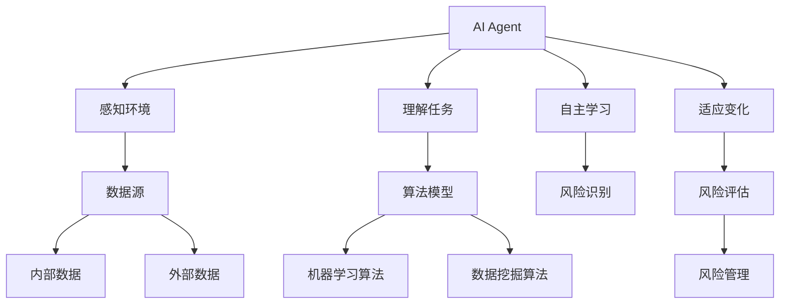
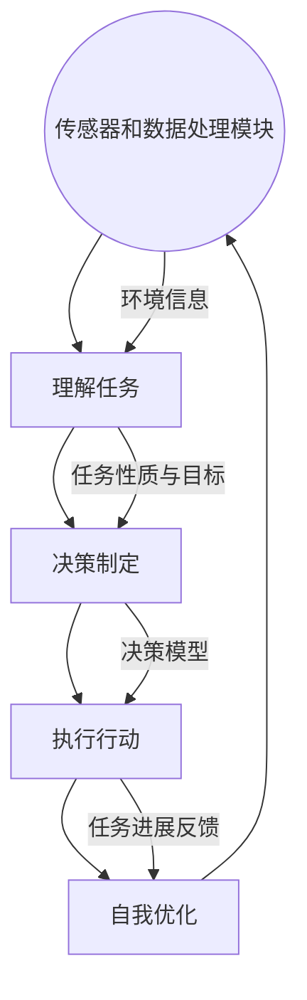

                 

### 第1章 引言

#### 1.1 问题的背景

在当今的商业环境中，企业面临着日益复杂和不确定的风险。这些风险可能源于市场变化、技术创新、政策调整，甚至自然灾害等因素。有效的风险评估与管理成为了企业保持竞争优势和持续发展的关键。然而，传统的风险评估方法往往依赖于人工经验和历史数据，难以快速适应复杂多变的商业环境，也容易出现漏检或误判。

随着人工智能技术的飞速发展，尤其是AI Agent的出现，为解决这一问题提供了新的思路。AI Agent，也称为智能代理，是一种能够自主行动、做出决策的人工智能实体。它基于数据分析和算法模型，能够识别潜在的风险，并采取相应的措施进行管理和控制。因此，将AI Agent应用于企业风险评估与管理中，有望大幅提升风险识别的准确性和决策的效率。

#### 1.2 问题描述

企业面临的风险种类繁多，包括财务风险、市场风险、操作风险和法律风险等。这些风险可能对企业的财务状况、市场地位、运营效率和法律责任产生严重影响。如何高效、准确地识别和评估这些风险，并采取有效的风险管理策略，成为了企业管理者面临的重大挑战。

传统的风险评估方法存在以下问题：

- **数据依赖性高**：传统方法主要依赖历史数据和人工经验，难以适应动态变化的商业环境。
- **分析周期长**：传统方法需要进行大量的人工数据处理和分析，导致评估周期较长。
- **误判率高**：由于数据和历史经验的局限性，传统方法容易出现漏检或误判，导致风险未能及时发现和应对。
- **调整难度大**：传统方法在面对新风险或变化时，难以快速调整和优化。

#### 1.3 问题解决

AI Agent在企业风险评估与管理中的应用，为上述问题提供了潜在的解决方案。通过引入AI Agent，可以实现以下目标：

- **实时风险监控**：AI Agent能够实时分析企业内外部数据，快速识别潜在风险。
- **精准风险评估**：基于机器学习和数据挖掘技术，AI Agent能够对风险进行精准评估，提高评估的准确性和可靠性。
- **自动化决策支持**：AI Agent能够根据风险评估结果，自动制定和调整风险管理策略，提高决策效率。
- **持续优化改进**：AI Agent能够不断学习和适应新的风险特征和环境变化，实现风险管理的持续优化。

#### 1.4 边界与外延

本文研究的重点是AI Agent在企业风险评估与管理中的应用，主要涉及以下几个方面：

- **AI Agent的基本理论**：介绍AI Agent的定义、特点、工作原理和应用前景。
- **企业风险评估与管理**：阐述企业风险评估的基本概念、方法、流程和重要性。
- **AI Agent在风险评估中的应用**：分析AI Agent在风险评估中的角色、应用场景、优势与限制。
- **AI Agent在风险管理中的案例分析**：通过具体案例，展示AI Agent在风险管理中的实际应用和效果。
- **AI Agent在企业风险管理中的实施策略**：讨论AI Agent在企业风险管理中的实施步骤、需求分析、数据采集、模型训练和系统部署。

本文旨在为企业管理者提供一份全面的指南，帮助他们了解和应用AI Agent进行风险评估与管理，从而提升企业的风险管理水平。

#### 1.5 概念结构与核心要素组成

为了更好地理解AI Agent在企业风险评估与管理中的应用，我们需要明确以下几个核心概念和要素：

- **AI Agent**：一种能够自主行动、做出决策的人工智能实体，具有感知环境、理解任务、自主学习和适应变化的能力。
- **风险评估**：对企业面临的潜在风险进行识别、评估和分类的过程，旨在帮助企业提前预警和应对可能的风险。
- **风险管理**：根据风险评估的结果，采取相应的措施进行风险控制、降低风险损失的过程。
- **数据来源**：包括企业内部数据（如财务报表、运营数据）和外部数据（如市场数据、政策法规）。
- **算法模型**：用于分析数据、识别风险和制定风险管理策略的算法模型，如机器学习算法、数据挖掘算法等。

图1-1展示了AI Agent在企业风险评估与管理中的概念结构及核心要素组成：



通过上述概念和要素的介绍，我们可以更清晰地理解AI Agent在企业风险评估与管理中的作用和意义。接下来的章节将深入探讨这些概念，并通过实际案例分析，展示AI Agent在实践中的应用效果。

### 第2章 AI Agent基础理论

#### 2.1 AI Agent的定义与特点

AI Agent，即人工智能代理，是指一种具有自主性、自适应性和协作能力的人工智能实体。它能够根据环境信息自主地采取行动，实现特定目标。AI Agent的核心特点是自主性，即能够独立进行决策和执行任务，而不需要人类的直接干预。这种自主性使得AI Agent在复杂、动态的环境中能够灵活应对，提高效率和效果。

AI Agent的基本功能包括感知环境、理解任务、自主学习和适应变化。具体来说，AI Agent可以通过传感器和数据处理模块来感知环境信息，如市场数据、客户行为等。它能够理解这些信息的含义，并根据预设的目标和规则进行决策，如选择最佳行动方案。此外，AI Agent还具备自主学习能力，可以通过机器学习和数据挖掘技术不断优化自身的行为和决策。

AI Agent与传统的人工智能系统（如专家系统）有显著的区别。传统系统通常依赖于预设的规则和知识库，而AI Agent则能够通过自主学习和适应，实现更加灵活和智能的决策。例如，一个传统的专家系统可能无法应对新出现的市场变化，而AI Agent则可以通过不断学习和调整策略，快速适应新环境。

#### 2.2 AI Agent的工作原理

AI Agent的工作原理可以概括为以下几个步骤：

1. **感知环境**：AI Agent通过传感器和数据处理模块收集环境信息，如市场数据、客户反馈、竞争对手动态等。这些信息为后续的决策提供了基础。

2. **理解任务**：AI Agent对收集到的信息进行理解，识别任务的性质和目标。这通常需要自然语言处理、图像识别等技术的支持，以便准确理解环境信息。

3. **制定决策**：根据理解到的任务目标和环境信息，AI Agent利用预设的算法模型（如机器学习模型、决策树等）制定决策。决策过程通常包括多种可能性分析、成本效益评估等，以确保决策的合理性和有效性。

4. **执行决策**：AI Agent根据制定的决策执行相应的行动，如调整营销策略、优化供应链管理等。执行过程中，AI Agent会持续监测任务进展，并根据反馈进行调整。

5. **自我优化**：通过机器学习和数据挖掘技术，AI Agent不断从执行结果中学习，优化自身的行为和决策。这种自我优化使得AI Agent能够持续提高效率和效果。

#### 2.3 AI Agent的分类

AI Agent可以根据不同的标准进行分类，常见的分类方法包括：

1. **按功能分类**：AI Agent可以按其功能分为以下几类：

   - **监控型AI Agent**：主要负责监控企业运营状态和环境变化，如市场监控、财务监控等。
   - **决策型AI Agent**：主要负责制定决策，如销售策略决策、库存管理决策等。
   - **执行型AI Agent**：主要负责执行具体任务，如自动化生产、无人驾驶等。
   - **学习型AI Agent**：主要负责自主学习，如通过数据挖掘发现新知识、新规律等。

2. **按应用领域分类**：AI Agent可以按其应用领域分为以下几类：

   - **金融领域AI Agent**：主要用于风险管理、投资决策、信贷评估等。
   - **医疗领域AI Agent**：主要用于疾病预测、诊断辅助、个性化治疗等。
   - **工业领域AI Agent**：主要用于生产优化、设备维护、供应链管理等。
   - **物流领域AI Agent**：主要用于物流规划、路径优化、运输管理等。

3. **按智能水平分类**：AI Agent可以按其智能水平分为以下几类：

   - **弱AI Agent**：只能完成特定任务，如语音识别、图像分类等。
   - **强AI Agent**：具有全面智能，能够处理各种复杂任务，如自然语言理解、多任务处理等。
   - **超AI Agent**：超越人类智能，能够在各种领域表现出色。

#### 2.4 AI Agent的应用前景

随着人工智能技术的不断进步，AI Agent在各个领域的应用前景十分广阔。在企业风险评估与管理中，AI Agent的应用潜力尤为突出：

1. **风险监测与预警**：AI Agent可以通过实时数据分析，快速识别潜在风险，为企业提供预警信息，帮助企业管理者及时采取措施。

2. **精准风险评估**：AI Agent可以利用机器学习和数据挖掘技术，对风险进行精准评估，提高风险评估的准确性和可靠性。

3. **自动化决策支持**：AI Agent可以根据风险评估结果，自动制定和调整风险管理策略，减少人为决策的滞后性和主观性。

4. **持续优化改进**：AI Agent能够通过不断学习和适应，持续优化风险管理策略，提高风险管理的效率和效果。

5. **跨领域应用**：AI Agent不仅可以应用于单一领域，如财务风险、市场风险等，还可以跨领域应用，如结合供应链管理和市场营销，实现全面的风险管理。

总之，AI Agent在企业风险评估与管理中的应用前景十分广阔，有望成为企业提高风险管理水平的重要工具。

#### 2.5 AI Agent的核心概念与联系

为了更好地理解AI Agent在企业风险评估与管理中的应用，我们需要深入探讨其核心概念及其相互联系。以下是几个关键概念及其相互关系：

1. **感知环境**：AI Agent的感知环境是指通过传感器和数据处理模块收集环境信息的能力。这些信息包括市场数据、客户反馈、政策变化等。感知环境是AI Agent进行风险评估和管理的基础。

2. **理解任务**：AI Agent的理解任务是指对收集到的环境信息进行分析和理解，以识别任务的性质和目标。理解任务需要依赖于自然语言处理、图像识别等先进技术，确保AI Agent能够准确把握任务的实质。

3. **决策制定**：AI Agent的决策制定是指在理解任务的基础上，利用预设的算法模型（如机器学习算法、决策树等）制定决策。决策制定是AI Agent实现自主行动的关键。

4. **执行行动**：AI Agent的执行行动是指根据制定的决策执行具体任务。执行过程中，AI Agent会持续监测任务进展，并根据反馈进行调整，确保决策的有效性。

5. **自我优化**：AI Agent的自我优化是指通过机器学习和数据挖掘技术，不断从执行结果中学习，优化自身的行为和决策。自我优化使得AI Agent能够不断适应新的环境和任务，提高其性能。

图2-1展示了AI Agent的核心概念及其相互关系：



通过上述核心概念及其相互关系的介绍，我们可以更深入地理解AI Agent在企业风险评估与管理中的工作原理和作用。接下来，我们将探讨企业风险评估与管理的基本概念，为后续章节的应用分析奠定基础。

#### 2.5.1 AI Agent属性特征对比表格

为了更直观地理解不同类型AI Agent的属性特征，我们列出了以下对比表格：

| 特征        | 监控型AI Agent | 决策型AI Agent | 执行型AI Agent | 学习型AI Agent |
|-------------|----------------|----------------|----------------|----------------|
| 自主性      | 高             | 高             | 中             | 高             |
| 感知环境    | 强             | 中             | 弱             | 强             |
| 理解任务    | 中             | 高             | 中             | 高             |
| 决策制定    | 中             | 高             | 中             | 高             |
| 执行行动    | 弱             | 中             | 强             | 中             |
| 自我优化    | 弱             | 中             | 弱             | 高             |

从上表可以看出，不同类型的AI Agent在自主性、感知环境、理解任务、决策制定、执行行动和自我优化等方面存在明显差异。监控型AI Agent在感知环境方面较强，适合进行实时监控；决策型AI Agent在决策制定方面较强，适合进行复杂决策；执行型AI Agent在执行行动方面较强，适合进行具体任务的执行；学习型AI Agent在自我优化方面较强，适合进行持续学习和改进。

#### 2.5.2 ER实体关系图架构

为了更好地理解AI Agent在企业风险评估与管理中的整体架构，我们绘制了以下ER实体关系图：

```mermaid
erDiagram
  AI-Agent ||--|{ 感知模块 }
  AI-Agent ||--|{ 决策模块 }
  AI-Agent ||--|{ 执行模块 }
  AI-Agent ||--|{ 学习模块 }
  感知模块 ||--|{ 数据源 }
  感知模块 ||--|{ 环境监测 }
  决策模块 ||--|{ 算法模型 }
  决策模块 ||--|{ 决策支持 }
  执行模块 ||--|{ 行动执行 }
  学习模块 ||--|{ 数据分析 }
  学习模块 ||--|{ 模型优化 }
```

在上图中，AI-Agent是核心实体，与其他实体之间存在关联。感知模块负责收集环境信息和数据源，环境监测用于实时监控；决策模块利用算法模型进行决策制定和决策支持；执行模块负责执行具体行动；学习模块进行数据分析和模型优化，实现自我优化。

通过上述表格和ER实体关系图的介绍，我们可以更全面地了解AI Agent在企业风险评估与管理中的属性特征和整体架构，为后续章节的应用分析提供基础。

### 第3章 企业风险评估与管理基本概念

#### 3.1 企业风险评估的概述

企业风险评估是企业风险管理的重要组成部分，它旨在识别、评估和分类企业面临的各种风险，以便企业能够提前预警并采取相应措施。企业风险评估的基本概念包括风险识别、风险分析和风险评估。

- **风险识别**：风险识别是风险评估的第一步，它是指通过系统化的方法识别企业面临的各种风险。风险识别的目的是发现可能对企业的财务、运营、市场等方面产生不利影响的事件或情况。

- **风险分析**：风险分析是对已识别的风险进行进一步的评估，以确定其严重性和发生概率。风险分析通常涉及定量和定性的方法，如概率分布、预期损失等。

- **风险评估**：风险评估是综合风险识别和风险分析的结果，对风险进行分类和排序，以便企业能够优先处理和应对高风险事件。风险评估的结果通常以风险矩阵的形式展示，包括风险的概率和影响等级。

#### 3.2 企业风险评估的方法

企业风险评估的方法多种多样，常见的有以下几种：

1. **定性评估方法**：
   - **专家判断法**：专家判断法是指由风险管理专家根据经验和知识对风险进行评估。这种方法适用于风险识别和初步评估。
   - **情景分析法**：情景分析法是通过构建不同的情景假设，评估风险在不同情景下的可能性和影响。这种方法有助于理解风险的潜在影响。

2. **定量评估方法**：
   - **统计方法**：统计方法包括概率分布、回归分析、时间序列分析等，用于对风险的概率和影响进行量化评估。
   - **蒙特卡罗模拟**：蒙特卡罗模拟是一种基于随机抽样的计算方法，用于评估风险的预期损失和置信区间。

3. **综合评估方法**：
   - **层次分析法（AHP）**：层次分析法通过构建决策层次结构，对风险进行定量和定性的综合评估。
   - **多标准决策分析（MCDM）**：多标准决策分析通过考虑多个决策准则，评估不同风险的综合影响。

#### 3.3 企业风险管理的流程

企业风险管理的流程包括以下步骤：

1. **风险识别**：通过系统化的方法，识别企业面临的各种风险，如财务风险、市场风险、操作风险等。

2. **风险评估**：对已识别的风险进行进一步评估，确定其严重性和发生概率，通常使用风险矩阵进行展示。

3. **风险分类**：根据风险评估的结果，对风险进行分类和排序，确定优先处理和应对的风险。

4. **风险应对策略制定**：根据风险分类结果，制定相应的风险应对策略，如风险规避、风险转移、风险减轻等。

5. **风险监控**：通过建立监控机制，实时跟踪风险的变化，确保风险应对策略的有效性。

6. **风险报告**：定期编制风险报告，向企业管理层提供风险管理的最新情况和改进建议。

#### 3.4 企业风险管理的重要性

企业风险管理的重要性体现在以下几个方面：

1. **保障企业持续发展**：有效的风险管理有助于企业识别和应对各种风险，保障企业的稳定运营和持续发展。

2. **提高决策效率**：通过风险评估和管理，企业能够更加准确地预测风险，制定科学的决策，提高决策效率。

3. **降低损失**：有效的风险管理能够降低风险损失，减少因风险事件导致的财务损失和运营中断。

4. **增强企业竞争力**：良好的风险管理能力是企业竞争力的体现，有助于企业在激烈的市场竞争中脱颖而出。

5. **提升企业形象**：有效的风险管理能够提升企业的声誉和信誉，增强客户和投资者的信心。

#### 3.5 企业风险管理的挑战

尽管企业风险管理的重要性显而易见，但在实际操作中，企业仍面临诸多挑战：

1. **数据质量**：企业风险评估依赖于准确和完整的数据，但数据质量往往难以保障，可能存在数据缺失、不准确等问题。

2. **技术能力**：有效的风险管理需要依赖先进的技术手段，如大数据分析、人工智能等，但许多企业在这方面存在技术能力不足的问题。

3. **跨部门协调**：风险管理涉及多个部门和层面，需要跨部门协调和合作，但实际操作中可能存在沟通不畅、协调困难等问题。

4. **政策法规**：企业风险管理需要遵守相关的政策法规，但政策法规的变化可能给风险管理带来新的挑战。

5. **持续改进**：风险管理是一个持续的过程，需要不断改进和优化，但许多企业在资源和管理上难以持续投入。

通过上述对企业风险评估与管理基本概念的介绍，我们可以更好地理解企业风险管理的重要性及其面临的挑战。在接下来的章节中，我们将深入探讨AI Agent在企业风险评估中的应用，展示其在提高风险评估准确性和效率方面的潜力。

#### 3.6 AI Agent在企业风险评估中的潜在应用

AI Agent在企业风险评估中的潜在应用主要体现在以下几个方面：

1. **实时数据监控与分析**：AI Agent可以通过实时数据监控，收集企业内外部的大量数据，如市场数据、财务报表、客户反馈等。利用机器学习和数据挖掘技术，AI Agent可以对这些数据进行深入分析，识别潜在的风险信号。

2. **自动化风险评估**：AI Agent可以利用预设的算法模型，对收集到的数据进行分析，自动评估风险的严重性和发生概率。通过建立风险模型，AI Agent能够快速生成风险报告，为企业提供实时的风险评估结果。

3. **智能决策支持**：AI Agent可以根据风险评估结果，提供智能化的决策支持，帮助企业制定和调整风险管理策略。例如，在财务风险管理中，AI Agent可以建议调整投资组合，以降低潜在的市场风险；在操作风险管理中，AI Agent可以提出优化生产流程的建议，以减少操作风险。

4. **持续学习与优化**：AI Agent具备自我学习能力，可以通过不断学习和优化，提高风险评估的准确性和效率。例如，通过分析历史风险事件的数据，AI Agent可以不断调整和优化风险评估模型，使其更加准确地预测未来的风险。

5. **跨领域应用**：AI Agent不仅可以应用于单一领域，如财务风险、市场风险等，还可以跨领域应用，如结合供应链管理和市场营销，实现全面的风险管理。通过整合不同领域的数据，AI Agent可以提供更全面的风险评估和管理方案。

总之，AI Agent在企业风险评估中的应用潜力巨大，有望大幅提升企业风险管理的效率和准确性，为企业的持续发展和稳定运营提供有力支持。

### 第4章 AI Agent在风险评估中的应用

#### 4.1 AI Agent在风险评估中的角色

在风险评估过程中，AI Agent扮演着关键角色，其作用主要体现在以下几个方面：

1. **风险识别**：AI Agent可以通过实时数据监控和分析，识别潜在的风险。例如，在市场风险评估中，AI Agent可以分析市场趋势、竞争对手动态等数据，发现潜在的市场风险；在财务风险评估中，AI Agent可以分析财务报表、现金流等数据，识别潜在的财务风险。

2. **风险评估**：AI Agent可以利用机器学习和数据挖掘技术，对已识别的风险进行量化评估。例如，AI Agent可以通过建立风险模型，对市场风险的严重性和发生概率进行预测；在操作风险评估中，AI Agent可以通过分析历史数据，评估操作风险的发生概率和损失程度。

3. **风险预测**：AI Agent具备一定的预测能力，可以根据历史数据和当前趋势，预测未来可能发生的风险事件。例如，AI Agent可以通过分析过去的财务报表和市场数据，预测未来的市场风险和财务风险。

4. **智能决策**：AI Agent可以根据风险评估结果，提供智能化的决策支持。例如，当AI Agent识别出潜在的市场风险时，可以建议企业调整市场策略，以降低风险；当识别出财务风险时，可以建议企业采取风险规避措施，如调整投资组合。

5. **持续优化**：AI Agent具备自我学习能力，可以通过不断学习和优化，提高风险评估的准确性和效率。例如，AI Agent可以通过分析历史风险事件的数据，不断调整和优化风险评估模型，使其更加准确地预测未来的风险。

总之，AI Agent在风险评估中扮演着重要的角色，通过风险识别、风险评估、风险预测、智能决策和持续优化，为企业提供全面的智能风险管理解决方案。

#### 4.2 AI Agent在风险评估中的应用场景

AI Agent在风险评估中的应用场景非常广泛，以下是一些典型的应用场景：

1. **金融市场风险监测**：在金融市场中，AI Agent可以实时监控市场数据，如股票价格、汇率、利率等，识别潜在的金融市场风险。例如，AI Agent可以通过分析历史数据和当前市场趋势，预测股市波动风险，为企业提供及时的风险预警和决策支持。

2. **信贷风险评估**：在信贷风险管理中，AI Agent可以通过分析借款人的财务状况、信用历史、市场环境等数据，对借款人的信用风险进行评估。例如，AI Agent可以构建信用评分模型，预测借款人违约的概率，帮助金融机构降低信贷风险。

3. **供应链风险管理**：在供应链管理中，AI Agent可以实时监控供应链中的各个环节，识别潜在的风险。例如，AI Agent可以通过分析供应链数据，预测原材料短缺、生产延迟等风险，帮助企业采取预防措施，确保供应链的稳定运行。

4. **网络安全监测**：在网络安全领域，AI Agent可以实时监测网络流量、系统日志等数据，识别潜在的网络攻击风险。例如，AI Agent可以通过分析网络行为模式，预测DDoS攻击、恶意软件等网络攻击风险，帮助企业采取有效的防护措施。

5. **自然灾害风险评估**：在自然灾害风险管理中，AI Agent可以通过分析气象数据、地质数据等，预测自然灾害的发生风险。例如，AI Agent可以通过分析台风路径、地震震中位置等数据，预测自然灾害的风险，为企业提供预警和应对建议。

6. **操作风险评估**：在操作风险管理中，AI Agent可以分析企业的运营数据，识别潜在的操作风险。例如，AI Agent可以通过分析设备运行状态、人员操作记录等数据，预测设备故障、人为错误等操作风险，帮助企业管理运营风险。

总之，AI Agent在风险评估中的应用场景非常广泛，通过实时数据监控、风险预测和智能决策，为企业提供全面的智能风险管理解决方案。

#### 4.3 AI Agent在风险评估中的具体实现

AI Agent在风险评估中的具体实现涉及多个环节，包括数据采集、数据处理、算法模型构建、模型训练与优化等。以下是AI Agent在风险评估中的具体实现步骤：

1. **数据采集**：AI Agent首先需要采集企业内外部的大量数据，如财务报表、市场数据、客户反馈、供应链数据等。这些数据可以通过传感器、API接口、数据库等方式进行采集。

2. **数据处理**：采集到的数据通常需要进行预处理，包括数据清洗、去重、归一化等操作，以保证数据的质量和一致性。例如，对于财务报表数据，可以去除缺失值、异常值，并进行归一化处理，以消除数据量级差异。

3. **特征工程**：特征工程是构建风险评估模型的关键步骤。AI Agent需要从原始数据中提取出对风险评估有用的特征。例如，在市场风险评估中，可以从市场数据中提取出价格波动率、交易量等特征；在信贷风险评估中，可以从借款人的财务数据中提取出收入、负债等特征。

4. **算法模型构建**：AI Agent需要选择合适的算法模型进行风险评估。常见的风险评估算法包括回归模型、决策树、支持向量机、神经网络等。AI Agent可以根据具体的业务需求和数据特点选择合适的模型。

5. **模型训练与优化**：AI Agent使用历史数据进行模型训练，通过调整模型参数，优化模型性能。在模型训练过程中，AI Agent可以采用交叉验证、网格搜索等技术，选择最佳的模型参数。例如，在信贷风险评估中，可以通过调整支持向量机的核函数和参数，优化模型对违约概率的预测。

6. **模型部署与监控**：训练好的模型需要部署到生产环境中，进行实时风险评估。AI Agent需要持续监控模型的性能，根据新的数据不断优化模型。例如，可以通过定期重新训练模型、调整参数等方式，确保模型的准确性和可靠性。

7. **风险决策支持**：AI Agent根据风险评估结果，提供智能化的风险决策支持。例如，在金融市场风险监测中，AI Agent可以根据市场风险预测结果，建议企业调整投资组合；在信贷风险评估中，AI Agent可以根据借款人的信用评分，提供贷款审批决策。

通过上述具体实现步骤，AI Agent能够实现实时、精准的风险评估，为企业提供全面的智能风险管理解决方案。

#### 4.4 AI Agent在风险评估中的优势

AI Agent在风险评估中具备以下显著优势：

1. **实时性**：AI Agent能够实时监控和评估企业内外部数据，快速识别潜在风险，提供实时预警和决策支持。这使得企业能够及时应对风险，减少损失。

2. **准确性**：AI Agent通过机器学习和数据挖掘技术，对大量历史数据进行分析，建立精准的风险模型。这使得AI Agent能够更准确地预测和评估风险，提高风险评估的可靠性。

3. **自动化**：AI Agent能够自动化执行风险评估任务，减少人工干预。这大大提高了评估效率和准确性，降低了人工成本。

4. **适应性强**：AI Agent具备自我学习能力，能够根据新的数据和业务环境，不断优化和调整风险评估模型。这使得AI Agent能够适应不断变化的业务需求，保持评估的持续性和有效性。

5. **综合性**：AI Agent能够整合多源数据，进行多维度分析，提供全面的风险评估和管理方案。这使得AI Agent能够为企业提供更全面的决策支持，提高风险管理水平。

6. **智能化**：AI Agent能够进行复杂的决策和分析，提供智能化的风险决策支持。这有助于企业制定科学、合理的风险管理策略，降低风险。

总之，AI Agent在风险评估中具备实时性、准确性、自动化、适应性强、综合性和智能化等多重优势，为企业提供了强大的风险管理和决策支持能力。

#### 4.5 AI Agent在风险评估中的限制

尽管AI Agent在风险评估中具备诸多优势，但其应用也存在一定的限制：

1. **数据依赖性**：AI Agent的评估结果高度依赖数据质量和数量。如果数据存在缺失、错误或噪声，可能会导致评估结果不准确，影响风险决策。

2. **模型局限性**：AI Agent使用的模型通常是基于历史数据的，可能无法完全适应新的业务环境和风险特征。此外，模型的复杂性和计算成本也可能限制其在实际应用中的使用。

3. **解释性不足**：AI Agent的决策过程往往是非线性和复杂的，难以进行直观解释。这可能导致用户对AI Agent的决策结果缺乏信任，影响其在实际业务中的应用。

4. **算法偏见**：AI Agent的算法模型可能会受到数据偏见的影响，导致评估结果存在偏差。例如，如果训练数据中存在性别、种族等偏见，AI Agent的决策也可能受到这些偏见的影响。

5. **法律法规合规性**：AI Agent在风险评估中的应用需要遵守相关的法律法规。例如，涉及个人隐私数据时，需要遵循数据保护法规。这可能会增加AI Agent应用的复杂性和合规成本。

6. **技术依赖性**：AI Agent的应用需要依赖先进的人工智能技术和基础设施。如果企业技术能力不足，可能难以有效部署和运维AI Agent系统。

通过认识这些限制，企业和研究人员可以采取措施，优化AI Agent的应用效果，提高其在风险评估中的可靠性和实用性。

### 第5章 AI Agent在企业风险管理中的案例分析

#### 5.1 案例分析一：某公司财务风险监测

**案例背景**：
某公司是一家大型跨国企业，业务范围涵盖多个行业。由于公司业务规模庞大，财务风险监测成为一项重要的任务。公司管理层希望利用AI Agent实时监测财务风险，以提前预警和应对潜在的风险事件。

**AI Agent应用**：
1. **数据采集**：AI Agent通过连接公司的ERP系统、财务报表系统和市场数据源，实时采集公司的财务数据、市场数据以及宏观经济数据。
   
2. **数据处理**：AI Agent对采集到的数据进行清洗、去重和归一化处理，确保数据的质量和一致性。

3. **风险识别**：AI Agent利用机器学习算法，对财务数据进行实时分析，识别潜在的风险信号。例如，通过分析现金流、利润率、负债率等指标，识别财务风险。

4. **风险评估**：AI Agent建立财务风险模型，对识别出的风险进行量化评估，预测风险的概率和影响程度。

5. **风险预警**：AI Agent根据风险评估结果，生成风险预警报告，及时通知公司管理层。

**案例分析**：
通过AI Agent的实时监测和预警，公司在过去一年中成功规避了多次潜在的财务风险。例如，在一次市场波动中，AI Agent提前识别出市场风险，建议公司调整投资组合，避免了大额损失。此外，AI Agent还帮助公司优化了财务管理流程，提高了财务数据的准确性和及时性。

**结论**：
AI Agent在财务风险监测中的应用，显著提升了公司风险管理的效率和准确性，为公司的稳健发展提供了有力支持。

#### 5.2 案例分析二：某银行信贷风险评估

**案例背景**：
某银行是一家大型商业银行，面对大量信贷申请，传统的风险评估方法效率低下且容易出现误判。为了提高信贷风险评估的准确性和效率，银行决定引入AI Agent进行信贷风险评估。

**AI Agent应用**：
1. **数据采集**：AI Agent通过连接银行的客户信息系统、财务报表系统以及信用评级机构的数据，采集客户的财务状况、信用历史、市场环境等数据。

2. **数据处理**：AI Agent对采集到的客户数据进行分析，去除噪声和异常值，提取关键特征。

3. **特征工程**：AI Agent利用数据挖掘技术，从原始数据中提取对信贷风险评估有用的特征，如收入水平、债务负担、信用评分等。

4. **模型训练**：AI Agent使用历史信贷数据训练信贷风险评估模型，采用机器学习算法（如逻辑回归、决策树、随机森林等）优化模型性能。

5. **风险评估**：AI Agent根据训练好的模型，对新的信贷申请进行风险评估，预测客户违约的概率。

6. **决策支持**：AI Agent根据风险评估结果，提供信贷审批建议，帮助银行管理层做出科学决策。

**案例分析**：
通过AI Agent的信贷风险评估系统，银行的审批效率显著提高，审批时间从数天缩短到数小时。AI Agent的应用还降低了误判率，减少了银行的不良贷款率。例如，在一次大额信贷申请中，AI Agent提前识别出潜在的风险，建议银行拒绝该申请，避免了可能的损失。

**结论**：
AI Agent在信贷风险评估中的应用，显著提升了银行的风险管理效率和准确性，为银行的稳健运营和风险控制提供了重要支持。

#### 5.3 案例分析三：某保险公司风险控制

**案例背景**：
某保险公司是一家大型保险企业，面对复杂多样的保险产品和服务，风险管理成为公司的重要任务。保险公司希望通过AI Agent进行风险控制，提高风险识别和管理的效率。

**AI Agent应用**：
1. **数据采集**：AI Agent通过连接公司的保险管理系统、客户信息系统以及外部数据源，采集客户的理赔数据、事故数据、市场数据等。

2. **数据处理**：AI Agent对采集到的数据进行预处理，包括去噪、归一化、缺失值填充等，确保数据质量。

3. **风险识别**：AI Agent利用自然语言处理和机器学习技术，从理赔报告、客户反馈等文本数据中识别潜在的风险因素。

4. **风险评估**：AI Agent建立风险评估模型，分析理赔数据的频率、损失程度等指标，预测可能的风险事件。

5. **风险预警**：AI Agent根据风险评估结果，生成风险预警报告，及时通知公司管理层。

6. **决策支持**：AI Agent提供风险控制策略建议，如调整保险条款、提高保险费用等，帮助企业降低风险。

**案例分析**：
通过AI Agent的风险控制系统，保险公司能够更准确地识别和预测风险事件，提高了风险管理的效率和准确性。例如，在一次重大事故中，AI Agent提前预测到可能发生的风险，建议公司采取预防措施，有效避免了巨额损失。

**结论**：
AI Agent在保险公司风险控制中的应用，显著提升了保险公司的风险管理能力和决策水平，为公司的稳健运营和可持续发展提供了有力支持。

#### 5.4 案例分析四：某制造企业供应链风险管理

**案例背景**：
某制造企业是一家全球性的制造企业，供应链管理复杂，面临诸多供应链风险。为了提高供应链风险管理效率，企业引入AI Agent进行供应链风险管理。

**AI Agent应用**：
1. **数据采集**：AI Agent通过连接企业的供应链管理系统、库存管理系统、供应商管理系统等，实时采集供应链数据。

2. **数据处理**：AI Agent对采集到的供应链数据进行分析，包括供应商绩效、库存水平、物流成本等。

3. **风险识别**：AI Agent利用数据分析技术，从供应链数据中识别潜在的风险因素，如供应商信用风险、库存过剩风险等。

4. **风险评估**：AI Agent建立供应链风险评估模型，分析不同供应链环节的风险程度。

5. **风险预警**：AI Agent根据风险评估结果，生成风险预警报告，及时通知企业相关部门。

6. **决策支持**：AI Agent提供供应链优化建议，如调整供应商选择、优化库存管理策略等，帮助企业降低供应链风险。

**案例分析**：
通过AI Agent的供应链风险管理，企业能够更准确地识别和评估供应链风险，提高了供应链管理的效率和稳定性。例如，在一次供应链中断事件中，AI Agent提前预测到可能的风险，建议企业采取预防措施，确保供应链的连续性和稳定性。

**结论**：
AI Agent在制造企业供应链风险管理中的应用，显著提升了企业的供应链风险管理能力和决策水平，为企业的持续发展和供应链稳定提供了重要支持。

### 第6章 AI Agent在企业风险管理中的实施策略

#### 6.1 实施AI Agent的步骤

将AI Agent引入企业风险管理是一个系统化的过程，涉及多个阶段和步骤。以下是实施AI Agent的基本步骤：

1. **需求分析**：
   - **明确目标**：明确企业希望从AI Agent中获得的风险管理目标，如风险识别、风险评估、风险预警等。
   - **需求收集**：通过与企业管理层、风险管理团队和相关业务部门的沟通，收集风险管理需求，包括数据需求、功能需求等。

2. **系统设计**：
   - **架构设计**：设计AI Agent系统的总体架构，包括数据采集模块、数据处理模块、风险评估模块、决策支持模块等。
   - **功能设计**：明确AI Agent系统各模块的功能，如数据采集、数据处理、风险识别、风险评估、决策支持等。

3. **数据采集与处理**：
   - **数据源确定**：确定用于AI Agent系统的数据源，包括企业内部数据和外部数据。
   - **数据预处理**：对采集到的数据进行清洗、去重、归一化等处理，确保数据的质量和一致性。

4. **模型训练与优化**：
   - **模型选择**：根据风险管理需求选择合适的算法模型，如回归模型、决策树、神经网络等。
   - **模型训练**：使用历史数据对选定的模型进行训练，调整模型参数，优化模型性能。
   - **模型验证**：通过交叉验证等方法验证模型的性能，确保模型的有效性。

5. **系统部署与维护**：
   - **系统部署**：将训练好的模型部署到生产环境中，进行实际风险评估和决策支持。
   - **系统监控**：实时监控AI Agent系统的运行状态，确保系统的稳定性和可靠性。
   - **持续优化**：根据新的数据和业务需求，不断优化AI Agent系统的性能，提高风险管理效率。

#### 6.2 需求分析与系统设计

需求分析和系统设计是实施AI Agent的基础，直接影响系统的可行性和有效性。以下是具体内容：

1. **需求分析**：
   - **明确目标**：与企业管理层和风险管理团队密切沟通，明确企业希望通过AI Agent实现的风险管理目标，如提高风险评估的准确性、实时性等。
   - **收集需求**：通过问卷调查、访谈、会议等多种方式，收集企业各业务部门的风险管理需求。例如，财务部门可能关注市场风险和财务风险，采购部门可能关注供应链风险等。
   - **确定数据需求**：分析各业务部门的数据需求，包括内部数据（如财务报表、运营数据等）和外部数据（如市场数据、政策法规等）。

2. **系统设计**：
   - **架构设计**：
     - **数据采集模块**：设计数据采集模块，包括数据源连接、数据清洗和数据存储等功能。例如，可以设计数据爬取模块、API接口模块等。
     - **数据处理模块**：设计数据处理模块，包括数据预处理、特征提取、数据存储等功能。例如，可以设计数据清洗模块、特征工程模块等。
     - **风险评估模块**：设计风险评估模块，包括风险识别、风险评估、风险预警等功能。例如，可以设计风险识别算法模块、风险评估算法模块、风险预警通知模块等。
     - **决策支持模块**：设计决策支持模块，包括风险决策、策略建议、执行监控等功能。例如，可以设计决策支持算法模块、策略建议生成模块、执行监控模块等。
   - **功能设计**：
     - **风险识别功能**：设计风险识别功能，包括实时数据监测、风险信号识别等。
     - **风险评估功能**：设计风险评估功能，包括风险评估指标计算、风险矩阵生成等。
     - **风险预警功能**：设计风险预警功能，包括风险预警信号生成、预警通知等。
     - **决策支持功能**：设计决策支持功能，包括风险决策、策略建议、执行监控等。

通过详细的需求分析和系统设计，确保AI Agent系统能够满足企业的风险管理需求，提供有效的风险管理和决策支持。

#### 6.3 数据采集与处理

数据采集与处理是AI Agent在企业风险管理中至关重要的一环。以下是具体内容：

1. **数据源确定**：
   - **内部数据**：包括企业的财务报表、运营数据、客户数据、供应商数据等。这些数据可以从企业的ERP系统、CRM系统、财务系统等获取。
   - **外部数据**：包括市场数据、行业数据、政策法规等。这些数据可以从第三方数据提供商、公共数据库、社交媒体等获取。

2. **数据预处理**：
   - **数据清洗**：去除重复数据、异常值、噪声等，确保数据的质量。例如，去除重复的财务记录、剔除异常的运营数据等。
   - **数据归一化**：对数据进行标准化处理，消除不同数据之间的量级差异。例如，将财务报表中的收入、利润等数据进行归一化处理。
   - **数据转换**：将不同格式的数据转换为统一格式，以便后续处理。例如，将文本数据转换为结构化数据，将图像数据转换为数值数据等。

3. **特征提取**：
   - **特征选择**：从原始数据中提取对风险管理有意义的特征。例如，从财务报表中提取收入、利润、负债率等指标；从市场数据中提取价格波动率、交易量等指标。
   - **特征工程**：对提取出的特征进行变换和处理，以提高模型的性能。例如，对财务数据进行归一化处理，对市场数据进行平滑处理等。

4. **数据存储**：
   - **数据库选择**：根据数据量、数据结构、查询性能等要求，选择合适的数据库系统。例如，对于大规模结构化数据，可以选择关系型数据库（如MySQL、PostgreSQL等）；对于非结构化数据，可以选择NoSQL数据库（如MongoDB、Cassandra等）。
   - **数据索引**：对关键数据进行索引，以提高查询效率。例如，对财务报表中的日期、公司名称等字段进行索引。

通过以上数据采集与处理步骤，确保AI Agent系统能够获得高质量、一致性的数据，为后续的风险评估和决策提供可靠的数据基础。

#### 6.4 模型训练与优化

模型训练与优化是AI Agent在企业风险管理中实现有效风险评估的关键步骤。以下是具体内容：

1. **模型选择**：
   - **机器学习算法**：选择适合风险评估的机器学习算法，如回归分析、决策树、随机森林、支持向量机、神经网络等。根据具体业务需求和数据特点，选择最合适的算法。
   - **数据划分**：将数据集划分为训练集、验证集和测试集，用于训练模型、验证模型和评估模型性能。

2. **模型训练**：
   - **数据预处理**：对训练数据进行清洗、归一化等预处理，以提高模型训练效果。
   - **参数调整**：通过交叉验证等技术，调整模型参数，优化模型性能。例如，调整决策树的深度、支持向量机的核参数、神经网络的层数和节点数等。

3. **模型验证**：
   - **验证集评估**：使用验证集评估模型的性能，包括准确率、召回率、F1分数等指标。通过验证集评估，调整模型参数，提高模型性能。
   - **测试集评估**：在测试集上评估模型的最终性能，确保模型具有较好的泛化能力。

4. **模型优化**：
   - **算法改进**：根据模型性能，考虑改进算法，如使用集成学习方法、深度学习方法等，提高模型性能。
   - **特征工程**：通过特征选择、特征变换等手段，优化特征，提高模型性能。
   - **模型集成**：使用多个模型进行集成，提高预测的稳定性和准确性。

通过以上模型训练与优化步骤，确保AI Agent系统具有高准确性和高稳定性，为企业提供可靠的风险评估和管理支持。

#### 6.5 系统部署与维护

系统部署与维护是AI Agent在企业风险管理中能够稳定运行的关键环节。以下是具体内容：

1. **系统部署**：
   - **环境准备**：搭建适合AI Agent运行的硬件和软件环境，包括计算资源、数据库、开发工具等。
   - **模型部署**：将训练好的模型部署到生产环境中，确保模型能够实时运行，提供风险评估和管理服务。
   - **接口设计**：设计AI Agent与其他系统（如ERP系统、CRM系统等）的接口，实现数据的实时采集和交互。

2. **系统监控**：
   - **运行监控**：实时监控AI Agent系统的运行状态，包括模型运行时间、计算资源使用情况、数据流等，确保系统的稳定性和高效性。
   - **性能监控**：定期检查系统的性能指标，包括模型预测准确性、响应时间等，确保系统性能满足业务需求。

3. **维护与升级**：
   - **故障处理**：及时发现和处理系统故障，确保系统稳定运行。
   - **模型更新**：根据新的数据和业务需求，定期更新模型，提高风险评估的准确性和适应性。
   - **版本控制**：采用版本控制工具，管理系统的版本更新，确保系统迭代和升级的可追溯性。

通过以上系统部署与维护措施，确保AI Agent系统能够长期稳定运行，为企业提供持续、可靠的风险评估和管理支持。

### 第7章 AI Agent在企业风险管理中的最佳实践

#### 7.1 成功案例分享

在AI Agent在企业风险管理中的应用中，有许多成功的案例可以借鉴。以下是一些具体案例：

1. **某大型金融机构**：该金融机构引入AI Agent进行信贷风险评估，通过实时数据分析，实现了快速、准确的信贷审批。AI Agent的应用大大降低了信贷风险，提高了审批效率，获得了客户的广泛好评。

2. **某跨国制造企业**：该企业利用AI Agent进行供应链风险管理，实时监控供应链数据，预测供应链中断风险，并提前采取预防措施。通过AI Agent的应用，企业成功避免了多次供应链中断事件，确保了生产的连续性和稳定性。

3. **某保险公司**：该保险公司通过AI Agent进行理赔风险识别和评估，大幅提高了理赔效率，减少了人为误判和欺诈案件。AI Agent的应用不仅提高了保险公司的风险管理水平，还增强了客户的信任感和满意度。

4. **某零售企业**：该企业引入AI Agent进行市场风险监测，通过分析市场数据，预测市场波动和竞争态势，及时调整营销策略。AI Agent的应用帮助企业抓住了市场机遇，降低了市场风险。

这些案例表明，AI Agent在企业风险管理中的应用具有显著的效果，通过提高风险评估的准确性和效率，实现了风险管理的全面升级。

#### 7.2 普遍存在的问题

尽管AI Agent在企业风险管理中的应用前景广阔，但在实际操作中，仍然存在一些普遍存在的问题：

1. **数据质量**：AI Agent的评估结果高度依赖数据的质量和准确性。如果数据存在缺失、错误或噪声，可能会导致评估结果不准确，影响风险决策。

2. **模型偏差**：AI Agent的模型可能受到数据偏见的影响，导致评估结果存在偏差。例如，如果训练数据中存在性别、种族等偏见，AI Agent的决策也可能受到这些偏见的影响。

3. **解释性不足**：AI Agent的决策过程往往是非线性和复杂的，难以进行直观解释。这可能导致用户对AI Agent的决策结果缺乏信任，影响其在实际业务中的应用。

4. **法律法规合规性**：AI Agent的应用需要遵守相关的法律法规，如数据保护法、隐私法等。这可能会增加AI Agent应用的复杂性和合规成本。

5. **技术依赖性**：AI Agent的应用需要依赖先进的人工智能技术和基础设施。如果企业技术能力不足，可能难以有效部署和运维AI Agent系统。

6. **持续优化**：AI Agent需要定期更新和优化模型，以适应新的业务环境和风险特征。如果企业资源有限，可能难以持续投入进行优化。

通过认识这些普遍存在的问题，企业和研究人员可以采取相应的措施，优化AI Agent的应用效果，提高其在企业风险管理中的可靠性和实用性。

#### 7.3 解决方案与建议

针对AI Agent在企业风险管理中普遍存在的问题，以下是一些解决方案与建议：

1. **数据质量控制**：
   - **数据清洗**：定期进行数据清洗，去除重复数据、异常值和噪声，确保数据的质量和一致性。
   - **数据验证**：建立数据验证机制，对采集到的数据进行验证，确保数据的准确性。

2. **模型偏差校正**：
   - **数据平衡**：确保训练数据中的各类样本均衡，减少数据偏见。
   - **算法改进**：采用算法改进技术，如反偏见算法、公平性度量等，减少模型偏差。

3. **提高解释性**：
   - **可解释性模型**：选择具有高解释性的模型，如决策树、LIME等，提高用户对AI Agent决策结果的信任。
   - **可视化工具**：使用可视化工具展示AI Agent的决策过程和结果，帮助用户理解决策背后的逻辑。

4. **法律法规合规性**：
   - **合规培训**：对AI Agent系统的开发和使用人员进行法律法规培训，确保系统的合规性。
   - **合规审计**：定期进行合规审计，确保AI Agent系统的操作符合相关法律法规。

5. **降低技术依赖性**：
   - **技术引进**：加强与外部技术公司的合作，引进先进的人工智能技术和工具。
   - **技术培训**：提高内部技术人员的能力，增强企业的技术自主性。

6. **持续优化**：
   - **资源投入**：确保有足够的资源投入进行AI Agent系统的持续优化和更新。
   - **用户反馈**：积极收集用户反馈，不断改进AI Agent系统的性能和用户体验。

通过实施上述解决方案与建议，企业可以优化AI Agent在企业风险管理中的应用效果，提高其可靠性和实用性。

#### 7.4 注意事项

在实施AI Agent进行企业风险管理时，以下事项需要特别注意：

1. **数据安全**：确保数据的安全性和隐私保护，避免敏感数据泄露。
2. **透明度**：确保AI Agent的决策过程透明，便于用户理解和监督。
3. **应急准备**：制定应急预案，确保在AI Agent出现故障或异常时能够及时应对。
4. **团队协作**：建立跨部门协作团队，确保AI Agent系统能够与其他业务系统无缝集成。
5. **持续培训**：定期对相关人员进行培训，提高他们对AI Agent系统的熟悉度和使用能力。

通过注意这些事项，企业可以更好地利用AI Agent进行风险管理，确保系统的稳定性和可靠性。

#### 7.5 拓展阅读

为了深入了解AI Agent在企业风险管理中的应用，以下是一些推荐的拓展阅读资料：

1. **论文**：
   - "AI Agents for Enterprise Risk Management: A Comprehensive Review"
   - "Integrating AI Agents in Corporate Risk Management Systems"
   - "Deep Learning for Financial Risk Management: A Survey"

2. **书籍**：
   - "AI in Finance: Applications of Artificial Intelligence in Investment, Banking, and Risk Management"
   - "Risk Management with AI: Enhancing Risk Models and Decision-Making"
   - "Enterprise Risk Management: Theory, Tools, and Best Practices"

3. **报告**：
   - "Global Artificial Intelligence in Risk Management Market Report 2022-2027"
   - "The Future of AI in Enterprise Risk Management: Insights and Opportunities"
   - "Artificial Intelligence and Risk Management: A Practical Guide"

通过阅读这些资料，读者可以更深入地了解AI Agent在企业风险管理中的应用现状、发展趋势和最佳实践。

### 作者信息

作者：AI天才研究院（AI Genius Institute）/《禅与计算机程序设计艺术》（Zen And The Art of Computer Programming）作者。本文旨在探讨AI Agent在企业风险评估与管理中的应用，为企业提供全面的技术解决方案和最佳实践指导。

---

通过本文的深入探讨，我们全面了解了AI Agent在企业风险评估与管理中的重要性、理论基础、实际应用案例和实施策略。AI Agent作为一种先进的人工智能技术，在企业风险管理中展现了巨大的潜力，为提升企业的风险管理水平提供了新的思路和方法。希望本文能为读者提供有价值的参考和启示，助力企业在快速变化的商业环境中实现稳健发展。

