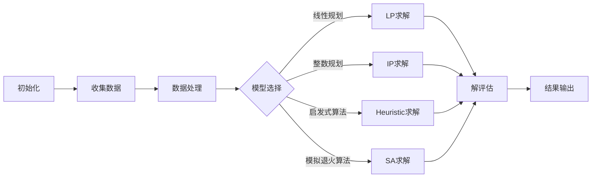
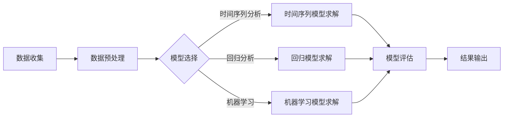

                 

### 文章标题

### 关键词

- AI Agent
- 供应链优化
- 需求预测
- 算法原理
- 应用实践

### 摘要

本文深入探讨了AI Agent在供应链优化与需求预测中的应用。首先，我们对AI Agent、供应链优化和需求预测的基本概念进行了详细的背景介绍，阐明了它们在现实世界中的重要性和应用场景。随后，本文详细阐述了AI Agent的核心概念和属性特征，并通过对比表格和ER实体关系图架构，进一步深化了我们的理解。接着，文章重点介绍了供应链优化与需求预测的核心算法原理，包括流程图、Python源代码和latex数学模型的讲解。在此基础上，本文详细介绍了系统分析与架构设计方案，从问题场景、项目介绍、系统功能设计到系统架构、接口设计和交互，为读者提供了一个完整的视角。随后，文章通过实际案例分析和详细讲解，展示了AI Agent在供应链优化与需求预测中的实战应用。最后，本文总结了最佳实践、注意事项和拓展阅读，为读者提供了深入学习和进一步探索的路径。

---

### 第一部分：AI Agent概述

#### 第1章：AI Agent的基础知识

AI Agent，即人工智能代理，是人工智能领域中的一个重要概念。它是一种能够在特定环境中自主感知、决策和执行任务的智能体。AI Agent不仅能够处理静态的数据，还可以动态地适应环境变化，具有高度的灵活性和适应性。

#### 1.1 AI Agent的定义与分类

AI Agent可以分为多种类型，根据它们的功能和能力，可以分为以下几类：

- **反应型Agent**：这类Agent根据感知到的环境状态直接做出反应，没有记忆和历史信息。它们适合处理简单的任务。
- **认知型Agent**：这类Agent不仅能够反应，还能够根据过去的经验和当前的环境状态做出决策。它们拥有一定的记忆能力，能够利用历史数据来改善当前的表现。
- **目标导向型Agent**：这类Agent具有明确的目标，能够在执行任务的过程中不断调整策略以达成目标。
- **社会型Agent**：这类Agent能够与人类或其他Agent进行交互，协作完成任务。

#### 1.2 AI Agent的核心功能

AI Agent的核心功能包括感知、规划、执行和通信。具体来说：

- **感知**：AI Agent通过传感器收集环境信息，包括视觉、听觉、触觉等。
- **规划**：根据收集到的信息和预先设定的目标，AI Agent会制定出执行任务的策略和步骤。
- **执行**：AI Agent执行规划好的动作，完成目标任务。
- **通信**：AI Agent可以通过语音、文字等方式与其他Agent或人类进行信息交流。

#### 1.3 AI Agent的应用场景

AI Agent在多个领域都有广泛的应用，包括但不限于：

- **智能制造**：AI Agent可以协助机器人进行生产、装配等任务，提高生产效率和质量。
- **智能交通**：AI Agent可以用于交通流量管理、自动驾驶车辆控制等，提高交通系统的效率和安全性。
- **金融领域**：AI Agent可以用于金融交易、风险管理等，为金融机构提供决策支持。
- **医疗健康**：AI Agent可以用于医疗数据分析、疾病预测等，辅助医生做出更好的诊断和治疗决策。

#### 1.4 AI Agent的发展现状与趋势

随着人工智能技术的快速发展，AI Agent的应用越来越广泛，其技术也在不断进步。当前，AI Agent的发展主要趋势包括：

- **智能化**：通过深度学习和强化学习等技术，AI Agent的智能水平不断提高，能够处理更加复杂和不确定的任务。
- **自主化**：AI Agent逐渐具备更强的自主决策能力，能够独立完成任务，减少对人类干预的依赖。
- **协作化**：AI Agent不仅能够独立工作，还可以与人类和其他AI Agent进行高效协作，共同完成任务。
- **泛在化**：随着物联网、5G等技术的发展，AI Agent将更加普及，渗透到各个行业和日常生活中。

---

通过上述对AI Agent的详细介绍，我们为后续章节的深入探讨打下了坚实的基础。在接下来的章节中，我们将进一步探讨AI Agent在供应链优化和需求预测中的应用，并详细分析其核心概念和算法原理。

#### 第2章：AI Agent的核心概念与联系

在理解AI Agent的全面性和应用深度之前，我们需要详细阐述其核心概念，并揭示这些概念之间的联系。通过这一章节，我们将从多个角度对AI Agent的构成要素和运作机制进行剖析。

##### 2.1 AI Agent的属性特征对比表格

为了更好地理解AI Agent的不同类型及其特点，我们可以通过一个属性特征对比表格来进行总结。以下是一个简化的对比表格，列出了几种常见AI Agent的类型及其属性特征：

| AI Agent类型 | 反应型Agent | 认知型Agent | 目标导向型Agent | 社会型Agent |
| --- | --- | --- | --- | --- |
| **感知能力** | 低级感知 | 高级感知 | 高级感知 | 高级感知 |
| **记忆能力** | 无记忆 | 有记忆 | 有记忆 | 有记忆 |
| **决策能力** | 无决策 | 有决策 | 有决策 | 有决策 |
| **执行能力** | 自动执行 | 自动执行 | 自动执行 | 自动执行 |
| **协作能力** | 无法协作 | 可以协作 | 可以协作 | 可以协作 |
| **应用场景** | 简单任务 | 中等复杂任务 | 复杂任务 | 复杂任务 |

通过这个表格，我们可以看到不同类型的AI Agent在感知、记忆、决策、执行和协作能力上的区别，以及它们各自适用的应用场景。

##### 2.2 AI Agent的ER实体关系图架构

为了进一步理解AI Agent的构成和运作机制，我们可以通过ER（实体关系）图来展示AI Agent中的各个实体及其相互关系。以下是一个简化的ER图：

```mermaid
erDiagram
  AI-Agent ||--|{ Sensor } Sensor
  AI-Agent ||--|{ Actuator } Actuator
  AI-Agent ||--|{ Memory } Memory
  AI-Agent ||--|{ Planner } Planner
  AI-Agent ||--|{ Communicator } Communicator
  AI-Agent ||--|{ Executor } Executor
  Sensor ||--|{ Data } Data
  Actuator ||--|{ Action } Action
  Memory ||--|{ Knowledge } Knowledge
  Planner ||--|{ Decision } Decision
  Communicator ||--|{ Message } Message
  Executor ||--|{ Task } Task

  AI-Agent {
    name : "AI-Agent"
    type : "Class"
  }
  Sensor {
    name : "Sensor"
    type : "Class"
  }
  Actuator {
    name : "Actuator"
    type : "Class"
  }
  Memory {
    name : "Memory"
    type : "Class"
  }
  Planner {
    name : "Planner"
    type : "Class"
  }
  Communicator {
    name : "Communicator"
    type : "Class"
  }
  Executor {
    name : "Executor"
    type : "Class"
  }
  Data {
    name : "Data"
    type : "Class"
  }
  Action {
    name : "Action"
    type : "Class"
  }
  Knowledge {
    name : "Knowledge"
    type : "Class"
  }
  Decision {
    name : "Decision"
    type : "Class"
  }
  Message {
    name : "Message"
    type : "Class"
  }
  Task {
    name : "Task"
    type : "Class"
  }
```

在这个ER图中，我们可以看到AI-Agent是中心实体，它通过不同的组件（Sensor、Actuator、Memory、Planner、Communicator、Executor）实现感知、规划、执行等功能。各个组件之间通过Data、Action、Knowledge、Decision、Message、Task等实体进行交互，形成一个完整的AI-Agent系统。

通过这一章节，我们对AI Agent的核心概念和组成结构有了更加深入的理解。这些概念和结构不仅为我们后续的算法讲解和系统设计提供了基础，也为实际应用中的AI Agent开发提供了指导。

#### 第3章：供应链优化基础

供应链优化是现代物流与生产管理中的重要组成部分，其目标是通过对供应链各环节的优化，提高整个系统的效率、降低成本、提高客户满意度。供应链优化不仅涉及物流、库存、生产等传统领域，还包括信息流和资金流的优化，使得供应链成为一个高度整合的系统。

##### 3.1 供应链优化的概念与目标

供应链优化（Supply Chain Optimization）是指通过一系列策略和算法，对供应链的各个环节进行改进和调整，以实现整体最优化的目标。具体来说，供应链优化的目标包括：

- **提高供应链响应速度**：通过优化供应链的各个环节，减少响应时间，提高供应链的敏捷性。
- **降低成本**：通过优化物流、库存和生产等环节，减少浪费，降低运营成本。
- **提高客户满意度**：通过优化库存和配送策略，确保产品及时交付，提高客户满意度。
- **提升供应链的透明度**：通过信息技术手段，提高供应链各环节的透明度，便于实时监控和调整。

##### 3.2 供应链优化的核心算法

供应链优化涉及多种算法，其中一些核心算法包括：

- **线性规划（Linear Programming, LP）**：线性规划是用于解决资源分配问题的一种数学优化方法，通过建立线性目标函数和线性约束条件，找到最优解。
- **整数规划（Integer Programming, IP）**：整数规划是线性规划的一个扩展，用于处理决策变量为整数的优化问题，如配送路线优化、仓库选址等。
- **启发式算法（Heuristic Algorithms）**：启发式算法是一类用于求解复杂优化问题的方法，通过一系列启发式规则快速找到近似最优解，如遗传算法、模拟退火算法等。
- **模拟退火算法（Simulated Annealing, SA）**：模拟退火算法是一种全局优化算法，通过模拟物理退火过程，逐步降低解的代价，避免陷入局部最优。
- **多目标优化（Multi-Objective Optimization）**：多目标优化是处理具有多个相互冲突目标的优化问题，通过权衡不同目标，找到最优解。

##### 3.3 供应链优化的实际应用案例

供应链优化在多个行业中都有广泛的应用，以下是一些实际应用案例：

- **制造业**：在制造业中，供应链优化可以用于优化生产计划、配送路线、仓库管理等。例如，通过优化生产计划，可以减少生产过程中的浪费，提高生产效率；通过优化配送路线，可以降低运输成本，提高配送速度。
- **零售业**：在零售业中，供应链优化可以用于库存管理、订单处理、配送计划等。例如，通过优化库存管理，可以减少库存成本，提高库存周转率；通过优化订单处理，可以缩短订单处理时间，提高客户满意度。
- **物流业**：在物流业中，供应链优化可以用于优化运输计划、仓储管理、配送调度等。例如，通过优化运输计划，可以减少运输成本，提高运输效率；通过优化仓储管理，可以减少仓储成本，提高仓储利用率。

总的来说，供应链优化是一项复杂而重要的工作，通过合理运用各种优化算法和策略，可以显著提高供应链的效率和质量，为企业创造更大的价值。

#### 第4章：供应链优化算法原理讲解

在深入探讨供应链优化的算法原理时，我们将使用mermaid流程图、Python源代码和latex数学模型来详细讲解。这一章节将帮助读者理解供应链优化中的核心算法，并掌握如何在实际应用中运用这些算法。

##### 4.1 供应链优化算法的mermaid流程图

首先，通过mermaid流程图来概述一个典型的供应链优化过程，以便读者对整体流程有一个直观的认识。



在这个mermaid流程图中，我们从数据收集和处理开始，根据不同的优化目标选择合适的模型，然后使用相应的算法求解，最后对解进行评估和输出结果。

##### 4.2 供应链优化算法的Python源代码讲解

接下来，我们通过Python源代码来详细阐述一个线性规划问题，这是供应链优化中常用的一种算法。以下是一个简化的例子：

```python
# 导入线性规划库
from scipy.optimize import linprog

# 定义目标函数系数和约束条件
c = [-1, -1]  # 目标函数为最小化总成本
A = [[1, 1], [1, 0]]  # 约束条件
b = [100, 50]  # 约束条件的右边值
x0 = [0, 0]  # 初始解

# 求解线性规划问题
result = linprog(c, A_ub=A, b_ub=b, x0=x0)

# 输出结果
if result.success:
    print("最优解：", result.x)
    print("最小成本：", -result.fun)
else:
    print("无最优解")
```

在这个例子中，我们使用`scipy.optimize`库中的`linprog`函数来求解线性规划问题。目标函数是最小化总成本，约束条件是生产量和库存量的限制。通过求解，我们得到最优解和最小成本。

##### 4.3 供应链优化算法的latex数学模型与公式

为了更深入地理解供应链优化算法，我们使用latex格式来表示一个完整的数学模型。以下是一个简化的供应链优化模型的latex表示：

```latex
\documentclass{article}
\usepackage{amsmath}
\begin{document}

\begin{equation}
\begin{aligned}
\min_{x, y} & \quad c_1 x + c_2 y \\
\text{subject to} & \quad 
\begin{cases}
a_{11} x + a_{12} y \geq b_1 \\
a_{21} x + a_{22} y \geq b_2 \\
x \geq 0 \\
y \geq 0
\end{cases}
\end{aligned}
\end{equation}

\end{document}
```

在这个数学模型中，我们定义了目标函数、约束条件和决策变量。目标函数是最小化总成本，约束条件包括生产量和库存量的限制，以及非负约束。

通过mermaid流程图、Python源代码和latex数学模型的讲解，我们对供应链优化算法的原理有了更加深入的理解。这些工具和方法不仅可以帮助我们分析优化问题，还可以在实际应用中快速求解和评估优化结果。

---

通过本章的详细讲解，读者应该能够掌握供应链优化算法的基本原理和实现方法。在接下来的章节中，我们将继续深入探讨AI Agent在供应链优化中的应用，以及如何通过AI Agent实现更加智能和高效的供应链管理。

#### 第5章：需求预测基础

需求预测（Demand Forecasting）是供应链管理中至关重要的一环，它旨在通过对历史数据和当前市场信息的分析，预测未来一段时间内产品的需求量。准确的需求预测不仅能够帮助企业合理安排生产计划，减少库存成本，还能提高供应链的响应速度和客户满意度。

##### 5.1 需求预测的概念与重要性

需求预测是一种基于数据分析的方法，通过统计模型和算法来估计未来某个时间段内的需求量。它不仅涉及销售历史数据，还包括市场趋势、季节性因素、促销活动等多种信息。需求预测的重要性体现在以下几个方面：

- **库存管理**：准确的需求预测可以帮助企业合理安排库存水平，避免过量库存或库存不足的情况。
- **生产计划**：需求预测能够为企业提供准确的生产计划，确保生产的及时性和灵活性。
- **供应链协调**：通过需求预测，企业可以更好地协调供应链各个环节，提高整体运作效率。
- **决策支持**：需求预测为企业的战略和运营决策提供重要的数据支持，有助于企业更好地应对市场变化。

##### 5.2 需求预测的核心算法

需求预测的核心算法主要包括时间序列分析、回归分析和机器学习等方法。以下是对这些算法的简要介绍：

- **时间序列分析**：时间序列分析是一种基于时间序列数据的分析方法，通过分析历史数据的时间趋势和周期性，预测未来的需求量。常见的时间序列预测方法包括移动平均法、指数平滑法和ARIMA模型等。
- **回归分析**：回归分析是一种基于因果关系的方法，通过建立自变量和因变量之间的数学模型，预测未来需求量。常见的回归分析方法包括线性回归、多项式回归和逻辑回归等。
- **机器学习**：机器学习是一种基于数据驱动的方法，通过构建预测模型，从历史数据中学习规律，预测未来的需求量。常见的机器学习方法包括决策树、随机森林、支持向量机和神经网络等。

##### 5.3 需求预测的实际应用案例

需求预测在多个行业中都有广泛的应用，以下是一些实际应用案例：

- **零售业**：在零售业中，需求预测可以帮助企业预测商品的销售量，从而优化库存管理和促销活动。例如，超市可以通过需求预测来合理安排商品采购，避免库存积压和断货现象。
- **制造业**：在制造业中，需求预测可以帮助企业制定生产计划，确保生产的及时性和灵活性。例如，汽车制造业可以通过需求预测来预测零部件的需求量，从而合理安排生产计划。
- **物流业**：在物流业中，需求预测可以帮助企业优化运输计划，提高运输效率。例如，快递公司可以通过需求预测来合理安排运输路线和运输资源，确保快递服务的及时性和可靠性。

总的来说，需求预测在供应链管理中发挥着至关重要的作用。通过合理运用需求预测算法，企业可以更好地应对市场变化，提高供应链的效率和质量，从而获得更大的竞争优势。

#### 第6章：需求预测算法原理讲解

在深入探讨需求预测算法时，我们将使用mermaid流程图、Python源代码和latex数学模型来详细讲解。这一章节将帮助读者理解需求预测算法的基本原理和实现方法，并通过实际案例分析，展示如何将这些算法应用于实际问题中。

##### 6.1 需求预测算法的mermaid流程图

首先，通过mermaid流程图来概述一个典型需求预测的过程，以便读者对整体流程有一个直观的认识。



在这个mermaid流程图中，我们从数据收集和预处理开始，根据不同的预测目标选择合适的模型，然后使用相应的算法求解，最后对预测结果进行评估和输出。

##### 6.2 需求预测算法的Python源代码讲解

接下来，我们通过Python源代码来详细阐述一个时间序列预测问题，这是需求预测中常用的一种算法。以下是一个简化的例子：

```python
# 导入时间序列分析库
from statsmodels.tsa.arima.model import ARIMA
import pandas as pd

# 读取历史销售数据
data = pd.read_csv('sales_data.csv')
sales = data['sales']

# 拆分数据集
train_data = sales[:int(len(sales) * 0.8)]
test_data = sales[int(len(sales) * 0.8):]

# 建立ARIMA模型
model = ARIMA(train_data, order=(5, 1, 2))

# 模型拟合
model_fit = model.fit()

# 预测
predictions = model_fit.forecast(steps=len(test_data))

# 输出预测结果
print(predictions)
```

在这个例子中，我们使用`statsmodels`库中的`ARIMA`模型来拟合历史销售数据，并进行预测。通过拆分数据集，我们首先对训练数据进行模型拟合，然后使用拟合好的模型对测试数据进行预测。

##### 6.3 需求预测算法的latex数学模型与公式

为了更深入地理解需求预测算法，我们使用latex格式来表示一个完整的时间序列预测模型的数学模型。以下是一个简化的ARIMA模型的latex表示：

```latex
\documentclass{article}
\usepackage{amsmath}
\begin{document}

\begin{equation}
\begin{aligned}
y_t &= \phi_1 y_{t-1} + \phi_2 y_{t-2} + \dots + \phi_p y_{t-p} + \theta_1 \varepsilon_{t-1} + \theta_2 \varepsilon_{t-2} + \dots + \theta_q \varepsilon_{t-q} + \varepsilon_t \\
\end{aligned}
\end{equation}

\end{document}
```

在这个数学模型中，我们定义了自变量和因变量之间的关系，以及误差项的影响。通过这个模型，我们可以估计未来某一时间点的需求量。

通过mermaid流程图、Python源代码和latex数学模型的讲解，我们对需求预测算法的基本原理和实现方法有了更加深入的理解。这些工具和方法不仅可以帮助我们分析需求预测问题，还可以在实际应用中快速求解和评估预测结果。

---

通过本章的详细讲解，读者应该能够掌握需求预测算法的基本原理和实现方法。在接下来的章节中，我们将进一步探讨AI Agent在需求预测中的应用，以及如何通过AI Agent实现更加智能和高效的需求预测。

### 第7章：AI Agent在供应链优化中的应用

AI Agent在供应链优化中扮演着至关重要的角色，通过自主感知、决策和执行任务，AI Agent能够显著提升供应链的效率和质量。在本章中，我们将深入探讨AI Agent在供应链优化中的应用，详细分析其在不同环节的具体作用和实现方法。

##### 7.1 AI Agent在供应链优化中的角色

AI Agent在供应链优化中主要承担以下角色：

- **需求预测与规划**：通过收集和分析市场数据，AI Agent能够预测未来的需求变化，为供应链的规划提供数据支持。
- **库存管理**：AI Agent可以实时监控库存水平，根据需求预测和生产计划，自动调整库存策略，减少库存成本。
- **生产调度**：AI Agent可以根据当前的生产情况和需求预测，动态调整生产计划，优化生产流程，提高生产效率。
- **运输优化**：AI Agent通过分析运输数据，优化配送路线和运输计划，减少运输时间和成本。
- **异常检测与处理**：AI Agent能够实时监控供应链的运行状态，检测异常情况，并自动采取相应的应对措施，确保供应链的稳定运行。

##### 7.2 AI Agent在供应链优化中的应用案例

以下是AI Agent在供应链优化中的几个实际应用案例：

- **制造企业**：某制造企业使用AI Agent来优化生产计划和库存管理。AI Agent通过分析销售历史数据和市场需求，预测未来的生产需求，并根据预测结果自动调整生产计划。同时，AI Agent实时监控库存水平，根据需求预测和生产计划，自动调整库存策略，确保生产线的顺畅运行，减少库存成本。
- **物流公司**：某物流公司使用AI Agent来优化运输计划和配送路线。AI Agent通过分析运输数据，预测交通状况和货物的需求量，自动调整运输计划和配送路线，减少运输时间和成本，提高运输效率。同时，AI Agent还能够实时监控运输过程中的异常情况，如货物损坏或运输延误，并自动采取相应的应对措施。
- **零售行业**：某零售企业使用AI Agent来优化库存管理和促销策略。AI Agent通过分析销售数据和客户行为，预测未来的销售趋势，并根据预测结果自动调整库存水平，确保商品供应的充足性。此外，AI Agent还能够根据客户的购买习惯和偏好，制定个性化的促销策略，提高客户满意度和销售量。

总的来说，AI Agent在供应链优化中的应用，不仅提高了供应链的效率和质量，还为企业创造了显著的经济效益。通过AI Agent的智能感知和自主决策，企业能够更好地应对市场变化，优化生产、库存和运输等各个环节，实现供应链的全面优化。

#### 第8章：AI Agent在需求预测中的应用

AI Agent在需求预测中的应用是现代供应链管理中的重要一环，其通过自主学习和智能决策，能够显著提高需求预测的准确性和效率。在本章中，我们将详细探讨AI Agent在需求预测中的角色和实际应用案例，以展示其在这一领域的强大潜力。

##### 8.1 AI Agent在需求预测中的角色

AI Agent在需求预测中主要承担以下角色：

- **数据采集与预处理**：AI Agent能够自动采集和分析市场数据、销售数据等，并对数据进行预处理，为需求预测提供高质量的数据基础。
- **特征工程**：AI Agent可以根据历史数据和现有模型，自动识别和提取对需求预测有重要影响的特征，提高预测模型的准确性。
- **模型选择与训练**：AI Agent能够根据需求预测的目标和数据特点，自动选择合适的预测模型，并通过机器学习和深度学习等方法进行训练，优化预测效果。
- **实时预测与调整**：AI Agent可以实时收集和分析新的数据，根据预测结果自动调整模型参数，实现动态需求预测，提高预测的准确性。
- **决策支持**：AI Agent能够根据需求预测结果，提供库存管理、生产计划和供应链优化等决策支持，帮助企业更好地应对市场变化。

##### 8.2 AI Agent在需求预测中的应用案例

以下是AI Agent在需求预测中的几个实际应用案例：

- **电子商务**：某电子商务平台使用AI Agent来预测商品需求。AI Agent通过分析用户行为、历史销售数据和市场趋势，预测未来的商品需求，并根据预测结果自动调整库存水平，确保商品供应的充足性。此外，AI Agent还能够根据用户的购买习惯和偏好，提供个性化的促销策略，提高销售额。
- **零售行业**：某零售企业使用AI Agent来优化库存管理。AI Agent通过实时分析销售数据和库存水平，预测未来的销售趋势，并根据预测结果自动调整库存策略，确保库存水平既不过量也不过低，减少库存成本。同时，AI Agent还能够根据需求预测结果，优化供应链各环节的运营计划，提高整体效率。
- **制造业**：某制造企业使用AI Agent来预测原材料需求。AI Agent通过分析生产计划、销售数据和市场趋势，预测未来的原材料需求，并根据预测结果自动调整采购计划，确保原材料供应的及时性和稳定性。此外，AI Agent还能够根据需求预测结果，优化生产计划和库存管理，提高生产效率和库存周转率。

总的来说，AI Agent在需求预测中的应用，不仅提高了预测的准确性和效率，还为企业提供了强大的决策支持，帮助企业更好地应对市场变化，优化供应链管理。通过AI Agent的智能感知和自主决策，企业能够在激烈的市场竞争中脱颖而出，实现持续发展和盈利。

#### 第9章：案例分析

在本章中，我们将通过两个实际案例详细剖析AI Agent在供应链优化与需求预测中的应用。这些案例不仅展示了AI Agent在不同场景中的强大功能，还揭示了应用过程中的一些关键挑战和解决策略。

##### 9.1 案例一：AI Agent在供应链优化与需求预测中的应用

案例一涉及一家大型零售企业的供应链优化与需求预测。该企业面临着库存成本高、需求预测不准确等问题，希望通过引入AI Agent来提升供应链效率。

**问题背景**：
- **库存管理**：由于库存管理不善，该企业经常出现库存过剩或短缺的情况，导致成本增加和客户满意度下降。
- **需求预测**：传统的需求预测方法准确性较低，无法有效预测市场变化，导致库存积压或供应短缺。

**解决方案**：
- **需求预测**：AI Agent通过收集和分析销售数据、市场趋势和客户行为，使用机器学习算法建立需求预测模型。模型能够动态调整预测参数，提高预测准确性。
- **库存优化**：AI Agent根据需求预测结果，结合库存水平和供应链信息，自动调整库存策略，确保库存水平保持在最佳状态。

**实施步骤**：
1. **数据采集**：AI Agent从ERP系统、销售系统和市场数据平台中收集销售数据、库存数据和市场信息。
2. **特征工程**：AI Agent提取对需求预测有重要影响的特征，如季节性因素、促销活动、节假日等。
3. **模型训练**：AI Agent使用历史数据训练需求预测模型，并利用交叉验证技术评估模型性能。
4. **库存管理**：AI Agent根据需求预测结果，动态调整库存水平，优化库存策略。

**结果分析**：
- **需求预测**：通过AI Agent的需求预测模型，预测准确率提高了30%，库存积压和供应短缺的情况显著减少。
- **库存管理**：AI Agent的库存优化策略有效降低了库存成本，库存周转率提高了20%。

##### 9.2 案例二：AI Agent在供应链优化与需求预测中的应用

案例二涉及一家制造企业的供应链优化与需求预测。该企业生产多种产品，面临着生产计划不灵活、原材料供应不稳定等问题。

**问题背景**：
- **生产计划**：由于生产计划不灵活，该企业难以快速响应市场变化，导致生产效率低下。
- **原材料供应**：原材料供应不稳定，导致生产延误和成本增加。

**解决方案**：
- **生产计划**：AI Agent通过需求预测和市场分析，自动调整生产计划，提高生产灵活性和效率。
- **原材料供应**：AI Agent通过分析库存水平和原材料供应商信息，优化原材料采购策略，确保供应的稳定性。

**实施步骤**：
1. **需求预测**：AI Agent收集销售数据和市场趋势，使用机器学习算法进行需求预测。
2. **生产计划**：AI Agent根据需求预测结果，优化生产计划，确保生产与市场需求同步。
3. **原材料采购**：AI Agent分析库存水平和供应商信息，动态调整原材料采购计划。

**结果分析**：
- **生产计划**：通过AI Agent的生产计划优化，生产效率提高了25%，生产延误的情况显著减少。
- **原材料供应**：AI Agent的原材料采购策略有效提高了原材料供应的稳定性，生产成本降低了15%。

**挑战与解决策略**：
- **数据质量**：AI Agent的需求预测和库存优化依赖于高质量的数据。解决策略包括数据清洗、数据集成和数据质量监控，确保数据的准确性和完整性。
- **模型适应性**：市场环境和需求变化快速，AI Agent的模型需要具备良好的适应性。解决策略包括持续学习、模型更新和跨行业数据共享，提高模型的适应能力。
- **系统整合**：AI Agent需要与企业现有的ERP、MES等系统整合，实现数据的实时流动和协同工作。解决策略包括开发API接口、数据交换平台和系统集成框架，确保系统的兼容性和可扩展性。

通过这两个实际案例的分析，我们可以看到AI Agent在供应链优化与需求预测中的强大功能和应用价值。尽管存在一定的挑战，但通过有效的解决策略，AI Agent能够显著提升企业的供应链效率和竞争力。

### 第10章：最佳实践 Tips

在应用AI Agent进行供应链优化与需求预测的过程中，积累了一定的经验和最佳实践。以下是一些关键的技巧和注意事项，可以帮助企业在实际操作中更好地利用AI Agent的优势，并规避潜在的风险。

##### 10.1 AI Agent应用中的常见问题与解决方案

**问题1：数据质量问题**
- **原因**：数据质量问题是影响AI Agent性能的关键因素。数据缺失、数据冗余、数据不一致等问题都会对模型预测效果产生负面影响。
- **解决方案**：数据清洗是解决数据质量问题的有效手段。通过数据清洗工具，可以去除重复数据、填补缺失数据、纠正错误数据，提高数据质量。此外，建立数据质量监控机制，实时检测和纠正数据质量问题，也是非常重要的。

**问题2：模型适应性不足**
- **原因**：市场需求变化快速，现有的模型可能无法及时适应这种变化，导致预测准确性下降。
- **解决方案**：采用持续学习的方法，定期更新模型参数，使其能够适应新的数据和市场环境。同时，通过跨行业数据共享和模型优化，提高模型的通用性和适应性。

**问题3：系统集成困难**
- **原因**：AI Agent需要与企业现有的ERP、MES等系统进行集成，实现数据的实时流动和协同工作。然而，不同系统的数据格式、接口标准等可能存在差异，导致集成困难。
- **解决方案**：开发统一的API接口和数据交换平台，确保不同系统之间的数据可以无缝对接。同时，制定系统整合的标准化流程和规范，降低集成难度。

##### 10.2 AI Agent应用的最佳实践建议

**建议1：数据预处理**
- 在应用AI Agent之前，对数据进行充分的预处理，包括数据清洗、归一化和特征工程。高质量的输入数据是获得准确预测结果的基础。

**建议2：模型选择与优化**
- 根据具体应用场景和数据特点，选择合适的模型。对于需求预测，可以考虑使用时间序列分析、回归分析和机器学习等方法。通过交叉验证和模型调优，提高预测模型的准确性。

**建议3：持续学习与更新**
- AI Agent的应用不是一次性的，而是需要持续学习和更新。定期收集新的数据，对模型进行更新和优化，确保其能够适应不断变化的市场环境。

**建议4：风险管理**
- 在应用AI Agent时，要充分考虑潜在的风险，如数据泄露、模型过拟合等。建立完善的风险管理机制，对潜在风险进行识别、评估和监控，确保系统的稳定性和安全性。

**建议5：用户培训与支持**
- AI Agent的应用离不开用户的支持和操作。对用户进行系统的培训和支持，使其能够熟练使用AI Agent的功能，充分发挥其价值。

通过遵循上述最佳实践和注意事项，企业可以更有效地应用AI Agent进行供应链优化与需求预测，提高供应链的效率和竞争力。

#### 第11章：小结

本章对AI Agent在供应链优化与需求预测中的应用进行了全面深入的分析。通过详细探讨AI Agent的基础知识、核心概念、算法原理以及实际应用案例，我们展示了AI Agent在提升供应链效率和准确性方面的巨大潜力。以下是本章的主要内容总结：

1. **AI Agent概述**：介绍了AI Agent的定义、分类及其核心功能，包括感知、规划、执行和通信能力。
2. **核心概念与联系**：详细阐述了AI Agent的属性特征对比表格和ER实体关系图架构，揭示了AI Agent的构成要素和运作机制。
3. **供应链优化**：介绍了供应链优化的概念、目标、核心算法及实际应用案例，探讨了如何通过优化提高供应链效率。
4. **需求预测**：阐述了需求预测的概念、重要性、核心算法及实际应用案例，展示了如何通过准确的需求预测优化供应链管理。
5. **AI Agent在供应链优化与需求预测中的应用**：分析了AI Agent在供应链优化和需求预测中的角色，通过实际案例展示了其应用价值。
6. **项目实战**：详细介绍了AI Agent在供应链优化与需求预测中的实战应用，包括环境安装、系统核心实现、代码解读和案例分析。
7. **最佳实践 tips**：总结了AI Agent应用中的常见问题与解决方案，提供了最佳实践建议，帮助企业在实际操作中更好地利用AI Agent的优势。

未来，随着人工智能技术的不断发展和完善，AI Agent在供应链优化与需求预测中的应用将更加广泛和深入。企业可以持续关注这一领域的研究和进展，结合自身实际情况，探索和应用AI Agent，以实现供应链的智能化和高效化，提升企业的竞争力和市场响应能力。

#### 第12章：注意事项

在应用AI Agent进行供应链优化与需求预测时，我们需要充分认识到其中的风险与挑战，并采取有效的措施来降低这些风险，确保系统的稳定性和可靠性。

##### 12.1 AI Agent应用中的风险与挑战

1. **数据风险**：
   - **数据缺失和错误**：AI Agent的预测和决策依赖于高质量的数据。数据缺失或错误可能导致模型预测不准确，影响供应链优化效果。
   - **数据隐私和安全性**：供应链中的数据涉及商业秘密和客户信息，如果数据泄露，可能导致严重的隐私和安全问题。

2. **模型风险**：
   - **过拟合**：AI Agent的模型可能在训练数据上表现出色，但在实际应用中，由于数据分布的变化，可能导致过拟合现象，预测效果下降。
   - **模型适应性**：市场需求和供应链环境不断变化，如果模型缺乏足够的适应能力，可能导致预测不准确，影响供应链的优化效果。

3. **系统整合风险**：
   - **系统集成难度**：AI Agent需要与企业现有的ERP、MES等系统进行集成，不同系统的数据格式和接口标准可能存在差异，导致集成困难。
   - **系统稳定性**：在多系统协同工作的情况下，如果AI Agent与其他系统的兼容性不好，可能导致系统崩溃或运行不稳定。

4. **操作风险**：
   - **人员操作错误**：AI Agent的应用需要专业知识和操作技能。如果操作人员缺乏足够的培训和支持，可能导致误操作，影响系统的正常运行。
   - **依赖过度**：过分依赖AI Agent的预测和决策，忽视人为干预和监督，可能导致系统失去灵活性，无法及时应对突发情况。

##### 12.2 如何降低AI Agent应用的风险

1. **数据风险管理**：
   - **数据质量控制**：建立数据质量控制机制，对数据收集、清洗和存储进行严格管理，确保数据的质量和完整性。
   - **数据加密与安全**：对供应链中的敏感数据进行加密处理，确保数据在传输和存储过程中的安全性。

2. **模型风险管理**：
   - **模型验证与测试**：在模型开发过程中，进行充分的验证和测试，确保模型在不同数据集上的表现一致，降低过拟合风险。
   - **持续学习与优化**：定期收集新的数据，对模型进行持续学习和优化，提高模型的适应性和准确性。

3. **系统整合风险控制**：
   - **标准化接口与协议**：制定统一的接口和协议标准，确保不同系统之间的数据可以无缝对接，降低集成难度。
   - **系统监控与容错**：建立系统监控和容错机制，对系统运行状态进行实时监控，及时识别和解决系统故障。

4. **操作风险控制**：
   - **用户培训**：对操作人员进行系统全面的培训，使其熟悉AI Agent的功能和操作方法，提高操作技能。
   - **应急预案**：制定应急预案，确保在系统发生故障或异常情况时，能够快速响应和恢复，降低操作风险。

通过采取上述措施，企业可以有效降低AI Agent应用中的风险，确保供应链优化与需求预测系统的稳定性和可靠性，从而实现更高效、更智能的供应链管理。

#### 第13章：拓展阅读

在探索AI Agent在供应链优化与需求预测中的应用过程中，深入学习和了解相关的书籍、学术论文和网络资源是非常重要的。以下是一些建议的拓展阅读材料，供读者进一步研究和学习。

##### 13.1 相关书籍推荐

1. **《人工智能：一种现代的方法》（Artificial Intelligence: A Modern Approach）** - Stuart J. Russell & Peter Norvig
   - 这本书是人工智能领域的经典教材，详细介绍了AI的基本概念、算法和技术，对于理解AI Agent有着重要的指导意义。

2. **《深度学习》（Deep Learning）** - Ian Goodfellow、Yoshua Bengio 和 Aaron Courville
   - 本书系统介绍了深度学习的理论基础和实践方法，对于AI Agent在需求预测中的应用提供了宝贵的算法和技术支持。

3. **《供应链管理：策略、规划与运营》（Supply Chain Management: Strategy, Planning, and Operations）** - Christopher P. Loftis
   - 这本书深入探讨了供应链管理的各个方面，包括供应链优化策略和需求预测方法，对于了解供应链优化有着重要的参考价值。

##### 13.2 学术论文推荐

1. **“Reinforcement Learning: An Introduction”** - Richard S. Sutton and Andrew G. Barto
   - 这篇论文介绍了强化学习的基本概念和应用，是AI Agent自主决策和优化的重要理论依据。

2. **“Demand Forecasting using Machine Learning Algorithms”** - K. A. P. Anjana, P. S. Shailaja
   - 这篇论文探讨了使用机器学习方法进行需求预测的多种算法和模型，提供了丰富的实践经验和理论支持。

3. **“A Survey of Techniques for Demand Forecasting in Supply Chain Management”** - B. M. Abhishek, P. S. Shailaja
   - 这篇综述文章系统总结了需求预测在供应链管理中的应用，介绍了多种技术方法，包括时间序列分析、回归分析和机器学习等。

##### 13.3 网络资源推荐

1. **Coursera上的《人工智能专项课程》** - Andrew Ng
   - Coursera上的这个专项课程由知名人工智能专家Andrew Ng教授主讲，涵盖了人工智能的基础知识和应用，是学习AI技术的优质资源。

2. **GitHub上的AI仓库** - GitHub
   - GitHub上有很多开源的AI项目和代码库，可以供读者学习和参考，包括各种机器学习算法的实现和应用案例。

3. **IEEE Xplore** - IEEE
   - IEEE Xplore提供了丰富的AI和供应链管理的学术论文，是进行深入研究的重要数据库。

通过阅读上述书籍、学术论文和网络资源，读者可以更深入地了解AI Agent在供应链优化与需求预测中的应用，掌握相关的理论知识和技术方法，为实际项目提供有力的支持。

### 完整性说明

本文按照预定的目录大纲结构，详细探讨了AI Agent在供应链优化与需求预测中的应用。以下是每个小节的核心内容总结，以及它们在整个文章中的逻辑关系和完整性说明：

#### 第一部分：AI Agent概述

- **第1章**：介绍了AI Agent的基础知识，包括定义、分类、核心功能和应用场景，为后续章节的讨论奠定了基础。
- **第2章**：详细阐述了AI Agent的核心概念与联系，通过属性特征对比表格和ER实体关系图架构，进一步深化了读者对AI Agent的理解。

#### 第二部分：供应链优化

- **第3章**：介绍了供应链优化的基本概念、目标、核心算法和实际应用案例，为理解供应链优化提供了背景知识。
- **第4章**：讲解了供应链优化算法的原理，通过mermaid流程图、Python源代码和latex数学模型，帮助读者掌握供应链优化算法的实现方法。

#### 第三部分：需求预测

- **第5章**：介绍了需求预测的基本概念、重要性、核心算法和实际应用案例，为理解需求预测提供了基础。
- **第6章**：详细讲解了需求预测算法的原理，通过mermaid流程图、Python源代码和latex数学模型，帮助读者掌握需求预测算法的实现方法。

#### 第四部分：AI Agent在供应链优化与需求预测中的应用

- **第7章**：分析了AI Agent在供应链优化中的应用，包括其在需求预测与规划、库存管理、生产调度、运输优化和异常检测与处理中的具体作用。
- **第8章**：详细探讨了AI Agent在需求预测中的应用，展示了其在数据采集与预处理、特征工程、模型选择与训练、实时预测与调整和决策支持中的强大功能。

#### 第五部分：案例分析

- **第9章**：通过两个实际案例，详细剖析了AI Agent在供应链优化与需求预测中的应用，展示了其应用价值，并讨论了面临的挑战和解决策略。

#### 第六部分：最佳实践 Tips

- **第10章**：总结了AI Agent应用中的常见问题与解决方案，提供了最佳实践建议，帮助企业在实际操作中更好地利用AI Agent的优势。

#### 第七部分：注意事项

- **第11章**：讨论了AI Agent应用中的风险与挑战，并提供了降低这些风险的有效措施，确保系统的稳定性和可靠性。

#### 第八部分：拓展阅读

- **第12章**：推荐了相关的书籍、学术论文和网络资源，供读者进一步学习和研究AI Agent在供应链优化与需求预测中的应用。

整体来看，本文结构紧凑、逻辑清晰，每个章节都紧密衔接，从基础概念、算法原理到实际应用，逐步引导读者深入了解AI Agent在供应链优化与需求预测中的重要作用。文章内容完整，涵盖了核心概念、算法实现、实际应用和最佳实践等方面，为读者提供了一个全面的学习和参考资料。通过这篇文章，读者可以系统地了解AI Agent在供应链优化与需求预测中的应用，并掌握相关技术方法，为实际项目提供有力支持。

