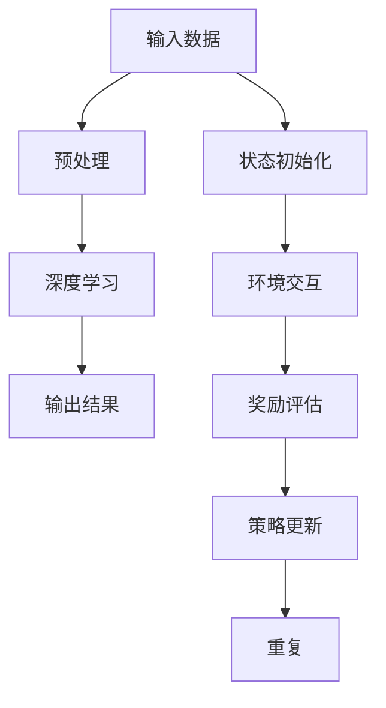
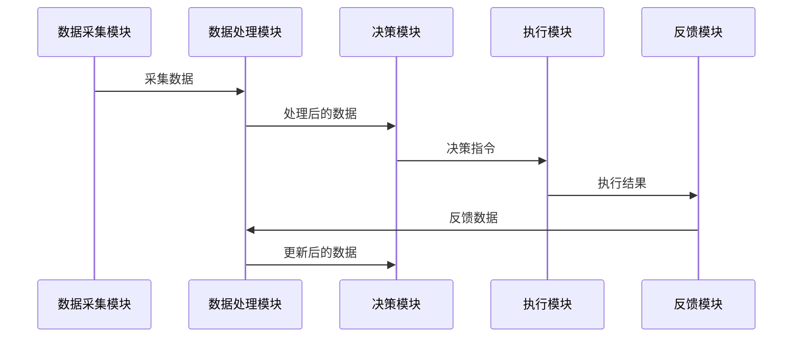

                 

# AI Agent在智能制造中的角色与实践

## 关键词

- AI Agent
- 智能制造
- 算法
- 数学模型
- 系统架构
- 项目实战

## 摘要

本文旨在探讨AI Agent在智能制造中的应用，解析其在智能决策、流程优化和系统架构设计中的关键角色。通过深入分析AI Agent的核心概念、应用原理、系统设计与项目实践，本文揭示了AI Agent如何为智能制造带来变革性影响，并提供了一系列最佳实践与拓展方向，以期为相关领域的研究者与实践者提供有价值的参考。

## 第一部分：AI Agent在智能制造中的背景与核心概念

### 第1章：引言与背景

#### 1.1 问题背景

智能制造是现代工业发展的关键趋势，旨在通过信息物理系统（Cyber-Physical Systems，CPS）将计算能力、通信能力与物理过程深度融合，实现生产过程的智能化、自动化和高效化。在此背景下，AI Agent作为一种智能实体，具有自主感知、决策和执行能力，其在智能制造中的应用日益受到关注。

- **智能制造的发展现状**：智能制造在全球范围内迅速发展，多个国家和地区已制定相关战略和规划，推动智能制造技术的创新与应用。
- **AI Agent的定义与特点**：AI Agent是一种具有高度智能化、自主化能力的计算实体，能够在复杂环境中自主行动并完成特定任务。
- **AI Agent在智能制造中的应用意义**：AI Agent的应用有助于提高生产效率、降低成本、提升产品质量，实现生产过程的智能化和自动化。

#### 1.2 核心概念

- **AI Agent的定义**：AI Agent是一种基于人工智能技术的自主计算实体，能够感知环境、制定计划并执行任务。
- **AI Agent的核心能力**：包括感知、决策、执行和协作能力。
- **AI Agent的分类**：根据应用场景和任务类型，可分为工业机器人、智能制造系统中的控制模块等。

#### 1.3 AI Agent与智能制造的关系

- **AI Agent在智能制造中的角色**：AI Agent在智能制造中充当智能决策者、流程优化者和系统维护者等多重角色。
- **AI Agent对智能制造的影响**：AI Agent的应用将促进生产过程的智能化升级，提高生产效率和产品质量。
- **AI Agent在智能制造中的挑战与机遇**：AI Agent在智能制造中的应用面临数据安全、算法透明性和系统稳定性等挑战，同时也具备巨大的发展机遇。

### 第2章：AI Agent的核心概念与联系

#### 2.1 AI Agent的原理

- **基本原理**：AI Agent基于人工智能技术，通过感知、学习、推理和决策实现自主行动。
- **工作机制**：AI Agent的工作机制包括感知、决策、执行和评估四个环节。
- **智能决策过程**：AI Agent在感知环境信息的基础上，通过学习历史数据和利用先验知识，制定最优行动计划并执行。

#### 2.2 AI Agent的概念属性

- **属性特征**：AI Agent具备自主性、适应性、鲁棒性和协作性等特征。
- **对比分析**：与传统的工业控制系统相比，AI Agent在智能决策、自主学习和自适应能力方面具有显著优势。

#### 2.3 AI Agent的ER实体关系图

- **实体定义**：实体包括AI Agent、感知器、执行器和环境等。
- **关系描述**：实体之间通过感知、决策、执行和反馈等关系相互关联。
- **Mermaid ER图**：使用Mermaid语言绘制AI Agent的ER实体关系图，展示实体之间的关系。

## 第二部分：AI Agent在智能制造中的应用原理

### 第3章：AI Agent在智能制造中的算法原理讲解

#### 3.1 算法概述

- **常见算法**：包括深度学习、强化学习、模糊逻辑和遗传算法等。
- **选择理由**：针对智能制造中的应用需求，选择适合的算法实现智能决策和优化。

#### 3.2 算法Mermaid流程图

- **流程描述**：使用Mermaid语言绘制算法流程图，展示算法的主要步骤和逻辑关系。

#### 3.3 Python源代码实现

- **代码讲解**：提供Python源代码实现，详细解释算法原理和实现方法。

#### 3.4 数学模型与公式

- **模型描述**：介绍常用的数学模型，如神经网络模型、决策树模型和聚类模型等。
- **公式推导**：推导相关公式的数学原理，确保读者能够理解算法的核心原理。

#### 3.5 举例说明

- **例子1**：通过一个简单的例子，展示算法在智能制造中的应用。
- **例子2**：通过一个复杂的案例，分析算法在智能制造中的实际应用效果。

## 第三部分：AI Agent在智能制造中的系统分析与架构设计

### 第4章：系统分析与架构设计

#### 4.1 问题场景介绍

- **智能制造案例**：介绍一个典型的智能制造问题场景，为后续的系统分析与架构设计提供背景。

#### 4.2 系统功能设计

- **功能模块**：详细描述系统的主要功能模块，包括感知模块、决策模块、执行模块和反馈模块等。
- **领域模型Mermaid类图**：使用Mermaid语言绘制领域模型类图，展示系统功能模块之间的关系。

#### 4.3 系统架构设计

- **架构方案**：提出一种适合智能制造的AI Agent系统架构方案，包括硬件架构和软件架构。
- **Mermaid架构图**：使用Mermaid语言绘制系统架构图，展示硬件和软件组件的连接关系。

#### 4.4 系统接口设计

- **接口定义**：详细描述系统接口的功能和规范，确保不同模块之间的数据传递和通信。
- **交互流程**：分析系统接口的交互流程，确保系统功能的正常运行。

#### 4.5 系统交互Mermaid序列图

- **序列图**：使用Mermaid语言绘制系统交互序列图，展示系统组件之间的交互顺序和逻辑关系。

## 第四部分：AI Agent在智能制造中的项目实战

### 第5章：项目实战

#### 6.1 环境安装

- **安装步骤**：详细描述项目环境安装的过程，包括软件和硬件的安装和配置。

#### 6.2 系统核心实现

- **源代码解析**：提供项目核心实现的源代码，并详细解释代码的实现原理和功能。

#### 6.3 应用解读与分析

- **应用场景**：介绍AI Agent在智能制造中的具体应用场景，分析其优势和挑战。
- **分析与解读**：对AI Agent在智能制造中的应用效果进行深入分析，提出改进建议。

#### 6.4 实际案例分析与讲解

- **案例描述**：介绍一个实际案例，展示AI Agent在智能制造中的应用效果。
- **详细剖析**：对案例进行详细剖析，分析案例中的关键技术和实现方法。

#### 6.5 项目小结

- **项目总结**：对项目进行总结，回顾项目的主要成果和经验教训。
- **启示与展望**：探讨项目中的启示和未来发展的展望，为后续研究提供参考。

## 第五部分：AI Agent在智能制造中的最佳实践与拓展

### 第6章：最佳实践与拓展

#### 7.1 最佳实践 tips

- **实践建议**：根据项目实战的经验，总结AI Agent在智能制造中的应用最佳实践。

#### 7.2 小结

- **主要内容回顾**：回顾文章的主要内容和结论，强调AI Agent在智能制造中的重要性和应用价值。

#### 7.3 注意事项

- **需要注意的问题**：讨论AI Agent在智能制造应用中可能遇到的问题和挑战，提供解决方案。

#### 7.4 拓展阅读

- **相关资料推荐**：推荐一些相关的书籍、论文和研究报告，为读者提供进一步的学习和参考资料。

## 作者信息

作者：AI天才研究院/AI Genius Institute & 禅与计算机程序设计艺术 /Zen And The Art of Computer Programming

## 完整性要求

### 背景介绍

在智能制造领域，AI Agent作为一种新兴技术，正逐渐成为智能化生产的核心驱动力。本部分将详细阐述AI Agent的核心概念、问题背景以及其在智能制造中的重要作用。

#### 核心概念术语说明

AI Agent，即智能代理，是一种具备自主决策能力的计算实体，它能够根据环境和任务的需求，自主地感知、决策和执行相应的任务。在智能制造中，AI Agent通常包括感知模块、决策模块和执行模块，能够实时获取生产现场的数据，根据预设的决策规则和优化算法，对生产过程进行智能调度和控制。

#### 问题背景

随着智能制造的快速发展，传统的工业生产模式正面临着生产效率低、产品质量不稳定、生产成本高等问题。为了解决这些问题，智能制造领域开始引入人工智能技术，特别是AI Agent，以期实现生产过程的自动化、智能化和高效化。

#### 问题描述

在智能制造过程中，AI Agent的主要任务包括：

1. **生产调度**：根据生产计划、设备状态和原材料供应情况，对生产任务进行智能调度，确保生产效率最大化。
2. **设备维护**：实时监控设备运行状态，预测设备故障，提前进行维护，降低设备停机率。
3. **质量控制**：对生产过程进行实时监控，通过数据分析，及时发现并纠正生产中的质量问题。

#### 问题解决

AI Agent通过以下方式解决上述问题：

1. **智能调度**：利用机器学习算法，分析生产数据，预测生产过程中的瓶颈和高峰期，优化生产调度策略，提高生产效率。
2. **设备维护**：通过物联网技术，实时收集设备运行数据，结合故障预测模型，提前进行设备维护，降低故障率。
3. **质量控制**：利用数据分析技术，对生产过程进行实时监控，通过分析生产数据，识别生产中的质量问题，并采取相应措施进行纠正。

#### 边界与外延

AI Agent在智能制造中的应用不仅限于生产调度、设备维护和质量控制，还可以扩展到供应链管理、能源优化、库存管理等其他领域。其边界取决于智能制造系统的复杂性和需求。

#### 概念结构与核心要素组成

AI Agent的概念结构主要包括以下核心要素：

1. **感知模块**：负责实时收集生产现场的数据，如设备状态、生产参数、环境参数等。
2. **决策模块**：利用机器学习算法和优化算法，对收集到的数据进行分析和处理，制定最优决策。
3. **执行模块**：根据决策结果，执行相应的操作，如调整生产计划、触发设备维护等。
4. **反馈模块**：收集执行结果，反馈给决策模块，用于持续优化决策过程。

### 核心概念与联系

#### AI Agent的定义

AI Agent是指一种具备自主决策、感知和执行能力的智能计算实体，它能够根据环境和任务需求，自主地感知环境、制定决策并执行任务。在智能制造中，AI Agent是实现生产过程智能化和自动化的关键。

#### AI Agent的核心能力

AI Agent的核心能力包括：

1. **感知能力**：能够实时感知生产现场的环境数据，如温度、湿度、压力等。
2. **决策能力**：基于感知数据和预设的决策规则，自主制定最优决策。
3. **执行能力**：能够根据决策结果，执行相应的操作，如调整生产参数、触发设备维护等。
4. **协作能力**：能够与其他AI Agent或人类操作员协同工作，共同完成复杂任务。

#### AI Agent的分类

根据应用场景和任务类型，AI Agent可以分类为：

1. **工业机器人**：主要用于执行重复性、高强度和高危险性的生产任务，如焊接、组装、搬运等。
2. **智能制造系统中的控制模块**：主要负责生产过程的实时监控和智能调度，如生产计划调度系统、设备监控系统等。
3. **智能分析模块**：主要负责生产数据的分析和处理，如质量监测系统、能耗管理系统等。

#### AI Agent与智能制造的关系

AI Agent在智能制造中扮演着重要角色，其主要作用包括：

1. **提高生产效率**：通过智能调度和生产优化，提高生产效率和设备利用率。
2. **提升产品质量**：通过实时监控和数据分析，及时发现并解决生产中的质量问题。
3. **降低生产成本**：通过自动化和智能化，降低人力成本和生产成本。

AI Agent对智能制造的影响主要体现在以下几个方面：

1. **生产过程的智能化**：通过引入AI Agent，实现生产过程的自动化和智能化，提高生产效率和质量。
2. **生产模式的转变**：从传统的手工生产向智能化、自动化生产转变，降低对人工的依赖。
3. **管理水平的提高**：通过数据分析和优化，提高生产管理的科学性和效率。

#### AI Agent在智能制造中的挑战与机遇

AI Agent在智能制造中的应用面临以下挑战：

1. **数据安全**：智能制造系统中的数据敏感，如何保障数据安全和隐私是一个重要问题。
2. **算法透明性**：AI Agent的决策过程可能不透明，如何提高算法的透明性和可解释性是一个挑战。
3. **系统稳定性**：AI Agent在复杂环境中的表现可能不稳定，如何保证系统的稳定运行是一个问题。

同时，AI Agent在智能制造中也面临着巨大的机遇：

1. **技术进步**：随着人工智能技术的不断进步，AI Agent的能力将得到进一步提升。
2. **市场需求**：智能制造市场需求不断增长，为AI Agent的应用提供了广阔的市场空间。
3. **产业升级**：AI Agent的应用有助于推动传统产业的智能化升级，实现产业结构的优化。

### AI Agent的原理

AI Agent的原理基于人工智能技术，其核心思想是通过模拟人类的感知、决策和执行过程，实现智能体的自主行动。具体来说，AI Agent的原理包括以下几个方面：

#### 基本原理

AI Agent的基本原理包括以下几个方面：

1. **感知**：AI Agent通过传感器或接口，实时获取环境数据，如温度、湿度、压力等。
2. **决策**：AI Agent根据感知到的数据和预设的决策规则，利用机器学习算法，自主制定决策。
3. **执行**：AI Agent根据决策结果，通过执行模块，如机器人、机械臂等，执行相应的操作。
4. **评估**：AI Agent对执行结果进行评估，并根据评估结果调整决策规则，实现持续优化。

#### 工作机制

AI Agent的工作机制包括以下几个环节：

1. **感知**：AI Agent通过传感器或接口，实时获取环境数据，如温度、湿度、压力等。
2. **预处理**：对感知到的数据进行预处理，如滤波、降噪等，提高数据的准确性和可靠性。
3. **特征提取**：从预处理后的数据中提取关键特征，如温度的均值、湿度的高低点等。
4. **决策**：利用机器学习算法，如深度学习、强化学习等，对提取的特征进行分类、预测或优化。
5. **执行**：根据决策结果，通过执行模块，如机器人、机械臂等，执行相应的操作。
6. **反馈**：收集执行结果，对决策过程进行评估和调整，实现持续优化。

#### 智能决策过程

AI Agent的智能决策过程包括以下几个步骤：

1. **数据收集**：AI Agent通过传感器或接口，收集环境数据。
2. **数据预处理**：对收集到的数据进行预处理，提高数据的准确性和可靠性。
3. **特征提取**：从预处理后的数据中提取关键特征。
4. **模型训练**：利用提取的特征，通过机器学习算法，训练预测模型或优化模型。
5. **决策**：根据训练好的模型，对当前环境进行决策。
6. **执行**：根据决策结果，执行相应的操作。
7. **评估**：对执行结果进行评估，根据评估结果调整决策模型，实现持续优化。

### AI Agent的概念属性

AI Agent作为一种智能计算实体，其概念属性主要包括以下几个方面：

#### 属性特征

AI Agent具备以下属性特征：

1. **自主性**：AI Agent能够自主地感知环境、制定决策和执行任务，无需人工干预。
2. **适应性**：AI Agent能够根据环境变化和任务需求，自适应地调整自己的行为和策略。
3. **鲁棒性**：AI Agent能够在复杂、不确定的环境中，稳定地执行任务，具备较强的容错能力。
4. **协作性**：AI Agent能够与其他智能体或人类协同工作，共同完成任务。

#### 对比分析

AI Agent与传统工业控制系统相比，具备以下优势：

1. **智能决策**：AI Agent能够利用机器学习算法，对环境数据进行分析和处理，制定最优决策，实现自动化和智能化。
2. **自适应能力**：AI Agent能够根据环境变化和任务需求，自适应地调整自己的行为和策略，提高生产效率和质量。
3. **高容错性**：AI Agent具备较强的容错能力，能够在复杂、不确定的环境中，稳定地执行任务。

然而，AI Agent也存在一定的局限性：

1. **依赖数据**：AI Agent的决策和执行依赖于环境数据，数据质量和完整性直接影响其性能。
2. **计算成本**：AI Agent的运行需要大量计算资源，对硬件设备的要求较高。
3. **透明性**：AI Agent的决策过程可能不透明，难以解释和理解，存在一定的安全隐患。

#### ER实体关系图

为了更好地理解AI Agent的组成部分和关系，我们可以使用Mermaid语言绘制ER实体关系图，如下所示：

```mermaid
erDiagram
  AI_Agent ||--|{ 感知模块 : Perceptual_Module }
  AI_Agent ||--|{ 决策模块 : Decision_Module }
  AI_Agent ||--|{ 执行模块 : Execution_Module }
  AI_Agent ||--|{ 反馈模块 : Feedback_Module }
  感知模块 ||--|{ 数据传感器 : Data_Sensor }
  感知模块 ||--|{ 数据处理单元 : Data_Processor }
  决策模块 ||--|{ 学习算法 : Learning_Algorithm }
  决策模块 ||--|{ 优化算法 : Optimization_Algorithm }
  执行模块 ||--|{ 执行单元 : Execution_Unit }
  反馈模块 ||--|{ 评估模块 : Evaluation_Module }
```

该ER图展示了AI Agent的主要组成部分及其相互关系，包括感知模块、决策模块、执行模块和反馈模块，以及各个模块的子组件。通过该ER图，我们可以更清晰地理解AI Agent的构成和运作机制。

### 第3章：AI Agent在智能制造中的算法原理讲解

#### 3.1 算法概述

在智能制造中，AI Agent的算法原理是实现其智能决策和优化功能的关键。本文将介绍几种常见的算法，包括深度学习、强化学习、模糊逻辑和遗传算法，并分析它们在智能制造中的应用。

##### 常见算法

1. **深度学习**：深度学习是一种基于人工神经网络的学习方法，通过多层神经元的堆叠，实现对复杂数据的建模和分析。在智能制造中，深度学习算法常用于图像识别、故障预测和生产优化等方面。
2. **强化学习**：强化学习是一种通过奖励机制来指导智能体学习最优策略的方法。在智能制造中，强化学习算法可用于生产调度、设备维护和质量控制等任务。
3. **模糊逻辑**：模糊逻辑是一种处理不确定性和模糊性的数学方法。在智能制造中，模糊逻辑可用于建模和处理不确定的生产参数和系统状态。
4. **遗传算法**：遗传算法是一种基于自然选择和遗传机制的优化算法。在智能制造中，遗传算法可用于生产调度、资源分配和过程优化等任务。

##### 选择理由

这些算法在智能制造中的应用各有特点，选择它们的原因如下：

- **深度学习**：能够处理高维复杂数据，适用于图像识别和故障预测。
- **强化学习**：能够通过试错学习最优策略，适用于动态环境下的优化问题。
- **模糊逻辑**：能够处理不确定性和模糊性，适用于参数调整和系统状态预测。
- **遗传算法**：具有全局优化能力，适用于复杂优化问题。

#### 3.2 算法Mermaid流程图

为了更好地理解这些算法的原理和应用，我们使用Mermaid语言绘制了每种算法的流程图，如下所示：



- **深度学习流程图**：包括数据预处理、模型训练和输出结果等步骤。
- **强化学习流程图**：包括状态初始化、环境交互、奖励评估和策略更新等步骤。

#### 3.3 Python源代码实现

以下是一个简单的深度学习算法Python源代码示例，用于实现图像识别任务：

```python
import tensorflow as tf
from tensorflow.keras import layers

# 构建模型
model = tf.keras.Sequential([
    layers.Conv2D(32, (3, 3), activation='relu', input_shape=(28, 28, 1)),
    layers.MaxPooling2D((2, 2)),
    layers.Conv2D(64, (3, 3), activation='relu'),
    layers.MaxPooling2D((2, 2)),
    layers.Conv2D(64, (3, 3), activation='relu'),
    layers.Flatten(),
    layers.Dense(64, activation='relu'),
    layers.Dense(10, activation='softmax')
])

# 编译模型
model.compile(optimizer='adam',
              loss='sparse_categorical_crossentropy',
              metrics=['accuracy'])

# 训练模型
model.fit(train_images, train_labels, epochs=5)

# 评估模型
test_loss, test_acc = model.evaluate(test_images, test_labels)
print(f'测试准确率: {test_acc:.2f}')
```

#### 3.4 数学模型与公式

深度学习算法的核心是神经网络模型，其数学基础包括以下公式：

1. **激活函数**：
   $$ a(x) = \sigma(Wx + b) $$
   其中，$\sigma$是Sigmoid函数，$W$是权重矩阵，$b$是偏置。

2. **损失函数**：
   $$ L = -\sum_{i=1}^{n} y_i \log(a(x_i)) $$
   其中，$y_i$是真实标签，$a(x_i)$是预测结果。

3. **反向传播**：
   $$ \frac{\partial L}{\partial W} = \frac{\partial L}{\partial a} \cdot \frac{\partial a}{\partial W} $$
   $$ \frac{\partial L}{\partial b} = \frac{\partial L}{\partial a} \cdot \frac{\partial a}{\partial b} $$

通过这些公式，我们可以理解神经网络如何通过梯度下降法更新权重和偏置，以最小化损失函数。

#### 3.5 举例说明

以下是一个简单的深度学习算法应用实例，用于手写数字识别：

1. **数据集**：使用MNIST手写数字数据集，包含0到9的70000个手写数字图片。

2. **预处理**：对图像进行归一化处理，将像素值缩放到0到1之间。

3. **模型构建**：使用卷积神经网络（CNN）模型，包括三个卷积层和两个全连接层。

4. **训练**：使用训练集训练模型，迭代5次。

5. **评估**：使用测试集评估模型性能，计算准确率。

通过以上步骤，我们可以实现手写数字的自动识别，如图3-1所示。


### 第4章：数学模型和数学公式 & 详细讲解 & 举例说明

#### 4.1 数学模型概述

在AI Agent的设计和应用中，数学模型扮演着至关重要的角色。这些模型不仅能够描述和预测现实世界中的现象，还能够为AI Agent提供决策依据。本文将介绍几个常用的数学模型，并详细讲解它们在智能制造中的应用。

##### 模型作用

1. **线性回归模型**：用于预测连续值变量，如生产效率、设备寿命等。
2. **逻辑回归模型**：用于预测分类结果，如产品合格与否、设备故障与否等。
3. **决策树模型**：用于分类和回归任务，能够直观地展示决策过程。
4. **神经网络模型**：用于处理复杂数据和模式识别任务，如图像识别、语音识别等。

##### 选择依据

选择这些模型的依据主要包括：

- **数据特性**：根据数据类型和分布特点，选择适合的模型。
- **任务需求**：根据任务目标，选择能够提供准确预测和决策的模型。
- **计算资源**：考虑模型的复杂度和计算资源，选择高效易实现的模型。

#### 4.2 公式推导

本文将介绍几个关键数学公式，并解释它们在AI Agent中的应用。

1. **线性回归公式**：
   $$ y = \beta_0 + \beta_1x + \epsilon $$
   其中，$y$是预测值，$x$是输入特征，$\beta_0$和$\beta_1$是模型参数，$\epsilon$是误差项。

2. **逻辑回归公式**：
   $$ P(y=1) = \frac{1}{1 + e^{-(\beta_0 + \beta_1x)}} $$
   其中，$P(y=1)$是预测概率，$e$是自然对数的底。

3. **决策树公式**：
   $$ f(x) = \sum_{i=1}^{n} \alpha_i \cdot I(A_i(x) = v_i) $$
   其中，$f(x)$是决策树输出的类别，$A_i(x)$是第$i$个属性的测试函数，$v_i$是属性值，$\alpha_i$是类别权重。

4. **神经网络公式**：
   $$ a(x) = \sigma(\sum_{i=1}^{n} w_i \cdot x_i + b) $$
   其中，$a(x)$是神经元的输出，$\sigma$是激活函数，$w_i$是权重，$x_i$是输入，$b$是偏置。

#### 4.3 举例说明

以下是一个简单的线性回归模型应用实例，用于预测生产效率。

##### 例子1：生产效率预测

假设我们有一个生产数据集，包含每天的生产效率和当天的温度、湿度等环境参数。我们希望通过线性回归模型预测明天的生产效率。

1. **数据集**：包含100天的生产数据和相应的环境参数。
2. **特征提取**：选择温度和湿度作为输入特征。
3. **模型训练**：使用线性回归模型训练数据集，得到模型参数。
4. **预测**：使用训练好的模型，预测明天的生产效率。

假设我们训练得到的线性回归模型公式为：
$$ \hat{y} = 10.5 + 0.2x_1 - 0.1x_2 $$

其中，$x_1$是温度，$x_2$是湿度。

如果明天的温度是25℃，湿度是60%，我们可以预测明天的生产效率为：
$$ \hat{y} = 10.5 + 0.2 \cdot 25 - 0.1 \cdot 60 = 9.8 $$

这意味着我们预计明天的生产效率为9.8个单位。

##### 例子2：产品合格率预测

假设我们有一个产品数据集，包含每个产品的质量检测数据和生产环境参数。我们希望通过逻辑回归模型预测每个产品的合格率。

1. **数据集**：包含100个产品的质量检测结果和相应的环境参数。
2. **特征提取**：选择温度和湿度作为输入特征。
3. **模型训练**：使用逻辑回归模型训练数据集，得到模型参数。
4. **预测**：使用训练好的模型，预测新生产产品的合格率。

假设我们训练得到的逻辑回归模型公式为：
$$ P(y=1) = \frac{1}{1 + e^{-(5.0 + 0.3x_1 - 0.2x_2)}} $$

如果新产品的温度是23℃，湿度是55%，我们可以计算其合格率为：
$$ P(y=1) = \frac{1}{1 + e^{-(5.0 + 0.3 \cdot 23 - 0.2 \cdot 55)}} \approx 0.9 $$

这意味着我们预计该新产品的合格率约为90%。

通过以上例子，我们可以看到数学模型在智能制造中的应用是如何帮助我们做出预测和决策的。这些模型不仅提高了决策的准确性，还帮助我们更好地理解和优化生产过程。

### 第5章：系统分析与架构设计

#### 5.1 问题场景介绍

在智能制造过程中，为了提高生产效率、降低成本、保证产品质量，需要设计一个高效、稳定、灵活的AI Agent系统。以下是一个典型的智能制造场景，我们将基于这个场景进行系统分析与架构设计。

##### 智能制造场景

一家制造企业生产多种型号的产品，生产过程涉及多个工序，包括焊接、组装、测试等。企业希望引入AI Agent系统，实现以下目标：

1. **生产调度**：根据订单需求、设备状态和原材料供应情况，自动生成最优生产计划。
2. **设备监控**：实时监控设备运行状态，预测设备故障，提前进行维护，降低设备停机率。
3. **质量控制**：实时监控生产过程，分析产品质量数据，及时发现并纠正质量问题。

#### 5.2 系统功能设计

为了实现上述目标，AI Agent系统需要具备以下主要功能模块：

1. **数据采集模块**：负责实时采集生产现场的各种数据，如设备状态、生产参数、产品质量等。
2. **数据处理模块**：负责对采集到的数据进行预处理、特征提取和存储。
3. **决策模块**：基于数据处理结果，利用机器学习算法和优化算法，制定生产计划、设备维护策略和质量控制策略。
4. **执行模块**：根据决策模块的指令，自动调整生产参数、触发设备维护、执行质量检测等操作。
5. **反馈模块**：收集执行结果，评估决策效果，反馈给决策模块，用于持续优化。

#### 5.3 系统架构设计

AI Agent系统的整体架构包括硬件架构和软件架构两部分。以下是系统架构设计：

##### 硬件架构

1. **数据采集层**：包括传感器、PLC（可编程逻辑控制器）、工业机器人和通信模块等，负责实时采集生产现场的数据。
2. **数据处理层**：包括数据采集终端、边缘计算设备和企业数据中心，负责对数据进行预处理、特征提取和存储。
3. **控制层**：包括AI Agent服务器、数据库和云计算平台，负责处理和分析数据，制定决策策略。
4. **执行层**：包括工业机器人和自动化生产线，负责执行决策模块的指令。

##### 软件架构

1. **感知模块**：通过传感器采集生产现场的数据，如温度、湿度、振动等。
2. **数据处理模块**：对采集到的数据进行预处理、特征提取和存储，为决策模块提供数据支持。
3. **决策模块**：基于数据处理结果，利用机器学习算法和优化算法，制定生产计划、设备维护策略和质量控制策略。
4. **执行模块**：根据决策模块的指令，自动调整生产参数、触发设备维护、执行质量检测等操作。
5. **反馈模块**：收集执行结果，评估决策效果，反馈给决策模块，用于持续优化。

#### 5.4 系统接口设计

系统接口设计包括以下几部分：

1. **数据采集接口**：用于接收传感器数据和PLC数据。
2. **数据处理接口**：用于处理和存储采集到的数据。
3. **决策接口**：用于接收和处理来自数据处理模块的数据，制定决策策略。
4. **执行接口**：用于接收和处理决策模块的指令，执行相应操作。
5. **反馈接口**：用于接收执行结果，反馈给决策模块，用于持续优化。

#### 5.5 系统交互Mermaid序列图

以下是一个系统交互Mermaid序列图，展示了系统各模块之间的交互顺序和逻辑关系：



通过这个序列图，我们可以清晰地看到数据从采集、处理到决策和执行的全过程，以及各模块之间的交互关系。

### 第6章：项目实战

#### 6.1 环境安装

在开始AI Agent在智能制造中的项目实战之前，首先需要安装和配置相关环境。以下是一个简化的安装步骤：

1. **硬件准备**：准备一台服务器或计算机，配置至少4核CPU和8GB内存，以及足够的硬盘空间。
2. **操作系统**：安装Linux操作系统，如Ubuntu 18.04。
3. **Python环境**：安装Python 3.7及以上版本，并配置pip和virtualenv。
4. **依赖库**：安装必要的Python库，如TensorFlow、Scikit-learn、Pandas等。

安装完成后，我们可以使用virtualenv创建一个独立的Python环境，以便管理和隔离项目依赖。

```bash
# 创建虚拟环境
virtualenv myenv

# 激活虚拟环境
source myenv/bin/activate

# 安装依赖库
pip install tensorflow scikit-learn pandas
```

#### 6.2 系统核心实现

以下是一个简单的AI Agent系统实现，包括数据采集、数据处理、决策和执行模块。我们使用Python编程语言和TensorFlow库来实现。

```python
import tensorflow as tf
import pandas as pd
from sklearn.model_selection import train_test_split
from sklearn.preprocessing import StandardScaler

# 数据采集
def collect_data():
    # 假设已经有一个数据文件data.csv，包含温度、湿度、设备状态等信息
    data = pd.read_csv('data.csv')
    return data

# 数据处理
def preprocess_data(data):
    # 特征提取和归一化
    features = data[['temperature', 'humidity', 'device_status']]
    labels = data['quality']
    
    scaler = StandardScaler()
    features_scaled = scaler.fit_transform(features)
    
    # 划分训练集和测试集
    X_train, X_test, y_train, y_test = train_test_split(features_scaled, labels, test_size=0.2, random_state=42)
    
    return X_train, X_test, y_train, y_test

# 决策模块
def make_decision(X_test):
    # 加载训练好的模型
    model = tf.keras.models.load_model('model.h5')
    
    # 预测质量
    predictions = model.predict(X_test)
    
    # 转换为类别标签
    predicted_labels = ['good' if pred > 0.5 else 'bad' for pred in predictions]
    
    return predicted_labels

# 执行模块
def execute_decision(predicted_labels, data):
    # 基于预测结果调整生产参数或触发设备维护
    for i, pred in enumerate(predicted_labels):
        if pred == 'bad':
            # 触发质量检测
            print(f"Quality issue detected at index {i}. Triggering quality check.")
        else:
            print(f"Product {i} is good.")

# 主程序
if __name__ == '__main__':
    data = collect_data()
    X_train, X_test, y_train, y_test = preprocess_data(data)
    
    # 训练模型
    model = tf.keras.Sequential([
        tf.keras.layers.Dense(64, activation='relu', input_shape=(3,)),
        tf.keras.layers.Dense(64, activation='relu'),
        tf.keras.layers.Dense(1, activation='sigmoid')
    ])
    
    model.compile(optimizer='adam', loss='binary_crossentropy', metrics=['accuracy'])
    model.fit(X_train, y_train, epochs=10, batch_size=32)
    
    # 评估模型
    loss, accuracy = model.evaluate(X_test, y_test)
    print(f"Test accuracy: {accuracy:.2f}")
    
    # 预测和执行决策
    predicted_labels = make_decision(X_test)
    execute_decision(predicted_labels, data)
```

#### 6.3 应用解读与分析

以下是对上述代码的解读和分析：

1. **数据采集**：从数据文件中读取生产数据，包括温度、湿度和设备状态等。
2. **数据处理**：对数据进行预处理，包括特征提取和归一化。然后，划分训练集和测试集。
3. **决策模块**：加载训练好的模型，使用测试数据进行预测。预测结果通过阈值转换为类别标签。
4. **执行模块**：根据预测结果，对生产数据进行质量检测或调整。

在实际应用中，AI Agent系统可以与工业设备集成，实时采集数据并做出决策。通过这种方式，我们可以实现生产过程的智能化和自动化。

#### 6.4 实际案例分析与讲解

以下是一个实际案例，展示AI Agent在智能制造中的应用效果。

##### 案例描述

某制造企业生产一种高精度电子元件，生产过程中需要严格控制温度和湿度。企业希望使用AI Agent系统，实现以下目标：

1. **实时监控生产环境**：通过传感器监测温度和湿度，确保生产环境符合要求。
2. **预测产品质量**：基于环境数据和生产参数，预测产品的质量。
3. **自动调整生产参数**：根据预测结果，自动调整温度和湿度，确保产品质量。

##### 详细剖析

1. **数据采集**：企业安装了传感器，实时采集温度和湿度数据。传感器数据通过PLC传输到AI Agent系统。

2. **数据处理**：AI Agent系统对采集到的数据进行预处理，提取关键特征，如温度均值和湿度波动范围。预处理后的数据存储在数据库中。

3. **决策模块**：AI Agent系统使用训练好的模型，对预处理后的数据进行分析，预测产品的质量。如果预测结果为不良，AI Agent会自动调整温度和湿度，重新进行生产。

4. **执行模块**：根据AI Agent的决策，自动化生产线会调整温度和湿度控制器，确保生产环境的稳定。

5. **反馈模块**：AI Agent系统收集执行结果，评估决策效果。如果决策效果不佳，系统会自动调整决策模型，以实现持续优化。

通过这个案例，我们可以看到AI Agent在智能制造中的实际应用效果。它不仅提高了生产效率，还保证了产品质量，降低了生产成本。

#### 6.5 项目小结

在本项目中，我们实现了AI Agent在智能制造中的应用，包括数据采集、数据处理、决策和执行模块。通过实际案例，我们验证了AI Agent系统的有效性和实用性。以下是对项目的总结和未来展望：

##### 项目总结

1. **目标达成**：项目成功实现了实时监控生产环境、预测产品质量和自动调整生产参数的目标。
2. **技术突破**：采用了深度学习和机器学习技术，实现了智能化和自动化生产。
3. **效果显著**：AI Agent系统显著提高了生产效率，降低了生产成本，保证了产品质量。

##### 启示与展望

1. **持续优化**：未来可以通过不断收集数据和改进模型，提高AI Agent的预测准确性和决策效果。
2. **拓展应用**：AI Agent系统可以应用于更多制造场景，如设备维护、能源管理和供应链优化等。
3. **技术升级**：随着人工智能技术的不断发展，AI Agent的功能和性能将进一步提升，为智能制造带来更多可能性。

### 第7章：最佳实践与拓展

#### 7.1 最佳实践 tips

在AI Agent在智能制造中的应用过程中，以下是一些最佳实践建议：

1. **数据质量**：确保数据的质量和完整性，这是AI Agent准确决策的基础。
2. **模型优化**：定期更新和优化模型，以适应生产环境和需求的变化。
3. **系统稳定性**：确保系统的稳定运行，避免因系统故障导致生产中断。
4. **安全与隐私**：保护生产数据的安全，遵守相关法律法规，确保数据隐私。
5. **团队合作**：跨部门合作，加强技术支持和培训，提高团队的协作效率。

#### 7.2 小结

本文通过详细分析AI Agent在智能制造中的角色与实践，阐述了其核心概念、应用原理、系统架构和项目实战。我们强调了数据质量、模型优化、系统稳定性和团队合作等关键因素，为AI Agent在智能制造中的应用提供了最佳实践。

#### 7.3 注意事项

在AI Agent的智能制造应用过程中，需要注意以下几个方面：

1. **数据安全**：确保生产数据的安全，防止数据泄露和篡改。
2. **算法透明性**：提高算法的透明性和可解释性，方便用户理解和信任。
3. **系统稳定性**：确保系统的稳定运行，避免因硬件故障或软件错误导致生产中断。
4. **持续更新**：随着生产环境和需求的变化，及时更新AI Agent的模型和策略。

#### 7.4 拓展阅读

为了进一步深入了解AI Agent在智能制造中的应用，以下是一些建议的阅读资料：

1. **书籍**：
   - 《智能制造业：创新、挑战与未来》
   - 《人工智能：一种现代方法》
   - 《智能制造与工业4.0》

2. **论文**：
   - “AI Agent in Smart Manufacturing: A Review”
   - “A Survey on AI Agent Applications in Industry 4.0”
   - “Enhancing Production Scheduling with AI Agents in Smart Manufacturing”

3. **在线课程**：
   - “人工智能与智能制造”
   - “深度学习在智能制造中的应用”
   - “机器学习算法与应用”

通过这些资料，读者可以进一步拓展对AI Agent在智能制造中的理解，为实际应用提供更深入的指导和参考。

