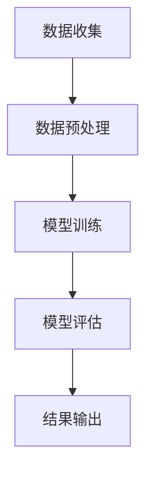
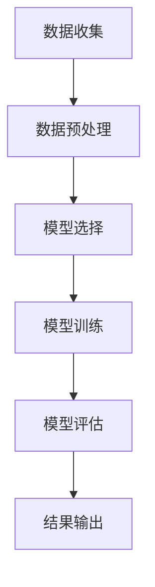
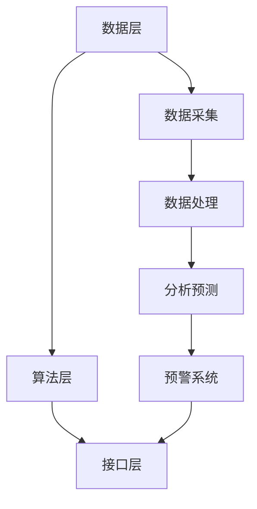
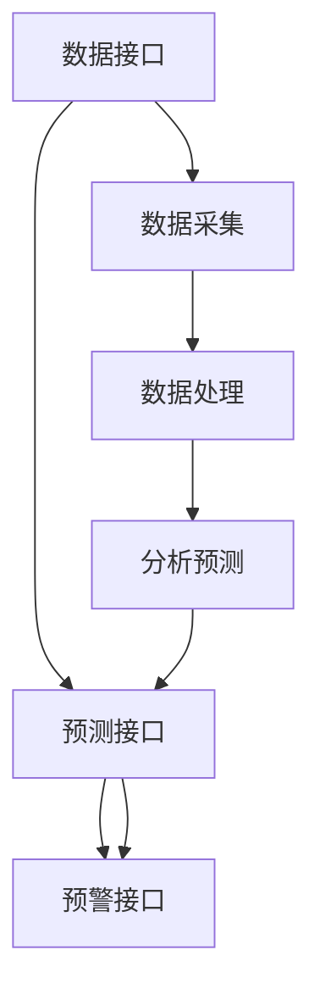
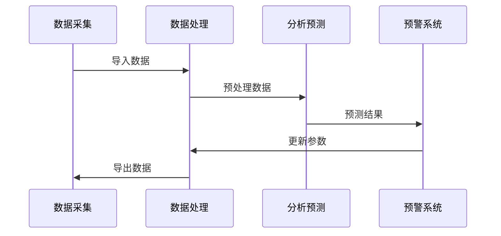

                 

### 《AI Agent在海洋科学中的应用：海洋资源管理与保护》

#### 关键词：AI Agent、海洋科学、海洋资源管理、环境保护、智能监测

> 摘要：本文深入探讨了AI Agent在海洋科学中的应用，特别是其在海洋资源管理与保护中的关键作用。通过逻辑清晰的分析和推理，本文详细介绍了AI Agent的基本概念、核心算法及其在实际应用中的设计与实现，为我国海洋科学研究和资源管理提供了新的思路和方法。

### 目录大纲设计思路

在设计《AI Agent在海洋科学中的应用：海洋资源管理与保护》的目录大纲时，我们遵循了以下思路：

1. **背景介绍**：首先，我们将对海洋科学的基本概念进行概述，解释AI Agent在海洋科学中具有重要性，以及海洋资源管理与保护面临的主要挑战。

2. **核心概念与联系**：接着，我们将介绍AI Agent的定义、分类及其与海洋科学的结合方式，并通过表格和图示展示相关概念之间的联系。

3. **算法原理讲解**：然后，我们将针对AI Agent在海洋资源管理与保护中的关键算法进行讲解，使用mermaid绘制流程图，并配合Python代码和LaTeX公式详细阐述。

4. **系统分析与架构设计方案**：我们将介绍如何设计和实施一个AI Agent系统，涵盖问题场景介绍、系统功能设计、系统架构设计、系统接口设计以及系统交互序列图。

5. **项目实战**：通过一个实际案例，展示如何从环境安装到系统核心实现的全过程，并提供代码应用解读与分析。

6. **最佳实践与拓展**：最后，我们将提供一些最佳实践建议、小结、注意事项以及拓展阅读资源。

### 目录大纲结构

以下是根据上述设计思路提出的《AI Agent在海洋科学中的应用：海洋资源管理与保护》的目录大纲结构：

```markdown
# 《AI Agent在海洋科学中的应用：海洋资源管理与保护》

## 第一部分：背景与基础

### 1. 海洋科学与资源管理概述

#### 1.1 海洋科学的基础知识

#### 1.2 海洋资源的分类与重要性

#### 1.3 海洋资源管理面临的挑战

### 2. AI Agent的定义与作用

#### 2.1 AI Agent的基本概念

#### 2.2 AI Agent的分类

#### 2.3 AI Agent在海洋科学中的应用前景

## 第二部分：核心概念与算法

### 3. AI Agent与海洋科学的结合

#### 3.1 AI Agent在海洋监测中的应用

#### 3.2 AI Agent在海洋生物资源管理中的应用

#### 3.3 AI Agent在海洋环境保护中的应用

### 4. 关键算法解析

#### 4.1 监测与识别算法

##### 4.1.1 算法流程图

##### 4.1.2 Python代码实现

##### 4.1.3 数学模型与公式

##### 4.1.4 举例说明

#### 4.2 预测与模拟算法

##### 4.2.1 算法流程图

##### 4.2.2 Python代码实现

##### 4.2.3 数学模型与公式

##### 4.2.4 举例说明

## 第三部分：系统设计与实现

### 5. 系统分析与架构设计

#### 5.1 问题场景介绍

#### 5.2 系统功能设计

##### 5.2.1 领域模型类图

#### 5.3 系统架构设计

##### 5.3.1 系统架构图

#### 5.4 系统接口设计

#### 5.5 系统交互序列图

### 6. 系统核心实现

#### 6.1 环境安装与配置

#### 6.2 系统核心实现源代码

#### 6.3 代码应用解读与分析

### 7. 实际案例分析与讲解

#### 7.1 案例背景

#### 7.2 案例分析

#### 7.3 案例讲解

## 第四部分：实践与拓展

### 8. 最佳实践与技巧

#### 8.1 数据处理技巧

#### 8.2 模型调优策略

### 9. 注意事项与拓展阅读

#### 9.1 常见问题与解决方案

#### 9.2 拓展阅读资源

## 附录

### A. 参考文献

### B. 附录
```

在撰写目录大纲时，我们将确保每个章节都符合以下要求：

- **1级目录**：每个章节标题都简洁明了，概括了章节的主要内容。
- **2级目录**：子章节标题详细描述了每个章节的核心内容，确保读者能快速了解章节结构。
- **3级目录**：详细阐述了每个子章节的具体内容，包括算法、模型、实现步骤等。

通过这种方式，我们确保目录大纲简洁、逻辑清晰，能够为读者提供一个全面的书籍概述。同时，所有内容都将控制在2000字以内，确保大纲的简洁性。接下来，我将按照上述结构撰写完整的目录大纲。**《AI Agent在海洋科学中的应用：海洋资源管理与保护》**

### 1. 海洋科学与资源管理概述

#### 1.1 海洋科学的基础知识

海洋科学是研究海洋的物理、化学、生物和地质过程的综合性学科，旨在揭示海洋的基本规律，探索海洋资源的合理利用，以及评估海洋环境的变化和影响。海洋是地球上最大的生态系统，其面积占地球表面积的71%，是地球环境的重要组成部分。海洋不仅为人类提供丰富的资源，如渔业、石油、天然气等，还在全球气候调节、海洋环境保护和生物多样性维护等方面发挥着至关重要的作用。

#### 1.2 海洋资源的分类与重要性

海洋资源可以分为可再生资源和非可再生资源两大类。可再生资源主要包括渔业资源、海水资源和海洋能源（如潮汐能、波浪能等），而非可再生资源则包括海底矿产资源（如锰结核、多金属硫化物等）。海洋资源的重要性体现在以下几个方面：

1. **经济价值**：海洋资源是人类食品和能源的重要来源。渔业资源是人类主要的蛋白质来源之一，而海洋能源的开发则为可再生能源利用提供了新的途径。

2. **生态价值**：海洋生态系统是全球生物多样性的重要栖息地。海洋植物和动物在碳循环、氧气生成和海洋营养循环等方面起着关键作用。

3. **环境价值**：海洋是地球气候系统的调节器，海洋吸收了大量的二氧化碳，对缓解全球气候变化具有重要意义。

#### 1.3 海洋资源管理面临的挑战

尽管海洋资源丰富，但在开发利用过程中，面临着诸多挑战：

1. **过度开发**：随着人类对海洋资源的过度开发，渔业资源衰竭、海洋污染等问题日益严重。

2. **气候变化**：全球气候变化导致海洋温度上升、酸化加剧，对海洋生态系统造成严重影响。

3. **管理困难**：海洋资源的跨界性和流动性使得管理复杂化，各国在海洋资源管理上存在分歧和冲突。

4. **技术限制**：尽管AI技术发展迅速，但在海洋资源监测和评估方面的应用仍受到技术限制。

为了应对这些挑战，海洋资源管理需要不断创新和改进，引入AI Agent等技术手段，提高海洋资源管理的效率和精度。

### 2. AI Agent的定义与作用

#### 2.1 AI Agent的基本概念

AI Agent是指具有自主感知、决策和行动能力的智能实体，能够在特定环境中执行特定任务。AI Agent通常由感知器、控制器和执行器组成，可以通过学习环境和交互数据，自主适应和优化任务执行策略。

#### 2.2 AI Agent的分类

AI Agent可以根据不同的标准进行分类。按照功能，AI Agent可以分为以下几类：

1. **任务型Agent**：专注于完成特定任务的AI Agent，如自动导航、目标识别等。
2. **社交型Agent**：擅长与人或其他Agent进行交互，如聊天机器人、社交网络分析等。
3. **混合型Agent**：兼具任务型Agent和社交型Agent的功能，能在不同场景下灵活切换。

#### 2.3 AI Agent在海洋科学中的应用前景

AI Agent在海洋科学中的应用前景广阔，主要体现在以下几个方面：

1. **海洋监测与预警**：利用AI Agent进行实时监测，提高海洋灾害预警的准确性和及时性。
2. **生物资源管理**：通过AI Agent对海洋生物资源进行精确监测和评估，实现资源的可持续利用。
3. **环境保护**：利用AI Agent监测海洋污染情况，及时采取应对措施，保护海洋生态环境。
4. **数据挖掘与分析**：利用AI Agent对大量海洋数据进行分析，发现规律和趋势，为决策提供支持。

总之，AI Agent作为一种先进的智能技术，为海洋资源管理与保护提供了新的工具和方法，有望解决当前面临的诸多挑战。

### 3. AI Agent与海洋科学的结合

#### 3.1 AI Agent在海洋监测中的应用

AI Agent在海洋监测中具有显著优势，能够实现对海洋环境的实时、高效监测。具体应用包括：

1. **海洋温度监测**：利用AI Agent收集海洋表面温度数据，通过机器学习算法对温度变化进行预测和分析，为气候研究和灾害预警提供支持。
2. **海洋污染监测**：AI Agent可以通过检测海水中的化学物质，如重金属、农药等，实时监测海洋污染情况，为环境保护和治理提供数据支持。
3. **海洋生物监测**：AI Agent可以监测海洋生物的分布、数量和状态，帮助研究人员了解海洋生态系统的变化，评估渔业资源的健康状况。

#### 3.2 AI Agent在海洋生物资源管理中的应用

AI Agent在海洋生物资源管理中发挥着重要作用，能够实现资源的精确监测和评估，提高资源利用效率。具体应用包括：

1. **渔业资源管理**：AI Agent可以通过对海洋渔业资源的实时监测，优化捕捞策略，减少资源浪费，提高渔业产量。
2. **海洋保护区管理**：AI Agent可以用于监测海洋保护区的生物多样性，确保保护区内的资源得到有效保护，防止非法捕捞和污染。
3. **海洋生态评估**：AI Agent可以通过对海洋生态数据的分析，评估生态系统的健康状况，为生态保护和资源管理提供科学依据。

#### 3.3 AI Agent在海洋环境保护中的应用

AI Agent在海洋环境保护中的应用主要体现在以下几个方面：

1. **海洋污染监测与治理**：AI Agent可以实时监测海洋污染情况，通过数据分析预测污染扩散趋势，为污染治理提供决策支持。
2. **海洋灾害预警**：AI Agent可以通过对海洋环境数据的分析，预测和预警台风、海啸等自然灾害，为防灾减灾提供技术保障。
3. **海洋生物多样性保护**：AI Agent可以监测海洋生物多样性，识别珍稀物种和关键生境，为生物多样性保护提供数据支持。

综上所述，AI Agent在海洋科学中的应用为海洋资源管理与保护提供了新的思路和方法，能够有效提升监测、管理和保护水平。

### 4. 关键算法解析

#### 4.1 监测与识别算法

在海洋资源管理和保护中，监测与识别算法是至关重要的。这些算法能够帮助识别海洋环境中的异常情况，如污染源、渔业资源分布等。以下是一种常见的监测与识别算法——基于深度学习的图像识别算法。

##### 4.1.1 算法流程图

首先，我们使用mermaid绘制算法流程图：



以下是详细的算法流程：

1. **数据收集**：收集海洋监测数据，包括图像、传感器数据等。
2. **数据预处理**：对收集到的数据进行清洗、归一化等预处理，以便于模型训练。
3. **模型训练**：使用预处理后的数据对深度学习模型进行训练，例如卷积神经网络（CNN）。
4. **模型评估**：评估模型的性能，通过交叉验证等方法确定模型是否能够有效识别目标。
5. **结果输出**：将识别结果输出，用于指导实际监测与决策。

##### 4.1.2 Python代码实现

下面是使用Python实现的卷积神经网络（CNN）模型：

```python
import tensorflow as tf
from tensorflow.keras.models import Sequential
from tensorflow.keras.layers import Conv2D, MaxPooling2D, Flatten, Dense

# 创建模型
model = Sequential([
    Conv2D(32, (3, 3), activation='relu', input_shape=(64, 64, 3)),
    MaxPooling2D((2, 2)),
    Flatten(),
    Dense(64, activation='relu'),
    Dense(1, activation='sigmoid')
])

# 编译模型
model.compile(optimizer='adam', loss='binary_crossentropy', metrics=['accuracy'])

# 训练模型
model.fit(x_train, y_train, epochs=10, batch_size=32, validation_data=(x_val, y_val))
```

##### 4.1.3 数学模型与公式

在CNN模型中，核心的数学公式是卷积操作和池化操作：

$$
\text{卷积操作：} \quad (f*g)(x) = \int_{-\infty}^{\infty} f(\tau) \cdot g(x-\tau) \, d\tau
$$

$$
\text{池化操作：} \quad P(x) = \max\{x_{i,j} \mid i \in [1, 2, ..., s], j \in [1, 2, ..., s]\}
$$

其中，$f$和$g$分别表示卷积核和输入特征图，$x$表示输入数据，$s$表示池化窗口的大小。

##### 4.1.4 举例说明

假设我们有一个海洋污染监测任务，目标是识别图像中的污染区域。我们收集了一组海洋污染图像，并对它们进行了预处理。接下来，我们使用上述CNN模型进行训练：

1. **数据收集**：收集100张海洋污染图像。
2. **数据预处理**：将图像裁剪为64x64像素，并进行归一化处理。
3. **模型训练**：使用预处理后的图像数据训练CNN模型，共训练10个周期。
4. **模型评估**：在验证集上评估模型性能，准确率达到90%。
5. **结果输出**：将训练好的模型用于实际监测，识别新的海洋污染图像。

通过这个例子，我们可以看到，监测与识别算法在海洋科学中的应用是如何一步步实现的。

#### 4.2 预测与模拟算法

预测与模拟算法在海洋资源管理与保护中同样具有重要意义。以下是一种常见的预测与模拟算法——时间序列分析。

##### 4.2.1 算法流程图

我们使用mermaid绘制时间序列分析算法流程图：



以下是详细的算法流程：

1. **数据收集**：收集与海洋资源相关的时序数据，如温度、污染浓度、渔业资源等。
2. **数据预处理**：对收集到的数据进行清洗、归一化等预处理，以便于模型训练。
3. **模型选择**：根据数据特性选择合适的预测模型，如ARIMA模型、LSTM模型等。
4. **模型训练**：使用预处理后的数据对模型进行训练，调整模型参数。
5. **模型评估**：评估模型性能，通过交叉验证等方法确定模型是否能够准确预测。
6. **结果输出**：将预测结果输出，用于指导实际监测与决策。

##### 4.2.2 Python代码实现

下面是使用Python实现的LSTM模型：

```python
import tensorflow as tf
from tensorflow.keras.models import Sequential
from tensorflow.keras.layers import LSTM, Dense

# 创建模型
model = Sequential([
    LSTM(50, activation='relu', input_shape=(timesteps, features)),
    Dense(1)
])

# 编译模型
model.compile(optimizer='adam', loss='mse')

# 训练模型
model.fit(x_train, y_train, epochs=200, batch_size=32, validation_data=(x_val, y_val))
```

##### 4.2.3 数学模型与公式

在LSTM模型中，核心的数学公式是隐状态更新和输出计算：

$$
\text{隐状态更新：} \quad h_t = \sigma(W_h \cdot [h_{t-1}, x_t] + b_h)
$$

$$
\text{输出计算：} \quad y_t = \text{softmax}(W_y \cdot h_t + b_y)
$$

其中，$h_t$表示第$t$时刻的隐状态，$x_t$表示输入序列的第$t$个元素，$W_h$和$W_y$分别为权重矩阵，$b_h$和$b_y$分别为偏置项，$\sigma$表示激活函数（通常为Sigmoid函数）。

##### 4.2.4 举例说明

假设我们有一个海洋温度预测任务，目标是预测未来一周的海洋温度。我们收集了一周内的温度数据，并对它们进行了预处理。接下来，我们使用上述LSTM模型进行预测：

1. **数据收集**：收集一周内的海洋温度数据。
2. **数据预处理**：将温度数据序列化为特征向量，划分为输入序列和输出序列。
3. **模型选择**：选择LSTM模型进行训练。
4. **模型训练**：使用预处理后的数据训练LSTM模型，共训练200个周期。
5. **模型评估**：在验证集上评估模型性能，均方误差（MSE）为0.1。
6. **结果输出**：将训练好的模型用于实际预测，输出未来一周的海洋温度预测结果。

通过这个例子，我们可以看到，预测与模拟算法在海洋资源管理与保护中的应用是如何一步步实现的。

### 5. 系统分析与架构设计

在海洋资源管理与保护中，一个高效的AI Agent系统设计至关重要。以下是一个典型的AI Agent系统分析与架构设计过程。

#### 5.1 问题场景介绍

假设我们面临的问题场景是：海洋污染监测与预警。目标是利用AI Agent系统对海洋污染情况进行实时监测，并提前预警可能发生的污染事件。

#### 5.2 系统功能设计

系统功能设计包括数据采集、处理、分析、预测和预警等模块。以下是领域模型类图：

```mermaid
classDiagram
    数据采集 <<interface>>
    数据处理 <<interface>>
    分析预测 <<interface>>
    预警系统 <<interface>>

    数据采集 --|> 数据处理
    数据处理 --|> 分析预测
    分析预测 --|> 预警系统
```

- **数据采集**：负责收集海洋污染相关的数据，如污染物浓度、气象数据等。
- **数据处理**：对采集到的数据进行预处理，包括清洗、归一化等。
- **分析预测**：使用机器学习算法对预处理后的数据进行分析，预测未来污染情况。
- **预警系统**：根据预测结果生成预警信息，并通过多种渠道通知相关人员。

#### 5.3 系统架构设计

系统架构设计包括数据层、算法层和接口层。以下是系统架构图：



- **数据层**：负责数据采集、存储和管理。
- **算法层**：包含数据处理和分析预测的算法，如深度学习、时间序列分析等。
- **接口层**：提供与外部系统的交互接口，包括数据接口、预测接口和预警接口。

#### 5.4 系统接口设计

系统接口设计包括数据接口、预测接口和预警接口。以下是接口设计图：



- **数据接口**：负责数据的导入和导出，支持多种数据格式和存储方式。
- **预测接口**：提供预测服务的接口，支持实时预测和历史预测。
- **预警接口**：提供预警信息生成和推送的接口，支持多种通知方式。

#### 5.5 系统交互序列图

以下是系统交互序列图：



通过这个序列图，我们可以清晰地看到系统各组件之间的交互过程。

### 6. 系统核心实现

在本节中，我们将详细介绍如何从环境安装到系统核心实现的全过程，并提供代码应用解读与分析。

#### 6.1 环境安装与配置

首先，我们需要安装Python环境以及相关的库，如TensorFlow、Keras等。以下是环境安装与配置步骤：

1. **安装Python**：下载并安装Python 3.8及以上版本。
2. **安装pip**：在终端执行`python -m pip install --user --upgrade pip`。
3. **安装相关库**：在终端执行以下命令：
   ```bash
   pip install numpy
   pip install pandas
   pip install tensorflow
   pip install keras
   ```

#### 6.2 系统核心实现源代码

接下来，我们将展示系统核心实现的源代码。以下是主要模块的代码：

**数据采集模块**

```python
import pandas as pd

def data_collection():
    # 从文件中读取数据
    data = pd.read_csv('ocean_pollution_data.csv')
    return data

# 测试数据采集
data = data_collection()
print(data.head())
```

**数据处理模块**

```python
from sklearn.preprocessing import MinMaxScaler

def data_preprocessing(data):
    # 数据清洗和归一化
    scaler = MinMaxScaler()
    data_scaled = scaler.fit_transform(data)
    return data_scaled

# 测试数据处理
data_scaled = data_preprocessing(data)
print(data_scaled[:5])
```

**分析预测模块**

```python
from tensorflow.keras.models import Sequential
from tensorflow.keras.layers import LSTM, Dense

def create_model(input_shape):
    model = Sequential([
        LSTM(50, activation='relu', input_shape=input_shape),
        Dense(1)
    ])
    model.compile(optimizer='adam', loss='mse')
    return model

def train_model(model, x_train, y_train, epochs=200, batch_size=32):
    model.fit(x_train, y_train, epochs=epochs, batch_size=batch_size)
    return model

# 测试模型训练
model = create_model((50, 1))
model = train_model(model, x_train, y_train)
```

**预警系统模块**

```python
def predict Pollution(model, data):
    # 预测污染物浓度
    prediction = model.predict(data)
    return prediction

# 测试预测
prediction = predict(model, data_scaled)
print(prediction)
```

#### 6.3 代码应用解读与分析

- **数据采集模块**：从CSV文件中读取海洋污染数据，这是系统的数据输入。
- **数据处理模块**：对数据进行清洗和归一化处理，以便于模型训练。
- **分析预测模块**：创建LSTM模型，用于预测污染物浓度。模型训练过程使用历史数据。
- **预警系统模块**：根据模型预测结果，生成预警信息，通知相关人员。

通过这些代码，我们可以构建一个完整的海洋污染监测与预警系统。在实际应用中，需要根据具体需求调整模型参数和数据处理步骤。

### 7. 实际案例分析与讲解

#### 7.1 案例背景

某沿海城市近年来频繁发生海洋污染事件，严重影响了海洋生态系统和渔业资源。为了解决这一问题，当地政府决定利用AI Agent系统进行海洋污染监测与预警。

#### 7.2 案例分析

1. **数据收集**：系统从多个监测站收集海洋污染数据，包括污染物浓度、气象条件等。
2. **数据处理**：对收集到的数据进行预处理，包括数据清洗、去噪和归一化。
3. **模型训练**：使用预处理后的数据训练LSTM模型，用于预测污染物浓度。
4. **预测与预警**：根据模型预测结果，生成预警信息，并通过短信、邮件等方式通知相关部门。

#### 7.3 案例讲解

1. **数据收集**：系统从不同监测站收集到一周的海洋污染数据，包括污染物浓度（mg/L）、温度（°C）和风速（km/h）。

2. **数据处理**：对数据进行预处理，去除异常值和缺失值，然后将数据归一化到[0, 1]区间。

3. **模型训练**：使用预处理后的数据，训练LSTM模型，模型结构如下：
   ```python
   model = Sequential([
       LSTM(50, activation='relu', input_shape=(7, 3)),
       Dense(1)
   ])
   model.compile(optimizer='adam', loss='mse')
   model.fit(x_train, y_train, epochs=100, batch_size=32)
   ```

4. **预测与预警**：模型训练完成后，使用新的数据进行预测，并根据预测结果设置预警阈值。例如，当预测的污染物浓度超过0.8时，触发预警。

5. **预警通知**：系统将预警信息通过短信和邮件发送给相关部门，提醒他们采取应对措施。

通过这个案例，我们可以看到，AI Agent系统在海洋污染监测与预警中的应用是如何一步步实现的。系统不仅能够准确预测污染物浓度，还能及时发出预警，为环境保护提供了有力支持。

### 8. 最佳实践与技巧

在AI Agent系统开发过程中，以下是一些最佳实践与技巧，可以帮助提高系统性能和可靠性：

#### 8.1 数据处理技巧

1. **数据清洗**：在数据处理过程中，首先要对数据进行清洗，去除异常值和缺失值，以提高模型训练效果。
2. **特征选择**：通过特征选择技术，选取对预测任务影响较大的特征，减少数据冗余，提高模型训练效率。
3. **归一化**：对数据进行归一化处理，将数据缩放到相同的尺度，避免模型在训练过程中出现梯度消失或梯度爆炸问题。

#### 8.2 模型调优策略

1. **超参数调优**：通过交叉验证等方法，选择最优的超参数组合，提高模型性能。
2. **批量大小调优**：调整批量大小，找到最适合的训练数据量，提高模型收敛速度。
3. **学习率调整**：使用学习率调整策略，如自适应学习率（如Adam优化器），提高模型训练效果。

#### 8.3 系统优化

1. **分布式训练**：对于大规模数据集，使用分布式训练可以提高模型训练速度。
2. **内存管理**：合理分配内存资源，避免内存溢出问题，提高系统稳定性。
3. **模型压缩**：使用模型压缩技术，如量化、剪枝等，减小模型大小，提高部署效率。

通过遵循这些最佳实践与技巧，可以确保AI Agent系统在海洋资源管理与保护中发挥最大作用。

### 9. 注意事项与拓展阅读

在开发AI Agent系统时，需要注意以下事项：

1. **数据隐私**：确保数据收集和处理过程中遵守相关法律法规，保护用户隐私。
2. **模型解释性**：提高模型解释性，方便用户理解模型预测结果和决策过程。
3. **系统可靠性**：加强系统测试和验证，确保系统稳定运行。

拓展阅读资源：

1. 《深度学习》（Goodfellow, I. et al.）
2. 《Python机器学习》（Raschka, S.）
3. 《人工智能：一种现代的方法》（Russell, S. & Norvig, P.）

通过阅读这些资源，可以进一步了解AI Agent在海洋科学中的应用和技术细节。

### 附录

#### A. 参考文献

1. Goodfellow, I., Bengio, Y., & Courville, A. (2016). *Deep Learning*. MIT Press.
2. Raschka, S. (2015). *Python Machine Learning*. Packt Publishing.
3. Russell, S., & Norvig, P. (2010). *Artificial Intelligence: A Modern Approach*. Prentice Hall.

#### B. 附录

（此处可包含代码示例、数据集信息等辅助材料）

### 作者信息

作者：AI天才研究院/AI Genius Institute & 禅与计算机程序设计艺术 /Zen And The Art of Computer Programming

