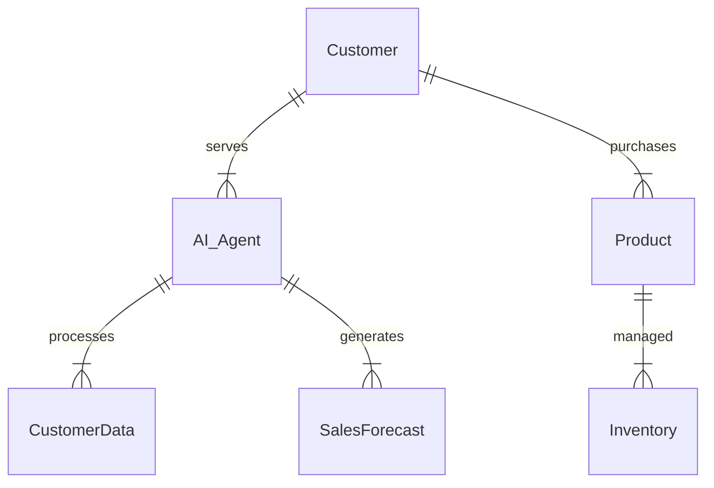

                 

### 1. Title and Part 1: Introduction to the Background

#### 1.1 AI Agents Overview

**What is an AI Agent?**

An AI agent is a software entity designed to interact with its environment and take actions that maximize its expected utility. At its core, an AI agent is capable of perception, decision-making, and action execution. This is often depicted in the context of intelligent tutoring systems, autonomous vehicles, and virtual assistants.

In the realm of e-commerce, AI agents serve as virtual customer service representatives or sales advisors. They utilize machine learning algorithms to analyze customer data and provide personalized recommendations, streamline the shopping experience, and automate customer support processes.

**Characteristics of AI Agents**

1. **Autonomy:** AI agents operate independently without continuous human intervention. They can learn from interactions and adapt their behavior accordingly.
2. **Social Ability:** AI agents are capable of understanding and interacting with humans. They can comprehend natural language, engage in conversations, and offer assistance based on the context.
3. **Repeatability:** AI agents can perform tasks repeatedly with consistent accuracy. This minimizes errors and allows for 24/7 customer service.
4. **Scalability:** AI agents can handle a large number of interactions simultaneously. This scalability is crucial for e-commerce platforms dealing with high volumes of traffic.

**The Role of AI Agents in E-commerce**

In e-commerce, AI agents are primarily used for two main purposes: intelligent customer service and sales forecasting.

- **Intelligent Customer Service:** AI agents can handle customer inquiries, process returns, and provide product recommendations. By automating these tasks, e-commerce companies can improve customer satisfaction and reduce response times.
- **Sales Forecasting:** AI agents analyze customer data to predict future sales trends. This information helps businesses make informed decisions about inventory management, marketing strategies, and pricing.

#### 1.2 Core Concepts of AI Agents

**Key Concepts and Principles**

- **Perception:** The process by which AI agents gather information from their environment. This can include text, images, or audio data.
- **Memory:** AI agents store and retrieve information for future use. This can be as simple as remembering past conversations or as complex as understanding customer preferences over time.
- **Reasoning:** AI agents use logical rules and machine learning algorithms to analyze data and make decisions.
- **Action Execution:** Once a decision is made, AI agents execute the necessary actions, such as sending a response or placing an order.

**Attributes and Comparison of AI Agents**

| Attribute               | Description                                                                                                                                                        | Comparison                                                      |
|-------------------------|--------------------------------------------------------------------------------------------------------------------------------------------------------------|--------------------------------------------------------------|
| **Perception**          | The ability to understand and interpret environmental stimuli.                                                                                                     | Visual agents vs. auditory agents, text-based agents vs. image-based agents |
| **Memory**              | The capacity to store and retrieve information.                                                                                                                     | Short-term memory vs. long-term memory, episodic memory vs. semantic memory |
| **Reasoning**           | The process of using knowledge to solve problems or make decisions.                                                                                                 | Rule-based reasoning vs. statistical reasoning, fuzzy logic vs. crisp logic |
| **Action Execution**    | The implementation of decisions made by the AI agent.                                                                                                               | Reactive agents vs. deliberative agents, planning agents vs. execution agents |

**Entity Relationship Diagram (ERD) for AI Agents**

Below is a simple ERD that illustrates the relationship between key components of an AI agent:

#### 1.3 AI Agents: From Theory to Practice

**Theoretical Framework of AI Agents**

The theoretical framework for AI agents encompasses various subfields of artificial intelligence, including:

- **Machine Learning:** Techniques that allow computers to learn from data and improve performance over time.
- **Natural Language Processing (NLP):** Methods for interpreting and generating human language.
- **Reinforcement Learning:** A type of machine learning where an agent learns by receiving feedback through interactions with an environment.
- **Knowledge Representation:** The process of encoding information in a way that can be used by AI agents.

**Practical Implementation Methods**

Implementing AI agents in e-commerce involves several steps:

1. **Data Collection:** Gathering customer data from various sources, including website interactions, social media, and purchase history.
2. **Data Preprocessing:** Cleaning and formatting the data to be used in machine learning models.
3. **Model Selection:** Choosing appropriate machine learning models based on the problem domain.
4. **Training:** Training the models using historical data.
5. **Evaluation:** Testing the performance of the models on unseen data.
6. **Deployment:** Integrating the AI agents into the e-commerce platform.

**Challenges and Opportunities**

While the potential of AI agents in e-commerce is significant, there are challenges to overcome:

- **Data Privacy:** Ensuring that customer data is collected and used responsibly.
- **Model Interpretability:** Understanding and explaining the decisions made by AI agents.
- **Scalability:** Ensuring that AI agents can handle large volumes of data and interactions efficiently.
- **User Acceptance:** Convincing customers that AI agents can provide value-added services.

**Summary**

In conclusion, AI agents have the potential to revolutionize e-commerce by providing intelligent customer service and accurate sales forecasting. Understanding the core concepts and principles of AI agents is essential for effectively implementing them in practical applications. As the field continues to evolve, addressing the challenges and leveraging the opportunities will be key to maximizing the impact of AI agents in e-commerce.

---

**1.4 Conclusion**

AI agents are transforming the landscape of e-commerce by enhancing customer service and improving sales forecasting capabilities. The integration of AI agents into e-commerce platforms offers numerous benefits, including increased efficiency, scalability, and personalized customer experiences. However, it is crucial to address the challenges associated with data privacy, model interpretability, and user acceptance. By understanding the core concepts and principles of AI agents and leveraging the latest advancements in machine learning and natural language processing, e-commerce companies can harness the full potential of AI agents to drive business growth and customer satisfaction.

**1.5 Summary**

This article has provided an overview of AI agents in the context of e-commerce, highlighting their key concepts, principles, and practical applications. We discussed the role of AI agents in intelligent customer service and sales forecasting, delved into the theoretical framework and practical implementation methods, and explored the challenges and opportunities associated with their deployment. As the field of AI continues to advance, it is essential for e-commerce companies to embrace these technologies to stay competitive and deliver superior customer experiences.

