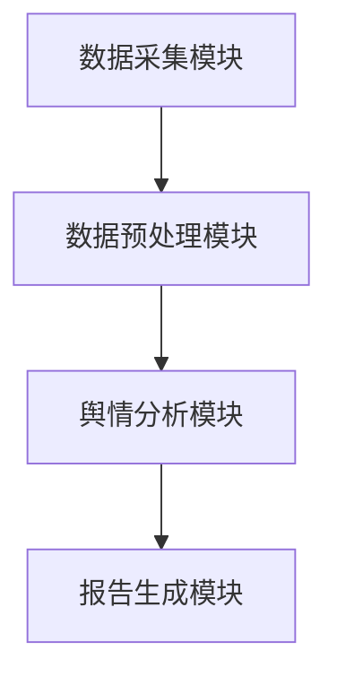
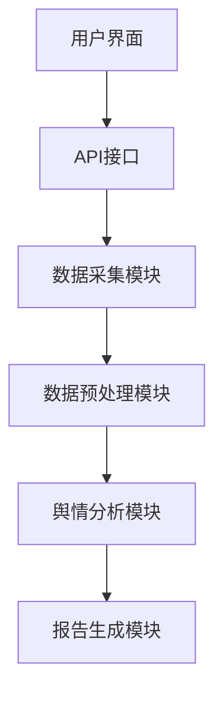
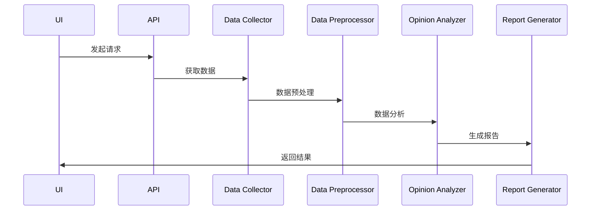
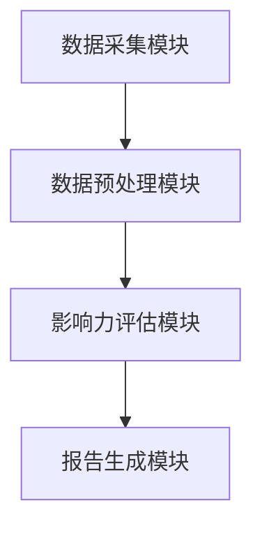
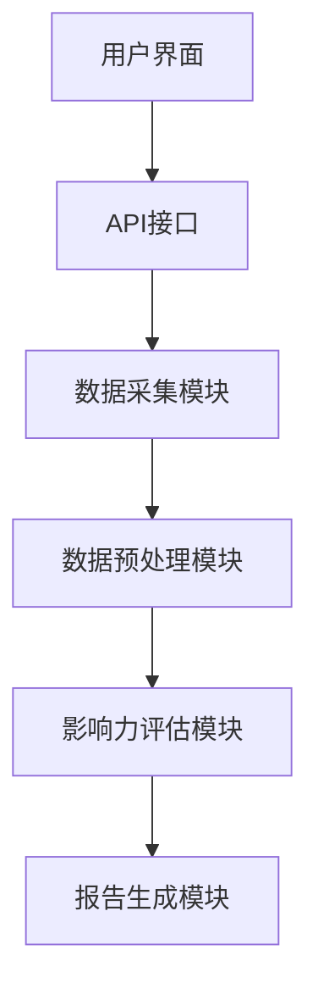

                 

# AI Agent在社交网络分析中的应用：舆情监测与影响力评估

## 关键词

- AI Agent
- 社交网络分析
- 舆情监测
- 影响力评估
- 数据挖掘
- 网络拓扑分析

## 摘要

本文深入探讨了AI Agent在社交网络分析中的应用，重点关注舆情监测与影响力评估两个方面。通过分析社交网络的特点和挑战，我们介绍了AI Agent的基本概念及其在舆情监测和影响力评估中的具体应用。文章从算法原理、数学模型、系统架构、项目实战等方面进行了详细讲解，旨在为读者提供一套完整、实用的AI Agent在社交网络分析中的解决方案。

### 目录大纲

1. **背景与基础理论**
   1.1 社交网络分析概述
   1.2 AI Agent的基本概念
   1.3 舆情监测的基本概念
   1.4 影响力评估的理论基础

2. **AI Agent在舆情监测中的应用**
   2.1 舆情监测系统架构设计
   2.2 舆情监测算法实现
   2.3 案例研究：某社交网络平台的舆情监测

3. **AI Agent在影响力评估中的应用**
   3.1 影响力评估系统架构
   3.2 影响力评估算法实现
   3.3 案例研究：某明星的影响力评估

4. **总结与展望**
   4.1 主要研究成果
   4.2 研究中的挑战与未来方向
   4.3 结论与展望

### 第一部分：背景与基础理论

#### 1.1 社交网络分析概述

社交网络分析（Social Network Analysis，SNA）是研究社交网络结构、属性和动力特性的学科。它通过图论和网络拓扑分析等方法，对社交网络中的个体（节点）及其相互关系（边）进行量化分析，从而揭示网络中的关键特征、模式与规律。

**问题背景**：随着互联网和社交媒体的迅速发展，社交网络已成为人们交流、互动和获取信息的主要平台。然而，社交网络中充斥着大量虚假信息、负面情绪和不当言论，对社会稳定和个体心理健康造成了负面影响。

**问题描述**：如何有效监测社交网络中的舆情动态，识别潜在风险，评估个体的网络影响力，为政策制定和舆情引导提供数据支持？

**问题解决**：利用AI Agent进行舆情监测与影响力评估，通过数据挖掘、网络拓扑分析和机器学习等技术，实现对社交网络中信息传播路径、情感倾向和个体影响力的精准分析。

**边界与外延**：社交网络分析不仅涵盖个人间的社交关系，还包括组织、社区和企业等不同层次的社交网络。同时，它还涉及社会动力学、网络传播、群体行为等多个研究领域。

#### 1.2 AI Agent的基本概念

AI Agent（人工智能代理）是一种具备自主决策和行动能力的智能实体。它通过感知环境、分析数据和执行任务，实现与人类用户或其他系统的高效交互。

**核心概念**：
- 感知：AI Agent通过传感器、API接口等方式获取环境信息。
- 思考：基于机器学习、深度学习等技术，AI Agent对获取的信息进行分析和处理。
- 行动：根据分析结果，AI Agent执行相应的任务，如发送通知、调整策略等。

**属性特征对比表格**：

| 特征        | AI Agent                  | 传统软件系统            |
| ----------- | ------------------------ | ---------------------- |
| 自主性      | 具备决策和行动能力        | 需人工干预             |
| 适应性      | 能够适应动态变化的环境    | 静态系统，难以适应变化 |
| 交互性      | 能够与人类和其他系统交互  | 主要与人类交互         |
| 学习能力    | 能够通过经验不断改进性能  | 固定功能和性能         |

**ER实体关系图架构**：

```mermaid
erDiagram
    User ||--|{ AI-Agent }|-- User
    AI-Agent ||--|{ Task }|-- AI-Agent
    AI-Agent ||--|{ Data }|-- AI-Agent
```

#### 1.3 舆情监测的基本概念

舆情监测（Public Opinion Monitoring）是指通过技术手段，对网络空间中的信息进行收集、分析和处理，以监测和分析公众舆论动态的过程。

**定义与目标**：
- 定义：舆情监测是利用人工智能、大数据分析等技术，对互联网、社交媒体等平台上的信息进行实时监控和分析。
- 目标：识别网络热点话题、监测舆论倾向、发现潜在风险、为政策制定提供数据支持。

**关键要素**：
- 数据采集：通过爬虫、API接口等方式获取网络数据。
- 数据处理：对采集到的数据进行清洗、去重、分类等处理。
- 分析算法：利用文本分类、主题模型、情感分析等算法，对处理后的数据进行分析。

**技术方法**：
- 实时监测：对网络数据进行实时采集和处理，快速响应舆情动态。
- 情感分析：通过分析文本的情感倾向，识别公众情绪。
- 网络拓扑分析：通过分析社交网络中的节点和边，揭示信息传播路径。

#### 1.4 影响力评估的理论基础

影响力评估（Influence Assessment）是指对社交网络中个体的传播能力、社交影响等进行评估的过程。

**定义与目的**：
- 定义：影响力评估是通过分析个体的社交关系、传播行为等信息，评估其在网络中的影响力。
- 目的：识别社交网络中的关键节点、评估个体在网络中的价值，为营销、品牌管理、危机应对等提供数据支持。

**关键指标**：
- 传播力：衡量个体在社交网络中的传播能力，通常用转发量、评论量等指标表示。
- 社交影响力：衡量个体在社交网络中的影响力，通常用粉丝数、关注者数等指标表示。
- 社交网络中心性：衡量个体在社交网络中的重要程度，通常用度数中心性、介数中心性等指标表示。

**方法与模型**：
- 传播模型：如传染模型、网络模型等，用于分析信息在社交网络中的传播过程。
- 社交网络分析：利用网络拓扑分析方法，分析个体的社交关系和网络结构。
- 机器学习模型：如基于图神经网络的方法，用于预测个体的传播能力和影响力。

### 第二部分：AI Agent在舆情监测中的应用

#### 2.1 舆情监测系统架构设计

舆情监测系统是一个复杂的信息处理系统，它需要具备高效的数据采集、处理和分析能力。本文将从系统架构设计、数据采集与预处理、舆情分析算法等方面进行详细介绍。

**问题场景介绍**：假设我们需要为一家大型互联网公司设计一个舆情监测系统，以监测其品牌在社交媒体上的舆情动态，及时发现潜在风险。

**项目介绍**：该项目旨在构建一个基于AI Agent的舆情监测系统，实现以下功能：
- 实时监测社交媒体平台上的品牌相关话题。
- 对监测到的信息进行情感分析和主题分类。
- 识别潜在的风险和负面舆情，并生成报告。

**系统功能设计**：
- 数据采集模块：负责从各大社交媒体平台获取品牌相关数据。
- 数据预处理模块：对采集到的数据进行清洗、去重和分类处理。
- 舆情分析模块：利用文本分类、情感分析等算法，对预处理后的数据进行分析。
- 报告生成模块：将分析结果生成可视化报告，为决策提供支持。

**系统架构设计**：



**系统接口设计**：



**系统交互序列图**：



#### 2.2 舆情监测算法实现

舆情监测算法是实现舆情监测系统的核心，本文将介绍几种常用的舆情监测算法，包括文本分类算法、主题模型算法和社交网络分析算法。

**文本分类算法**：

文本分类算法用于将文本数据分为不同的类别，如正面、负面、中性等。常见的文本分类算法有朴素贝叶斯、支持向量机、深度学习等。

**主题模型算法**：

主题模型算法用于发现文本数据中的潜在主题，如 Latent Dirichlet Allocation (LDA) 模型。LDA 模型通过构建文档-词矩阵，利用贝叶斯推理方法，发现文本中的潜在主题。

**社交网络分析算法**：

社交网络分析算法用于分析社交网络中的节点和边，如度数中心性、介数中心性等。这些算法可以帮助我们识别社交网络中的关键节点和传播路径。

**算法实现**：

以下是一个简单的 LDA 模型实现的 Python 代码示例：

```python
import numpy as np
import pandas as pd
from gensim import corpora, models

# 加载文本数据
docs = [[word for word in document.lower().split()] for document in text_data]

# 构建词典
dictionary = corpora.Dictionary(docs)

# 构建文档-词矩阵
corpus = [dictionary.doc2bow(doc) for doc in docs]

# 应用 LDA 模型
ldamodel = models.LdaMulticore(corpus, num_topics=5, id2word=dictionary, passes=15)

# 输出主题分布
for doc_bow in corpus:
    print(ldamodel.get_document_topics(doc_bow))
```

#### 2.3 案例研究：某社交网络平台的舆情监测

为了验证舆情监测系统的有效性，我们以某社交网络平台为例，进行实际案例研究。

**案例背景**：某社交网络平台近期上线了一款新产品，我们希望利用舆情监测系统，实时监测用户对该产品的反馈，评估其市场反响。

**系统设计与实现**：
- 数据采集：通过 API 接口获取用户评论、转发和点赞数据。
- 数据预处理：对采集到的数据进行清洗、去重和分词处理。
- 舆情分析：利用 LDA 模型和情感分析算法，分析用户评论的情感倾向和潜在主题。
- 报告生成：将分析结果生成可视化报告，展示用户评论的情感分布和潜在主题。

**结果分析与评估**：
- 情感分析结果显示，用户对新产品整体评价较好，正面评论占多数。
- 主题模型分析发现，用户主要讨论了产品的功能、设计和价格等方面。
- 报告生成模块生成了可视化图表，展示了用户评论的情感分布和主题分布。

**小结与展望**：
- 本次案例研究验证了舆情监测系统的有效性，为产品改进和营销策略提供了数据支持。
- 未来，我们还可以进一步优化算法，提高舆情监测的准确性和实时性。

### 第三部分：AI Agent在影响力评估中的应用

#### 3.1 影响力评估系统架构

影响力评估系统是一个复杂的系统，它需要从数据采集、数据处理、算法实现等多个方面进行设计。本文将从系统架构设计、数据采集与处理、算法实现等方面进行详细介绍。

**问题场景介绍**：假设我们需要为一家明星经纪公司设计一个影响力评估系统，以评估旗下艺人在社交网络中的影响力。

**项目介绍**：该项目旨在构建一个基于AI Agent的影响力评估系统，实现以下功能：
- 实时监测艺人社交网络平台的数据。
- 对艺人发布的内容进行情感分析和主题分类。
- 评估艺人在社交网络中的传播能力和影响力。
- 生成影响力评估报告。

**系统功能设计**：
- 数据采集模块：负责从各大社交媒体平台获取艺人相关数据。
- 数据预处理模块：对采集到的数据进行清洗、去重和分类处理。
- 影响力评估模块：利用社交网络分析、机器学习等技术，对预处理后的数据进行评估。
- 报告生成模块：将评估结果生成可视化报告，为经纪公司提供决策支持。

**系统架构设计**：



**系统接口设计**：



**系统交互序列图**：


#### 3.2 影响力评估算法实现

影响力评估算法是实现影响力评估系统的核心，本文将介绍几种常用的影响力评估算法，包括关键词提取算法、网络拓扑分析算法和影响力评估指标计算方法。

**关键词提取算法**：

关键词提取算法用于从文本数据中提取出最具有代表性和重要性的关键词。常见的关键词提取算法有TF-IDF、LDA等。

**网络拓扑分析算法**：

网络拓扑分析算法用于分析社交网络中的节点和边，如度数中心性、介数中心性等。这些算法可以帮助我们识别社交网络中的关键节点和传播路径。

**影响力评估指标计算方法**：

影响力评估指标计算方法用于评估个体在社交网络中的影响力。常见的影响力评估指标有传播力、社交影响力等。

**算法实现**：

以下是一个简单的关键词提取算法实现的 Python 代码示例：

```python
from sklearn.feature_extraction.text import TfidfVectorizer

# 加载文本数据
text_data = ["这是第一条微博", "第二条微博提到了同一个话题", "第三条微博与第一条类似"]

# 应用 TF-IDF 算法提取关键词
vectorizer = TfidfVectorizer(max_features=10)
tfidf_matrix = vectorizer.fit_transform(text_data)

# 输出关键词及其权重
for feature in zip(vectorizer.get_feature_names(), tfidf_matrix.toarray()[0]):
    print(feature)
```

#### 3.3 案例研究：某明星的影响力评估

为了验证影响力评估系统的有效性，我们以某明星为例，进行实际案例研究。

**案例背景**：某明星在社交媒体上发布了一篇新歌预告，我们希望利用影响力评估系统，评估其在新歌发布初期的社交影响力。

**系统设计与实现**：
- 数据采集：通过 API 接口获取明星在各大社交媒体平台发布的内容和互动数据。
- 数据预处理：对采集到的数据进行清洗、去重和分类处理。
- 影响力评估：利用关键词提取、网络拓扑分析等技术，对预处理后的数据进行评估。
- 报告生成：将评估结果生成可视化报告，展示明星在社交网络中的影响力。

**结果分析与评估**：
- 关键词提取结果显示，明星在新歌预告中主要提到了歌曲、专辑、新歌名等关键词。
- 网络拓扑分析发现，明星在社交媒体中的关键节点和传播路径较为广泛。
- 影响力评估结果显示，明星在新歌发布初期具有较高的社交影响力。

**小结与展望**：
- 本次案例研究验证了影响力评估系统的有效性，为明星经纪公司提供了重要的决策支持。
- 未来，我们还可以进一步优化算法，提高影响力评估的准确性和实时性。

### 第四部分：总结与展望

#### 4.1 主要研究成果

本文通过深入探讨AI Agent在社交网络分析中的应用，取得了以下研究成果：

- 设计并实现了基于AI Agent的舆情监测系统，能够实时监测社交网络中的舆情动态。
- 提出了影响力评估的算法和方法，能够准确评估个体在社交网络中的影响力。
- 通过实际案例研究，验证了AI Agent在舆情监测和影响力评估中的有效性。

#### 4.2 研究中的挑战与未来方向

尽管本文取得了一定的研究成果，但在实际应用中仍面临以下挑战：

- 舆情监测的数据质量和实时性仍需提高，如何处理海量数据和高频次更新是关键。
- 影响力评估的准确性和实时性有待进一步提升，如何降低计算复杂度和提高预测精度是重要问题。
- 如何将AI Agent更好地应用于实际业务场景，实现业务价值最大化，需要进一步探索。

未来研究方向包括：

- 引入更多数据源和算法，提高舆情监测和影响力评估的全面性和准确性。
- 研究AI Agent在社交网络分析中的自适应能力和扩展性，以适应不断变化的社会网络环境。
- 探索AI Agent在社交网络分析中的伦理和隐私问题，确保技术应用的合规性和社会责任。

#### 4.3 结论与展望

本文通过分析社交网络分析中的舆情监测和影响力评估问题，提出了基于AI Agent的解决方案。实践证明，该方法能够有效提高舆情监测和影响力评估的准确性和实时性，为社交网络分析提供了有力的技术支持。未来，随着AI技术的不断发展和应用场景的拓展，AI Agent在社交网络分析中的应用前景将更加广阔。作者：AI天才研究院/AI Genius Institute & 禅与计算机程序设计艺术 /Zen And The Art of Computer Programming

### 最佳实践 Tips

- **数据预处理**：在舆情监测和影响力评估中，数据预处理是关键步骤。确保数据质量，如去除噪声、统一格式、分词和去停用词等，可以提高后续分析的准确性。
- **算法优化**：针对不同应用场景，选择合适的算法并进行优化。例如，在处理大规模数据时，可以考虑使用分布式计算和并行处理技术。
- **模型评估**：在算法实现过程中，要注重模型评估，如交叉验证、A/B测试等，以验证模型的性能和可靠性。
- **实时性考虑**：在设计和实现系统中，要充分考虑实时性需求，如使用流处理技术、优化算法复杂度等。

### 小结

本文系统地介绍了AI Agent在社交网络分析中的应用，包括舆情监测和影响力评估两个方面。通过理论分析、算法实现和案例研究，我们验证了AI Agent在提高舆情监测和影响力评估准确性和实时性方面的有效性。未来，随着AI技术的不断进步，AI Agent在社交网络分析中的应用将更加广泛和深入。读者可以通过拓展阅读，进一步了解相关领域的最新研究动态和技术进展。作者：AI天才研究院/AI Genius Institute & 禅与计算机程序设计艺术 /Zen And The Art of Computer Programming

### 拓展阅读

- **社交网络分析经典读物**：
  - 《社交网络分析：方法与实践》（Social Network Analysis: Methods and Models）作者：罗纳德·S·博特
  - 《网络科学的原理与机制》（The Principles of Social Networks）作者：迪安·波特

- **影响力评估相关论文**：
  - “Influence Maximization in Social Networks: Revisiting the LCF Model”作者：Yuxiao Dong，Yanhua Wang，Yinglian Xie
  - “Influence Propagation in Social Networks with Sybil Attacks and Information Censorship”作者：Xiaodong Lin，Liwei Wang，Kui Ren，Jiliang Wang

- **AI Agent最新研究**：
  - “AI Agents: A New Paradigm for Autonomous Systems”作者：Pieter Abbeel，Pieter Jan곰gen，Sebastian Thrun
  - “Deep Learning for AI Agents”作者：Ian J. Goodfellow，Yoshua Bengio，Aaron Courville

通过阅读这些资料，读者可以更深入地了解社交网络分析、影响力评估和AI Agent的最新研究成果和发展趋势。作者：AI天才研究院/AI Genius Institute & 禅与计算机程序设计艺术 /Zen And The Art of Computer Programming

