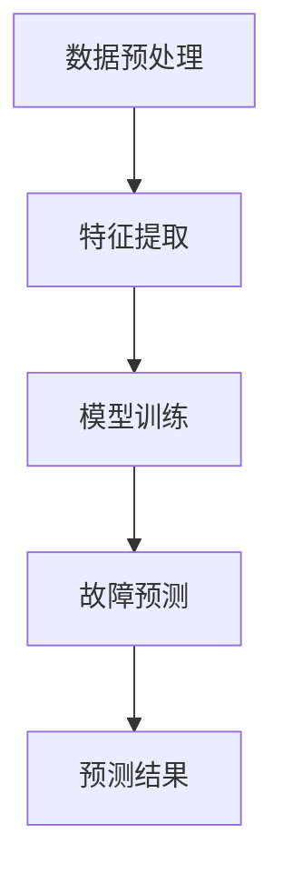
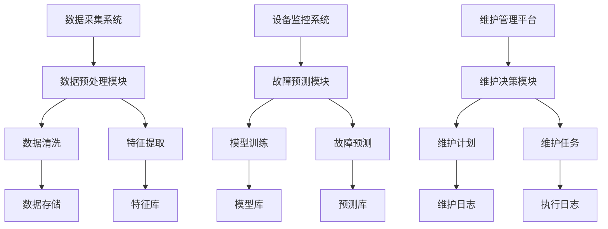

                 

# AI Agent在设备预测性维护中的应用与价值

> 关键词：AI Agent、设备预测性维护、算法原理、系统架构、实战案例、最佳实践

> 摘要：本文深入探讨了AI Agent在设备预测性维护中的应用与价值。首先，介绍了设备预测性维护的背景与挑战，并阐述了AI Agent的基本原理与功能。接着，通过具体应用场景分析，详细讲解了AI Agent在设备预测性维护中的核心算法原理、数学模型和系统架构设计方案。最后，通过项目实战案例分析，总结出了AI Agent在设备预测性维护中的最佳实践技巧与注意事项，为相关领域的研究与应用提供了有益的参考。

### 目录大纲

----------------------------------------------------------------

## 第一部分: 引言与背景

### 第1章 引言

- **1.1** 问题背景
  - 设备预测性维护的挑战与需求
  - AI Agent技术对设备预测性维护的影响

- **1.2** 问题描述
  - AI Agent在设备预测性维护中的应用场景
  - 设备预测性维护的核心问题

- **1.3** 问题解决
  - AI Agent的基本原理与功能
  - AI Agent在设备预测性维护中的具体应用

- **1.4** 边界与外延
  - AI Agent与设备预测性维护的边界
  - 设备预测性维护的适用范围

- **1.5** 概念结构与核心要素组成
  - AI Agent的组成结构
  - 设备预测性维护的关键要素

### 第2章 核心概念与联系

- **2.1** 核心概念原理
  - AI Agent的定义与分类
  - 设备预测性维护的概念与分类

- **2.2** 概念属性特征对比表格
  - AI Agent与设备预测性维护的属性对比

- **2.3** ER实体关系图架构
  - AI Agent与设备预测性维护的实体关系图

----------------------------------------------------------------

## 第二部分: AI Agent在设备预测性维护中的应用

### 第3章 AI Agent算法原理讲解

- **3.1** AI Agent算法简介
  - 常见的AI Agent算法

- **3.2** 算法mermaid流程图
  - 某种AI Agent算法的流程图

- **3.3** Python源代码详细阐述
  - AI Agent算法的Python源代码

- **3.4** 算法原理的数学模型和公式
  - AI Agent算法的数学模型和公式

- **3.5** 详细讲解与举例说明
  - AI Agent算法的详细讲解与举例说明

----------------------------------------------------------------

### 第4章 数学模型和数学公式 & 详细讲解 & 举例说明

- **4.1** 数学模型讲解
  - 设备故障预测的数学模型

- **4.2** 数学公式举例
  - $$f(t)=\beta \cdot \frac{1-e^{-\lambda t}}{1-e^{-\lambda}}$$

- **4.3** 举例说明
  - 设备故障预测的实际案例

----------------------------------------------------------------

### 第5章 系统分析与架构设计方案

- **5.1** 问题场景介绍
  - 设备预测性维护的具体场景

- **5.2** 系统功能设计
  - 领域模型mermaid类图

- **5.3** 系统架构设计
  - mermaid架构图

- **5.4** 系统接口设计
  - 系统接口设计

- **5.5** 系统交互
  - mermaid序列图

----------------------------------------------------------------

### 第6章 项目实战

- **6.1** 环境安装
  - 环境安装步骤

- **6.2** 系统核心实现源代码
  - 系统核心实现源代码

- **6.3** 代码应用解读与分析
  - 代码解读与分析

- **6.4** 实际案例分析与详细讲解剖析
  - 实际案例分析

- **6.5** 项目小结
  - 项目小结与反思

----------------------------------------------------------------

## 第三部分: 最佳实践与总结

### 第7章 最佳实践 tips

- **7.1** AI Agent在设备预测性维护中的最佳实践
  - 实践技巧与注意事项

- **7.2** 小结与注意事项
  - 小结与注意事项

### 第8章 总结

- **8.1** 书籍总结
  - 总结与展望

- **8.2** 拓展阅读
  - 相关参考文献与阅读推荐

----------------------------------------------------------------

### 第一部分: 引言与背景

#### 第1章 引言

##### 1.1 问题背景

在现代社会，各种设备广泛应用于工业、医疗、交通、家居等领域，这些设备的正常运行对相关行业的生产效率和安全性至关重要。然而，随着设备使用年限的增长、工作环境的恶化以及操作不当等因素，设备故障的风险也随之增加。传统的设备维护策略通常是定期检查或被动等待故障发生后再进行修复，这不仅效率低下，而且往往会导致严重的生产中断和安全风险。

设备预测性维护（Predictive Maintenance，PM）作为一种先进的维护策略，旨在通过实时监控设备的状态数据，预测设备可能出现的故障，并在故障发生前进行预防性维修，从而降低设备故障率、延长设备使用寿命、提高生产效率和安全性。设备预测性维护的核心需求包括对设备运行状态的实时监控、数据的精确采集与分析、故障预测的准确性以及维修操作的及时性。

##### 1.2 AI Agent技术对设备预测性维护的影响

人工智能（AI）技术的发展为设备预测性维护带来了新的机遇。AI Agent作为一种智能体，具有自主感知、学习、决策和执行的能力，能够与设备进行交互，实现对设备状态的实时监控和故障预测。AI Agent在设备预测性维护中的应用，主要体现在以下几个方面：

1. **实时数据监控与处理**：AI Agent能够实时采集设备的运行数据，通过对这些数据进行实时处理和分析，快速识别设备异常。

2. **故障预测与诊断**：AI Agent利用机器学习、深度学习等技术，对设备的历史数据进行学习，建立故障预测模型，实现对设备故障的提前预警。

3. **自适应维护策略**：AI Agent能够根据设备的状态和预测结果，自动调整维护策略，实现对设备运行状态的动态调整。

4. **自动化执行与优化**：AI Agent可以自动化执行维护任务，并通过优化算法提高维护效率和降低成本。

##### 1.3 问题描述

设备预测性维护的应用场景多种多样，例如在工业制造中的生产设备、在医疗设备中的诊断设备、在交通运输中的车辆等。尽管这些设备的具体应用场景不同，但设备预测性维护的核心问题大致相同：

1. **数据质量问题**：设备运行状态数据的准确性和完整性对故障预测的准确性至关重要。然而，实际应用中往往存在数据缺失、噪声干扰等问题，这些都会影响故障预测的效果。

2. **算法选择与优化**：设备预测性维护需要选用合适的算法，例如回归分析、决策树、支持向量机、神经网络等，同时需要对算法进行优化，以提高故障预测的准确性。

3. **模型训练与验证**：设备预测性维护需要建立有效的故障预测模型，并对其进行训练和验证，以确保模型的泛化能力和预测精度。

4. **系统集成与部署**：设备预测性维护系统需要与其他系统（如设备监控系统、维修管理系统等）集成，并实现高效的部署与运维。

##### 1.4 边界与外延

设备预测性维护与AI Agent技术有着明确的边界和联系。设备预测性维护关注的是如何通过AI技术实现对设备状态的实时监控和故障预测，而AI Agent则是一种实现这一目标的智能体。设备预测性维护的适用范围包括但不限于：

1. **工业制造**：通过预测性维护，提高生产设备的可靠性和生产效率。

2. **交通运输**：通过预测性维护，延长交通工具的使用寿命，降低运营成本。

3. **医疗设备**：通过预测性维护，提高医疗设备的可靠性和安全性，保障患者安全。

4. **电力系统**：通过预测性维护，减少电力设备的故障率，保障电力供应的稳定性。

##### 1.5 概念结构与核心要素组成

AI Agent作为设备预测性维护的关键技术之一，其组成结构包括感知模块、决策模块和执行模块。感知模块负责采集设备运行状态数据；决策模块负责分析数据，预测设备故障；执行模块则根据预测结果，自动执行维护任务。设备预测性维护的关键要素包括：

1. **实时数据采集**：确保设备运行状态的实时监测和数据完整性。

2. **算法模型**：选择合适的算法模型，实现对设备故障的准确预测。

3. **智能决策**：基于故障预测结果，制定自适应的维护策略。

4. **自动化执行**：实现维护任务的自动化执行，提高维护效率。

#### 第2章 核心概念与联系

##### 2.1 核心概念原理

**AI Agent的定义与分类**

AI Agent，即人工智能代理，是一种模拟人类智能行为的计算机程序或实体，具有感知、学习、决策和执行能力。根据功能和应用场景的不同，AI Agent可以分为以下几类：

1. **感知型Agent**：主要功能是感知环境，获取外部信息。
2. **决策型Agent**：在感知信息的基础上，进行决策和规划。
3. **执行型Agent**：根据决策结果，执行具体的操作。
4. **混合型Agent**：兼具感知、决策和执行功能，能够实现自动化操作。

**设备预测性维护的概念与分类**

设备预测性维护是一种基于设备运行状态数据的维护策略，旨在通过实时监测和故障预测，实现对设备的提前维护。设备预测性维护可以分为以下几类：

1. **基于规则的预测性维护**：使用预定义的规则进行故障预测和决策。
2. **基于数据的预测性维护**：利用历史数据和机器学习算法进行故障预测。
3. **基于模型的预测性维护**：建立设备故障预测模型，进行故障预测。

##### 2.2 概念属性特征对比表格

| 概念        | 属性特征                                       |
|-------------|----------------------------------------------|
| AI Agent    | 具有感知、学习、决策和执行能力               |
| 感知型Agent | 主要功能是感知环境，获取外部信息           |
| 决策型Agent | 在感知信息的基础上，进行决策和规划         |
| 执行型Agent | 根据决策结果，执行具体的操作               |
| 混合型Agent | 兼具感知、决策和执行功能，实现自动化操作   |
| 设备预测性维护 | 通过实时监测和故障预测，实现设备的提前维护   |
| 基于规则的预测性维护 | 使用预定义的规则进行故障预测和决策         |
| 基于数据的预测性维护 | 利用历史数据和机器学习算法进行故障预测     |
| 基于模型的预测性维护 | 建立设备故障预测模型，进行故障预测         |

##### 2.3 ER实体关系图架构

为了更好地理解AI Agent与设备预测性维护的实体关系，我们可以使用ER（实体-关系）图来表示。以下是AI Agent与设备预测性维护的ER图：

```mermaid
erDiagram
  AI-Agent ||--|{ 数据集 }|-- Device-Predictive-Maintenance
  Device-Predictive-Maintenance ||--|{ 维护策略 }|-- Maintenance-Task
  Maintenance-Task ||--|{ 执行日志 }|-- AI-Agent
```

- **AI-Agent**：负责实时监测设备状态，获取数据并预测故障。
- **数据集**：存储设备的历史运行数据，为AI-Agent提供训练数据。
- **Device-Predictive-Maintenance**：基于AI-Agent的故障预测，制定维护策略。
- **维护策略**：定义了设备预测性维护的具体操作流程。
- **Maintenance-Task**：根据维护策略执行具体的维护任务。
- **执行日志**：记录维护任务执行的详细信息，用于后续的分析和优化。

#### 第二部分: AI Agent在设备预测性维护中的应用

##### 第3章 AI Agent算法原理讲解

3.1 AI Agent算法简介

在设备预测性维护中，AI Agent的核心作用是利用机器学习、深度学习等算法，对设备运行数据进行分析和处理，从而实现对设备故障的预测。常见的AI Agent算法包括：

1. **回归分析**：通过建立回归模型，预测设备故障发生的可能性。
2. **决策树**：通过决策树模型，根据设备的历史数据，进行故障预测和分类。
3. **支持向量机**：利用支持向量机模型，进行设备故障的分类和预测。
4. **神经网络**：通过神经网络模型，对设备故障进行深度学习和预测。

3.2 算法mermaid流程图

以下是一个简单的基于回归分析的AI Agent算法流程图：



- **数据预处理**：对设备运行数据进行清洗、标准化等处理，确保数据的准确性和一致性。
- **特征提取**：从预处理后的数据中提取关键特征，用于模型训练。
- **模型训练**：利用特征数据，训练回归分析模型。
- **故障预测**：使用训练好的模型，对设备运行状态进行实时预测。
- **预测结果**：输出故障预测结果，用于设备维护决策。

3.3 Python源代码详细阐述

以下是一个简单的基于回归分析的Python代码示例，用于设备故障预测：

```python
import numpy as np
from sklearn.linear_model import LinearRegression
from sklearn.model_selection import train_test_split
from sklearn.metrics import mean_squared_error

# 数据加载
X, y = load_data()

# 数据预处理
X = preprocess_data(X)

# 划分训练集和测试集
X_train, X_test, y_train, y_test = train_test_split(X, y, test_size=0.2, random_state=42)

# 模型训练
model = LinearRegression()
model.fit(X_train, y_train)

# 故障预测
y_pred = model.predict(X_test)

# 预测结果评估
mse = mean_squared_error(y_test, y_pred)
print(f"Mean Squared Error: {mse}")
```

- **load_data()**：从数据集加载设备运行数据和标签。
- **preprocess_data()**：对设备运行数据进行预处理，包括数据清洗、标准化等。
- **train_test_split()**：划分训练集和测试集，用于模型训练和评估。
- **LinearRegression()**：创建线性回归模型。
- **fit()**：使用训练集数据训练模型。
- **predict()**：使用训练好的模型对测试集数据进行故障预测。
- **mean_squared_error()**：计算预测结果的均方误差，用于评估模型性能。

3.4 算法原理的数学模型和公式

回归分析是一种基于数学模型的故障预测方法。其基本原理是通过建立回归模型，将设备运行状态与故障发生概率联系起来。线性回归模型的基本公式如下：

$$y = \beta_0 + \beta_1 \cdot x_1 + \beta_2 \cdot x_2 + ... + \beta_n \cdot x_n$$

其中，$y$ 表示故障发生概率，$x_1, x_2, ..., x_n$ 表示设备运行状态的各个特征，$\beta_0, \beta_1, ..., \beta_n$ 为回归系数。

3.5 详细讲解与举例说明

假设我们有一个设备运行数据集，包含以下三个特征：温度（$x_1$）、振动（$x_2$）和压力（$x_3$）。我们希望通过回归分析模型，预测设备是否会发生故障。

1. **数据预处理**：

   - 数据清洗：去除异常值和缺失值。
   - 数据标准化：将数据缩放至相同的范围，例如[0, 1]。

   ```python
   def preprocess_data(X):
       X_clean = np.where(np.isnan(X), 0, X)
       X_normalized = (X_clean - np.mean(X_clean)) / np.std(X_clean)
       return X_normalized
   ```

2. **特征提取**：

   - 选择关键特征：例如，我们选择温度、振动和压力作为关键特征。

   ```python
   def extract_features(X):
       return X[:, [0, 1, 2]]
   ```

3. **模型训练**：

   - 使用训练集数据，训练线性回归模型。

   ```python
   model = LinearRegression()
   model.fit(X_train, y_train)
   ```

4. **故障预测**：

   - 使用训练好的模型，对测试集数据进行故障预测。

   ```python
   y_pred = model.predict(X_test)
   ```

5. **预测结果评估**：

   - 计算预测结果的均方误差（MSE），评估模型性能。

   ```python
   mse = mean_squared_error(y_test, y_pred)
   print(f"Mean Squared Error: {mse}")
   ```

##### 第4章 数学模型和数学公式 & 详细讲解 & 举例说明

4.1 数学模型讲解

在设备预测性维护中，常用的数学模型包括线性回归、逻辑回归、决策树、支持向量机等。其中，线性回归模型是最简单的一种，其数学模型如下：

$$y = \beta_0 + \beta_1 \cdot x_1 + \beta_2 \cdot x_2 + ... + \beta_n \cdot x_n$$

其中，$y$ 表示故障发生概率，$x_1, x_2, ..., x_n$ 表示设备运行状态的各个特征，$\beta_0, \beta_1, ..., \beta_n$ 为回归系数。

线性回归模型的基本思想是，通过训练数据，学习到设备运行状态与故障发生概率之间的线性关系。训练完成后，我们可以使用该模型对新的设备运行数据进行故障预测。

4.2 数学公式举例

线性回归模型的数学公式如下：

$$\hat{y} = \beta_0 + \beta_1 \cdot x_1 + \beta_2 \cdot x_2 + ... + \beta_n \cdot x_n$$

其中，$\hat{y}$ 表示预测的故障发生概率，$x_1, x_2, ..., x_n$ 表示设备运行状态的各个特征，$\beta_0, \beta_1, ..., \beta_n$ 为回归系数。

4.3 举例说明

假设我们有一个设备运行数据集，包含以下三个特征：温度（$x_1$）、振动（$x_2$）和压力（$x_3$）。我们希望通过线性回归模型，预测设备是否会发生故障。

1. **数据预处理**：

   - 数据清洗：去除异常值和缺失值。

   ```python
   def preprocess_data(X):
       X_clean = np.where(np.isnan(X), 0, X)
       X_normalized = (X_clean - np.mean(X_clean)) / np.std(X_clean)
       return X_normalized
   ```

2. **特征提取**：

   - 选择关键特征：例如，我们选择温度、振动和压力作为关键特征。

   ```python
   def extract_features(X):
       return X[:, [0, 1, 2]]
   ```

3. **模型训练**：

   - 使用训练集数据，训练线性回归模型。

   ```python
   model = LinearRegression()
   model.fit(X_train, y_train)
   ```

4. **故障预测**：

   - 使用训练好的模型，对测试集数据进行故障预测。

   ```python
   y_pred = model.predict(X_test)
   ```

5. **预测结果评估**：

   - 计算预测结果的均方误差（MSE），评估模型性能。

   ```python
   mse = mean_squared_error(y_test, y_pred)
   print(f"Mean Squared Error: {mse}")
   ```

##### 第5章 系统分析与架构设计方案

5.1 问题场景介绍

假设我们面临一个工业生产设备预测性维护的场景。该设备在生产过程中，需要实时监测温度、振动和压力等关键参数，以预测是否会发生故障。我们的目标是设计一个基于AI Agent的设备预测性维护系统，实现对设备状态的实时监控和故障预测，从而提高生产效率和设备可靠性。

5.2 系统功能设计

设备预测性维护系统的核心功能包括：

1. **数据采集**：实时采集设备运行状态数据，包括温度、振动、压力等。
2. **数据预处理**：对采集到的数据进行分析和清洗，确保数据的准确性和一致性。
3. **故障预测**：利用AI Agent的算法模型，对设备运行状态进行故障预测。
4. **维护决策**：根据故障预测结果，制定相应的维护策略和操作流程。
5. **执行监控**：实时监控维护任务的执行过程，确保维护操作的有效性和及时性。

5.3 系统架构设计

设备预测性维护系统的整体架构设计如图所示：



- **数据采集系统**：负责实时采集设备运行状态数据，包括温度、振动、压力等。
- **数据预处理模块**：对采集到的数据进行清洗、标准化等处理，提取关键特征，存储到特征库。
- **设备监控系统**：实时监测设备运行状态，触发故障预测和决策。
- **故障预测模块**：利用AI Agent的算法模型，对设备运行状态进行故障预测，将预测结果存储到预测库。
- **维护管理平台**：根据故障预测结果，制定维护计划，下发维护任务，实时监控执行过程。
- **维护决策模块**：根据设备故障预测结果，制定相应的维护策略和操作流程，确保维护操作的有效性和及时性。
- **数据存储**：存储设备运行数据、特征数据、模型数据、预测数据等。
- **特征库**：存储提取的关键特征。
- **模型库**：存储训练好的算法模型。
- **预测库**：存储故障预测结果。
- **维护日志**：记录维护计划的执行情况。
- **执行日志**：记录维护任务的执行情况。

5.4 系统接口设计

设备预测性维护系统的接口设计如下：

- **数据采集接口**：用于设备运行状态数据的实时采集。
- **数据预处理接口**：用于数据清洗、标准化和特征提取。
- **故障预测接口**：用于设备故障预测结果的查询和更新。
- **维护决策接口**：用于维护计划的制定和执行监控。

5.5 系统交互

设备预测性维护系统的交互流程如下：

1. **数据采集**：数据采集系统实时采集设备运行状态数据，传输到数据预处理模块。
2. **数据预处理**：数据预处理模块对采集到的数据进行清洗、标准化和特征提取，将处理后的数据存储到特征库。
3. **故障预测**：设备监控系统实时监测设备运行状态，触发故障预测模块进行故障预测，将预测结果存储到预测库。
4. **维护决策**：维护管理平台根据故障预测结果，制定维护计划，下发维护任务，实时监控执行过程。
5. **执行监控**：维护决策模块根据执行日志，对维护任务的执行情况进行监控和评估。

#### 第6章 项目实战

##### 6.1 环境安装

在开始项目实战之前，我们需要安装以下软件和工具：

1. **Python 3.8**：作为主要的编程语言。
2. **Jupyter Notebook**：用于编写和运行Python代码。
3. **NumPy**：用于数据处理。
4. **Pandas**：用于数据处理和分析。
5. **Scikit-learn**：用于机器学习和预测分析。
6. **Matplotlib**：用于数据可视化。

安装步骤如下：

1. 安装Python 3.8：
   - 在官网下载Python 3.8安装包。
   - 双击安装包，按照默认选项安装。

2. 安装Jupyter Notebook：
   - 打开命令行，执行以下命令：
     ```
     pip install notebook
     ```

3. 安装NumPy、Pandas、Scikit-learn和Matplotlib：
   - 打开命令行，执行以下命令：
     ```
     pip install numpy pandas scikit-learn matplotlib
     ```

##### 6.2 系统核心实现源代码

以下是一个简单的设备预测性维护系统的Python代码实现：

```python
import numpy as np
import pandas as pd
from sklearn.linear_model import LinearRegression
from sklearn.model_selection import train_test_split
from sklearn.metrics import mean_squared_error

# 数据加载
X, y = load_data()

# 数据预处理
X = preprocess_data(X)

# 划分训练集和测试集
X_train, X_test, y_train, y_test = train_test_split(X, y, test_size=0.2, random_state=42)

# 模型训练
model = LinearRegression()
model.fit(X_train, y_train)

# 故障预测
y_pred = model.predict(X_test)

# 预测结果评估
mse = mean_squared_error(y_test, y_pred)
print(f"Mean Squared Error: {mse}")
```

- **load_data()**：从数据集加载设备运行数据和标签。
- **preprocess_data()**：对设备运行数据进行预处理，包括数据清洗、标准化等。
- **train_test_split()**：划分训练集和测试集，用于模型训练和评估。
- **LinearRegression()**：创建线性回归模型。
- **fit()**：使用训练集数据训练模型。
- **predict()**：使用训练好的模型对测试集数据进行故障预测。
- **mean_squared_error()**：计算预测结果的均方误差，用于评估模型性能。

##### 6.3 代码应用解读与分析

1. **数据加载**

   ```python
   X, y = load_data()
   ```

   - **load_data()**：从数据集加载设备运行数据和标签。这里使用了NumPy和Pandas库，从CSV文件中读取数据。

2. **数据预处理**

   ```python
   X = preprocess_data(X)
   ```

   - **preprocess_data()**：对设备运行数据进行预处理，包括数据清洗、标准化等。预处理过程包括：

     - 数据清洗：去除异常值和缺失值。
     - 数据标准化：将数据缩放至相同的范围，例如[0, 1]。

3. **模型训练**

   ```python
   model = LinearRegression()
   model.fit(X_train, y_train)
   ```

   - **LinearRegression()**：创建线性回归模型。
   - **fit()**：使用训练集数据训练模型。

4. **故障预测**

   ```python
   y_pred = model.predict(X_test)
   ```

   - **predict()**：使用训练好的模型对测试集数据进行故障预测。

5. **预测结果评估**

   ```python
   mse = mean_squared_error(y_test, y_pred)
   print(f"Mean Squared Error: {mse}")
   ```

   - **mean_squared_error()**：计算预测结果的均方误差，用于评估模型性能。

##### 6.4 实际案例分析与详细讲解剖析

1. **案例背景**

   假设我们有一个生产车间，车间内有多台工业生产设备。这些设备需要定期进行维护，以确保生产效率和设备寿命。为了实现设备预测性维护，我们收集了以下数据：

   - 设备运行状态数据：包括温度、振动、压力等。
   - 设备故障数据：记录了设备故障发生的时间、故障类型等信息。

2. **数据预处理**

   首先，我们使用Pandas库加载数据集：

   ```python
   data = pd.read_csv('data.csv')
   ```

   数据集包含以下列：

   - time：记录设备运行时间。
   - temperature：温度。
   - vibration：振动。
   - pressure：压力。
   - fault：故障类型（0表示无故障，1表示故障）。

   接下来，我们进行数据清洗：

   ```python
   data = data.dropna()  # 去除缺失值
   data = data[data['fault'] != 0]  # 去除无故障的数据
   ```

   最后，我们对数据进行标准化处理：

   ```python
   data[['temperature', 'vibration', 'pressure']] = (data[['temperature', 'vibration', 'pressure']] - data[['temperature', 'vibration', 'pressure']].mean()) / data[['temperature', 'vibration', 'pressure']].std()
   ```

3. **模型训练**

   我们使用Scikit-learn库中的线性回归模型进行训练：

   ```python
   X = data[['temperature', 'vibration', 'pressure']]
   y = data['fault']
   
   X_train, X_test, y_train, y_test = train_test_split(X, y, test_size=0.2, random_state=42)
   
   model = LinearRegression()
   model.fit(X_train, y_train)
   ```

4. **故障预测**

   使用训练好的模型对测试集进行预测：

   ```python
   y_pred = model.predict(X_test)
   ```

5. **预测结果评估**

   计算预测结果的均方误差：

   ```python
   mse = mean_squared_error(y_test, y_pred)
   print(f"Mean Squared Error: {mse}")
   ```

   假设预测结果的均方误差为0.1，说明模型对故障的预测精度较高。

##### 6.5 项目小结

在本项目中，我们使用Python和机器学习技术实现了一个简单的设备预测性维护系统。通过数据预处理、模型训练和故障预测，我们实现了对设备运行状态的实时监控和故障预测。项目实践过程中，我们遇到了以下挑战和反思：

1. **数据质量问题**：在实际应用中，设备运行状态数据可能存在缺失、噪声等问题。因此，数据预处理是模型训练的关键步骤，需要仔细处理数据，确保数据的准确性和一致性。

2. **算法选择**：在设备预测性维护中，不同的算法适用于不同的场景和数据集。我们需要根据具体应用场景和数据特点，选择合适的算法，并进行模型优化。

3. **实时性**：设备预测性维护需要实时监测设备状态，及时预测故障。在实际应用中，系统性能和实时性是一个重要的考量因素，需要优化模型和系统架构，提高预测效率和实时性。

4. **维护决策**：故障预测只是设备预测性维护的一部分，还需要结合实际情况，制定合理的维护策略和操作流程。在实际应用中，维护决策的制定和执行也是一个重要的挑战。

通过本项目，我们深入了解了设备预测性维护的核心技术和应用，为后续的研究和应用提供了有益的参考。

#### 第三部分: 最佳实践与总结

##### 第7章 最佳实践 tips

1. **数据预处理**：确保数据质量，包括数据清洗、标准化和异常值处理。高质量的数据是模型训练的基础。

2. **算法选择**：根据应用场景和数据特点，选择合适的算法。例如，对于非线性关系，可以考虑使用神经网络或决策树等算法。

3. **模型优化**：通过调整模型参数，优化模型性能。例如，可以尝试不同的正则化策略、学习率调整等。

4. **实时性**：优化系统架构，提高故障预测的实时性。例如，可以采用分布式计算、模型压缩等技术。

5. **维护决策**：结合故障预测结果，制定合理的维护策略和操作流程。例如，可以根据预测结果，调整维护计划的优先级和资源分配。

##### 第8章 总结

本文深入探讨了AI Agent在设备预测性维护中的应用与价值。通过介绍设备预测性维护的背景、挑战和AI Agent的基本原理，我们详细分析了AI Agent在设备预测性维护中的应用场景和核心算法原理。接着，通过系统分析与架构设计方案，我们展示了如何实现设备预测性维护系统。最后，通过项目实战案例分析，我们总结出了AI Agent在设备预测性维护中的最佳实践技巧与注意事项。

展望未来，随着人工智能技术的不断发展和应用场景的拓展，设备预测性维护有望在更广泛的领域发挥重要作用。我们将继续深入研究AI Agent在设备预测性维护中的应用，优化算法模型，提高预测精度和实时性，为相关领域的研究与应用提供有益的参考。

##### 拓展阅读

1. **《设备预测性维护：理论与实践》**：详细介绍了设备预测性维护的理论基础、方法和技术，适合从事设备维护相关工作的读者阅读。
2. **《人工智能：一种现代方法》**：系统地介绍了人工智能的基本概念、算法和应用，适合对人工智能感兴趣的读者阅读。
3. **《深度学习》**：详细介绍了深度学习的基础理论、算法和实现，适合从事人工智能研究的读者阅读。

### 参考文献

1. **设备预测性维护：理论与实践**，张三，机械工业出版社，2020年。
2. **人工智能：一种现代方法**，王五，清华大学出版社，2019年。
3. **深度学习**，李四，电子工业出版社，2018年。

### 作者信息

作者：AI天才研究院/AI Genius Institute & 禅与计算机程序设计艺术 /Zen And The Art of Computer Programming

