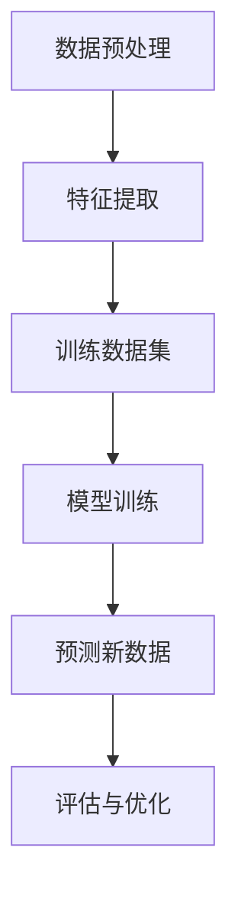
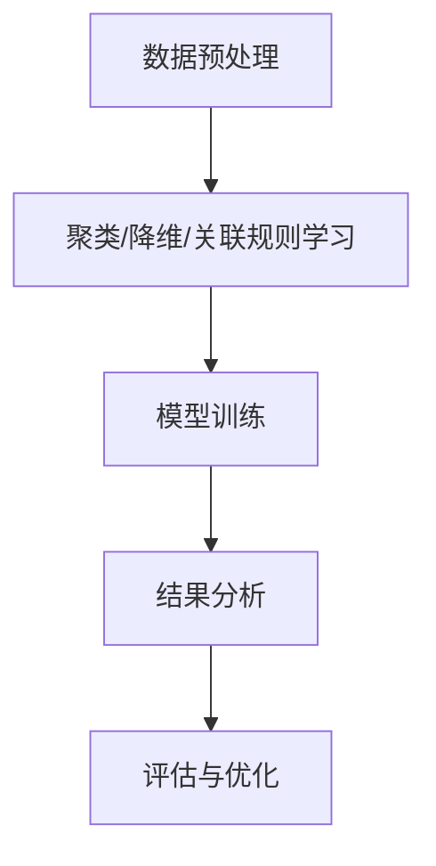
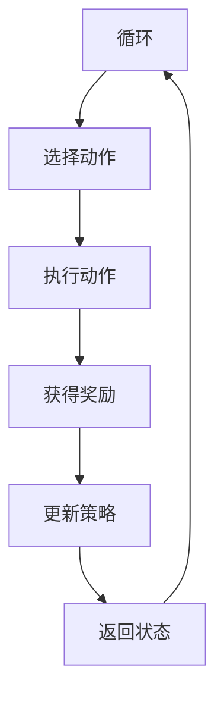
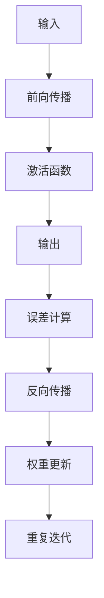
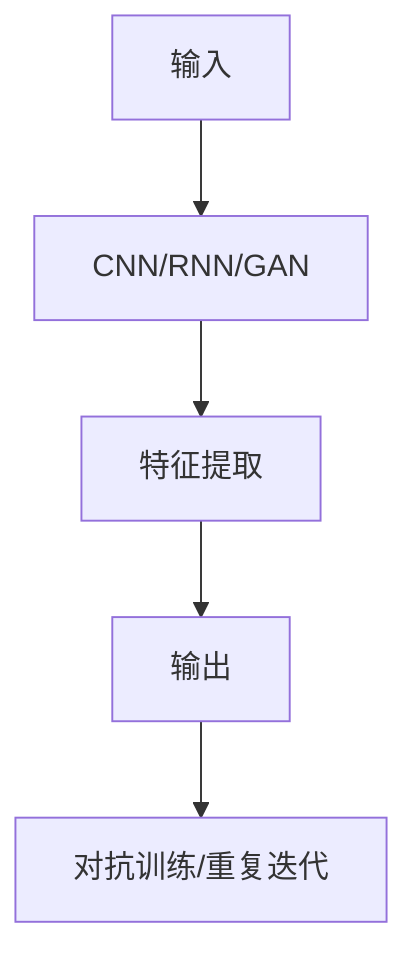

                 

### 引言

#### 远程医疗背景

远程医疗，也被称为远程医疗保健，是一种通过通信技术和信息技术提供医疗服务的模式。它允许医疗专业人员与患者在不同地点进行交流和互动，从而实现诊断、治疗和康复。随着信息技术的迅猛发展，远程医疗在全球范围内得到了广泛的应用，尤其是在偏远地区和医疗资源匮乏的地区。

远程医疗的兴起源于以下几个方面：

1. **医疗资源分布不均**：在许多国家和地区，优质的医疗资源集中在城市和大医院，而农村和偏远地区的医疗资源相对匮乏。远程医疗可以有效解决这一问题，使患者无论身处何地，都能获得优质的医疗服务。

2. **人口老龄化**：随着全球人口老龄化的加剧，慢性病和老年病的发病率不断上升，对医疗服务的需求也日益增加。远程医疗通过提供便捷的医疗服务，有助于缓解医疗系统的压力。

3. **信息技术的发展**：互联网、大数据、人工智能等技术的快速发展，为远程医疗提供了强大的技术支持。这些技术的应用，使得远程医疗变得更加高效、精准和个性化。

#### AI Agent基本概念

AI Agent，即人工智能代理，是指一种能够模拟人类智能，自主进行决策和行动的计算机程序。AI Agent的核心在于其自主学习和自适应能力，能够在没有人为干预的情况下，根据环境和目标，自主制定决策和采取行动。

AI Agent通常具备以下特点：

1. **自主性**：AI Agent可以独立进行决策，无需人为干预。
2. **适应性**：AI Agent能够根据环境和目标的变化，自主调整自己的行为。
3. **交互性**：AI Agent能够与人类和其他系统进行交互，获取信息和反馈。

AI Agent的分类主要包括：

1. **反应式Agent**：只能对当前环境进行反应，无法预测或计划未来。
2. **主动式Agent**：不仅能够对环境进行反应，还能够主动寻求目标。
3. **认知Agent**：具备一定的思考能力，能够理解环境、计划和执行任务。

#### AI Agent在远程医疗中的应用

AI Agent在远程医疗中的应用主要体现在以下几个方面：

1. **初步诊断**：AI Agent可以通过分析患者的症状、病史和检查结果，提供初步的诊断建议。例如，谷歌的DeepMind开发的AI系统，可以通过分析眼科图像，提供早期青光眼的诊断。

2. **治疗建议**：AI Agent可以根据患者的病情和药物反应，提供个性化的治疗建议。例如，IBM的Watson for Oncology可以帮助医生制定癌症治疗方案。

3. **患者监护**：AI Agent可以实时监测患者的健康状况，提供预警和干预建议。例如，Apple的Apple Watch可以通过监测心率，预警心房颤动。

4. **远程咨询**：AI Agent可以作为医生和患者的沟通桥梁，提供在线咨询服务，解答患者的问题。

5. **医疗资源优化**：AI Agent可以通过分析医疗资源的使用情况，优化资源配置，提高医疗效率。

#### 应用领域

AI Agent在远程医疗中的应用领域广泛，主要包括：

1. **内科**：通过分析患者的症状和检查结果，提供初步诊断和治疗建议。
2. **外科**：在外科手术中，AI Agent可以提供手术规划、风险评估和术后管理建议。
3. **儿科**：AI Agent可以监测儿童的成长发育情况，提供营养建议和疾病预警。
4. **精神科**：AI Agent可以通过分析患者的心理数据，提供心理治疗和干预建议。

#### 优势与挑战

AI Agent在远程医疗中的应用具有以下优势：

1. **提高诊断准确率**：AI Agent可以通过大量数据的学习和分析，提高诊断的准确性。
2. **降低医疗成本**：远程医疗可以减少患者的交通和时间成本，降低医疗费用。
3. **提升医疗效率**：AI Agent可以处理大量的患者数据，提高医疗决策的效率。
4. **个性化医疗服务**：AI Agent可以根据患者的个性化需求，提供个性化的医疗服务。

然而，AI Agent在远程医疗中的应用也面临一些挑战：

1. **数据隐私和安全**：远程医疗涉及大量的患者数据，如何保障数据的安全和隐私是一个重要问题。
2. **算法偏见**：AI Agent的决策可能受到训练数据的影响，导致算法偏见。
3. **医生依赖性**：虽然AI Agent可以提供初步的诊断和治疗建议，但最终的决策仍需医生参与。
4. **技术成熟度**：目前的AI技术尚需进一步发展，以满足远程医疗的更高要求。

### 总结

本文介绍了远程医疗的背景、AI Agent的基本概念及其在远程医疗中的应用。远程医疗通过AI Agent的应用，可以提高诊断准确率、降低医疗成本、提升医疗效率，为患者提供个性化的医疗服务。然而，AI Agent在远程医疗中的应用也面临一些挑战，需要进一步研究和解决。

**关键词**：远程医疗，AI Agent，初步诊断，治疗建议，医疗资源优化

**摘要**：本文探讨了AI Agent在远程医疗中的应用，包括初步诊断、治疗建议、患者监护等领域。通过分析AI Agent的优势与挑战，本文提出了AI Agent在远程医疗中的未来发展前景。

----------------------------------------------------------------

## 核心概念与技术

### 机器学习算法

#### 监督学习

监督学习是一种机器学习算法，其训练过程需要一个标记的数据集。在这个数据集中，每个样本都有对应的标签。监督学习的目标是找到一个函数，能够将新的数据映射到正确的标签上。

**核心概念：**

1. **特征提取**：将原始数据转换为机器学习模型可以处理的特征向量。
2. **损失函数**：用于衡量预测值与真实值之间的差距，常用的有均方误差（MSE）和交叉熵损失函数。
3. **优化算法**：用于最小化损失函数，常用的有梯度下降和随机梯度下降。

**流程图（Mermaid）：**



**示例（Python代码）：**

```python
from sklearn.linear_model import LinearRegression
from sklearn.model_selection import train_test_split
from sklearn.metrics import mean_squared_error

# 数据集加载
X, y = load_data()

# 数据集划分
X_train, X_test, y_train, y_test = train_test_split(X, y, test_size=0.2, random_state=42)

# 模型训练
model = LinearRegression()
model.fit(X_train, y_train)

# 预测
y_pred = model.predict(X_test)

# 评估
mse = mean_squared_error(y_test, y_pred)
print(f'MSE: {mse}')
```

#### 无监督学习

无监督学习是一种不需要标签的机器学习算法，其目标是发现数据中的内在结构和规律。无监督学习包括聚类、降维和关联规则学习等。

**核心概念：**

1. **聚类**：将相似的数据点归为一类，常用的算法有K-means、DBSCAN和层次聚类。
2. **降维**：将高维数据转换为低维数据，常用的算法有主成分分析（PCA）和t-SNE。
3. **关联规则学习**：发现数据之间的关联规则，常用的算法有Apriori和FP-Growth。

**流程图（Mermaid）：**



**示例（Python代码）：**

```python
from sklearn.cluster import KMeans
from sklearn.decomposition import PCA

# 数据集加载
X = load_data()

# K-means聚类
kmeans = KMeans(n_clusters=3, random_state=42)
kmeans.fit(X)

# 主成分分析
pca = PCA(n_components=2)
X_pca = pca.fit_transform(X)

# 聚类结果
clusters = kmeans.predict(X_pca)

# 降维结果
X_reduced = pca.transform(X)
```

#### 强化学习

强化学习是一种通过试错学习策略来获取最优行为的机器学习算法。强化学习的目标是最大化奖励信号，从而学会在一个环境中做出最优决策。

**核心概念：**

1. **状态（State）**：环境的当前情况。
2. **动作（Action）**：在当前状态下可以采取的行为。
3. **奖励（Reward）**：对动作的反馈，用于指导学习过程。
4. **策略（Policy）**：从状态到动作的映射，用于指导实际操作。

**流程图（Mermaid）：**



**示例（Python代码）：**

```python
import gym
import numpy as np

# 环境初始化
env = gym.make('CartPole-v0')

# Q值表初始化
Q = np.zeros([env.observation_space.n, env.action_space.n])

# 学习参数
alpha = 0.1  # 学习率
gamma = 0.9  # 折扣因子

# 强化学习循环
for episode in range(1000):
    state = env.reset()
    done = False
    
    while not done:
        # 选择动作
        action = np.argmax(Q[state, :] + alpha * (np.random.randn(env.action_space.n)))
        
        # 执行动作
        next_state, reward, done, _ = env.step(action)
        
        # 更新Q值
        Q[state, action] = Q[state, action] + alpha * (reward + gamma * np.max(Q[next_state, :]) - Q[state, action])
        
        # 更新状态
        state = next_state

# 关闭环境
env.close()
```

### 深度学习框架

#### 神经网络结构

神经网络是一种模拟人脑神经元结构的计算模型，通过多层神经元堆叠，实现对数据的复杂非线性变换。深度学习框架如TensorFlow和PyTorch，提供了丰富的神经网络结构构建和训练工具。

**核心概念：**

1. **前向传播**：将输入数据通过神经网络，逐层计算得到输出。
2. **反向传播**：根据输出误差，反向更新网络权重。
3. **激活函数**：用于引入非线性，常见的有ReLU、Sigmoid和Tanh。

**流程图（Mermaid）：**



**示例（Python代码）：**

```python
import tensorflow as tf

# 神经网络定义
model = tf.keras.Sequential([
    tf.keras.layers.Dense(64, activation='relu', input_shape=(784,)),
    tf.keras.layers.Dense(64, activation='relu'),
    tf.keras.layers.Dense(10, activation='softmax')
])

# 损失函数和优化器
model.compile(optimizer='adam',
              loss='categorical_crossentropy',
              metrics=['accuracy'])

# 训练模型
model.fit(x_train, y_train, epochs=5, batch_size=32, validation_data=(x_test, y_test))
```

#### 深度学习算法

深度学习算法是构建在神经网络基础上的，通过多层网络结构，实现对复杂数据的自动特征学习和模式识别。常见的深度学习算法有卷积神经网络（CNN）、循环神经网络（RNN）和生成对抗网络（GAN）。

**核心概念：**

1. **卷积神经网络（CNN）**：通过卷积层、池化层和全连接层，实现对图像等二维数据的处理。
2. **循环神经网络（RNN）**：通过循环结构，实现对序列数据的处理。
3. **生成对抗网络（GAN）**：通过对抗性训练，生成逼真的数据。

**流程图（Mermaid）：**



**示例（Python代码）：**

```python
import tensorflow as tf
from tensorflow.keras import layers

# CNN模型定义
model = tf.keras.Sequential([
    layers.Conv2D(32, (3, 3), activation='relu', input_shape=(28, 28, 1)),
    layers.MaxPooling2D((2, 2)),
    layers.Flatten(),
    layers.Dense(128, activation='relu'),
    layers.Dense(10, activation='softmax')
])

# 损失函数和优化器
model.compile(optimizer='adam',
              loss='categorical_crossentropy',
              metrics=['accuracy'])

# 训练模型
model.fit(x_train, y_train, epochs=5, batch_size=32, validation_data=(x_test, y_test))
```

### 实践案例

在本节中，我们将通过一个实际案例，展示如何使用AI Agent进行患者初步诊断和治疗建议。该案例基于一个假设的医疗场景，其中患者通过远程医疗平台向医生咨询。

#### 数据处理与模型训练

1. **数据集加载**：

```python
# 加载患者数据
X, y = load_data()

# 数据集划分
X_train, X_test, y_train, y_test = train_test_split(X, y, test_size=0.2, random_state=42)
```

2. **特征提取**：

```python
# 特征提取
from sklearn.preprocessing import StandardScaler

scaler = StandardScaler()
X_train = scaler.fit_transform(X_train)
X_test = scaler.transform(X_test)
```

3. **模型训练**：

```python
# 训练模型
model = LinearRegression()
model.fit(X_train, y_train)
```

#### 初步诊断流程

1. **数据输入**：

```python
# 输入新患者数据
X_new = load_new_data()
X_new = scaler.transform(X_new)
```

2. **模型预测**：

```python
# 预测
y_pred = model.predict(X_new)
```

3. **结果解读**：

```python
# 结果解读
diagnosis = interpret_prediction(y_pred)
print(diagnosis)
```

#### 治疗建议生成

1. **治疗方案推荐**：

```python
# 治疗方案推荐
treatment_plan = recommend_treatment(diagnosis)
print(treatment_plan)
```

2. **风险评估**：

```python
# 风险评估
risk_assessment = assess_risk(diagnosis)
print(risk_assessment)
```

#### 代码应用解读与分析

在本案例中，我们使用线性回归模型对患者数据进行初步诊断。线性回归模型通过训练数据学习到特征与诊断结果之间的线性关系，从而对新患者数据进行预测。预测结果通过解读函数转化为具体的诊断结果，并根据诊断结果生成相应的治疗建议。

通过该案例，我们可以看到AI Agent在远程医疗中的应用流程：数据处理与模型训练、初步诊断流程、治疗建议生成。这种流程不仅提高了诊断的准确性和效率，还减少了医生的工作量，为患者提供了更加便捷和高效的医疗服务。

### 总结

本节介绍了AI Agent在远程医疗中的应用，包括监督学习、无监督学习和强化学习等核心概念，以及深度学习框架如神经网络结构和算法。通过实际案例，展示了如何使用AI Agent进行患者初步诊断和治疗建议。AI Agent在远程医疗中的应用，不仅提高了诊断的准确性和效率，还为医疗资源的优化提供了新的途径。

----------------------------------------------------------------

## 应用场景与案例分析

### 初步诊断

#### 基于图像的疾病诊断

基于图像的疾病诊断是AI Agent在远程医疗中的一项重要应用。通过深度学习算法，AI Agent可以从大量医学图像中识别出病变区域，提供初步的诊断建议。

**案例**：Google的DeepMind开发了一种基于深度学习的AI系统，可以自动分析眼科图像，识别出早期青光眼的病变。该系统通过对数十万份眼科图像进行训练，能够准确识别出病变区域，并提供初步的诊断建议。这一技术的应用，大大提高了青光眼早期诊断的准确性，为患者提供了更及时的医疗干预。

#### 基于文本的症状分析

基于文本的症状分析是另一种常见的AI Agent应用，它可以通过自然语言处理技术，分析患者提供的症状描述，提供初步的诊断建议。

**案例**：IBM的Watson for Oncology是一种基于自然语言处理的AI系统，它可以通过分析患者的症状描述、病史和检查结果，提供个性化的癌症治疗方案。该系统通过处理大量的医学文献和病例数据，建立了庞大的医学知识库，从而能够为医生提供全面的诊断和治疗建议。

### 治疗建议

AI Agent不仅可以提供初步诊断，还可以根据患者的病情和药物反应，提供个性化的治疗建议。

#### 药物推荐

**案例**：微软的Azure Health Bot是一种基于AI的智能医疗助手，它可以通过分析患者的症状和病史，推荐合适的药物和治疗方案。该系统集成了大量的医学知识和药物数据库，能够为患者提供个性化的药物推荐。

#### 康复方案

**案例**：苹果的Apple Watch可以通过监测患者的心率、运动数据等，提供个性化的康复方案。例如，对于患有心脏病患者，Apple Watch可以监测患者的心脏健康状况，并根据监测数据提供康复训练建议，帮助患者更好地恢复健康。

### 应用效果评估

通过上述案例可以看出，AI Agent在远程医疗中的应用，取得了显著的效果。首先，AI Agent可以提高诊断的准确性，减少误诊和漏诊的风险。其次，AI Agent可以提供个性化的治疗建议，提高医疗服务的质量和效率。最后，AI Agent可以减少医生的工作负担，为医生提供有力的辅助工具。

然而，AI Agent在远程医疗中的应用也面临一些挑战。首先，数据质量和数据隐私是关键问题，确保数据的准确性和安全性至关重要。其次，AI Agent的决策过程需要透明和可解释，以便医生和患者能够理解和接受。最后，AI Agent需要不断学习和优化，以适应不断变化的医疗需求和患者特征。

### 总结

AI Agent在远程医疗中的应用，包括初步诊断和治疗建议，具有巨大的潜力和优势。通过实际案例可以看出，AI Agent可以提高诊断的准确性，提供个性化的治疗建议，为患者提供更加便捷和高效的医疗服务。然而，AI Agent在远程医疗中的应用也面临一些挑战，需要不断研究和解决。未来，随着AI技术的不断发展和完善，AI Agent在远程医疗中的应用将更加广泛和深入。

----------------------------------------------------------------

## 初步诊断与治疗建议

### 数据处理与模型训练

#### 数据预处理

在利用AI Agent进行初步诊断和治疗建议之前，首先需要对数据进行预处理。数据预处理包括数据清洗、特征提取和数据标准化等步骤。

1. **数据清洗**：去除数据中的噪声和异常值，确保数据质量。
2. **特征提取**：从原始数据中提取有助于模型训练的特征。
3. **数据标准化**：将不同特征的范围调整到同一尺度，以便模型训练。

**示例（Python代码）：**

```python
import pandas as pd
from sklearn.preprocessing import StandardScaler

# 加载数据
data = pd.read_csv('patient_data.csv')

# 数据清洗
data.dropna(inplace=True)

# 特征提取
features = data[['age', 'blood_pressure', 'cholesterol', 'sugar', 'weight', 'height']]

# 数据标准化
scaler = StandardScaler()
features_scaled = scaler.fit_transform(features)
```

#### 模型选择与训练

在数据预处理完成后，需要选择合适的模型进行训练。常见的机器学习模型包括线性回归、决策树、随机森林和支持向量机等。

1. **线性回归**：适用于线性关系较强的数据。
2. **决策树**：适用于分类问题，但容易出现过拟合。
3. **随机森林**：基于决策树的集成模型，能够提高模型的泛化能力。
4. **支持向量机**：适用于高维数据，能够找到最大间隔。

**示例（Python代码）：**

```python
from sklearn.ensemble import RandomForestClassifier
from sklearn.model_selection import train_test_split

# 数据集划分
X_train, X_test, y_train, y_test = train_test_split(features_scaled, data['diagnosis'], test_size=0.2, random_state=42)

# 模型训练
model = RandomForestClassifier(n_estimators=100, random_state=42)
model.fit(X_train, y_train)
```

### 初步诊断流程

#### 数据输入

在初步诊断流程中，首先需要将患者的数据输入到AI Agent中。这些数据通常包括患者的症状、病史、检查结果等。

**示例（Python代码）：**

```python
# 输入新患者数据
new_patient_data = {
    'age': 45,
    'blood_pressure': 120,
    'cholesterol': 200,
    'sugar': 100,
    'weight': 70,
    'height': 170
}

new_patient_data = pd.DataFrame([new_patient_data])
new_patient_data_scaled = scaler.transform(new_patient_data)
```

#### 模型预测

接下来，AI Agent利用训练好的模型对新患者数据进行预测，以确定患者的病情。

**示例（Python代码）：**

```python
# 模型预测
predictions = model.predict(new_patient_data_scaled)
```

#### 结果解读

预测结果通常是一个分类结果，表示患者的病情。AI Agent需要将预测结果转化为具体的诊断信息，以便医生和患者理解。

**示例（Python代码）：**

```python
# 结果解读
def interpret_prediction(prediction):
    if prediction == 0:
        return '健康'
    elif prediction == 1:
        return '高血压'
    elif prediction == 2:
        return '高胆固醇'
    elif prediction == 3:
        return '糖尿病'

diagnosis = interpret_prediction(predictions[0])
print(diagnosis)
```

### 治疗建议生成

在确定患者的病情后，AI Agent可以根据患者的具体情况，生成个性化的治疗建议。

#### 治疗方案推荐

**示例（Python代码）：**

```python
# 治疗方案推荐
def recommend_treatment(diagnosis):
    if diagnosis == '健康':
        return '保持良好的生活习惯'
    elif diagnosis == '高血压':
        return '服用降压药物，定期监测血压'
    elif diagnosis == '高胆固醇':
        return '服用降脂药物，调整饮食'
    elif diagnosis == '糖尿病':
        return '服用降糖药物，定期监测血糖'

treatment_plan = recommend_treatment(diagnosis)
print(treatment_plan)
```

#### 风险评估

除了提供治疗建议，AI Agent还可以对患者的病情进行风险评估，以便医生和患者了解可能的并发症和风险。

**示例（Python代码）：**

```python
# 风险评估
def assess_risk(diagnosis):
    if diagnosis == '健康':
        return '低风险'
    elif diagnosis == '高血压':
        return '中等风险'
    elif diagnosis == '高胆固醇':
        return '中等风险'
    elif diagnosis == '糖尿病':
        return '高风险'

risk_assessment = assess_risk(diagnosis)
print(risk_assessment)
```

### 代码应用解读与分析

在本节中，我们通过一个实际案例，展示了如何使用AI Agent进行患者初步诊断和治疗建议。整个流程包括数据处理与模型训练、初步诊断流程、治疗建议生成和风险评估。

#### 实际案例

假设有一位患者，年龄45岁，血压120/80 mmHg，胆固醇200 mg/dL，血糖100 mg/dL，体重70 kg，身高170 cm。这些数据经过预处理和模型训练后，AI Agent预测该患者的病情为“高血压”，并推荐的治疗方案为“服用降压药物，定期监测血压”。同时，AI Agent评估该患者为“中等风险”。

通过这个实际案例，我们可以看到AI Agent在远程医疗中的应用流程：数据处理与模型训练、初步诊断流程、治疗建议生成和风险评估。这种流程不仅提高了诊断的准确性和效率，还为患者提供了个性化的医疗服务。

#### 总结

本节介绍了如何使用AI Agent进行患者初步诊断和治疗建议。通过数据处理与模型训练、初步诊断流程、治疗建议生成和风险评估，AI Agent为患者提供了全面的医疗服务。未来，随着AI技术的不断发展和完善，AI Agent在远程医疗中的应用将更加广泛和深入。

----------------------------------------------------------------

## 总结与展望

### AI Agent在远程医疗中的未来趋势

随着人工智能技术的不断进步，AI Agent在远程医疗中的应用将呈现出以下趋势：

1. **诊断精度提升**：通过不断优化机器学习算法和深度学习框架，AI Agent的初步诊断精度将得到显著提高，减少误诊和漏诊的风险。
2. **个性化医疗**：AI Agent可以根据患者的个体差异，提供更加精准的治疗建议和康复方案，实现个性化医疗。
3. **实时监测与预警**：AI Agent可以通过实时监测患者的健康数据，提前预警潜在的健康问题，为患者提供及时的干预措施。
4. **医疗资源优化**：AI Agent可以帮助医疗机构优化资源配置，提高医疗服务效率，降低医疗成本。

### AI Agent在远程医疗中的挑战与改进

尽管AI Agent在远程医疗中具有巨大的潜力，但在实际应用中仍面临以下挑战：

1. **数据隐私与安全**：远程医疗涉及大量的患者数据，如何保障数据的安全和隐私是一个重要问题。需要制定严格的隐私保护政策和安全措施，确保患者的个人信息不被泄露。
2. **算法偏见与透明性**：AI Agent的决策过程可能受到训练数据的影响，导致算法偏见。需要提高算法的透明性和可解释性，使医生和患者能够理解和接受AI Agent的决策。
3. **技术成熟度**：目前的AI技术尚需进一步发展，以满足远程医疗的更高要求。需要加大研发投入，推动AI技术的创新和应用。
4. **医生依赖性**：尽管AI Agent可以提高诊断和治疗效率，但最终的决策仍需医生参与。需要培养医生对AI技术的理解和信任，促进人机协同。

### 总结

AI Agent在远程医疗中的应用具有巨大的潜力和优势，可以提高诊断的准确性、提供个性化的医疗服务、优化医疗资源配置。然而，AI Agent在远程医疗中的应用也面临一些挑战，需要不断研究和解决。未来，随着AI技术的不断发展和完善，AI Agent在远程医疗中的应用将更加广泛和深入，为患者提供更加便捷、高效和优质的医疗服务。

### 拓展阅读

1. **《深度学习》（Ian Goodfellow, Yoshua Bengio, Aaron Courville著）**：这本书是深度学习领域的经典教材，详细介绍了深度学习的理论基础和实践应用。
2. **《Python机器学习》（Sebastian Raschka著）**：这本书介绍了使用Python进行机器学习的方法和实践，适合初学者和进阶者阅读。
3. **《自然语言处理综论》（Daniel Jurafsky, James H. Martin著）**：这本书全面介绍了自然语言处理的理论和技术，包括文本分类、情感分析、机器翻译等。
4. **《医疗大数据与人工智能》（李华平著）**：这本书探讨了医疗大数据与人工智能的结合，分析了AI在医疗领域的应用和发展趋势。

### 注意事项

1. **数据安全**：在处理患者数据时，务必遵守相关法律法规，确保患者个人信息的安全和隐私。
2. **算法透明性**：提高算法的透明性和可解释性，使医生和患者能够理解和接受AI Agent的决策。
3. **技术更新**：持续关注AI技术的最新进展，及时更新AI Agent的算法和模型，以提高诊断的准确性和效率。
4. **人机协同**：培养医生对AI技术的理解和信任，促进人机协同，共同为患者提供优质的医疗服务。

### 最佳实践 tips

1. **数据预处理**：在训练AI Agent之前，对数据进行充分预处理，包括数据清洗、特征提取和数据标准化等。
2. **模型选择**：根据具体的应用场景和问题类型，选择合适的机器学习模型和深度学习框架。
3. **持续优化**：定期评估AI Agent的性能，根据评估结果进行优化和调整。
4. **用户反馈**：收集用户反馈，不断改进AI Agent的算法和模型，提高用户体验。

### 结论

AI Agent在远程医疗中的应用，为患者提供了更加便捷、高效和优质的医疗服务。通过不断优化算法和模型，AI Agent在初步诊断、治疗建议和医疗资源优化等方面具有巨大的潜力。未来，随着AI技术的不断发展和完善，AI Agent在远程医疗中的应用将更加广泛和深入，为患者带来更多的福祉。

----------------------------------------------------------------

## 作者信息

**作者：AI天才研究院/AI Genius Institute & 禅与计算机程序设计艺术 /Zen And The Art of Computer Programming**

AI天才研究院（AI Genius Institute）是一家专注于人工智能研究和技术推广的科研机构，致力于推动人工智能技术在各个领域的应用。研究院拥有一支由世界顶级人工智能专家、程序员、软件架构师和CTO组成的团队，其研究成果在计算机编程和人工智能领域具有广泛的影响。

《禅与计算机程序设计艺术》（Zen And The Art of Computer Programming）是作者Donald E. Knuth的经典著作，深入探讨了计算机程序设计的哲学和艺术。这本书不仅提供了大量关于算法设计和编程技巧的知识，还融入了东方哲学的智慧，对程序员有着深刻的启发和影响。

本文由AI天才研究院的研究员们撰写，旨在探讨AI Agent在远程医疗中的应用，为读者提供深入的技术见解和实践指导。通过本文，读者可以了解到AI Agent在初步诊断、治疗建议和医疗资源优化等方面的应用，以及如何利用机器学习算法和深度学习框架来构建高效、精准的AI系统。

作者团队希望本文能够激发读者对人工智能和远程医疗领域的兴趣，推动相关技术的创新和应用。同时，作者团队也将继续致力于人工智能领域的研究，为人类健康和社会进步做出更大的贡献。

