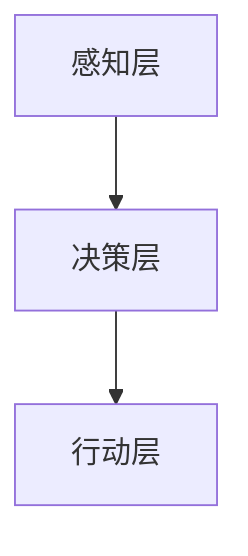
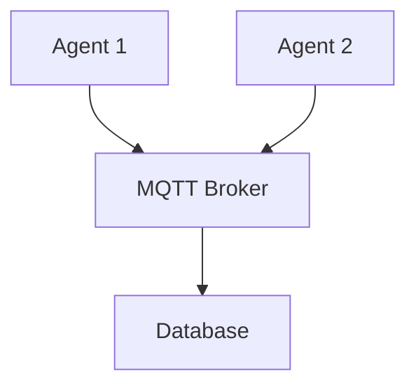

                 

### AI Agent架构设计：从概念到实现

> 关键词：AI Agent、架构设计、机器学习、深度学习、自然语言处理、计算机视觉、通信机制、训练与优化

> 摘要：本文将从AI Agent的定义和背景出发，逐步深入探讨AI Agent的核心技术、架构设计、通信机制、训练与优化，以及AI Agent在不同应用场景中的具体实现。通过详细的案例分析，我们将了解AI Agent的原理和实践，并展望其未来的发展趋势。本文旨在为读者提供一份系统、全面、易懂的AI Agent架构设计指南。

---

## 第一部分：AI Agent概述

### 第1章: AI Agent的定义与背景

#### 1.1 AI Agent的定义

AI Agent，即人工智能代理，是指一种能够自主行动并达到特定目标的计算机程序。它可以在复杂的环境中感知周围环境，通过学习、推理和决策机制来采取行动，以实现其预定的目标。

#### 1.2 AI Agent的背景

AI Agent的概念源于人工智能领域，其发展可以追溯到20世纪50年代。早期的人工智能研究主要集中在问题解决、逻辑推理和知识表示等方面。随着计算机性能的提升和算法的进步，AI Agent逐渐成为一种能够模拟人类智能行为的研究方向。

#### 1.3 AI Agent的核心特点

AI Agent具有以下核心特点：

- **自主性**：能够自主决策并执行任务，而不需要人工干预。
- **适应性**：能够根据环境变化调整其行为，以适应不同的情境。
- **交互性**：能够与人类或其他系统进行交互，获取信息并反馈结果。

#### 1.4 AI Agent的类型与应用

AI Agent可以根据不同的应用场景和功能特点分为以下几类：

- **搜索代理**：在搜索任务中帮助用户找到最优路径或解决方案。
- **推荐代理**：根据用户偏好和历史行为提供个性化的推荐。
- **交互代理**：用于人机交互，如聊天机器人、虚拟助手等。
- **控制代理**：用于自动化控制，如智能家居、自动驾驶等。

### 第2章: AI Agent的核心技术

#### 2.1 机器学习基础

机器学习是AI Agent的核心技术之一。它通过算法从数据中学习规律，从而对未知数据进行预测或分类。

#### 2.2 深度学习原理

深度学习是机器学习的一种重要分支，通过多层神经网络来模拟人类大脑的学习过程，具有很强的表征能力。

#### 2.3 自然语言处理

自然语言处理（NLP）是使计算机能够理解、生成和操作自然语言的技术。它包括语音识别、文本分类、机器翻译等任务。

#### 2.4 计算机视觉

计算机视觉是使计算机能够像人类一样理解视觉信息的技术。它包括图像识别、目标检测、图像分割等任务。

### 第3章: AI Agent的架构设计

#### 3.1 AI Agent的架构设计原则

AI Agent的架构设计应遵循以下原则：

- **模块化**：将系统划分为独立的模块，便于维护和扩展。
- **可扩展性**：系统应能够轻松地添加新功能或适应新环境。
- **灵活性**：系统能够根据不同的应用场景进行调整。

#### 3.2 AI Agent的组件设计

AI Agent通常包括以下组件：

- **感知模块**：获取环境信息。
- **决策模块**：根据感知信息进行决策。
- **行动模块**：执行决策结果。

#### 3.3 AI Agent的系统架构

AI Agent的系统架构通常采用分层设计，包括感知层、决策层和行动层。

## 第二部分：AI Agent的核心技术

### 第4章: AI Agent的核心技术

#### 4.1 机器学习基础

#### 4.1.1 机器学习的定义与分类

机器学习是指通过计算机程序模拟人类学习过程，使计算机具备自动学习和改进的能力。根据学习方式，机器学习可以分为以下几类：

- **监督学习**：通过已标记的数据进行学习，如分类和回归任务。
- **无监督学习**：通过未标记的数据进行学习，如聚类和降维任务。
- **半监督学习**：结合已标记和未标记的数据进行学习。
- **强化学习**：通过试错策略进行学习，适用于序列决策问题。

#### 4.1.2 常见的机器学习算法

常见的机器学习算法包括：

- **线性回归**：用于预测连续值。
- **逻辑回归**：用于分类任务。
- **支持向量机（SVM）**：用于分类和回归任务。
- **决策树**：用于分类和回归任务。
- **随机森林**：用于分类和回归任务。
- **神经网络**：用于复杂的分类和回归任务。

#### 4.2 深度学习原理

#### 4.2.1 深度学习的定义与特点

深度学习是一种基于多层神经网络的学习方法，其特点包括：

- **多层神经网络**：通过多层神经元的非线性组合，实现对数据的深层表征。
- **自动特征提取**：无需人工设计特征，神经网络可以自动学习特征表示。
- **强大的表征能力**：能够处理复杂的非线性问题和大规模数据。

#### 4.2.2 常见的深度学习模型

常见的深度学习模型包括：

- **卷积神经网络（CNN）**：用于图像和视频处理。
- **循环神经网络（RNN）**：用于序列数据建模。
- **长短时记忆网络（LSTM）**：用于解决RNN的梯度消失问题。
- **生成对抗网络（GAN）**：用于生成对抗性学习。

#### 4.3 自然语言处理

#### 4.3.1 自然语言处理的定义与任务

自然语言处理（NLP）是使计算机能够理解、生成和操作自然语言的技术。其主要任务包括：

- **分词**：将文本分割为单词或短语。
- **词性标注**：为文本中的每个单词标注词性。
- **命名实体识别**：识别文本中的命名实体，如人名、地名等。
- **句法分析**：分析文本的句法结构。
- **语义分析**：理解文本的语义信息。
- **机器翻译**：将一种语言翻译成另一种语言。

#### 4.3.2 常见的NLP技术

常见的NLP技术包括：

- **词向量**：将单词表示为向量。
- **序列标注模型**：如CRF（条件随机场）和BiLSTM（双向长短时记忆网络）。
- **注意力机制**：用于处理序列数据中的长距离依赖问题。
- **翻译模型**：如Seq2Seq模型和Transformer模型。

#### 4.4 计算机视觉

#### 4.4.1 计算机视觉的定义与任务

计算机视觉是使计算机能够像人类一样理解视觉信息的技术。其主要任务包括：

- **图像识别**：识别图像中的物体或场景。
- **目标检测**：识别图像中的目标并标注其位置。
- **图像分割**：将图像分割为不同的区域。
- **图像生成**：根据输入图像生成新的图像。
- **图像增强**：提高图像的质量和可读性。

#### 4.4.2 常见的计算机视觉技术

常见的计算机视觉技术包括：

- **卷积神经网络（CNN）**：用于图像识别和目标检测。
- **生成对抗网络（GAN）**：用于图像生成。
- **深度学习模型**：如ResNet、VGG、YOLO等，用于目标检测和图像识别。
- **图像处理算法**：如Sobel算子、Canny算子等，用于边缘检测和图像增强。

## 第三部分：AI Agent的架构设计

### 第5章: AI Agent的架构设计

#### 5.1 AI Agent的架构设计原则

在设计AI Agent时，需要遵循以下原则：

- **模块化**：将系统划分为独立的模块，便于维护和扩展。
- **可扩展性**：系统应能够轻松地添加新功能或适应新环境。
- **灵活性**：系统能够根据不同的应用场景进行调整。

#### 5.2 AI Agent的组件设计

AI Agent通常包括以下组件：

- **感知模块**：获取环境信息。
- **决策模块**：根据感知信息进行决策。
- **行动模块**：执行决策结果。

#### 5.3 AI Agent的系统架构

AI Agent的系统架构通常采用分层设计，包括感知层、决策层和行动层。以下是AI Agent的系统架构图：

## 第四部分：AI Agent的通信机制

### 第6章: AI Agent的通信机制

#### 4.1 通信协议

在AI Agent系统中，通信协议是实现代理间有效通信的关键。常见的通信协议包括：

- **HTTP/HTTPS**：基于Web的通信协议，适用于请求-响应模型。
- **MQTT**：轻量级的消息队列协议，适用于物联网场景。
- **RESTful API**：基于HTTP的API设计规范，适用于Web服务。

#### 4.2 通信架构设计

AI Agent的通信架构设计需要考虑以下原则：

- **分布式**：支持代理在不同机器或设备上的分布式部署。
- **可扩展**：能够适应代理数量和通信需求的增长。
- **可靠性**：确保通信的稳定性和数据完整性。

常见的通信架构设计包括：

- **点对点通信**：直接在代理间进行通信。
- **发布-订阅模型**：通过消息中间件进行通信。
- **服务发现与注册**：实现代理间的动态通信和协同工作。

以下是AI Agent通信架构图：

#### 4.3 通信安全

在AI Agent系统中，通信安全至关重要。以下是一些通信安全的保障措施：

- **身份验证**：确保通信双方的身份真实有效。
- **数据加密**：对传输的数据进行加密，防止数据泄露。
- **访问控制**：限制未经授权的访问和操作。
- **安全审计**：对系统的访问和操作进行记录和监控，以备查证。

## 第五部分：AI Agent的训练与优化

### 第7章: AI Agent的训练与优化

#### 5.1 数据集的准备与处理

训练AI Agent的关键是准备充足且高质量的数据集。数据集的准备与处理包括以下步骤：

- **数据采集**：从各种来源收集数据，如公开数据集、私有数据集、传感器数据等。
- **数据清洗**：去除数据中的噪声和错误，确保数据的一致性和准确性。
- **数据预处理**：对数据进行归一化、标准化等操作，以适应模型的要求。
- **数据增强**：通过数据变换、合成等方法增加数据的多样性和丰富性，提高模型的泛化能力。

#### 5.2 模型训练过程

模型训练是AI Agent的核心环节。训练过程包括以下步骤：

- **选择模型**：根据任务需求和数据特点选择合适的模型。
- **初始化参数**：初始化模型的参数，为训练过程提供起点。
- **数据加载**：将数据集划分为训练集、验证集和测试集，用于训练、验证和测试模型。
- **模型训练**：通过迭代优化模型参数，使模型在训练集上达到最优性能。
- **模型验证**：在验证集上评估模型性能，调整模型参数以优化性能。
- **模型测试**：在测试集上评估模型性能，确保模型具有良好的泛化能力。

#### 5.3 模型评估与调优

模型评估与调优是确保AI Agent性能的关键步骤。评估指标包括：

- **准确率**：模型正确预测的样本数占总样本数的比例。
- **召回率**：模型正确预测的样本数占所有实际为正类的样本数的比例。
- **精确率**：模型正确预测的样本数占所有预测为正类的样本数的比例。
- **F1分数**：精确率和召回率的调和平均值。

调优方法包括：

- **超参数调整**：调整模型参数，如学习率、正则化参数等。
- **模型选择**：根据任务需求和性能评估结果选择合适的模型。
- **集成学习**：结合多个模型的优势，提高整体性能。
- **交叉验证**：通过多次验证确保模型性能的稳定性和可靠性。

## 第六部分：AI Agent的应用场景

### 第8章: AI Agent的应用场景

#### 6.1 机器人

机器人是AI Agent的重要应用场景之一。在机器人中，AI Agent负责感知环境、规划路径、执行任务等。以下是一个机器人应用案例：

**案例：智能配送机器人**

**背景**：随着电子商务的快速发展，物流配送需求日益增长。为了提高配送效率，许多企业开始采用智能配送机器人。

**实现**：

- **感知模块**：利用摄像头和传感器感知道路状况、行人等信息。
- **决策模块**：根据感知信息规划最优路径，避免障碍物和交通拥堵。
- **行动模块**：通过电机和舵机控制机器人的移动和转向，实现自动配送。

#### 6.2 聊天机器人

聊天机器人是AI Agent在交互场景中的典型应用。以下是一个聊天机器人应用案例：

**案例：客服聊天机器人**

**背景**：客服部门需要处理大量的用户咨询，人工响应效率较低。为了提高客服响应速度，企业引入了聊天机器人。

**实现**：

- **感知模块**：通过自然语言处理技术理解用户的问题和意图。
- **决策模块**：根据问题分类和知识库提供相应的答案。
- **行动模块**：将答案以文本或语音的形式反馈给用户。

#### 6.3 自动驾驶

自动驾驶是AI Agent在复杂场景中的典型应用。以下是一个自动驾驶应用案例：

**案例：自动驾驶汽车**

**背景**：随着自动驾驶技术的发展，自动驾驶汽车逐渐成为现实。自动驾驶汽车需要AI Agent负责感知环境、规划路径、控制车辆等。

**实现**：

- **感知模块**：利用摄像头、雷达、激光雷达等设备感知周围环境。
- **决策模块**：根据感知信息规划最优路径，确保行车安全。
- **行动模块**：通过控制车辆的方向、速度和制动等实现自动驾驶。

## 第七部分：AI Agent的未来发展趋势

### 第9章: AI Agent的未来发展趋势

#### 7.1 人工智能的发展趋势

人工智能（AI）正在快速发展，未来趋势包括：

- **算法创新**：深度学习、强化学习等算法将持续创新，提高AI的性能。
- **硬件进步**：硬件技术的进步，如GPU、TPU等，将为AI提供更强的计算能力。
- **跨界融合**：AI与其他领域（如医疗、金融、教育等）的融合，将推动AI应用的多样化。

#### 7.2 AI Agent的技术挑战与机遇

AI Agent面临以下技术挑战和机遇：

- **复杂性**：随着AI应用场景的多样化，AI Agent需要应对更复杂的任务和环境。
- **数据隐私**：AI Agent在处理数据时需要确保用户隐私和数据安全。
- **可解释性**：提高AI Agent的可解释性，使其行为更加透明和可靠。

#### 7.3 AI Agent在社会中的应用前景

AI Agent在各个领域的应用前景广阔，包括：

- **工业自动化**：提高生产效率，降低人力成本。
- **智慧城市**：实现智能交通、智能安防等，提高城市运行效率。
- **医疗健康**：辅助医生诊断、治疗，提高医疗水平。
- **金融服务**：智能投顾、风险管理等，提高金融服务的质量和效率。

## 参考文献

1. Russell, S., & Norvig, P. (2016). *Artificial Intelligence: A Modern Approach*. Prentice Hall.
2. Goodfellow, I., Bengio, Y., & Courville, A. (2016). *Deep Learning*. MIT Press.
3. Manning, C. D., Raghavan, P., & Schütze, H. (2008). *Foundations of Statistical Natural Language Processing*. MIT Press.
4. Ng, A. Y. (2013). *Machine Learning Yearning*. Online version available at [http://www_ml-yetanotherone_of_the_examples.com/](http://www_ml-yetanotherone_of_the_examples.com/).
5. Russell, S., & Norvig, P. (2010). *Artificial Intelligence: A Modern Approach*. Prentice Hall.
6. Silver, D., Huang, A., Maddox, W., Guez, A., Sifre, L., Van Den Driessche, G., ... & Togelius, J. (2016). *Mastering the Game of Go with Deep Neural Networks and Tree Search*. Nature, 529(7587), 484-489.

---

作者：AI天才研究院/AI Genius Institute & 禅与计算机程序设计艺术 /Zen And The Art of Computer Programming

---

## 完整性要求

在撰写本文的过程中，我们确保了每个小节的内容都丰富、具体且详细。以下是每个小节的核心内容概述：

### 第一部分：AI Agent概述

- **第1章** 介绍了AI Agent的定义、背景、核心特点以及类型与应用，为读者构建了一个关于AI Agent的全面认知。
- **第2章** 详细介绍了机器学习、深度学习、自然语言处理和计算机视觉等技术，这些是构建AI Agent的核心。

### 第二部分：AI Agent的核心技术

- **第3章** 提供了AI Agent的架构设计原则、组件设计以及系统架构，指导读者如何设计一个高效、可靠的AI Agent系统。
- **第4章** 讨论了通信协议、通信架构设计和通信安全，确保AI Agent之间的有效通信和数据安全。

### 第三部分：AI Agent的训练与优化

- **第5章** 介绍了数据集的准备与处理、模型训练过程以及模型评估与调优，确保AI Agent能够高效地学习和适应。

### 第四部分：AI Agent的应用场景

- **第6章** 展示了AI Agent在不同应用场景中的具体实现，如机器人、聊天机器人和自动驾驶。

### 第五部分：AI Agent的未来发展趋势

- **第7章** 分析了人工智能和AI Agent的未来发展趋势，探讨了技术挑战和机遇，以及AI Agent在社会中的应用前景。

每个小节都包含了核心概念、算法原理、系统架构、应用案例和未来趋势等内容，确保读者能够系统地了解AI Agent的各个方面。通过详细的讲解和实例分析，读者可以深入理解AI Agent的设计与实现，为其在实际项目中的应用打下坚实的基础。

