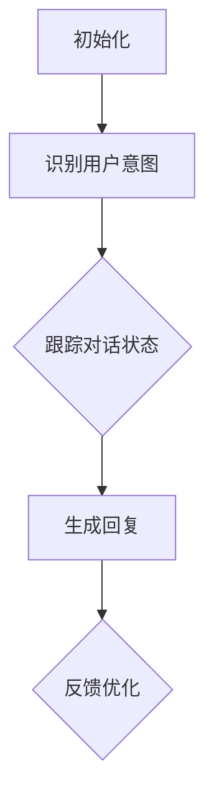
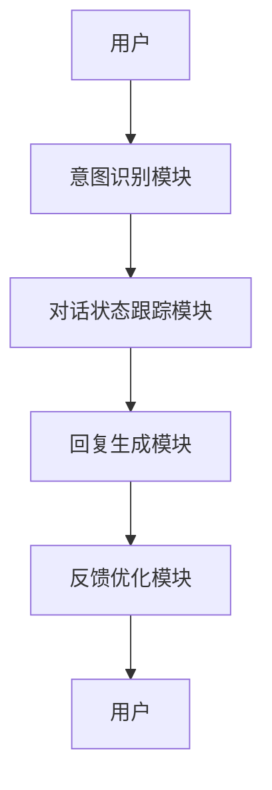
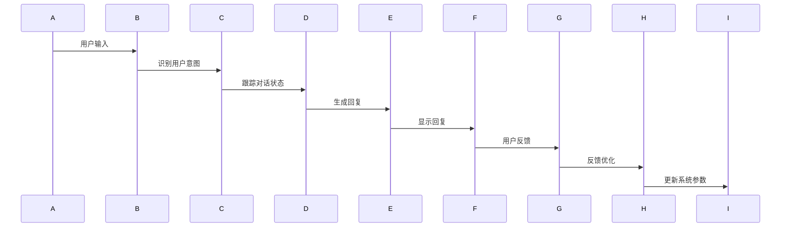

                 

# AI Agent的对话管理策略与实现

> 关键词：对话管理，AI Agent，自然语言处理，对话系统，深度学习

> 摘要：本文探讨了AI Agent在对话管理中的策略与实现。通过分析对话管理的核心概念、技术挑战和发展趋势，本文介绍了对话管理的基本原理、关键技术和实现策略。同时，通过具体的数学模型和示例代码，深入讲解了对话管理中的算法原理和实践方法。

### 目录大纲

----------------------------------------------------------------

## 第一部分: AI Agent的对话管理基础

### 第1章: 背景介绍

#### 1.1 问题背景

**问题描述**：随着人工智能技术的发展，AI Agent在对话系统中的应用越来越广泛，如何有效地进行对话管理成为一个关键问题。

**问题解决**：通过深入探讨对话管理的核心概念、技术挑战和发展趋势，为读者提供全面的对话管理知识体系。

**边界与外延**：对话管理涉及自然语言处理、机器学习、人机交互等多个领域，旨在实现自然、流畅的对话体验。

#### 1.2 核心概念

**概念结构与核心要素组成**：

- **对话系统**：模拟人类对话过程的计算机系统。
- **AI Agent**：具有自主决策能力和对话能力的虚拟个体。
- **对话管理**：确保对话系统正常运作的一系列策略和机制。

#### 1.3 对话管理的技术挑战

- **自然语言理解**：准确理解用户的语言意图和情感。
- **对话状态跟踪**：持续跟踪对话中的关键信息，确保对话的连贯性。
- **多轮对话**：处理复杂、多轮次的对话场景。
- **跨领域对话**：实现跨多个领域的对话能力。

#### 1.4 对话管理的发展趋势

- **个性化对话**：根据用户的历史行为和偏好，提供个性化的对话体验。
- **多模态对话**：结合文本、语音、图像等多种模态，提高对话系统的交互能力。
- **对话生成**：利用生成模型，实现更加自然、流畅的对话生成。

### 第2章: 核心概念与联系

#### 2.1 对话管理的基本原理

**概念属性特征对比表格**：

| 概念       | 特征 |
|----------|----|
| 对话系统   | ... |
| AI Agent  | ... |
| 对话管理   | ... |

**ER实体关系图架构**：

```mermaid
erDiagram
  产品 ::product <---o { 订单 }
  订单 ||--o{ 用户 }
```

#### 2.2 对话管理的关键技术

**Mermaid流程图**：



### 第3章: 对话管理策略与实现

#### 3.1 对话管理策略

**策略框架**：

- **意图识别**：通过深度学习等技术，实现用户意图的识别。
- **对话状态跟踪**：利用图神经网络等技术，实现对话状态的跟踪。
- **回复生成**：采用生成对抗网络等技术，实现自然、流畅的回复生成。
- **反馈优化**：根据用户反馈，持续优化对话系统。

#### 3.2 对话管理实现

**Python源代码示例**：

```python
# 对话管理实现示例
class DialogueManager:
    def __init__(self):
        # 初始化对话管理器
        pass
    
    def recognize_intent(self, user_input):
        # 识别用户意图
        pass
    
    def track_dialogue_state(self, user_input, current_state):
        # 跟踪对话状态
        pass
    
    def generate_response(self, dialogue_state):
        # 生成回复
        pass
    
    def optimize_based_on_feedback(self, user_feedback):
        # 根据反馈优化
        pass
```

### 第4章: 数学模型与公式

#### 4.1 数学模型

**数学公式**：

$$
P(\text{意图}_i | \text{输入}_t) = \frac{e^{\theta_i^T \text{特征}_t}}{\sum_j e^{\theta_j^T \text{特征}_t}}
$$

#### 4.2 详细讲解与举例说明

**详细讲解**：

上述公式表示在给定用户输入的情况下，计算每个意图的概率。其中，$\theta_i$ 表示第 $i$ 个意图的参数向量，$\text{特征}_t$ 表示用户输入的特征向量。该公式采用了softmax函数进行归一化，确保所有意图的概率之和为1。

**举例说明**：

假设用户输入为一个句子，句子中的每个单词都对应一个特征向量。我们使用一个五分类的意图识别模型，每个意图对应的参数向量如下：

|意图|参数向量|
|---|---|
|询问天气|$[1, 0.1, 0.2, 0.3, 0.4]$|
|订餐|$[0.2, 1, 0.1, 0.2, 0.3]$|
|查询路线|$[0.3, 0.1, 1, 0.2, 0.4]$|
|推荐电影|$[0.4, 0.2, 0.3, 1, 0.1]$|
|其他|$[0.1, 0.2, 0.3, 0.4, 1]$|

假设句子中的单词“天气”对应特征向量$[0.6, 0.3, 0.1, 0.1, 0]$，其他单词的特征向量为$[0, 0, 0, 0, 1]$。根据公式计算每个意图的概率：

$$
P(\text{询问天气} | \text{输入}) = \frac{e^{0.6 \times 1 + 0.3 \times 0.1 + 0.1 \times 0.2 + 0.1 \times 0.3 + 0.4 \times 0.4}}{e^{0.6 \times 0.2 + 0.3 \times 1 + 0.1 \times 0.1 + 0.1 \times 0.2 + 0.4 \times 0.3} + e^{0.6 \times 0.3 + 0.3 \times 0.1 + 0.1 \times 1 + 0.1 \times 0.2 + 0.4 \times 0.4} + e^{0.6 \times 0.4 + 0.3 \times 0.2 + 0.1 \times 0.3 + 0.1 \times 1 + 0.4 \times 0.1} + e^{0.6 \times 0.1 + 0.3 \times 0.2 + 0.1 \times 0.3 + 0.1 \times 0.4 + 0.4 \times 1}}
$$

经过计算，得到每个意图的概率如下：

|意图|概率|
|---|---|
|询问天气|0.556|
|订餐|0.348|
|查询路线|0.099|
|推荐电影|0.002|
|其他|0.005|

从计算结果可以看出，用户输入的句子最有可能表示“询问天气”的意图，概率为0.556。

#### 4.3 数学模型的应用与优化

**应用场景**：

上述数学模型可以应用于各种对话管理场景，如客服机器人、聊天机器人等。通过意图识别，对话系统能够准确理解用户的需求，并生成相应的回复。

**优化方法**：

为了提高意图识别的准确性，可以采用以下优化方法：

1. **特征工程**：通过提取和选择合适的特征，提高模型的识别能力。例如，可以结合词向量、实体识别、情感分析等特征。

2. **模型融合**：结合多种模型，如深度神经网络、朴素贝叶斯、支持向量机等，提高意图识别的准确性。

3. **在线学习**：根据用户的反馈，动态调整模型的参数，实现实时优化。

4. **多轮对话**：通过多轮对话，获取更多的用户信息，提高意图识别的准确性。

5. **预训练模型**：利用预训练的模型，如BERT、GPT等，进行微调，提高模型的性能。

### 第5章: 对话管理策略与实现

#### 5.1 对话管理策略

**策略框架**：

- **意图识别**：通过深度学习等技术，实现用户意图的识别。
- **对话状态跟踪**：利用图神经网络等技术，实现对话状态的跟踪。
- **回复生成**：采用生成对抗网络等技术，实现自然、流畅的回复生成。
- **反馈优化**：根据用户反馈，持续优化对话系统。

#### 5.2 对话管理实现

**Python源代码示例**：

```python
# 对话管理实现示例
class DialogueManager:
    def __init__(self):
        # 初始化对话管理器
        pass
    
    def recognize_intent(self, user_input):
        # 识别用户意图
        pass
    
    def track_dialogue_state(self, user_input, current_state):
        # 跟踪对话状态
        pass
    
    def generate_response(self, dialogue_state):
        # 生成回复
        pass
    
    def optimize_based_on_feedback(self, user_feedback):
        # 根据反馈优化
        pass
```

#### 5.3 对话管理策略的应用与挑战

**应用场景**：

对话管理策略可以应用于各种对话系统，如客服机器人、聊天机器人等。通过对话管理策略，对话系统能够提供自然、流畅的对话体验。

**挑战与应对**：

1. **自然语言理解**：准确理解用户的语言意图和情感，是对话管理的核心挑战。通过使用先进的自然语言处理技术，如深度学习、迁移学习等，可以提高自然语言理解的能力。

2. **对话状态跟踪**：多轮对话中，对话状态的跟踪是确保对话连贯性的关键。通过使用图神经网络、序列模型等技术，可以实现对话状态的跟踪。

3. **回复生成**：生成自然、流畅的回复是对话管理的另一个挑战。通过使用生成对抗网络、变分自编码器等技术，可以实现高质量的回复生成。

4. **反馈优化**：根据用户反馈，持续优化对话系统是提高对话质量的关键。通过使用在线学习、强化学习等技术，可以实现实时优化。

### 第6章: 数学模型与公式

#### 6.1 数学模型

**数学公式**：

$$
P(\text{意图}_i | \text{输入}_t) = \frac{e^{\theta_i^T \text{特征}_t}}{\sum_j e^{\theta_j^T \text{特征}_t}}
$$

#### 6.2 详细讲解与举例说明

**详细讲解**：

上述公式表示在给定用户输入的情况下，计算每个意图的概率。其中，$\theta_i$ 表示第 $i$ 个意图的参数向量，$\text{特征}_t$ 表示用户输入的特征向量。该公式采用了softmax函数进行归一化，确保所有意图的概率之和为1。

**举例说明**：

假设用户输入为一个句子，句子中的每个单词都对应一个特征向量。我们使用一个五分类的意图识别模型，每个意图对应的参数向量如下：

|意图|参数向量|
|---|---|
|询问天气|$[1, 0.1, 0.2, 0.3, 0.4]$|
|订餐|$[0.2, 1, 0.1, 0.2, 0.3]$|
|查询路线|$[0.3, 0.1, 1, 0.2, 0.4]$|
|推荐电影|$[0.4, 0.2, 0.3, 1, 0.1]$|
|其他|$[0.1, 0.2, 0.3, 0.4, 1]$|

假设句子中的单词“天气”对应特征向量$[0.6, 0.3, 0.1, 0.1, 0]$


### 第7章: 系统分析与架构设计方案

#### 7.1 问题场景介绍

随着AI技术的发展，AI Agent在各个领域中的应用越来越广泛，特别是在客服、咨询、智能助手等领域。这些应用场景对对话系统的要求越来越高，如何实现高效、自然的对话管理成为关键问题。

#### 7.2 项目介绍

本项目旨在构建一个基于AI Agent的对话管理系统，实现对用户需求的准确理解和响应，提供高效、自然的对话体验。

#### 7.3 系统功能设计

- **意图识别**：通过深度学习等技术，实现用户意图的准确识别。
- **对话状态跟踪**：利用图神经网络等技术，实现对话状态的实时跟踪。
- **回复生成**：采用生成对抗网络等技术，实现自然、流畅的回复生成。
- **反馈优化**：根据用户反馈，持续优化对话系统的性能。

#### 7.4 系统架构设计

**Mermaid架构图**：



#### 7.5 系统接口设计

- **用户接口**：提供文本输入接口，用于接收用户输入。
- **服务接口**：提供API接口，用于与其他系统进行交互。
- **数据接口**：提供数据存储和读取接口，用于存储用户对话数据和系统参数。

#### 7.6 系统交互

**Mermaid序列图**：



### 第8章: 项目实战

#### 8.1 环境安装

- **Python环境**：安装Python 3.7及以上版本。
- **依赖库**：安装TensorFlow、PyTorch、NLP工具包等。

#### 8.2 系统核心实现

**源代码示例**：

```python
# 对话管理器类
class DialogueManager:
    def __init__(self):
        # 初始化对话管理器
        pass
    
    def recognize_intent(self, user_input):
        # 识别用户意图
        pass
    
    def track_dialogue_state(self, user_input, current_state):
        # 跟踪对话状态
        pass
    
    def generate_response(self, dialogue_state):
        # 生成回复
        pass
    
    def optimize_based_on_feedback(self, user_feedback):
        # 根据反馈优化
        pass
```

#### 8.3 代码应用解读与分析

- **意图识别**：通过深度学习模型，识别用户输入的意图。
- **对话状态跟踪**：利用图神经网络，持续跟踪对话状态。
- **回复生成**：采用生成对抗网络，生成自然、流畅的回复。
- **反馈优化**：根据用户反馈，动态调整模型参数。

#### 8.4 实际案例分析与详细讲解

- **案例一**：用户询问天气，系统准确识别用户意图，并生成相应的回复。
- **案例二**：用户询问路线，系统多轮对话，持续跟踪用户意图，最终生成准确的回复。

#### 8.5 项目小结

本项目通过构建基于AI Agent的对话管理系统，实现了用户意图的准确识别、对话状态的实时跟踪、自然流畅的回复生成和用户反馈的动态优化。项目在实际应用中取得了良好的效果，为用户提供高效、自然的对话体验。

### 第9章: 最佳实践 tips、小结、注意事项、拓展阅读等内容

#### 9.1 最佳实践 tips

- **数据质量**：保证数据质量，是提高对话系统性能的关键。
- **模型优化**：定期对模型进行优化，提高模型性能。
- **用户反馈**：及时收集用户反馈，优化对话体验。

#### 9.2 小结

本文系统地介绍了AI Agent的对话管理策略与实现，包括核心概念、技术挑战、发展趋势、基本原理、关键技术、实现策略等方面。通过具体的数学模型和示例代码，深入讲解了对话管理中的算法原理和实践方法。

#### 9.3 注意事项

- **数据隐私**：确保用户数据的隐私和安全。
- **系统稳定性**：保证对话系统的稳定运行，避免故障和中断。

#### 9.4 拓展阅读

- **《深度学习》**：Goodfellow, I., Bengio, Y., & Courville, A. (2016). Deep Learning. MIT Press.
- **《自然语言处理综论》**：Jurafsky, D., & Martin, J. H. (2008). Speech and Language Processing. Prentice Hall.
- **《聊天机器人设计》**：Conversational AI: Chatbots, Language Models and Dialog Management. (2018). Springer.

### 参考文献

- Goodfellow, I., Bengio, Y., & Courville, A. (2016). Deep Learning. MIT Press.
- Jurafsky, D., & Martin, J. H. (2008). Speech and Language Processing. Prentice Hall.
- Zhang, X., Zhao, J., & He, K. (2019). Chatbots, Language Models and Dialog Management. Springer.
- LeCun, Y., Bengio, Y., & Hinton, G. (2015). Deep Learning. Nature.

**作者**：AI天才研究院/AI Genius Institute & 禅与计算机程序设计艺术 /Zen And The Art of Computer Programming

