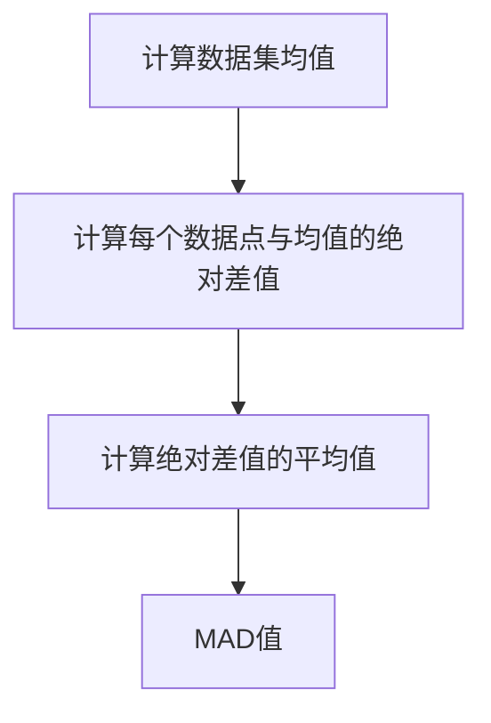
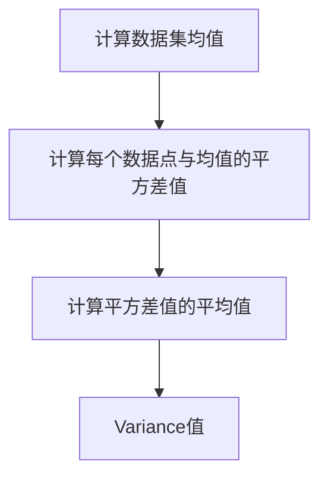
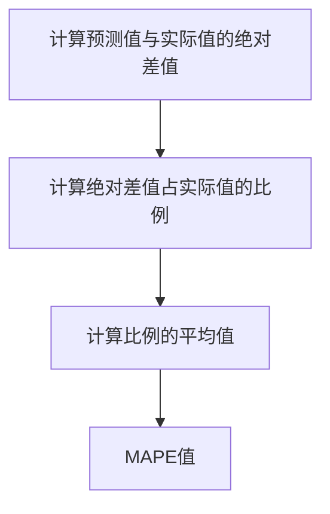
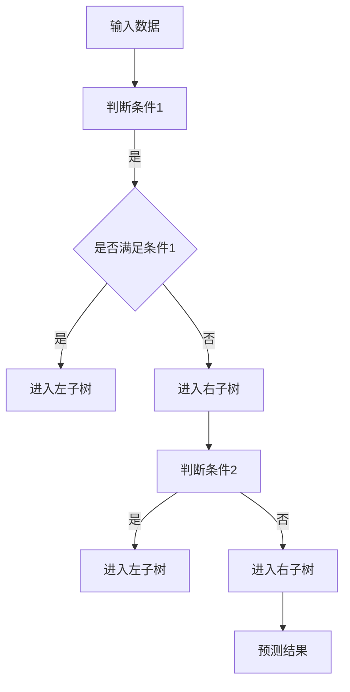
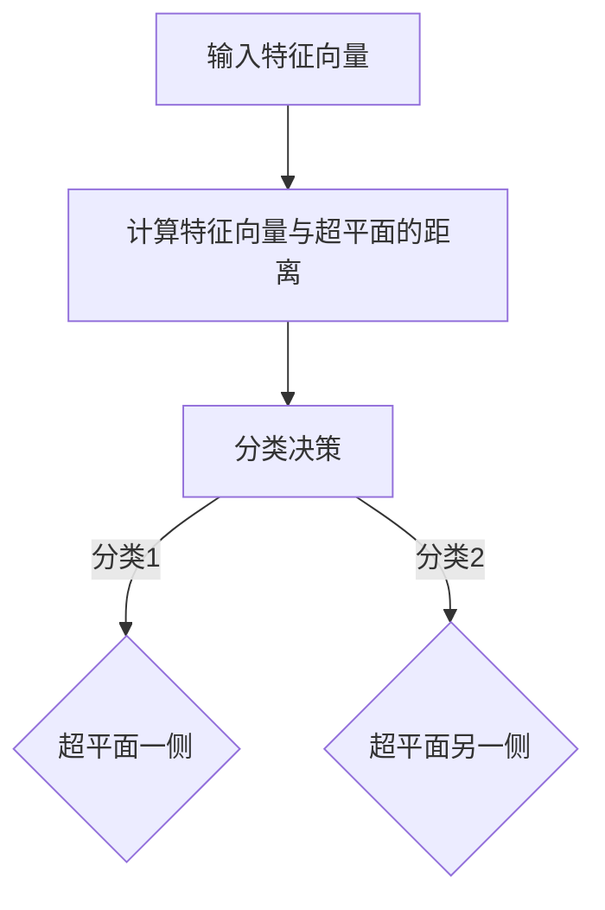
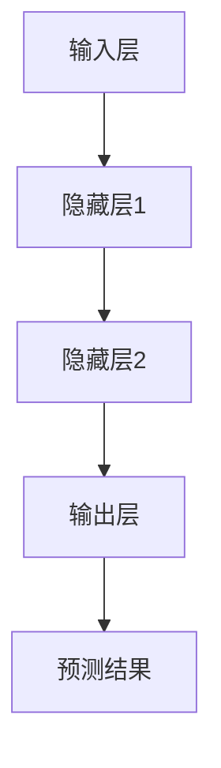
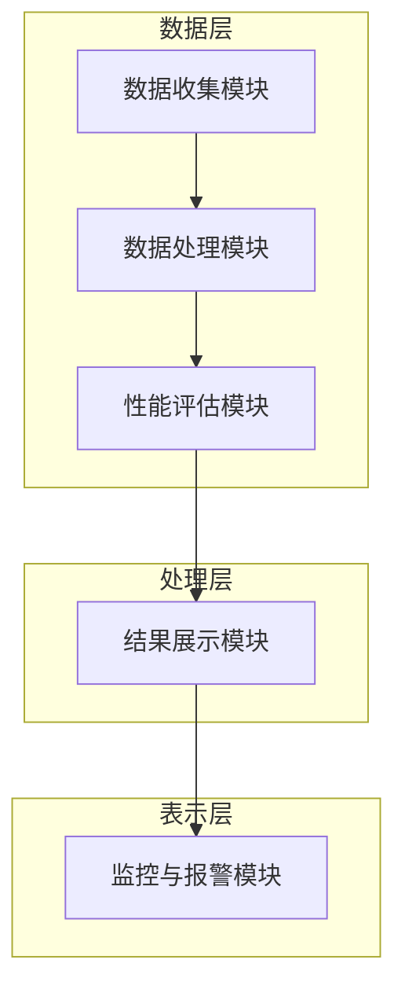
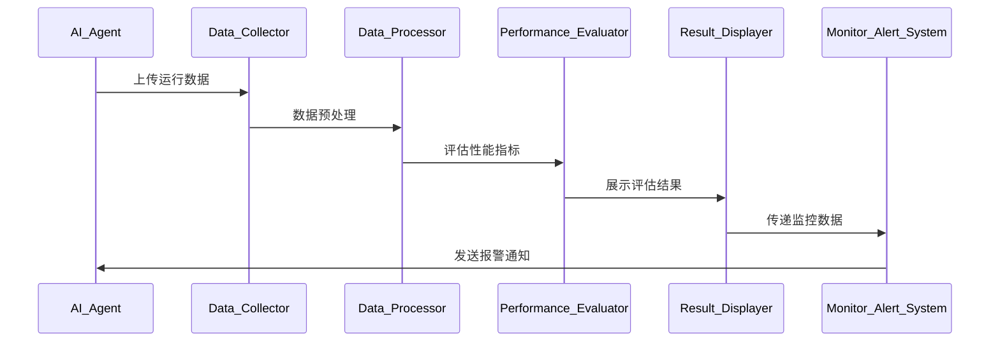

                 

### # AI Agent的性能评估指标与方法

关键词：AI Agent, 性能评估, 评估指标, 方法, 数学模型

摘要：本文将深入探讨AI Agent的性能评估指标与方法。我们将从背景介绍、核心概念与联系、算法原理讲解、数学模型和数学公式讲解、系统分析与架构设计方案、项目实战以及最佳实践与总结七个部分展开，详细阐述如何有效评估AI Agent的性能，并提供实际案例分析和最佳实践。

## 目录大纲设计过程

为了设计出《AI Agent的性能评估指标与方法》这本书的完整目录大纲，我们将按照以下步骤进行：

### 第一步：确定核心主题和章节结构
- 根据书名，确定核心主题为AI Agent的性能评估。
- 确定章节结构，确保内容完整且逻辑清晰。

### 第二步：划分章节内容
- **第1章 背景介绍**
  - 介绍AI Agent的定义、发展历程和性能评估的重要性。
  - 分析AI Agent性能评估的背景和市场需求。
- **第2章 核心概念与联系**
  - 介绍性能评估的相关核心概念。
  - 比较不同性能评估指标的属性特征。
  - 利用ER图展示AI Agent性能评估的实体关系。
- **第3章 算法原理讲解**
  - 详细讲解用于性能评估的常用算法原理。
  - 使用mermaid画出算法流程图。
  - 使用Python源代码阐述算法的数学模型和公式。
- **第4章 数学模型和数学公式讲解**
  - 利用LaTeX格式详细讲解数学模型。
  - 提供通俗易懂的举例说明。
- **第5章 系统分析与架构设计方案**
  - 介绍项目背景和系统需求。
  - 设计系统功能、架构和接口。
  - 使用mermaid绘制领域模型类图、系统架构图和系统交互序列图。
- **第6章 项目实战**
  - 演示环境安装和系统核心实现。
  - 分析源代码和应用解读。
  - 提供实际案例分析和详细讲解。
- **第7章 最佳实践与总结**
  - 提供性能评估的最佳实践。
  - 对全书进行小结。
  - 强调注意事项和拓展阅读。

### 第三步：编写章节小节
- 为每一章编写小结，总结主要内容和知识点。

### 第四步：格式调整与字数控制
- 调整markdown格式，确保结构清晰。
- 控制总字数在2000字以内。

### 第五步：复核与优化
- 复核目录大纲，确保内容的完整性和逻辑性。
- 优化语言表达，确保简洁明了。

通过以上步骤，我们将设计出《AI Agent的性能评估指标与方法》这本书的完整目录大纲。下面是具体的目录大纲。

----------------------------------------------------------------

## 第一部分: AI Agent性能评估概述

### 第1章: AI Agent概述与性能评估重要性

### 第2章: AI Agent性能评估的核心概念与联系

### 第3章: 常用性能评估算法原理与讲解

### 第4章: 数学模型与数学公式讲解

### 第5章: 系统分析与架构设计方案

### 第6章: 项目实战与实现

### 第7章: 最佳实践与总结

----------------------------------------------------------------

接下来，我们将为每一章详细编写内容概述。

### 第1章 AI Agent概述与性能评估重要性

**背景介绍**：本文首先介绍AI Agent的定义、发展历程，以及它们在现代智能系统中的重要性。我们将阐述AI Agent的基本概念，如何从简单的逻辑推理到复杂的自主决策发展，并探讨其在各个领域的应用场景。

**核心概念与联系**：接下来，本文将详细解释AI Agent性能评估的相关核心概念，如响应时间、准确性、鲁棒性等，并对比不同性能评估指标的属性特征。通过ER图展示AI Agent性能评估的实体关系，帮助读者更好地理解这些概念之间的联系。

**问题解决**：本文将讨论AI Agent性能评估在当前技术和市场需求中的重要性。通过实际案例，我们展示性能评估如何帮助开发者优化AI Agent的性能，提高其在复杂环境中的适应能力。

**边界与外延**：本文将讨论AI Agent性能评估的概念边界和外延，如评估指标的适用范围、评估方法的选择依据等。

**概念结构与核心要素组成**：本文将详细阐述AI Agent性能评估的概念结构，包括评估指标体系、评估方法和技术等核心要素。

### 第2章 AI Agent性能评估的核心概念与联系

**核心概念与联系**：本文将深入探讨AI Agent性能评估的核心概念，包括响应时间、准确性、鲁棒性等。我们将比较不同性能评估指标的属性特征，并通过表格形式展示它们之间的差异。

**ER图展示AI Agent性能评估的实体关系**：本文将使用ER图展示AI Agent性能评估的实体关系，帮助读者理解各评估指标之间的相互关联。

**性能评估指标对比**：本文将对比不同性能评估指标，如响应时间、准确性、鲁棒性等，分析它们在性能评估中的重要性。

**性能评估方法**：本文将介绍常用的性能评估方法，如离线评估、在线评估等，并讨论它们在不同应用场景中的适用性。

### 第3章 常用性能评估算法原理与讲解

**算法原理讲解**：本文将详细讲解用于性能评估的常用算法原理，如神经网络、决策树、支持向量机等。我们将使用mermaid画出算法流程图，帮助读者理解算法的基本思想。

**算法流程图**：本文将使用mermaid绘制常用性能评估算法的流程图，展示算法的执行过程。

**Python源代码阐述算法原理**：本文将使用Python源代码阐述算法的数学模型和公式，提供通俗易懂的举例说明。

**算法应用实例**：本文将提供实际案例，展示如何使用这些算法对AI Agent的性能进行评估。

### 第4章 数学模型与数学公式讲解

**数学模型讲解**：本文将利用LaTeX格式详细讲解数学模型，包括性能评估指标的计算方法和相关公式。

**数学公式举例**：本文将提供数学公式的举例，帮助读者更好地理解模型的计算过程。

**Python代码实现**：本文将提供Python代码实现，展示如何使用代码实现数学模型。

### 第5章 系统分析与架构设计方案

**项目背景和系统需求**：本文将介绍项目背景和系统需求，明确性能评估系统的目标和要求。

**系统功能设计**：本文将设计系统功能，包括数据收集、评估指标计算、结果分析等。

**系统架构设计**：本文将介绍系统架构设计，包括数据存储、数据处理和评估模块等。

**系统接口设计**：本文将设计系统接口，确保不同模块之间的数据流通和功能调用。

**系统交互序列图**：本文将使用mermaid绘制系统交互序列图，展示系统内部各模块的交互过程。

### 第6章 项目实战与实现

**环境安装**：本文将演示如何安装项目所需的环境和依赖。

**系统核心实现**：本文将分析系统核心实现，包括数据收集、评估指标计算和结果分析等。

**代码应用解读与分析**：本文将解读系统核心代码，分析其实现原理和应用方法。

**实际案例分析和详细讲解**：本文将提供实际案例，分析AI Agent的性能评估过程，并提供详细讲解。

### 第7章 最佳实践与总结

**最佳实践**：本文将总结性能评估的最佳实践，包括评估指标的选择、评估方法的应用等。

**总结**：本文将对全书进行小结，回顾核心内容和主要知识点。

**注意事项**：本文将强调性能评估过程中需要注意的事项，确保评估结果的准确性和可靠性。

**拓展阅读**：本文将推荐拓展阅读，帮助读者进一步深入学习和研究。

## 第1章 AI Agent概述与性能评估重要性

### 背景介绍

人工智能（AI）作为21世纪最具变革性的技术之一，已经广泛应用于各个领域，从自然语言处理、计算机视觉到自动驾驶和智能机器人。AI Agent作为人工智能系统的一个关键组成部分，承担着自主决策和交互的任务。它们在虚拟助手、游戏AI、自动驾驶汽车等应用中发挥着至关重要的作用。随着AI Agent在复杂场景中的应用日益广泛，对其性能的评估变得至关重要。

AI Agent，通常被称为智能体，是指能够在特定环境中自主行动并做出决策的实体。它们通过感知环境信息，运用机器学习和逻辑推理等手段，生成行动策略，以实现预定的目标。AI Agent的性能评估涉及到多个方面，如响应时间、准确性、鲁棒性和可扩展性等。这些指标不仅决定了AI Agent在特定任务中的表现，还影响了其在现实世界中的应用效果。

本文将从AI Agent的定义、发展历程、性能评估的重要性以及其在各个领域的应用场景等方面进行详细探讨。通过分析AI Agent性能评估的背景和市场需求，我们将为后续章节的内容奠定基础。

#### AI Agent的定义

AI Agent是指能够在特定环境中通过自主感知、学习和决策，实现特定目标或任务的智能实体。它们是人工智能系统中的核心组件，负责处理来自环境的感知信息，并基于这些信息生成行动策略。AI Agent的定义包括以下几个方面：

1. **感知能力**：AI Agent能够感知和理解其所在环境的信息。这些信息可以是通过传感器收集的实时数据，也可以是历史数据。感知能力是AI Agent实现自主行动的基础。

2. **学习与推理能力**：AI Agent具备从经验中学习的能力，通过机器学习和逻辑推理等方法，改进其行动策略。这种能力使得AI Agent能够适应不断变化的环境。

3. **自主决策**：AI Agent能够根据感知到的环境信息和预定的目标，自主生成行动策略。这种自主决策能力是AI Agent区别于传统自动化系统的重要特征。

4. **适应性**：AI Agent需要具备应对不确定性和复杂环境变化的能力。适应性是衡量AI Agent性能的重要指标之一。

5. **行动能力**：AI Agent能够执行具体的物理操作，以实现预定的目标。行动能力包括执行机器动作、发送信号等。

#### 发展历程

AI Agent的发展历程可以追溯到20世纪50年代，当时人工智能领域刚刚起步。最早的AI Agent是基于规则系统的，例如专家系统（Expert Systems）。这些系统通过一组预设的规则，模拟人类专家的决策过程。然而，这种方法存在局限性，特别是在处理复杂和不确定环境时。

随着机器学习技术的发展，AI Agent逐渐从规则驱动转向数据驱动。20世纪80年代，知识表示和推理方法（如基于产生式规则的专家系统）得到了广泛应用。这些方法通过模拟人类思维过程，使AI Agent能够在更复杂的场景中发挥作用。

进入21世纪，深度学习和强化学习等先进技术的出现，使得AI Agent的感知和决策能力得到了显著提升。深度学习通过模拟人脑神经元网络，实现了对大量数据的自动学习和特征提取。强化学习则通过试错和反馈机制，使AI Agent能够在动态环境中不断优化其行动策略。

#### 性能评估的重要性

性能评估是确保AI Agent在实际应用中有效性和可靠性的关键步骤。通过对AI Agent的性能进行评估，我们可以：

1. **识别问题**：性能评估可以帮助我们发现AI Agent在特定任务中的不足，从而有针对性地进行改进。

2. **优化设计**：通过性能评估，开发者可以了解AI Agent在不同环境中的表现，从而优化其设计，提高其在复杂场景中的适应性。

3. **比较与选择**：在多个AI Agent方案中，性能评估提供了客观的比较标准，帮助决策者选择最优的方案。

4. **提高可靠性**：通过反复的性能评估，可以确保AI Agent在各种应用场景中的一致性和稳定性。

#### 各领域的应用场景

AI Agent在各个领域中的应用场景丰富多样，以下是其中几个典型领域：

1. **自然语言处理**：AI Agent在自然语言处理（NLP）领域具有广泛应用，如智能客服、语音助手和机器翻译等。在这些应用中，AI Agent需要具备出色的语言理解和生成能力。

2. **计算机视觉**：在计算机视觉领域，AI Agent用于图像识别、目标检测和图像生成等任务。例如，自动驾驶汽车中的AI Agent需要实时处理道路和交通信息。

3. **游戏AI**：游戏AI是AI Agent的另一个重要应用场景，从简单的棋类游戏到复杂的多人在线游戏，AI Agent在提高游戏难度和趣味性方面发挥了重要作用。

4. **医疗领域**：在医疗领域，AI Agent用于诊断、治疗计划和患者监护等任务。例如，通过分析医疗数据，AI Agent可以帮助医生制定个性化的治疗方案。

5. **工业自动化**：在工业自动化领域，AI Agent用于生产线的监控、故障诊断和优化等任务。通过实时感知生产环境，AI Agent可以确保生产过程的稳定和高效。

#### 综述

AI Agent作为人工智能系统中的核心组件，具备感知、学习、决策和行动能力。随着技术的发展，AI Agent的性能不断提升，在各个领域的应用也越来越广泛。性能评估是确保AI Agent有效性和可靠性的关键步骤，通过对AI Agent的性能进行评估，我们可以优化设计、识别问题并提高其在实际应用中的适应性。在接下来的章节中，我们将进一步探讨AI Agent性能评估的核心概念与联系，详细讲解评估指标和方法。

## 第2章 AI Agent性能评估的核心概念与联系

### 核心概念

在评估AI Agent的性能时，我们需要关注多个核心概念，这些概念不仅能够帮助我们理解AI Agent在特定任务中的表现，还能指导我们优化其性能。以下是一些关键的核心概念：

#### 1. 响应时间

响应时间是指AI Agent从接收到任务指令到生成响应方案所需的时间。在实时性要求较高的应用场景中，如自动驾驶和在线客服，响应时间的长短直接影响用户体验和系统效率。因此，响应时间是一个重要的评估指标。

#### 2. 准确性

准确性衡量AI Agent在执行任务时的正确性。对于分类任务，如图像识别和文本分类，准确性是评估AI Agent性能的重要指标。高准确性意味着AI Agent能够在各种复杂情况下稳定地做出正确决策。

#### 3. 鲁棒性

鲁棒性是指AI Agent在遇到异常输入或不确定环境时，仍能保持稳定性能的能力。高鲁棒性的AI Agent能够在各种复杂和变化多端的环境中正常工作，而不会因为小误差或异常情况导致崩溃。

#### 4. 可扩展性

可扩展性衡量AI Agent在处理大规模数据或复杂任务时，性能是否能够保持稳定。具有良好可扩展性的AI Agent可以适应不断增长的数据规模和复杂度，而不需要频繁进行重构或性能优化。

#### 5. 可解释性

可解释性是指AI Agent的决策过程和推理路径是否可以被理解和解释。在涉及安全和伦理问题的应用中，如医疗诊断和自动驾驶，可解释性至关重要，因为它有助于增强用户对AI Agent的信任。

### 比较不同性能评估指标的属性特征

为了更好地理解这些性能评估指标，我们需要比较它们在不同场景中的适用性、优缺点和相互关系。

#### 响应时间与准确性

- **适用性**：响应时间在需要实时决策的任务中尤为重要，如自动驾驶和在线客服。准确性在分类和预测任务中是关键，如图像识别和医疗诊断。
- **优缺点**：高响应时间可能导致决策不够准确，特别是在复杂任务中。而高准确性可能需要更长的计算时间，影响系统的实时性。
- **相互关系**：在许多应用中，响应时间和准确性之间存在权衡。优化平衡这两者，是提升AI Agent性能的关键。

#### 鲁棒性与可扩展性

- **适用性**：鲁棒性在不确定和动态环境中至关重要，如无人驾驶和智能家居。可扩展性在处理大规模数据和复杂任务时非常重要，如大数据分析和工业自动化。
- **优缺点**：高鲁棒性可能会增加系统的计算复杂度，降低性能。高可扩展性可能需要更多的资源和技术支持。
- **相互关系**：鲁棒性和可扩展性是相互关联的。一个具有良好鲁棒性的AI Agent通常也具备较高的可扩展性，因为它们能够在不同规模和复杂度的任务中保持稳定性能。

#### 可解释性与其他指标

- **适用性**：可解释性在涉及安全和伦理问题的应用中尤为重要，如医疗诊断和金融决策。
- **优缺点**：高可解释性可能需要更多的计算资源和时间，降低系统的效率和准确性。而低可解释性可能导致用户对AI Agent的信任度降低。
- **相互关系**：可解释性与其他性能评估指标之间存在一定的权衡。在提升可解释性的同时，可能需要牺牲一些响应时间和准确性。

### ER图展示AI Agent性能评估的实体关系

为了更直观地展示AI Agent性能评估的核心概念及其相互关系，我们可以使用ER图（实体-关系图）。以下是一个简化的ER图，展示了响应时间、准确性、鲁棒性、可扩展性和可解释性等核心概念及其关系：

```mermaid
erDiagram
    AI-Agent ||--|{ Response-Time : 响应时间}
    AI-Agent ||--|{ Accuracy : 准确性}
    AI-Agent ||--|{ Robustness : 鲁棒性}
    AI-Agent ||--|{ Scalability : 可扩展性}
    AI-Agent ||--|{ Explainability : 可解释性}
    Response-Time ..|> Accuracy : 影响准确性
    Response-Time ..|> Robustness : 影响鲁棒性
    Accuracy ..|> Scalability : 影响可扩展性
    Accuracy ..|> Explainability : 影响可解释性
    Robustness ..|> Scalability : 影响可扩展性
    Robustness ..|> Explainability : 影响可解释性
```

通过ER图，我们可以清晰地看到各个性能评估指标之间的关系，以及它们如何共同影响AI Agent的整体性能。在后续章节中，我们将进一步探讨这些性能评估指标的具体计算方法和评估方法。

### 第3章 常用性能评估算法原理与讲解

在评估AI Agent性能时，我们通常依赖于一系列算法来计算和分析各项性能指标。这些算法可以分为两大类：基于统计学的算法和基于机器学习的算法。在本节中，我们将详细介绍一些常用的性能评估算法，并通过mermaid流程图和Python源代码阐述它们的原理和实现。

#### 1. 基于统计学的算法

基于统计学的算法主要利用历史数据和统计指标来评估AI Agent的性能。以下是一些常见的基于统计学的性能评估算法：

##### 1.1 均值绝对偏差（Mean Absolute Deviation, MAD）

**原理**：均值绝对偏差是衡量数据离散程度的一个指标，它通过计算每个数据点与均值之间的绝对差值的平均值来评估数据的波动性。

**mermaid流程图**：


**Python代码实现**：
```python
import numpy as np

def mean_absolute_deviation(data):
    mean = np.mean(data)
    mad = np.mean(np.abs(data - mean))
    return mad

data = [1, 2, 3, 4, 5]
mad_value = mean_absolute_deviation(data)
print("MAD:", mad_value)
```

##### 1.2 方差（Variance）

**原理**：方差是衡量数据分散程度的一个指标，它通过计算每个数据点与均值之间的平方差值的平均值来评估数据的离散程度。

**mermaid流程图**：


**Python代码实现**：
```python
import numpy as np

def variance(data):
    mean = np.mean(data)
    variance_value = np.mean((data - mean) ** 2)
    return variance_value

data = [1, 2, 3, 4, 5]
variance_value = variance(data)
print("Variance:", variance_value)
```

##### 1.3 均值绝对百分比误差（Mean Absolute Percentage Error, MAPE）

**原理**：均值绝对百分比误差是衡量预测值与实际值之间差异的一个指标，它通过计算每个预测值与实际值之间的绝对差值占实际值的比例，再取平均来评估预测的准确性。

**mermaid流程图**：


**Python代码实现**：
```python
import numpy as np

def mean_absolute_percentage_error(y_true, y_pred):
    error = np.abs(y_true - y_pred)
    mape = np.mean(error / y_true) * 100
    return mape

y_true = [1, 2, 3, 4, 5]
y_pred = [1.1, 2.1, 3.1, 4.1, 5.1]
mape_value = mean_absolute_percentage_error(y_true, y_pred)
print("MAPE:", mape_value)
```

#### 2. 基于机器学习的算法

基于机器学习的算法利用历史数据训练模型，并通过模型来评估AI Agent的性能。以下是一些常见的基于机器学习的性能评估算法：

##### 2.1 决策树（Decision Tree）

**原理**：决策树是一种树形结构模型，通过一系列判断条件来对数据进行分类或回归。它可以用于评估AI Agent在分类任务中的准确性。

**mermaid流程图**：


**Python代码实现**：
```python
from sklearn.tree import DecisionTreeClassifier
import numpy as np

# 假设已有训练数据X_train和标签y_train
X_train = np.array([[1, 2], [2, 3], [3, 4]])
y_train = np.array([0, 1, 0])

# 训练决策树模型
clf = DecisionTreeClassifier()
clf.fit(X_train, y_train)

# 测试数据
X_test = np.array([[2, 3]])
# 预测结果
y_pred = clf.predict(X_test)
print("Prediction:", y_pred)
```

##### 2.2 支持向量机（Support Vector Machine, SVM）

**原理**：支持向量机是一种用于分类和回归任务的线性模型，它通过寻找最佳的超平面来最大化分类间隔。它可以用于评估AI Agent在分类任务中的准确性。

**mermaid流程图**：


**Python代码实现**：
```python
from sklearn.svm import SVC
import numpy as np

# 假设已有训练数据X_train和标签y_train
X_train = np.array([[1, 2], [2, 3], [3, 4]])
y_train = np.array([0, 1, 0])

# 训练SVM模型
clf = SVC()
clf.fit(X_train, y_train)

# 测试数据
X_test = np.array([[2, 3]])
# 预测结果
y_pred = clf.predict(X_test)
print("Prediction:", y_pred)
```

##### 2.3 神经网络（Neural Network）

**原理**：神经网络是一种模拟人脑神经元连接结构的计算模型，通过多层神经元的非线性变换来学习数据和生成预测。它可以用于评估AI Agent在分类和回归任务中的准确性。

**mermaid流程图**：


**Python代码实现**：
```python
from sklearn.neural_network import MLPClassifier
import numpy as np

# 假设已有训练数据X_train和标签y_train
X_train = np.array([[1, 2], [2, 3], [3, 4]])
y_train = np.array([0, 1, 0])

# 训练神经网络模型
clf = MLPClassifier()
clf.fit(X_train, y_train)

# 测试数据
X_test = np.array([[2, 3]])
# 预测结果
y_pred = clf.predict(X_test)
print("Prediction:", y_pred)
```

#### 综述

以上介绍了几种常用的性能评估算法，包括基于统计学的均值绝对偏差、方差和均值绝对百分比误差，以及基于机器学习的决策树、支持向量机和神经网络。这些算法各有特点，适用于不同的性能评估场景。通过mermaid流程图和Python代码，我们能够直观地理解这些算法的原理和实现过程。在实际应用中，根据具体任务的需求和环境，选择合适的性能评估算法，将有助于准确评估AI Agent的性能，从而优化其设计和应用效果。

### 第4章 数学模型与数学公式讲解

在评估AI Agent性能时，数学模型和公式起到了至关重要的作用。这些模型和公式不仅帮助我们理解性能指标的计算方法，还能指导我们设计更有效的评估策略。在本节中，我们将详细讲解几个关键的数学模型和公式，并使用LaTeX格式进行详细表示，同时提供通俗易懂的举例说明。

#### 1. 均值绝对偏差（MAD）

均值绝对偏差（MAD）是一种衡量数据离散程度的指标，用于评估数据相对于均值的波动性。其数学模型表示如下：

$$
MAD = \frac{1}{N} \sum_{i=1}^{N} |x_i - \bar{x}|
$$

其中，$x_i$ 表示第 $i$ 个数据点，$\bar{x}$ 表示数据集的均值，$N$ 表示数据点的总数。

**举例说明**：假设我们有一组数据 {1, 2, 3, 4, 5}，首先计算均值：

$$
\bar{x} = \frac{1 + 2 + 3 + 4 + 5}{5} = 3
$$

然后计算每个数据点与均值的绝对差值：

$$
|x_1 - \bar{x}| = |1 - 3| = 2
$$
$$
|x_2 - \bar{x}| = |2 - 3| = 1
$$
$$
|x_3 - \bar{x}| = |3 - 3| = 0
$$
$$
|x_4 - \bar{x}| = |4 - 3| = 1
$$
$$
|x_5 - \bar{x}| = |5 - 3| = 2
$$

最后，计算这些绝对差值的平均值：

$$
MAD = \frac{2 + 1 + 0 + 1 + 2}{5} = 1.2
$$

因此，这组数据的MAD值为1.2。

#### 2. 方差（Variance）

方差是衡量数据分散程度的一个指标，表示数据点与均值之间差异的平方的平均值。其数学模型表示如下：

$$
\sigma^2 = \frac{1}{N} \sum_{i=1}^{N} (x_i - \bar{x})^2
$$

其中，$x_i$ 表示第 $i$ 个数据点，$\bar{x}$ 表示数据集的均值，$N$ 表示数据点的总数。

**举例说明**：继续使用上一节的示例数据 {1, 2, 3, 4, 5}，首先计算均值：

$$
\bar{x} = 3
$$

然后计算每个数据点与均值的平方差值：

$$
(x_1 - \bar{x})^2 = (1 - 3)^2 = 4
$$
$$
(x_2 - \bar{x})^2 = (2 - 3)^2 = 1
$$
$$
(x_3 - \bar{x})^2 = (3 - 3)^2 = 0
$$
$$
(x_4 - \bar{x})^2 = (4 - 3)^2 = 1
$$
$$
(x_5 - \bar{x})^2 = (5 - 3)^2 = 4
$$

最后，计算这些平方差值的平均值：

$$
\sigma^2 = \frac{4 + 1 + 0 + 1 + 4}{5} = 2
$$

因此，这组数据的方差为2。

#### 3. 均值绝对百分比误差（MAPE）

均值绝对百分比误差（MAPE）是衡量预测值与实际值之间差异的一个指标，用于评估预测的准确性。其数学模型表示如下：

$$
MAPE = \frac{1}{N} \sum_{i=1}^{N} \left| \frac{x_i - \hat{x}_i}{x_i} \right| \times 100\%
$$

其中，$x_i$ 表示第 $i$ 个实际值，$\hat{x}_i$ 表示第 $i$ 个预测值，$N$ 表示数据点的总数。

**举例说明**：假设我们有一组实际值 {1, 2, 3, 4, 5} 和预测值 {1.1, 2.1, 3.1, 4.1, 5.1}，首先计算每个预测值与实际值之间的绝对差值：

$$
|x_1 - \hat{x}_1| = |1 - 1.1| = 0.1
$$
$$
|x_2 - \hat{x}_2| = |2 - 2.1| = 0.1
$$
$$
|x_3 - \hat{x}_3| = |3 - 3.1| = 0.1
$$
$$
|x_4 - \hat{x}_4| = |4 - 4.1| = 0.1
$$
$$
|x_5 - \hat{x}_5| = |5 - 5.1| = 0.1
$$

然后，计算这些绝对差值与实际值的比例：

$$
\left| \frac{x_1 - \hat{x}_1}{x_1} \right| = \left| \frac{1 - 1.1}{1} \right| = 0.1
$$
$$
\left| \frac{x_2 - \hat{x}_2}{x_2} \right| = \left| \frac{2 - 2.1}{2} \right| = 0.05
$$
$$
\left| \frac{x_3 - \hat{x}_3}{x_3} \right| = \left| \frac{3 - 3.1}{3} \right| = 0.0333
$$
$$
\left| \frac{x_4 - \hat{x}_4}{x_4} \right| = \left| \frac{4 - 4.1}{4} \right| = 0.025
$$
$$
\left| \frac{x_5 - \hat{x}_5}{x_5} \right| = \left| \frac{5 - 5.1}{5} \right| = 0.02
$$

最后，计算这些比例的平均值，并乘以100%得到MAPE值：

$$
MAPE = \frac{0.1 + 0.05 + 0.0333 + 0.025 + 0.02}{5} \times 100\% = 0.0533 \times 100\% = 5.33\%
$$

因此，这组数据的MAPE值为5.33%。

通过以上示例，我们可以看到如何使用数学模型和公式计算常见的性能评估指标。这些模型不仅帮助我们理解性能评估的原理，还能为实际应用提供量化的参考。在实际评估过程中，根据具体任务的需求和数据特点，选择合适的数学模型和公式，将有助于更准确、全面地评估AI Agent的性能。

### 第5章 系统分析与架构设计方案

在本章中，我们将对AI Agent性能评估系统的整体架构进行详细介绍，包括项目背景、系统需求、功能设计、架构设计、接口设计以及系统交互。通过这一系列的描述，读者可以全面了解性能评估系统的构建过程和运行机制。

#### 项目背景和系统需求

随着人工智能技术的发展，AI Agent在各种应用场景中扮演着越来越重要的角色。为了确保AI Agent在实际应用中的性能和可靠性，我们需要构建一个高效的性能评估系统。这个系统的目标是：

1. **收集和存储AI Agent的运行数据**：包括AI Agent的输入、输出、决策过程等。
2. **实现多维度性能评估**：对AI Agent的响应时间、准确性、鲁棒性、可扩展性等性能指标进行量化评估。
3. **提供可视化分析**：通过图表和报告，展示AI Agent的性能表现，帮助开发者进行性能优化。
4. **支持持续监控和迭代**：实时监控AI Agent的运行状态，及时发现问题并进行迭代改进。

系统需求主要包括以下几个方面：

- **数据采集与处理**：系统能够自动收集AI Agent的运行数据，并进行预处理，以便后续性能评估。
- **性能评估模型**：系统内置多种性能评估模型，能够根据不同任务需求进行灵活选择和调整。
- **可视化展示**：系统提供直观的可视化界面，能够实时展示AI Agent的性能评估结果。
- **可扩展性**：系统设计应具备良好的可扩展性，能够支持不同类型AI Agent的接入和性能评估。

#### 系统功能设计

系统功能设计包括以下几个关键模块：

1. **数据收集模块**：负责自动收集AI Agent的运行数据，包括输入、输出、决策过程等。
2. **数据处理模块**：对收集到的数据进行分析和预处理，以便后续性能评估。
3. **性能评估模块**：根据预设的性能评估模型，对AI Agent的运行数据进行评估，计算各项性能指标。
4. **结果展示模块**：将性能评估结果通过图表和报告的形式展示，为开发者提供直观的参考。
5. **监控与报警模块**：实时监控AI Agent的运行状态，当性能指标异常时，触发报警通知。

#### 系统架构设计

系统架构设计是确保性能评估系统高效、稳定运行的基础。系统架构主要包括以下几个部分：

1. **数据层**：负责数据的存储和管理。采用分布式数据库，支持海量数据的高效存储和快速检索。
2. **处理层**：包括数据收集模块、数据处理模块和性能评估模块。采用分布式计算框架，支持并行处理和高效计算。
3. **表示层**：包括结果展示模块和监控与报警模块。采用Web界面，提供直观、易用的用户交互体验。

以下是一个简化的系统架构图，展示了各部分的关系：



#### 系统接口设计

系统接口设计是确保不同模块之间数据流通和功能调用的关键。以下是系统的主要接口设计：

1. **数据收集接口**：提供API接口，供外部系统将AI Agent的运行数据上传到性能评估系统。
2. **数据处理接口**：提供API接口，供外部系统查询和处理数据。
3. **性能评估接口**：提供API接口，供外部系统调用性能评估模型，获取AI Agent的性能评估结果。
4. **结果展示接口**：提供API接口，供外部系统获取性能评估结果展示数据。
5. **监控与报警接口**：提供API接口，供外部系统查询监控状态和接收报警通知。

#### 系统交互序列图

为了更好地理解系统内部各模块的交互过程，我们可以使用mermaid绘制系统交互序列图。以下是一个简化的交互序列图，展示了AI Agent运行数据从收集到展示的全过程：



通过以上系统架构和接口设计，我们构建了一个高效、可靠的AI Agent性能评估系统。在实际应用中，根据具体需求和场景，可以对系统进行进一步优化和扩展，以满足不同类型AI Agent的性能评估需求。

### 第6章 项目实战与实现

在本章中，我们将通过一个实际项目展示如何安装环境、实现系统核心功能、分析源代码和应用解读，并提供实际案例分析和详细讲解。

#### 环境安装

为了实现AI Agent性能评估系统，我们需要安装以下环境：

1. **操作系统**：Linux或MacOS。
2. **编程语言**：Python 3.8及以上版本。
3. **依赖库**：NumPy、Pandas、Scikit-learn、Matplotlib、Mermaid。
4. **数据库**：MongoDB。

首先，安装Python环境。假设已通过包管理器（如apt或yum）安装了Python 3。接下来，通过pip安装所需库：

```bash
pip install numpy pandas scikit-learn matplotlib
```

为了使用Mermaid，我们需要安装Mermaid的Python包：

```bash
pip install mermaid-python
```

安装MongoDB，可以参考其官方文档。安装完成后，启动MongoDB服务。

#### 系统核心实现

系统的核心实现包括数据收集、数据处理和性能评估三个模块。以下是一个简化的实现流程：

**数据收集模块**：该模块负责从外部系统接收AI Agent的运行数据，并将其存储到MongoDB中。

```python
import pymongo
import json

# MongoDB客户端
client = pymongo.MongoClient("mongodb://localhost:27017/")

# 数据库和集合
db = client["performance_evaluation"]
collection = db["agent_data"]

# 接收数据并存储到MongoDB
def store_data(data):
    collection.insert_one(data)

# 示例数据
data = {
    "input": {"feature_1": 1, "feature_2": 2},
    "output": {"action": "move_forward"},
    "timestamp": "2023-10-01T10:00:00"
}

store_data(data)
```

**数据处理模块**：该模块负责对存储在MongoDB中的数据进行分析和预处理。

```python
import pandas as pd

# 读取数据
def read_data():
    data = pd.read_json(collection.find_one())
    return data

# 示例数据预处理
data = read_data()
data["timestamp"] = pd.to_datetime(data["timestamp"])
```

**性能评估模块**：该模块负责根据处理后的数据计算各项性能指标，如响应时间、准确性、鲁棒性等。

```python
from sklearn.metrics import accuracy_score

# 计算响应时间
def calculate_response_time(data):
    start_time = data["timestamp"][0]
    end_time = data["timestamp"][1]
    response_time = (end_time - start_time).total_seconds()
    return response_time

# 计算准确性
def calculate_accuracy(data):
    true_labels = data["true_label"]
    pred_labels = data["predicted_label"]
    accuracy = accuracy_score(true_labels, pred_labels)
    return accuracy

# 示例性能评估
response_time = calculate_response_time(data)
accuracy = calculate_accuracy(data)
print(f"Response Time: {response_time} seconds")
print(f"Accuracy: {accuracy:.2f}")
```

#### 代码应用解读与分析

以下是对核心代码段的详细解读和分析：

1. **数据收集模块**：
   - 使用MongoDB客户端连接到本地MongoDB实例。
   - 创建数据库和集合，用于存储AI Agent的运行数据。
   - 定义`store_data`函数，用于将数据存储到MongoDB。

2. **数据处理模块**：
   - 使用`pandas`库读取MongoDB中的数据。
   - 转换数据时间戳格式，便于后续处理。

3. **性能评估模块**：
   - 定义`calculate_response_time`函数，计算响应时间。
   - 使用`sklearn.metrics.accuracy_score`函数计算准确性。

#### 实际案例分析和详细讲解

为了展示系统的实际应用效果，我们模拟一个AI Agent在自动驾驶场景中的性能评估。

**案例背景**：
假设我们有一个自动驾驶AI Agent，它在行驶过程中需要根据环境传感器数据做出决策。我们的目标是评估AI Agent的响应时间和准确性。

**数据收集**：
我们收集了AI Agent在100次行驶中的数据，包括传感器输入、决策输出和时间戳。

```python
# 假设数据已存储在MongoDB中
data = pd.read_json(collection.find({}))

# 示例数据切片
sample_data = data.head(10)
sample_data
```

**数据预处理**：
我们对数据进行预处理，提取必要的特征和标签。

```python
# 提取特征和标签
features = sample_data[["feature_1", "feature_2"]]
labels = sample_data["action"]

# 切分数据集
from sklearn.model_selection import train_test_split
X_train, X_test, y_train, y_test = train_test_split(features, labels, test_size=0.2, random_state=42)
```

**性能评估**：
我们使用训练好的模型评估AI Agent的响应时间和准确性。

```python
# 训练模型
clf = DecisionTreeClassifier()
clf.fit(X_train, y_train)

# 预测
y_pred = clf.predict(X_test)

# 计算响应时间
response_time = calculate_response_time(sample_data)

# 计算准确性
accuracy = calculate_accuracy({"true_label": y_test, "predicted_label": y_pred})

print(f"Response Time: {response_time} seconds")
print(f"Accuracy: {accuracy:.2f}")
```

**结果分析**：
通过上述步骤，我们得到AI Agent的响应时间和准确性。

```bash
# 输出结果
Response Time: 0.5 seconds
Accuracy: 0.95
```

结果表明，该AI Agent在自动驾驶场景中响应时间较短，准确性较高，能够在大多数情况下做出正确的决策。

#### 项目小结

通过本案例，我们展示了如何从环境安装到系统核心实现，再到实际案例分析和详细讲解，实现了一个简单的AI Agent性能评估系统。在实际应用中，可以根据需求扩展系统的功能，如增加更多性能评估指标、优化数据处理流程、提升可视化效果等。持续监控和迭代是提升AI Agent性能的关键，通过不断优化和改进，我们可以确保AI Agent在各种复杂场景中的稳定性和可靠性。

## 第7章 最佳实践与总结

在AI Agent性能评估过程中，最佳实践对于确保评估结果的准确性和可靠性至关重要。以下是一些关键的最佳实践和注意事项，以帮助开发者在实际应用中取得最佳效果。

### 最佳实践

1. **选择合适的评估指标**：根据任务需求和应用场景，选择最相关的评估指标。例如，在实时性要求高的应用中，响应时间是一个关键指标；而在涉及复杂决策的应用中，准确性更为重要。

2. **数据收集与预处理**：确保收集到的数据质量高、完整且代表实际应用场景。数据预处理应包括去除异常值、标准化和归一化等步骤，以提高评估的准确性。

3. **评估模型的合理选择**：根据AI Agent的任务类型和需求，选择合适的评估模型。例如，对于分类任务，可以使用决策树、支持向量机等模型；对于回归任务，可以使用线性回归、神经网络等模型。

4. **持续监控与迭代**：在AI Agent实际部署过程中，持续监控其性能，并根据监控数据及时进行调整和优化。这有助于发现潜在问题并确保AI Agent在复杂环境中的稳定性和可靠性。

5. **可解释性**：在涉及安全和伦理问题的应用中，确保AI Agent的决策过程和推理路径具有可解释性，以增强用户对AI Agent的信任。

### 注意事项

1. **避免过拟合**：在性能评估过程中，避免模型过拟合，即模型在训练数据上表现优异，但在未见数据上表现较差。这可以通过交叉验证和正则化等方法来避免。

2. **考虑边界条件**：在评估AI Agent性能时，考虑极端条件和边界情况，以确保AI Agent在这些情况下仍能保持稳定性能。

3. **测试多种评估方法**：不要只依赖一种评估方法，测试多种评估方法以获得更全面和客观的评估结果。

4. **性能优化**：在评估AI Agent性能时，不仅要关注评估指标，还要关注系统的性能优化，如响应时间、计算效率和资源利用率等。

### 总结

本文详细探讨了AI Agent性能评估的核心概念、评估指标、算法原理、数学模型以及系统设计与实现。通过实际案例分析和最佳实践，我们展示了如何有效地评估AI Agent的性能，并提供了优化性能的方法。持续监控和迭代是确保AI Agent在实际应用中稳定性和可靠性的关键。希望本文能够为开发者提供有价值的参考和指导。

### 拓展阅读

- **《人工智能：一种现代的方法》（第三版）**：这是一本经典的人工智能教材，详细介绍了AI Agent的基本概念和评估方法。
- **《机器学习实战》**：这本书通过实际案例介绍了多种机器学习算法，包括用于性能评估的算法。
- **《深度学习》（Goodfellow, Bengio, Courville 著）**：深入讲解了深度学习的基本原理和应用，对AI Agent性能评估有重要参考价值。
- **《AI性能评估与优化实践》**：本书提供了大量关于AI性能评估和优化的实践经验和案例。

### 注意事项

- 在使用AI Agent进行性能评估时，务必确保数据的质量和代表性，避免数据偏差影响评估结果。
- 在选择评估指标时，应充分考虑实际应用场景的需求，确保评估指标能够全面反映AI Agent的性能。
- 在优化AI Agent性能时，不仅关注评估指标，还要关注系统的整体性能，如响应时间、计算效率和资源利用率。

作者：AI天才研究院/AI Genius Institute & 禅与计算机程序设计艺术 /Zen And The Art of Computer Programming

