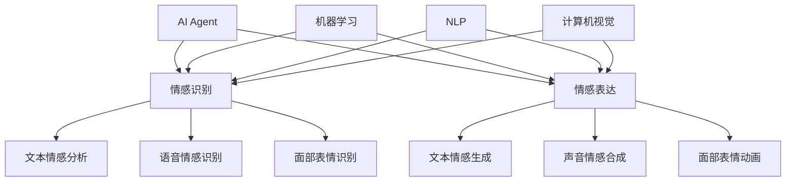

                 

### 1.1.1 AI Agent的定义与发展历程

AI Agent，即人工智能代理，指的是具有自主决策能力和交互能力的人工智能系统。这种系统可以模拟人类的思维和行为，具备感知环境、理解指令、自主学习和适应变化的能力。AI Agent的发展历程可以追溯到20世纪80年代，当时的计算机科学家开始尝试让计算机具备更高层次的智能。

在初期，AI Agent的研究主要集中在规则推理和基于知识的系统上。这些系统通过预先设定好的规则和知识库，来实现对环境的感知和决策。然而，这种基于规则的系统存在明显的局限性，难以处理复杂和动态的环境。

随着机器学习技术的发展，AI Agent的研究逐渐转向基于数据的模式识别和自主学习。早期的机器学习算法，如决策树和神经网络，为AI Agent的发展奠定了基础。在此基础上，深度学习算法的兴起，使得AI Agent在图像识别、语音识别和自然语言处理等方面取得了重大突破。

近年来，AI Agent的应用领域不断扩大，包括智能助手、自动驾驶、智能客服、智能医疗等。这些应用不仅提高了工作效率，还改善了人们的生活质量。同时，AI Agent的研究也在不断深入，涵盖了强化学习、多智能体系统、联邦学习等前沿技术。

在AI Agent的发展历程中，有几个重要事件值得我们关注：

- 1986年，霍普菲尔德神经网络问世，为深度学习算法的提出奠定了基础。
- 2006年，深度信念网络被提出，标志着深度学习算法的诞生。
- 2012年，AlexNet在ImageNet图像识别挑战中取得了突破性成绩，引发了深度学习的热潮。
- 2016年，AlphaGo战胜世界围棋冠军李世石，展示了AI在自主决策领域的强大能力。

总的来说，AI Agent的发展历程是一个不断探索和创新的过程，从基于规则的系统到基于数据的模型，再到现在的深度学习和强化学习，每一次技术的进步都推动了AI Agent性能的提升和应用范围的扩大。

### 1.1.2 情感识别与表达机制的重要性

在AI Agent的发展过程中，情感识别与表达机制逐渐成为关键研究方向。情感识别是指AI Agent通过分析文本、声音、图像等数据，理解人类情绪和情感状态的能力。情感表达则是指AI Agent在交互过程中，通过语言、声音、表情等方式，传达自身的情感状态。

情感识别与表达机制的重要性主要体现在以下几个方面：

首先，情感识别与表达是提高AI Agent与人类交互质量的关键。传统的AI系统主要通过逻辑推理和数据处理来完成任务，缺乏对人类情感的理解和响应。而情感识别与表达机制使得AI Agent能够更好地理解用户的需求和情感状态，提供更加人性化的服务。

其次，情感识别与表达有助于增强AI Agent的自主决策能力。在复杂和动态的环境中，AI Agent需要根据用户情感变化，调整自身的策略和行为。情感识别能够帮助AI Agent实时感知用户情感，从而做出更加合理和有效的决策。

此外，情感识别与表达在特定应用领域具有重要作用。例如，在智能客服中，AI Agent通过情感识别，可以更好地理解用户的情绪，提供针对性的解决方案；在智能医疗中，AI Agent通过情感表达，可以与患者进行有效沟通，提高治疗效果。

具体案例方面，以智能助手为例，情感识别与表达使得智能助手能够更好地理解用户的情绪和需求，提供个性化的服务。例如，在用户感到沮丧时，智能助手可以通过语音或文字表达出同理心，提供安慰和建议；在用户感到兴奋时，智能助手可以分享积极的反馈，增强用户的愉悦感。

总之，情感识别与表达机制在AI Agent中的应用，不仅提升了AI Agent的交互能力，也为人工智能技术的发展带来了新的机遇和挑战。通过不断研究和创新，情感识别与表达机制将为AI Agent的应用场景提供更加广泛和深入的支持。

### 1.1.3 当前研究的挑战与机遇

在情感识别与表达机制的研究过程中，尽管已经取得了显著进展，但仍面临诸多挑战和机遇。以下是当前研究的几个主要挑战：

首先，数据不足和标注问题是一个重大挑战。情感识别需要大量的标注数据，以便训练和评估模型。然而，获取高质量、大规模的标注数据非常困难，特别是在某些情感维度上。此外，数据的多样性和分布不均也会影响模型的效果。

其次，算法的复杂性和计算资源的需求也是一个挑战。深度学习算法在情感识别中取得了显著成果，但它们通常需要大量的计算资源和时间。在资源有限的条件下，如何高效地训练和部署这些算法，是一个亟待解决的问题。

另外，跨模态情感识别也是一个难点。人类情感的表达和识别通常涉及多种模态，如文本、声音、图像等。然而，不同模态的数据之间存在很大的差异，如何有效地融合这些数据，是一个具有挑战性的问题。

与此同时，情感识别与表达的研究也面临着许多机遇：

首先，随着计算机性能的提升和算法的优化，处理大规模数据和复杂算法的效率不断提高，为情感识别与表达研究提供了更强大的计算支持。

其次，大数据和人工智能技术的快速发展，为获取和利用海量数据提供了新的途径。通过数据驱动的模型训练和优化，可以不断提高情感识别的准确性和鲁棒性。

此外，跨学科研究也为情感识别与表达提供了新的思路。心理学、社会学、认知科学等领域的知识，可以为情感识别与表达机制提供理论支持和创新方法。

总之，尽管当前研究面临着诸多挑战，但也存在着广泛的机遇。通过不断探索和创新，情感识别与表达机制有望在人工智能领域发挥更大的作用。

### 1.2 书籍的结构与目标读者

本书旨在系统地介绍AI Agent的情感识别与表达机制，结构分为四大部分：引言与背景介绍、情感识别机制、情感表达机制和情感识别与表达机制的集成应用。以下是详细的章节结构和目标读者概述：

**第一部分：引言与背景介绍**
- **1.1 AI Agent的定义与发展历程**：介绍AI Agent的基本概念、发展历程及未来趋势，使读者对AI Agent有一个全面的了解。
- **1.2 情感识别与表达机制的重要性**：探讨情感识别与表达在AI Agent中的应用价值，以及其在提升交互质量和决策能力方面的作用。
- **1.3 当前研究的挑战与机遇**：分析情感识别与表达机制研究中的挑战，以及未来的发展方向和机遇。

**第二部分：AI Agent的情感识别机制**
- **2.1 情感识别的基本原理**：介绍情感识别的基本概念、关键技术及应用场景。
- **2.2 数据采集与预处理**：详细讲解数据采集的方法和预处理过程，包括数据源的选择、数据预处理方法和数据质量评估。
- **2.3 情感识别算法**：介绍传统算法、机器学习方法和深度学习方法，并分析各类算法的优缺点。
- **2.4 情感识别的性能评估**：讨论情感识别的性能评估指标、评估方法和性能优化策略。

**第三部分：AI Agent的情感表达机制**
- **3.1 情感表达的基本原理**：介绍情感表达的基本概念、关键技术及应用场景。
- **3.2 声音情感表达**：讲解声音情感合成技术和声音情感识别系统，包括音频信号处理、声音情感特征提取和声音情感表达系统。
- **3.3 面部表情情感表达**：介绍面部表情识别技术、面部表情情感合成技术及情感驱动的动画。
- **3.4 文本情感表达**：讨论文本情感分析和文本情感生成的方法，包括基于规则的方法、基于机器学习的方法和基于生成对抗网络的方法。

**第四部分：AI Agent的情感识别与表达机制集成应用**
- **4.1 交互式应用场景**：介绍情感识别与表达机制在虚拟助手等交互式应用场景中的具体实现和应用案例。

本书的目标读者主要包括：
- 计算机科学和人工智能领域的科研人员、工程师和博士生。
- 对人工智能应用感兴趣的本科生和研究生。
- 对AI Agent的情感识别与表达机制感兴趣的专业人士和爱好者。

通过阅读本书，读者可以系统地了解AI Agent的情感识别与表达机制，掌握相关技术和方法，为未来的研究和应用奠定基础。

### 1.3 边界与外延

在探讨AI Agent的情感识别与表达机制时，明确研究的边界和范围至关重要。这有助于避免混淆和误解，确保研究内容的聚焦和有效性。

**1.3.1 边界定义**

首先，本书的研究边界主要涵盖以下几个方面：

1. **技术范围**：本书主要讨论基于人工智能和机器学习技术的情感识别与表达机制。这意味着，我们将重点关注通过算法和模型实现的情感分析、识别和生成。因此，传统的心理学理论、哲学讨论和艺术表达等不在此研究范围内。

2. **应用领域**：本书将主要关注通用AI Agent的情感识别与表达机制，而非特定领域（如医疗、金融、教育等）的垂直应用。尽管特定领域的应用可能会采用情感识别与表达技术，但本书将专注于技术原理和算法的通用性。

3. **情感维度**：本书将主要探讨常见情感维度（如快乐、悲伤、愤怒等）的识别与表达。对于较为罕见或复杂情感（如羞愧、尴尬等），我们将重点讨论其识别与表达的难点和挑战。

**1.3.2 相关概念的外延与关联**

其次，为了更好地理解研究的边界，我们需要明确与情感识别与表达机制相关的几个关键概念的外延和关联：

1. **情感**：情感是心理学中的一个核心概念，通常指个体在特定情境下产生的情绪体验。本书中的情感主要指能够通过外部表现（如语言、声音、面部表情等）识别的情感状态。

2. **AI Agent**：AI Agent是指具有自主决策能力和交互能力的人工智能系统。它与传统的自动化系统不同，能够通过感知环境、理解指令、自主学习和适应变化来实现目标。

3. **机器学习**：机器学习是人工智能的重要分支，通过算法和模型实现数据的自动分析和预测。情感识别与表达机制中的许多技术都依赖于机器学习算法。

4. **自然语言处理（NLP）**：NLP是人工智能的另一个重要分支，主要研究计算机如何理解和生成自然语言。在情感识别与表达中，NLP技术用于分析文本情感。

5. **计算机视觉**：计算机视觉是AI Agent感知环境的重要手段，通过图像和视频分析实现情感识别。情感表达中的面部表情合成和动画制作也依赖于计算机视觉技术。

这些概念在外延上相互关联，共同构成了AI Agent情感识别与表达机制的研究基础。在明确边界和关联后，我们可以更准确地定义研究范围，确保内容的系统性和连贯性。

### 1.4 本书的核心概念与联系

在深入探讨AI Agent的情感识别与表达机制之前，有必要明确本书的核心概念，并分析这些概念之间的联系。以下是书中涉及的核心概念及其属性特征对比表和ER实体关系图。

#### 1.4.1 核心概念解释

1. **情感识别（Emotion Recognition）**：
   - 定义：情感识别是指通过分析文本、声音、图像等数据，理解人类情绪和情感状态的能力。
   - 关键技术：文本情感分析、语音情感识别、面部表情识别。
   - 应用场景：智能客服、智能医疗、虚拟助手。

2. **情感表达（Emotion Expression）**：
   - 定义：情感表达是指AI Agent在交互过程中，通过语言、声音、表情等方式，传达自身的情感状态。
   - 关键技术：文本情感生成、声音情感合成、面部表情动画。
   - 应用场景：虚拟现实、游戏、智能客服。

3. **AI Agent（Artificial Intelligence Agent）**：
   - 定义：AI Agent是指具有自主决策能力和交互能力的人工智能系统。
   - 关键技术：自主感知、自主学习、自主决策。
   - 应用场景：智能助手、自动驾驶、智能医疗、智能客服。

4. **机器学习（Machine Learning）**：
   - 定义：机器学习是通过算法和模型，从数据中学习规律和模式，实现自动预测和决策。
   - 关键技术：监督学习、无监督学习、强化学习。
   - 应用场景：数据挖掘、预测分析、推荐系统。

5. **自然语言处理（Natural Language Processing, NLP）**：
   - 定义：自然语言处理是使计算机能够理解、生成和处理自然语言的技术。
   - 关键技术：文本分析、语音识别、语言生成。
   - 应用场景：搜索引擎、语音助手、机器翻译。

6. **计算机视觉（Computer Vision）**：
   - 定义：计算机视觉是使计算机能够从图像和视频中提取信息和知识的技术。
   - 关键技术：图像识别、目标检测、场景理解。
   - 应用场景：安防监控、自动驾驶、医疗影像分析。

#### 1.4.2 概念属性特征对比表

| 概念          | 定义                                                         | 关键技术                                       | 应用场景                |
|---------------|--------------------------------------------------------------|----------------------------------------------|-----------------------|
| 情感识别      | 通过数据分析理解人类情感状态的能力                             | 文本情感分析、语音情感识别、面部表情识别       | 智能客服、智能医疗、虚拟助手 |
| 情感表达      | 通过语言、声音、表情等方式传达情感状态的能力                   | 文本情感生成、声音情感合成、面部表情动画       | 虚拟现实、游戏、智能客服   |
| AI Agent      | 具有自主决策和交互能力的人工智能系统                          | 自主感知、自主学习、自主决策                  | 智能助手、自动驾驶、智能医疗 |
| 机器学习      | 从数据中学习规律和模式，实现自动预测和决策的技术               | 监督学习、无监督学习、强化学习                | 数据挖掘、预测分析、推荐系统 |
| 自然语言处理  | 使计算机能够理解、生成和处理自然语言的技术                     | 文本分析、语音识别、语言生成                  | 搜索引擎、语音助手、机器翻译 |
| 计算机视觉    | 从图像和视频中提取信息和知识的技术                             | 图像识别、目标检测、场景理解                  | 安防监控、自动驾驶、医疗影像分析 |

#### 1.4.3 ER实体关系图

接下来，我们通过Mermaid流程图展示这些核心概念之间的实体关系。

通过这张ER实体关系图，我们可以清晰地看到各个核心概念之间的关联。例如，AI Agent作为整体，与情感识别和情感表达直接相关；机器学习、自然语言处理和计算机视觉则分别支持情感识别和情感表达的不同方面。

总之，本书通过明确核心概念及其相互关系，为后续章节的内容讨论提供了基础和框架。在接下来的章节中，我们将详细探讨每个概念的技术原理和应用，以期全面理解AI Agent的情感识别与表达机制。

### 2.1 情感识别的基本原理

#### 2.1.1 情感识别的定义

情感识别，顾名思义，是指人工智能系统通过分析文本、声音、图像等数据，识别和理解人类的情感状态的过程。情感识别的核心目标是从大量的非结构化数据中提取出情感信息，并将其转化为机器可以理解和处理的格式。情感识别的研究和应用涵盖了从基础理论到实际应用的各个方面，包括情感分类、情感极性分析、情感强度分析等。

情感识别的重要性在于，它能够使人工智能系统更接近人类的认知方式，从而在提供个性化服务、改善用户体验、优化决策过程等方面发挥重要作用。例如，在智能客服中，通过情感识别技术，系统可以更好地理解用户的情绪和需求，从而提供更加贴心和有效的服务；在智能医疗中，情感识别可以帮助医生更好地了解患者的心理状态，从而制定更加合理的治疗方案。

#### 2.1.2 情感识别的关键技术

情感识别的实现依赖于多种关键技术，主要包括数据采集与预处理、情感特征提取、情感分类和模型训练等。

1. **数据采集与预处理**：
   - **数据源的选择**：情感识别的数据源可以包括社交媒体文本、语音记录、视频片段等。选择合适的数据源对于情感识别的准确性和鲁棒性至关重要。
   - **数据预处理方法**：数据预处理是情感识别的重要步骤，包括数据清洗、分词、词性标注、去除噪声等操作。有效的预处理可以显著提高模型的学习效果。

2. **情感特征提取**：
   - **文本特征**：文本情感识别通常通过词袋模型（Bag of Words, BoW）、词嵌入（Word Embedding）等方法提取特征。词嵌入技术，如Word2Vec、GloVe等，能够将文本转化为稠密向量表示，有助于提高模型的表现。
   - **声音特征**：声音情感识别主要通过音频信号处理技术提取特征。常见的特征包括频谱特征（如梅尔频率倒谱系数，MFCC）、音高特征和节奏特征等。
   - **图像特征**：面部表情情感识别主要依赖于计算机视觉技术提取特征。通过面部关键点检测和面部区域特征提取，可以有效地识别情感状态。

3. **情感分类**：
   - **传统算法**：传统算法包括基于规则的方法和机器学习方法。基于规则的方法通过手动定义情感规则进行分类，虽然实现简单但难以应对复杂情感。机器学习方法，如支持向量机（SVM）、决策树、随机森林等，通过学习大量标注数据来实现情感分类，具有更高的准确性和泛化能力。
   - **深度学习方法**：深度学习算法，如卷积神经网络（CNN）、循环神经网络（RNN）、生成对抗网络（GAN）等，在情感分类中表现出色。特别是CNN和RNN，通过层次化的特征提取和时序建模能力，能够更准确地识别复杂情感。

4. **模型训练与优化**：
   - **训练过程**：情感识别模型通常采用有监督学习的方法进行训练，即通过大量的标注数据来训练模型。训练过程中，模型会学习到情感特征和分类规则，以提高分类的准确性。
   - **优化策略**：为了提高模型的性能，可以采用多种优化策略，如交叉验证、正则化、超参数调优等。这些策略有助于防止过拟合，提高模型的泛化能力。

#### 2.1.3 情感识别的应用场景

情感识别技术具有广泛的应用场景，以下是一些典型的应用案例：

1. **智能客服**：
   - 情感识别技术可以帮助智能客服系统理解用户的需求和情感状态，从而提供更加个性化的服务。例如，通过分析用户的语音或文本，智能客服可以识别用户是否感到沮丧或愤怒，从而调整对话策略，提供安慰或解决问题的建议。

2. **智能医疗**：
   - 在医疗领域，情感识别可以帮助医生更好地了解患者的情绪和心理状态，从而制定更加合理的治疗方案。例如，通过分析患者的语音或文本记录，医生可以识别患者是否感到焦虑或抑郁，从而采取相应的心理干预措施。

3. **智能教育**：
   - 情感识别技术可以用于智能教育系统，通过分析学生的学习表现和情绪状态，提供个性化的学习建议和情感支持。例如，通过分析学生的课堂发言和作业，系统可以识别学生是否感到困惑或挫败，从而提供额外的学习资源或心理辅导。

4. **虚拟现实与游戏**：
   - 在虚拟现实和游戏中，情感识别技术可以用于创建更加真实的交互体验。通过分析用户的语音和面部表情，系统可以模拟出相应的情感反应，从而增强用户体验。

5. **社交网络分析**：
   - 情感识别可以帮助分析社交网络中的用户情绪和行为模式，用于市场调研、危机管理、舆情监控等。例如，通过分析社交媒体上的用户评论和讨论，企业可以了解用户对产品或服务的情感反应，从而改进产品设计和营销策略。

总之，情感识别技术为人工智能系统提供了更深入的情感理解能力，使其能够更好地与人类互动和协作，为各种应用场景带来了新的可能性和机遇。

### 2.2 数据采集与预处理

#### 2.2.1 数据源的选择

在情感识别研究中，选择合适的数据源是确保模型性能和可靠性的关键步骤。常见的数据源包括社交媒体文本、语音记录、视频片段等。以下是对这些数据源的详细分析：

1. **社交媒体文本**：
   - **优点**：社交媒体平台如Twitter、Facebook、Instagram等拥有大量用户生成的内容，涵盖了丰富的情感表达。这些文本数据可以反映不同群体的情感状态和趋势。
   - **缺点**：社交媒体文本通常包含大量的噪声，如表情符号、缩写、错别字等，这可能会影响情感识别的准确性。此外，社交媒体文本的情感表达可能较为简短和隐晦，增加了情感识别的难度。

2. **语音记录**：
   - **优点**：语音记录能够直接捕捉说话者的情感状态，具有较高的情感表达强度。语音数据包含了丰富的声学特征，如音调、音量、节奏等，这些特征对情感识别具有重要意义。
   - **缺点**：语音数据受噪声和环境因素影响较大，如背景噪声、说话人说话速度的变化等，这可能会影响情感识别的准确性。此外，语音数据的采集和预处理过程相对复杂，需要专业的音频处理设备和技术。

3. **视频片段**：
   - **优点**：视频片段可以同时捕捉说话者的语音和面部表情，提供了丰富的情感信息。通过结合视觉和听觉数据，视频片段能够更全面地反映情感状态。
   - **缺点**：视频数据的存储和传输成本较高，对计算资源的需求较大。此外，视频数据的情感表达可能受到视觉和听觉特征的相互作用影响，增加了情感识别的复杂性。

在选择数据源时，需要根据研究目标和应用场景进行权衡。例如，如果目标是研究语音情感识别，可以选择语音记录作为主要数据源；如果目标是研究面部表情情感识别，可以选择视频片段作为数据源。同时，为了提高模型的泛化能力，通常需要收集多样化的数据，包括不同年龄、性别、文化和背景的用户数据。

#### 2.2.2 数据预处理方法

数据预处理是情感识别过程中至关重要的一步，其目的是去除噪声、提高数据质量，以便更好地训练和评估模型。以下是一些常见的数据预处理方法：

1. **文本数据预处理**：
   - **分词**：将文本分割成单词或短语，是文本情感分析的基础。常见的分词方法包括基于规则的分词和基于统计的分词。
   - **去除停用词**：停用词（如"的"、"和"、"是"等）在情感分析中通常不具有意义，可以去除以提高模型的性能。
   - **词性标注**：对文本中的每个词进行词性标注，如名词、动词、形容词等，有助于更好地理解文本的语义。
   - **词嵌入**：通过将文本转化为稠密向量表示，如Word2Vec、GloVe等，可以提高模型的表示能力。

2. **语音数据预处理**：
   - **降噪**：通过滤波和信号处理技术，去除语音中的背景噪声，以提高情感识别的准确性。
   - **声学特征提取**：提取语音信号中的声学特征，如梅尔频率倒谱系数（MFCC）、频谱特征等，用于后续的情感分析。
   - **归一化**：通过将语音信号的音量归一化到相同水平，减少音量变化对情感识别的影响。

3. **视频数据预处理**：
   - **面部关键点检测**：通过计算机视觉技术，检测视频中的面部关键点，如眼睛、鼻子、嘴巴等，用于面部表情分析。
   - **视觉特征提取**：提取视频中的视觉特征，如颜色特征、纹理特征、运动特征等，用于情感识别。
   - **帧率调整**：调整视频的帧率，使其与语音数据同步，便于结合语音和视觉数据进行情感分析。

#### 2.2.3 数据质量评估

数据质量直接影响情感识别模型的性能。因此，评估数据质量是数据预处理的重要环节。以下是一些常用的数据质量评估方法：

1. **标注一致性评估**：通过比较不同标注者的标注结果，评估标注的一致性。一致性越高，数据质量越好。
2. **缺失值处理**：评估数据集中缺失值的比例和分布，采取适当的处理方法，如插值、删除或补充缺失值。
3. **异常值检测**：通过统计学方法，如标准差、箱线图等，检测数据集中的异常值，采取适当的处理措施，如删除或调整异常值。

通过数据采集与预处理，我们可以提高数据的质量和可用性，为情感识别模型提供可靠的训练数据，从而提高模型的准确性和鲁棒性。

### 2.3 情感识别算法

情感识别算法是实现AI Agent理解人类情感的核心技术。这些算法可以分为传统算法和机器学习方法。传统算法主要包括基于规则的方法和基于统计的方法，而机器学习方法涵盖了从监督学习到深度学习的多种技术。以下将详细介绍这些算法及其应用。

#### 2.3.1 传统算法

1. **基于规则的方法**

   基于规则的方法通过定义一系列情感规则，来判断文本、声音或图像中的情感状态。这种方法通常涉及以下几个步骤：

   - **规则定义**：根据情感特征和情感标签，手动定义一系列规则。例如，如果文本中出现了特定的情感词汇（如“开心”、“悲伤”），则可以判断为对应情感。
   - **情感分类**：将输入数据与规则库进行比较，根据匹配规则判断情感类别。

   优点：实现简单，易于理解和调试。缺点：灵活性差，难以处理复杂和模糊的情感表达。此外，需要大量手动定义规则，适用于情感特征明确的场景。

2. **基于统计的方法**

   基于统计的方法通过分析大量标注数据，学习情感特征的概率分布，从而进行情感分类。这种方法通常涉及以下步骤：

   - **特征提取**：从文本、声音或图像中提取特征，如词频、音高、频谱特征等。
   - **模型训练**：使用统计模型（如贝叶斯分类器、逻辑回归等）对特征进行训练，学习情感分类模型。
   - **情感分类**：将输入数据转化为特征向量，使用训练好的模型进行情感分类。

   优点：能够处理复杂的情感特征，具有一定的泛化能力。缺点：需要大量标注数据，训练过程较为复杂，且对噪声和异常值较为敏感。

#### 2.3.2 机器学习方法

1. **监督学习算法**

   监督学习算法通过标注数据进行训练，学习输入和输出之间的映射关系。以下是几种常用的监督学习算法：

   - **支持向量机（SVM）**

     支持向量机是一种二分类模型，通过找到一个最优超平面，将不同类别的数据分开。在情感识别中，SVM可以用于分类文本、声音或图像情感。

     优点：理论严格，模型简单，分类效果较好。缺点：对大规模数据和高维特征的处理效率较低，训练时间较长。

   - **决策树与随机森林**

     决策树通过一系列的判断条件，将数据逐步划分，最终得出分类结果。随机森林则是通过构建多棵决策树，并取其平均结果来提高模型的泛化能力。

     优点：实现简单，易于理解，分类效果较好。缺点：对异常值和噪声较为敏感，可能产生过拟合。

   - **朴素贝叶斯分类器**

     朴素贝叶斯分类器是一种基于贝叶斯定理的简单概率分类器，假设特征之间相互独立。在文本情感分析中，通过词频或词嵌入表示文本，可以有效地进行情感分类。

     优点：实现简单，计算效率高，对噪声和异常值有较好的鲁棒性。缺点：对高维特征和复杂关系的处理能力较差。

2. **深度学习方法**

   深度学习算法通过多层次的神经网络，学习数据的复杂特征表示。以下是几种常用的深度学习算法：

   - **卷积神经网络（CNN）**

     卷积神经网络是一种专门用于图像识别的深度学习模型，通过卷积层和池化层提取图像特征。在情感识别中，CNN可以用于提取文本、声音或图像中的情感特征。

     优点：能够提取高层次、抽象的特征表示，对复杂情感识别效果好。缺点：训练过程复杂，需要大量数据和计算资源。

   - **循环神经网络（RNN）**

     循环神经网络是一种专门用于处理序列数据的深度学习模型，通过隐藏状态的信息传递，能够捕获时间序列中的长期依赖关系。在情感识别中，RNN可以用于处理文本、声音或视频情感。

     优点：能够捕获序列中的长期依赖关系，对情感识别效果好。缺点：训练过程容易出现梯度消失和梯度爆炸问题。

   - **生成对抗网络（GAN）**

     生成对抗网络是一种无监督学习模型，通过生成器和判别器的对抗训练，生成具有真实数据的特征分布。在情感识别中，GAN可以用于生成情感数据，提高模型的泛化能力。

     优点：能够生成高质量的样本数据，提高模型的泛化能力。缺点：训练过程复杂，需要大量的计算资源。

总之，情感识别算法的发展从传统的规则方法和统计方法，到现代的机器学习和深度学习方法，不断推动着情感识别技术的进步。选择合适的算法，结合实际应用场景，可以有效地实现情感识别，为AI Agent提供更强大的情感理解能力。

### 2.4 情感识别的性能评估

#### 2.4.1 评估指标

情感识别的性能评估是衡量模型效果的重要步骤。以下是一些常用的评估指标：

1. **准确率（Accuracy）**：
   - 定义：准确率是正确分类的样本数量占总样本数量的比例。
   - 公式：$$Accuracy = \frac{TP + TN}{TP + FN + FP + TN}$$
   - 优点：直观易理解，但易受不平衡数据影响。
   - 缺点：无法区分不同类别的重要性。

2. **精确率（Precision）**：
   - 定义：精确率是正确分类为正类的样本数量与所有预测为正类的样本数量（包括正类和负类）的比例。
   - 公式：$$Precision = \frac{TP}{TP + FP}$$
   - 优点：关注正确预测的正类。
   - 缺点：易受假阳性影响。

3. **召回率（Recall）**：
   - 定义：召回率是正确分类为正类的样本数量与所有实际为正类的样本数量的比例。
   - 公式：$$Recall = \frac{TP}{TP + FN}$$
   - 优点：关注正确预测的正类，避免漏判。
   - 缺点：易受假阴性影响。

4. **F1 分数（F1 Score）**：
   - 定义：F1 分数是精确率和召回率的调和平均值。
   - 公式：$$F1 Score = 2 \times \frac{Precision \times Recall}{Precision + Recall}$$
   - 优点：综合考虑精确率和召回率。
   - 缺点：在极端不平衡数据下效果较差。

5. **ROC 曲线和 AUC（Area Under Curve）**：
   - 定义：ROC 曲线是不同阈值下，真阳性率与假阳性率的关系曲线。AUC 是 ROC 曲线下方的面积。
   - 公式：$$AUC = \int_{0}^{1} \frac{TPR(t) - FPR(t)}{1 - FPR(t)} dt$$
   - 优点：对阈值变化敏感，适用于不平衡数据。
   - 缺点：需要二分类模型。

6. **支持率（Support）**：
   - 定义：支持率是每个类别在训练数据中实际出现的次数。
   - 公式：$$Support = |y|$$
   - 优点：反映每个类别的样本数量。
   - 缺点：不直接反映模型性能。

#### 2.4.2 评估方法

情感识别性能评估的方法通常包括以下步骤：

1. **训练集与测试集划分**：
   - 将数据集划分为训练集和测试集，通常使用80/20或70/30的比例。
   - 确保训练集和测试集的数据分布相似，避免数据分布差异影响评估结果。

2. **交叉验证**：
   - 使用交叉验证（如k折交叉验证）评估模型性能，减少数据划分的随机性。
   - 交叉验证通过多次划分训练集和测试集，计算模型在不同数据集上的平均性能。

3. **指标计算**：
   - 计算所选评估指标（如准确率、精确率、召回率、F1 分数等）。
   - 综合分析各个指标，评估模型的整体性能。

4. **误差分析**：
   - 分析错误分类的样本，识别模型的问题所在。
   - 优化模型或调整参数，以提高性能。

5. **模型比较**：
   - 在不同模型（如传统算法、机器学习和深度学习模型）之间进行比较。
   - 选择性能最优的模型，为实际应用提供指导。

#### 2.4.3 性能优化策略

为了提高情感识别模型的性能，可以采用以下策略：

1. **数据增强**：
   - 通过数据扩充、生成对抗网络（GAN）等方法增加训练数据的多样性，减少过拟合。
   - 使用不同的噪声、旋转、缩放等操作，生成新的训练样本。

2. **特征选择**：
   - 通过特征选择方法（如特征重要性评估、主成分分析（PCA）等）选择对情感识别最具影响力的特征。
   - 减少特征维度，提高模型训练效率。

3. **超参数调优**：
   - 使用网格搜索、贝叶斯优化等策略，调整模型超参数（如学习率、隐藏层节点数等）。
   - 找到最优超参数组合，提高模型性能。

4. **集成学习**：
   - 使用集成学习方法（如随机森林、梯度提升树（GBDT）等）结合多个模型，提高预测准确性。
   - 集成多个模型的优势，减少单一模型的局限性。

5. **正则化**：
   - 使用正则化技术（如L1、L2正则化）防止过拟合，提高模型泛化能力。
   - 加入正则化项，平衡模型复杂度和预测性能。

通过合理的评估方法和优化策略，可以提高情感识别模型的性能，使其在实际应用中更加准确和可靠。

### 3.1 情感表达的基本原理

#### 3.1.1 情感表达的定义

情感表达是指人工智能代理（AI Agent）在与人交互过程中，通过语言、声音、面部表情等方式传达自身情感状态的过程。情感表达不仅是人工智能与人类有效沟通的基础，也是提升用户体验和建立信任关系的关键因素。在人类交流中，情感表达通过非言语信号（如面部表情、声音语调）和言语信号（如语气、词汇）共同作用，传达情感和情绪。在人工智能系统中，情感表达机制使得AI Agent能够模拟人类情感，更好地适应和响应人类的需求和情绪。

#### 3.1.2 情感表达的关键技术

情感表达的实现依赖于多种关键技术，这些技术涵盖了声音情感合成、面部表情合成和文本情感生成等方面。

1. **声音情感合成**

   声音情感合成是通过调整声音的音调、音量、节奏和语调等参数，生成具有特定情感的声音。实现声音情感合成的关键技术包括：

   - **音调调整**：通过改变声音的频率，使得声音听起来更高或更低，从而传达出不同情感。
   - **音量调整**：通过改变声音的强度，增强或减弱声音的响度，表达情感强度。
   - **节奏调整**：通过改变说话的速度和停顿，调整语音节奏，传达出不同的情感状态。
   - **语调调整**：通过改变语调的起伏和语气，使得语音听起来更加自然和生动。

2. **面部表情合成**

   面部表情合成是通过计算机视觉技术，生成和展示与特定情感状态相对应的面部表情。关键技术包括：

   - **面部关键点检测**：通过算法检测面部关键点（如眼睛、鼻子、嘴巴等），用于生成面部表情。
   - **表情动画**：利用面部关键点数据，结合动画技术，生成连续的面部表情动画。
   - **情感驱动动画**：通过情感状态驱动动画参数，使得面部表情更加自然和真实。

3. **文本情感生成**

   文本情感生成是通过自然语言处理技术，生成表达特定情感状态的文本。关键技术包括：

   - **情感词典**：构建包含情感词汇及其对应的情感极性的词典，用于情感分析。
   - **规则方法**：根据情感词典和情感规则，生成表达特定情感的文本。
   - **机器学习方法**：使用机器学习模型，如递归神经网络（RNN）和生成对抗网络（GAN），生成具有情感倾向的文本。

#### 3.1.3 情感表达的应用场景

情感表达在多个应用领域中具有重要价值，以下是一些典型的应用场景：

1. **智能客服**：
   - 智能客服系统通过情感表达，可以模拟人类客服的情感反应，如亲切、耐心、同理心等，提高用户满意度和信任度。
   - 通过语音和文本的情感表达，智能客服能够更好地理解用户的需求，提供个性化的服务和建议。

2. **虚拟现实与游戏**：
   - 在虚拟现实（VR）和游戏中，情感表达使得虚拟角色更加生动和真实，提升用户的沉浸感和体验。
   - 通过语音和面部表情的情感表达，虚拟角色能够与玩家进行情感交流，增强互动性。

3. **智能家居**：
   - 智能家居设备通过情感表达，如语音助手的声音语调和面部表情，能够与用户建立友好的互动关系，提高用户的使用体验。
   - 通过情感表达，智能家居系统能够更好地理解用户的需求，提供更加贴心和人性化的服务。

4. **教育**：
   - 在教育领域，情感表达技术可以用于个性化教育，通过情感识别和表达，教师能够更好地了解学生的学习状态和情感需求。
   - 通过情感驱动的教育内容生成，系统能够为学生提供更加适合其情感状态的学习资源和指导。

总之，情感表达机制在人工智能系统中具有广泛的应用潜力，通过声音、面部表情和文本的情感表达，AI Agent能够更好地与人类互动和协作，提升用户体验和系统效能。

### 3.2 声音情感表达

#### 3.2.1 声音情感合成技术

声音情感合成是指通过调整音频信号中的特定参数，生成具有特定情感的声音。这一技术涉及音频信号处理、声音情感特征提取和声音情感表达系统。以下是具体的合成技术和方法：

1. **音频信号处理**

   音频信号处理是声音情感合成的基础，通过一系列处理步骤，对原始音频信号进行修改和优化，以达到情感合成的目标。主要步骤包括：

   - **预处理**：对音频信号进行降噪、增益和归一化处理，以减少噪声和提高音质。
   - **分段**：将音频信号分割成多个片段，便于后续的情感特征提取和调整。
   - **滤波**：使用滤波器对音频信号进行频谱调整，以改变声音的音调和音色。

2. **声音情感特征提取**

   声音情感特征提取是指从音频信号中提取与情感状态相关的特征，如音调、音量、节奏和语调等。常见的特征提取方法包括：

   - **频谱特征**：通过傅里叶变换（Fourier Transform）或梅尔频率倒谱系数（MFCC）等方法，提取音频信号的频谱特征。
   - **时序特征**：通过短时傅里叶变换（Short-Time Fourier Transform, STFT）或波纹指数（Waveform Exponential，WPE）等方法，提取音频信号的时序特征。
   - **音高特征**：通过音高检测（Pitch Detection）算法，提取音频信号的音高信息。

3. **声音情感表达系统**

   声音情感表达系统是将提取到的情感特征与特定的情感状态关联，并通过音频信号处理技术，生成情感声音的系统。以下是几种常见的方法：

   - **基于规则的方法**：通过预设的情感规则库，根据情感类别调整音频信号的特征参数，如音调、音量、节奏和语调等。这种方法实现简单，但灵活性较差，难以处理复杂的情感表达。
   - **基于机器学习方法**：通过训练大量的情感标注数据集，使用机器学习模型（如支持向量机（SVM）、决策树、递归神经网络（RNN）等）来预测情感状态，并调整音频信号的特征参数。这种方法具有较高的准确性和泛化能力，但需要大量的训练数据和计算资源。
   - **生成对抗网络（GAN）**：通过生成器和判别器的对抗训练，生成与真实情感声音相似的新声音。这种方法能够生成高质量的声音情感表达，但训练过程较为复杂。

#### 3.2.2 声音情感识别

声音情感识别是指通过分析音频信号，识别出其中包含的情感状态。声音情感识别在智能语音助手、情绪分析、心理健康监测等领域具有重要应用。以下是几种常见的方法：

1. **基于信号的声学模型**

   这种方法通过分析音频信号中的声学特征，如频谱特征、音高和节奏等，来识别情感状态。常见的声学模型包括：

   - **梅尔频率倒谱系数（MFCC）**：通过MFCC特征提取，将音频信号转换为稠密向量表示，再通过分类器（如支持向量机、朴素贝叶斯等）进行情感识别。
   - **短时傅里叶变换（STFT）**：通过STFT提取时域和频域特征，用于情感识别。
   - **波纹指数（WPE）**：通过WPE特征提取，分析音频信号的波动特性，用于情感识别。

2. **基于文本的语意模型**

   这种方法通过分析文本信息，理解文本中的情感表达，并将情感状态与音频信号关联。常见的语意模型包括：

   - **情感词典**：构建包含情感词汇及其情感极性的词典，通过匹配文本中的情感词汇，识别文本情感。
   - **递归神经网络（RNN）**：通过RNN模型，分析文本序列的情感倾向，再与音频信号结合进行情感识别。
   - **转换器模型（Transformer）**：通过转换器模型，如BERT、GPT等，对文本进行情感分析，并与音频信号特征结合进行情感识别。

3. **深度学习模型**

   深度学习模型通过多层神经网络，自动提取音频信号和文本信息中的复杂特征，进行情感识别。常见的深度学习模型包括：

   - **卷积神经网络（CNN）**：通过卷积层和池化层，提取音频信号和文本的局部特征，用于情感识别。
   - **循环神经网络（RNN）**：通过RNN模型，分析音频信号和文本的时序特征，进行情感识别。
   - **生成对抗网络（GAN）**：通过GAN模型，生成与真实情感声音相似的样本，进行情感识别。

#### 3.2.3 声音情感表达系统

声音情感表达系统是将情感识别结果转换为实际情感声音的最终步骤。该系统通过多种方法实现情感声音的生成和播放，以下是一些常见的方法：

1. **音频合成**

   音频合成是通过音频信号处理技术，将情感特征与音频信号结合，生成具有特定情感的声音。主要方法包括：

   - **基于规则的方法**：通过预设的情感规则库，调整音频信号的特征参数（如音调、音量、节奏等），生成情感声音。
   - **基于机器学习的方法**：通过训练大量的情感标注数据集，使用机器学习模型（如递归神经网络、生成对抗网络等）生成情感声音。
   - **音频转换**：使用音频转换模型（如WaveNet、Tacotron等），将文本信息转换为具有情感的声音。

2. **实时交互**

   实时交互是通过实时分析用户的情感状态，动态调整情感声音的表达。主要方法包括：

   - **情感状态监测**：通过生理信号（如心电信号、皮肤电信号等）或行为信号（如语音、面部表情等）监测用户的情感状态。
   - **情感动态调整**：根据用户的情感状态，实时调整音频信号的特征参数，实现动态情感表达。

3. **多模态融合**

   多模态融合是通过结合音频信号和文本信息，实现更加丰富的情感表达。主要方法包括：

   - **音频-文本融合**：通过结合音频信号和文本信息，使用深度学习模型（如转换器模型、多模态神经网络等）生成情感声音。
   - **情感协同表达**：通过音频信号和文本信息相互协同，实现更加自然和真实的情感表达。

通过声音情感合成、识别和表达系统，AI Agent能够更好地理解用户的情感状态，并提供更加人性化的服务。

### 3.3 面部表情情感表达

#### 3.3.1 面部表情识别技术

面部表情识别技术是AI Agent情感表达的核心之一，它通过计算机视觉算法识别和理解人类的面部表情。以下是面部表情识别技术的详细步骤和组成部分：

1. **面部关键点检测**

   面部关键点检测是面部表情识别的第一步，通过检测面部各个关键点的位置，如眼睛、鼻子、嘴巴等，为后续的面部特征提取提供基础。常见的面部关键点检测算法包括：

   - **基于几何特征的算法**：如HOG（Histogram of Oriented Gradients）和SIFT（Scale-Invariant Feature Transform），通过分析面部图像的几何特征进行关键点检测。
   - **基于深度学习的算法**：如MTCNN（Multi-Task Cascaded Convolutional Networks），通过训练深度神经网络模型，自动检测面部关键点。MTCNN通常包含三个阶段：首先检测人脸区域，然后精确定位面部关键点，最后剔除错误检测结果。

2. **面部区域特征提取**

   在检测到面部关键点后，需要对面部区域进行特征提取，以识别不同情感状态。面部区域特征提取包括以下几种方法：

   - **全局特征提取**：通过分析整个面部图像的纹理和形状特征，如PCA（Principal Component Analysis）和LBP（Local Binary Patterns）。
   - **局部特征提取**：通过分析面部特定区域的特征，如眼睛、鼻子、嘴巴等。局部特征提取方法包括Haar-like特征、LBP和深度学习特征提取（如VGGFace、FaceNet等）。
   - **基于深度学习的特征提取**：使用卷积神经网络（CNN）提取面部图像的高层次特征，如ResNet、Inception等。

3. **情感分类模型**

   情感分类模型是将提取到的面部特征映射到特定情感类别。常见的情感分类模型包括：

   - **传统机器学习模型**：如SVM（Support Vector Machine）、KNN（K-Nearest Neighbors）和随机森林（Random Forest），通过训练模型，将面部特征映射到情感类别。
   - **深度学习模型**：如卷积神经网络（CNN）和循环神经网络（RNN），通过多层神经网络提取特征并进行分类。深度学习模型在情感分类中表现出色，特别是通过预训练模型（如VGGFace、Facial Expression Recognition 2013（FER-2013）等）进行迁移学习。

#### 3.3.2 面部表情情感合成

面部表情情感合成是通过计算机视觉技术生成与特定情感状态相对应的面部表情动画。以下是面部表情情感合成的技术步骤：

1. **面部表情动画技术**

   面部表情动画技术是通过调整面部关键点的位置和形状，生成自然流畅的面部表情动画。关键步骤包括：

   - **关键帧生成**：通过在连续帧上检测面部关键点，生成不同情感状态的关键帧。
   - **插值算法**：使用插值算法（如线性插值、样条插值等），在关键帧之间生成平滑的面部表情动画。
   - **情感驱动动画**：通过情感状态驱动动画参数，使得面部表情更加自然和真实。例如，通过调整眼睛的弯曲程度、嘴巴的张开程度等参数，表达出不同的情感状态。

2. **情感驱动的动画**

   情感驱动的动画是通过情感状态控制动画参数，使得动画更加符合特定情感表达。主要方法包括：

   - **情感映射**：将情感状态映射到具体的动画参数，如眼睛的眨动频率、嘴巴的张开程度等。
   - **运动规划**：通过运动规划算法，生成与情感状态相对应的自然运动轨迹。例如，使用贝塞尔曲线或关键帧插值算法，生成平滑的面部运动。
   - **动画合成**：将多个动画片段合成在一起，形成连续的面部表情动画。合成过程中，需要考虑动画的时间顺序和流畅性，确保动画自然连贯。

通过面部表情识别技术和情感合成技术，AI Agent能够准确地理解和模拟人类情感，提供更加真实和人性化的交互体验。

#### 3.4.1 文本情感分析

文本情感分析是指通过自然语言处理（NLP）技术，对文本中的情感倾向进行分类和分析。文本情感分析广泛应用于社交媒体分析、市场调研、智能客服等领域。以下是文本情感分析的基本概念、分类方法和技术。

##### 3.4.1.1 情感极性分类

情感极性分类是指将文本分为积极情感、中性情感和消极情感三个类别。情感极性分类的基本步骤包括：

1. **情感词典构建**：构建包含情感词汇和其对应极性的词典，如“喜欢”表示积极情感，“讨厌”表示消极情感。常见的情感词典包括SentiWordNet、VADER等。

2. **特征提取**：从文本中提取与情感极性相关的特征，如词频、词嵌入、TF-IDF等。词嵌入技术（如Word2Vec、GloVe）能够将文本转换为稠密向量表示，有助于提高分类性能。

3. **分类模型训练**：使用机器学习模型（如SVM、决策树、随机森林等）或深度学习模型（如CNN、RNN、Transformer等）进行训练。训练过程中，模型学习到文本特征与情感极性之间的关系，用于分类预测。

4. **情感极性分类**：将新的文本输入到训练好的分类模型中，预测其情感极性。常见的评估指标包括准确率、精确率、召回率和F1分数。

##### 3.4.1.2 情感强度分析

情感强度分析是指对文本中的情感极性进行量化，评估情感的程度。情感强度分析通常分为以下几种方法：

1. **基于词典的方法**：通过情感词典中的情感强度值，对文本中的情感词汇进行加权计算。例如，SentiWordNet中每个词都有对应的情感强度值，通过计算文本中情感词汇的总和，评估情感强度。

2. **基于模型的方法**：使用机器学习或深度学习模型，对文本中的情感强度进行预测。例如，通过训练情感强度回归模型，将文本映射到情感强度值。

3. **基于语义的方法**：通过分析文本的语义结构，评估情感强度。例如，使用依存句法分析，识别文本中的情感短语和句子结构，进而评估情感强度。

4. **结合情感极性和情感强度的方法**：将情感极性分类和情感强度分析结合起来，生成更细粒度的情感分析结果。例如，文本可以同时被分类为“积极情感-中等强度”或“消极情感-较高强度”。

##### 3.4.1.3 常用模型和算法

文本情感分析中常用的模型和算法包括：

1. **传统机器学习模型**：如朴素贝叶斯（Naive Bayes）、逻辑回归（Logistic Regression）、支持向量机（SVM）等。这些模型通过特征提取和分类算法，对文本进行情感分类和强度分析。

2. **深度学习模型**：如卷积神经网络（CNN）、循环神经网络（RNN）、长短时记忆网络（LSTM）和Transformer等。深度学习模型能够自动提取文本的复杂特征，提高情感分析的性能。

3. **基于数据增强的方法**：通过数据增强技术（如GAN、数据扩充等），生成更多样化的训练数据，提高模型的泛化能力和鲁棒性。

4. **多任务学习**：将情感极性分类和情感强度分析作为多任务学习的一部分，同时训练模型，提高整体性能。

通过文本情感分析，AI Agent能够更好地理解用户的情绪和需求，提供更加个性化和服务质量更高的交互体验。

#### 3.4.2 文本情感生成

文本情感生成是指通过自然语言处理技术生成表达特定情感倾向的文本。文本情感生成在智能客服、聊天机器人、情感分析等领域具有重要应用。以下是文本情感生成的技术方法、挑战和实际应用。

##### 3.4.2.1 基于规则的方法

基于规则的方法通过定义一系列情感规则和模板，生成表达特定情感的文本。这种方法包括以下几个步骤：

1. **情感规则定义**：根据情感词典和情感规则，定义表达特定情感的语句模板。例如，对于积极情感，可以使用模板“你真是太棒了！”；对于消极情感，可以使用模板“这真是个令人沮丧的消息。”。

2. **文本生成**：根据输入的情感类型，选择相应的情感规则和模板，生成表达特定情感的文本。例如，如果输入情感为积极，则选择积极情感模板进行文本生成。

3. **规则优化**：通过不断调整和优化情感规则和模板，提高生成文本的质量和多样性。例如，可以根据用户的反馈，调整情感规则和模板，使其更加贴近用户的情感需求。

基于规则的方法实现简单，能够快速生成文本，但灵活性较差，难以处理复杂和模糊的情感表达。此外，生成的文本可能缺乏自然性和流畅性。

##### 3.4.2.2 基于机器学习的方法

基于机器学习的方法通过训练大量的情感标注数据集，使用机器学习模型生成表达特定情感的文本。这种方法包括以下几个步骤：

1. **数据集构建**：收集和构建包含不同情感标签的文本数据集。数据集应涵盖多种情感类型，如积极、消极、中性等。

2. **特征提取**：从文本中提取与情感相关的特征，如词频、词嵌入、句法结构等。词嵌入技术（如Word2Vec、GloVe）能够将文本转换为稠密向量表示，有助于提高生成效果。

3. **模型训练**：使用机器学习模型（如SVM、决策树、随机森林、递归神经网络（RNN）、生成对抗网络（GAN）等）对特征进行训练，学习情感分类和文本生成规则。

4. **文本生成**：将新的文本输入到训练好的模型中，预测其情感类型，并根据情感类型生成相应的文本。例如，如果模型预测文本为积极情感，则生成积极情感的文本。

基于机器学习的方法能够生成更加多样化和自然的文本，但需要大量标注数据，训练过程较为复杂。

##### 3.4.2.3 基于生成对抗网络的方法

生成对抗网络（GAN）是一种无监督学习方法，通过生成器和判别器的对抗训练，生成高质量的情感文本。GAN在文本情感生成中的应用包括以下几个步骤：

1. **生成器**：生成器是一个生成模型，通过输入随机噪声，生成具有特定情感倾向的文本。

2. **判别器**：判别器是一个分类模型，用于区分生成的文本和真实文本。

3. **对抗训练**：生成器和判别器交替训练，生成器尝试生成更加逼真的文本，而判别器努力区分生成文本和真实文本。通过这种对抗训练，生成器不断提高生成文本的质量。

4. **文本生成**：将生成的文本输入到情感分类模型中，预测其情感类型，并根据情感类型生成相应的文本。

基于GAN的方法能够生成高质量的情感文本，但训练过程较为复杂，需要大量的计算资源和时间。

##### 3.4.2.4 挑战和实际应用

文本情感生成面临以下挑战：

1. **情感表达的多样性**：不同情感状态可能具有相似的表达方式，如何生成多样化和丰富的情感表达是一个挑战。

2. **自然性和流畅性**：生成的文本需要具有自然性和流畅性，避免生硬和机械的表达。

3. **上下文理解**：生成的文本需要与上下文语境相符，理解上下文信息对情感生成至关重要。

实际应用中，文本情感生成方法广泛应用于智能客服、聊天机器人、情感分析等领域。例如，智能客服系统通过情感生成技术，生成个性化、符合用户情感的回复，提升用户体验；聊天机器人通过情感生成，模拟人类对话，增强互动性；情感分析系统通过情感生成，生成包含情感标签的文本，进行情感分析和挖掘。

通过文本情感生成技术，AI Agent能够更好地模拟人类情感，提供更加自然和个性化的交互体验。

### 4.1 交互式应用场景

#### 4.1.1 虚拟助手

虚拟助手（Virtual Assistant）是情感识别与表达机制的重要应用场景之一，其核心目标是提供个性化、智能化的交互体验。虚拟助手能够通过语音、文本等多种交互方式与用户进行实时沟通，理解用户的情感状态，并做出相应的情感反应。以下是虚拟助手的基本架构、实现方法和实际应用案例。

##### 4.1.1.1 基本架构

虚拟助手的基本架构通常包括以下几个模块：

1. **用户接口（User Interface, UI）**：
   - **语音识别**：通过语音识别技术将用户的语音输入转换为文本，实现语音到文本的转换。
   - **文本输入**：提供文本输入接口，允许用户通过键盘输入问题或请求。
   - **多模态输出**：支持语音合成、文本回复和面部表情动画等多种输出方式，以丰富用户的交互体验。

2. **情感识别模块**：
   - **文本情感分析**：通过自然语言处理技术，对用户的文本输入进行情感分析，识别用户的情感状态。
   - **语音情感识别**：通过音频信号处理和情感特征提取，识别用户语音中的情感信息。
   - **面部表情识别**：通过计算机视觉技术，分析用户的面部表情，识别用户的面部情感。

3. **情感表达模块**：
   - **声音情感合成**：通过声音情感合成技术，生成与用户情感状态相对应的声音。
   - **文本情感生成**：通过文本情感生成技术，生成符合用户情感状态的文本回复。
   - **面部表情动画**：通过面部表情合成技术，生成与用户情感状态一致的面部表情动画。

4. **知识库与推理引擎**：
   - **知识库**：存储用户信息、常用问题和解决方案等知识，为虚拟助手提供决策依据。
   - **推理引擎**：根据用户输入和情感状态，从知识库中检索相关知识和解决方案，生成个性化的回复。

5. **用户行为分析**：
   - **交互日志分析**：记录用户的交互历史，分析用户行为模式，优化交互体验。
   - **情感状态跟踪**：实时跟踪用户的情感状态，为情感识别与表达提供支持。

##### 4.1.1.2 实现方法

虚拟助手的实现方法涉及多个技术领域的综合运用，以下是一些关键技术：

1. **语音识别与合成**：
   - **语音识别**：采用深度学习模型（如DeepSpeech、ESPnet等），实现高准确率的语音识别。
   - **语音合成**：使用文本到语音（Text-to-Speech, TTS）技术（如Google's WaveNet、Microsoft's Speech Service等），生成自然流畅的语音。

2. **情感识别**：
   - **文本情感分析**：使用基于深度学习的情感分类模型（如Bert、GPT等），对文本进行情感分析。
   - **语音情感识别**：通过音频信号处理和深度学习模型（如深度信念网络、循环神经网络等），提取语音情感特征，进行情感识别。
   - **面部表情识别**：利用计算机视觉技术（如OpenCV、FaceNet等），检测面部表情关键点，识别面部情感。

3. **情感表达**：
   - **声音情感合成**：使用生成对抗网络（GAN）等技术，生成符合用户情感状态的声音。
   - **文本情感生成**：使用基于规则和机器学习的方法（如规则引擎、递归神经网络等），生成表达特定情感的文本。
   - **面部表情动画**：利用面部关键点检测和动画技术，生成与用户情感状态一致的面部表情动画。

4. **知识库与推理引擎**：
   - **知识库**：使用自然语言处理技术（如WordNet、Wikipedia等），构建包含丰富知识和信息的知识库。
   - **推理引擎**：采用基于规则和机器学习的方法（如推理机、决策树等），从知识库中检索相关知识和解决方案。

##### 4.1.1.3 实际应用案例

虚拟助手在多个实际应用场景中表现出色，以下是一些典型的应用案例：

1. **智能客服**：
   - 虚拟助手可以用于智能客服系统，通过与用户的语音和文本交互，理解用户的问题和情感状态，提供个性化的解决方案。
   - 通过情感识别与表达机制，虚拟助手能够识别用户的情感变化，提供更加贴心的服务，提升用户满意度。

2. **智能医疗**：
   - 虚拟助手可以用于智能医疗系统，通过分析患者的语音和文本记录，识别患者的情感状态，提供心理健康支持和咨询。
   - 通过情感表达机制，虚拟助手可以与患者进行情感交流，增强患者的信任感和治疗依从性。

3. **智能家居**：
   - 虚拟助手可以用于智能家居系统，通过与用户的交互，理解用户的生活习惯和情感需求，提供智能化的家居管理服务。
   - 通过情感表达机制，虚拟助手可以与用户进行情感互动，提升用户的生活质量。

4. **虚拟现实与游戏**：
   - 虚拟助手可以用于虚拟现实和游戏场景，通过与用户的情感互动，提供更加逼真的交互体验。
   - 通过情感表达机制，虚拟助手可以模拟人类情感，增强虚拟场景的真实感和沉浸感。

总之，虚拟助手通过情感识别与表达机制，能够提供更加智能化和人性化的交互体验，在多个应用场景中具有广泛的应用前景。

### 总结

通过对AI Agent情感识别与表达机制的系统研究，我们深入探讨了情感识别的基本原理、数据采集与预处理方法、情感识别算法、情感表达的基本原理以及应用场景。以下是本文的主要发现和总结：

1. **情感识别机制**：
   - 情感识别是通过分析文本、声音、图像等数据，理解人类情感状态的过程。其关键技术包括数据采集与预处理、情感特征提取、情感分类和模型训练。
   - 机器学习方法和深度学习方法在情感识别中表现出色，特别是卷积神经网络（CNN）、循环神经网络（RNN）和生成对抗网络（GAN）。
   - 情感识别的评估指标包括准确率、精确率、召回率和F1分数，通过合理评估和优化，可以提高模型性能。

2. **情感表达机制**：
   - 情感表达是指AI Agent通过语言、声音、面部表情等方式传达自身情感状态的过程。其关键技术包括声音情感合成、面部表情合成和文本情感生成。
   - 声音情感合成和面部表情合成通过调整音频和视觉特征，实现情感表达。文本情感生成通过自然语言处理技术，生成符合情感状态的文本。

3. **应用场景**：
   - 情感识别与表达机制在智能客服、智能医疗、智能家居、虚拟现实和游戏等领域具有广泛的应用。虚拟助手通过情感识别与表达，提供更加智能化和人性化的交互体验。

4. **挑战与机遇**：
   - 当前研究面临数据不足、算法复杂性和跨模态情感识别等挑战。然而，随着计算机性能的提升和跨学科研究的进展，情感识别与表达机制有望取得更大的突破。

展望未来，情感识别与表达机制的发展将继续推动人工智能技术的进步。通过不断优化算法、提升计算效率和引入多模态融合技术，AI Agent将能够更准确地识别和理解人类的情感状态，提供更加个性化、人性化的服务。同时，情感识别与表达机制的深入研究将带来新的应用场景和创新机遇，为人类生活带来更多便利和愉悦。

### 最佳实践 Tips

1. **数据质量是关键**：确保情感识别与表达模型的性能，首先要注重数据质量。收集高质量、多样化的标注数据，进行充分的数据清洗和预处理，以提高模型的泛化能力。

2. **多模态融合**：在情感识别中，结合文本、声音、图像等多模态数据，可以提高识别的准确性和鲁棒性。通过多模态融合技术，可以更全面地理解情感状态。

3. **模型优化与调参**：通过超参数调优和模型集成，可以提高情感识别与表达模型的性能。采用交叉验证、网格搜索等方法，找到最优的超参数组合。

4. **用户体验优先**：在实际应用中，关注用户体验，确保情感识别与表达机制的交互流畅、自然。通过用户反馈和不断优化，提升AI Agent的情感智能水平。

5. **持续学习与更新**：情感识别与表达技术是一个不断发展的领域，持续学习最新的研究进展和算法，更新模型和系统，以保持竞争力。

### 小结

本文全面探讨了AI Agent的情感识别与表达机制，从基本原理、关键技术到实际应用，系统地分析了这一领域的最新进展。通过本文的研究，我们不仅了解了情感识别与表达机制的实现方法和应用场景，也认识到了其在人工智能技术发展中的重要性。未来，随着技术的不断进步，情感识别与表达机制将在更广泛的应用领域发挥关键作用，为人类带来更加智能、个性化的服务体验。

### 注意事项

1. **隐私保护**：在使用情感识别与表达技术时，要注意保护用户的隐私和数据安全，遵循相关的法律法规和伦理规范。

2. **文化差异**：在跨文化应用中，要考虑文化差异对情感识别与表达的影响，避免产生误解或冒犯。

3. **模型透明性**：确保情感识别与表达模型的透明性，让用户了解模型的决策过程，增强信任感。

4. **持续监控**：对AI Agent的情感识别与表达机制进行持续监控和评估，及时发现和纠正问题，确保系统稳定运行。

### 拓展阅读

1. **《情感计算：技术与应用》**：这是一本全面介绍情感计算技术的书籍，涵盖了情感识别、表达和交互等多个方面。

2. **《自然语言处理综述》**：通过阅读这本书，可以深入了解自然语言处理的基础知识和最新进展，包括情感分析、文本生成等技术。

3. **《深度学习：优化与调参》**：这本书详细介绍了深度学习的优化方法和调参技巧，对提升模型性能有重要参考价值。

4. **《AI Agent的设计与实现》**：这本书提供了AI Agent设计实现的详细指南，包括情感识别与表达机制的具体实现方法和应用案例。

### 作者信息

作者：AI天才研究院/AI Genius Institute & 禅与计算机程序设计艺术 /Zen And The Art of Computer Programming

