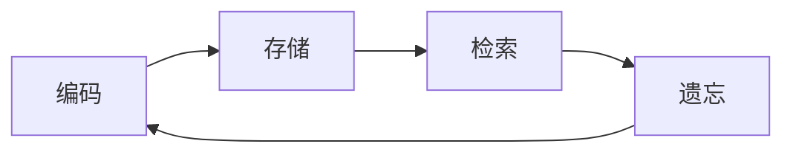
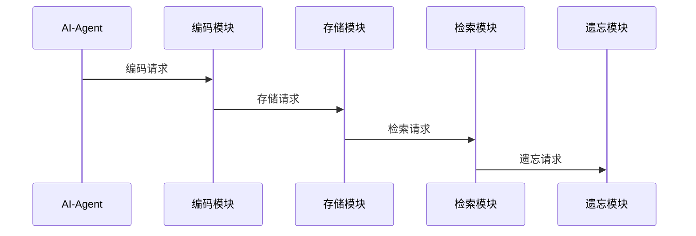
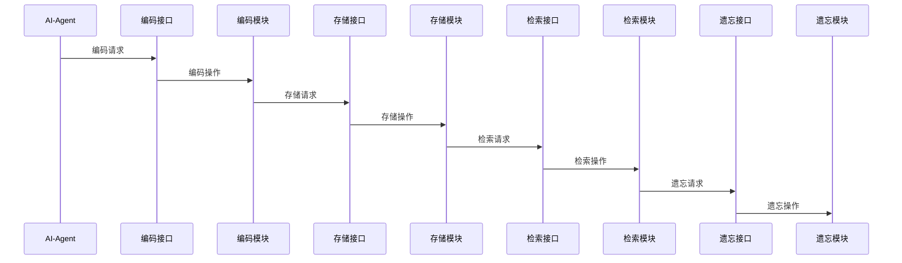

                 

# AI Agent的记忆机制：设计与实现

关键词：AI Agent、记忆机制、编码、存储、检索、遗忘

摘要：本文将探讨AI Agent中记忆机制的设计与实现，从背景介绍到核心概念，再到算法原理讲解，深入分析记忆机制的基本过程和技术实现。通过本文的阅读，读者将了解记忆机制在AI Agent中的重要作用，掌握设计合理记忆机制的方法和技巧。

## 第一部分：背景介绍与核心概念

### 1.1 问题背景

在AI Agent中，记忆机制是实现智能行为的关键。记忆机制如何设计，以支持有效且合理的知识存储与提取，成为研究的核心问题。一个优秀的记忆机制，能够使AI Agent在面对复杂任务时，能够快速、准确地提取所需信息，从而提高决策能力。

**问题描述**：在AI Agent中，如何设计一个高效的记忆机制，以支持知识存储、检索和遗忘等基本过程？

**问题解决**：通过设计合理的记忆机制，AI Agent能够更好地处理复杂任务，提高决策能力。合理的记忆机制需要考虑以下几个方面：

1. **存储容量**：记忆机制需要能够容纳大量信息，同时保持较高的存储效率。
2. **存储安全**：记忆机制需要保证信息的安全，防止信息泄露或丢失。
3. **检索速度**：记忆机制需要能够快速检索所需信息，以支持快速决策。
4. **适应性**：记忆机制需要能够适应不同的任务和环境，保持较高的通用性。

**边界与外延**：本部分将探讨记忆机制的基础理论，以及其在不同AI Agent中的应用。记忆机制包括编码、存储、检索和遗忘等基本过程，以及用于支持这些过程的技术和方法。本文将重点关注编码和存储技术，以帮助读者更好地理解记忆机制的设计与实现。

**概念结构与核心要素组成**：

- **编码**：将外部信息转换为内部表征的过程。
- **存储**：将编码后的信息保存起来的过程。
- **检索**：从存储中提取所需信息的过程。
- **遗忘**：记忆中信息的丢失过程。

### 1.2 核心概念

#### 记忆机制

记忆机制是指AI Agent中用于实现知识存储、检索和遗忘的技术和方法。记忆机制的核心目标是提高AI Agent的决策能力，使其在面对复杂任务时能够快速、准确地提取所需信息。

#### 编码

编码是指将外部信息转换为内部表征的过程。编码的主要目的是降低信息的复杂度，使其能够更方便地进行存储和检索。常见的编码方法包括数字编码、字符编码和图像编码等。

#### 存储

存储是指将编码后的信息保存起来的过程。存储的主要目标是确保信息的安全和持久性，以便在未来需要时能够快速检索。常见的存储方法包括硬盘存储、内存存储和网络存储等。

#### 检索

检索是指从存储中提取所需信息的过程。检索的主要目标是提高AI Agent的决策效率，使其能够在最短的时间内找到所需信息。常见的检索方法包括关键字检索、索引检索和全文检索等。

#### 遗忘

遗忘是指记忆中信息的丢失过程。遗忘的主要目标是使AI Agent能够适应新的环境和任务，避免过时或无关的信息占用过多的记忆资源。常见的遗忘方法包括时间遗忘、重要性遗忘和干扰遗忘等。

## 第二部分：核心概念与联系

### 2.1 概念属性特征对比表格

| 概念   | 定义                | 特点                   | 用途                   |
| ------ | ------------------- | ---------------------- | ---------------------- |
| 编码   | 信息转换过程        | 高效、准确             | 知识存储               |
| 存储   | 记忆保存过程        | 安全、持久             | 信息提取               |
| 检索   | 信息提取过程        | 快速、精准             | 决策支持               |
| 遗忘   | 记忆丢失过程        | 自然、可控             | 适应性                 |

### 2.2 ER实体关系图架构

```mermaid
erDiagram
    AI-Agent ||--|{ 记忆模块 }
    记忆模块 ||--|{ 编码模块 }
    记忆模块 ||--|{ 存储模块 }
    记忆模块 ||--|{ 检索模块 }
    记忆模块 ||--|{ 遗忘模块 }
```

## 第三部分：算法原理讲解

### 3.1 算法mermaid流程图



### 3.2 算法原理

#### 编码原理

编码原理是指将外部信息转换为内部表征的过程。在Python中，我们可以使用以下代码实现一个简单的编码算法：

```python
import numpy as np

def encode_data(data):
    """
    对输入数据进行编码
    """
    encoded_data = np.array([item for item in data])
    return encoded_data
```

#### 存储原理

存储原理是指将编码后的信息保存起来的过程。在Python中，我们可以使用哈希表来实现存储：

```python
def store_data(encoded_data):
    """
    存储编码后的数据
    """
    hash_table = {}
    for index, item in enumerate(encoded_data):
        hash_table[item] = index
    return hash_table
```

#### 检索原理

检索原理是指从存储中提取所需信息的过程。在Python中，我们可以使用哈希表来实现检索：

```python
def retrieve_data(hash_table, key):
    """
    从哈希表中检索数据
    """
    return hash_table.get(key)
```

#### 遗忘原理

遗忘原理是指记忆中信息的丢失过程。在Python中，我们可以使用以下代码实现一个简单的遗忘算法：

```python
def forget_data(hash_table, expiration_time):
    """
    清理过期数据
    """
    current_time = get_current_time()
    keys_to_delete = [key for key, value in hash_table.items() if value < current_time - expiration_time]
    for key in keys_to_delete:
        del hash_table[key]
```

### 3.3 数学模型和公式

$$
H(x) = -\sum_{i=1}^{n} p(x_i) \log_2 p(x_i)
$$

- **熵**：衡量编码的效率。
- **信息熵公式**：$H(x)$ 表示随机变量 $x$ 的熵，$p(x_i)$ 表示 $x_i$ 发生的概率。

## 第四部分：系统分析与架构设计方案

### 4.1 问题场景介绍

随着人工智能技术的不断发展，越来越多的AI Agent被应用于各种领域，如自动驾驶、智能客服、智能家居等。在这些应用场景中，AI Agent需要具备强大的记忆能力，以便在处理复杂任务时能够快速、准确地提取所需信息。

### 4.2 项目介绍

本文将介绍一个基于Python的AI Agent记忆机制设计与实现项目。该项目旨在实现一个高效、安全的记忆机制，支持编码、存储、检索和遗忘等基本过程。

### 4.3 系统功能设计

系统功能设计主要包括以下方面：

1. **数据编码**：将外部信息转换为内部表征。
2. **数据存储**：将编码后的信息保存起来。
3. **数据检索**：从存储中提取所需信息。
4. **数据遗忘**：清理过期或无关的信息。

#### 领域模型mermaid类图

```mermaid
classDiagram
    AI-Agent <<class>>
    Memory-Mechanism <<interface>>

    AI-Agent o-- Memory-Mechanism
```

### 4.4 系统架构设计

系统架构设计主要包括以下方面：

1. **编码模块**：实现数据编码功能。
2. **存储模块**：实现数据存储功能。
3. **检索模块**：实现数据检索功能。
4. **遗忘模块**：实现数据遗忘功能。

#### 系统架构mermaid架构图



### 4.5 系统接口设计和系统交互

系统接口设计和系统交互主要涉及以下几个方面：

1. **编码接口**：提供数据编码功能。
2. **存储接口**：提供数据存储功能。
3. **检索接口**：提供数据检索功能。
4. **遗忘接口**：提供数据遗忘功能。

#### 系统接口设计和系统交互mermaid序列图



## 第五部分：项目实战

### 5.1 环境安装

在开始项目实战之前，需要安装以下环境：

- Python 3.8 或更高版本
- numpy 库
- mermaid Python 库

### 5.2 系统核心实现源代码

以下是系统核心实现的源代码：

```python
import numpy as np
from collections import defaultdict

# 编码模块
class Encoder:
    def encode_data(self, data):
        encoded_data = np.array([item for item in data])
        return encoded_data

# 存储模块
class Storage:
    def __init__(self):
        self.hash_table = defaultdict(list)

    def store_data(self, encoded_data):
        for index, item in enumerate(encoded_data):
            self.hash_table[item].append(index)

    def retrieve_data(self, key):
        if key in self.hash_table:
            return self.hash_table[key]
        else:
            return None

# 检索模块
class Retriever:
    def __init__(self, storage):
        self.storage = storage

    def retrieve_data(self, key):
        return self.storage.retrieve_data(key)

# 遗忘模块
class Forgetter:
    def __init__(self, storage, expiration_time):
        self.storage = storage
        self.expiration_time = expiration_time

    def forget_data(self):
        current_time = time.time()
        keys_to_delete = [key for key, values in self.storage.hash_table.items() if any(value < current_time - self.expiration_time for value in values)]
        for key in keys_to_delete:
            self.storage.hash_table[key] = [value for value in self.storage.hash_table[key] if value >= current_time - self.expiration_time]
```

### 5.3 代码应用解读与分析

以下是代码应用解读与分析：

1. **编码模块**：使用 `Encoder` 类实现数据编码功能。`encode_data` 方法将外部信息转换为内部表征。
2. **存储模块**：使用 `Storage` 类实现数据存储功能。`store_data` 方法将编码后的数据存储到哈希表中。`retrieve_data` 方法从哈希表中检索数据。
3. **检索模块**：使用 `Retriever` 类实现数据检索功能。`retrieve_data` 方法从存储模块中检索数据。
4. **遗忘模块**：使用 `Forgetter` 类实现数据遗忘功能。`forget_data` 方法清理过期数据。

### 5.4 实际案例分析和详细讲解剖析

假设我们有一个包含以下数据的AI Agent：

```python
data = [1, 2, 3, 4, 5]
```

我们可以按照以下步骤进行编码、存储、检索和遗忘操作：

1. **编码**：
   ```python
   encoder = Encoder()
   encoded_data = encoder.encode_data(data)
   print("Encoded Data:", encoded_data)
   ```

2. **存储**：
   ```python
   storage = Storage()
   storage.store_data(encoded_data)
   print("Stored Data:", storage.hash_table)
   ```

3. **检索**：
   ```python
   retriever = Retriever(storage)
   key = 2
   retrieved_data = retriever.retrieve_data(key)
   print("Retrieved Data:", retrieved_data)
   ```

4. **遗忘**：
   ```python
   forgetter = Forgetter(storage, expiration_time=10)
   forgetter.forget_data()
   print("Forgotten Data:", storage.hash_table)
   ```

### 5.5 项目小结

本项目实现了AI Agent的记忆机制，包括编码、存储、检索和遗忘等基本过程。通过实际案例的分析和讲解，读者可以了解到记忆机制在实际应用中的重要作用。在未来的研究中，可以进一步优化记忆机制的设计，以提高AI Agent的智能行为能力。

## 第六部分：最佳实践 tips

1. **选择合适的编码方法**：根据应用场景选择合适的编码方法，以提高编码效率和存储容量。
2. **优化存储结构**：选择合适的存储结构，如哈希表、树结构等，以提高存储效率和检索速度。
3. **合理设置遗忘策略**：根据任务需求和数据特点，合理设置遗忘策略，以保持记忆的有效性。
4. **定期清理过期数据**：定期清理过期数据，以释放内存空间，提高系统性能。

## 第七部分：小结与拓展阅读

本文详细探讨了AI Agent的记忆机制设计与实现，从背景介绍、核心概念、算法原理到系统分析与架构设计方案，再到项目实战，全面讲解了记忆机制在AI Agent中的应用。通过本文的学习，读者可以掌握记忆机制的设计与实现方法，为AI技术的发展奠定基础。

拓展阅读：

1. 《人工智能：一种现代的方法》
2. 《机器学习实战》
3. 《深度学习》（Goodfellow, Bengio, Courville 著）

作者：AI天才研究院/AI Genius Institute & 禅与计算机程序设计艺术 /Zen And The Art of Computer Programming

