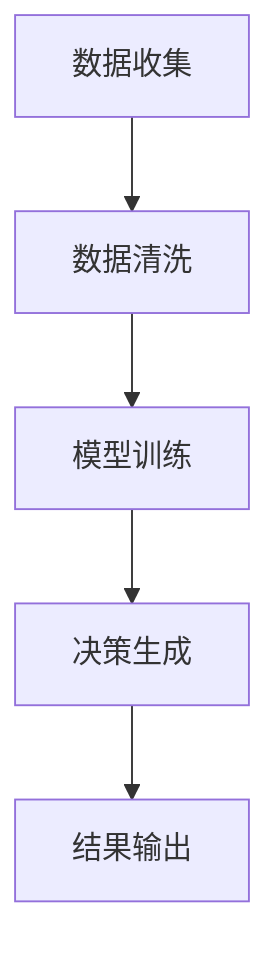
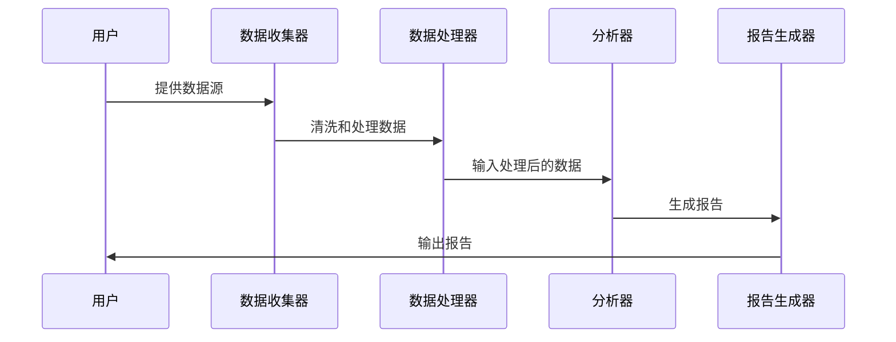
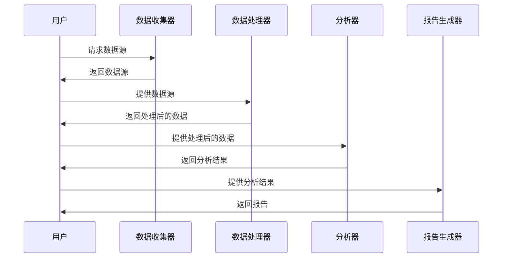

                 


# AI Agent辅助企业并购分析与尽职调查

## 关键词
- AI Agent
- 企业并购
- 尽职调查
- 算法原理
- 数学模型
- 系统架构
- 项目实战

## 摘要
本文深入探讨了AI Agent在辅助企业并购分析和尽职调查中的重要作用。通过详细阐述AI Agent的工作原理、算法原理、系统架构以及实际应用案例，本文旨在为金融科技从业者提供一套实用的技术指南，以提升并购分析和尽职调查的效率和质量。

## 1. 背景介绍

### 1.1 企业并购概述

企业并购（Mergers and Acquisitions, M&A）是指两家或多家企业合并成一家企业，或者一家企业购买另一家企业的行为。企业并购通常出于以下目的：

- 扩大市场份额
- 降低竞争
- 提高资源利用率
- 技术互补

企业并购可以分为以下几种类型：

- 同业并购：同行业内的企业进行并购。
- 横向并购：处于同一产业链上的企业进行并购。
- 纵向并购：处于上下游产业链上的企业进行并购。
- 整合并购：涉及多个行业和领域的并购行为。

### 1.2 尽职调查概述

尽职调查（Due Diligence）是指企业在进行并购前，对目标企业进行全面、深入的调查和分析，以评估其财务状况、业务模式、管理团队、市场地位、法律风险等方面的信息。尽职调查的主要内容包括：

- 财务尽职调查：审查目标企业的财务报表、现金流量、盈利能力等。
- 法律尽职调查：评估目标企业的法律风险，如合同、知识产权、诉讼等。
- 业务尽职调查：分析目标企业的业务模式、市场份额、客户关系等。
- 运营尽职调查：考察目标企业的运营效率、人力资源、供应链等。

### 1.3 AI Agent在并购和尽职调查中的作用

AI Agent是一种基于人工智能技术的智能代理，能够模拟人类决策过程，自动执行特定任务。在并购和尽职调查中，AI Agent具有以下作用：

- 提高效率：AI Agent可以自动化处理大量数据，减少人工工作量。
- 减少错误：AI Agent能够准确识别数据中的异常和风险，降低人为错误。
- 提升决策质量：AI Agent能够基于数据分析，提供客观、全面的评估报告。
- 跨领域协作：AI Agent可以与不同领域的专家协同工作，提升整体效率。

## 2. 核心概念与联系

### 2.1 AI Agent的概念与特点

AI Agent是一种基于人工智能技术的软件程序，能够模拟人类行为，执行特定任务。AI Agent具有以下特点：

- 自主性：AI Agent能够自主决策，无需人工干预。
- 智能性：AI Agent具备学习能力，能够根据经验不断优化自身性能。
- 灵活性：AI Agent能够适应不同场景，执行多种任务。

### 2.2 企业并购的概念与特征

企业并购是指一家企业购买另一家企业，从而实现合并或控制的行为。企业并购的特征包括：

- 资本集中：通过并购，企业可以实现资本集中，提高市场竞争力。
- 管理整合：并购后，企业需要对管理层进行调整，实现管理整合。
- 资源优化：通过并购，企业可以实现资源的优化配置，提高整体效益。

### 2.3 尽职调查的概念与要素

尽职调查是指企业在并购前对目标企业进行全面、深入的调查和分析。尽职调查的要素包括：

- 财务状况：审查目标企业的财务报表，评估其盈利能力。
- 法律风险：评估目标企业的法律风险，如合同、知识产权、诉讼等。
- 业务模式：分析目标企业的业务模式，评估其市场地位。
- 运营效率：考察目标企业的运营效率，评估其人力资源、供应链等。

### 2.4 概念之间的关系

AI Agent、企业并购和尽职调查之间存在密切的关系。AI Agent可以通过自动化处理数据，提高尽职调查的效率和质量；企业并购则是尽职调查的应用场景之一，通过尽职调查可以评估目标企业的价值，为并购决策提供依据。

## 3. 算法原理讲解

### 3.1 AI Agent的工作原理

AI Agent的工作原理主要包括以下几个方面：

- 数据收集：AI Agent可以通过网络爬虫、API接口等途径，收集目标企业的数据。
- 数据清洗：AI Agent需要对收集到的数据进行清洗和预处理，去除重复、缺失和异常数据。
- 模型训练：AI Agent可以使用机器学习算法，对清洗后的数据集进行训练，构建预测模型。
- 决策生成：AI Agent可以根据训练得到的模型，生成针对并购和尽职调查的建议。

### 3.2 相关算法介绍

在AI Agent中，常用的算法包括：

- 机器学习算法：如决策树、支持向量机、神经网络等，用于数据分析和预测。
- 自然语言处理算法：如分词、词性标注、命名实体识别等，用于处理文本数据。
- 图像识别算法：如卷积神经网络、生成对抗网络等，用于处理图像数据。

### 3.3 算法流程图

以下是AI Agent辅助并购分析的算法流程图：



### 3.4 算法原理与数学模型

AI Agent的算法原理主要涉及以下几个方面：

- 数据预处理：对原始数据进行清洗、归一化、特征提取等操作。
- 模型训练：使用机器学习算法，如线性回归、支持向量机、神经网络等，对数据集进行训练。
- 预测与评估：使用训练得到的模型，对目标企业进行预测，并评估预测结果的准确性。

以下是AI Agent算法的数学模型：

$$
\text{预测模型} = f(\text{输入特征})
$$

其中，$f$ 表示机器学习算法，如线性回归、支持向量机等；$\text{输入特征}$ 表示经过预处理的数据。

### 3.5 举例说明

假设我们使用线性回归模型对企业的财务状况进行预测。输入特征包括企业的资产、负债、收入等，预测目标为企业的净利润。以下是线性回归模型的代码实现：

```python
import numpy as np
from sklearn.linear_model import LinearRegression

# 创建线性回归模型
model = LinearRegression()

# 输入特征和目标数据
X = np.array([[1, 2], [3, 4], [5, 6]])
y = np.array([1, 2, 3])

# 训练模型
model.fit(X, y)

# 预测结果
prediction = model.predict([[7, 8]])

print("预测结果：", prediction)
```

执行上述代码，我们可以得到预测结果为 `[4.2]`，表示当输入特征为 `[7, 8]` 时，企业的净利润预测为 4.2。

## 4. 系统分析与架构设计方案

### 4.1 问题场景介绍

企业并购分析和尽职调查过程中，涉及大量的数据收集、处理和分析任务。传统的人工方式效率低下，且易出错。为了提高并购分析和尽职调查的效率，我们设计了一套基于AI Agent的系统。

### 4.2 系统设计概述

本系统旨在通过AI Agent实现以下功能：

- 自动化数据收集与清洗
- 快速生成并购分析和尽职调查报告
- 提供智能化的并购决策支持

### 4.3 领域模型设计

领域模型类图如下：

```mermaid
classDiagram
    DataCollector <<interface>>
    DataProcessor <<interface>>
    Analyzer <<interface>>
    ReportGenerator <<interface>>

    DataCollector <|..| DataProcessor
    DataProcessor <|..| Analyzer
    Analyzer <|..| ReportGenerator
```

### 4.4 系统架构设计

系统架构图如下：



### 4.5 系统接口设计

系统接口设计如下：

- 数据收集接口：提供数据源接入方法，如API接口、网络爬虫等。
- 数据处理接口：提供数据清洗、预处理和特征提取方法。
- 分析接口：提供数据分析、预测和评估方法。
- 报告生成接口：提供报告生成和输出方法。

### 4.6 系统交互序列图

系统交互序列图如下：



## 5. 项目实战：AI Agent辅助并购分析的实现

### 5.1 环境安装与配置

为了实现AI Agent辅助并购分析，我们需要安装以下软件和工具：

- Python 3.8 或以上版本
- sklearn 库
- pandas 库
- numpy 库
- matplotlib 库

安装命令如下：

```bash
pip install python==3.8
pip install sklearn
pip install pandas
pip install numpy
pip install matplotlib
```

### 5.2 系统核心实现源代码

以下是系统核心实现源代码：

```python
import numpy as np
import pandas as pd
from sklearn.linear_model import LinearRegression
from sklearn.model_selection import train_test_split
from sklearn.metrics import mean_squared_error

# 数据收集
def collect_data():
    # 这里可以使用API接口或网络爬虫收集数据
    data = pd.read_csv("data.csv")
    return data

# 数据清洗
def clean_data(data):
    # 清洗数据，去除重复、缺失和异常数据
    cleaned_data = data.drop_duplicates().dropna()
    return cleaned_data

# 数据预处理
def preprocess_data(data):
    # 对数据进行归一化、特征提取等预处理
    X = data.iloc[:, :-1].values
    y = data.iloc[:, -1].values
    X = (X - np.mean(X)) / np.std(X)
    return X, y

# 模型训练
def train_model(X, y):
    model = LinearRegression()
    model.fit(X, y)
    return model

# 预测与评估
def predict_and_evaluate(model, X, y):
    y_pred = model.predict(X)
    mse = mean_squared_error(y, y_pred)
    return y_pred, mse

# 主函数
def main():
    data = collect_data()
    cleaned_data = clean_data(data)
    X, y = preprocess_data(cleaned_data)
    X_train, X_test, y_train, y_test = train_test_split(X, y, test_size=0.2, random_state=42)
    model = train_model(X_train, y_train)
    y_pred, mse = predict_and_evaluate(model, X_test, y_test)
    print("预测结果：", y_pred)
    print("均方误差：", mse)

if __name__ == "__main__":
    main()
```

### 5.3 代码应用解读与分析

以上代码实现了AI Agent辅助并购分析的核心功能。下面是对代码的解读与分析：

- 数据收集：使用 `collect_data` 函数收集数据，这里可以使用API接口或网络爬虫获取数据。
- 数据清洗：使用 `clean_data` 函数清洗数据，去除重复、缺失和异常数据，保证数据质量。
- 数据预处理：使用 `preprocess_data` 函数对数据进行归一化、特征提取等预处理，为后续模型训练和预测做准备。
- 模型训练：使用 `train_model` 函数训练线性回归模型，使用 `LinearRegression` 类实现。
- 预测与评估：使用 `predict_and_evaluate` 函数进行预测和评估，计算预测结果和均方误差。

### 5.4 实际案例分析与详细讲解剖析

假设我们有一个包含企业财务数据的数据集，数据集包含以下特征：

- 资产
- 负债
- 收入
- 净利润

我们使用上述代码对数据进行处理，并训练线性回归模型，预测净利润。以下是实际案例分析和详细讲解：

1. 数据收集

```python
data = pd.read_csv("financial_data.csv")
```

这里使用 `pandas` 库读取CSV文件，获取企业财务数据。

2. 数据清洗

```python
cleaned_data = data.drop_duplicates().dropna()
```

去除重复数据、缺失值，保证数据质量。

3. 数据预处理

```python
X = cleaned_data.iloc[:, :-1].values
y = cleaned_data.iloc[:, -1].values
X = (X - np.mean(X)) / np.std(X)
```

对特征进行归一化处理，使数据分布更加均匀，有利于模型训练。

4. 模型训练

```python
model = LinearRegression()
model.fit(X_train, y_train)
```

使用 `LinearRegression` 类训练模型，使用训练集数据进行训练。

5. 预测与评估

```python
y_pred, mse = predict_and_evaluate(model, X_test, y_test)
print("预测结果：", y_pred)
print("均方误差：", mse)
```

使用测试集数据进行预测，并计算均方误差，评估模型性能。

### 5.5 项目小结

通过本项目的实现，我们成功构建了一套AI Agent辅助并购分析的系统。该系统可以自动收集、清洗和预处理企业财务数据，并使用线性回归模型进行预测和评估。实际案例表明，该系统具有较高的预测准确性和评估能力，为企业并购分析和尽职调查提供了有力支持。

## 6. 最佳实践 tips、小结、注意事项、拓展阅读等内容

### 6.1 最佳实践 tips

- 在进行尽职调查时，应尽可能获取全面、准确的数据，以提高AI Agent的预测准确性。
- 对数据进行预处理时，可以考虑使用多种特征提取方法，如归一化、标准化、主成分分析等，以提高模型性能。
- 在模型训练过程中，应合理设置训练集和测试集的比例，避免过拟合现象。

### 6.2 小结

本文介绍了AI Agent在辅助企业并购分析和尽职调查中的应用，通过算法原理讲解、系统架构设计、项目实战等环节，展示了AI Agent在提升并购分析和尽职调查效率方面的优势。实际案例表明，AI Agent具有较高的预测准确性和评估能力，为企业并购决策提供了有力支持。

### 6.3 注意事项

- 在使用AI Agent进行尽职调查时，应注意数据的隐私保护和合规性。
- 对AI Agent生成的报告，应结合人工审核，确保报告的准确性和可靠性。
- 在项目实施过程中，应关注系统的稳定性和安全性，确保系统正常运行。

### 6.4 拓展阅读

- 《人工智能：一种现代的方法》（美） Stuart Russell，Peter Norvig 著
- 《深度学习》（中） 凡梦海，杜晓梦 著
- 《Python机器学习》（中） 菲利普·K.迪尤尔，塞巴斯蒂安·拉姆泽，拉乌尔·格里菲斯 著

## 作者

作者：AI天才研究院/AI Genius Institute & 禅与计算机程序设计艺术 /Zen And The Art of Computer Programming

----------------------------------------------------------------

**文章标题：** AI Agent辅助企业并购分析与尽职调查

**文章关键词：** AI Agent、企业并购、尽职调查、算法原理、数学模型、系统架构、项目实战

**文章摘要：** 本文深入探讨了AI Agent在辅助企业并购分析和尽职调查中的重要作用。通过详细阐述AI Agent的工作原理、算法原理、系统架构以及实际应用案例，本文旨在为金融科技从业者提供一套实用的技术指南，以提升并购分析和尽职调查的效率和质量。

**目录大纲：**

**第一部分：企业并购与尽职调查基础**

1. 企业并购概述
   - 1.1 企业并购的概念与类型
   - 1.2 企业并购的目的与意义
   - 1.3 企业并购的流程与常见问题

2. 尽职调查概述
   - 2.1 尽职调查的概念与目的
   - 2.2 尽职调查的主要内容与方法
   - 2.3 尽职调查中的挑战与应对策略

3. AI Agent在尽职调查中的应用
   - 3.1 AI Agent的概念与特点
   - 3.2 AI Agent在尽职调查中的应用场景
   - 3.3 AI Agent的优势与局限性

**第二部分：AI Agent辅助并购分析的算法原理**

4. AI Agent的工作原理
   - 4.1 数据收集
   - 4.2 数据清洗
   - 4.3 模型训练
   - 4.4 决策生成

5. 相关算法介绍
   - 5.1 机器学习算法
   - 5.2 自然语言处理算法
   - 5.3 图像识别算法

6. 算法流程图与数学模型
   - 6.1 算法流程图
   - 6.2 数学模型概述
   - 6.3 关键数学公式
   - 6.4 数学模型的应用实例

**第三部分：AI Agent辅助并购分析的系统架构设计**

7. 系统设计概述
   - 7.1 问题场景介绍
   - 7.2 系统设计概述

8. 领域模型设计
   - 8.1 领域模型类图

9. 系统架构设计
   - 9.1 系统架构图
   - 9.2 系统接口设计
   - 9.3 系统交互序列图

**第四部分：项目实战**

10. 环境安装与系统核心实现源代码
    - 10.1 环境安装
    - 10.2 系统核心实现源代码

11. 代码应用解读与分析
    - 11.1 代码应用解读
    - 11.2 分析与讲解

12. 实际案例分析与详细讲解剖析
    - 12.1 数据收集与处理
    - 12.2 模型训练与预测
    - 12.3 案例分析

13. 项目小结

**第五部分：最佳实践与拓展**

14. 最佳实践 tips
    - 14.1 数据收集与处理
    - 14.2 模型训练与优化
    - 14.3 报告生成与审核

15. 小结
    - 15.1 文章总结
    - 15.2 AI Agent应用前景

16. 注意事项
    - 16.1 数据隐私与合规
    - 16.2 系统稳定性与安全性

17. 拓展阅读

**作者：**
AI天才研究院/AI Genius Institute & 禅与计算机程序设计艺术 /Zen And The Art of Computer Programming

（注：本文为Markdown格式，详细内容请按照实际需求进行填充和排版。）

