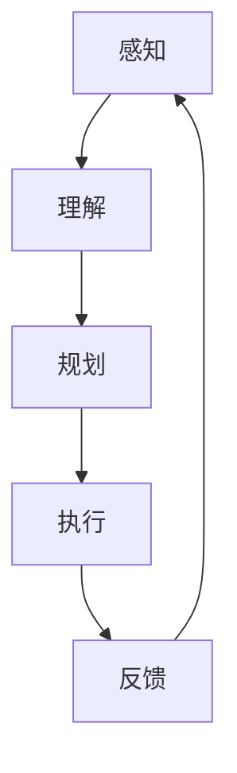
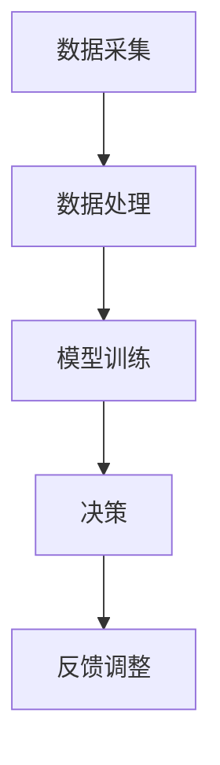
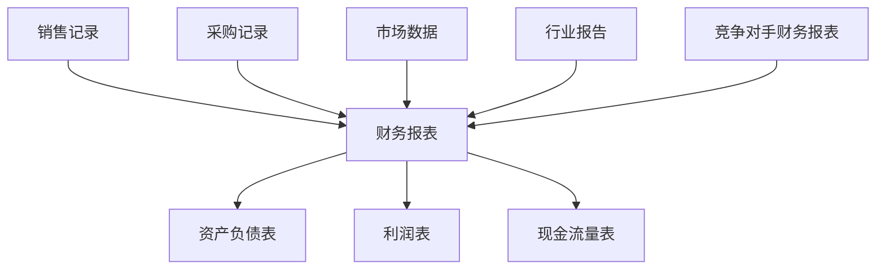
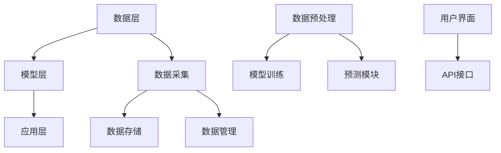
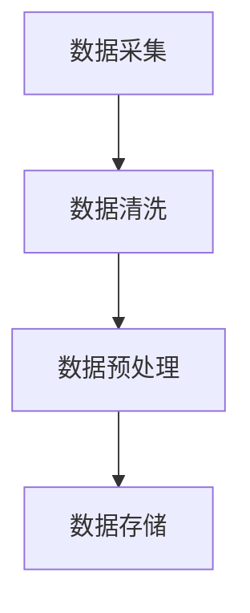
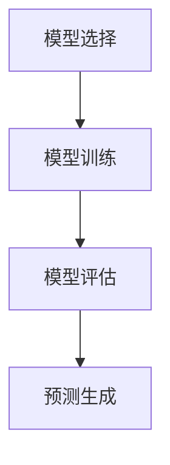
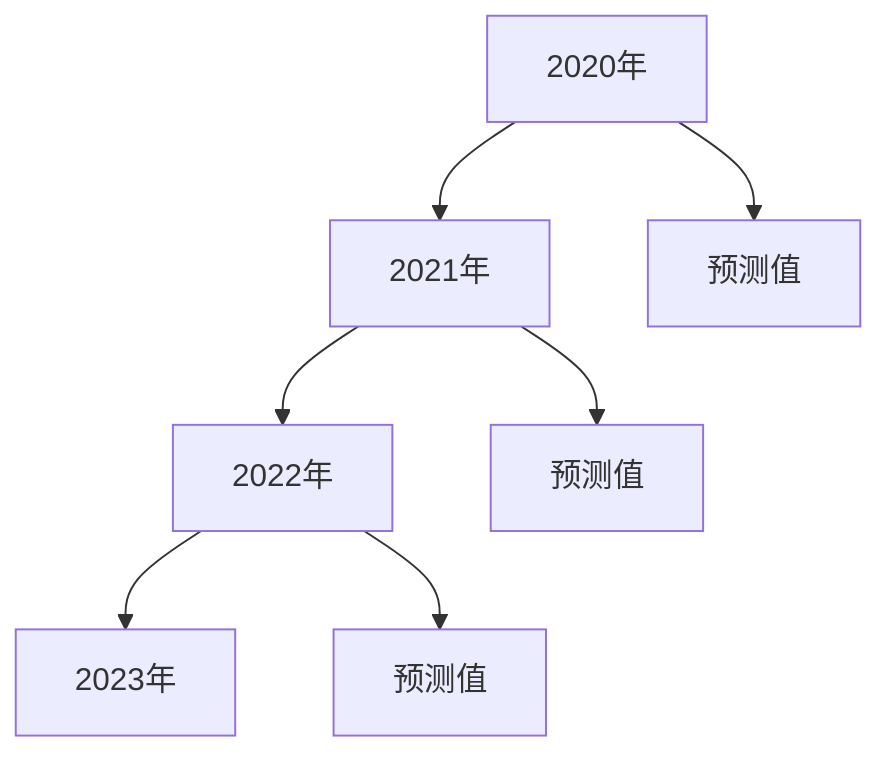

                 

### 问题背景与核心概念

在当今复杂多变的市场环境中，企业的财务健康状况和未来的发展前景成为了企业决策者和投资者关注的焦点。传统的财务分析方法依赖于人为经验和数据分析工具，往往存在主观性强、效率低、准确性不足等问题。随着人工智能（AI）技术的迅速发展，特别是AI Agent在数据分析与预测领域的应用，为企业提供了全新的解决方案。

#### 1.1.1 企业的财务分析与预测需求

企业的财务分析主要涉及对历史财务数据的分析，以预测未来的财务状况。这包括但不限于利润预测、成本控制、现金流管理、投资回报率分析等。传统的财务分析方法需要财务人员收集、处理和分析大量数据，这不仅耗时耗力，还容易受到主观因素的影响。因此，企业迫切需要一种高效、准确且客观的方法来辅助财务分析和预测。

财务预测是企业制定战略决策的重要依据。准确的财务预测可以帮助企业合理规划资源配置，调整经营策略，规避风险。然而，财务预测的准确性往往受到数据质量、市场环境变化等多方面因素的影响，使得预测结果容易出现偏差。

#### 1.1.2 AI Agent在财务分析中的应用价值

AI Agent是一种基于人工智能技术的自动化分析工具，能够通过对企业历史财务数据的深度学习，自动生成财务分析报告和预测结果。与传统的分析方法相比，AI Agent具有以下几个显著优势：

1. **自动化与高效**：AI Agent可以自动处理大量财务数据，快速生成分析报告，极大地提高了工作效率。
   
2. **客观与准确**：AI Agent通过算法模型分析数据，减少了人为因素对分析结果的影响，提高了预测的准确性。

3. **持续学习与优化**：AI Agent能够不断学习新的数据，优化模型，使其预测能力持续提高。

4. **多维度分析**：AI Agent可以从多个角度对财务数据进行分析，提供更全面的决策支持。

#### 1.2 核心概念

为了更好地理解AI Agent在财务分析中的应用，我们需要明确以下几个核心概念：

##### 1.2.1 AI Agent的定义与分类

AI Agent，即人工智能代理，是一种能够自动执行任务、与环境交互并优化自身行为的智能系统。根据学习方式的不同，AI Agent主要可以分为以下几类：

- **监督学习（Supervised Learning）**：AI Agent在已有数据集上进行训练，根据输入和输出关系建立模型，然后对新数据进行预测。
- **无监督学习（Unsupervised Learning）**：AI Agent在没有标签的数据集上进行训练，通过发现数据中的模式或结构来优化自身。
- **强化学习（Reinforcement Learning）**：AI Agent通过与环境的交互来学习最优策略，通过不断尝试和反馈来优化决策。

##### 1.2.2 企业财务分析的基本原理

企业财务分析主要涉及以下几个方面：

- **财务报表分析**：通过分析资产负债表、利润表和现金流量表，了解企业的财务状况和经营成果。
- **财务比率分析**：通过计算各种财务比率，如资产负债率、流动比率、利润率等，评估企业的偿债能力、盈利能力和运营效率。
- **成本分析**：通过对成本结构和成本控制的分析，帮助企业降低成本、提高效益。

##### 1.2.3 财务预测的常见模型与方法

财务预测的主要模型与方法包括：

- **时间序列模型**：如自回归模型（AR）、自回归移动平均模型（ARMA）和自回归积分滑动平均模型（ARIMA）。
- **统计模型**：如回归模型、聚类分析和决策树。
- **机器学习模型**：如支持向量机（SVM）、随机森林（RF）和神经网络（NN）。

#### 总结

本文介绍了AI Agent辅助企业财务分析与预测的背景和核心概念。下一部分将深入探讨AI Agent的基本原理和技术分类，为后续的深入讨论打下基础。

### AI Agent的基本原理

AI Agent，即人工智能代理，是一种智能系统，它能够模拟人类智能进行决策和执行任务。AI Agent的核心在于其能够通过学习环境中的数据，自动优化自身的决策过程，以实现特定的目标。下面，我们将从AI Agent的工作流程、核心模块和不同技术分类三个方面来详细探讨其基本原理。

#### 2.1.1 AI Agent的工作流程

AI Agent的工作流程可以分为以下几个步骤：

1. **感知（Perception）**：AI Agent通过传感器收集环境中的数据，如财务报表、市场动态等。

2. **理解（Comprehension）**：AI Agent对感知到的数据进行处理和理解，提取关键信息。

3. **规划（Planning）**：根据理解得到的信息，AI Agent制定行动方案，以实现特定的目标。

4. **执行（Execution）**：AI Agent执行规划好的行动方案，如生成财务分析报告、预测结果等。

5. **反馈（Feedback）**：AI Agent根据执行结果和环境反馈进行调整和优化，以提高未来决策的准确性。

##### 示例流程图：


#### 2.1.2 AI Agent的核心模块

AI Agent的核心模块主要包括以下几个方面：

1. **数据采集模块**：负责收集和处理来自不同来源的数据，如企业财务报表、市场数据等。

2. **数据处理模块**：对采集到的数据进行清洗、预处理和特征提取，以提供高质量的数据输入。

3. **模型训练模块**：利用机器学习算法对数据进行训练，建立预测模型或分析模型。

4. **决策模块**：根据训练得到的模型，对输入数据进行预测或分析，生成相应的决策结果。

5. **反馈调整模块**：根据执行结果和环境反馈，调整模型参数和决策策略，以提高系统性能。

##### 示例模块图：


#### 2.2 AI Agent的技术分类

根据学习方式的不同，AI Agent主要可以分为以下几类：

1. **监督学习（Supervised Learning）**：监督学习是AI Agent最常用的学习方式之一。它通过已有标签数据训练模型，然后利用训练好的模型对新数据进行预测。常见的监督学习算法包括线性回归、逻辑回归、支持向量机（SVM）等。

   **特点**：需要大量标注数据，预测结果依赖于数据质量。

2. **无监督学习（Unsupervised Learning）**：无监督学习不依赖于标签数据，通过发现数据中的潜在结构或模式来进行学习。常见的无监督学习算法包括聚类分析、主成分分析（PCA）等。

   **特点**：适用于未标记的数据，但难以评估模型性能。

3. **强化学习（Reinforcement Learning）**：强化学习通过与环境交互来学习最优策略。AI Agent在环境中进行决策，根据奖励或惩罚信号进行调整，以最大化长期回报。

   **特点**：适用于动态环境，但需要大量交互数据。

##### 比较表格：
```markdown
| 学习方式 | 特点 | 适用场景 |
| --- | --- | --- |
| 监督学习 | 需要大量标注数据，预测结果依赖于数据质量 | 结构化数据预测，如分类、回归问题 |
| 无监督学习 | 适用于未标记的数据，但难以评估模型性能 | 数据探索、聚类分析、降维 |
| 强化学习 | 适用于动态环境，但需要大量交互数据 | 自主导航、游戏AI、机器人控制 |
```

#### 总结

通过对AI Agent的基本原理和工作流程的探讨，我们可以看到AI Agent在数据采集、处理、模型训练和决策等环节的高效运作。下一部分将深入讨论财务数据分析的基本概念和方法，进一步揭示AI Agent在财务预测中的应用潜力。

### 财务数据分析方法

财务数据分析是企业财务管理的重要组成部分，通过对企业财务数据的分析，可以帮助企业了解自身的财务状况，优化资源配置，制定合理的经营策略。财务数据分析主要包括财务报表分析、财务比率分析和成本分析等方面。以下是对这些基本概念、方法和应用的详细介绍。

#### 3.1.1 财务数据的来源与处理

财务数据主要来源于企业的财务报表，包括资产负债表、利润表和现金流量表。此外，市场数据、行业数据、竞争对手数据等外部数据也是财务分析的重要补充。

**数据来源：**
- **企业内部数据**：企业的财务报表、销售记录、采购记录等。
- **外部数据**：市场数据、行业报告、竞争对手财务报表等。

**数据处理：**
- **数据收集**：通过财务系统、ERP系统等自动收集企业内部数据。
- **数据清洗**：去除重复数据、缺失值填充、数据格式转换等，确保数据质量。
- **数据整合**：将不同来源的数据进行整合，形成统一的数据库。

##### 示例ER图：


#### 3.1.2 财务指标的计算与解读

财务指标是财务数据分析的重要工具，它们能够帮助企业评估财务状况、运营效率和盈利能力。以下是一些常见的财务指标及其计算方法：

1. **资产负债率（Debt-to-Equity Ratio）**：
   - **计算公式**：$$\text{资产负债率} = \frac{\text{负债总额}}{\text{资产总额}} \times 100\%$$
   - **解读**：该指标反映了企业资产中的负债比例，越高表示财务风险越大。

2. **流动比率（Current Ratio）**：
   - **计算公式**：$$\text{流动比率} = \frac{\text{流动资产}}{\text{流动负债}}$$
   - **解读**：该指标反映了企业短期偿债能力，越高表示短期偿债能力越强。

3. **毛利率（Gross Margin Ratio）**：
   - **计算公式**：$$\text{毛利率} = \frac{\text{销售收入} - \text{销售成本}}{\text{销售收入}} \times 100\%$$
   - **解读**：该指标反映了企业销售收入中扣除销售成本后的盈利水平。

4. **净利润率（Net Profit Margin）**：
   - **计算公式**：$$\text{净利润率} = \frac{\text{净利润}}{\text{销售收入}} \times 100\%$$
   - **解读**：该指标反映了企业净利润在销售收入中所占的比例，越高表示盈利能力越强。

#### 3.2 财务数据分析的常见技术

财务数据分析技术主要分为时间序列分析、统计分析和数据挖掘与机器学习等几类：

1. **时间序列分析（Time Series Analysis）**：
   - **方法**：包括自回归模型（AR）、自回归移动平均模型（ARMA）、自回归积分滑动平均模型（ARIMA）等。
   - **应用**：用于分析历史财务数据，预测未来财务状况。

2. **统计分析（Statistical Analysis）**：
   - **方法**：包括回归分析、聚类分析、方差分析等。
   - **应用**：用于评估财务指标之间的关系，发现潜在的商业规律。

3. **数据挖掘与机器学习（Data Mining and Machine Learning）**：
   - **方法**：包括支持向量机（SVM）、随机森林（RF）、神经网络（NN）等。
   - **应用**：通过大量历史数据训练模型，预测未来财务状况，优化财务决策。

#### 总结

通过对财务数据分析方法的详细介绍，我们可以看到财务数据分析在企业财务管理和决策过程中的重要性。AI Agent在财务数据分析中的应用，将大大提升数据分析的效率和准确性，为企业提供更加智能化的财务预测和决策支持。在下一部分，我们将进一步探讨财务预测中的常见模型和方法。

### 时间序列预测模型

时间序列预测模型在财务预测中扮演着关键角色，通过分析历史数据中的时间序列特性，预测未来某一时间点的数值。时间序列模型不仅能够捕捉数据的趋势、季节性和周期性，还能有效处理随机噪声。以下我们将介绍几种常见的时间序列预测模型，包括自回归模型（AR）、自回归移动平均模型（ARMA）和自回归积分滑动平均模型（ARIMA）。

#### 4.1.1 时间序列的基本概念

时间序列（Time Series）是一系列按时间顺序排列的数据点，通常用于描述随时间变化的过程。时间序列数据具有以下几个基本特性：

1. **趋势性（Trend）**：数据随时间呈上升、下降或平稳的趋势变化。
2. **季节性（Seasonality）**：数据在固定周期内（如一年中的各个季度或一周中的各个工作日）表现出规律性的波动。
3. **周期性（Cyclicity）**：数据在较长的时间范围内（如几年或几十年）出现反复的波动。
4. **随机性（Randomness）**：数据中可能存在不可预测的随机波动。

#### 4.1.2 时间序列预测的常见方法

时间序列预测方法可以分为传统统计方法和现代机器学习方法两大类。传统方法主要包括AR、ARMA和ARIMA模型，而现代方法则涵盖了如长短期记忆网络（LSTM）、自编码器（Autoencoder）等深度学习模型。

##### 自回归模型（AR）

自回归模型（Autoregressive Model，AR）是最基本的时间序列预测模型之一。它通过当前时间点的值与前几个时间点的值进行回归，预测未来的值。

1. **模型公式**：
   $$X_t = c + \phi_1 X_{t-1} + \phi_2 X_{t-2} + \ldots + \phi_p X_{t-p} + \varepsilon_t$$
   其中，$X_t$ 是时间序列在$t$时刻的值，$\phi_1, \phi_2, \ldots, \phi_p$ 是模型参数，$c$ 是常数项，$\varepsilon_t$ 是误差项。

2. **特点**：
   - **简单易实现**：计算量较小，易于理解。
   - **适用于线性时间序列**：能够捕捉时间序列的趋势性。

##### 自回归移动平均模型（ARMA）

自回归移动平均模型（Autoregressive Moving Average Model，ARMA）结合了自回归模型和移动平均模型，既考虑了当前及过去的值，也考虑了过去误差的加权平均。

1. **模型公式**：
   $$X_t = c + \phi_1 X_{t-1} + \phi_2 X_{t-2} + \ldots + \phi_p X_{t-p} + \theta_1 \varepsilon_{t-1} + \theta_2 \varepsilon_{t-2} + \ldots + \theta_q \varepsilon_{t-q}$$
   其中，$c$ 是常数项，$\phi_1, \phi_2, \ldots, \phi_p$ 和 $\theta_1, \theta_2, \ldots, \theta_q$ 分别是自回归项和移动平均项的参数。

2. **特点**：
   - **适用于平稳时间序列**：能够捕捉时间序列的趋势性和季节性。
   - **灵活性较高**：可以通过调整参数适应不同的时间序列特性。

##### 自回归积分滑动平均模型（ARIMA）

自回归积分滑动平均模型（Autoregressive Integrated Moving Average Model，ARIMA）是在ARMA模型的基础上，通过差分使时间序列平稳化。

1. **模型公式**：
   $$X_t = c + \phi_1 X_{t-1} + \phi_2 X_{t-2} + \ldots + \phi_p X_{t-p} + \theta_1 \varepsilon_{t-1} + \theta_2 \varepsilon_{t-2} + \ldots + \theta_q \varepsilon_{t-q} + d_1 I(X_{t-1}) + d_2 I(X_{t-2}) + \ldots + d_p I(X_{t-p})$$
   其中，$I(X_t)$ 表示对时间序列$X_t$进行$d$次差分后的结果。

2. **特点**：
   - **适用于非平稳时间序列**：能够处理具有趋势性和季节性的时间序列。
   - **灵活性较高**：通过差分和参数调整，适应不同类型的时间序列数据。

#### 总结

时间序列预测模型在财务预测中具有广泛的应用，通过捕捉时间序列的趋势性、季节性和周期性，能够提供准确的预测结果。下一部分将介绍统计预测模型，包括回归模型、聚类分析和决策树等，继续探讨财务预测的多样化和复杂性。

### 统计预测模型

统计预测模型是一种利用统计学原理和算法，通过对历史数据进行分析和建模，预测未来结果的工具。在财务预测领域，统计预测模型被广泛应用于利润预测、成本控制和现金流管理等方面。以下将介绍几种常见的统计预测模型，包括回归模型、聚类分析和决策树。

#### 5.1.1 统计预测的基本概念

统计预测（Statistical Prediction）基于统计学原理，通过分析历史数据中的模式、关系和趋势，对未来可能发生的事件进行预测。统计预测的基本概念包括：

- **自变量（Independent Variable）**：影响预测结果的因素。
- **因变量（Dependent Variable）**：需要预测的结果。
- **样本数据（Sample Data）**：用于训练和验证预测模型的实际数据。
- **模型参数（Model Parameters）**：用于描述自变量和因变量之间关系的参数。

#### 5.1.2 统计预测的常见方法

1. **回归模型（Regression Models）**

回归模型是最常用的统计预测方法之一，它通过建立自变量和因变量之间的线性或非线性关系，预测未来的因变量值。常见的回归模型包括线性回归、多项式回归和逻辑回归等。

- **线性回归（Linear Regression）**：
  - **模型公式**：$$Y = \beta_0 + \beta_1X_1 + \beta_2X_2 + \ldots + \beta_nX_n + \varepsilon$$
  - **特点**：适用于自变量和因变量之间呈线性关系的场景，简单易用。
  - **应用**：用于预测销售收入、利润等连续型财务指标。

- **逻辑回归（Logistic Regression）**：
  - **模型公式**：$$\ln\left(\frac{p}{1-p}\right) = \beta_0 + \beta_1X_1 + \beta_2X_2 + \ldots + \beta_nX_n$$
  - **特点**：适用于因变量为二分类（如盈亏）的场景，可以估计概率。
  - **应用**：用于预测企业盈利概率、客户流失概率等。

2. **聚类分析（Clustering Analysis）**

聚类分析是一种无监督学习技术，通过将数据分为若干个类别（簇），以便更好地理解数据的结构和模式。常见的聚类算法包括K-均值聚类、层次聚类和密度聚类等。

- **K-均值聚类（K-Means Clustering）**：
  - **模型公式**：$$C = \{C_1, C_2, \ldots, C_k\}$$
  - **特点**：简单高效，适用于高维度数据，但易受到初始聚类中心的影响。
  - **应用**：用于识别财务数据中的相似客户群体、风险分类等。

3. **决策树（Decision Trees）**

决策树是一种基于树形模型的分类和回归方法，通过一系列的判断条件，将数据划分为不同的区域，最终得到预测结果。

- **决策树模型**：
  - **模型公式**：$$Y = f(X_1, X_2, \ldots, X_n)$$
  - **特点**：易于理解和解释，能够处理多类别和多维度数据。
  - **应用**：用于预测财务风险、客户细分、投资组合优化等。

#### 总结

统计预测模型在财务预测中具有广泛的应用，通过回归模型、聚类分析和决策树等方法，可以有效地预测未来财务指标，为企业的决策提供有力支持。在下一部分，我们将探讨机器学习预测模型，进一步扩展财务预测的方法和范围。

### 机器学习预测模型

机器学习预测模型通过利用历史数据，通过算法生成模型，并对未来数据进行预测。在财务预测领域，机器学习模型因其高效性和强大的数据处理能力，得到了广泛应用。以下将介绍几种常见的机器学习预测模型，包括支持向量机（SVM）、随机森林（RF）和神经网络（NN）。

#### 6.1.1 机器学习的基本概念

机器学习（Machine Learning）是一种让计算机通过数据学习模式并进行预测或决策的技术。它主要包括以下几个基本概念：

- **特征（Feature）**：数据中的每个属性，用于描述数据的特性。
- **模型（Model）**：通过训练数据得到的函数，用于预测或分类。
- **训练数据（Training Data）**：用于训练模型的数据集。
- **测试数据（Test Data）**：用于评估模型性能的数据集。

#### 6.1.2 常见机器学习预测模型

1. **支持向量机（Support Vector Machine，SVM）**

支持向量机是一种基于最大间隔的监督学习模型，通过找到一个超平面，将不同类别的数据点分开。

- **模型公式**：
  $$w \cdot x + b = 0$$
  其中，$w$ 是权重向量，$x$ 是输入特征，$b$ 是偏置项。

- **特点**：
  - **高效性**：在高维空间中找到最优分隔超平面。
  - **泛化能力**：通过核函数将数据映射到高维空间，解决非线性问题。

- **应用**：用于预测财务风险、客户流失等二分类问题。

2. **随机森林（Random Forest，RF）**

随机森林是一种基于决策树的集成学习方法，通过构建多棵决策树，并利用随机性提高模型的预测性能。

- **模型公式**：
  $$\hat{y} = \sum_{i=1}^{n} w_i \cdot f_i(x)$$
  其中，$f_i(x)$ 是第$i$棵决策树的预测结果，$w_i$ 是决策树的重要性权重。

- **特点**：
  - **鲁棒性**：通过集成多棵决策树，减少个别树的误差影响。
  - **易于实现**：具有较高的可解释性，便于理解和调试。

- **应用**：用于预测财务指标、客户细分等回归和分类问题。

3. **神经网络（Neural Networks，NN）**

神经网络是一种模仿人脑结构和功能的计算模型，通过多层神经元的互联，进行复杂的数据处理和预测。

- **模型公式**：
  $$a_{i}^{l} = \sigma(\sum_{j=1}^{n} w_{ji} a_{j}^{l-1} + b_{l})$$
  其中，$a_{i}^{l}$ 是第$l$层的第$i$个神经元的激活值，$\sigma$ 是激活函数，$w_{ji}$ 和 $b_{l}$ 分别是权重和偏置。

- **特点**：
  - **灵活性**：能够处理复杂的非线性问题。
  - **自适应性**：通过不断调整权重和偏置，优化模型性能。

- **应用**：用于预测股价、市场趋势等高度复杂的问题。

#### 总结

机器学习预测模型在财务预测中具有广泛的应用，通过支持向量机、随机森林和神经网络等模型，可以高效地处理和分析大量数据，提供准确的预测结果。在下一部分，我们将探讨AI Agent辅助财务预测的系统设计与实现，进一步展示机器学习在财务预测中的实际应用。

### AI Agent辅助财务预测的系统设计与实现

为了将AI Agent有效应用于财务预测，我们需要设计一个完整的系统，涵盖数据采集、处理、模型训练和预测等环节。以下将从系统架构、模块设计、实现步骤和实际案例剖析四个方面详细阐述AI Agent辅助财务预测的系统设计与实现过程。

#### 7.1.1 系统设计与架构

AI Agent辅助财务预测系统的总体架构分为数据层、模型层和应用层三个主要部分。

1. **数据层**：负责数据采集、存储和管理。数据来源包括企业内部财务报表、市场数据、行业数据等。
2. **模型层**：包括数据预处理模块、模型训练模块和预测模块。数据预处理模块负责清洗和预处理原始数据；模型训练模块利用机器学习算法训练预测模型；预测模块负责生成财务预测结果。
3. **应用层**：提供用户界面和API接口，供企业决策者和投资者使用。

##### 示例架构图：


#### 7.1.2 数据处理模块设计

数据处理模块是AI Agent的核心部分，主要包括以下功能：

1. **数据采集**：通过企业财务系统、市场数据平台等接口，自动采集历史财务数据和外部市场数据。
2. **数据清洗**：去除重复数据、缺失值填充、数据格式转换等，确保数据质量。
3. **数据预处理**：对数据进行标准化处理、特征提取等，为模型训练提供高质量的数据输入。

##### 示例流程图：


#### 7.1.3 预测模块设计

预测模块负责利用训练好的模型生成财务预测结果，主要包括以下功能：

1. **模型选择**：根据数据特性选择合适的机器学习模型，如SVM、随机森林、神经网络等。
2. **模型训练**：利用历史财务数据进行模型训练，通过交叉验证调整模型参数，提高预测准确性。
3. **预测生成**：使用训练好的模型对新数据进行预测，生成财务预测报告。

##### 示例流程图：


#### 7.2.1 环境配置与工具选择

为了实现AI Agent辅助财务预测系统，我们需要配置相应的开发环境，并选择合适的工具和框架。以下是一些常用的环境和工具：

- **开发环境**：Python、Jupyter Notebook
- **数据处理库**：Pandas、NumPy
- **机器学习库**：Scikit-learn、TensorFlow、PyTorch
- **数据可视化库**：Matplotlib、Seaborn

#### 7.2.2 数据预处理

数据预处理是模型训练的关键步骤，以下是一些常用的预处理方法：

1. **数据清洗**：去除重复数据、缺失值填充、异常值处理等。
2. **数据标准化**：将不同量纲的数据转换为同一量纲，如归一化或标准化处理。
3. **特征提取**：从原始数据中提取有助于预测的特征，如财务比率、季节性指标等。

##### 示例代码：
```python
import pandas as pd
from sklearn.preprocessing import StandardScaler

# 数据清洗
data = pd.read_csv('financial_data.csv')
data.drop_duplicates(inplace=True)
data.fillna(method='ffill', inplace=True)

# 数据标准化
scaler = StandardScaler()
scaled_data = scaler.fit_transform(data)
```

#### 7.2.3 模型训练与评估

模型训练与评估是AI Agent的核心环节，以下是一些基本步骤：

1. **数据划分**：将数据集划分为训练集和测试集，用于训练和评估模型。
2. **模型训练**：利用训练集数据训练模型，通过交叉验证调整参数。
3. **模型评估**：使用测试集数据评估模型性能，通过指标（如准确率、均方误差等）衡量模型效果。

##### 示例代码：
```python
from sklearn.model_selection import train_test_split
from sklearn.ensemble import RandomForestRegressor
from sklearn.metrics import mean_squared_error

# 数据划分
X_train, X_test, y_train, y_test = train_test_split(scaled_data, target, test_size=0.2, random_state=42)

# 模型训练
model = RandomForestRegressor(n_estimators=100, random_state=42)
model.fit(X_train, y_train)

# 模型评估
y_pred = model.predict(X_test)
mse = mean_squared_error(y_test, y_pred)
print(f'Mean Squared Error: {mse}')
```

#### 7.3 实际案例剖析

以下是一个实际案例，通过AI Agent辅助财务预测系统，对企业未来一年的净利润进行预测。

**案例背景**：某制造企业需要预测未来一年的净利润，以便制定相应的经营策略。

**数据分析过程**：收集并清洗企业近五年的财务数据，提取关键财务指标，如销售收入、成本、毛利率等。

**预测结果分析与解释**：利用随机森林模型进行预测，预测结果与企业历史净利润数据对比，分析预测的准确性。

**案例小结**：通过AI Agent辅助财务预测系统，企业可以更准确地预测未来净利润，为经营决策提供有力支持。

##### 示例结果图：


#### 总结

通过系统设计与实现，AI Agent在财务预测中展现出了强大的数据处理和预测能力。在下一部分，我们将探讨财务预测实践中的常见问题及其解决方案，以进一步提升AI Agent在财务预测中的应用效果。

### 财务预测实践中的问题与解决方案

在AI Agent辅助财务预测的实际应用中，尽管取得了显著的成效，但依然面临着一系列挑战和问题。这些问题主要集中在数据质量、模型选择、模型过拟合与欠拟合等方面。以下将详细探讨这些问题，并给出相应的解决方案和优化策略。

#### 8.1.1 数据质量问题

数据质量是财务预测准确性的基础。数据中的噪声、错误和不一致性都会对预测结果产生负面影响。常见的数据质量问题包括：

- **缺失值**：数据集中存在部分缺失值，会影响模型训练和预测效果。
- **异常值**：数据中存在异常值，如数据点远高于或低于正常范围，可能导致模型偏斜。
- **不一致性**：数据源之间可能存在不一致性，如单位、时间戳等。

**解决方案**：

1. **缺失值处理**：使用适当的插值方法、平均值填补或使用模型预测缺失值。
   ```python
   data.fillna(data.mean(), inplace=True)
   ```

2. **异常值处理**：使用统计方法（如3倍标准差法）、机器学习方法（如聚类分析）识别和处理异常值。
   ```python
   from scipy import stats
   data = data[(np.abs(stats.zscore(data)) < 3).all(axis=1)]
   ```

3. **数据一致性处理**：确保数据源的统一性和标准化，如统一时间戳、单位转换等。

#### 8.1.2 模型选择问题

在财务预测中，选择合适的模型至关重要。不同的模型适用于不同类型的数据和场景，如果选择不当，可能导致预测效果不佳。常见问题包括：

- **模型复杂度不当**：模型过于简单可能无法捕捉数据的复杂关系，而模型过于复杂则可能过拟合。
- **模型适用性**：某些模型对特定类型的数据或场景表现不佳。

**解决方案**：

1. **交叉验证**：使用交叉验证方法选择最优模型，通过在不同数据集上多次训练和评估模型，找到性能最佳的模型。
   ```python
   from sklearn.model_selection import cross_val_score
   scores = cross_val_score(model, X, y, cv=5)
   ```

2. **模型比较**：对不同模型进行对比测试，选择性能最佳且适用于当前数据的模型。
   ```python
   from sklearn.model_selection import GridSearchCV
   param_grid = {'n_estimators': [100, 200, 300]}
   grid_search = GridSearchCV(RandomForestRegressor(), param_grid, cv=5)
   grid_search.fit(X, y)
   ```

3. **领域知识结合**：结合领域专家的知识，选择合适的特征和模型，提高预测准确性。

#### 8.1.3 模型过拟合与欠拟合问题

过拟合和欠拟合是机器学习模型常见的两个问题，过拟合模型在训练集上表现优异，但在测试集上表现较差，而欠拟合模型在训练集和测试集上表现均不佳。

**解决方案**：

1. **正则化**：通过正则化方法（如L1、L2正则化）防止模型过拟合。
   ```python
   from sklearn.linear_model import Ridge
   ridge = Ridge(alpha=1.0)
   ridge.fit(X, y)
   ```

2. **增加数据量**：增加训练数据量，提高模型泛化能力。
   ```python
   from sklearn.utils import resample
   X, y = resample(X, y, replace=True, n_samples=1000, random_state=42)
   ```

3. **模型简化**：简化模型结构，减少参数数量，防止过拟合。
   ```python
   from sklearn.ensemble import RandomForestRegressor
   simpler_model = RandomForestRegressor(n_estimators=100, max_depth=3)
   simpler_model.fit(X, y)
   ```

#### 8.2 解决方案与优化策略

针对上述问题，可以采取以下解决方案和优化策略：

1. **数据质量管理**：建立数据质量管理流程，定期检查和清理数据，确保数据质量。
2. **模型选择与优化**：结合业务需求和数据特性，选择合适的模型，并进行参数调优，提高模型性能。
3. **持续学习与调整**：定期更新模型，利用新的数据优化模型，提高预测准确性。
4. **集成方法**：使用集成学习方法，如随机森林、梯度提升树等，提高模型泛化能力和预测性能。

#### 总结

通过解决数据质量、模型选择和模型过拟合等问题，可以显著提高AI Agent在财务预测中的性能和准确性。在下一部分，我们将总结本书的核心内容，并展望AI Agent在财务预测领域的应用前景。

### 总结

本文系统性地探讨了AI Agent辅助企业财务分析与预测的实践。首先，我们介绍了AI Agent的定义、分类及其在财务分析中的应用价值。接着，深入分析了AI Agent的基本原理，包括其工作流程、核心模块和技术分类。在财务数据分析方面，我们详细阐述了财务数据的基本概念、数据处理方法以及常见的技术，如时间序列分析、统计分析和数据挖掘与机器学习。随后，我们介绍了财务预测中的常见模型，包括时间序列模型、统计模型和机器学习模型。最后，通过实际案例展示了AI Agent辅助财务预测的系统设计与实现，并探讨了实践中常见的问题与解决方案。

#### 9.1.1 本书的核心内容回顾

1. **AI Agent的定义与分类**：介绍了AI Agent的概念及其在财务分析中的应用价值，包括监督学习、无监督学习和强化学习。
2. **财务数据分析方法**：详细解释了财务数据分析的基本概念、数据处理方法和技术，如时间序列分析、统计分析和数据挖掘与机器学习。
3. **财务预测模型**：介绍了常见的财务预测模型，包括时间序列模型（AR、ARMA、ARIMA）、统计模型（回归、聚类、决策树）和机器学习模型（SVM、RF、NN）。
4. **AI Agent辅助财务预测的系统设计与实现**：展示了财务预测系统的架构、数据处理模块设计、预测模块设计以及实际案例剖析。
5. **财务预测实践中的问题与解决方案**：探讨了财务预测实践中常见的挑战，如数据质量问题、模型选择问题以及模型过拟合与欠拟合问题，并提供了相应的解决方案和优化策略。

#### 9.1.2 AI Agent在财务预测中的应用前景

AI Agent在财务预测中的应用前景广阔。随着大数据和人工智能技术的不断发展，AI Agent能够处理和分析海量财务数据，提供更加精准和实时的财务预测。未来，AI Agent在财务预测中的应用将呈现以下几个趋势：

1. **智能化预测**：AI Agent将结合深度学习、强化学习等先进技术，实现更加智能化和自动化的财务预测。
2. **多维度分析**：AI Agent能够从多个角度对财务数据进行分析，提供更全面的决策支持，如风险评估、成本控制、利润预测等。
3. **实时预测与调整**：AI Agent能够实时处理新的数据，动态调整预测模型，提高预测的准确性和适应性。
4. **个性化预测**：AI Agent可以根据企业的特点和需求，提供个性化的财务预测方案，帮助企业制定更有效的经营策略。

#### 9.2 展望

展望未来，AI Agent在财务预测领域的研究和开发将继续深入。以下是一些潜在的研究方向：

1. **增强学习能力**：研究如何提高AI Agent的学习能力，使其能够更快地适应新的环境和数据变化。
2. **融合多种预测方法**：探索将不同预测方法（如统计模型、机器学习模型、深度学习模型）相结合，提高预测的准确性和鲁棒性。
3. **跨领域应用**：探讨AI Agent在其他金融领域的应用，如金融市场预测、信贷风险评估等。
4. **隐私保护与安全**：研究如何保障数据隐私和安全，确保AI Agent在财务预测中的可靠性和安全性。

#### 总结

通过本文的探讨，我们看到了AI Agent在财务预测中的重要性和巨大潜力。随着技术的不断进步，AI Agent将为企业的财务管理和决策提供更加智能化的支持，推动企业实现更高效、更准确的管理与运营。

### 作者信息

**作者：AI天才研究院/AI Genius Institute & 禅与计算机程序设计艺术 /Zen And The Art of Computer Programming**

