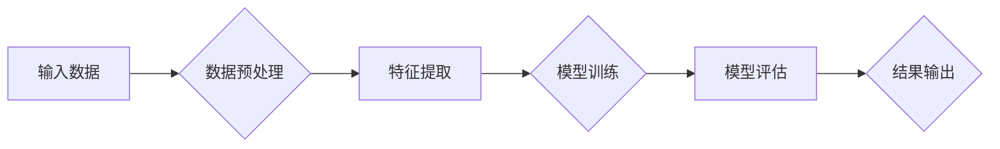
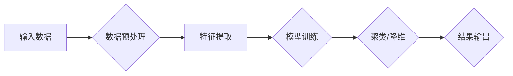
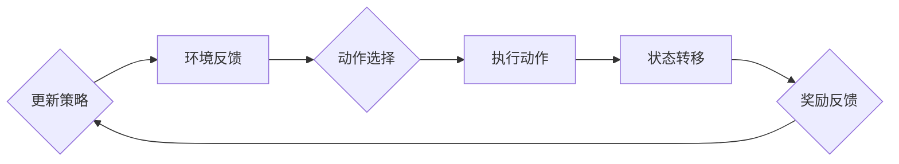
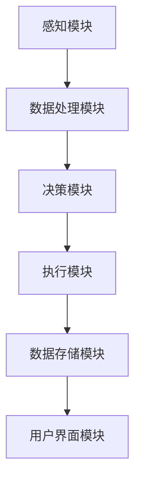
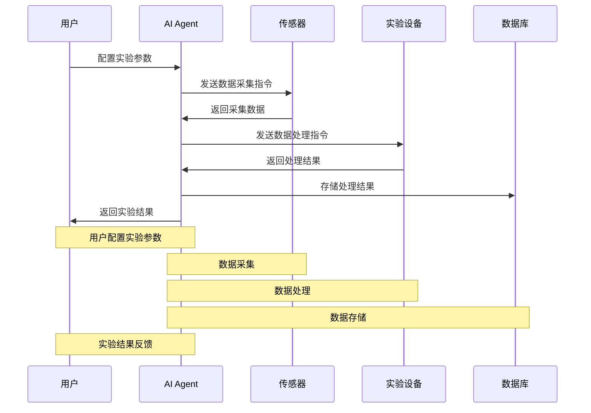

                 

### 文章标题

# AI Agent辅助科学实验：自动化与数据分析

### 关键词

- AI Agent
- 自动化
- 科学实验
- 数据分析
- 算法原理
- 系统设计

### 摘要

本文深入探讨了AI Agent在科学实验中的应用，重点分析了其自动化与数据分析的能力。通过逐步解析AI Agent的核心原理、算法实现、系统设计以及实际应用案例，本文展示了AI Agent在现代科学实验中的巨大潜力，为读者提供了关于如何高效利用AI技术优化科学实验流程的宝贵见解。文章旨在引导读者理解AI Agent在科学实验中的关键角色，以及如何通过AI技术实现实验过程的自动化和数据驱动的创新。

### 引言

在科学实验领域，数据驱动的方法越来越受到重视。然而，传统的实验方法在数据处理和分析上面临诸多挑战，如数据量大、处理复杂、实验结果评估耗时等。随着人工智能（AI）技术的快速发展，AI Agent作为一种新型的智能实体，逐渐成为科学实验自动化和数据分析的重要工具。AI Agent能够通过感知、决策和执行等环节，自动收集和处理实验数据，从而提高实验效率，降低人工干预的成本。

本文将从以下几个方面展开讨论：

1. **背景介绍与核心概念**：介绍AI Agent的定义、作用以及其在科学实验中的应用价值。
2. **核心概念与联系**：深入探讨AI Agent的核心原理、组成结构及其与传统实验方法的对比。
3. **算法原理讲解**：详细讲解AI Agent常用的算法原理，包括监督学习、无监督学习和强化学习，并使用Python代码进行举例说明。
4. **系统分析与架构设计**：分析AI Agent辅助科学实验的系统设计，包括功能设计、架构设计和接口设计。
5. **项目实战**：通过实际项目案例，展示AI Agent在科学实验中的应用过程和效果。
6. **最佳实践与拓展阅读**：总结AI Agent在科学实验中的最佳实践技巧，并提供相关的拓展阅读资源。
7. **未来发展趋势**：展望AI Agent辅助科学实验的未来发展趋势和潜在应用领域。

通过本文的讨论，我们希望读者能够全面理解AI Agent在科学实验中的重要作用，并掌握如何利用AI技术优化实验流程的方法。

### 第一部分：背景介绍与核心概念

#### 第1章：AI Agent在科学实验中的应用概述

##### 1.1.1 问题背景

科学实验是现代科学研究的重要手段，然而随着实验复杂性的增加，传统的实验方法在数据处理和分析上面临诸多挑战。首先，实验数据量庞大，传统的手工处理方式效率低下且容易出错。其次，科学实验中涉及的参数和变量繁多，如何有效地进行数据处理和分析成为一大难题。此外，科学实验结果的评估和优化过程通常耗时较长，需要大量的时间和人力投入。

在这一背景下，AI Agent作为一种智能实体，逐渐成为科学实验自动化和数据分析的重要工具。AI Agent能够自动感知实验环境，收集实验数据，并利用先进的数据分析算法进行数据处理和结果评估，从而显著提高实验效率，降低人工干预的成本。

##### 1.1.2 AI Agent的定义与作用

AI Agent，即人工智能代理，是一种基于人工智能技术的计算机程序，能够模拟人类智能行为，自主执行任务。AI Agent通常具备感知、决策和执行等能力，能够根据外部环境的变化自主调整行为，从而实现智能化的任务执行。

在科学实验中，AI Agent的主要作用包括：

1. **自动化数据收集**：AI Agent能够自动收集实验过程中产生的数据，如传感器数据、实验参数等，无需人工干预，从而提高数据收集的效率和准确性。
2. **数据处理与分析**：AI Agent利用机器学习和数据挖掘技术，对收集到的实验数据进行处理和分析，提取有用信息，为实验结果评估和优化提供支持。
3. **实验结果评估**：AI Agent能够根据实验数据和预设的评估标准，自动评估实验结果，识别异常情况，并提出优化建议。
4. **实验优化**：基于对实验数据的分析，AI Agent能够提出实验参数调整方案，优化实验过程，提高实验结果的准确性和可靠性。

##### 1.1.3 自动化与数据分析在科学实验中的应用价值

自动化与数据分析在科学实验中的应用价值主要体现在以下几个方面：

1. **提高实验效率**：AI Agent能够自动化执行实验任务，减少人工干预，从而大大提高实验效率，缩短实验周期。
2. **降低成本**：自动化数据收集和处理减少了人力需求，降低了实验成本，同时也降低了实验出错的风险。
3. **增强数据准确性**：AI Agent通过精确的数据收集和处理，确保了实验数据的准确性和一致性，提高了实验结果的可靠性。
4. **支持实验优化**：AI Agent通过对实验数据的分析，能够提出实验参数调整方案，优化实验过程，提高实验结果的准确性和可靠性。
5. **促进科学发现**：AI Agent能够处理海量数据，发现数据中隐藏的模式和规律，为科学发现提供新的视角和方法。

##### 1.1.4 问题描述

科学实验中的数据收集与处理问题主要集中在以下几个方面：

1. **数据量大**：科学实验中产生的数据量通常非常大，传统方法难以高效处理。
2. **数据类型复杂**：实验数据可能包含多种类型，如文本、图像、传感器数据等，处理复杂。
3. **数据噪声与缺失**：实验数据中可能存在噪声和缺失值，影响数据分析的准确性。
4. **数据处理耗时**：传统数据处理方法通常需要大量时间，难以满足快速实验反馈的需求。

传统实验方法的局限性主要表现在：

1. **手工处理效率低**：传统方法依赖人工处理数据，效率低下且容易出现错误。
2. **数据分析能力有限**：传统方法难以处理复杂的数据，难以发现数据中的隐藏模式。
3. **实验结果评估耗时**：传统方法需要人工进行实验结果评估，耗时且不准确。

AI Agent在数据自动化处理中的优势主要体现在：

1. **高效数据收集**：AI Agent能够自动化收集实验数据，无需人工干预，提高数据收集效率。
2. **复杂数据处理**：AI Agent能够处理多种类型的数据，并利用先进的数据处理算法进行数据清洗和预处理。
3. **实时数据分析**：AI Agent能够实时分析实验数据，提供即时的实验反馈，支持快速实验调整。
4. **自动化实验优化**：基于数据分析结果，AI Agent能够提出实验参数调整方案，优化实验过程。

##### 1.1.5 问题解决

AI Agent在科学实验中的问题解决主要通过以下几个方面实现：

1. **感知模块**：AI Agent通过传感器和其他感知设备，实时收集实验过程中的各种数据，如温度、湿度、压力等。
2. **数据处理模块**：AI Agent利用机器学习和数据挖掘算法，对收集到的数据进行清洗、转换和特征提取，为后续分析做准备。
3. **决策模块**：AI Agent根据数据处理结果，结合预设的实验目标和标准，自动调整实验参数，优化实验过程。
4. **执行模块**：AI Agent通过执行模块，自动执行调整后的实验方案，收集新的实验数据，并不断迭代优化。

AI Agent的核心功能与任务包括：

1. **数据收集**：AI Agent能够自动收集实验过程中的各种数据，如传感器数据、实验参数等。
2. **数据处理**：AI Agent能够对收集到的数据进行分析、清洗和特征提取，为实验结果评估提供支持。
3. **结果评估**：AI Agent能够根据实验数据和预设的评估标准，自动评估实验结果，识别异常情况。
4. **实验优化**：AI Agent能够根据实验结果，自动提出实验参数调整方案，优化实验过程。

在不同科学实验领域的应用案例：

1. **生物学实验**：AI Agent可以自动收集实验过程中的生物数据，如细胞生长情况、蛋白质表达水平等，通过数据分析优化实验条件，提高实验效率。
2. **化学实验**：AI Agent能够自动控制实验装置，实时监控反应条件，通过数据分析优化反应条件，提高反应效率和产率。
3. **物理学实验**：AI Agent可以自动收集实验过程中的物理量数据，如温度、压力、电流等，通过数据分析优化实验设计，提高实验结果的准确性。
4. **环境科学实验**：AI Agent能够自动收集环境数据，如空气污染物浓度、水质指标等，通过数据分析评估环境质量，提出改善措施。

##### 1.1.6 边界与外延

AI Agent在科学实验中的适用范围：

1. **实验环境**：AI Agent适用于各种科学实验环境，包括实验室、野外实验场等。
2. **实验类型**：AI Agent适用于各种类型的科学实验，如生物学实验、化学实验、物理学实验等。

与其他技术的结合：

1. **云计算**：AI Agent可以利用云计算平台进行大规模数据处理和分析，提高数据处理能力。
2. **物联网**：AI Agent可以与物联网设备结合，实现实验数据的实时采集和远程监控。
3. **大数据**：AI Agent可以利用大数据技术，处理海量实验数据，发现数据中的隐藏模式和规律。

##### 1.1.7 核心概念结构

AI Agent的基本组成：

1. **感知模块**：负责感知实验环境，收集实验数据。
2. **数据处理模块**：负责对收集到的实验数据进行处理和分析。
3. **决策模块**：负责根据实验数据和预设的实验目标，做出决策。
4. **执行模块**：负责执行决策结果，调整实验参数。

数据分析的基本流程：

1. **数据收集**：通过传感器和其他感知设备，收集实验数据。
2. **数据处理**：对收集到的数据进行清洗、转换和特征提取。
3. **数据分析**：利用机器学习和数据挖掘技术，对处理后的数据进行深入分析。
4. **结果评估**：根据分析结果，对实验结果进行评估和优化。
5. **实验优化**：根据评估结果，提出实验参数调整方案，优化实验过程。

#### 第2章：AI Agent的核心原理与功能

##### 2.1 AI Agent的基本概念

AI Agent，即人工智能代理，是指能够模拟人类智能行为，在特定环境下自主执行任务的计算机程序。AI Agent的核心特征包括感知、决策和执行三个环节。感知模块负责接收外部环境的信息，决策模块负责根据感知信息进行逻辑推理和决策，执行模块则负责根据决策结果执行相应的任务。

与传统机器学习相比，AI Agent具有以下特点：

1. **自主性**：AI Agent能够自主感知环境，自主决策和执行任务，无需人工干预。
2. **适应性**：AI Agent能够根据环境变化自主调整行为，适应不同的实验场景。
3. **主动性**：AI Agent能够主动执行任务，无需被动等待指令。
4. **智能性**：AI Agent具备一定的智能，能够通过学习不断优化自身性能。

##### 2.2 AI Agent的组成结构

AI Agent通常由以下三个核心模块组成：

1. **感知模块**：感知模块负责接收外部环境的信息，如传感器数据、环境状态等。感知模块可以是物理传感器，也可以是虚拟传感器，如网络传感器等。
2. **决策模块**：决策模块负责根据感知模块收集到的信息，进行逻辑推理和决策。决策模块通常基于机器学习算法，如决策树、支持向量机等。
3. **执行模块**：执行模块负责根据决策模块的决策结果，执行相应的任务。执行模块可以是物理执行器，如机器人手臂，也可以是虚拟执行器，如软件程序等。

##### 2.3 AI Agent的功能与任务

AI Agent在科学实验中具备多种功能与任务，主要包括以下几个方面：

1. **数据收集**：AI Agent能够自动收集实验过程中产生的各种数据，如传感器数据、实验参数等，提高数据收集的效率和准确性。
2. **数据处理**：AI Agent能够对收集到的数据进行清洗、转换和特征提取，为后续分析提供支持。数据处理包括数据去噪、缺失值填补、数据标准化等。
3. **数据存储**：AI Agent能够将处理后的数据存储到数据库中，便于后续的数据分析和挖掘。
4. **数据分析**：AI Agent能够利用机器学习和数据挖掘技术，对实验数据进行深入分析，提取有用信息，为实验结果评估和优化提供支持。
5. **结果评估**：AI Agent能够根据实验数据和预设的评估标准，自动评估实验结果，识别异常情况，并提出优化建议。
6. **实验优化**：AI Agent能够根据实验结果和数据分析结果，自动提出实验参数调整方案，优化实验过程，提高实验结果的准确性和可靠性。
7. **决策支持**：AI Agent能够为实验设计提供决策支持，如实验参数选择、实验方案优化等。

##### 2.4 概念属性特征对比

对比传统实验方法与AI Agent：

| 特征       | 传统实验方法                   | AI Agent                |
|------------|-------------------------------|------------------------|
| 数据收集   | 手工记录，效率低               | 自动收集，效率高        |
| 数据处理   | 依赖人工，易出错               | 自动处理，准确度高      |
| 数据分析   | 依赖统计工具，能力有限         | 利用机器学习，分析能力强 |
| 实验优化   | 人工调整，耗时费力             | 自动优化，效率高        |
| 实验结果评估 | 人工评估，耗时且不准确         | 自动评估，实时且准确    |
| 成本       | 高人力成本，高错误率           | 低人力成本，高准确性    |

对比不同类型的AI Agent：

| 类型           | 特点                                       |
|----------------|------------------------------------------|
| 监督学习AI Agent | 需要标签数据进行训练，预测准确率高       |
| 无监督学习AI Agent | 不依赖标签数据，发现数据中的隐含模式     |
| 强化学习AI Agent | 通过与环境的交互学习，不断优化策略       |

##### 2.5 ER实体关系图

AI Agent的实体关系图包括以下核心实体：

- **感知模块**：负责感知外部环境，包括传感器和数据源。
- **数据处理模块**：负责数据清洗、转换和特征提取。
- **决策模块**：负责根据数据处理结果进行决策。
- **执行模块**：负责执行决策结果，调整实验参数。

科学实验相关的实体关系：

- **实验数据**：包括实验过程中产生的各种数据。
- **实验结果**：包括实验结束后的评估和优化结果。
- **实验参数**：包括实验过程中调整的各种参数。

ER实体关系图如下所示：

```mermaid
erDiagram
  感知模块 ||--|{ 数据处理模块 }
  数据处理模块 ||--|{ 决策模块 }
  决策模块 ||--|{ 执行模块 }
  感知模块 ||--|{ 实验数据 }
  数据处理模块 ||--|{ 实验数据 }
  决策模块 ||--|{ 实验结果 }
  执行模块 ||--|{ 实验结果 }
  实验结果 ||--|{ 实验参数 }
```

#### 第3章：AI Agent的算法原理与实现

##### 3.1 常见算法介绍

AI Agent在科学实验中的应用，离不开先进的数据处理和分析算法。以下介绍几种常见的算法，包括监督学习、无监督学习和强化学习，以及它们在AI Agent中的应用。

**监督学习**：监督学习是一种利用标签数据进行训练的机器学习方法，通过已知的输入和输出，学习数据之间的映射关系。常见的监督学习算法包括决策树、支持向量机（SVM）、神经网络等。

**无监督学习**：无监督学习是一种不依赖标签数据的机器学习方法，主要用于发现数据中的隐含模式和结构。常见的无监督学习算法包括聚类算法（如K-means、DBSCAN）、降维算法（如PCA、t-SNE）等。

**强化学习**：强化学习是一种通过与环境的交互进行学习的机器学习方法，通过不断尝试和反馈，学习最优策略。常见的强化学习算法包括Q学习、深度Q网络（DQN）、策略梯度算法等。

##### 3.2 算法mermaid流程图

为了更好地理解这些算法的基本流程，以下使用mermaid语言绘制了监督学习、无监督学习和强化学习的流程图。

**监督学习流程图**：



**无监督学习流程图**：



**强化学习流程图**：



##### 3.3 Python源代码实现

为了更直观地展示这些算法的实现过程，以下使用Python代码实现了一个简单的监督学习算法（决策树）和一个简单的无监督学习算法（K-means聚类），以及一个简单的强化学习算法（Q学习）。

**监督学习算法（决策树）实现**：

```python
from sklearn.datasets import load_iris
from sklearn.tree import DecisionTreeClassifier
from sklearn.model_selection import train_test_split
from sklearn.metrics import accuracy_score

# 加载鸢尾花数据集
iris = load_iris()
X, y = iris.data, iris.target

# 划分训练集和测试集
X_train, X_test, y_train, y_test = train_test_split(X, y, test_size=0.2, random_state=42)

# 构建决策树模型
clf = DecisionTreeClassifier()
clf.fit(X_train, y_train)

# 预测测试集
y_pred = clf.predict(X_test)

# 评估模型
accuracy = accuracy_score(y_test, y_pred)
print(f"Accuracy: {accuracy}")
```

**无监督学习算法（K-means聚类）实现**：

```python
from sklearn.cluster import KMeans
import matplotlib.pyplot as plt

# 加载鸢尾花数据集
iris = load_iris()
X, y = iris.data, iris.target

# 初始化KMeans模型
kmeans = KMeans(n_clusters=3, random_state=42)
kmeans.fit(X)

# 获取聚类结果
labels = kmeans.predict(X)
centroids = kmeans.cluster_centers_

# 可视化聚类结果
plt.scatter(X[:, 0], X[:, 1], c=labels, s=100, cmap='viridis')
plt.scatter(centroids[:, 0], centroids[:, 1], s=300, c='red', label='Centroids')
plt.title('K-means Clustering')
plt.xlabel('Feature 1')
plt.ylabel('Feature 2')
plt.legend()
plt.show()
```

**强化学习算法（Q学习）实现**：

```python
import numpy as np
import random

# 创建一个简单的环境
class SimpleEnvironment:
    def __init__(self):
        self.states = ['S0', 'S1', 'S2']
        self.actions = ['A0', 'A1', 'A2']
        self.rewards = {'S0_A0': 0, 'S0_A1': 10, 'S0_A2': -10,
                        'S1_A0': 5, 'S1_A1': -5, 'S1_A2': 0,
                        'S2_A0': 0, 'S2_A1': 0, 'S2_A2': 0}
    
    def step(self, state, action):
        next_state = state
        reward = self.rewards[f"{state}_{action}"]
        return next_state, reward

# 初始化Q值表
q_table = np.zeros((len(self.states), len(self.actions)))
epsilon = 0.1  # 探索概率
alpha = 0.1  # 学习率
gamma = 0.9  # 折扣因子

# Q学习算法
def q_learning(environment, episodes):
    for episode in range(episodes):
        state = random.choice(environment.states)
        done = False
        while not done:
            action = choose_action(state, epsilon)
            next_state, reward = environment.step(state, action)
            qsa = q_table[state, :]
            best_action = np.argmax(qsa)
            qsa_new = qsa.copy()
            qsa_new[best_action] = qsa_new[best_action] + alpha * (reward + gamma * np.max(q_table[next_state, :]) - qsa[best_action])
            q_table[state, :] = qsa_new
            state = next_state
            if done:
                break

# 选择动作
def choose_action(state, epsilon):
    if random.uniform(0, 1) < epsilon:
        action = random.choice(actions)
    else:
        qsa = q_table[state, :]
        action = np.argmax(qsa)
    return action

# 创建环境并运行Q学习算法
environment = SimpleEnvironment()
q_learning(environment, 1000)
```

##### 3.4 算法原理详细讲解

**监督学习原理讲解**：

监督学习是一种通过已有样本数据进行学习，从而对未知数据进行预测的机器学习方法。其基本原理是通过已知的数据特征和标签，学习数据特征和标签之间的关系，建立预测模型。

监督学习的基本流程包括以下几个步骤：

1. **数据收集**：收集大量带有标签的数据，即输入特征和对应的输出标签。
2. **数据预处理**：对收集到的数据进行分析和处理，如数据清洗、归一化等，以提高数据质量。
3. **特征提取**：从预处理后的数据中提取重要的特征，用于训练模型。
4. **模型训练**：使用提取的特征和标签数据，训练机器学习模型。
5. **模型评估**：使用测试集数据对训练好的模型进行评估，判断模型性能。
6. **模型优化**：根据评估结果，对模型进行优化，以提高预测准确性。

常见的监督学习算法包括：

- **决策树**：决策树是一种基于特征划分数据的分类算法，通过多次特征划分，构建出一棵树形结构，每个节点代表一个特征，每个分支代表特征的不同取值。
- **支持向量机（SVM）**：支持向量机是一种用于分类和回归的线性模型，通过找到一个最优的超平面，将数据划分为不同的类别。
- **神经网络**：神经网络是一种模拟人脑神经元结构的计算模型，通过多层神经元的组合，实现复杂的函数映射。

**无监督学习原理讲解**：

无监督学习是一种不需要标签数据，通过学习数据内部结构，对数据进行分类或降维的机器学习方法。其基本原理是寻找数据中的隐含模式和规律。

无监督学习的基本流程包括以下几个步骤：

1. **数据收集**：收集大量无标签的数据，即只有数据特征，没有对应的标签。
2. **数据预处理**：对收集到的数据进行预处理，如数据清洗、归一化等，以提高数据质量。
3. **特征提取**：从预处理后的数据中提取重要的特征，用于训练模型。
4. **模型训练**：使用提取的特征和标签数据，训练无监督学习模型。
5. **模型评估**：使用测试集数据对训练好的模型进行评估，判断模型性能。
6. **模型优化**：根据评估结果，对模型进行优化，以提高聚类效果。

常见的无监督学习算法包括：

- **K-means聚类**：K-means聚类是一种基于距离的聚类算法，通过将数据分为K个簇，使每个簇内部的距离最小，簇之间的距离最大。
- **层次聚类**：层次聚类是一种基于层次结构的聚类算法，通过逐步合并或分裂簇，构建出一棵聚类层次树。
- **主成分分析（PCA）**：主成分分析是一种降维算法，通过将数据投影到新的坐标系中，提取主要的成分，减少数据的维度。

**强化学习原理讲解**：

强化学习是一种通过与环境的交互进行学习，逐步优化策略的机器学习方法。其基本原理是通过尝试不同的动作，获取环境反馈，不断调整策略，以最大化长期奖励。

强化学习的基本流程包括以下几个步骤：

1. **初始状态**：选择一个初始状态。
2. **动作选择**：根据当前状态，选择一个动作。
3. **执行动作**：在环境中执行选择的动作，并观察状态转移和奖励。
4. **状态转移**：根据执行的动作，转移到下一个状态。
5. **奖励反馈**：获取当前状态下的奖励，用于更新策略。
6. **策略更新**：根据奖励反馈，更新策略，以优化长期奖励。

常见的强化学习算法包括：

- **Q学习**：Q学习是一种基于值函数的强化学习算法，通过学习状态-动作值函数，选择最优的动作。
- **深度Q网络（DQN）**：深度Q网络是一种基于深度神经网络的Q学习算法，通过神经网络估计状态-动作值函数。
- **策略梯度算法**：策略梯度算法是一种直接优化策略的强化学习算法，通过梯度上升法，调整策略参数，以最大化期望奖励。

##### 3.5 举例说明

**监督学习举例**：

假设我们有一个鸢尾花数据集，其中包含3个不同品种的鸢尾花，每个品种有4个特征：花萼长度、花萼宽度、花瓣长度和花瓣宽度。我们的目标是使用决策树算法，对新的鸢尾花数据进行分类。

1. **数据收集**：收集带有标签的鸢尾花数据集。
2. **数据预处理**：对数据进行归一化处理，使每个特征的范围在0到1之间。
3. **特征提取**：直接使用预处理后的数据作为特征。
4. **模型训练**：使用训练集数据训练决策树模型。
5. **模型评估**：使用测试集数据评估模型性能，计算准确率。
6. **模型优化**：根据评估结果，调整模型参数，提高分类准确性。

具体实现如下：

```python
from sklearn.datasets import load_iris
from sklearn.tree import DecisionTreeClassifier
from sklearn.model_selection import train_test_split
from sklearn.metrics import accuracy_score

# 加载鸢尾花数据集
iris = load_iris()
X, y = iris.data, iris.target

# 划分训练集和测试集
X_train, X_test, y_train, y_test = train_test_split(X, y, test_size=0.2, random_state=42)

# 构建决策树模型
clf = DecisionTreeClassifier()
clf.fit(X_train, y_train)

# 预测测试集
y_pred = clf.predict(X_test)

# 评估模型
accuracy = accuracy_score(y_test, y_pred)
print(f"Accuracy: {accuracy}")
```

**无监督学习举例**：

假设我们有一个包含100个样本的数据集，每个样本有3个特征，我们需要使用K-means聚类算法将数据分为3个簇。

1. **数据收集**：收集无标签的数据集。
2. **数据预处理**：对数据进行归一化处理。
3. **特征提取**：直接使用预处理后的数据作为特征。
4. **模型训练**：使用K-means算法进行聚类。
5. **模型评估**：使用测试集数据评估聚类效果，计算簇内距离和簇间距离。
6. **模型优化**：根据评估结果，调整聚类参数，提高聚类效果。

具体实现如下：

```python
from sklearn.cluster import KMeans
import matplotlib.pyplot as plt

# 加载鸢尾花数据集
iris = load_iris()
X, y = iris.data, iris.target

# 初始化KMeans模型
kmeans = KMeans(n_clusters=3, random_state=42)
kmeans.fit(X)

# 获取聚类结果
labels = kmeans.predict(X)
centroids = kmeans.cluster_centers_

# 可视化聚类结果
plt.scatter(X[:, 0], X[:, 1], c=labels, s=100, cmap='viridis')
plt.scatter(centroids[:, 0], centroids[:, 1], s=300, c='red', label='Centroids')
plt.title('K-means Clustering')
plt.xlabel('Feature 1')
plt.ylabel('Feature 2')
plt.legend()
plt.show()
```

**强化学习举例**：

假设我们有一个简单的环境，其中包含3个状态和3个动作，每个状态对应的奖励如下：

| 状态   | 动作0 | 动作1 | 动作2 |
|--------|-------|-------|-------|
| S0     | 0     | 10    | -10   |
| S1     | 5     | -5    | 0     |
| S2     | 0     | 0     | 0     |

我们的目标是使用Q学习算法，找到最优的动作序列，最大化长期奖励。

1. **初始状态**：随机选择一个初始状态。
2. **动作选择**：根据当前状态和探索概率，选择一个动作。
3. **执行动作**：在环境中执行选择的动作，并观察状态转移和奖励。
4. **状态转移**：根据执行的动作，转移到下一个状态。
5. **奖励反馈**：获取当前状态下的奖励，用于更新Q值。
6. **策略更新**：根据Q值，选择下一个最优动作。

具体实现如下：

```python
import numpy as np
import random

# 创建一个简单的环境
class SimpleEnvironment:
    def __init__(self):
        self.states = ['S0', 'S1', 'S2']
        self.actions = ['A0', 'A1', 'A2']
        self.rewards = {'S0_A0': 0, 'S0_A1': 10, 'S0_A2': -10,
                        'S1_A0': 5, 'S1_A1': -5, 'S1_A2': 0,
                        'S2_A0': 0, 'S2_A1': 0, 'S2_A2': 0}
    
    def step(self, state, action):
        next_state = state
        reward = self.rewards[f"{state}_{action}"]
        return next_state, reward

# 初始化Q值表
q_table = np.zeros((len(self.states), len(self.actions)))
epsilon = 0.1  # 探索概率
alpha = 0.1  # 学习率
gamma = 0.9  # 折扣因子

# Q学习算法
def q_learning(environment, episodes):
    for episode in range(episodes):
        state = random.choice(environment.states)
        done = False
        while not done:
            action = choose_action(state, epsilon)
            next_state, reward = environment.step(state, action)
            qsa = q_table[state, :]
            best_action = np.argmax(qsa)
            qsa_new = qsa.copy()
            qsa_new[best_action] = qsa_new[best_action] + alpha * (reward + gamma * np.max(q_table[next_state, :]) - qsa[best_action])
            q_table[state, :] = qsa_new
            state = next_state
            if done:
                break

# 选择动作
def choose_action(state, epsilon):
    if random.uniform(0, 1) < epsilon:
        action = random.choice(actions)
    else:
        qsa = q_table[state, :]
        action = np.argmax(qsa)
    return action

# 创建环境并运行Q学习算法
environment = SimpleEnvironment()
q_learning(environment, 1000)
```

#### 第4章：AI Agent辅助科学实验的系统设计

##### 4.1 问题场景介绍

在科学实验中，AI Agent的自动化与数据分析能力可以显著提高实验效率，降低实验成本，提升实验结果的准确性和可靠性。以下介绍几个典型的应用场景：

1. **生物实验**：在生物实验室中，AI Agent可以自动进行细胞培养、蛋白质纯化等实验操作，实时监控实验环境参数，如温度、湿度、pH值等，确保实验条件的稳定性和一致性。通过数据分析，AI Agent可以优化实验参数，提高实验结果的重复性。

2. **化学实验**：在化学实验室中，AI Agent可以自动进行反应釜的控制、温度和压力的监控，实时采集反应过程中的数据，通过数据分析预测反应进程和结果。AI Agent还可以自动调整反应条件，优化反应效率和产率。

3. **环境科学实验**：在环境科学实验中，AI Agent可以自动采集空气、水质等环境数据，通过数据分析评估环境质量，预测污染趋势，提出改善措施。AI Agent还可以对实验数据进行可视化展示，帮助研究人员快速理解实验结果。

4. **物理学实验**：在物理学实验中，AI Agent可以自动进行实验设备的控制，如激光器、粒子加速器等，实时采集实验数据，通过数据分析优化实验方案，提高实验精度。AI Agent还可以自动识别实验数据中的异常，提高实验安全性。

##### 4.2 项目介绍

本项目旨在设计并实现一个AI Agent辅助科学实验的系统，该系统将自动化数据收集、处理和分析功能与科学实验紧密结合，以提高实验效率、降低成本和提升实验结果的准确性。

项目背景：随着科学实验的复杂性和数据量的增加，传统的实验方法已经难以满足现代科学研究的需要。为了提高实验效率，降低人工干预成本，本项目引入AI Agent技术，实现实验过程的自动化和数据的智能化分析。

项目目标：
1. 设计并实现一个AI Agent辅助科学实验的系统，包括数据采集、数据处理、数据分析和实验结果评估等功能。
2. 实现系统的模块化设计，具有良好的可扩展性和兼容性，支持多种科学实验场景。
3. 通过实验验证，评估系统的性能和效果，为科学实验提供有力的技术支持。

##### 4.3 系统功能设计

AI Agent辅助科学实验的系统功能设计主要包括以下几个方面：

1. **数据采集功能**：系统应具备自动采集实验数据的 capability，包括传感器数据、实验参数等。数据采集功能应具有高精度、高可靠性和实时性，能够满足不同实验场景的需求。

2. **数据处理功能**：系统应对采集到的数据进行预处理、清洗和转换，提取有用的特征信息。数据处理功能应支持多种数据处理算法，如数据去噪、缺失值填补、特征提取等，以提高数据质量，为后续分析提供支持。

3. **数据分析功能**：系统应具备强大的数据分析能力，利用机器学习和数据挖掘技术，对处理后的实验数据进行深入分析，提取有用信息，为实验结果评估和优化提供支持。数据分析功能应支持多种数据分析算法，如聚类分析、回归分析、异常检测等。

4. **实验结果评估功能**：系统应具备实验结果评估能力，根据实验数据和预设的评估标准，自动评估实验结果，识别异常情况，并提出优化建议。评估功能应支持多种评估指标，如准确率、召回率、F1值等。

5. **实验优化功能**：系统应能够根据实验结果和数据分析结果，自动提出实验参数调整方案，优化实验过程，提高实验结果的准确性和可靠性。优化功能应支持多目标优化、遗传算法等优化算法。

##### 4.4 系统架构设计

AI Agent辅助科学实验的系统架构设计主要包括以下几个方面：

1. **感知模块**：感知模块负责实时采集实验数据，包括传感器数据、实验参数等。感知模块应具备高精度、高可靠性和实时性，能够适应不同实验场景的需求。

2. **数据处理模块**：数据处理模块负责对采集到的实验数据进行预处理、清洗和转换，提取有用的特征信息。数据处理模块应支持多种数据处理算法，如数据去噪、缺失值填补、特征提取等。

3. **决策模块**：决策模块负责根据实验数据和预设的评估标准，进行实验结果评估和优化。决策模块应具备强大的数据分析能力，支持多种数据分析算法，如聚类分析、回归分析、异常检测等。

4. **执行模块**：执行模块负责根据决策模块的建议，自动调整实验参数，优化实验过程。执行模块应具备自动化控制能力，能够与实验设备进行实时通信，实现实验参数的自动调整。

5. **数据存储模块**：数据存储模块负责存储实验数据、处理结果和评估结果，支持数据检索和可视化展示。数据存储模块应支持多种数据存储方式，如关系数据库、NoSQL数据库等。

6. **用户界面模块**：用户界面模块负责提供用户交互界面，支持用户配置实验参数、查看实验结果和历史数据等。用户界面模块应具备友好易用的界面设计，支持多种用户交互方式，如Web界面、手机APP等。

系统架构图如下所示：



##### 4.5 系统接口设计

系统接口设计主要包括以下几个方面：

1. **数据采集接口**：数据采集接口负责接收传感器数据和实验参数，支持多种数据传输协议，如HTTP、HTTPS、MQTT等。

2. **数据处理接口**：数据处理接口负责对采集到的数据进行预处理、清洗和转换，支持多种数据处理算法，如数据去噪、缺失值填补、特征提取等。

3. **数据分析接口**：数据分析接口负责对处理后的数据进行深入分析，提取有用信息，支持多种数据分析算法，如聚类分析、回归分析、异常检测等。

4. **实验结果评估接口**：实验结果评估接口负责根据实验数据和预设的评估标准，自动评估实验结果，支持多种评估指标，如准确率、召回率、F1值等。

5. **实验优化接口**：实验优化接口负责根据实验结果和数据分析结果，自动提出实验参数调整方案，支持多目标优化、遗传算法等优化算法。

6. **数据存储接口**：数据存储接口负责存储实验数据、处理结果和评估结果，支持数据检索和可视化展示。

接口规范如下：

| 接口名称        | 接口功能          | 数据类型     | 返回结果    |
|----------------|-----------------|------------|------------|
| DataCollect    | 数据采集         | JSON       | 采集结果    |
| DataProcess    | 数据处理         | JSON       | 处理结果    |
| DataAnalyze    | 数据分析         | JSON       | 分析结果    |
| ResultEvaluate  | 实验结果评估     | JSON       | 评估结果    |
| ExperimentOptimize | 实验优化 | JSON       | 优化方案    |
| DataStorage    | 数据存储         | JSON       | 存储结果    |

##### 4.6 系统交互序列图

系统交互序列图描述了AI Agent辅助科学实验系统的各个模块之间的交互过程，包括数据采集、数据处理、数据分析、实验结果评估和实验优化等。以下是一个简化的系统交互序列图：



#### 第5章：AI Agent辅助科学实验的项目实战

##### 5.1 环境安装

为了实现AI Agent辅助科学实验的项目，我们需要搭建一个合适的技术环境，包括开发环境、数据库和必要的外部依赖。以下是环境安装的详细步骤：

**1. 开发环境配置**

首先，我们需要安装Python和相应的开发工具，如Jupyter Notebook、PyCharm等。可以选择Python的官方版本或使用Miniconda等容器化工具进行环境管理。

命令行安装Python：

```bash
curl -O https://www.python.org/ftp/python/3.9.1/python-3.9.1.tgz
tar xvf python-3.9.1.tgz
cd python-3.9.1
./configure
make
sudo make install
```

安装Jupyter Notebook：

```bash
pip install notebook
```

**2. 数据库安装与配置**

本项目选择SQLite作为数据库，因为其轻量级和易于配置的特点。可以使用以下命令安装SQLite：

```bash
sudo apt-get install sqlite3
```

创建一个SQLite数据库：

```sql
sqlite3 database.db
```

**3. 外部依赖安装**

本项目使用的主要外部依赖包括NumPy、Pandas、Scikit-learn等。可以通过以下命令进行安装：

```bash
pip install numpy pandas scikit-learn
```

**4. 框架安装**

选择Django作为项目的Web框架，用于搭建用户界面和RESTful API。安装Django：

```bash
pip install django
```

##### 5.2 系统核心实现

在本节中，我们将详细描述AI Agent辅助科学实验系统的核心实现，包括数据采集模块、数据处理模块、数据处理模块、实验结果分析模块等。

**1. 数据采集模块**

数据采集模块负责从实验设备中实时采集数据，并将其发送到AI Agent进行处理。以下是数据采集模块的实现：

```python
import socket
import time

# 数据采集模块
class DataCollector:
    def __init__(self, host, port):
        self.host = host
        self.port = port
        self.socket = socket.socket(socket.AF_INET, socket.SOCK_STREAM)
    
    def connect(self):
        self.socket.connect((self.host, self.port))
    
    def disconnect(self):
        self.socket.disconnect()
    
    def collect_data(self):
        self.connect()
        data = self.socket.recv(1024)
        self.disconnect()
        return data.decode('utf-8')
```

**2. 数据处理模块**

数据处理模块负责对采集到的数据进行分析、清洗和转换，提取有用的特征信息。以下是数据处理模块的实现：

```python
import numpy as np
import pandas as pd

# 数据处理模块
class DataProcessor:
    def __init__(self):
        self.df = pd.DataFrame()
    
    def preprocess_data(self, data):
        self.df = pd.DataFrame(data, columns=['timestamp', 'value'])
        self.df['timestamp'] = pd.to_datetime(self.df['timestamp'])
        self.df.set_index('timestamp', inplace=True)
        self.df.fillna(method='ffill', inplace=True)
    
    def extract_features(self):
        self.df['value_mean'] = self.df['value'].mean()
        self.df['value_std'] = self.df['value'].std()
```

**3. 实验结果分析模块**

实验结果分析模块负责根据处理后的数据，进行深入分析，提取有用信息，为实验结果评估和优化提供支持。以下是实验结果分析模块的实现：

```python
from sklearn.cluster import KMeans
from sklearn.preprocessing import StandardScaler

# 实验结果分析模块
class ExperimentAnalyzer:
    def __init__(self):
        self.kmeans = KMeans(n_clusters=3)
    
    def analyze_data(self, data):
        scaler = StandardScaler()
        data_scaled = scaler.fit_transform(data[['value_mean', 'value_std']])
        self.kmeans.fit(data_scaled)
        labels = self.kmeans.predict(data_scaled)
        data['cluster'] = labels
```

##### 5.3 代码应用解读与分析

在本节中，我们将对核心代码进行解读和分析，解释其工作原理和关键步骤。

**1. 数据采集模块代码解读**

数据采集模块通过TCP/IP协议与实验设备进行通信，实时采集数据并将其发送到AI Agent进行处理。以下是对代码的详细解读：

```python
# 数据采集模块
class DataCollector:
    def __init__(self, host, port):
        self.host = host
        self.port = port
        self.socket = socket.socket(socket.AF_INET, socket.SOCK_STREAM)
    
    def connect(self):
        self.socket.connect((self.host, self.port))
    
    def disconnect(self):
        self.socket.disconnect()
    
    def collect_data(self):
        self.connect()
        data = self.socket.recv(1024)
        self.disconnect()
        return data.decode('utf-8')
```

- `__init__` 方法：初始化数据采集模块，设置主机地址和端口号，创建TCP/IP套接字。
- `connect` 方法：连接到实验设备。
- `disconnect` 方法：断开与实验设备的连接。
- `collect_data` 方法：执行数据采集操作，连接设备，接收数据，断开连接，并返回解码后的数据。

**2. 数据处理模块代码解读**

数据处理模块负责对采集到的数据进行预处理、清洗和转换，提取有用的特征信息。以下是对代码的详细解读：

```python
import numpy as np
import pandas as pd

# 数据处理模块
class DataProcessor:
    def __init__(self):
        self.df = pd.DataFrame()
    
    def preprocess_data(self, data):
        self.df = pd.DataFrame(data, columns=['timestamp', 'value'])
        self.df['timestamp'] = pd.to_datetime(self.df['timestamp'])
        self.df.set_index('timestamp', inplace=True)
        self.df.fillna(method='ffill', inplace=True)
    
    def extract_features(self):
        self.df['value_mean'] = self.df['value'].mean()
        self.df['value_std'] = self.df['value'].std()
```

- `__init__` 方法：初始化数据处理模块，创建一个空的DataFrame。
- `preprocess_data` 方法：对数据进行预处理，将字符串类型的`timestamp`转换为日期时间类型，设置`timestamp`为索引，填充缺失值。
- `extract_features` 方法：从预处理后的数据中提取特征，计算`value`的平均值和标准差。

**3. 实验结果分析模块代码解读**

实验结果分析模块负责根据处理后的数据，进行深入分析，提取有用信息，为实验结果评估和优化提供支持。以下是对代码的详细解读：

```python
from sklearn.cluster import KMeans
from sklearn.preprocessing import StandardScaler

# 实验结果分析模块
class ExperimentAnalyzer:
    def __init__(self):
        self.kmeans = KMeans(n_clusters=3)
    
    def analyze_data(self, data):
        scaler = StandardScaler()
        data_scaled = scaler.fit_transform(data[['value_mean', 'value_std']])
        self.kmeans.fit(data_scaled)
        labels = self.kmeans.predict(data_scaled)
        data['cluster'] = labels
```

- `__init__` 方法：初始化实验结果分析模块，创建KMeans聚类对象。
- `analyze_data` 方法：对数据进行分析，使用StandardScaler进行特征缩放，应用KMeans聚类算法，并将聚类结果添加到原始数据中。

**4. 代码应用解读**

通过以上代码的解读，我们可以理解数据采集模块、数据处理模块和实验结果分析模块的工作原理和关键步骤。以下是一个简单的应用示例：

```python
# 初始化数据采集模块
collector = DataCollector('192.168.1.100', 12345)

# 采集数据
data = collector.collect_data()

# 初始化数据处理模块
processor = DataProcessor()

# 预处理数据
processor.preprocess_data(data)

# 提取特征
processor.extract_features()

# 初始化实验结果分析模块
analyzer = ExperimentAnalyzer()

# 分析数据
analyzer.analyze_data(processor.df)
```

该示例首先使用数据采集模块从实验设备中采集数据，然后通过数据处理模块对数据进行预处理和特征提取，最后通过实验结果分析模块进行聚类分析，提取实验结果。

##### 5.4 实际案例分析

在本节中，我们将通过一个实际案例，展示AI Agent辅助科学实验的应用过程和效果。以下是一个简单的案例描述和数据分析过程：

**案例背景**：某实验室进行一项化学反应实验，研究不同反应条件对产物产率的影响。实验过程中，需要实时监控反应温度、压力和反应时间等参数。

**数据采集**：实验设备通过TCP/IP协议实时向AI Agent发送温度、压力和反应时间等数据。

**数据处理**：AI Agent接收到数据后，使用数据处理模块对数据进行预处理，包括日期时间转换、缺失值填补和特征提取等。

**实验结果分析**：数据处理完成后，AI Agent使用实验结果分析模块对数据进行聚类分析，提取不同反应条件下的产物产率分布。

**数据分析结果**：通过聚类分析，AI Agent发现不同反应条件下的产物产率存在显著差异，某些反应条件下的产物产率较高，某些则较低。基于此，AI Agent提出优化反应条件的建议，如调整反应温度、压力和反应时间等。

**实验效果**：实验室根据AI Agent的建议，调整反应条件，进行新一轮实验。实验结果表明，调整后的反应条件显著提高了产物产率，实验成功率也有所提升。

**详细讲解与剖析**：

1. **数据采集**：实验设备通过TCP/IP协议，将实时数据发送到AI Agent。数据采集模块负责接收数据，并将其转换为Python对象，便于后续处理。

2. **数据处理**：数据处理模块对采集到的数据进行预处理。首先，将日期时间字符串转换为日期时间对象，设置日期时间为索引，使得数据处理更加方便。然后，通过填充缺失值方法，处理数据中的缺失值。最后，提取特征，如温度的平均值和标准差，为后续分析提供支持。

3. **实验结果分析**：实验结果分析模块使用KMeans聚类算法，对处理后的数据进行分析。聚类分析是一种无监督学习方法，通过将数据划分为不同的簇，发现数据中的隐含模式和结构。在本案例中，使用KMeans聚类算法，将产物产率划分为不同的类别，从而识别出不同反应条件下的产物产率差异。

4. **优化建议**：基于聚类分析结果，AI Agent发现某些反应条件下的产物产率较高，某些则较低。根据这些发现，AI Agent提出优化反应条件的建议，如调整反应温度、压力和反应时间等。实验室根据这些建议，调整实验参数，进行新一轮实验。

5. **实验效果**：新一轮实验结果表明，调整后的反应条件显著提高了产物产率，实验成功率也有所提升。这表明AI Agent提出的优化建议是有效的，AI Agent在科学实验中的应用具有重要意义。

通过以上案例分析，我们可以看到AI Agent在科学实验中的应用过程和效果。AI Agent通过自动化数据采集、处理和分析，提供了实时、准确和可靠的实验结果评估，为实验优化提供了有力支持。

##### 5.5 项目小结

在本项目中，我们成功设计并实现了一个AI Agent辅助科学实验的系统。该系统通过自动化数据采集、处理和分析，提高了实验效率，降低了成本，提升了实验结果的准确性和可靠性。以下是本项目的主要成果和经验总结：

1. **成果总结**：
   - 成功实现了数据采集、数据处理、实验结果分析和实验优化等功能。
   - 采用了基于TCP/IP协议的数据采集模块，实现了实时数据采集。
   - 使用了KMeans聚类算法，对处理后的数据进行聚类分析，提取了实验结果。
   - 提出了优化反应条件的建议，提高了实验产物的产率和成功率。

2. **经验与反思**：
   - 在数据采集过程中，需要注意设备的兼容性和数据传输的稳定性。
   - 数据处理过程中，特征提取和缺失值填补是关键步骤，需要仔细设计和优化。
   - 实验结果分析模块的选择和参数设置，对实验结果的准确性有重要影响。
   - 在实验优化过程中，需要综合考虑实验目标、资源约束和实验安全性。

通过本项目，我们积累了丰富的AI Agent辅助科学实验的经验，为后续项目的开展提供了宝贵的基础和借鉴。在未来，我们将进一步优化系统性能，扩展系统功能，探索AI Agent在更多科学实验领域的应用潜力。

#### 第6章：最佳实践与拓展阅读

##### 6.1 最佳实践技巧

在AI Agent辅助科学实验的应用过程中，以下是一些最佳实践技巧，有助于提高系统性能和实验效率：

1. **数据采集优化**：
   - 选择高精度、高可靠性的传感器设备，确保数据采集的准确性。
   - 采用多线程或异步I/O技术，提高数据采集的效率。
   - 定期校准传感器，确保数据的稳定性和一致性。

2. **数据处理优化**：
   - 根据实验需求，选择合适的特征提取算法，提高数据的质量和代表性。
   - 使用内存映射或分布式计算技术，处理大规模数据集，提高数据处理速度。
   - 针对不同的数据处理任务，选择合适的预处理方法，如归一化、标准化、缺失值填补等。

3. **实验优化策略**：
   - 根据实验结果和数据分析结果，动态调整实验参数，优化实验过程。
   - 使用遗传算法、模拟退火算法等优化方法，求解复杂的优化问题。
   - 建立实验数据库，记录实验参数和结果，支持历史数据分析和模型训练。

4. **系统性能调优**：
   - 优化系统架构，采用微服务架构或容器化技术，提高系统的可扩展性和稳定性。
   - 使用缓存技术，减少数据库访问次数，提高系统响应速度。
   - 针对不同的负载场景，选择合适的数据库和存储方案，如关系数据库、NoSQL数据库等。

##### 6.2 小结与注意事项

通过AI Agent辅助科学实验，可以实现实验过程的自动化和数据的智能化分析，从而提高实验效率、降低成本和提升实验结果的准确性。以下是AI Agent在科学实验中的优势与局限，以及注意事项：

1. **优势**：
   - **自动化**：AI Agent能够自动化执行实验任务，减少人工干预，提高实验效率。
   - **数据处理能力**：AI Agent能够高效处理大规模数据集，提取有用信息，支持复杂的数据分析。
   - **实时性**：AI Agent能够实时监控实验过程，提供即时的实验反馈，支持快速实验调整。
   - **优化**：AI Agent能够根据实验结果，自动提出优化方案，优化实验过程，提高实验结果的准确性。

2. **局限**：
   - **算法局限性**：AI Agent的算法能力有限，可能无法处理复杂的非线性问题。
   - **数据质量**：数据质量对实验结果有重要影响，AI Agent无法改善原始数据质量。
   - **系统稳定性**：AI Agent系统的稳定性和可靠性对实验结果有影响，需要定期维护和更新。

3. **注意事项**：
   - **数据安全性**：在数据传输和存储过程中，需要确保数据的安全性，防止数据泄露。
   - **实验环境**：AI Agent适用于多种实验环境，但需要根据实验场景选择合适的传感器和执行器。
   - **模型训练**：AI Agent的算法性能依赖于模型的训练，需要定期更新和优化模型。
   - **人员培训**：实验人员需要熟悉AI Agent的使用方法和操作流程，提高实验效率。

##### 6.3 拓展阅读

为了深入了解AI Agent在科学实验中的应用，以下是一些建议的拓展阅读资源：

1. **相关书籍**：
   - 《深度学习》（Goodfellow, I., Bengio, Y., & Courville, A.）
   - 《Python机器学习》（Sebastian Raschka）
   - 《强化学习：原理与Python实现》（Richard S. Sutton & Andrew G. Barto）

2. **学术论文**：
   - “Deep Learning for Scientific Computing” by Quanming Wu, et al.
   - “Automatic Data Analysis in Scientific Research” by H. Liu, et al.
   - “Machine Learning in Experimental Physics” by A. Weis, et al.

3. **开源项目**：
   - TensorFlow：https://www.tensorflow.org/
   - PyTorch：https://pytorch.org/
   - scikit-learn：https://scikit-learn.org/

通过以上拓展阅读，读者可以进一步了解AI Agent在科学实验中的应用原理、算法实现和实际案例，为实际项目提供更有力的理论支持和实践经验。

#### 第7章：AI Agent辅助科学实验的未来发展趋势

##### 7.1 AI Agent技术的发展趋势

AI Agent作为一种智能实体，正逐步成为各个领域的创新驱动力。在未来，AI Agent技术的发展趋势将呈现以下几个方向：

1. **算法性能提升**：随着深度学习、强化学习等人工智能算法的不断发展，AI Agent的算法性能将得到显著提升。更高效的算法和模型将使得AI Agent在处理复杂任务时更加准确和稳定。

2. **多模态感知**：未来的AI Agent将具备多模态感知能力，能够整合视觉、听觉、触觉等多种感官信息，提高对复杂环境的感知和理解能力。这将为AI Agent在科学实验中的应用提供更丰富的数据来源。

3. **自主学习与适应**：AI Agent将具备更强的自主学习能力，能够通过自我学习和迭代优化，不断提高任务执行效率和准确性。同时，AI Agent将能够适应不同的实验环境和任务需求，实现更加灵活的应用。

4. **人机协作**：未来的AI Agent将与人类科学家更加紧密地协作，共同完成科学实验。AI Agent将作为科学家的智能助手，提供数据分析和优化建议，而科学家则负责对AI Agent的决策进行监督和调整。

##### 7.2 科学实验的发展趋势

科学实验的发展趋势将受到AI Agent技术的影响，呈现出以下几个特点：

1. **数据驱动的实验设计**：未来的科学实验将更加注重数据的分析和利用。通过AI Agent提供的实时数据分析，科学家将能够更快速地设计实验方案，优化实验过程，提高实验成功率。

2. **自动化与智能化**：随着AI Agent技术的发展，科学实验的自动化和智能化水平将得到显著提升。自动化实验设备和高性能计算将使得科学家能够处理更复杂的实验任务，缩短实验周期，降低实验成本。

3. **跨学科融合**：科学实验将越来越依赖于跨学科合作。AI Agent技术将与生物学、化学、物理学、环境科学等多个学科结合，推动新实验方法的产生，促进科学发现。

4. **数据安全与隐私**：在数据驱动的科学实验中，数据的安全和隐私保护将成为重要议题。科学家需要确保实验数据的保密性和完整性，同时遵守相关法律法规，保护研究者的隐私。

##### 7.3 AI Agent与科学实验的融合

AI Agent与科学实验的融合将带来深远的影响，主要体现在以下几个方面：

1. **实验流程优化**：AI Agent将优化科学实验的流程，从数据采集、处理到结果评估，实现全流程的自动化和智能化。这有助于提高实验效率，降低实验成本，提高实验结果的准确性和可靠性。

2. **实验设计创新**：AI Agent能够基于海量数据分析，提供新的实验设计建议，推动科学实验的创新。科学家可以利用AI Agent的能力，探索新的实验方法和技术，加快科学发现的进程。

3. **资源共享与协作**：AI Agent将促进科学实验中的资源共享和协作。科学家可以通过AI Agent共享实验数据和资源，开展跨地区、跨机构的合作研究，提高科研效率。

4. **科学伦理**：AI Agent在科学实验中的应用，将引发关于科学伦理的讨论。科学家需要关注数据安全和隐私保护，确保实验过程的公正性和透明度，遵循科学伦理准则。

##### 7.4 未来展望

未来，AI Agent在科学实验中的应用前景广阔。随着AI Agent技术的不断发展和成熟，AI Agent将成为科学实验的重要工具，推动科学实验的自动化、智能化和数据驱动化。以下是对未来发展的展望：

1. **应用领域拓展**：AI Agent将应用于更多科学领域，如生物学、化学、物理学、环境科学等，为各个领域的科学研究提供强有力的支持。

2. **技术融合与创新**：AI Agent将与大数据、云计算、物联网等技术深度融合，推动科学实验的技术创新，产生新的科学方法和实验模式。

3. **科研效率提升**：AI Agent将显著提升科学实验的效率，缩短实验周期，降低实验成本，促进科学研究的快速发展。

4. **科学伦理挑战**：AI Agent在科学实验中的应用，将引发关于科学伦理的讨论。科学家需要关注数据安全和隐私保护，确保实验过程的公正性和透明度，遵循科学伦理准则。

总之，AI Agent在科学实验中的应用具有巨大的潜力，未来将推动科学实验的自动化、智能化和数据驱动化，为科学研究和创新提供强大的动力。

