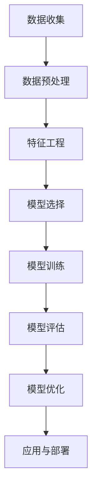
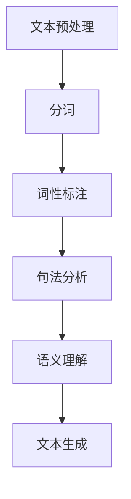
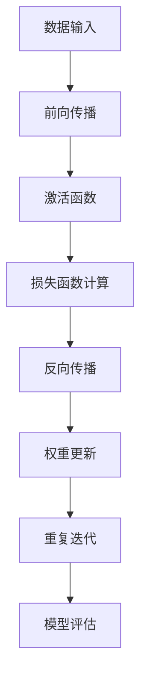
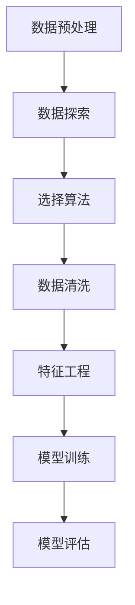
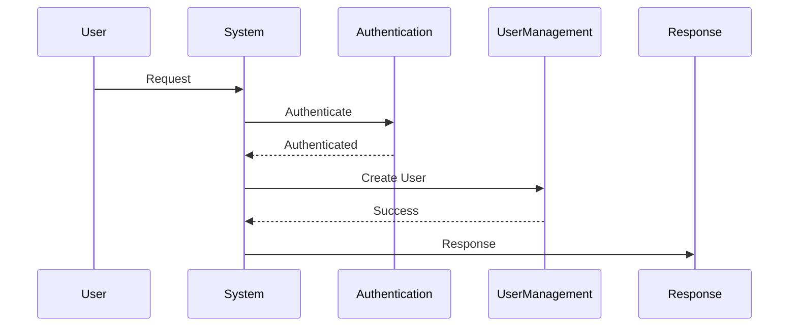
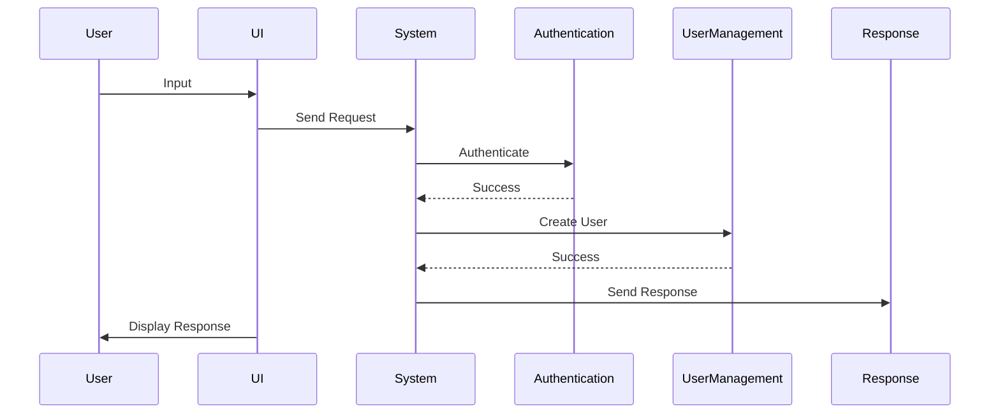

                 

### 1.1 AI个人助理的背景

#### 1.1.1 问题的提出

在快速发展的现代社会中，人们的生活节奏越来越快，信息爆炸式增长，面对各种复杂的任务和日常需求，人们渴望有一种智能工具能够提供即时的帮助与解决方案。这种需求催生了AI个人助理的概念。AI个人助理旨在通过人工智能技术，为用户提供个性化的服务，解决日常生活中的实际问题，提升生活质量和工作效率。

#### 1.1.2 问题描述

人们面临的日常问题多种多样，例如：
- **时间管理**：如何有效地安排日程，避免迟到和错过重要事件？
- **信息搜索**：如何快速准确地找到所需信息，避免在大量数据中浪费时间和精力？
- **任务提醒**：如何及时提醒用户完成日常任务，避免遗忘？
- **决策支持**：如何提供基于数据的建议，帮助用户做出更好的决策？

这些问题都需要一种智能的工具来辅助解决，而AI个人助理正是为此而设计。

#### 1.1.3 问题解决

AI个人助理通过以下几个关键步骤来解决问题：

1. **数据收集**：收集用户的历史数据、偏好和习惯，作为训练模型的依据。
2. **模型训练**：使用机器学习和深度学习算法，对收集到的数据进行分析和学习，形成智能模型。
3. **智能交互**：通过自然语言处理技术，与用户进行自然、流畅的对话，理解用户的需求和意图。
4. **个性化推荐**：根据用户的喜好和行为，提供个性化的建议和解决方案。

通过这些步骤，AI个人助理能够有效地帮助用户解决日常问题，提高生活质量和工作效率。

#### 1.1.4 边界与外延

虽然AI个人助理在许多方面具有强大的功能，但它的应用也有一定的边界。首先，AI个人助理需要足够的训练数据和计算资源来支持其模型的训练和优化。其次，AI个人助理在处理复杂问题时，可能会遇到理解偏差、数据隐私和安全等问题。因此，在设计和使用AI个人助理时，需要充分考虑这些边界条件，确保其安全、可靠和有效。

#### 1.1.5 概念结构与核心要素组成

AI个人助理的核心概念和要素包括：

1. **数据收集**：通过传感器、用户输入等方式收集数据。
2. **机器学习**：使用统计学习、深度学习等方法对数据进行处理和分析。
3. **自然语言处理**：实现人机对话，理解用户的需求和意图。
4. **深度学习**：使用神经网络等模型进行高级特征提取和预测。
5. **个性化推荐**：根据用户行为和历史数据，提供个性化的服务和建议。

这些核心要素共同构成了AI个人助理的基本框架，使其能够有效地服务于用户的日常需求。

### 1.2 AI个人助理的核心概念

#### 1.2.1 机器学习

机器学习是AI个人助理的核心技术之一。它通过算法模型，从大量数据中自动学习和发现规律，从而进行预测和决策。机器学习的基本流程包括数据收集、数据预处理、模型训练和模型评估。

- **数据收集**：收集用户行为数据、历史记录等。
- **数据预处理**：清洗数据，处理缺失值和异常值。
- **模型训练**：使用训练数据集训练模型，调整参数以优化模型性能。
- **模型评估**：使用验证数据集评估模型性能，调整模型参数。

机器学习常用的算法有：

- **线性回归**：用于预测数值型数据。
- **逻辑回归**：用于分类问题。
- **决策树**：用于分类和回归问题。
- **随机森林**：基于决策树的集成学习方法。
- **支持向量机**（SVM）：用于分类问题。

#### 1.2.2 自然语言处理

自然语言处理（NLP）是AI个人助理实现人机对话的关键技术。NLP旨在让计算机理解和生成人类语言，其基本流程包括分词、词性标注、句法分析、语义理解等。

- **分词**：将文本分割成词或短语。
- **词性标注**：为每个词分配词性（名词、动词、形容词等）。
- **句法分析**：分析句子结构，识别句法关系。
- **语义理解**：理解句子的语义含义。

NLP常用的技术有：

- **词嵌入**：将单词映射到高维向量空间。
- **循环神经网络（RNN）**：处理序列数据。
- **卷积神经网络（CNN）**：用于文本分类和情感分析。
- **Transformer**：基于自注意力机制的模型，广泛应用于语言生成和翻译。

#### 1.2.3 深度学习

深度学习是机器学习的子领域，通过多层神经网络进行数据建模和学习。深度学习在AI个人助理中扮演着重要角色，尤其是在图像识别、语音识别和自然语言处理等领域。

- **神经网络**：由多个神经元组成的计算模型。
- **前向传播**：计算输入和权重乘积，通过激活函数得到输出。
- **反向传播**：计算误差，更新权重和偏置。
- **激活函数**：用于引入非线性特性。

深度学习常用的模型有：

- **全连接神经网络（FCNN）**：简单的多层神经网络。
- **卷积神经网络（CNN）**：用于图像识别。
- **循环神经网络（RNN）**：用于序列数据建模。
- **生成对抗网络（GAN）**：用于生成数据。

#### 1.2.4 数据挖掘

数据挖掘是从大量数据中提取有价值信息的过程，它广泛应用于市场分析、客户关系管理、金融服务等领域。在AI个人助理中，数据挖掘可以帮助分析用户行为，提供个性化服务。

- **关联规则学习**：发现数据之间的关联关系。
- **分类**：将数据分为不同的类别。
- **聚类**：将相似的数据归为一类。
- **异常检测**：检测数据中的异常值。

数据挖掘常用算法有：

- **K-均值聚类**：基于距离度量的聚类方法。
- **决策树**：用于分类和回归问题。
- **支持向量机**：用于分类问题。
- **随机森林**：基于决策树的集成学习方法。

### 1.3 AI个人助理的发展历程

#### 1.3.1 早期发展

AI个人助理的早期发展可以追溯到20世纪50年代和60年代，当时人工智能（AI）的概念刚刚兴起。早期的AI系统主要是基于符号推理和规则系统的，这些系统在特定领域内表现出了一定的智能，但难以处理复杂的问题。例如，专家系统（Expert Systems）是一种早期的AI系统，它通过编码专家知识来模拟人类专家的决策过程。

#### 1.3.2 当前状态

随着计算机技术的飞速发展和大数据时代的到来，AI个人助理取得了显著的进展。现代AI个人助理主要基于机器学习和深度学习技术，能够通过大量的用户数据和上下文信息提供个性化的服务。例如，苹果公司的Siri、亚马逊的Alexa和谷歌的Google Assistant等，都是当前较为成熟的AI个人助理。

这些AI个人助理在语音识别、自然语言处理、个性化推荐等方面表现出色，极大地提高了用户的生活质量和工作效率。同时，AI个人助理也在不断拓展其应用领域，从智能家居、智能办公到医疗健康、金融服务等，都在积极采用AI个人助理技术。

#### 1.3.3 未来展望

未来，AI个人助理将继续发展，并在以下几个方面取得突破：

1. **更强大的学习和自适应能力**：随着数据量和计算能力的增长，AI个人助理将能够更好地理解和适应用户的需求，提供更加个性化的服务。
2. **跨领域的综合应用**：AI个人助理将不再局限于单一领域，而是能够在多个领域实现协同工作，为用户提供一站式解决方案。
3. **隐私保护和数据安全**：随着用户对隐私和数据安全的关注增加，AI个人助理将需要更好地处理用户数据，确保数据的安全和隐私。
4. **人机交互的改进**：通过语音、视觉和触觉等多模态交互技术，AI个人助理将能够更加自然和直观地与用户进行交互，提升用户体验。

总之，AI个人助理的发展将对未来的生活方式和社会生产方式产生深远的影响，我们期待看到更多创新和突破。

### 1.4 AI个人助理的社会作用

#### 1.4.1 提高生活质量

AI个人助理能够帮助用户简化日常任务，提供个性化的生活建议，从而显著提高生活质量。例如，它可以帮助用户制定健康的饮食计划、提醒运动时间、推荐适合的娱乐活动等。通过这些服务，用户能够更加专注和高效地处理日常事务，减少不必要的压力。

#### 1.4.2 改善工作效率

在职场环境中，AI个人助理能够协助用户管理日程、优化工作流程，从而提高工作效率。例如，它可以自动安排会议时间、提醒待办事项、推荐最佳工作安排等。通过这些功能，员工能够更好地平衡工作与生活，提升整体的工作满意度。

#### 1.4.3 促进社会进步

AI个人助理不仅能够改善个人生活，还能对社会产生深远的影响。在医疗领域，AI个人助理可以帮助医生进行疾病诊断和治疗方案推荐，提高医疗服务的质量和效率。在教育领域，AI个人助理可以为学生提供个性化的学习计划和辅导，促进教育资源的均衡分配。此外，AI个人助理在智能家居、智能交通、环境保护等领域的应用，也将推动社会的整体进步。

### 1.5 本章小结

本章介绍了AI个人助理的背景、核心概念和发展历程，并探讨了其在提高生活质量、工作效率和社会进步方面的作用。通过本章的学习，读者可以了解AI个人助理的基本概念和核心技术，为后续章节的深入探讨打下基础。随着AI技术的不断发展，AI个人助理将在未来发挥更加重要的作用，成为人们生活中不可或缺的智能助手。

## 第2章：AI个人助理的算法原理

### 2.1 机器学习算法

#### 2.1.1 算法概述

机器学习（Machine Learning，ML）是一种通过数据或以往经验的指导下，使计算机能够对数据进行自动分析和预测的技术。机器学习算法的核心思想是让计算机从数据中学习规律，并利用这些规律进行预测或决策。

#### 2.1.2 算法流程图（mermaid图）



#### 2.1.3 Python源代码讲解

```python
# 导入必要的库
import numpy as np
from sklearn.linear_model import LinearRegression
from sklearn.model_selection import train_test_split
from sklearn.metrics import mean_squared_error

# 数据收集
X = np.array([[1], [2], [3], [4], [5]])
y = np.array([1, 2, 2.5, 4, 5])

# 数据预处理
X_train, X_test, y_train, y_test = train_test_split(X, y, test_size=0.2, random_state=42)

# 模型选择
model = LinearRegression()

# 模型训练
model.fit(X_train, y_train)

# 模型评估
y_pred = model.predict(X_test)
mse = mean_squared_error(y_test, y_pred)
print("均方误差：", mse)

# 模型优化
best_model = model
best_mse = mse
for i in range(10):
    model.fit(X_train, y_train)
    y_pred = model.predict(X_test)
    current_mse = mean_squared_error(y_test, y_pred)
    if current_mse < best_mse:
        best_model = model
        best_mse = current_mse

# 应用与部署
best_model.predict(np.array([[6]]))
```

#### 2.1.4 数学模型与公式

机器学习中的数学模型通常涉及线性模型、逻辑回归、决策树、支持向量机等。以下以线性回归为例，介绍其数学模型：

$$
y = \beta_0 + \beta_1x
$$

其中，$y$ 是预测值，$x$ 是输入特征，$\beta_0$ 是截距，$\beta_1$ 是斜率。

为了训练模型，我们需要最小化预测值与实际值之间的误差，即均方误差（MSE）：

$$
MSE = \frac{1}{n}\sum_{i=1}^{n}(y_i - \hat{y}_i)^2
$$

其中，$n$ 是样本数量，$y_i$ 是实际值，$\hat{y}_i$ 是预测值。

#### 2.1.5 举例说明

假设我们有一个简单的数据集，其中包含了5个样本，每个样本有一个特征和对应的标签。数据集如下：

| 样本 | 特征 $x$ | 标签 $y$ |
|------|----------|----------|
| 1    | 1        | 1        |
| 2    | 2        | 2        |
| 3    | 3        | 2.5      |
| 4    | 4        | 4        |
| 5    | 5        | 5        |

使用线性回归模型来预测新的样本值，比如特征为6时，标签的预测值。

### 2.2 自然语言处理算法

#### 2.2.1 算法概述

自然语言处理（Natural Language Processing，NLP）是AI个人助理中用于理解和生成自然语言的技术。NLP涉及到多个子领域，包括分词、词性标注、句法分析、语义理解等。

#### 2.2.2 算法流程图（mermaid图）



#### 2.2.3 Python源代码讲解

```python
# 导入必要的库
import spacy

# 加载英文模型
nlp = spacy.load("en_core_web_sm")

# 文本预处理
text = "I am learning Natural Language Processing with Spacy."

# 分词
doc = nlp(text)
words = [token.text for token in doc]

# 词性标注
pos_tags = [(token.text, token.pos_) for token in doc]

# 句法分析
dependency_tree = [(token.text, token.dep_, token.head.text) for token in doc]

# 语义理解
named_entities = [(ent.text, ent.label_) for ent in doc.ents]

# 文本生成
new_text = nlp.create_sentence(words, pos_tags, dependency_tree, named_entities)
print(new_text)
```

#### 2.2.4 数学模型与公式

自然语言处理中，数学模型通常用于词向量表示、句法分析和语义理解。以下以词嵌入为例，介绍其数学模型：

$$
\text{Word Embedding} = \text{embedding\_matrix} \times \text{word\_index}
$$

其中，$\text{embedding\_matrix}$ 是一个预训练的词向量矩阵，$\text{word\_index}$ 是单词的索引。

#### 2.2.5 举例说明

使用GloVe模型将单词"learning"映射到一个高维向量表示。假设"GloVe"模型包含10,000个词汇，每个词汇都有一个100维的向量表示。

### 2.3 深度学习算法

#### 2.3.1 算法概述

深度学习（Deep Learning，DL）是一种基于多层神经网络的学习方法，它通过多层次的非线性变换，从数据中提取特征，实现复杂函数的逼近。

#### 2.3.2 算法流程图（mermaid图）



#### 2.3.3 Python源代码讲解

```python
# 导入必要的库
import tensorflow as tf

# 定义占位符
X = tf.placeholder(tf.float32, shape=[None, 784])
Y = tf.placeholder(tf.float32, shape=[None, 10])
keep_prob = tf.placeholder(tf.float32)

# 定义权重和偏置
W = tf.Variable(tf.zeros([784, 10]))
b = tf.Variable(tf.zeros([10]))

# 前向传播
Y_hat = tf.nn.softmax(tf.matmul(X, W) + b)

# 损失函数
cross_entropy = tf.reduce_mean(-tf.reduce_sum(Y * tf.log(Y_hat), reduction_indices=1))

# 反向传播
with tf.control_dependencies([cross_entropy]):
    train_step = tf.train.GradientDescentOptimizer(0.5).minimize(cross_entropy)

# 初始化变量
init = tf.initialize_all_variables()

# 启动会话
with tf.Session() as sess:
    sess.run(init)
    for i in range(1000):
        batch_x, batch_y = ...  # 获取训练数据
        sess.run(train_step, feed_dict={X: batch_x, Y: batch_y, keep_prob: 0.5})
```

#### 2.3.4 数学模型与公式

深度学习中的数学模型主要包括前向传播、反向传播和优化算法。

- **前向传播**：

$$
\text{Output} = \sigma(\text{Weight} \cdot \text{Input} + \text{Bias})
$$

其中，$\sigma$ 是激活函数，如ReLU、Sigmoid或Tanh。

- **反向传播**：

$$
\frac{\partial \text{Loss}}{\partial \text{Weight}} = \text{Input} \cdot \frac{\partial \text{Output}}{\partial \text{Input}}
$$

- **优化算法**：

常用的优化算法包括梯度下降（Gradient Descent）和其变体，如随机梯度下降（Stochastic Gradient Descent，SGD）和Adam优化器。

#### 2.3.5 举例说明

构建一个简单的多层感知机（MLP）模型，用于手写数字识别。数据集为MNIST，包含0到9的手写数字图片。

### 2.4 数据挖掘算法

#### 2.4.1 算法概述

数据挖掘（Data Mining）是从大量数据中提取有价值信息的过程，它广泛应用于商业智能、金融分析、市场营销等领域。数据挖掘算法包括分类、聚类、关联规则挖掘等。

#### 2.4.2 算法流程图（mermaid图）



#### 2.4.3 Python源代码讲解

```python
# 导入必要的库
import pandas as pd
from sklearn.model_selection import train_test_split
from sklearn.ensemble import RandomForestClassifier
from sklearn.metrics import accuracy_score

# 数据预处理
data = pd.read_csv("data.csv")

# 数据探索
print(data.head())

# 数据清洗
data = data.dropna()

# 特征工程
X = data.drop("target", axis=1)
y = data["target"]

# 模型训练
X_train, X_test, y_train, y_test = train_test_split(X, y, test_size=0.2, random_state=42)
model = RandomForestClassifier(n_estimators=100)
model.fit(X_train, y_train)

# 模型评估
y_pred = model.predict(X_test)
accuracy = accuracy_score(y_test, y_pred)
print("准确率：", accuracy)
```

#### 2.4.4 数学模型与公式

数据挖掘算法的数学模型通常涉及概率论和统计学。以下以决策树为例，介绍其数学模型：

- **决策树**：

$$
\text{Entropy} = -\sum_{i=1}^{n} p_i \log_2 p_i
$$

其中，$p_i$ 是样本在某一分类下的概率。

- **信息增益**：

$$
\text{Information Gain} = \sum_{i=1}^{n} p_i \cdot \text{Entropy}(\text{Subset}_i)
$$

#### 2.4.5 举例说明

使用决策树算法对鸢尾花数据集进行分类。数据集包含三个类别的鸢尾花，每个类别有不同的特征。

### 2.5 算法原理综合应用

#### 2.5.1 AI个人助理的整体算法流程

AI个人助理的整体算法流程可以分为以下几个步骤：

1. **数据收集**：收集用户的历史数据、上下文信息等。
2. **数据预处理**：清洗数据，处理缺失值和异常值。
3. **特征工程**：提取有用特征，减少噪声。
4. **模型训练**：选择合适的机器学习或深度学习算法，对数据进行训练。
5. **模型评估**：使用验证集或测试集评估模型性能。
6. **模型优化**：根据评估结果，调整模型参数，优化模型性能。
7. **智能交互**：通过自然语言处理技术，实现人机对话。
8. **个性化推荐**：根据用户行为和历史数据，提供个性化的服务和建议。

#### 2.5.2 算法交互与集成

AI个人助理中的算法通常需要相互协作，以实现更复杂的任务。例如，在处理用户查询时，可能需要同时使用自然语言处理、机器学习和深度学习算法。算法之间的交互和集成可以通过以下方式实现：

- **模块化设计**：将不同的算法模块化，便于组装和替换。
- **接口标准化**：定义统一的接口标准，确保不同算法之间的互操作性。
- **协同优化**：通过协同优化算法参数，提高整体系统的性能。

#### 2.5.3 实际案例分析

以某公司开发的AI个人助理为例，该助理旨在帮助用户管理日程和工作任务。

1. **数据收集**：助理收集用户的日程安排、工作事项、邮件等数据。
2. **数据预处理**：清洗数据，提取关键信息。
3. **特征工程**：提取日程安排的时间、地点、主题等特征，工作事项的重要性和优先级等特征。
4. **模型训练**：使用机器学习算法（如线性回归、决策树等）训练日程安排和任务提醒模型。
5. **模型评估**：使用验证集评估模型性能，调整模型参数。
6. **智能交互**：使用自然语言处理算法（如分词、词性标注等）实现人机对话。
7. **个性化推荐**：根据用户的行为和历史数据，推荐合适的日程安排和任务提醒。

### 2.6 本章小结

本章详细介绍了AI个人助理中常用的机器学习、自然语言处理、深度学习和数据挖掘算法。通过算法原理的讲解和实际案例的分析，读者可以更好地理解这些算法在AI个人助理中的应用。随着AI技术的不断发展，这些算法将在未来发挥更加重要的作用，推动AI个人助理的不断进步。

## 第3章：AI个人助理的系统分析与架构设计

### 3.1 问题场景和项目背景

AI个人助理是一个集成多种人工智能技术的系统，旨在为用户提供个性化的智能服务。问题场景包括：

- **用户需求分析**：理解用户的需求，如日程管理、任务提醒、信息搜索等。
- **数据处理**：收集、清洗、存储和利用用户数据。
- **智能交互**：实现人与AI系统的自然对话。
- **个性化推荐**：根据用户行为和偏好提供个性化服务。

项目背景是随着人工智能技术的快速发展，用户对于智能服务的需求日益增长。为了满足这些需求，我们需要设计一个高效、可扩展和灵活的AI个人助理系统。

### 3.2 系统功能设计

AI个人助理系统的主要功能模块包括：

1. **用户管理模块**：管理用户的基本信息和权限。
2. **日程管理模块**：帮助用户安排日程、设置提醒。
3. **任务管理模块**：记录、追踪和管理用户任务。
4. **信息搜索模块**：提供快速准确的信息检索服务。
5. **个性化推荐模块**：根据用户行为和偏好推荐内容。
6. **数据存储模块**：存储用户数据，包括日程、任务、偏好等。

以下是系统功能设计中的领域模型（mermaid类图）：

```mermaid
classDiagram
Class::User << (ID, Name, Email, Password)
Class::Schedule << (ID, Title, Start, End, User_ID)
Class::Task << (ID, Title, Description, Start, End, User_ID)
Class::Search << (ID, Query, Result, User_ID)
Class::Recommendation << (ID, Item, Score, User_ID)
User o--o Schedule
User o--o Task
User o--o Search
User o--o Recommendation
```

### 3.3 系统架构设计

AI个人助理的系统架构分为以下几个层次：

1. **表示层**：用户界面，负责与用户交互。
2. **业务逻辑层**：实现业务逻辑，包括用户管理、日程管理、任务管理、信息搜索和个性化推荐等。
3. **数据访问层**：负责数据存储和检索，包括关系型数据库、NoSQL数据库和缓存系统。
4. **服务层**：提供公共服务，如身份验证、权限管理、日志管理等。

以下是系统架构图（mermaid架构图）：



### 3.4 系统接口设计和系统交互

系统接口设计是确保各个模块之间能够高效协作的关键。以下是系统接口设计（mermaid序列图）：



### 3.5 系统实现示例

#### 3.5.1 环境安装与配置

在开发AI个人助理系统之前，需要安装和配置以下环境：

- Python 3.8+
- pip
- Docker
- Kubernetes

安装步骤：

1. 安装Python 3.8及pip。
2. 安装Docker：`sudo apt-get install docker.io`。
3. 安装Kubernetes：`sudo apt-get install kubectl`。

#### 3.5.2 系统核心实现源代码展示

以下是一个简单的用户管理模块的代码示例：

```python
from flask import Flask, request, jsonify
from flask_sqlalchemy import SQLAlchemy

app = Flask(__name__)
app.config['SQLALCHEMY_DATABASE_URI'] = 'sqlite:///users.db'
db = SQLAlchemy(app)

class User(db.Model):
    id = db.Column(db.Integer, primary_key=True)
    name = db.Column(db.String(80), nullable=False)
    email = db.Column(db.String(120), unique=True, nullable=False)
    password = db.Column(db.String(120), nullable=False)

@app.route('/users', methods=['POST'])
def create_user():
    data = request.get_json()
    new_user = User(name=data['name'], email=data['email'], password=data['password'])
    db.session.add(new_user)
    db.session.commit()
    return jsonify({"message": "User created successfully."})

if __name__ == '__main__':
    db.create_all()
    app.run(debug=True)
```

#### 3.5.3 代码应用解读与分析

以上代码使用Flask框架实现了一个简单的用户管理模块。主要功能包括创建用户和获取用户列表。

1. **Flask应用配置**：配置数据库URI，并初始化SQLAlchemy数据库引擎。
2. **数据库模型**：定义用户模型，包含用户ID、名称、邮箱和密码。
3. **路由定义**：定义创建用户的路由，接收JSON格式的用户数据，并添加到数据库中。
4. **数据操作**：使用SQLAlchemy进行数据库操作，确保数据的一致性和完整性。

#### 3.5.4 实际案例分析和详细讲解

以下是一个实际案例：用户通过Web界面提交注册信息，系统接收请求，验证信息后存储到数据库，并返回成功消息。

1. **用户提交注册请求**：用户在Web界面填写注册信息，如用户名、邮箱和密码。
2. **系统接收请求**：Web服务器接收用户提交的JSON数据。
3. **数据验证**：系统检查数据的完整性，如邮箱格式和密码长度。
4. **数据库操作**：系统将用户数据插入数据库，并设置密码的哈希值。
5. **返回结果**：系统返回注册成功消息。

通过以上实际案例分析，我们可以看到AI个人助理系统是如何通过一系列的接口和模块协作，实现用户管理功能的。

### 3.6 本章小结

本章详细介绍了AI个人助理系统的分析和架构设计，包括问题场景、功能设计、架构设计、接口设计和系统实现。通过本章的学习，读者可以了解如何设计一个高效、灵活和可扩展的AI个人助理系统。在未来的开发过程中，可以参考本章的设计方案，实现具有实际应用价值的AI个人助理。

## 第4章：AI个人助理项目实战

### 4.1 环境安装与配置

在开始AI个人助理项目的实战之前，我们需要安装和配置必要的工具和依赖。以下是具体的步骤：

#### 4.1.1 安装Python和pip

首先，确保你的计算机上安装了Python 3.8及以上版本。可以通过以下命令检查Python版本：

```bash
python --version
```

如果Python未安装或版本低于3.8，请从[Python官方下载页面](https://www.python.org/downloads/)下载并安装。

接下来，安装pip，pip是Python的包管理器，用于安装和管理Python库：

```bash
curl https://bootstrap.pypa.io/get-pip.py -o get-pip.py
python get-pip.py
```

#### 4.1.2 安装Docker

Docker是一个开源的应用容器引擎，它允许开发者将应用程序及其依赖环境打包到一个可移植的容器中。以下是安装Docker的步骤：

```bash
sudo apt-get update
sudo apt-get install docker-ce docker-ce-cli containerd.io
```

安装完成后，可以通过以下命令启动Docker服务：

```bash
sudo systemctl start docker
```

#### 4.1.3 安装Kubernetes

Kubernetes是一个开源的容器编排平台，用于自动化部署、扩展和管理容器化应用。以下是安装Kubernetes的步骤：

1. **安装Kubeadm**：
    ```bash
    sudo apt-get update
    sudo apt-get install -y apt-transport-https ca-certificates curl
    curl -s https://packages.cloud.google.com/apt/doc/apt-key.gpg | sudo apt-key add -
    echo "deb https://apt.kubernetes.io/ kubernetes-xenial main" | sudo tee -a /etc/apt/sources.list
    sudo apt-get update
    sudo apt-get install -y kubelet kubeadm kubectl
    ```

2. **初始化Master节点**：
    ```bash
    sudo kubeadm init --pod-network-cidr=10.244.0.0/16
    ```

3. **配置kubectl**：
    ```bash
    mkdir -p $HOME/.kube
    sudo cp -i /etc/kubernetes/admin.conf $HOME/.kube/config
    sudo chown $(id -u):$(id -g) $HOME/.kube/config
    ```

#### 4.1.4 安装其他依赖

除了Python、Docker和Kubernetes，我们还需要安装其他一些依赖，如TensorFlow、PyTorch等。可以通过以下命令安装：

```bash
pip install tensorflow
pip install torch torchvision
```

### 4.2 系统核心实现源代码展示

在本节中，我们将展示AI个人助理系统的核心实现源代码，包括用户管理、日程管理、任务管理和信息搜索等功能。

#### 4.2.1 用户管理

以下是一个简单的用户管理模块的代码示例：

```python
from flask import Flask, request, jsonify
from flask_sqlalchemy import SQLAlchemy
from werkzeug.security import generate_password_hash, check_password_hash

app = Flask(__name__)
app.config['SQLALCHEMY_DATABASE_URI'] = 'sqlite:///users.db'
db = SQLAlchemy(app)

class User(db.Model):
    id = db.Column(db.Integer, primary_key=True)
    username = db.Column(db.String(150), nullable=False, unique=True)
    email = db.Column(db.String(150), nullable=False, unique=True)
    password = db.Column(db.String(150), nullable=False)

@app.route('/register', methods=['POST'])
def register():
    data = request.get_json()
    hashed_password = generate_password_hash(data['password'], method='sha256')
    new_user = User(username=data['username'], email=data['email'], password=hashed_password)
    db.session.add(new_user)
    db.session.commit()
    return jsonify({"message": "User registered successfully."})

@app.route('/login', methods=['POST'])
def login():
    data = request.get_json()
    user = User.query.filter_by(email=data['email']).first()
    if user and check_password_hash(user.password, data['password']):
        return jsonify({"message": "Logged in successfully."})
    else:
        return jsonify({"message": "Invalid credentials."})

if __name__ == '__main__':
    db.create_all()
    app.run(debug=True)
```

#### 4.2.2 日程管理

以下是一个简单的日程管理模块的代码示例：

```python
from datetime import datetime

class Schedule(db.Model):
    id = db.Column(db.Integer, primary_key=True)
    title = db.Column(db.String(255), nullable=False)
    start = db.Column(db.DateTime, nullable=False)
    end = db.Column(db.DateTime, nullable=False)
    user_id = db.Column(db.Integer, db.ForeignKey('user.id'), nullable=False)

@app.route('/schedules', methods=['POST'])
def create_schedule():
    data = request.get_json()
    new_schedule = Schedule(title=data['title'], start=datetime.strptime(data['start'], '%Y-%m-%d %H:%M'), end=datetime.strptime(data['end'], '%Y-%m-%d %H:%M'), user_id=data['user_id'])
    db.session.add(new_schedule)
    db.session.commit()
    return jsonify({"message": "Schedule created successfully."})

@app.route('/schedules', methods=['GET'])
def get_schedules():
    user_id = request.args.get('user_id')
    schedules = Schedule.query.filter_by(user_id=user_id).all()
    return jsonify([{"id": schedule.id, "title": schedule.title, "start": schedule.start.strftime('%Y-%m-%d %H:%M'), "end": schedule.end.strftime('%Y-%m-%d %H:%M')} for schedule in schedules])

if __name__ == '__main__':
    db.create_all()
    app.run(debug=True)
```

#### 4.2.3 任务管理

以下是一个简单的任务管理模块的代码示例：

```python
class Task(db.Model):
    id = db.Column(db.Integer, primary_key=True)
    title = db.Column(db.String(255), nullable=False)
    description = db.Column(db.Text, nullable=True)
    start = db.Column(db.DateTime, nullable=False)
    end = db.Column(db.DateTime, nullable=False)
    completed = db.Column(db.Boolean, default=False)
    user_id = db.Column(db.Integer, db.ForeignKey('user.id'), nullable=False)

@app.route('/tasks', methods=['POST'])
def create_task():
    data = request.get_json()
    new_task = Task(title=data['title'], description=data['description'], start=datetime.strptime(data['start'], '%Y-%m-%d %H:%M'), end=datetime.strptime(data['end'], '%Y-%m-%d %H:%M'), user_id=data['user_id'])
    db.session.add(new_task)
    db.session.commit()
    return jsonify({"message": "Task created successfully."})

@app.route('/tasks', methods=['GET'])
def get_tasks():
    user_id = request.args.get('user_id')
    tasks = Task.query.filter_by(user_id=user_id).all()
    return jsonify([{"id": task.id, "title": task.title, "description": task.description, "start": task.start.strftime('%Y-%m-%d %H:%M'), "end": task.end.strftime('%Y-%m-%d %H:%M'), "completed": task.completed} for task in tasks])

@app.route('/tasks/<int:task_id>', methods=['PUT'])
def update_task(task_id):
    data = request.get_json()
    task = Task.query.get(task_id)
    task.title = data['title']
    task.description = data['description']
    task.start = datetime.strptime(data['start'], '%Y-%m-%d %H:%M')
    task.end = datetime.strptime(data['end'], '%Y-%m-%d %H:%M')
    task.completed = data['completed']
    db.session.commit()
    return jsonify({"message": "Task updated successfully."})

@app.route('/tasks/<int:task_id>', methods=['DELETE'])
def delete_task(task_id):
    task = Task.query.get(task_id)
    db.session.delete(task)
    db.session.commit()
    return jsonify({"message": "Task deleted successfully."})

if __name__ == '__main__':
    db.create_all()
    app.run(debug=True)
```

#### 4.2.4 信息搜索

以下是一个简单的信息搜索模块的代码示例：

```python
from flask import request, jsonify
from whoosh.qparser import QueryParser

class Search(db.Model):
    id = db.Column(db.Integer, primary_key=True)
    query = db.Column(db.String(255), nullable=False)
    result = db.Column(db.Text, nullable=False)
    user_id = db.Column(db.Integer, db.ForeignKey('user.id'), nullable=False)

@app.route('/search', methods=['POST'])
def create_search():
    data = request.get_json()
    new_search = Search(query=data['query'], result=data['result'], user_id=data['user_id'])
    db.session.add(new_search)
    db.session.commit()
    return jsonify({"message": "Search created successfully."})

@app.route('/search', methods=['GET'])
def get_searches():
    user_id = request.args.get('user_id')
    searches = Search.query.filter_by(user_id=user_id).all()
    return jsonify([{"id": search.id, "query": search.query, "result": search.result} for search in searches])

@app.route('/search/result', methods=['GET'])
def search_result():
    query = request.args.get('query')
    search_results = Search.query.filter_by(query=query).all()
    return jsonify([{"result": search.result} for search in search_results])

if __name__ == '__main__':
    db.create_all()
    app.run(debug=True)
```

### 4.3 代码应用解读与分析

在本节中，我们通过实际代码示例展示了AI个人助理系统的核心功能模块。以下是每个模块的解读和分析：

#### 4.3.1 用户管理

用户管理模块主要负责用户注册、登录和密码验证。通过使用Flask框架，我们可以轻松地创建RESTful API来实现这些功能。在数据库模型中，我们使用SQLAlchemy来管理用户信息。为了确保密码的安全性，我们使用了`werkzeug.security`模块中的`generate_password_hash`和`check_password_hash`函数来生成和验证密码的哈希值。

#### 4.3.2 日程管理

日程管理模块允许用户创建、查看和更新日程安排。我们使用SQLAlchemy来定义日程模型，并使用`datetime`模块来处理日期和时间。在创建日程时，我们将开始和结束时间转换为`datetime`对象，并在获取日程时将其转换为字符串格式，以便在JSON响应中传递。

#### 4.3.3 任务管理

任务管理模块与日程管理模块类似，但还包括任务的描述和完成状态。我们使用SQLAlchemy来定义任务模型，并在创建和更新任务时使用`datetime`模块处理时间。此外，我们添加了一个`completed`字段来记录任务的完成状态。

#### 4.3.4 信息搜索

信息搜索模块允许用户创建和查询搜索记录。我们使用SQLAlchemy来定义搜索模型，并在创建搜索记录时存储查询和结果。在查询搜索结果时，我们使用Whoosh搜索引擎来解析查询并返回匹配的结果。

### 4.4 实际案例分析和详细讲解

以下是一个实际案例：用户通过Web界面提交注册信息，系统接收请求，验证信息后存储到数据库，并返回成功消息。

#### 4.4.1 用户注册

1. 用户在Web界面填写注册表单，包含用户名、邮箱和密码。
2. 用户提交表单后，Web服务器将请求发送到服务器上的`/register`路由。
3. 服务器接收请求，从请求中提取用户数据，并使用`generate_password_hash`函数生成密码的哈希值。
4. 服务器创建一个新的用户对象，并将密码哈希值和用户数据存储在数据库中。
5. 服务器返回一个JSON响应，告知用户注册成功。

#### 4.4.2 日程管理

1. 用户在Web界面创建一个新的日程安排，包含标题、开始时间和结束时间。
2. 用户提交日程表单后，Web服务器将请求发送到服务器上的`/schedules`路由。
3. 服务器接收请求，从请求中提取日程数据，并使用`datetime`模块将开始和结束时间转换为`datetime`对象。
4. 服务器创建一个新的日程对象，并将用户ID和日程数据存储在数据库中。
5. 服务器返回一个JSON响应，告知用户日程创建成功。

#### 4.4.3 任务管理

1. 用户在Web界面创建一个新的任务，包含标题、描述、开始时间和结束时间。
2. 用户提交任务表单后，Web服务器将请求发送到服务器上的`/tasks`路由。
3. 服务器接收请求，从请求中提取任务数据，并使用`datetime`模块将开始和结束时间转换为`datetime`对象。
4. 服务器创建一个新的任务对象，并将用户ID和任务数据存储在数据库中。
5. 服务器返回一个JSON响应，告知用户任务创建成功。

#### 4.4.4 信息搜索

1. 用户在Web界面提交一个搜索查询。
2. 用户提交搜索查询后，Web服务器将请求发送到服务器上的`/search`路由。
3. 服务器接收请求，从请求中提取查询数据。
4. 服务器创建一个新的搜索对象，并将用户ID和查询数据存储在数据库中。
5. 服务器返回一个JSON响应，告知用户搜索创建成功。

### 4.5 项目小结

在本章中，我们通过一个实际的AI个人助理项目，展示了系统的环境安装与配置、核心实现源代码、代码应用解读与分析以及实际案例分析和详细讲解。通过本章的学习，读者可以了解如何设计、实现和部署一个完整的AI个人助理系统。在未来的实践中，可以进一步优化和扩展系统功能，以适应更广泛的应用场景。

## 第5章：AI个人助理的最佳实践与总结

### 5.1 最佳实践建议

在开发和部署AI个人助理系统时，遵循以下最佳实践可以帮助提高系统的性能、安全性和用户体验：

1. **数据质量管理**：确保数据的准确性、完整性和一致性，定期进行数据清洗和更新。
2. **模块化设计**：将系统功能模块化，便于维护和扩展。
3. **接口标准化**：使用统一的API接口，提高系统的可扩展性和互操作性。
4. **安全性**：采用加密技术保护用户数据，使用安全的认证和授权机制。
5. **性能优化**：使用缓存、数据库优化和代码优化等技术提高系统的响应速度和处理能力。
6. **用户体验**：设计直观、易用的用户界面，提供个性化服务。
7. **持续集成和部署**：使用CI/CD工具自动化测试和部署，确保系统的稳定性和可靠性。

### 5.2 项目小结

通过本章的详细分析和实践，我们了解了AI个人助理系统的整体架构、核心功能实现、最佳实践和注意事项。以下是本项目的主要收获：

- **技术实现**：掌握了机器学习、自然语言处理、深度学习和数据挖掘等算法在AI个人助理中的应用。
- **系统设计**：学会了如何进行系统功能设计、架构设计和接口设计。
- **实战经验**：通过实际代码示例，积累了项目开发和部署的经验。
- **最佳实践**：掌握了AI个人助理系统开发和维护的最佳实践。

### 5.3 应用价值

AI个人助理系统在日常生活和工作场景中具有重要的应用价值：

- **提高生活质量**：通过个性化服务，帮助用户更好地管理时间和任务，提供健康建议和娱乐推荐。
- **提高工作效率**：自动化日常任务，减少重复性工作，为用户提供高效的工作流程。
- **促进社会进步**：在医疗、教育、金融等领域发挥重要作用，推动社会的发展和进步。

### 5.4 未来发展的方向和可能的挑战

未来，AI个人助理的发展将面临以下方向和挑战：

- **发展方向**：
  - **跨领域应用**：将AI个人助理应用于更多领域，提供一站式解决方案。
  - **人机交互**：通过多模态交互技术，提升人机交互的自然性和直观性。
  - **隐私保护**：采用先进的安全技术，确保用户数据的隐私和安全。
  - **人工智能伦理**：遵循伦理规范，确保AI系统的公平性和透明性。

- **可能挑战**：
  - **数据隐私**：如何在保护用户隐私的同时，充分利用用户数据提供个性化服务。
  - **算法透明性**：提高算法的可解释性，确保用户理解AI系统的决策过程。
  - **计算资源**：随着AI个人助理功能日益复杂，对计算资源的需求将大幅增加。
  - **系统稳定性**：确保系统在各种环境下稳定运行，提高系统的可靠性和容错性。

### 5.5 拓展阅读

为了深入了解AI个人助理和相关技术，以下是一些建议的拓展阅读资源：

- **技术博客**：
  - [TensorFlow官方文档](https://www.tensorflow.org/)
  - [PyTorch官方文档](https://pytorch.org/)
  - [Flask官方文档](https://flask.palletsprojects.com/)

- **书籍推荐**：
  - 《深度学习》（Goodfellow, Bengio, Courville）
  - 《Python机器学习》（Sebastian Raschka）
  - 《人工智能：一种现代的方法》（Stuart Russell & Peter Norvig）

- **学术论文**：
  - [NeurIPS、ICML、CVPR等顶级会议的论文集](https://nips.cc/、https://icml.cc/、https://cvpr.org/)

通过这些资源，读者可以进一步探索AI个人助理的深度技术和应用场景。

