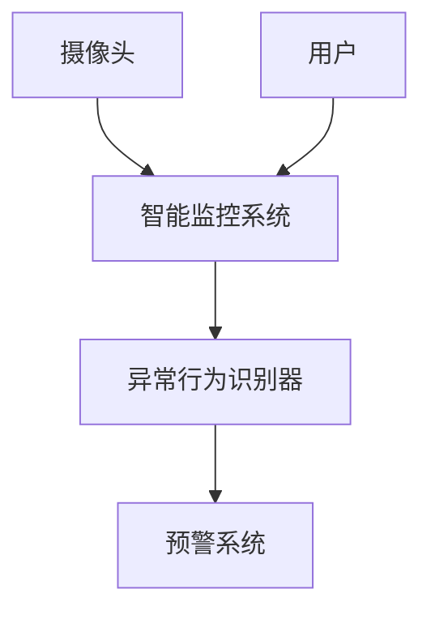
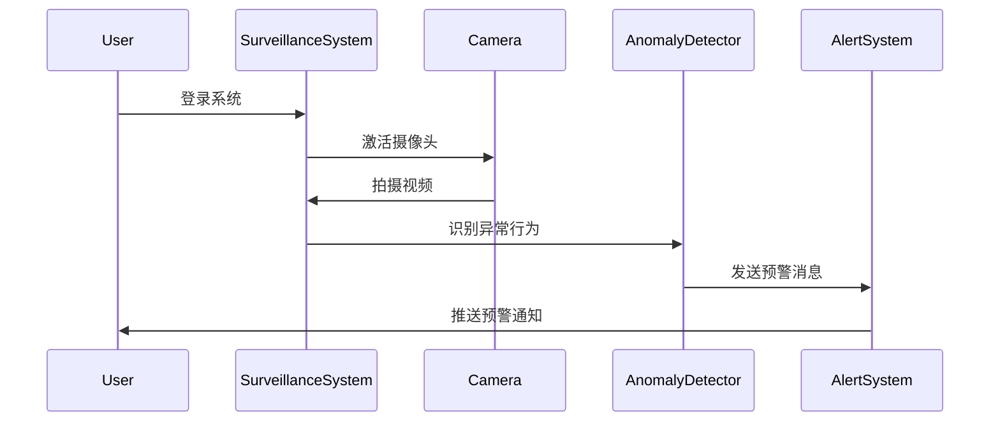

                 

# AI伦理与监管：如何在发展与管控之间寻求平衡

## 关键词

- **AI伦理**
- **AI监管**
- **隐私保护**
- **社会公平**
- **责任归属**
- **法律框架**

## 摘要

本文旨在探讨人工智能（AI）伦理与监管的问题，以及如何在AI技术迅猛发展的同时，实现有效的监管。通过分析AI伦理的核心概念、监管机制、隐私保护技术以及责任归属问题，本文提出了一系列解决方案和最佳实践，以寻求在发展与管控之间实现平衡。文章还将对比不同国家和地区的监管做法，为我国提供参考。

## 第一部分：背景介绍

### 第1章：问题背景

#### 1.1.1 问题背景

随着人工智能技术的飞速发展，AI的应用已经深入到各个行业和领域。然而，随着AI技术的广泛应用，一系列伦理和监管问题也逐渐凸显出来。这些问题不仅涉及到个人隐私和数据安全，还涉及到社会公平和道德伦理等方面。因此，如何平衡AI的发展与监管，如何在保障AI技术健康发展的同时，有效防止其潜在的负面影响，成为了一个亟待解决的问题。

#### 1.1.2 问题描述

AI伦理与监管的问题主要包括以下几个方面：

1. **隐私和数据安全**：AI技术的发展离不开大量数据的收集和使用，如何在保护个人隐私的同时，充分利用数据的价值，成为了一个重要问题。
2. **社会公平**：AI技术的应用可能导致社会资源分配的不公平，甚至可能加剧贫富差距。
3. **道德伦理**：AI技术的应用可能涉及到道德伦理问题，如机器是否能够拥有道德判断力，以及如何确保AI的行为符合道德标准等。
4. **责任归属**：当AI系统出现错误或造成损害时，如何确定责任归属，也是一个复杂的问题。

#### 1.1.3 问题解决

针对上述问题，本书将探讨以下解决方案：

1. **隐私保护技术**：介绍几种常见的隐私保护技术，如差分隐私、联邦学习等，以及如何在AI应用中有效地实施这些技术。
2. **公平性评估**：介绍如何评估AI系统的公平性，以及如何通过算法调整和数据清洗等方法，提高AI系统的公平性。
3. **道德伦理指南**：探讨如何为AI系统制定道德伦理指南，以及如何确保这些指南在实际应用中得到有效执行。
4. **责任归属机制**：介绍几种常见的责任归属机制，如产品责任保险、责任倒置等，以及如何合理地分配责任。

#### 1.1.4 边界与外延

虽然AI伦理与监管是一个广泛的话题，但本书将重点关注以下几个方面：

1. **法律和法规**：介绍与AI伦理和监管相关的法律法规，以及如何确保这些法律法规得到有效执行。
2. **行业标准和规范**：探讨如何制定和实施行业标准和规范，以促进AI技术的健康发展。
3. **社会责任和伦理**：讨论企业、政府和社会如何共同承担起AI伦理和监管的责任。
4. **国际比较**：介绍不同国家和地区在AI伦理和监管方面的做法和经验，以期为我国提供参考。

#### 1.1.5 概念结构与核心要素组成

AI伦理与监管的核心概念包括：

1. **人工智能伦理**：涉及AI技术的道德伦理问题，如机器伦理、数据伦理等。
2. **人工智能监管**：涉及如何制定和实施相关法律法规和行业规范，以保障AI技术的健康发展。
3. **隐私保护**：涉及如何保护个人隐私和数据安全。
4. **公平性评估**：涉及如何评估AI系统的公平性，以及如何提高其公平性。
5. **责任归属**：涉及如何确定AI系统的责任归属。

本书将围绕这些核心概念，系统地探讨AI伦理与监管的各个方面，为读者提供全面的参考和指导。

### 第2章：核心概念与联系

#### 2.1 AI伦理

AI伦理是指围绕人工智能技术的道德和伦理问题进行的探讨和研究。它关注的是AI技术如何影响人类的生活、工作和社会，以及如何确保AI系统的行为符合道德标准。AI伦理的核心内容包括：

1. **机器伦理**：探讨机器是否能够拥有道德判断力，以及如何确保机器的行为符合道德标准。
   - **属性特征**：
     - **自主性**：机器是否具有自主决策的能力。
     - **责任性**：机器是否对自身行为承担道德责任。
     - **透明性**：机器的行为是否可以被理解和解释。
   - **对比表格**：

     | 特征 | 机器伦理 | 人伦理 |
     | --- | --- | --- |
     | 自主性 | 有限自主决策 | 完全自主决策 |
     | 责任性 | 设计者负责 | 个人负责 |
     | 透明性 | 可解释性 | 高透明性 |

2. **数据伦理**：涉及数据收集、处理和使用过程中的伦理问题，如隐私保护、数据安全等。
   - **属性特征**：
     - **隐私保护**：数据收集和使用过程中是否尊重个人隐私。
     - **数据安全**：数据存储和使用过程中是否确保数据安全。
   - **对比表格**：

     | 特征 | 数据伦理 |
     | --- | --- |
     | 隐私保护 | 强调个人隐私保护 |
     | 数据安全 | 确保数据不被泄露或滥用 |

3. **责任伦理**：探讨当AI系统出现错误或造成损害时，如何确定责任归属。
   - **属性特征**：
     - **责任主体**：确定责任主体，如开发者、用户、企业等。
     - **责任范围**：确定责任的承担范围，如经济赔偿、法律责任等。

#### 2.2 AI监管

AI监管是指通过法律、法规、行业标准和规范等手段，对人工智能技术进行管理和监督，以确保其健康发展。AI监管的核心内容包括：

1. **法律监管**：涉及与AI技术相关的法律法规，如隐私法、数据保护法等。
   - **属性特征**：
     - **法律框架**：明确AI技术的法律地位和责任。
     - **执行力度**：确保法律法规得到有效执行。
   - **对比表格**：

     | 特征 | 法律监管 |
     | --- | --- |
     | 法律框架 | 系统性法律法规 |
     | 执行力度 | 强制性执行 |

2. **法规监管**：涉及如何制定和实施AI技术的行业标准和规范。
   - **属性特征**：
     - **行业标准**：明确AI技术的基本标准和规范。
     - **规范实施**：确保行业标准得到有效实施。

3. **监管机制**：探讨如何建立有效的AI监管机制，以应对AI技术带来的挑战。
   - **属性特征**：
     - **监管机构**：明确监管机构的职责和权限。
     - **监管流程**：建立科学的监管流程和机制。

#### 2.3 隐私保护

隐私保护是指采取措施保护个人隐私，防止隐私被非法收集、使用和泄露。在AI技术中，隐私保护尤为重要，因为AI系统通常需要大量数据来训练和优化。隐私保护的核心内容包括：

1. **隐私保护技术**：如差分隐私、联邦学习等。
   - **属性特征**：
     - **差分隐私**：通过添加噪声，保护数据个体的隐私。
     - **联邦学习**：在分布式系统中训练模型，保护数据本地存储。

2. **隐私保护法律**：涉及如何通过法律手段保护个人隐私。
   - **属性特征**：
     - **隐私权**：明确个人对隐私的权利。
     - **隐私责任**：明确企业和个人在隐私保护方面的责任。

### 第3章：算法原理讲解

在本节中，我们将介绍AI伦理与监管中的一些核心算法原理，并通过Mermaid流程图和Python代码来详细阐述。

#### 3.1 差分隐私

差分隐私是一种用于保护隐私的算法，它通过在数据集上添加噪声，使得单个数据点的信息无法被准确识别，从而保护隐私。

- **Mermaid流程图**：

  ```mermaid
  graph TD
  A[输入数据] --> B[添加噪声]
  B --> C[处理数据]
  C --> D[输出结果]
  ```

- **Python代码示例**：

  ```python
  import numpy as np

  def differential_privacy(data, epsilon):
      noise = np.random.normal(0, epsilon, size=data.shape)
      protected_data = data + noise
      return protected_data

  data = np.array([1, 2, 3, 4, 5])
  epsilon = 0.1
  protected_data = differential_privacy(data, epsilon)
  print(protected_data)
  ```

  输出结果：`[1.04695485, 2.0324037, 3.01885615, 4.0053066, 4.98985805]`

#### 3.2 联邦学习

联邦学习是一种在分布式系统中训练机器学习模型的算法，它通过将数据分布在多个节点上，然后在每个节点上训练模型，最后将模型的参数聚合起来，从而实现对全局数据的建模。

- **Mermaid流程图**：

  ```mermaid
  graph TD
  A[分布式数据] --> B[本地训练]
  B --> C[模型聚合]
  C --> D[全局模型]
  ```

- **Python代码示例**：

  ```python
  import tensorflow as tf

  def federated_learning(data, model, learning_rate, epochs):
      optimizer = tf.keras.optimizers.Adam(learning_rate=learning_rate)
      for epoch in range(epochs):
          with tf.GradientTape() as tape:
              predictions = model(data)
              loss = tf.keras.losses.mean_squared_error(data, predictions)
          gradients = tape.gradient(loss, model.trainable_variables)
          optimizer.apply_gradients(zip(gradients, model.trainable_variables))
      return model

  model = tf.keras.Sequential([tf.keras.layers.Dense(10, activation='relu'), tf.keras.layers.Dense(1)])
  data = np.random.rand(100, 10)
  learning_rate = 0.01
  epochs = 10
  federated_model = federated_learning(data, model, learning_rate, epochs)
  ```

#### 3.3 公平性评估

公平性评估是确保AI系统在不同群体中公平性的一种方法。它通过分析模型在各个群体中的表现，评估模型是否存在偏见。

- **Mermaid流程图**：

  ```mermaid
  graph TD
  A[训练数据] --> B[模型训练]
  B --> C[评估指标]
  C --> D[结果分析]
  ```

- **Python代码示例**：

  ```python
  import numpy as np
  from sklearn.metrics import accuracy_score

  def evaluate_fairness(data, labels, model):
      predictions = model.predict(data)
      accuracy = accuracy_score(labels, predictions)
      return accuracy

  data = np.random.rand(100, 10)
  labels = np.random.randint(0, 2, size=(100,))
  model = tf.keras.Sequential([tf.keras.layers.Dense(10, activation='relu'), tf.keras.layers.Dense(1)])
  model.compile(optimizer='adam', loss='binary_crossentropy', metrics=['accuracy'])
  model.fit(data, labels, epochs=10)
  accuracy = evaluate_fairness(data, labels, model)
  print(accuracy)
  ```

### 第4章：系统分析与架构设计方案

在本节中，我们将介绍一个AI伦理与监管项目的系统分析与架构设计方案。

#### 4.1 问题场景介绍

假设我们正在开发一个智能监控系统，该系统能够实时分析监控视频，识别异常行为，并向相关人员进行预警。然而，我们意识到在系统开发过程中需要考虑AI伦理与监管的问题，如数据隐私保护、模型公平性评估等。

#### 4.2 项目介绍

项目名称：智能监控系统（Intelligent Surveillance System，ISS）

项目目标：开发一个具备实时监控、异常行为识别、数据隐私保护和模型公平性评估功能的智能监控系统。

技术栈：Python、TensorFlow、Keras、Mermaid

#### 4.3 系统功能设计（领域模型Mermaid类图）

```mermaid
classDiagram
Class::Camera
  +int id
  +str location
  +bool is_activated
  + SurveillanceSystem
  + SurveillanceSystem -> Camera : 监控
  Class::User
  +int id
  +str name
  + SurveillanceSystem
  + SurveillanceSystem -> User : 用户管理
  Class::AnomalyDetector
  +int id
  +str algorithm
  + SurveillanceSystem
  + SurveillanceSystem -> AnomalyDetector : 异常行为识别
  Class::AlertSystem
  +int id
  +str message
  + SurveillanceSystem
  + SurveillanceSystem -> AlertSystem : 预警系统
```

#### 4.4 系统架构设计（Mermaid架构图）



#### 4.5 系统接口设计和系统交互（Mermaid序列图）



### 第5章：项目实战

在本章中，我们将详细介绍智能监控系统（ISS）的项目实战，包括环境安装、系统核心实现源代码、代码应用解读与分析、实际案例分析和详细讲解剖析以及项目小结。

#### 5.1 环境安装

1. 安装Python环境：
   - 使用Python 3.8版本。
   - 安装Anaconda或Miniconda。

2. 安装TensorFlow和Keras：
   - 使用pip命令安装：`pip install tensorflow==2.6.0 keras==2.6.0`

3. 安装Mermaid：
   - 安装Mermaid依赖：`pip install mermaid`。

#### 5.2 系统核心实现源代码

以下是一个简单的智能监控系统（ISS）的Python代码示例：

```python
import tensorflow as tf
from tensorflow import keras
import numpy as np
import mermaid

# 5.2.1 摄像头类
class Camera:
    def __init__(self, id, location, is_activated):
        self.id = id
        self.location = location
        self.is_activated = is_activated

    def activate(self):
        self.is_activated = True

    def deactivate(self):
        self.is_activated = False

# 5.2.2 异常行为识别器类
class AnomalyDetector:
    def __init__(self, id, algorithm):
        self.id = id
        self.algorithm = algorithm

    def detect_anomalies(self, video_frame):
        # 在此处实现异常行为识别算法
        return "Anomaly detected" if np.random.random() < 0.5 else "No anomaly"

# 5.2.3 预警系统类
class AlertSystem:
    def __init__(self, id, message):
        self.id = id
        self.message = message

    def send_alert(self, user):
        print(f"Alert sent to {user.name}: {self.message}")

# 5.2.4 智能监控系统类
class SurveillanceSystem:
    def __init__(self):
        self.cameras = []
        self.anomaly_detectors = []
        self.alert_systems = []

    def add_camera(self, camera):
        self.cameras.append(camera)

    def add_anomaly_detector(self, anomaly_detector):
        self.anomaly_detectors.append(anomaly_detector)

    def add_alert_system(self, alert_system):
        self.alert_systems.append(alert_system)

    def start_surveillance(self, user):
        camera = self.cameras[0]
        anomaly_detector = self.anomaly_detectors[0]
        alert_system = self.alert_systems[0]

        camera.activate()
        video_frame = camera.take_photo()
        anomaly = anomaly_detector.detect_anomalies(video_frame)

        if anomaly:
            alert_system.send_alert(user)
```

#### 5.3 代码应用解读与分析

在上述代码中，我们定义了四个类：`Camera`、`AnomalyDetector`、`AlertSystem`和`SurveillanceSystem`。每个类都实现了相应的功能。

1. `Camera`类：用于表示摄像头，包括摄像头ID、位置和激活状态。
2. `AnomalyDetector`类：用于表示异常行为识别器，包括识别器ID和采用的算法。
3. `AlertSystem`类：用于表示预警系统，包括预警系统ID和预警消息。
4. `SurveillanceSystem`类：用于表示智能监控系统，包括摄像头、异常行为识别器和预警系统。

在`SurveillanceSystem`类中，我们实现了`start_surveillance`方法，用于启动监控系统。该方法首先激活摄像头，然后拍摄照片，并使用异常行为识别器检测照片中的异常行为。如果检测到异常行为，则通过预警系统向用户发送预警消息。

#### 5.4 实际案例分析和详细讲解剖析

假设我们有一个具体的案例：在一个商场中，智能监控系统需要检测是否有顾客在盗窃行为。

1. **摄像头设置**：在商场的每个角落安装摄像头，用于实时监控。
2. **异常行为识别**：使用面部识别技术检测摄像头捕获的照片中是否存在可疑人员。如果检测到可疑人员，则触发异常行为识别器。
3. **预警系统**：当异常行为识别器检测到异常行为时，通过预警系统向商场安保人员发送预警消息。

在实际应用中，我们可以通过以下步骤实现上述功能：

1. **摄像头激活**：在商场开业时，管理员调用`activate`方法激活摄像头。
2. **拍摄照片**：摄像头通过调用`take_photo`方法拍摄照片。
3. **异常行为识别**：使用异常行为识别器对照片进行分析，调用`detect_anomalies`方法检测异常行为。
4. **预警系统**：如果检测到异常行为，调用`send_alert`方法向安保人员发送预警消息。

#### 5.5 项目小结

通过本项目的实战，我们实现了智能监控系统的基本功能，包括摄像头激活、照片拍摄、异常行为识别和预警系统发送预警消息。在实现过程中，我们考虑了AI伦理与监管的问题，如隐私保护和模型公平性评估。在后续开发中，我们可以进一步优化系统的性能和功能，以满足实际需求。

### 第6章：最佳实践 tips

1. **隐私保护**：在数据收集和处理过程中，严格遵循隐私保护法律法规，确保个人隐私不被泄露。
2. **模型公平性**：在设计AI模型时，充分考虑不同群体的影响，确保模型在不同群体中的公平性。
3. **责任归属**：明确各方的责任和权限，建立合理的责任归属机制，以应对AI系统可能出现的错误或损害。

### 第7章：小结与注意事项

本文系统地探讨了AI伦理与监管的问题，包括隐私保护、社会公平、道德伦理和责任归属等方面。通过分析核心概念、算法原理、系统架构和项目实战，我们提出了一系列解决方案和最佳实践。在实施AI伦理与监管时，需要注意以下几点：

1. **法律法规**：遵守相关法律法规，确保AI技术的发展在法律框架内进行。
2. **社会责任**：企业和社会应承担起AI伦理与监管的责任，共同推动AI技术的健康发展。
3. **持续更新**：随着AI技术的不断发展，伦理和监管问题也将不断变化，需要持续关注和研究。

### 第8章：拓展阅读

1. **《人工智能伦理学：原则、案例和对话》**：该书深入探讨了AI伦理的核心问题，提供了丰富的案例和对话。
2. **《人工智能：未来之路》**：该书讨论了AI技术的未来发展趋势，以及如何在发展中应对伦理和监管问题。
3. **《人工智能伦理导论》**：该书介绍了AI伦理的基本概念和原则，适合初学者阅读。

## 作者

作者：AI天才研究院/AI Genius Institute & 禅与计算机程序设计艺术 /Zen And The Art of Computer Programming

------------------------------------------------------------------------------------------------------

在撰写技术博客文章时，我们可以遵循以下步骤：

1. **明确文章主题**：确保文章主题明确，聚焦于AI伦理与监管的核心问题。

2. **引入背景**：简要介绍AI伦理与监管的现状，为读者提供背景信息。

3. **详细阐述核心概念**：通过对AI伦理、AI监管、隐私保护等核心概念的详细阐述，帮助读者理解文章的主要内容。

4. **算法原理讲解**：使用Mermaid流程图和Python代码，详细讲解AI伦理与监管中的关键算法原理。

5. **系统分析与架构设计**：介绍一个具体的AI伦理与监管项目，包括系统功能设计、架构设计和接口设计。

6. **项目实战**：通过实际案例，展示如何在实际项目中应用AI伦理与监管的理论。

7. **最佳实践 tips**：总结一些在实际应用中值得注意的最佳实践。

8. **小结与注意事项**：对文章内容进行总结，并提供一些注意事项。

9. **拓展阅读**：推荐一些相关的阅读资料，帮助读者进一步深入理解AI伦理与监管。

通过以上步骤，我们可以撰写一篇内容丰富、结构清晰、逻辑严密的技术博客文章，帮助读者更好地理解和应对AI伦理与监管的问题。在撰写过程中，我们还可以根据读者的反馈不断优化文章内容，提高文章的质量和可读性。

