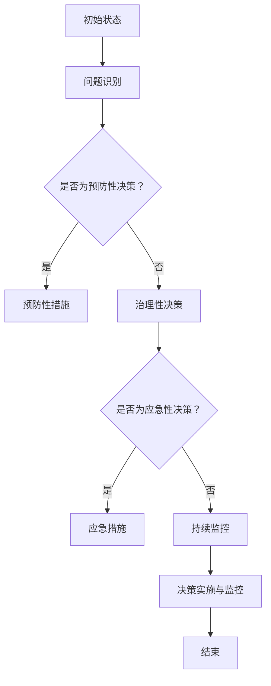
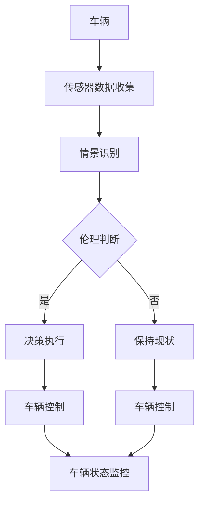

                 

# AI伦理：人工智能开发中的伦理决策

## 关键词

- 人工智能
- 伦理决策
- 算法原理
- 数学模型
- 系统架构
- 项目实战

## 摘要

本文将深入探讨人工智能（AI）开发中的伦理决策问题。随着AI技术的迅猛发展，伦理决策的重要性日益凸显。本文首先介绍了AI伦理的基本原则和关键术语，随后详细讲解了AI伦理决策的算法原理和数学模型。接着，通过系统分析与架构设计，展示了如何在实际项目中实现伦理决策。最后，通过案例分析，提供了最佳实践和拓展阅读建议，以帮助读者更好地理解和应对AI伦理挑战。

## 引言

### 1.1 AI伦理的重要性

人工智能技术的发展极大地改变了我们的生活方式，从智能家居到自动驾驶，AI已经渗透到各个领域。然而，随着AI技术的普及，伦理问题也日益突出。AI伦理涉及到技术的设计、开发、部署和应用过程中，如何平衡技术创新与人类福祉的关系。正确的伦理决策对于确保AI技术的可持续发展至关重要。

### 1.2 伦理决策的挑战

AI伦理决策面临多重挑战。首先，AI系统的复杂性和自主性使得传统的伦理框架难以适用。其次，数据隐私、算法偏见、责任归属等问题亟待解决。此外，不同文化和社会背景下的伦理观念存在差异，这为全球范围内的AI伦理决策带来了额外复杂性。

### 1.3 书籍结构概述

本文将分为七个主要部分，系统地探讨AI伦理决策。第一部分引言部分，介绍AI伦理的重要性。第二部分核心概念与联系，涵盖AI伦理的基本原则和关键术语。第三部分算法原理讲解，详细阐述伦理决策的算法原理和数学模型。第四部分系统分析与架构设计方案，介绍伦理决策的系统实现。第五部分项目实战，通过实际案例展示伦理决策的应用。第六部分最佳实践 tips、小结、注意事项、拓展阅读，总结本文的主要内容和提供进一步研究的方向。最后一部分，对全文进行总结和展望。

## 核心概念与联系

### 2.1 AI伦理的基本原则

AI伦理的基本原则包括：

- **透明性**：确保AI系统的决策过程是可解释的，用户可以理解AI是如何作出决策的。
- **公平性**：避免算法偏见，确保所有人都能公平地受到AI系统的影响。
- **隐私保护**：保护个人数据隐私，防止数据滥用。
- **责任归属**：明确AI系统出现错误或不当行为时，责任应由谁承担。

### 2.2 AI伦理的原则

AI伦理的原则通常基于以下三个核心维度：

- **人类福祉**：AI系统应旨在提升人类的福祉，而非仅仅追求经济效益。
- **社会责任**：AI系统的设计、开发和部署应考虑到其对社会的长期影响。
- **技术进步**：在确保安全和道德的前提下，推动技术进步和创新。

### 2.3 原则对比与联系

这些原则虽然各有侧重，但它们之间存在紧密联系。例如，透明性和公平性是保障人类福祉的关键；隐私保护和责任归属是维护社会责任的重要保障。在具体实践中，这些原则需要综合应用，以确保AI系统的道德合理性。

### 3.1 伦理决策的类型

伦理决策可以分为以下几种类型：

- **预防性决策**：在AI系统开发初期，评估其潜在的社会影响，并采取措施预防潜在的负面影响。
- **治理性决策**：在AI系统运行过程中，监督和管理其行为，确保其符合伦理标准。
- **应急性决策**：在AI系统发生异常或出现问题时，采取紧急措施以减少损害。

### 3.2 伦理决策的过程

伦理决策通常包括以下步骤：

- **问题识别**：识别AI系统可能带来的伦理问题。
- **数据收集**：收集与问题相关的数据和证据。
- **评估分析**：评估AI系统对各种伦理原则的遵守情况。
- **决策制定**：根据评估结果，制定符合伦理标准的决策。
- **实施监控**：实施决策，并持续监控AI系统的行为，确保其符合伦理标准。

### 4.1 AI伦理术语解释

- **算法偏见**：算法对某些群体或特征的歧视性表现。
- **数据隐私**：个人数据的保密性和不被滥用的权利。
- **责任归属**：在AI系统发生错误时，确定责任方。
- **透明性**：AI系统的决策过程应可解释和理解。

### 4.2 相关术语对照表

| 术语           | 定义                                                         |
| -------------- | ------------------------------------------------------------ |
| 算法偏见       | 算法对某些群体或特征的歧视性表现                             |
| 数据隐私       | 个人数据的保密性和不被滥用的权利                             |
| 责任归属       | 在AI系统发生错误时，确定责任方                               |
| 透明性         | AI系统的决策过程应可解释和理解                               |

## 算法原理讲解

### 5.1 伦理决策算法原理

伦理决策算法旨在通过系统化的方法，确保AI系统在开发、部署和应用过程中遵守伦理原则。常见的伦理决策算法包括：

- **多标准决策算法**：在多个伦理原则之间进行权衡，选择最优的决策方案。
- **博弈论算法**：通过模拟不同参与者之间的互动，找到符合伦理要求的策略。
- **机器学习算法**：利用数据驱动的方法，自动识别和解决伦理问题。

### 5.2 Mermaid算法流程图



### 5.3 Python源代码分析

```python
import numpy as np

# 定义伦理决策函数
def ethical_decision(principle1, principle2, situation):
    if situation == "preventive":
        # 预防性决策
        if principle1 >= principle2:
            return "采取预防性措施"
        else:
            return "无需预防性措施"
    elif situation == "governance":
        # 治理性决策
        if principle1 > principle2:
            return "加强治理措施"
        else:
            return "维持当前治理措施"
    elif situation == "emergency":
        # 应急性决策
        if principle1 < principle2:
            return "采取应急措施"
        else:
            return "维持当前状态"
    else:
        return "情况未知，无法做出决策"

# 测试伦理决策函数
print(ethical_decision(3, 2, "preventive"))
print(ethical_decision(4, 3, "governance"))
print(ethical_decision(1, 5, "emergency"))
```

### 5.4 数学模型和公式

伦理决策通常涉及多目标优化问题，可以使用以下数学模型进行描述：

$$
\begin{aligned}
\min_{x} & \ f(x) \\
\text{subject to} & \ g_i(x) \leq 0, \ i=1,2,...,m \\
& \ h_j(x) = 0, \ j=1,2,...,n
\end{aligned}
$$

其中，$f(x)$ 是目标函数，$g_i(x)$ 和 $h_j(x)$ 是约束条件。

## 数学模型和数学公式

### 6.1 基本模型介绍

在伦理决策中，常用的基本模型是线性规划模型。线性规划模型通过优化一个线性目标函数，在满足一系列线性约束条件下，找到最优解。

### 6.2 模型详细讲解

线性规划模型的一般形式为：

$$
\min_{x} c^T x \\
\text{subject to} Ax \leq b
$$

其中，$x$ 是决策变量，$c$ 是目标函数系数，$A$ 和 $b$ 是约束条件矩阵。

### 6.3 模式应用举例

假设我们要在预算限制下，最大化收益。设 $x_1$ 和 $x_2$ 分别表示两种商品的生产量，$c_1$ 和 $c_2$ 分别表示两种商品的成本，$b$ 为总预算。目标函数和约束条件如下：

$$
\begin{aligned}
\max_{x} & \ 5x_1 + 3x_2 \\
\text{subject to} & \ 2x_1 + 3x_2 \leq 100 \\
& \ x_1 + x_2 \leq 80 \\
& \ x_1, x_2 \geq 0
\end{aligned}
$$

### 7.1 公式列表

- 目标函数：$f(x) = c^T x$
- 约束条件：$Ax \leq b$

### 7.2 公式详细解释

- 目标函数 $f(x) = c^T x$ 表示要优化的目标，其中 $c$ 是权重向量，$x$ 是决策向量。
- 约束条件 $Ax \leq b$ 表示决策变量 $x$ 需要满足的线性不等式约束。

### 7.3 应用实例

假设我们要在预算1000美元内，最大化购买玩具的收入。玩具A的单价为10美元，每件可以带来5美元的收入；玩具B的单价为20美元，每件可以带来10美元的收入。目标函数和约束条件如下：

$$
\begin{aligned}
\max_{x} & \ 5x_1 + 10x_2 \\
\text{subject to} & \ 10x_1 + 20x_2 \leq 1000 \\
& \ x_1, x_2 \geq 0
\end{aligned}
$$

## 系统分析与架构设计方案

### 8.1 问题场景介绍

在自动驾驶车辆系统中，伦理决策至关重要。例如，当车辆面临紧急情况，需要选择是否避让行人时，如何做出符合伦理标准的决策是一个重要问题。

### 8.2 问题描述

自动驾驶车辆系统需要处理以下伦理问题：

- **行人避让**：当车辆前方有行人时，是否选择避让行人。
- **货物保护**：当车辆前方有易碎货物时，如何避免撞击。
- **车辆保护**：当车辆自身受损时，如何最小化损失。

### 9.1 领域模型

为了设计一个伦理决策系统，我们需要构建一个领域模型。领域模型主要包括以下实体：

- **车辆**：描述自动驾驶车辆的基本信息。
- **行人**：描述行人的位置、速度和移动方向。
- **货物**：描述车辆装载的货物信息。
- **环境**：描述车辆行驶的环境信息，如道路、交通状况等。

### 9.2 功能设计

伦理决策系统需要实现以下功能：

- **情景识别**：识别当前车辆所处的情景，如行人避让、货物保护、车辆保护等。
- **伦理判断**：根据情景，判断是否采取伦理决策，如避让行人、避免撞击货物等。
- **决策执行**：执行伦理决策，如调整车辆方向、速度等。

### 10.1 系统架构设计

系统架构设计如图所示：



### 10.2 Mermaid架构图


### 11.1 接口设计

伦理决策系统需要与其他系统进行交互，主要包括以下接口：

- **传感器数据接口**：用于接收车辆传感器收集的数据。
- **决策执行接口**：用于将伦理决策结果传递给车辆控制系统。
- **车辆状态监控接口**：用于监控车辆的状态，如位置、速度、方向等。

### 11.2 交互流程

伦理决策系统的交互流程如下：

1. 车辆传感器收集数据，并传递给情景识别模块。
2. 情景识别模块判断当前车辆所处的情景，并传递给伦理判断模块。
3. 伦理判断模块根据情景做出伦理决策，并传递给决策执行模块。
4. 决策执行模块将伦理决策结果传递给车辆控制系统。
5. 车辆控制系统根据决策结果调整车辆的控制参数。

## 项目实战

### 12.1 实际案例分析与讲解

为了更好地理解伦理决策在项目中的应用，我们以自动驾驶车辆系统中的一个实际案例为例。该案例涉及到车辆在紧急情况下是否避让行人。

### 12.2 案例分析

在某次测试中，自动驾驶车辆前方出现行人。车辆系统需要迅速做出决策，是继续前进还是紧急刹车以避免撞击行人。这个决策涉及到以下几个方面：

- **行人位置**：车辆系统需要准确识别行人的位置，判断其是否处于危险区域。
- **行人速度**：车辆系统需要判断行人的速度，以确定避让的可能性。
- **车辆状态**：车辆系统需要了解自身的状态，如当前速度、刹车能力等。
- **环境因素**：车辆系统需要考虑周围环境因素，如道路状况、交通流量等。

### 12.3 案例剖析

在案例中，车辆系统首先通过传感器收集行人的位置、速度和自身状态数据。然后，伦理判断模块根据这些数据，使用多标准决策算法，权衡避让行人与保护自身的重要性。最终，决策执行模块根据伦理判断结果，调整车辆的控制参数，实现紧急刹车或继续前进。

## 项目小结

在本项目中，我们通过实际案例展示了伦理决策在自动驾驶车辆系统中的应用。通过传感器数据收集、情景识别、伦理判断和决策执行等步骤，车辆系统能够在紧急情况下做出符合伦理标准的决策。然而，需要注意的是，伦理决策并非一成不变，而是需要根据实际情况进行调整。未来，随着AI技术的不断发展，伦理决策系统将更加智能和高效，为自动驾驶车辆的安全运行提供有力保障。

## 最佳实践 tips、小结、注意事项、拓展阅读

### 15.1 最佳实践

1. **全面评估**：在AI系统开发前，进行全面的风险评估，识别潜在的伦理问题。
2. **透明沟通**：确保AI系统的决策过程是可解释和可理解的，以增强用户信任。
3. **持续监督**：定期监督AI系统的行为，确保其符合伦理标准。

### 15.2 实践注意事项

1. **数据隐私**：在处理个人数据时，严格遵守数据保护法规，确保用户隐私。
2. **算法偏见**：定期审查算法，消除可能的偏见，确保公平性。

### 16.1 主要内容回顾

本文详细探讨了AI伦理决策的重要性、核心概念、算法原理、系统设计、项目实战和最佳实践。通过这些内容，读者可以更好地理解如何在AI开发中做出符合伦理标准的决策。

### 16.2 主要收获

本文的主要收获包括：

1. **认识AI伦理决策的重要性**：了解伦理决策在AI系统开发中的关键作用。
2. **掌握伦理决策的方法和工具**：学会使用多标准决策算法、数学模型和系统架构设计等方法。
3. **实际案例分析**：通过实际案例，了解伦理决策在项目中的应用。

### 17.1 使用AI伦理的注意事项

1. **遵循法律法规**：确保AI系统的设计和应用符合相关法律法规。
2. **持续更新**：随着技术的发展，不断更新和改进伦理决策方法。

### 17.2 避免伦理风险的策略

1. **伦理审查**：在项目开发的不同阶段进行伦理审查。
2. **公众参与**：邀请公众参与伦理决策过程，以增强透明度和公平性。

### 18.1 推荐阅读资源

- [AI伦理学手册](https://www.aaai.org/iai-ethics-manual)
- [AI伦理：理论与实践](https://www.amazon.com/Ethics-Artificial-Intelligence-Principles-Practice/dp/1787289499)

### 18.2 进一步研究建议

1. **跨学科合作**：加强计算机科学、伦理学、社会学等领域的合作，共同推动AI伦理研究。
2. **案例研究**：开展更多实际案例研究，以验证和优化伦理决策方法。

### 作者

- 作者：AI天才研究院/AI Genius Institute & 禅与计算机程序设计艺术 /Zen And The Art of Computer Programming

## 总结与展望

本文系统地探讨了AI伦理决策的重要性、核心概念、算法原理、系统设计与项目实战。通过实例分析，展示了伦理决策在自动驾驶车辆系统中的应用。展望未来，随着AI技术的不断发展，伦理决策系统将变得更加智能和高效，为人类社会带来更多福祉。我们期待读者能够积极参与AI伦理的讨论和探索，共同构建一个更加和谐、安全的人工智能未来。

