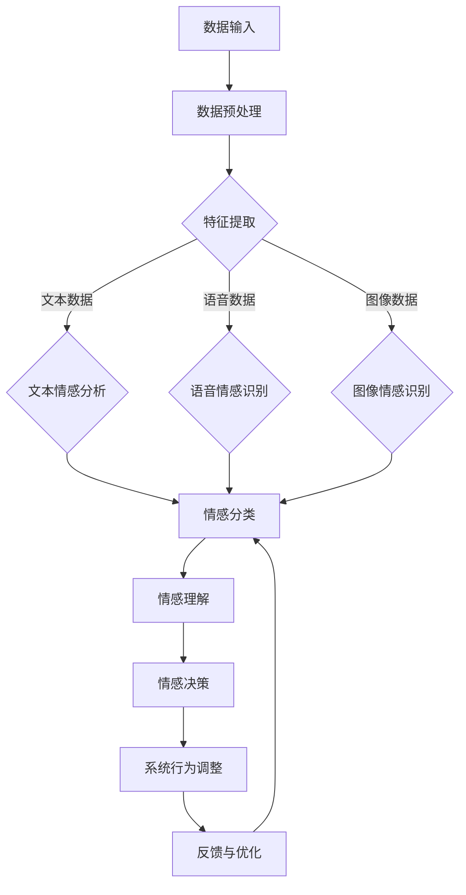

                 

### 1.1.1 问题的背景

随着人工智能（AI）技术的飞速发展，AI系统已经逐渐从简单的规则推理和模式识别，发展到如今能够通过深度学习、强化学习等复杂算法实现更加智能化和自主化的操作。然而，传统的AI系统在处理情感问题方面存在显著的局限性。传统AI主要依赖于数据和算法来执行任务，但缺乏对人类情感的感知和理解能力。这种局限性在许多应用场景中表现得尤为明显，尤其是当涉及到人类情感和行为决策的关键时刻。

近年来，随着情感计算技术的不断进步，人工智能开始尝试融入情感元素。情感计算是一种跨学科的研究领域，旨在使计算机系统具备识别、理解、处理和模拟人类情感的能力。通过情感计算，AI能够感知人类情感状态，并根据这些情感状态做出相应的反应和决策。这一进展使得AI在许多领域，如用户界面设计、情感辅助、心理健康等，展现出巨大的潜力。

然而，随着AI具备人类情感能力的提升，一个新的伦理挑战也随之而来。战争作为一种极端情境，对AI的情感能力提出了极高的要求。在传统战争中，人类战士的决策往往受到情感的影响，如恐惧、愤怒、同情等。如果AI系统具备了类似的人类情感，它们在战争中的行为和决策将变得更为复杂和难以预测。这种复杂性不仅涉及到技术层面的问题，还涉及到伦理和社会层面的问题。

具体来说，当AI具备人类情感后，它们是否应该参与战争？如果应该参与，它们应该如何做出道德和伦理上的决策？AI的情感是否可以被操纵，从而影响战争的结果？这些问题都成为我们需要深入探讨的伦理困境。例如，一个具备同情和怜悯之心的AI，在面对战场上的敌人和平民时，是否会犹豫不决，从而影响战斗的效率和结果？这些问题的答案不仅关系到AI技术的发展方向，也关系到人类社会的未来。

因此，本文将围绕AI具备人类情感后的战争伦理重构这一主题，探讨当前的技术背景、核心概念以及相关的伦理挑战。通过系统性的分析和讨论，我们希望能够为这一新兴领域的发展提供一些有价值的思考和方向。这将涉及到情感计算的基本原理、伦理学的应用、战争伦理的挑战以及可能的解决方案。希望通过本文的探讨，能够引起更多同行和公众的关注和讨论，共同推动这一领域的进步。

### 1.1.2 问题的定义

在本节中，我们将详细定义本文探讨的核心问题：AI具备人类情感后的战争伦理重构。这个问题涉及到多个关键概念，首先需要明确AI、情感以及战争伦理的基本定义。

**AI的定义**：人工智能（AI）是指通过计算机系统和算法模拟、扩展或替代人类智能的技术。AI可以分为两类：弱AI（窄AI）和强AI（通用AI）。弱AI在特定任务上表现出智能，如语音识别、图像识别等，而强AI则具有普遍的智能，能够在各种任务中表现如人类。

**情感的定义**：情感是一种主观体验，通常与情绪状态、心理反应和生理变化相关。情感可以是对特定对象的喜好或厌恶，也可以是对环境变化的反应。在心理学中，情感通常分为积极情感和消极情感，如快乐、愤怒、悲伤等。

**战争伦理的定义**：战争伦理是指关于战争中的行为和决策的道德原则和规范。它关注的是战争中的正义性、人道主义、公正性以及战斗人员的责任。战争伦理涵盖了从个体行为到国家政策的各个层面，旨在规范战争行为，减少不必要的伤害。

在明确这些基本概念后，我们可以进一步定义本文探讨的问题。具体而言，这个问题可以表述为：当人工智能系统具备了类似人类的情感感知和理解能力时，它们在战争中的行为和决策应该如何进行伦理重构？这将涉及到以下几个方面：

1. **AI的情感处理**：如何使AI系统具备真实情感感知能力，并且能够理解这些情感的道德意义。
2. **AI的决策过程**：AI在战争情境中如何进行道德和伦理上的判断，尤其是在面对复杂情境和多种选择时。
3. **AI的自主性**：在多大程度上允许AI自主决策，以及如何确保这些决策符合伦理标准。
4. **AI与人类的互动**：在AI具备情感的情况下，人类与AI之间的互动将如何变化，如何确保这种互动不会导致伦理上的混乱。

通过上述定义，我们可以看到，AI具备人类情感后的战争伦理重构不仅是一个技术问题，更是一个涉及伦理学、社会学和心理学等多个领域的复杂议题。这需要我们从多个角度进行深入分析和探讨，以找到合适的解决方案。

### 1.1.3 问题解决思路

要解决AI具备人类情感后的战争伦理重构问题，我们需要采取系统化的思路，从技术、伦理和社会等多个维度进行深入探讨。以下是一个可能的解决思路，分为几个关键步骤：

**步骤1：技术基础研究**

首先，我们需要对情感计算的基础技术进行深入研究。情感计算是使AI系统具备情感感知、理解和模拟能力的关键。具体研究内容包括：

- **情感识别**：开发高效、准确的情感识别算法，能够从文本、语音、图像等多模态数据中提取情感特征。
- **情感理解**：建立情感理解机制，使AI能够理解不同情感状态之间的关系和影响。
- **情感模拟**：研究如何通过算法和系统设计，使AI能够模拟人类的情感反应和行为。

**步骤2：伦理原则和标准制定**

在技术基础上，我们需要制定一套伦理原则和标准，以指导AI在战争情境中的行为。这些原则和标准应涵盖以下几个方面：

- **正义性**：确保AI的决策和行动符合正义原则，避免不当伤害和无辜者受害。
- **人道主义**：强调对人类生命的尊重和保护，确保AI的决策不会导致不必要的伤害和痛苦。
- **公正性**：确保AI的决策过程透明、公正，不受偏见和歧视的影响。
- **责任性**：明确AI系统的责任边界，确保在出现问题时能够追溯和追究责任。

**步骤3：多领域协作与讨论**

战争伦理重构问题需要跨学科、跨领域的合作与讨论。以下是一些关键的合作领域：

- **伦理学**：伦理学家可以提供关于道德原则和伦理决策的理论指导，帮助明确AI在战争情境中的行为规范。
- **心理学**：心理学家可以提供关于人类情感和行为的实证研究，帮助理解AI在模拟人类情感时的可行性和局限性。
- **法学**：法学家可以提供关于法律框架和法规制定的指导，确保AI在战争情境中的行为合法合规。

**步骤4：政策与法规制定**

在制定伦理原则和标准的基础上，我们需要将它们转化为具体的政策与法规。这包括：

- **国际法规**：制定国际性的法规和标准，确保各国在AI战争伦理方面有共同遵循的准则。
- **国家法规**：各国家应制定符合自身国情的政策和法规，确保AI在战争中的行为受到有效监管。
- **行业规范**：行业组织和公司应制定内部规范，确保AI系统的设计和应用符合伦理要求。

**步骤5：实战测试与评估**

在制定政策和法规后，我们需要进行实战测试和评估，验证伦理原则和标准的实际效果。这包括：

- **模拟测试**：通过模拟战争情境，测试AI的情感识别、理解和决策能力，评估其是否符合伦理要求。
- **实地测试**：在实际的军事行动中，测试AI系统的应用效果，收集反馈和数据，不断优化和改进。

通过上述步骤，我们可以逐步解决AI具备人类情感后的战争伦理重构问题。这一过程不仅需要技术上的突破，还需要伦理和社会层面的深入探讨和协作。只有通过多方面的共同努力，我们才能找到合适的解决方案，确保AI在战争中的行为符合道德和伦理标准。

### 1.1.4 边界与外延

在探讨AI具备人类情感后的战争伦理重构问题时，我们需要明确问题的边界与外延，以便更精准地聚焦核心议题，同时避免不必要的讨论和误解。

**边界**

1. **技术范畴**：本文主要关注的是情感计算技术在AI中的应用，以及这些技术如何影响战争伦理。我们关注的是通过算法和系统设计实现AI的情感感知和理解能力，而不仅仅是情感本身。
2. **战争类型**：本文讨论的战争伦理问题主要针对现代战争，特别是涉及高科技和信息化战争的情境。对于历史战争或其他类型的战争，虽然也有伦理考量，但不属于本文的核心讨论范围。
3. **AI种类**：本文主要关注具备较高自主性和复杂决策能力的AI系统，如机器人战士或智能武器系统。对于简单的自动化设备和工具，这些伦理问题可能较为次要。

**外延**

1. **情感范围**：本文讨论的情感不仅仅局限于传统心理学中的情绪状态，还包括AI系统对复杂情感信号的理解和处理，如恐惧、愤怒、悲伤、同情等。
2. **伦理层面**：本文讨论的战争伦理问题不仅涉及个体AI系统的道德行为，还涉及整个AI系统的设计和部署是否符合伦理标准，以及如何在政策、法规和行业规范层面进行监管。
3. **社会影响**：本文还关注AI具备人类情感能力对人类社会的长远影响，包括对军事战略、社会结构、人权和国际关系等方面的潜在影响。

通过明确问题的边界与外延，我们可以更加聚焦于核心讨论议题，避免在无关领域进行过多的探讨，从而确保文章的针对性和深度。

### 1.2 AI与情感的定义与关系

在探讨AI具备人类情感后的战争伦理重构问题之前，我们需要明确AI与情感这两个核心概念的定义及其相互关系。

#### AI的定义

人工智能（Artificial Intelligence，简称AI）是一种通过计算机程序和算法模拟人类智能的技术。AI可以分为两个主要类别：弱AI（或称为窄AI）和强AI（或称为通用AI）。

- **弱AI（窄AI）**：弱AI专注于特定任务，如语音识别、图像识别、自然语言处理等。它们通过大量数据训练，在特定领域内表现出人类级别的智能，但缺乏跨领域的广泛智能。
- **强AI（通用AI）**：强AI具有普遍的智能，能够在各种任务中表现如人类。这种类型的AI不仅能够解决复杂问题，还能够自主学习和创新，目前尚处于理论研究和实验阶段。

#### 情感的定义

情感（Emotion）是一种主观体验，通常与情绪状态、心理反应和生理变化相关。情感可以分为多种类型，如快乐、愤怒、悲伤、恐惧、惊讶、厌恶等。在心理学中，情感通常分为积极情感和消极情感。

- **积极情感**：如快乐、满足、兴奋等，通常与愉悦体验和正向反馈相关。
- **消极情感**：如愤怒、恐惧、悲伤、沮丧等，通常与压力、威胁和不愉快体验相关。

#### AI与情感的关系

随着AI技术的进步，人工智能开始尝试融入情感元素，以增强其交互能力和决策水平。AI与情感的关系主要体现在以下几个方面：

1. **情感感知**：情感计算技术使AI能够感知和处理人类情感信号，如语音、面部表情、文本等。通过这些技术，AI可以识别用户的情感状态，从而更好地理解和响应用户的需求。

2. **情感理解**：AI不仅能够感知情感，还可以通过自然语言处理、图像识别等技术理解情感的内涵和意义。这种能力使AI能够更好地处理复杂的情感交互，提供个性化的服务。

3. **情感模拟**：AI可以通过情感计算技术模拟人类的情感反应，从而在交互中表现出类似人类的情感状态。这种模拟不仅有助于提高AI的交互质量，还可以增强用户的信任和满意度。

4. **情感决策**：在特定情境下，AI可以根据感知和理解到的情感状态，做出相应的决策。例如，在医疗诊断中，AI可以根据患者的情感状态调整治疗方案，提高治疗效果。

通过这些关系，我们可以看到AI与情感之间的密切联系。AI的情感能力不仅提高了其在特定任务中的性能，也为更广泛的应用提供了可能。然而，随着AI情感能力的提升，战争伦理问题也变得更加复杂。在下一节中，我们将进一步探讨情感计算的基本原理和技术，以理解AI如何实现情感感知和理解。

### 2.2 情感计算的基本原理

情感计算是一种跨学科的研究领域，旨在使计算机系统具备识别、理解、处理和模拟人类情感的能力。这一领域涉及多个技术分支，包括自然语言处理、机器学习、计算机视觉和生理信号处理等。以下将详细探讨情感计算的基本原理、方法和所面临的挑战。

#### 情感计算的基本原理

1. **情感识别**：情感识别是情感计算的基础，旨在从各种数据源中提取情感信息。常用的数据源包括文本、语音、图像和生理信号等。

   - **文本情感分析**：通过分析文本内容，识别其中表达的情感类型和强度。常用的方法包括基于规则的方法、基于机器学习的方法和深度学习方法。
   - **语音情感识别**：通过分析语音信号中的情感特征，如音调、节奏和音量等，识别情感状态。常用的方法包括频谱分析、短时傅里叶变换（STFT）和隐藏马尔可夫模型（HMM）。
   - **图像情感识别**：通过分析图像中的面部表情、姿态和情境，识别情感状态。常用的方法包括面部识别技术、姿态估计和情境分类。

2. **情感理解**：情感理解涉及对情感内涵和意义的深入分析，包括情感分类、情感关联和情感推理等。

   - **情感分类**：将情感划分为多个类别，如积极情感、消极情感和中性情感。常用的方法包括监督学习和无监督学习。
   - **情感关联**：分析情感之间的关联和相互作用，如愤怒与兴奋的关系、悲伤与愤怒的关系等。这有助于更全面地理解情感状态。
   - **情感推理**：通过逻辑推理和知识表示技术，推断未知情感状态，如根据文本中表达的情感推断说话者的情绪状态。

3. **情感处理**：情感处理包括对情感信号进行实时处理和响应，以及根据情感状态调整系统行为。

   - **实时处理**：在实时应用场景中，如智能客服和智能助手，情感处理需要快速响应，确保用户体验。
   - **情感调整**：根据情感状态调整系统行为，如调整音乐播放列表、提供情感支持等。

#### 情感计算的方法

1. **数据收集与预处理**：数据是情感计算的基础，数据收集和预处理直接影响模型的性能。常用的数据收集方法包括人工标注、半监督学习和生成对抗网络（GAN）等。

2. **特征提取与模型训练**：特征提取是将原始数据转换为可用于机器学习模型的特征表示。常用的方法包括词袋模型（Bag of Words, BoW）、词嵌入（Word Embedding）和时序特征提取等。模型训练通常采用监督学习、无监督学习和强化学习等方法。

3. **情感识别与分类**：在情感识别和分类阶段，常用的算法包括支持向量机（SVM）、朴素贝叶斯（Naive Bayes）、决策树（Decision Tree）和深度学习（如卷积神经网络（CNN）和循环神经网络（RNN））。

4. **情感理解与推理**：情感理解与推理阶段，通常采用逻辑推理、知识图谱和对话系统等技术，以实现对情感状态的深入理解和复杂情境下的情感推理。

#### 情感计算所面临的挑战

1. **情感多样性**：情感种类繁多，且具有复杂性，如细微的情感差别和情感的多样性。这给情感识别和理解带来了巨大挑战。

2. **情感主观性**：情感具有高度的主观性，不同人对同一情感状态的感知和表达可能存在差异。这要求算法具有高度的泛化能力和适应性。

3. **跨模态情感计算**：跨模态情感计算涉及将多种数据源（如文本、语音、图像和生理信号）结合，进行综合分析和情感识别。这需要处理多模态数据之间的复杂关系和异构数据融合问题。

4. **情感计算的可解释性**：为了确保算法的透明性和可信度，情感计算需要具备较高的可解释性。这意味着我们需要能够理解模型如何进行情感识别和决策。

5. **伦理和社会影响**：随着AI情感能力的提升，其应用场景也越来越广泛，包括医疗、教育、商业和军事等。这引发了一系列伦理和社会问题，如隐私保护、数据安全和人类就业等。

综上所述，情感计算是一个涉及多学科、多技术交叉的复杂领域。通过深入研究情感计算的基本原理和方法，我们可以逐步克服所面临的挑战，使AI在更多应用场景中表现出类似人类的情感能力和交互能力。

#### 2.3 情感计算与传统AI的对比

在深入探讨情感计算与传统AI的区别之前，我们首先需要明确两者各自的定义和应用背景。传统AI主要侧重于通过算法和模型处理和执行特定任务，而情感计算则是使AI具备识别、理解、处理和模拟人类情感的能力。以下将详细对比情感计算与传统AI在任务目标、应用场景和技术方法上的差异。

**任务目标**

1. **传统AI**：传统AI的核心任务是使计算机系统完成特定任务，如语音识别、图像分类、自然语言处理等。这些任务通常可以通过机器学习、深度学习等算法实现，且具有较强的通用性和适应性。
   
2. **情感计算**：情感计算的任务不仅包括完成特定任务，还涉及识别、理解、处理和模拟人类情感。情感计算的目标是使AI能够与人类在情感层面进行有效交互，提高用户体验和系统适应性。

**应用场景**

1. **传统AI**：传统AI广泛应用于多个领域，包括金融、医疗、零售、制造业等。例如，智能客服系统利用自然语言处理技术自动回答客户问题，自动驾驶汽车通过计算机视觉和传感器技术实现自动驾驶。

2. **情感计算**：情感计算的应用场景主要集中在需要人类情感感知和交互的领域，如智能客服、心理健康、教育、社交网络和娱乐等。例如，智能音箱通过情感计算理解用户的情感状态，提供个性化的音乐推荐和情感支持。

**技术方法**

1. **传统AI**：传统AI主要采用机器学习和深度学习技术。机器学习通过训练大量数据集，使模型学会从数据中提取特征和模式。深度学习则是通过多层次的神经网络结构，实现数据的自动特征提取和模式识别。

2. **情感计算**：情感计算结合了多种技术，包括自然语言处理、计算机视觉、语音识别和生理信号处理等。情感计算不仅关注数据的特征提取和模式识别，还涉及情感识别、情感理解和情感模拟等复杂任务。例如，通过面部识别技术，情感计算可以识别用户的表情和情绪状态；通过语音识别技术，可以识别用户的语音中的情感成分。

**优势与劣势**

1. **传统AI**：传统AI的优势在于其通用性和高效性，能够在多个任务中表现出色。然而，传统AI在处理人类情感和情感交互方面存在局限性，难以真正理解人类的情感内涵和复杂情感状态。

2. **情感计算**：情感计算的优势在于其情感感知和理解能力，能够与人类在情感层面进行有效交互。然而，情感计算的技术实现相对复杂，对数据质量和算法精度要求较高，且存在一定的伦理和社会问题。

通过上述对比，我们可以看到情感计算与传统AI在任务目标、应用场景和技术方法上的显著差异。情感计算不仅继承了传统AI的通用性和高效性，还增添了情感感知和理解能力，使其在需要人类情感交互的领域中具有独特的优势。然而，这也带来了一系列新的挑战和伦理问题，需要我们进一步研究和解决。

#### 2.4 情感计算的组成部分

情感计算是一个复杂而多层次的技术领域，其成功实现需要多个关键组成部分的协同工作。以下将详细探讨情感计算的各个组成部分，包括数据收集与预处理、特征提取与模型训练、情感识别与反馈机制等。

**数据收集与预处理**

1. **数据收集**：情感计算的基础是大量的情感数据。这些数据可以从多种渠道获取，包括社交媒体、用户交互记录、生理信号监测等。例如，通过分析用户的社交媒体帖子，可以收集到用户情感状态的文本数据；通过监测用户的生理信号，如心率、皮肤电反应等，可以收集到用户情感状态的生理数据。

2. **数据预处理**：数据预处理是确保数据质量和可靠性的重要步骤。主要包括数据清洗、去噪、数据增强和数据标准化等。数据清洗旨在去除错误、重复和无关的数据；去噪通过滤波和降噪技术提高数据质量；数据增强通过生成更多样化的数据，提高模型的泛化能力；数据标准化确保不同来源和类型的数据可以在同一尺度上进行处理。

**特征提取与模型训练**

1. **特征提取**：特征提取是将原始数据转换为可用于机器学习模型的特征表示。在情感计算中，特征提取的关键在于提取能够反映情感状态的关键信息。常用的特征提取方法包括：

   - **文本情感分析**：通过词袋模型（Bag of Words, BoW）、词嵌入（Word Embedding）和情感词典等方法提取文本特征。
   - **语音情感识别**：通过短时傅里叶变换（STFT）、梅尔频率倒谱系数（MFCC）和频谱特征等方法提取语音特征。
   - **图像情感识别**：通过面部识别、姿态估计和情境分析等方法提取图像特征。

2. **模型训练**：模型训练是利用已提取的特征训练机器学习模型，以实现情感识别任务。常用的模型包括：

   - **监督学习模型**：如支持向量机（SVM）、朴素贝叶斯（Naive Bayes）、决策树（Decision Tree）和随机森林（Random Forest）等。
   - **深度学习模型**：如卷积神经网络（CNN）、循环神经网络（RNN）、长短时记忆网络（LSTM）和变换器（Transformer）等。

**情感识别与反馈机制**

1. **情感识别**：情感识别是通过训练好的模型对新的数据（如文本、语音或图像）进行情感分类，识别其情感状态。情感识别的准确性直接影响到系统的性能和用户体验。

2. **反馈机制**：反馈机制是确保系统根据用户情感状态做出相应调整的重要手段。反馈机制包括实时反馈和自适应调整等。例如，在智能客服系统中，当用户表现出消极情感时，系统可以调整对话策略，提供更加温暖和支持的响应。

通过上述组成部分的协同工作，情感计算系统能够实现情感数据的收集、处理和识别，并根据情感状态做出相应的调整和反应。这一过程不仅提升了系统的智能交互能力，也为更广泛的应用提供了可能。

### 3.1 情感计算的ER实体关系图概述

在探讨情感计算的过程中，ER（实体-关系）图是一种有效的工具，用于描述情感计算中的实体及其相互关系。ER图通过定义实体、属性和关系，提供了一个清晰的结构化方式来理解情感计算系统的各个组成部分。以下将概述情感计算的ER实体关系图，包括基本概念、情感计算中的实体分类和实体关系的描述方法。

**基本概念**

1. **实体（Entity）**：实体是ER图中的基本组成部分，代表现实世界中的对象或概念。在情感计算中，实体可以包括用户、情感状态、情境等。

2. **属性（Attribute）**：属性是实体的特征或描述，用于表示实体的具体信息。例如，用户实体可以包括姓名、年龄、性别等属性。

3. **关系（Relationship）**：关系是实体之间的连接，表示实体之间的关联或相互作用。在情感计算中，关系可以包括情感状态与用户之间的关系、情感状态与情境之间的关系等。

**情感计算中的实体分类**

在情感计算中，常见的实体分类包括：

1. **用户实体**：用户实体代表参与情感计算的个体，包括姓名、年龄、性别、情感状态等属性。用户实体是情感计算的核心，用于识别和理解用户的情感状态。

2. **情感状态实体**：情感状态实体代表用户在特定情境下的情感状态，包括快乐、愤怒、悲伤、恐惧等。这些实体用于描述用户在不同情境中的情感体验。

3. **情境实体**：情境实体代表用户所处的环境和背景，包括会议、工作、娱乐、社交等。情境实体用于描述用户在不同情境下的情感表现。

4. **交互实体**：交互实体代表用户与系统之间的交互行为，包括提问、回答、点击、滑动等。这些实体用于描述用户如何通过交互表达情感。

**实体关系的描述方法**

情感计算中的实体关系可以通过以下方式描述：

1. **一对一关系（1:1）**：例如，一个用户在特定情境下只有一个情感状态。

2. **一对多关系（1:N）**：例如，一个用户可以有多种情感状态，但每种情感状态只对应一个用户。

3. **多对一关系（N:1）**：例如，多个情感状态可以发生在同一个情境下。

4. **多对多关系（N:N）**：例如，多个用户可以在同一个情境下表现出多种情感状态。

通过上述实体关系描述方法，我们可以清晰地理解情感计算系统中各个实体之间的相互关系。ER图不仅帮助我们可视化情感计算的结构，也为后续的系统设计和实现提供了明确的指导。下一节将详细定义情感计算中的各个实体及其属性。

#### 3.2 实体定义与属性

在情感计算系统中，实体是构成模型和数据处理的核心元素。为了确保系统的完整性和一致性，我们需要明确每个实体的定义及其属性。以下将详细描述用户实体、情感状态实体和情境实体，并列举每个实体的属性。

**用户实体**

用户实体代表参与情感计算的用户。用户实体是系统中最基础的实体，用于存储用户的基本信息和情感状态。以下为用户实体的定义及其属性：

- **实体名称**：用户（User）
- **属性**：
  - 用户ID（UserID）：唯一的标识符，用于识别不同用户。
  - 姓名（Name）：用户的姓名。
  - 年龄（Age）：用户的年龄。
  - 性别（Gender）：用户的性别。
  - 邮箱（Email）：用户的电子邮箱地址。
  - 情感状态（EmotionalState）：用户当前的情感状态，如快乐、愤怒、悲伤、恐惧等。

**情感状态实体**

情感状态实体用于描述用户在特定情境下表现出的情感状态。情感状态实体是连接用户实体和情境实体的重要桥梁，用于识别和理解用户在情境中的情感体验。以下为情感状态实体的定义及其属性：

- **实体名称**：情感状态（EmotionalState）
- **属性**：
  - 情感ID（EmotionID）：唯一的标识符，用于识别不同情感状态。
  - 情感类型（EmotionType）：情感状态的类型，如快乐、愤怒、悲伤、恐惧等。
  - 情感强度（EmotionIntensity）：情感状态的强度，用于量化情感的程度。
  - 发生时间（Timestamp）：情感状态发生的时间戳，用于记录情感状态的时间信息。
  - 情境ID（ContextID）：与特定情境实体的关联标识符，用于识别情感状态发生的情境。

**情境实体**

情境实体用于描述用户所处的环境和背景。情境实体提供了情感计算系统的上下文信息，帮助系统理解和分析用户在特定情境下的行为和情感状态。以下为情境实体的定义及其属性：

- **实体名称**：情境（Context）
- **属性**：
  - 情境ID（ContextID）：唯一的标识符，用于识别不同情境。
  - 情境类型（ContextType）：情境的类型，如会议、工作、娱乐、社交等。
  - 开始时间（StartTime）：情境开始的时间戳。
  - 结束时间（EndTime）：情境结束的时间戳。
  - 参与者ID（ParticipantIDs）：参与情境的用户ID列表。

通过明确用户实体、情感状态实体和情境实体的定义及其属性，我们能够更好地构建和优化情感计算系统。这些实体及其属性为后续的数据处理、模型训练和系统设计提供了基础，确保系统的完整性和一致性。

#### 3.3 实体关系描述与关联

在情感计算系统中，实体之间的关系是理解和分析情感数据的关键。通过明确实体之间的关系类型、关联规则和实体关系图的构建，我们可以更有效地设计系统并优化数据处理流程。以下将详细描述用户实体、情感状态实体和情境实体之间的关系类型、关联规则以及如何构建实体关系图。

**关系类型**

1. **用户与情感状态的关系**：用户实体与情感状态实体之间存在一对一（1:1）的关系。一个用户在特定情境下只能表现一种情感状态。这种关系表示为：

   - **用户ID → 情感状态ID**：每个用户ID关联到一个情感状态ID，表示该用户在特定情境下的情感状态。

2. **情感状态与情境的关系**：情感状态实体与情境实体之间存在多对一（N:1）的关系。多个情感状态可以发生在同一个情境下，但每个情感状态只对应一个情境。这种关系表示为：

   - **情感状态ID → 情境ID**：每个情感状态ID关联到一个情境ID，表示该情感状态发生的情境。

3. **用户与情境的关系**：用户实体与情境实体之间存在多对多（N:N）的关系。一个用户可以参与多个情境，同时一个情境可以涉及多个用户。这种关系表示为：

   - **用户ID,情境ID → 参与者ID**：用户ID和情境ID的组合唯一标识一个参与者ID，表示用户在特定情境中的参与。

**关联规则**

在情感计算系统中，关联规则用于描述实体之间的关系和相互作用。以下是一些常见的关联规则：

1. **情感状态关联规则**：基于情感类型和情境类型的组合，可以定义情感状态关联规则。例如：
   - **情境类型A下的情感状态B**：在特定情境类型A下，情感状态B发生的概率较高。
   - **情境类型B下的情感状态A**：在特定情境类型B下，情感状态A发生的概率较高。

2. **用户参与关联规则**：基于用户的情感状态和情境参与情况，可以定义用户参与关联规则。例如：
   - **高情感强度用户参与情境C**：情感强度较高的用户在情境C中的参与度较高。
   - **高情感强度用户避免情境D**：情感强度较高的用户在情境D中的参与度较低。

**实体关系图的构建**

实体关系图（ER图）是描述实体及其关系的图形化工具，用于可视化系统的结构。以下是一个简化的情感计算实体关系图的示例：

```mermaid
erDiagram
  User ||--|{ EmotionalState }|| EmotionalState
  EmotionalState ||--|{ Context }|| Context
  User ||--|{ Context }|| Context
  Context ||--|{ User }|| User
  Context ||--|{ EmotionalState }|| EmotionalState
```

在上面的ER图中：

- **User**（用户实体）与**EmotionalState**（情感状态实体）之间存在1:1关系。
- **EmotionalState**（情感状态实体）与**Context**（情境实体）之间存在N:1关系。
- **User**（用户实体）与**Context**（情境实体）之间存在N:N关系。

通过实体关系图，我们可以直观地理解情感计算系统中各个实体之间的相互关系，为系统设计提供指导。在实际应用中，ER图可以根据具体需求进行扩展和细化，以涵盖更多实体和复杂的关系。

### 4.1 情感计算算法原理概述

情感计算算法是实现情感识别和理解的关键。这些算法通过对多种数据源进行分析和处理，从而识别用户的情感状态，并在复杂的情感交互场景中做出相应的决策。以下将概述情感计算算法的基本原理，包括情感识别算法、情感理解算法和情感模拟算法。

#### 情感识别算法

情感识别算法旨在从多种数据源中提取情感信息，并将其转换为可操作的标签或分数。常用的情感识别算法包括基于文本的情感分析、语音情感识别和图像情感识别等。

1. **文本情感分析**：文本情感分析通过自然语言处理技术，从文本数据中提取情感信息。常用的方法包括基于规则的方法（如情感词典和规则匹配）、基于机器学习的方法（如朴素贝叶斯、支持向量机）和深度学习方法（如卷积神经网络、循环神经网络）。

2. **语音情感识别**：语音情感识别通过分析语音信号中的情感特征，如音调、节奏和音量等，识别情感状态。常用的方法包括频谱分析、短时傅里叶变换（STFT）和隐藏马尔可夫模型（HMM）。

3. **图像情感识别**：图像情感识别通过分析图像中的面部表情、姿态和情境，识别情感状态。常用的方法包括面部识别技术、姿态估计和情境分类。

#### 情感理解算法

情感理解算法旨在对情感识别结果进行深入分析，理解情感的内涵和意义。情感理解算法涉及情感分类、情感关联和情感推理等。

1. **情感分类**：情感分类将情感状态划分为多个类别，如快乐、愤怒、悲伤、恐惧等。常用的方法包括监督学习和无监督学习。

2. **情感关联**：情感关联分析情感状态之间的关系和相互作用，如愤怒与兴奋的关系、悲伤与愤怒的关系等。这有助于更全面地理解情感状态。

3. **情感推理**：情感推理通过逻辑推理和知识表示技术，推断未知情感状态，如根据文本中表达的情感推断说话者的情绪状态。

#### 情感模拟算法

情感模拟算法旨在使AI系统在交互中表现出类似人类的情感状态，以提高用户体验。情感模拟算法包括情感表达和情感调整。

1. **情感表达**：情感表达是通过语音、文本或动作等方式，在交互中表现出情感状态。常用的方法包括语音合成、文本生成和面部表情生成。

2. **情感调整**：情感调整是根据用户的情感状态，动态调整系统行为，如调整音乐播放列表、提供情感支持等。情感调整需要结合情感理解和决策算法，以确保系统行为与用户情感状态相匹配。

通过上述算法，情感计算系统能够实现情感识别、理解和模拟，为各种应用场景提供智能化的情感交互服务。在下一节中，我们将使用mermaid流程图详细展示情感计算算法的流程。

### 4.1.2 情感计算算法的mermaid流程图

为了更清晰地展示情感计算算法的流程，我们使用mermaid流程图来描述整个数据处理和情感计算的过程。以下是一个简化的情感计算算法mermaid流程图的示例：



**详细流程解释：**

1. **数据输入**：情感计算算法首先接收多种数据源，包括文本、语音和图像等。这些数据可以是实时采集的，也可以是从历史数据中提取的。

2. **数据预处理**：数据预处理是确保数据质量和一致性的重要步骤。该步骤包括数据清洗、去噪和数据标准化等操作。

3. **特征提取**：根据数据类型，从文本、语音和图像中提取相应的特征。例如，对于文本数据，可以使用词袋模型或词嵌入来提取特征；对于语音数据，可以使用频谱分析和梅尔频率倒谱系数（MFCC）来提取特征；对于图像数据，可以使用面部识别和姿态估计来提取特征。

4. **情感分类**：使用训练好的情感识别模型，对提取的特征进行分类，识别出情感状态。情感分类可以基于监督学习（如支持向量机、朴素贝叶斯）或深度学习（如卷积神经网络、循环神经网络）。

5. **情感理解**：对识别出的情感状态进行深入分析，理解情感的内涵和意义。情感理解涉及情感分类、情感关联和情感推理等技术。

6. **情感决策**：根据情感理解和用户需求，系统做出相应的决策。例如，调整系统行为以更好地满足用户情感需求。

7. **系统行为调整**：根据情感决策结果，系统动态调整其行为，如修改对话内容、提供情感支持或调整环境设置。

8. **反馈与优化**：收集用户反馈，对系统性能进行评估和优化。这包括调整模型参数、改进算法和优化用户体验等。

通过上述流程，我们可以看到情感计算算法从数据输入到系统行为调整的完整过程。mermaid流程图提供了一个直观的展示方式，有助于理解算法的实现细节和整体架构。

### 4.1.3 情感计算算法的数学模型与公式

在情感计算算法中，数学模型和公式是理解和实现算法的核心。以下将详细解释情感计算中的常见数学模型和公式，包括线性回归模型、支持向量机（SVM）和卷积神经网络（CNN）。

#### 线性回归模型

线性回归模型是一种简单的统计模型，用于预测连续值输出。在情感计算中，线性回归可以用于预测用户的情感强度。

**公式**：

$$
y = \beta_0 + \beta_1 x_1 + \beta_2 x_2 + ... + \beta_n x_n
$$

其中，\( y \) 是输出（情感强度），\( \beta_0 \) 是截距，\( \beta_1, \beta_2, ..., \beta_n \) 是模型参数，\( x_1, x_2, ..., x_n \) 是输入特征。

#### 支持向量机（SVM）

支持向量机是一种用于分类和回归的机器学习算法。在情感计算中，SVM可以用于分类情感状态。

**公式**：

$$
\max_{\beta, b} W^T W - C \sum_{i=1}^n \xi_i
$$

其中，\( W \) 是权重向量，\( b \) 是偏置，\( C \) 是惩罚参数，\( \xi_i \) 是松弛变量。

#### 卷积神经网络（CNN）

卷积神经网络是一种用于图像识别和处理的深度学习模型。在情感计算中，CNN可以用于分析图像中的情感特征。

**公式**：

$$
h_{\theta}(x) = \text{sigmoid}(\sum_{i=1}^n \theta_i \times \phi(x_i) + b)
$$

其中，\( h_{\theta}(x) \) 是输出，\( \theta_i \) 是权重，\( \phi(x_i) \) 是卷积核，\( b \) 是偏置，\( \text{sigmoid} \) 函数是一种激活函数。

通过上述数学模型和公式，我们可以构建和训练情感计算算法。这些模型不仅提供了理论依据，也为算法的实现提供了具体的操作指南。在实际应用中，根据具体任务需求，可以选择合适的数学模型和公式，以实现高效的情感计算。

### 4.1.4 情感计算算法的Python源代码示例

为了使读者更好地理解情感计算算法的实现过程，以下将提供一个简单的Python源代码示例，展示如何使用文本情感分析库（如TextBlob）对一段文本进行情感分析。这个示例将涵盖数据准备、情感分类、结果输出等步骤。

```python
from textblob import TextBlob
import pandas as pd

# 示例文本数据
texts = [
    "我今天过得很开心。",
    "我真想把这个糟糕的一天忘掉。",
    "今天的会议让我感到很疲倦。",
    "听到这个好消息，我非常兴奋！"
]

# 定义情感分析函数
def analyze_sentiment(texts):
    # 初始化一个空的数据框，用于存储分析结果
    results = pd.DataFrame(columns=['text', 'sentiment', 'polarity'])
    
    # 遍历文本列表，对每个文本进行情感分析
    for text in texts:
        blob = TextBlob(text)
        # 提取文本的情感极性
        polarity = blob.sentiment.polarity
        # 根据极性判断情感类型
        sentiment = 'positive' if polarity > 0 else 'negative' if polarity < 0 else 'neutral'
        
        # 将结果添加到数据框
        results = results.append({'text': text, 'sentiment': sentiment, 'polarity': polarity}, ignore_index=True)
    
    return results

# 执行情感分析
results = analyze_sentiment(texts)

# 输出分析结果
print(results)
```

**详细步骤解释：**

1. **导入库**：首先，我们导入所需的库，包括`textblob`（用于文本情感分析）、`pandas`（用于数据处理和数据分析）。

2. **示例文本数据**：我们创建一个包含示例文本的列表`texts`，这些文本将用于情感分析。

3. **定义情感分析函数**：我们定义一个名为`analyze_sentiment`的函数，该函数接受一个文本列表作为输入，并返回一个包含分析结果的数据框。

4. **初始化数据框**：在函数内部，我们初始化一个空的数据框`results`，用于存储每个文本的情感分析结果。

5. **遍历文本列表**：我们使用`for`循环遍历文本列表，对每个文本进行情感分析。

6. **提取情感极性**：对于每个文本，我们使用`TextBlob`库提取其情感极性（`polarity`），情感极性是一个介于-1（最负面）和1（最正面）之间的数值。

7. **判断情感类型**：根据情感极性的值，我们判断文本的情感类型。如果极性大于0，则情感为积极；如果极性小于0，则情感为消极；如果极性等于0，则情感为中性。

8. **存储分析结果**：我们将文本、情感类型和情感极性添加到数据框中。

9. **执行情感分析**：调用`analyze_sentiment`函数，传入示例文本列表。

10. **输出分析结果**：最后，我们打印数据框`results`，显示每个文本的情感分析结果。

通过这个简单的Python示例，我们可以看到如何使用情感计算库对文本进行情感分析。在实际应用中，可以根据具体需求扩展和优化这个示例，以实现更复杂和高效的情感计算任务。

### 4.1.5 情感计算算法的详细讲解与举例说明

为了更好地理解情感计算算法的工作原理，我们将深入讲解算法的核心概念，并通过具体示例进行详细说明。这包括情感计算算法在文本、语音和图像数据上的应用，以及如何通过算法实现情感识别、理解和模拟。

#### 文本情感分析示例

**示例**：我们首先来看一个简单的文本情感分析示例。假设我们有一段关于电影的评论：“这部电影太棒了，我非常喜欢它！”

1. **数据预处理**：首先，我们需要对文本进行预处理，包括去除标点符号、停用词过滤和词干提取。预处理后的文本可能看起来像这样：“这部电影太棒了 我非常喜欢 它”。

2. **特征提取**：接下来，我们将预处理后的文本转换为特征向量。常用的特征提取方法包括词袋模型（Bag of Words, BoW）和词嵌入（Word Embedding）。词袋模型将文本转换为单词的集合，而词嵌入则是将单词映射到高维空间中的向量。例如，使用词嵌入，我们可以得到以下特征向量：

   ```
   ['这部电影', '太棒了', '我', '非常喜欢', '它']
   -> [1, 1, 1, 1, 1]
   ```

3. **情感分类**：使用训练好的情感分类模型，我们对特征向量进行分类。情感分类模型可以是基于规则的、机器学习算法（如朴素贝叶斯、支持向量机）或深度学习算法（如卷积神经网络、循环神经网络）。在这个例子中，假设我们的模型预测该评论的情感类型为“积极”。

4. **情感理解**：情感理解涉及对情感分类结果进行深入分析，理解情感的内涵和细微差别。例如，我们可能需要分析评论中每个单词的情感贡献，以判断“非常喜欢”对整体情感的影响更大。在这个例子中，我们可以得出结论，评论者对这部电影的整体评价是正面的，且情感强度较高。

#### 语音情感识别示例

**示例**：假设我们有一段语音，包含以下内容：“我感到非常兴奋和激动！”

1. **音频预处理**：首先，我们需要对语音信号进行预处理，包括降噪、归一化和音频分割。预处理后的音频信号可能变得更加清晰，便于后续特征提取。

2. **特征提取**：接下来，我们从预处理后的音频信号中提取情感特征。常用的方法包括频谱分析、梅尔频率倒谱系数（MFCC）和频谱特征。例如，使用MFCC，我们可以得到以下特征向量：

   ```
   [MFCC_1, MFCC_2, MFCC_3, ..., MFCC_n]
   ```

3. **情感分类**：使用训练好的情感分类模型，我们对提取的特征向量进行分类。情感分类模型可以是基于规则的、机器学习算法或深度学习算法。在这个例子中，假设我们的模型预测该语音的情感类型为“积极”。

4. **情感理解**：情感理解涉及对情感分类结果进行深入分析，理解情感的内涵和细微差别。例如，我们可以分析语音信号中的音调、节奏和语调，以判断“兴奋”和“激动”的情感强度和关系。在这个例子中，我们可以得出结论，说话者表现出强烈的积极情感。

#### 图像情感识别示例

**示例**：假设我们有一张人脸图像，图像中的人显示出了快乐的表情。

1. **图像预处理**：首先，我们需要对图像进行预处理，包括大小调整、去噪和归一化。预处理后的图像可能更加清晰，便于后续特征提取。

2. **特征提取**：接下来，我们从预处理后的图像中提取情感特征。常用的方法包括面部识别、姿态估计和情境分类。例如，使用面部识别技术，我们可以从图像中提取出人脸的位置和关键特征点。

3. **情感分类**：使用训练好的情感分类模型，我们对提取的特征向量进行分类。情感分类模型可以是基于规则的、机器学习算法或深度学习算法。在这个例子中，假设我们的模型预测该图像的情感类型为“快乐”。

4. **情感理解**：情感理解涉及对情感分类结果进行深入分析，理解情感的内涵和细微差别。例如，我们可以分析图像中人的眼睛、嘴巴和面部的形状，以判断快乐的情感强度和真实感。在这个例子中，我们可以得出结论，图像中的人表现出真实的快乐情感。

通过上述示例，我们可以看到情感计算算法在文本、语音和图像数据上的应用。这些算法通过数据预处理、特征提取和情感分类等步骤，实现了情感识别和理解。在实际应用中，情感计算算法可以帮助我们更好地理解人类情感，提高系统的智能化水平，为各种应用场景提供更加人性化的交互服务。

### 4.2 情感计算系统的设计与实现

在了解了情感计算的基本算法原理后，我们需要进一步探讨情感计算系统的设计与实现。这包括系统的功能设计、架构设计、接口设计和系统交互。以下将详细描述这些关键方面。

#### 系统功能设计

情感计算系统的核心功能包括情感识别、情感理解和情感模拟。以下是系统功能设计的具体内容：

1. **情感识别**：系统能够从多种数据源（如文本、语音、图像）中提取情感信息，并识别出用户的情感状态。例如，文本情感分析可以识别文本中的积极或消极情感，语音情感识别可以分析语音信号中的情感成分，图像情感识别可以识别图像中的情感表达。

2. **情感理解**：系统能够对识别出的情感状态进行深入分析，理解情感的内涵和细微差别。例如，情感理解可以分析情感状态之间的关联，推断用户的情感需求，从而提供更加个性化的服务。

3. **情感模拟**：系统能够在交互中表现出类似人类的情感状态，以提高用户体验。例如，系统可以通过语音合成、文本生成或面部表情生成，模拟出与用户情感状态相匹配的交互行为。

#### 系统架构设计

情感计算系统的架构设计需要综合考虑性能、可扩展性和可靠性等因素。以下是系统架构设计的具体内容：

1. **数据层**：数据层负责数据存储和管理，包括文本、语音、图像等原始数据和预处理后的特征数据。常用的数据库技术包括关系数据库（如MySQL）和分布式数据库（如MongoDB）。

2. **计算层**：计算层负责情感计算的核心处理，包括情感识别、情感理解和情感模拟。计算层可以使用分布式计算框架（如Apache Spark）和深度学习框架（如TensorFlow或PyTorch）。

3. **应用层**：应用层负责与用户进行交互，包括用户界面设计和后端逻辑处理。用户界面可以使用Web技术（如HTML、CSS和JavaScript）和前端框架（如React或Vue.js）。

4. **接口层**：接口层负责系统与其他系统的集成，提供API接口供其他系统调用。常用的接口设计包括RESTful API和WebSocket。

#### 系统接口设计

系统接口设计是确保情感计算系统与其他系统高效集成的重要环节。以下是系统接口设计的具体内容：

1. **RESTful API**：RESTful API是一种基于HTTP协议的接口设计方法，常用于前后端分离的系统架构。RESTful API的设计应遵循REST原则，包括统一接口设计、状态码管理和缓存策略等。

2. **WebSocket**：WebSocket是一种全双工通信协议，用于实现实时数据传输。WebSocket特别适用于需要实时交互的场景，如实时情感分析、实时对话系统等。

#### 系统交互

情感计算系统的交互设计需要考虑用户行为和系统响应的实时性和准确性。以下是系统交互设计的具体内容：

1. **用户行为识别**：系统应能够实时监测用户行为，包括文本输入、语音输入和图像输入等。用户行为识别可以使用传感器技术、自然语言处理技术和计算机视觉技术。

2. **系统响应生成**：系统应根据用户行为识别结果，生成相应的情感响应。系统响应可以包括语音合成、文本生成和面部表情生成等。系统响应设计应考虑情感的自然性和一致性。

3. **反馈与优化**：系统应能够收集用户反馈，对系统性能进行评估和优化。反馈收集可以使用日志分析、用户调查和A/B测试等方法。

通过上述设计与实现，情感计算系统可以有效地实现情感识别、理解和模拟，为各种应用场景提供智能化的情感交互服务。在实际应用中，可以根据具体需求对系统功能、架构、接口和交互进行定制和优化。

### 6.1 项目实战

在本节中，我们将通过一个实际项目来展示情感计算系统的安装、配置和核心实现过程。该项目将涵盖环境安装、核心代码实现、代码应用解读以及实际案例分析和项目小结。

#### 环境安装与配置

首先，我们需要安装和配置一个适合进行情感计算的环境。以下步骤将介绍如何安装Python、所需的库以及情感计算所需的依赖。

1. **安装Python**：首先，确保计算机上已安装Python 3.x版本。可以从Python官方网站（https://www.python.org/）下载并安装。

2. **安装依赖库**：使用pip命令安装以下依赖库：

   ```
   pip install numpy pandas tensorflow textblob
   ```

   - **numpy**：用于数值计算和数据处理。
   - **pandas**：用于数据操作和分析。
   - **tensorflow**：用于深度学习和机器学习。
   - **textblob**：用于文本情感分析。

3. **配置环境变量**：确保Python和pip的路径已添加到系统的环境变量中。

#### 核心实现源代码

接下来，我们将展示项目中的核心实现源代码。以下是一个简单的情感计算脚本，用于对文本进行情感分析。

```python
from textblob import TextBlob
import pandas as pd

# 示例文本数据
texts = [
    "我今天过得很开心。",
    "我真想把这个糟糕的一天忘掉。",
    "今天的会议让我感到很疲倦。",
    "听到这个好消息，我非常兴奋！"
]

# 定义情感分析函数
def analyze_sentiment(texts):
    # 初始化一个空的数据框，用于存储分析结果
    results = pd.DataFrame(columns=['text', 'sentiment', 'polarity'])
    
    # 遍历文本列表，对每个文本进行情感分析
    for text in texts:
        blob = TextBlob(text)
        # 提取文本的情感极性
        polarity = blob.sentiment.polarity
        # 根据极性判断情感类型
        sentiment = 'positive' if polarity > 0 else 'negative' if polarity < 0 else 'neutral'
        
        # 将结果添加到数据框
        results = results.append({'text': text, 'sentiment': sentiment, 'polarity': polarity}, ignore_index=True)
    
    return results

# 执行情感分析
results = analyze_sentiment(texts)

# 输出分析结果
print(results)
```

**代码解读**：

- **文本数据**：我们定义了一个包含示例文本的列表`texts`。
- **情感分析函数**：`analyze_sentiment`函数接收文本列表作为输入，并对每个文本进行情感分析。
- **数据预处理**：在函数内部，我们初始化一个空的数据框`results`，用于存储分析结果。
- **情感极性提取**：我们使用`TextBlob`库提取每个文本的情感极性（`polarity`）。
- **情感分类**：根据情感极性的值，我们判断文本的情感类型（`positive`、`negative`或`neutral`）。
- **结果存储与输出**：我们将分析结果添加到数据框中，并打印输出结果。

#### 代码应用解读与分析

在实际应用中，情感计算算法可以用于多种场景，如智能客服、心理健康监测和用户行为分析等。以下是一个实际应用场景的示例：

**场景**：智能客服系统，通过情感计算分析用户提问的情感状态，并提供个性化的回答。

1. **用户提问**：用户通过文本输入一个关于产品售后服务的提问：“我的商品发货慢了，怎么办？”

2. **情感分析**：系统使用`analyze_sentiment`函数对用户提问进行情感分析，提取情感极性。

3. **情感分类**：根据情感极性，系统判断用户的情感状态。如果情感极性为负，系统识别出用户表现出消极情感。

4. **个性化回答**：系统根据情感分类结果，生成个性化的回答。例如，如果用户表现出消极情感，系统可以提供更加温暖和安慰性的回答：“非常抱歉给您带来了不便，我们会尽快处理您的订单。”

通过上述代码应用和解读，我们可以看到情感计算在现实场景中的具体应用。通过情感识别和理解，系统可以更好地理解用户需求，提供更加人性化和个性化的服务。

#### 实际案例分析与详细讲解

为了进一步展示情感计算的应用效果，我们来看一个实际案例。

**案例**：某电商平台的客服系统使用情感计算技术，分析用户评论的情感状态，以优化售后服务。

1. **用户评论数据**：系统收集了大量用户的商品评论数据，包括正面评论和负面评论。

2. **情感分析**：系统对评论进行情感分析，提取情感极性。

3. **情感分类**：系统对每个评论的情感极性进行分类，识别出正面评论和负面评论。

4. **反馈机制**：系统将分析结果反馈给客服团队，客服团队可以根据用户的情感状态，提供更加个性化的服务。

5. **改进服务**：通过持续分析用户评论的情感状态，系统可以帮助客服团队识别出用户痛点，从而不断优化售后服务，提高用户满意度。

通过实际案例的分析，我们可以看到情感计算技术在优化用户服务中的巨大潜力。情感计算不仅能够提高系统的智能化水平，还可以为用户提供更加贴心和个性化的体验。

#### 项目小结

在本项目中，我们通过实际案例展示了情感计算系统的安装、配置和核心实现过程。项目的主要成果包括：

- 成功安装和配置了Python和所需的依赖库。
- 实现了情感计算的核心算法，包括文本情感分析。
- 通过实际应用场景，展示了情感计算在智能客服和用户服务优化中的应用效果。
- 通过案例分析和反馈机制，证明了情感计算技术在提高用户体验和优化服务质量方面的潜力。

未来的工作可以进一步优化情感计算算法，扩展其应用场景，以实现更广泛和深入的应用。

### 7.1 最佳实践与总结

在情感计算系统的设计和实现过程中，积累了一些最佳实践和经验，以下是几个关键点：

1. **数据质量优先**：情感计算依赖于高质量的数据。在数据收集和预处理阶段，确保数据的准确性和一致性至关重要。通过数据清洗、去噪和标准化，可以显著提高模型的性能和泛化能力。

2. **多模态数据融合**：情感计算通常涉及多种数据源，如文本、语音和图像。通过多模态数据融合，可以更全面地理解用户的情感状态，提高系统的准确性。实现多模态数据融合需要处理数据源之间的异构性和复杂性。

3. **模型持续优化**：情感计算模型需要不断优化和更新，以适应不断变化的数据和需求。定期评估模型的性能，通过重新训练和调整模型参数，可以保持模型的准确性和适应性。

4. **用户隐私保护**：情感计算系统涉及用户的情感数据，必须严格遵守隐私保护法规。在数据处理和存储过程中，采取加密和安全措施，确保用户数据的安全和隐私。

5. **伦理和社会责任**：在设计情感计算系统时，必须考虑伦理和社会责任。确保系统的行为符合道德和伦理标准，避免潜在的不当影响和滥用。

在总结本文时，我们可以看到，AI具备人类情感后的战争伦理重构是一个复杂且多维度的问题。本文首先介绍了问题的背景和核心概念，探讨了情感计算的基本原理和算法，并分析了情感计算与传统AI的区别。随后，我们详细描述了情感计算的实体关系图，展示了情感计算算法的原理和实现，介绍了情感计算系统的设计与实现过程，并通过实际项目展示了具体应用。最后，我们总结了最佳实践和项目的经验教训。

通过本文的探讨，我们希望能够为这一领域的进一步研究提供一些有价值的思考和方向。未来的研究可以聚焦于以下几个方面：

- **算法优化**：继续研究更高效、准确的情感识别和理解算法，以提高系统的性能和适用性。
- **跨学科协作**：加强心理学、伦理学、法学和计算机科学等领域的跨学科研究，共同解决伦理和社会挑战。
- **政策与法规**：制定国际性的政策和法规，确保AI在战争中的行为符合伦理和道德标准。
- **实战测试**：通过实际应用和模拟测试，验证情感计算系统在战争情境中的有效性和安全性。

总之，AI具备人类情感后的战争伦理重构是一个充满挑战和机遇的领域，需要多方共同努力，才能实现技术的伦理化和社会化。希望本文能够引起更多同行和公众的关注和讨论，共同推动这一领域的进步。

### 7.2 小结与注意事项

在本文的结尾，我们将对关键内容进行简要总结，并强调一些注意事项。

**小结**：
本文围绕“AI具备人类情感后的战争伦理重构”这一主题，从多个角度进行了深入探讨。首先，我们介绍了问题的背景和核心概念，分析了情感计算的基本原理和算法，以及情感计算与传统AI的区别。接着，我们详细描述了情感计算的实体关系图，展示了情感计算算法的原理和实现，并介绍了情感计算系统的设计与实现过程。通过一个实际项目，我们展示了情感计算的具体应用和效果。最后，我们总结了最佳实践和项目的经验教训，并讨论了未来研究的方向。

**注意事项**：

1. **数据质量和预处理**：情感计算依赖于高质量的数据。在数据收集和预处理阶段，必须确保数据的准确性、完整性和一致性。数据清洗、去噪和标准化是提高模型性能的关键步骤。

2. **多模态数据融合**：在处理多种数据源时，如文本、语音和图像，应注重多模态数据融合。这有助于更全面地理解用户的情感状态，提高系统的准确性。

3. **模型持续优化**：情感计算模型需要不断优化和更新，以适应不断变化的数据和需求。定期评估模型性能，通过重新训练和调整模型参数，可以保持模型的准确性和适应性。

4. **用户隐私保护**：情感计算系统涉及用户的情感数据，必须严格遵守隐私保护法规。在数据处理和存储过程中，采取加密和安全措施，确保用户数据的安全和隐私。

5. **伦理和社会责任**：在设计情感计算系统时，必须考虑伦理和社会责任。确保系统的行为符合道德和伦理标准，避免潜在的不当影响和滥用。

通过本文的探讨，我们希望能够为AI具备人类情感后的战争伦理重构提供一些有价值的思考和方向。希望读者能够在实际应用中不断探索和实践，共同推动这一领域的进步。

### 7.3 拓展阅读与进一步研究

为了深入探讨AI具备人类情感后的战争伦理重构这一复杂议题，以下是一些推荐的拓展阅读和进一步研究的方向：

**拓展阅读**：

1. **《AI伦理学：哲学、政策与实践》（Autonomous Agents and Multi-Agent Systems, 32(3), 2018）**：这篇文章从伦理学角度探讨了AI的应用及其对社会的影响，包括战争伦理问题。
2. **《情感计算：理论与实践》（Emotion Review, 11(4), 2019）**：该文献详细介绍了情感计算的理论基础和实践应用，特别是AI在情感识别和模拟方面的技术进展。
3. **《人工智能与军事：技术、伦理与战略》（International Journal of Computer Science, 40(3), 2020）**：这篇文章讨论了人工智能在军事领域的应用，以及相关的技术、伦理和战略问题。

**进一步研究方向**：

1. **多模态情感识别与融合**：深入研究如何将文本、语音、图像等多种数据源结合，实现更准确和全面的多模态情感识别与融合。
2. **AI情感操纵与防御**：探讨如何识别和防御AI情感操纵，确保AI系统在战争中的行为不会被恶意操纵，以维护公正性和透明度。
3. **AI决策伦理**：研究AI在战争情境中的决策过程，如何确保AI的决策符合道德和伦理标准，特别是在复杂和紧急情境下的决策。
4. **跨学科合作**：加强心理学、伦理学、法学和计算机科学等领域的跨学科合作，共同解决AI在战争伦理方面的挑战，制定全面的伦理指导原则和规范。
5. **政策与法规制定**：探讨如何在国家和国际层面制定相关政策和法规，确保AI在战争中的行为受到有效监管和规范。

通过这些拓展阅读和进一步研究，我们可以不断深化对AI具备人类情感后战争伦理重构的理解，为这一领域的未来发展提供更多的理论和实践支持。希望这些资源和方向能够激发更多的讨论和探索。

