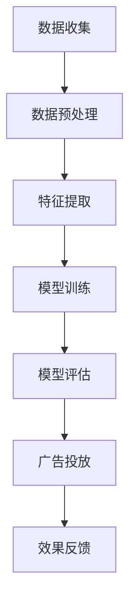
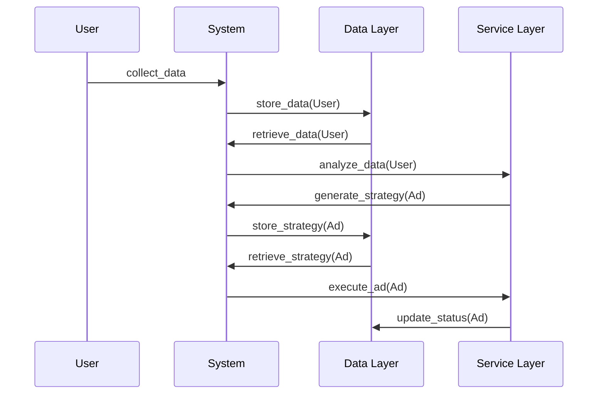
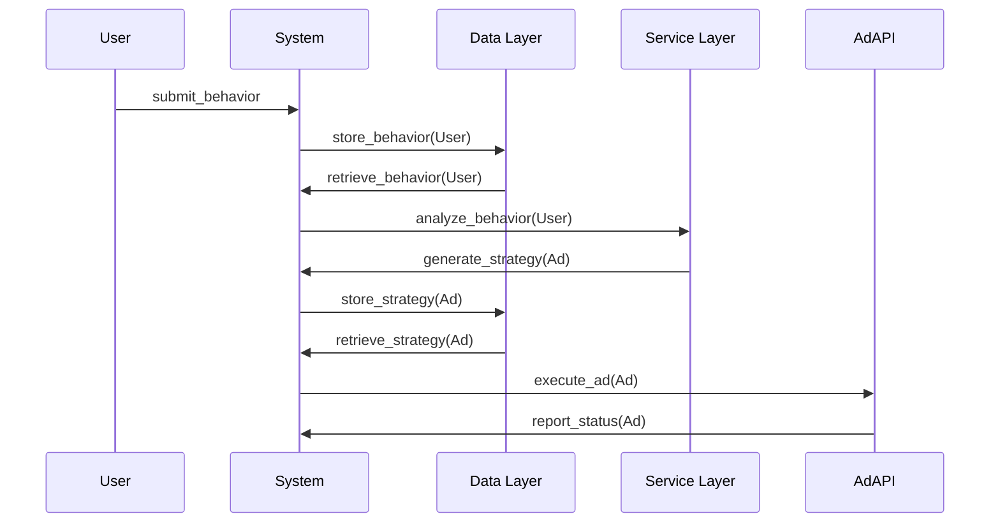

                 

### AI在广告投放中的应用：精准定位与效果优化

**关键词：** 广告投放、AI、精准定位、效果优化、算法、机器学习

**摘要：** 本文将深入探讨AI在广告投放中的应用，包括精准定位和效果优化。通过分析广告投放的现状、AI的优势及应用，我们将逐步讲解AI广告投放的核心概念、算法原理和系统架构设计，并以项目实战为例进行深入剖析，最后总结最佳实践和注意事项，为广告投放的AI应用提供实用的指导。

---

### 1. 背景介绍

#### 1.1 广告投放的现状及存在的问题

广告投放作为企业营销策略的重要组成部分，已经历了数十年的发展。然而，在互联网和大数据时代，广告投放面临着前所未有的挑战和问题。以下是一些常见的问题：

- **定位不准确**：传统的广告投放方法往往无法准确识别目标受众，导致广告浪费和效果不佳。
- **广告创意有限**：广告创意的更新和变化速度较慢，难以适应快速变化的市场需求。
- **效果评估困难**：广告效果难以精确量化，评估标准模糊，导致营销投入难以优化。

#### 1.2 AI在广告投放中的优势和应用

AI技术的快速发展为广告投放带来了新的机遇。以下是一些AI在广告投放中的优势和应用：

- **精准定位**：通过用户数据的深度分析，AI可以准确识别目标受众，实现广告的精准投放。
- **个性化广告**：基于用户画像和兴趣标签，AI可以为每个用户生成个性化的广告内容，提高广告的点击率和转化率。
- **实时优化**：AI可以实时监测广告效果，自动调整广告策略，实现广告效果的持续优化。
- **创意生成**：AI可以通过深度学习生成新颖、有吸引力的广告创意，提升广告效果。

#### 1.3 广告投放与AI的结合点与扩展方向

广告投放与AI的结合点主要体现在以下几个方面：

- **用户数据分析**：通过大数据技术收集和分析用户行为数据，为广告投放提供决策支持。
- **机器学习算法**：利用机器学习算法优化广告投放策略，提高广告投放的效果。
- **自然语言处理**：通过自然语言处理技术，自动生成广告文案和创意，提高广告质量和效率。

未来的扩展方向包括：

- **智能广告投放平台**：构建基于AI的智能广告投放平台，实现广告投放的全流程自动化。
- **跨渠道广告投放**：整合多种广告渠道，实现跨平台的广告投放，提高广告的覆盖率和效果。
- **社交网络广告投放**：利用社交网络数据，实现更加精准和高效的社交网络广告投放。

### 2. AI在广告投放中的核心概念与联系

#### 2.1 数据分析

**2.1.1 用户数据收集与分析**

用户数据的收集与分析是AI广告投放的基础。通过收集用户在网站、应用等平台上的行为数据，如浏览记录、点击行为、购买历史等，可以构建详细的用户画像。

**2.1.2 数据分析的基本概念和方法**

数据分析的基本概念包括数据类型、数据清洗、数据挖掘等。常用的数据分析方法包括统计分析、机器学习、深度学习等。

#### 2.2 用户画像

**2.2.1 用户画像的定义和作用**

用户画像是对用户特征的综合描述，包括用户的基本信息、行为特征、兴趣偏好等。用户画像是广告投放决策的重要依据。

**2.2.2 用户画像的构建方法**

用户画像的构建方法包括数据收集、数据整合、特征提取、模型训练等。

#### 2.3 机器学习算法

**2.3.1 机器学习算法的基本原理**

机器学习算法通过学习数据中的特征和规律，实现数据的分类、回归、聚类等任务。

**2.3.2 常用算法及其在广告投放中的应用**

常用的机器学习算法包括决策树、随机森林、支持向量机、神经网络等。这些算法在广告投放中的应用包括用户分类、广告投放策略优化、广告创意生成等。

### 3. AI广告投放算法原理

#### 3.1 算法流程图

以下是一个简单的AI广告投放算法流程图：



**3.1.1 数据收集与清洗**

数据收集包括用户行为数据、广告数据等。数据清洗包括数据去重、缺失值处理、异常值处理等。

**3.1.2 特征提取**

特征提取是将原始数据转换为可用于机器学习的特征向量。常用的特征提取方法包括词袋模型、TF-IDF等。

**3.1.3 模型训练与评估**

模型训练使用机器学习算法，如随机森林、神经网络等。模型评估使用交叉验证、AUC、准确率等指标。

#### 3.2 算法原理

**3.2.1 数学模型**

假设用户i对广告j的点击概率为P(i, j)，则可以使用逻辑回归模型进行预测：

$$
P(i, j) = \frac{1}{1 + e^{-(\beta_0 + \sum_{k=1}^{n} \beta_k x_{ik})}
$$

其中，$x_{ik}$是用户i的特征向量，$\beta_0$和$\beta_k$是模型参数。

**3.2.2 公式推导**

逻辑回归模型的损失函数为：

$$
L(\theta) = -\sum_{i=1}^{m} y_i \log(P(i, j)) - (1 - y_i) \log(1 - P(i, j))
$$

其中，$y_i$是用户i的实际点击情况。

**3.2.3 算法对比分析**

不同的机器学习算法在广告投放中的应用效果有所不同。例如，神经网络可以处理非线性关系，但计算复杂度高；随机森林可以处理大量特征，但无法解释模型。

#### 3.3 举例说明

**3.3.1 案例一：基于用户行为的广告投放**

假设我们收集了用户A在网站上的浏览记录，包括浏览商品、点击广告等行为。通过分析这些行为，我们可以构建用户A的画像，并根据画像进行广告投放。

**3.3.2 案例二：基于地理位置的广告投放**

假设我们收集了用户的地理位置数据，包括城市、区域等。通过分析这些数据，我们可以将用户分为不同的地理位置群体，并根据地理位置进行广告投放。

### 4. 系统分析与架构设计方案

#### 4.1 问题场景介绍

假设我们需要设计一个基于AI的广告投放系统，该系统需要支持用户数据的收集、分析和广告的投放。

#### 4.2 系统功能设计

以下是一个简单的系统功能设计，包括用户数据收集、广告投放策略优化、广告投放执行等。

```mermaid
classDiagram
User <<Class>> {
  id
  name
  behavior
}

Ad <<Class>> {
  id
  title
  content
}

System <<Class>> {
  collect_data(User)
  analyze_data(User)
  optimize_strategy(Ad)
  execute_ad(Ad)
}
```

#### 4.3 系统架构设计

以下是一个简单的系统架构设计，包括数据层、服务层和展示层。



#### 4.4 系统接口设计

以下是一个简单的系统接口设计，包括用户数据接口、广告投放策略接口和广告执行接口。

```mermaid
interface UserAPI {
  +collect_data()
  +analyze_data()
}

interface AdAPI {
  +optimize_strategy()
  +execute_ad()
}

class System {
  +UserAPI user_api
  +AdAPI ad_api
}
```

#### 4.5 系统交互

以下是一个简单的系统交互序列图，展示用户数据收集、广告投放策略生成和广告执行的过程。



### 5. 项目实战

#### 5.1 环境安装

为了进行广告投放系统的实战，我们需要安装以下软件和库：

- Python 3.8+
- TensorFlow 2.5+
- NumPy 1.19+
- Pandas 1.1+

安装命令如下：

```bash
pip install python==3.8 tensorflow==2.5 numpy==1.19 pandas==1.1
```

#### 5.2 系统核心实现

以下是广告投放系统的核心实现，包括用户数据收集、广告投放策略生成和广告执行。

```python
import tensorflow as tf
import numpy as np
import pandas as pd

# 用户数据收集
def collect_data(user_id):
    # 假设用户数据存储在CSV文件中
    data = pd.read_csv(f'user_{user_id}.csv')
    return data

# 数据预处理
def preprocess_data(data):
    # 填充缺失值、去除异常值等操作
    # ...
    return data

# 特征提取
def extract_features(data):
    # 基于用户行为数据提取特征
    # ...
    return features

# 模型训练
def train_model(features, labels):
    # 使用TensorFlow构建和训练模型
    model = tf.keras.Sequential([
        tf.keras.layers.Dense(64, activation='relu', input_shape=(features.shape[1],)),
        tf.keras.layers.Dense(32, activation='relu'),
        tf.keras.layers.Dense(1, activation='sigmoid')
    ])

    model.compile(optimizer='adam', loss='binary_crossentropy', metrics=['accuracy'])
    model.fit(features, labels, epochs=10, batch_size=32)
    return model

# 广告投放策略生成
def generate_strategy(model, ad_data):
    # 使用模型预测广告点击概率
    # ...
    return strategy

# 广告执行
def execute_ad(strategy):
    # 执行广告投放
    # ...
    pass
```

#### 5.3 代码应用解读与分析

以下是代码的解读与分析：

1. 用户数据收集：通过读取CSV文件收集用户数据。
2. 数据预处理：对用户数据进行清洗和预处理，如填充缺失值、去除异常值等。
3. 特征提取：基于用户行为数据提取特征，如浏览时间、浏览频次等。
4. 模型训练：使用TensorFlow构建和训练机器学习模型，如逻辑回归模型。
5. 广告投放策略生成：使用训练好的模型预测广告点击概率，生成广告投放策略。
6. 广告执行：根据广告投放策略执行广告投放。

#### 5.4 实际案例分析与讲解

以下是一个实际案例：

1. 收集用户A的数据：通过收集用户A在网站上的浏览记录，如浏览商品、点击广告等行为。
2. 数据预处理：对用户A的数据进行清洗和预处理，如去除重复记录、处理缺失值等。
3. 特征提取：根据用户A的行为数据提取特征，如浏览时间、浏览频次等。
4. 模型训练：使用提取的特征训练机器学习模型，如逻辑回归模型。
5. 广告投放策略生成：使用训练好的模型预测用户A对广告的点击概率，生成广告投放策略。
6. 广告执行：根据广告投放策略在网站上进行广告投放，如展示相关的商品广告。

#### 5.5 项目小结

通过本项目的实战，我们实现了用户数据收集、广告投放策略生成和广告执行的全流程。在实际应用中，我们需要根据业务需求和数据特点进行调整和优化，以提高广告投放的效果。同时，我们还需要关注模型训练的效率和效果，不断优化模型性能。

### 6. AI在广告投放中的最佳实践与案例分析

#### 6.1 最佳实践

1. **数据收集与清洗**：确保数据的准确性和完整性，对数据进行预处理和清洗，去除噪声和异常值。
2. **用户画像构建**：基于用户行为数据构建详细的用户画像，包括基本特征、行为特征和兴趣偏好等。
3. **模型选择与优化**：选择适合业务场景的机器学习算法，不断优化模型参数，提高模型性能。
4. **实时优化**：根据广告效果实时调整广告策略，实现广告效果的持续优化。
5. **A/B测试**：通过A/B测试比较不同广告策略的效果，选择最佳策略进行投放。

#### 6.2 案例分析

以下是一个实际案例：

**案例背景**：某电商企业在双十一期间进行广告投放，希望通过精准定位和效果优化提高广告投放效果。

**案例步骤**：

1. **数据收集与清洗**：收集用户在网站上的浏览记录、点击行为等数据，进行数据清洗和预处理。
2. **用户画像构建**：基于用户行为数据构建用户画像，包括用户的基本信息、行为特征和兴趣偏好等。
3. **模型训练与优化**：使用机器学习算法训练广告投放模型，不断优化模型参数，提高模型性能。
4. **广告投放策略生成**：根据用户画像和模型预测结果生成广告投放策略，包括广告内容、投放时间、投放渠道等。
5. **实时优化**：根据广告投放效果实时调整广告策略，如调整广告内容、投放时间和投放渠道等。
6. **A/B测试**：通过A/B测试比较不同广告策略的效果，选择最佳策略进行投放。

**案例结果**：通过精准定位和效果优化，该电商企业的广告投放效果显著提高，广告点击率和转化率均有所提升。

#### 6.3 经验总结

1. **数据质量是关键**：确保数据的准确性和完整性，对数据进行预处理和清洗，去除噪声和异常值。
2. **用户画像构建是基础**：基于用户行为数据构建详细的用户画像，为广告投放提供决策支持。
3. **模型选择与优化是关键**：选择适合业务场景的机器学习算法，不断优化模型参数，提高模型性能。
4. **实时优化是必要**：根据广告投放效果实时调整广告策略，实现广告效果的持续优化。
5. **A/B测试是保障**：通过A/B测试比较不同广告策略的效果，选择最佳策略进行投放。

### 7. 总结与展望

本文详细探讨了AI在广告投放中的应用，包括精准定位和效果优化。通过分析广告投放的现状、AI的优势和应用，以及AI广告投放的核心概念、算法原理和系统架构设计，我们深入了解了AI在广告投放中的重要作用。

在未来，随着AI技术的不断发展，广告投放将更加智能化、个性化。同时，我们也需要注意以下几个方面：

1. **数据隐私与保护**：在收集和使用用户数据时，要严格遵守数据隐私保护法规，确保用户数据的保密性和安全性。
2. **算法透明性与解释性**：提高算法的透明性和解释性，让广告投放过程更加可解释和可信任。
3. **跨渠道广告投放**：整合多种广告渠道，实现跨平台的广告投放，提高广告的覆盖率和效果。
4. **持续优化与创新**：不断优化广告投放策略，引入新的技术和方法，提高广告投放效果。

为了进一步了解AI在广告投放中的应用，读者可以参考以下书籍和论文：

1. **书籍**：
   - 《机器学习实战》：提供丰富的机器学习案例和实践经验。
   - 《深度学习》：全面介绍深度学习理论和应用。
   - 《广告学概论》：了解广告投放的基本概念和方法。

2. **论文**：
   - “Recommender Systems Handbook”：介绍推荐系统在广告投放中的应用。
   - “User Modeling and User-Adapted Interaction”：探讨用户建模和自适应交互在广告投放中的应用。

作者：AI天才研究院/AI Genius Institute & 禅与计算机程序设计艺术 /Zen And The Art of Computer Programming

