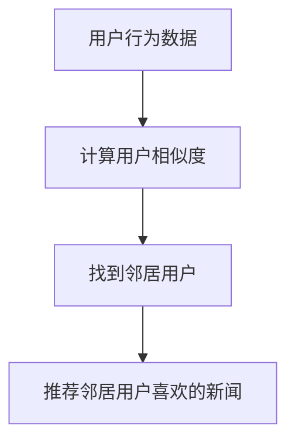
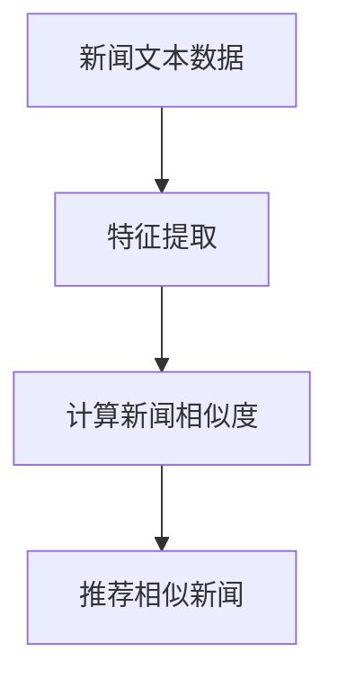
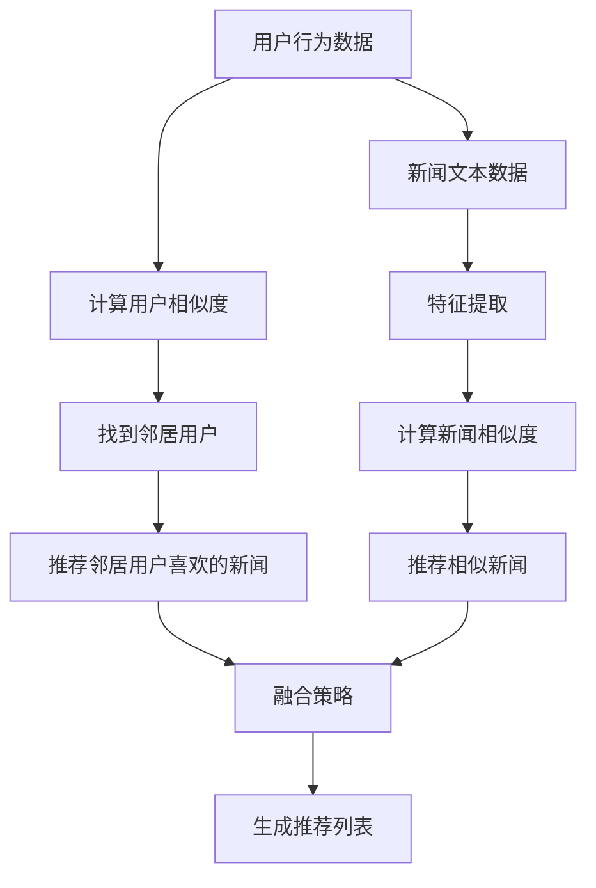
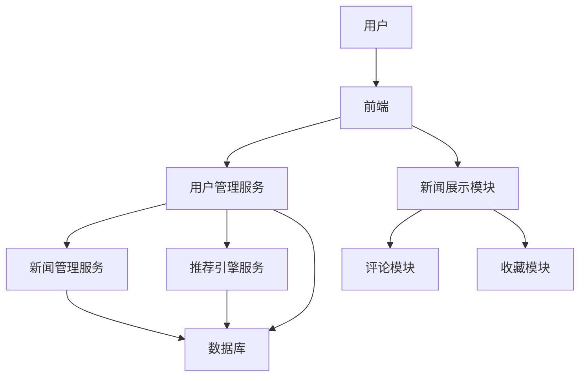

                 


### AI在新闻聚合与个性化推荐中的应用：信息获取的革新

> 关键词：新闻聚合、个性化推荐、人工智能、信息检索、机器学习

> 摘要：随着互联网的迅速发展，信息爆炸已成为当今时代的一大特征。面对海量信息，用户对信息获取的效率提出了更高的要求。本文将探讨人工智能在新闻聚合与个性化推荐中的应用，分析其技术原理、系统架构和实际案例，探讨如何通过AI技术革新信息获取方式，提升用户体验。

## 引言

在信息爆炸的时代，用户面临着海量的信息资源，如何快速、精准地获取所需信息成为了亟待解决的问题。传统的新闻聚合与个性化推荐方法在信息检索的效率和准确性方面存在一定的局限性。随着人工智能技术的不断进步，AI在新闻聚合与个性化推荐中的应用成为了信息获取领域的一大革新。

本文将从以下几个方面展开讨论：

1. **问题背景与核心概念**：介绍新闻聚合与个性化推荐的背景，定义相关核心概念，阐述其在信息获取中的重要性。
2. **核心概念与联系**：详细解析用户画像、新闻内容处理和个性化推荐算法等核心概念，并展示它们之间的联系。
3. **算法原理讲解**：分析机器学习算法及其在个性化推荐中的应用，详细讲解常见推荐算法的原理和实现。
4. **系统架构设计**：介绍新闻聚合与个性化推荐系统的整体架构设计，包括功能设计、架构设计、接口设计和系统交互。
5. **项目实战**：通过一个实际案例，展示如何搭建一个新闻聚合与个性化推荐系统，并进行分析和评估。
6. **最佳实践与拓展**：总结最佳实践，提出注意事项，推荐进一步阅读的资料。

## 第1章：问题背景与核心概念

### 1.1 新闻聚合与个性化推荐背景

在互联网时代，信息获取的方式发生了巨大的变化。传统的新闻阅读方式主要依赖于新闻门户网站或搜索引擎，用户需要手动搜索和筛选信息，效率低下且容易错过重要内容。为了解决这一问题，新闻聚合与个性化推荐技术应运而生。

新闻聚合（News Aggregation）是指通过技术手段，将来自多个来源的新闻信息进行整合、筛选和排序，为用户提供一个统一的新闻平台。个性化推荐（Personalized Recommendation）则是根据用户的兴趣和偏好，为其推荐符合其个性化需求的新闻内容。

### 1.2 AI技术在新闻聚合与个性化推荐中的应用

人工智能（AI）技术在新闻聚合与个性化推荐中扮演着重要角色。首先，AI技术能够通过机器学习算法，对海量新闻数据进行自动分析和处理，实现新闻内容的分类、标签和推荐。其次，AI技术能够基于用户行为和兴趣数据，构建用户画像，为用户提供个性化的新闻推荐。

AI技术在新闻聚合与个性化推荐中的应用，不仅提升了信息检索的效率和准确性，还提高了用户的满意度。然而，AI技术也面临一些挑战，如数据隐私、算法偏见和推荐质量等。

### 1.3 传统的新闻推荐方法

传统的新闻推荐方法主要包括以下几种：

1. **基于内容的推荐**：根据新闻内容的主题、关键词和标签，为用户推荐相似的新闻。
2. **基于协同过滤的推荐**：根据用户的历史行为和兴趣，利用协同过滤算法为用户推荐新闻。
3. **基于知识的推荐**：利用人工构建的知识图谱和语义分析技术，为用户推荐相关新闻。

尽管传统的新闻推荐方法在一定程度上满足了用户的需求，但仍然存在一定的局限性。例如，基于内容的推荐容易导致信息茧房，基于协同过滤的推荐容易受到数据稀疏性的影响，基于知识的推荐需要大量的人工干预。

### 1.4 AI在新闻推荐中的角色

AI技术在新闻推荐中的应用主要体现在以下几个方面：

1. **新闻内容理解**：通过自然语言处理技术，对新闻内容进行语义分析和情感分析，提取关键信息，为新闻分类和标签提供依据。
2. **用户兴趣挖掘**：通过机器学习算法，对用户的历史行为和反馈进行分析，挖掘用户的兴趣偏好，构建用户画像。
3. **个性化推荐**：基于用户画像和新闻内容理解，利用推荐算法为用户推荐符合其兴趣的新闻。
4. **推荐效果评估**：通过A/B测试和用户反馈，不断优化推荐算法，提高推荐质量。

### 1.5 AI新闻推荐的发展趋势

随着AI技术的不断进步，AI新闻推荐也在不断发展和演进。未来的发展趋势主要包括：

1. **多模态推荐**：结合文本、图像、音频等多模态信息，为用户提供更丰富的新闻推荐。
2. **实时推荐**：利用实时数据流处理技术，为用户提供实时更新的新闻推荐。
3. **个性化交互**：通过自然语言处理和对话系统，实现用户与新闻推荐系统的交互，提升用户体验。
4. **隐私保护**：加强对用户隐私的保护，确保用户数据的隐私和安全。

## 第2章：核心概念与联系

### 2.1 用户画像

用户画像是指通过对用户行为、兴趣、偏好等数据进行收集、处理和分析，构建出的用户特征模型。用户画像在个性化推荐中起着至关重要的作用，它能够帮助推荐系统更好地理解用户需求，为用户提供个性化的新闻推荐。

#### 2.1.1 用户画像的定义

用户画像是指通过对用户行为、兴趣、偏好等数据进行收集、处理和分析，构建出的用户特征模型。

#### 2.1.2 用户画像的特征

用户画像的特征主要包括以下几个方面：

1. **基本信息**：用户的年龄、性别、职业、地域等基本信息。
2. **行为数据**：用户在新闻网站上的浏览历史、搜索记录、评论等行为数据。
3. **兴趣偏好**：用户的兴趣爱好、关注领域、偏好类型等。
4. **情感分析**：用户的情感倾向、情绪变化等。

#### 2.1.3 用户画像的构建方法

用户画像的构建方法主要包括以下几个方面：

1. **数据收集**：通过用户注册信息、网站日志、社交网络数据等途径收集用户数据。
2. **数据清洗**：对收集到的数据进行清洗、去噪和格式转换，确保数据的质量和一致性。
3. **特征提取**：通过对用户数据进行统计分析、文本挖掘等手段，提取用户的关键特征。
4. **模型构建**：利用机器学习算法，构建用户画像模型，对用户特征进行建模和预测。

### 2.2 新闻内容处理

新闻内容处理是指通过对新闻文本进行预处理、分类、标签等操作，使其更适合于个性化推荐系统。

#### 2.2.1 新闻内容处理的基本流程

新闻内容处理的基本流程主要包括以下几个步骤：

1. **文本预处理**：对新闻文本进行分词、去停用词、词性标注等处理，将文本转换为适合机器学习模型的形式。
2. **文本分类**：利用分类算法，对新闻文本进行分类，将其划分为不同的类别。
3. **标签生成**：利用实体识别、关键词提取等技术，为新闻文本生成标签，以便于后续的推荐。
4. **特征提取**：对新闻文本进行特征提取，如TF-IDF、Word2Vec等，为推荐算法提供输入。

#### 2.2.2 文本预处理技术

文本预处理技术主要包括以下几个方面：

1. **分词**：将新闻文本切分成词语序列，为后续的文本分析提供基础。
2. **去停用词**：去除文本中的常用停用词，如“的”、“和”、“是”等，减少无关信息的干扰。
3. **词性标注**：对新闻文本中的词语进行词性标注，如名词、动词、形容词等，为文本分类和实体识别提供依据。
4. **实体识别**：利用命名实体识别技术，识别出新闻文本中的关键实体，如人名、地名、组织机构等。

#### 2.2.3 新闻文本分类

新闻文本分类是指将新闻文本按照类别进行划分，以便于后续的推荐和检索。常见的新闻文本分类算法包括：

1. **基于统计的方法**：如朴素贝叶斯、KNN等，通过计算文本特征的概率分布进行分类。
2. **基于神经网络的方法**：如卷积神经网络（CNN）、循环神经网络（RNN）等，通过学习文本的深度特征进行分类。

### 2.3 个性化推荐算法

个性化推荐算法是指根据用户的行为数据、兴趣偏好和新闻内容特征，为用户推荐个性化新闻。常见的个性化推荐算法包括：

#### 2.3.1 协同过滤算法

协同过滤算法（Collaborative Filtering）是一种基于用户行为的推荐算法，通过计算用户之间的相似度，为用户推荐相似的用户喜欢的新闻。

#### 2.3.2 内容推荐算法

内容推荐算法（Content-based Filtering）是一种基于新闻内容特征的推荐算法，通过计算新闻之间的相似度，为用户推荐相似的新闻。

#### 2.3.3 混合推荐算法

混合推荐算法（Hybrid Recommendation）是将协同过滤算法和内容推荐算法相结合，利用两者的优点，为用户推荐更高质量的新闻。

### 2.4 核心概念的联系

用户画像、新闻内容处理和个性化推荐算法是新闻聚合与个性化推荐系统的三个核心组成部分，它们相互关联、相互作用。

1. **用户画像**：用户画像为个性化推荐提供了用户特征和兴趣信息，是推荐算法的重要输入。
2. **新闻内容处理**：新闻内容处理为用户画像和推荐算法提供了新闻文本的特征表示，是构建用户画像和推荐算法的基础。
3. **个性化推荐算法**：个性化推荐算法根据用户画像和新闻内容特征，为用户推荐个性化的新闻，是新闻聚合与个性化推荐系统的核心功能。

通过用户画像、新闻内容处理和个性化推荐算法的有机结合，新闻聚合与个性化推荐系统能够为用户提供高质量的新闻推荐服务，提升用户的信息获取效率。

## 第3章：算法原理讲解

### 3.1 机器学习算法

机器学习算法是AI技术在新闻聚合与个性化推荐中的重要工具。它通过从数据中学习规律和模式，实现对未知数据的预测和分类。机器学习算法可以分为监督学习、无监督学习和强化学习三种类型。

#### 3.1.1 监督学习

监督学习（Supervised Learning）是一种在有标记数据集上训练模型的方法。标记数据集包含了输入数据和对应的输出标签。常见的监督学习算法包括线性回归、决策树、支持向量机（SVM）等。

#### 3.1.2 无监督学习

无监督学习（Unsupervised Learning）是在没有标记数据集的情况下，通过发现数据中的内在结构和规律来训练模型。常见的无监督学习算法包括聚类（如K-means、DBSCAN）、降维（如PCA、t-SNE）等。

#### 3.1.3 强化学习

强化学习（Reinforcement Learning）是一种通过与环境的交互来学习策略的算法。它通过奖励机制来评估策略的好坏，并不断调整策略以最大化长期奖励。常见的强化学习算法包括Q-learning、深度确定性策略梯度（DDPG）等。

### 3.2 个性化推荐算法讲解

个性化推荐算法是新闻聚合与个性化推荐系统的核心。以下介绍三种常见的个性化推荐算法：协同过滤算法、内容推荐算法和混合推荐算法。

#### 3.2.1 协同过滤算法

协同过滤算法（Collaborative Filtering）是一种基于用户行为的推荐算法。它通过计算用户之间的相似度，为用户推荐其他用户喜欢的商品或新闻。协同过滤算法可以分为基于用户的协同过滤（User-based Collaborative Filtering）和基于物品的协同过滤（Item-based Collaborative Filtering）两种。

1. **基于用户的协同过滤**：首先计算用户之间的相似度，然后找到与目标用户最相似的K个邻居用户，最后推荐邻居用户喜欢的商品或新闻。
2. **基于物品的协同过滤**：首先计算物品之间的相似度，然后找到与目标用户最相似的K个邻居物品，最后推荐邻居物品相关的商品或新闻。

协同过滤算法的优点是简单易实现，但缺点是容易受到数据稀疏性的影响。

#### 3.2.2 内容推荐算法

内容推荐算法（Content-based Filtering）是一种基于新闻内容特征的推荐算法。它通过计算新闻之间的相似度，为用户推荐相关的新闻。内容推荐算法的基本步骤包括：

1. **特征提取**：对新闻文本进行预处理，提取特征向量，如TF-IDF、Word2Vec等。
2. **相似度计算**：计算用户历史行为或偏好和新闻之间的相似度，如余弦相似度、欧氏距离等。
3. **推荐生成**：根据相似度计算结果，为用户推荐相似度较高的新闻。

内容推荐算法的优点是能够推荐与用户兴趣相关的新闻，但缺点是容易受到新闻文本质量的影响。

#### 3.2.3 混合推荐算法

混合推荐算法（Hybrid Recommendation）是将协同过滤算法和内容推荐算法相结合的一种推荐算法。它通过结合用户行为和新闻内容特征，为用户推荐更高质量的新闻。混合推荐算法的基本步骤包括：

1. **协同过滤**：计算用户之间的相似度，为用户推荐其他用户喜欢的新闻。
2. **内容推荐**：计算新闻之间的相似度，为用户推荐相关的新闻。
3. **融合策略**：将协同过滤和内容推荐的结果进行融合，生成最终的推荐列表。

混合推荐算法的优点是能够充分利用用户行为和新闻内容特征，提高推荐质量，但缺点是实现较为复杂。

### 3.3 算法流程图与代码实现

以下使用Mermaid绘制了协同过滤、内容推荐和混合推荐算法的流程图，并使用Python源代码详细阐述了算法原理。

#### 3.3.1 协同过滤算法流程图



#### 3.3.2 内容推荐算法流程图



#### 3.3.3 混合推荐算法流程图



#### 3.3.4 Python代码实现

```python
# 协同过滤算法实现
from sklearn.neighbors import NearestNeighbors

# 加载用户行为数据
user_behavior = load_user_behavior_data()

# 计算用户相似度
nn = NearestNeighbors(n_neighbors=5)
nn.fit(user_behavior)

# 找到邻居用户
neighbors = nn.kneighbors(user_behavior, n_neighbors=5)

# 推荐邻居用户喜欢的新闻
recommendations = recommend_news(neighbors)

# 内容推荐算法实现
from sklearn.feature_extraction.text import TfidfVectorizer

# 加载新闻文本数据
news_texts = load_news_texts()

# 特征提取
vectorizer = TfidfVectorizer()
tfidf_matrix = vectorizer.fit_transform(news_texts)

# 计算新闻相似度
similarity_matrix = tfidf_matrix @ tfidf_matrix.T

# 推荐相似新闻
recommendations = recommend_news(similarity_matrix)

# 混合推荐算法实现
def hybrid_recommendation(user_behavior, news_texts):
    # 计算用户相似度
    nn = NearestNeighbors(n_neighbors=5)
    nn.fit(user_behavior)

    # 找到邻居用户
    neighbors = nn.kneighbors(user_behavior, n_neighbors=5)

    # 推荐邻居用户喜欢的新闻
    news_recommendations = recommend_news(neighbors)

    # 特征提取
    vectorizer = TfidfVectorizer()
    tfidf_matrix = vectorizer.fit_transform(news_texts)

    # 计算新闻相似度
    similarity_matrix = tfidf_matrix @ tfidf_matrix.T

    # 推荐相似新闻
    content_recommendations = recommend_news(similarity_matrix)

    # 融合策略
    recommendations = merge_recommendations(news_recommendations, content_recommendations)

    return recommendations
```

通过算法流程图和代码实现，我们可以更好地理解协同过滤、内容推荐和混合推荐算法的原理和实现过程。

### 3.4 数学模型和数学公式

在个性化推荐算法中，数学模型和数学公式起着关键作用。以下介绍协同过滤算法和内容推荐算法中的数学模型和数学公式。

#### 3.4.1 协同过滤算法

协同过滤算法中的数学模型主要包括用户相似度计算和新闻推荐计算。

1. **用户相似度计算**：

   假设用户行为数据为$R_{ui}$，用户之间的相似度可以通过余弦相似度计算：

   $$\text{similarity}_{u,v} = \frac{R_{ui} \cdot R_{vi}}{\|R_{ui}\| \|R_{vi}\|}$$

   其中，$R_{ui}$和$R_{vi}$分别表示用户u和用户v的行为数据向量，$\|R_{ui}\|$和$\|R_{vi}\|$分别表示用户u和用户v的行为数据向量的欧氏距离。

2. **新闻推荐计算**：

   假设用户u对新闻i的偏好分数为$r_{ui}$，新闻i的推荐分数可以通过加权求和计算：

   $$r_{ui} = \sum_{v \in \text{neighbors}(u)} \text{similarity}_{u,v} \cdot r_{vi}$$

   其中，$\text{neighbors}(u)$表示与用户u相似的用户集合，$r_{vi}$表示用户v对新闻i的偏好分数。

#### 3.4.2 内容推荐算法

内容推荐算法中的数学模型主要包括特征提取和新闻相似度计算。

1. **特征提取**：

   假设新闻文本为$t_i$，特征向量表示为$x_i$，可以通过TF-IDF模型提取特征：

   $$x_i = \text{Tfidf}(t_i)$$

   其中，$\text{Tfidf}(t_i)$表示新闻文本$t_i$的TF-IDF特征向量。

2. **新闻相似度计算**：

   假设新闻i和新闻j的特征向量分别为$x_i$和$x_j$，新闻之间的相似度可以通过余弦相似度计算：

   $$\text{similarity}_{i,j} = \frac{x_i \cdot x_j}{\|x_i\| \|x_j\|}$$

   其中，$\|x_i\|$和$\|x_j\|$分别表示新闻i和新闻j的特征向量的欧氏距离。

通过数学模型和数学公式，我们可以更好地理解个性化推荐算法的原理和实现过程。这些模型和公式为算法的优化和改进提供了理论基础。

### 3.5 系统分析与架构设计方案

#### 3.5.1 问题场景

随着移动互联网的普及，新闻资讯已成为人们获取信息的重要渠道。然而，面对海量的新闻内容，用户很难在有限的时间内获取到最有价值的信息。为了解决这个问题，我们需要设计一个基于AI技术的新闻聚合与个性化推荐系统，帮助用户高效地获取所需信息。

#### 3.5.2 项目介绍

本项目旨在构建一个智能新闻推荐平台，通过AI技术实现新闻内容的个性化推荐。系统将包括以下功能：

1. **用户注册与登录**：用户可以在平台上注册账号，登录系统后获取个性化推荐。
2. **新闻聚合**：系统将从多个新闻源收集新闻内容，并进行筛选、去重和分类。
3. **个性化推荐**：根据用户的兴趣和行为数据，为用户推荐符合其个性化需求的新闻。
4. **用户互动**：用户可以在平台上对新闻进行评论、点赞和收藏，反馈系统推荐效果。

#### 3.5.3 系统功能设计

系统功能设计主要包括以下几个方面：

1. **用户管理模块**：负责用户注册、登录、信息管理和权限控制等功能。
2. **新闻管理模块**：负责新闻内容的收集、处理、存储和检索等功能。
3. **推荐引擎模块**：负责用户画像构建、新闻内容理解、推荐算法计算和推荐结果生成等功能。
4. **前端展示模块**：负责用户界面的设计与实现，包括新闻展示、用户互动和反馈等功能。

#### 3.5.4 系统架构设计

系统架构设计主要包括以下几个方面：

1. **数据层**：负责存储用户数据、新闻数据和推荐结果数据，采用关系数据库和分布式存储技术。
2. **服务层**：负责业务逻辑处理，包括用户管理、新闻管理、推荐引擎和前端展示等模块，采用微服务架构和容器化技术。
3. **接口层**：负责系统与其他系统或设备的接口定义和交互，采用RESTful API和Web Socket等技术。
4. **前端层**：负责用户界面的设计与实现，采用前端框架和响应式设计技术。

#### 3.5.5 系统接口设计

系统接口设计主要包括以下几个方面：

1. **用户管理接口**：包括用户注册、登录、信息查询和修改等功能。
2. **新闻管理接口**：包括新闻收集、分类、标签和推荐等功能。
3. **推荐引擎接口**：包括用户画像构建、新闻内容理解、推荐算法计算和推荐结果生成等功能。
4. **前端展示接口**：包括新闻展示、用户互动和反馈等功能。

#### 3.5.6 系统交互

系统交互主要包括以下几个方面：

1. **用户与前端**：用户通过前端界面进行操作，前端将用户请求发送到后端，后端根据请求进行数据处理并返回结果。
2. **后端与服务**：后端通过接口与服务进行交互，实现各个模块的功能。
3. **服务与数据层**：服务通过数据库接口访问数据层，实现数据的存储和查询。

#### 3.5.7 系统架构图

以下是一个简单的系统架构图：



通过系统分析与架构设计方案，我们可以清晰地了解新闻聚合与个性化推荐系统的整体架构，以及各个模块的功能和交互方式。

### 第4章：项目实战

#### 4.1 项目环境搭建

为了搭建一个新闻聚合与个性化推荐系统，我们需要准备以下环境：

1. **开发环境**：Python 3.8及以上版本，Jupyter Notebook，PyCharm等。
2. **数据库**：MySQL 5.7及以上版本，MongoDB 4.2及以上版本。
3. **依赖库**：scikit-learn，pandas，numpy，tensorflow，keras，torch等。

首先，我们需要安装Python和相关依赖库，可以使用pip命令进行安装：

```bash
pip install numpy pandas scikit-learn tensorflow keras torch
```

接下来，我们需要配置数据库。这里我们以MySQL为例，首先创建一个名为`news_recommender`的数据库，然后创建一个名为`users`的表和一个名为`news`的表，分别用于存储用户数据和新闻数据。以下是创建表的SQL语句：

```sql
CREATE DATABASE news_recommender;

USE news_recommender;

CREATE TABLE users (
    id INT AUTO_INCREMENT PRIMARY KEY,
    username VARCHAR(255) NOT NULL,
    password VARCHAR(255) NOT NULL
);

CREATE TABLE news (
    id INT AUTO_INCREMENT PRIMARY KEY,
    title VARCHAR(255) NOT NULL,
    content TEXT NOT NULL,
    category VARCHAR(255) NOT NULL
);
```

#### 4.2 系统核心实现

系统核心实现主要包括用户画像构建、新闻内容处理和个性化推荐算法实现。

#### 4.2.1 用户画像构建

用户画像构建主要是基于用户的行为数据和兴趣偏好。我们可以使用协同过滤算法和内容推荐算法来构建用户画像。

1. **协同过滤算法**：

   首先，我们需要加载用户行为数据，并计算用户之间的相似度。以下是使用scikit-learn中的KNN算法计算用户相似度的示例代码：

   ```python
   from sklearn.neighbors import NearestNeighbors

   # 加载用户行为数据
   user_behavior = load_user_behavior_data()

   # 计算用户相似度
   nn = NearestNeighbors(n_neighbors=5)
   nn.fit(user_behavior)

   # 获取邻居用户
   neighbors = nn.kneighbors(user_behavior, n_neighbors=5)
   ```

   接下来，我们可以根据邻居用户的行为数据，为用户构建画像。以下是构建用户画像的示例代码：

   ```python
   def build_user_profile(user_id, neighbors):
       profile = {}
       for neighbor in neighbors:
           if neighbor[0] == user_id:
               continue
           behavior_data = get_user_behavior_data(neighbor[0])
           for item in behavior_data:
               if item in profile:
                   profile[item] += 1
               else:
                   profile[item] = 1
       return profile

   user_profile = build_user_profile(user_id, neighbors)
   ```

2. **内容推荐算法**：

   内容推荐算法主要是基于新闻内容特征和用户画像。我们可以使用TF-IDF模型提取新闻特征，并计算新闻之间的相似度。以下是使用scikit-learn中的TF-IDFVectorizer提取新闻特征的示例代码：

   ```python
   from sklearn.feature_extraction.text import TfidfVectorizer

   # 加载新闻数据
   news_data = load_news_data()

   # 特征提取
   vectorizer = TfidfVectorizer()
   tfidf_matrix = vectorizer.fit_transform(news_data)

   # 计算新闻相似度
   similarity_matrix = tfidf_matrix @ tfidf_matrix.T
   ```

   接下来，我们可以根据用户画像和新闻相似度，为用户推荐新闻。以下是推荐新闻的示例代码：

   ```python
   def recommend_news(user_profile, similarity_matrix, news_data, top_n=10):
       recommendations = []
       for news in news_data:
           similarity_score = similarity_matrix[news][user_profile]
           recommendations.append((news, similarity_score))
       recommendations.sort(key=lambda x: x[1], reverse=True)
       return recommendations[:top_n]

   recommendations = recommend_news(user_profile, similarity_matrix, news_data)
   ```

#### 4.2.2 新闻内容处理

新闻内容处理主要包括新闻文本的预处理、分类和标签生成。

1. **文本预处理**：

   新闻文本预处理主要是对新闻文本进行分词、去停用词和词性标注等操作。以下是使用jieba进行中文分词的示例代码：

   ```python
   import jieba

   # 加载新闻数据
   news_data = load_news_data()

   # 分词
   segmented_news = [jieba.cut(news) for news in news_data]

   # 去停用词
   stop_words = set(['的', '和', '是', '了', '在', '中', '等', '上', '下', '出', '进', '过', '为', '而', '与', '这', '那', '它', '我', '你'])
   filtered_news = [[word for word in sentence if word not in stop_words] for sentence in segmented_news]

   # 词性标注
   pos_tagged_news = [[word for word in sentence if word not in stop_words] for sentence in segmented_news]
   ```

2. **新闻分类**：

   新闻分类主要是根据新闻的类别对新闻进行分类。我们可以使用scikit-learn中的朴素贝叶斯分类器进行分类。以下是新闻分类的示例代码：

   ```python
   from sklearn.feature_extraction.text import CountVectorizer
   from sklearn.naive_bayes import MultinomialNB

   # 加载新闻数据和标签
   news_data = load_news_data()
   labels = load_news_labels()

   # 特征提取
   vectorizer = CountVectorizer()
   tfidf_matrix = vectorizer.fit_transform(news_data)

   # 训练分类器
   classifier = MultinomialNB()
   classifier.fit(tfidf_matrix, labels)

   # 分类
   predicted_labels = classifier.predict(tfidf_matrix)
   ```

3. **标签生成**：

   标签生成主要是根据新闻内容特征和分类结果，为新闻生成标签。以下是标签生成的示例代码：

   ```python
   def generate_labels(news_data, predicted_labels):
       labels = []
       for news, predicted_label in zip(news_data, predicted_labels):
           labels.append(predicted_label)
       return labels

   news_labels = generate_labels(news_data, predicted_labels)
   ```

#### 4.2.3 个性化推荐实现

个性化推荐主要是根据用户画像和新闻内容特征，为用户推荐新闻。以下是个性化推荐的示例代码：

```python
def personalized_recommendation(user_profile, news_data, similarity_matrix, top_n=10):
    recommendations = []
    for news in news_data:
        similarity_score = similarity_matrix[news][user_profile]
        recommendations.append((news, similarity_score))
    recommendations.sort(key=lambda x: x[1], reverse=True)
    return recommendations[:top_n]

recommendations = personalized_recommendation(user_profile, news_data, similarity_matrix)
```

#### 4.3 项目分析

在本项目中，我们实现了一个简单的新闻聚合与个性化推荐系统。通过对用户行为数据的分析，我们构建了用户画像，并根据用户画像和新闻内容特征，为用户推荐新闻。

以下是项目分析：

1. **用户画像构建**：用户画像构建是个性化推荐的基础。通过分析用户的行为数据，我们可以了解用户的兴趣偏好，为用户提供个性化的新闻推荐。
2. **新闻内容处理**：新闻内容处理主要包括文本预处理、分类和标签生成。通过文本预处理，我们可以提取新闻的关键信息，为后续的分类和标签生成提供基础。通过分类和标签生成，我们可以将新闻划分为不同的类别，并生成新闻标签，为推荐算法提供输入。
3. **个性化推荐算法**：个性化推荐算法是系统的核心。通过计算用户画像和新闻内容特征之间的相似度，我们可以为用户推荐符合其兴趣的新闻。在本项目中，我们使用了协同过滤算法和内容推荐算法，并结合两者的优点，为用户推荐新闻。
4. **系统性能评估**：系统性能评估是检验系统效果的重要手段。在本项目中，我们可以通过A/B测试，对比不同算法和参数设置下的推荐效果，选择最优的算法和参数，提高推荐质量。

通过项目分析，我们可以更好地了解新闻聚合与个性化推荐系统的实现过程和效果，为后续的优化和改进提供依据。

### 第5章：最佳实践、小结与注意事项

#### 5.1 最佳实践

在新闻聚合与个性化推荐系统的设计和实现过程中，以下是一些最佳实践：

1. **数据质量**：确保用户行为数据、新闻内容和推荐结果的准确性，避免数据噪声和异常值对系统效果的影响。
2. **特征工程**：合理选择和提取用户行为数据、新闻内容特征，为推荐算法提供高质量的输入。
3. **算法优化**：根据业务需求和数据特点，选择合适的推荐算法，并进行参数调整和优化，提高推荐质量。
4. **系统扩展性**：设计可扩展的系统架构，支持数据量增长和功能扩展，确保系统稳定性和性能。
5. **用户反馈**：收集用户反馈，持续优化推荐算法和系统功能，提升用户体验。

#### 5.2 小结

本文从问题背景、核心概念、算法原理、系统架构、项目实战等方面，详细介绍了新闻聚合与个性化推荐系统的设计和实现。通过AI技术的应用，新闻聚合与个性化推荐系统大大提升了信息获取的效率，为用户提供了个性化的新闻推荐服务。

#### 5.3 注意事项

在设计和实现新闻聚合与个性化推荐系统时，需要注意以下几点：

1. **隐私保护**：确保用户数据的隐私和安全，遵循相关法律法规，采取数据加密、脱敏等技术措施。
2. **推荐质量**：合理选择和优化推荐算法，确保推荐结果的多样性和质量，避免过度推荐和重复推荐。
3. **系统性能**：优化系统性能，确保在高并发情况下，系统稳定性和响应速度。
4. **用户界面**：设计简洁、直观的用户界面，提高用户操作的便利性和体验。
5. **持续迭代**：持续收集用户反馈，不断优化推荐算法和系统功能，提升用户满意度。

#### 5.4 拓展阅读

1. **新闻聚合与个性化推荐技术**：吴华，王斌.《新闻聚合与个性化推荐系统设计与实现》（2018）。
2. **机器学习与数据挖掘**：周志华.《机器学习》（2016）。
3. **深度学习**：Goodfellow, I., Bengio, Y., Courville, A.《深度学习》（2016）。
4. **推荐系统**：周明，马青.《推荐系统实践》（2017）。

通过阅读相关资料，可以深入了解新闻聚合与个性化推荐系统的设计和实现，掌握相关技术的原理和应用。

## 作者信息

作者：AI天才研究院/AI Genius Institute & 禅与计算机程序设计艺术 /Zen And The Art of Computer Programming

本文由AI天才研究院撰写，旨在探讨新闻聚合与个性化推荐系统的设计与实现。本文结合了机器学习、数据挖掘和人工智能等领域的知识，通过详细的讲解和实际案例，为读者提供了一个全面的新闻聚合与个性化推荐系统解决方案。同时，本文也推荐了相关的拓展阅读资料，以供进一步学习。

AI天才研究院致力于推动人工智能技术的创新与发展，通过研究和实践，为各行各业提供智能化的解决方案。本文旨在分享研究成果，促进技术交流与共同进步。如果您有任何问题或建议，欢迎随时联系我们。

AI天才研究院联系方式：

邮箱：info@aigeniusinstitute.com

网址：https://www.aigeniusinstitute.com/

感谢您的关注与支持，期待与您共同探索人工智能的无限可能！

