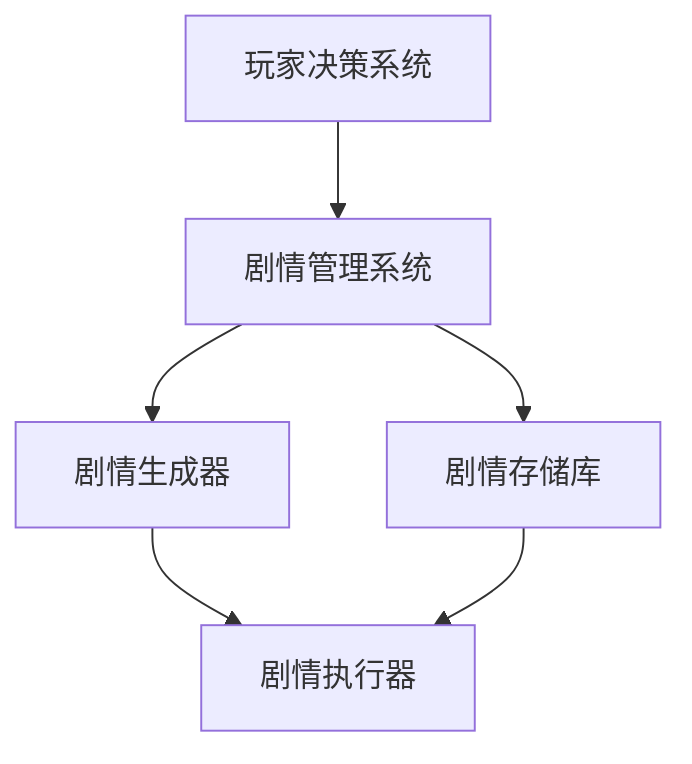

                 

# AI在游戏开发中的角色：创造智能NPC与动态剧情

> 关键词：人工智能，游戏开发，智能NPC，动态剧情，算法原理，项目实战

> 摘要：本文深入探讨人工智能在游戏开发中的应用，特别是如何通过AI技术创建智能非玩家角色（NPC）和实现动态剧情。文章结构紧凑，逻辑清晰，涵盖AI在游戏开发中的应用背景、核心概念、智能NPC设计、动态剧情实现、项目实践等内容。

## 引言

### AI与游戏开发的结合

随着人工智能技术的飞速发展，游戏开发领域也迎来了新的机遇。AI不仅改变了游戏设计的方式，还显著提升了用户体验。在游戏开发中，AI的应用主要体现在两个方向：一是用于生成和优化游戏内容，二是用于模拟和增强非玩家角色（NPC）的行为。智能NPC和动态剧情的创造是这两个方向的重要成果。

### 智能NPC的意义

智能NPC是游戏世界中除了玩家角色以外的其他角色，它们的行为、反应和交互能够影响玩家的游戏体验。传统的NPC通常具有固定的行为模式，而智能NPC则通过AI算法实现自适应行为，使游戏世界更加真实和动态。智能NPC能够根据玩家的行为和环境变化做出智能反应，从而提供更加丰富的游戏互动。

### 动态剧情的魅力

动态剧情是指游戏剧情可以根据玩家的决策和游戏进程实时变化。这种剧情生成方式比传统的线性剧情更加灵活和引人入胜。通过AI技术，游戏开发者可以实现高度个性化的剧情体验，使每个玩家都有独特的游戏经历。

### 本文目的

本文旨在系统性地介绍AI在游戏开发中的应用，特别是在创建智能NPC和实现动态剧情方面的技术。通过七个部分的内容，我们将深入了解AI在游戏开发中的基础理论、核心算法、设计原则、实现挑战以及实际项目案例。

## 核心概念与背景

### AI与游戏开发

人工智能（AI）是指计算机系统通过模拟人类智能行为来实现特定任务的技术。游戏开发中，AI主要应用于以下几个方面：

1. **游戏AI**：用于控制NPC的行为，使其更具挑战性和真实感。
2. **游戏内容生成**：通过算法自动生成游戏关卡、地图、剧情等。
3. **用户体验优化**：利用AI分析玩家行为，优化游戏设计，提高用户满意度。

### NPC与剧情

**NPC**是指游戏世界中除玩家以外的其他角色。在传统游戏中，NPC通常具有固定的行为模式和对话内容。而智能NPC则通过AI算法实现自适应行为，能够根据玩家的行为和环境变化做出智能反应。

**剧情**是游戏的核心要素之一。传统的剧情通常以线性的方式呈现，而动态剧情则可以根据玩家的决策和游戏进程实时变化。动态剧情能够提供更加丰富的游戏体验，使玩家在游戏中感受到更多的自由和探索。

### 核心概念

在探讨AI在游戏开发中的应用时，以下几个核心概念是必不可少的：

1. **机器学习**：机器学习是一种通过数据训练模型，使其能够执行特定任务的技术。
2. **深度学习**：深度学习是机器学习的一种，通过多层神经网络模拟人类大脑的工作方式。
3. **自然语言处理（NLP）**：NLP是一种使计算机理解和生成人类语言的技术。
4. **强化学习**：强化学习是一种通过试错和奖励机制来学习行为策略的技术。

### 技术边界与挑战

尽管AI在游戏开发中具有巨大的潜力，但实现智能NPC和动态剧情也面临着一些挑战：

1. **计算资源**：AI算法通常需要大量的计算资源，这对游戏开发提出了更高的要求。
2. **数据需求**：智能NPC和动态剧情的创建需要大量高质量的数据，数据获取和处理的难度较高。
3. **伦理问题**：在游戏中使用AI可能会引发伦理问题，如NPC的智能程度、自主性等。

## 目录大纲

### 第一部分：AI与游戏开发基础

#### 第1章：AI在游戏开发中的应用背景
- 1.1 AI与游戏开发的关系
- 1.2 游戏开发中的AI应用场景
- 1.3 动态剧情与传统剧情的比较

#### 第2章：核心AI技术概述
- 2.1 机器学习基础
  - 2.1.1 机器学习的定义与分类
  - 2.1.2 机器学习的算法与应用
- 2.2 深度学习基础
  - 2.2.1 深度学习的原理与架构
  - 2.2.2 深度学习在游戏开发中的应用
- 2.3 自然语言处理基础
  - 2.3.1 自然语言处理的任务与模型
  - 2.3.2 NLP在游戏剧情中的应用

### 第二部分：智能NPC设计

#### 第3章：智能NPC概述
- 3.1 NPC的定义与分类
- 3.2 智能NPC的需求分析
- 3.3 智能NPC的设计原则

#### 第4章：智能NPC的核心算法
- 4.1 机器学习算法在NPC中的应用
  - 4.1.1 决策树与随机森林
  - 4.1.2 支持向量机
  - 4.1.3 神经网络与深度学习
- 4.2 行为树与状态机
  - 4.2.1 行为树的概念与结构
  - 4.2.2 状态机的应用与实现
- 4.3 强化学习在NPC行为中的应用
  - 4.3.1 强化学习的基本原理
  - 4.3.2 Q-Learning与SARSA算法

### 第三部分：动态剧情实现

#### 第5章：动态剧情概述
- 5.1 动态剧情的概念与特点
- 5.2 动态剧情的架构设计
- 5.3 动态剧情的实现挑战

#### 第6章：自然语言处理与剧情生成
- 6.1 NLP在剧情生成中的作用
- 6.2 生成式模型在剧情创作中的应用
  - 6.2.1 序列到序列模型
  - 6.2.2 Transformer模型
- 6.3 剧情生成与角色对话

### 第四部分：项目实践

#### 第7章：智能NPC与动态剧情开发实战
- 7.1 项目概述
  - 7.1.1 项目背景与目标
  - 7.1.2 技术选型与架构设计
- 7.2 开发环境与工具介绍
  - 7.2.1 开发环境配置
  - 7.2.2 开发工具与框架
- 7.3 源代码分析与解读
  - 7.3.1 源代码结构
  - 7.3.2 关键模块详解
- 7.4 实际案例剖析
  - 7.4.1 案例背景与场景
  - 7.4.2 案例分析与优化
- 7.5 项目总结与展望

### 小结

以上是《AI在游戏开发中的角色：创造智能NPC与动态剧情》的目录大纲。每个部分都将深入探讨AI技术在游戏开发中的应用，旨在帮助读者了解如何利用AI技术创造智能NPC和实现动态剧情。整个目录结构清晰，内容全面，涵盖了从基础理论到实际开发的全过程。

接下来，我们将逐一深入探讨每个章节的内容，确保读者能够全面掌握AI在游戏开发中的核心技术和实战经验。

### 1.1 AI与游戏开发的关系

人工智能在游戏开发中的应用历史悠久，早在上世纪80年代，AI就已经被用于游戏中的NPC行为模拟。随着计算能力的提升和算法的进步，AI在游戏开发中的角色变得越来越重要。现在，AI已经成为游戏开发不可或缺的一部分，其应用范围不断扩大。

#### AI在游戏中的早期应用

在早期，游戏中的AI主要用于实现NPC的基础行为，如移动、攻击和防御。这些AI算法通常基于规则系统，即通过一系列预先设定的规则来控制NPC的行为。例如，一个NPC可能会被编程为在玩家靠近时停止移动并开始攻击。

#### AI在现代游戏中的角色

现代游戏中的AI功能更加复杂和多样化。除了基础行为，现代AI还可以用于：

- **智能NPC**：通过机器学习和强化学习算法，NPC可以学会如何与玩家互动，以及如何适应游戏环境。
- **游戏内容生成**：AI可以自动生成关卡、地图和剧情，使游戏内容更加丰富和多样化。
- **用户体验优化**：通过分析玩家行为，AI可以优化游戏设计，提高玩家的游戏体验。

#### AI在游戏开发中的优势

AI技术为游戏开发带来了以下几个显著优势：

- **提高游戏复杂性**：AI可以使游戏世界更加复杂和多样化，提供更加丰富的游戏体验。
- **降低开发成本**：通过自动化生成游戏内容，AI可以降低游戏开发的时间和成本。
- **增强游戏互动**：智能NPC和动态剧情可以提供更加真实和互动的游戏体验。

#### AI在游戏开发中的挑战

尽管AI在游戏开发中具有巨大的潜力，但实现智能NPC和动态剧情也面临着一些挑战：

- **计算资源需求**：AI算法通常需要大量的计算资源，这对游戏开发提出了更高的要求。
- **数据需求**：智能NPC和动态剧情的创建需要大量高质量的数据，数据获取和处理的难度较高。
- **伦理问题**：在游戏中使用AI可能会引发伦理问题，如NPC的智能程度、自主性等。

### 1.2 游戏开发中的AI应用场景

AI在游戏开发中的应用场景非常广泛，以下是一些常见的应用场景：

#### 智能NPC

智能NPC是游戏中最常见的AI应用之一。通过AI算法，NPC可以学会如何与玩家互动，以及如何适应游戏环境。智能NPC的应用场景包括：

- **战斗系统**：NPC可以学习战斗策略，与玩家进行更加智能的战斗。
- **对话系统**：NPC可以学会根据玩家的提问进行智能回答。
- **任务系统**：NPC可以学会如何引导玩家完成任务，提供更多的游戏指导。

#### 游戏内容生成

AI可以用于自动生成游戏内容，如关卡、地图和剧情。这种自动生成的方式可以显著降低游戏开发的时间和成本。AI在游戏内容生成中的应用场景包括：

- **关卡生成**：AI可以根据玩家的行为和游戏进程自动生成新的关卡。
- **地图生成**：AI可以生成具有独特特点和风格的地图。
- **剧情生成**：AI可以自动生成基于玩家决策的动态剧情。

#### 用户行为分析

AI可以分析玩家的行为和游戏进程，从而优化游戏设计，提高用户体验。用户行为分析的应用场景包括：

- **游戏平衡**：通过分析玩家的游戏行为，AI可以调整游戏的难度和挑战性。
- **游戏推荐**：AI可以根据玩家的喜好和游戏行为推荐新的游戏内容。
- **错误检测**：AI可以检测游戏中的错误和漏洞，提供改进建议。

#### 其他应用

除了上述应用场景，AI在游戏开发中还有其他一些应用，如：

- **虚拟现实（VR）**：AI可以用于优化VR游戏中的交互体验。
- **人工智能教练**：AI可以用于提供游戏指导，帮助玩家提高技能。
- **游戏测试**：AI可以自动执行游戏测试，检测游戏中的漏洞和错误。

### 1.3 动态剧情与传统剧情的比较

动态剧情和传统剧情是游戏剧情的两种不同形式。动态剧情可以根据玩家的决策和游戏进程实时变化，而传统剧情则是预先设定好的，不会因玩家行为而改变。

#### 传统剧情

传统剧情通常以线性的方式呈现，玩家在游戏中只能按照剧情的预设路径前进。传统剧情的优点在于：

- **故事连贯性**：由于剧情是预先设定的，因此故事情节通常更加连贯和完整。
- **易于实现**：传统剧情的实现相对简单，开发者只需编写好剧情脚本即可。

然而，传统剧情也存在一些缺点：

- **缺乏灵活性**：传统剧情无法根据玩家的行为进行实时调整，无法提供个性化的游戏体验。
- **重复性**：由于所有玩家都按照相同的剧情路径前进，因此游戏体验可能显得单调乏味。

#### 动态剧情

动态剧情则是根据玩家的决策和游戏进程实时生成的。这种剧情形式能够提供更加丰富和多样化的游戏体验。动态剧情的优点包括：

- **个性化**：动态剧情可以根据玩家的行为和偏好进行个性化调整，提供独特的游戏体验。
- **灵活性**：动态剧情能够根据玩家的行为实时调整剧情走向，使游戏世界更加动态和有趣。

然而，动态剧情的实现也面临一些挑战：

- **复杂性**：动态剧情的实现需要复杂的算法和大量的数据支持。
- **开发成本**：由于需要实时生成剧情，动态剧情的开发成本通常较高。

### 1.4 机器学习基础

机器学习是人工智能的核心技术之一，它在游戏开发中的应用也非常广泛。本节将介绍机器学习的基础知识，包括定义、分类和常用算法。

#### 1.4.1 机器学习的定义

机器学习是指通过数据训练模型，使其能够执行特定任务的技术。机器学习模型通常由输入数据和输出结果组成，通过训练算法，模型可以学习到输入数据和输出结果之间的关系。

#### 1.4.2 机器学习的分类

机器学习可以分为以下几种主要类型：

- **监督学习**：监督学习是一种在有标注数据集的训练下，学习输入和输出之间映射关系的机器学习方法。常见的监督学习算法包括线性回归、决策树、支持向量机等。
- **无监督学习**：无监督学习是在没有标注数据集的情况下，通过分析数据特征，自动发现数据之间的规律和模式的机器学习方法。常见的无监督学习算法包括聚类、降维、异常检测等。
- **半监督学习**：半监督学习是一种在有部分标注数据集和无标注数据集的情况下，利用无标注数据帮助模型学习的机器学习方法。
- **强化学习**：强化学习是一种通过试错和奖励机制来学习行为策略的机器学习方法。常见的强化学习算法包括Q-Learning、SARSA、DQN等。

#### 1.4.3 常用算法

以下是一些在机器学习中常用的算法：

- **线性回归**：线性回归是一种用于预测数值型输出的监督学习算法，通过最小化预测值与实际值之间的误差平方和来训练模型。
- **决策树**：决策树是一种基于树结构进行决策的监督学习算法，通过递归地将数据集划分为多个子集，并在每个子集中选择最优的特征进行划分。
- **支持向量机（SVM）**：支持向量机是一种用于分类和回归任务的监督学习算法，通过找到一个最佳的超平面来最大化分类边界。
- **神经网络**：神经网络是一种通过模拟人类大脑神经元连接方式来学习的算法，包括前馈神经网络、卷积神经网络、循环神经网络等。
- **聚类算法**：聚类算法是一种将数据集划分为多个簇的无监督学习算法，常见的聚类算法包括K-means、DBSCAN等。
- **降维算法**：降维算法是一种将高维数据映射到低维空间的算法，常见的降维算法包括PCA、t-SNE等。
- **异常检测算法**：异常检测算法是一种用于检测数据集中异常点的算法，常见的异常检测算法包括基于统计方法的孤立森林、基于聚类方法的异常检测等。

#### 1.4.4 机器学习在游戏开发中的应用

机器学习在游戏开发中的应用非常广泛，以下是一些常见的应用场景：

- **游戏AI**：通过机器学习算法，可以训练NPC的行为模型，使其在与玩家互动时表现出更加智能和自适应的行为。
- **游戏内容生成**：机器学习可以用于自动生成游戏关卡、地图和剧情，降低游戏开发成本，提高游戏内容的多样性。
- **用户体验优化**：通过分析玩家的游戏行为，机器学习可以帮助开发者优化游戏设计，提高玩家的游戏体验。

### 1.5 深度学习基础

深度学习是机器学习的一个重要分支，它通过多层神经网络模拟人类大脑的工作方式，具有强大的特征提取和模式识别能力。在本节中，我们将介绍深度学习的基本原理、常用架构以及在游戏开发中的应用。

#### 1.5.1 深度学习的基本原理

深度学习的基本原理是通过构建多层神经网络，将输入数据逐层处理，最终得到输出结果。每一层网络都会对输入数据进行处理，提取更高层次的特征，这个过程类似于人类大脑的学习过程。

- **前馈神经网络**：前馈神经网络是一种最基本的深度学习模型，其中数据从输入层通过多个隐藏层传递到输出层，每个层中的神经元都会对前一层的数据进行处理。
- **卷积神经网络（CNN）**：卷积神经网络是一种专门用于图像处理任务的深度学习模型，它通过卷积操作提取图像中的特征。
- **循环神经网络（RNN）**：循环神经网络是一种用于处理序列数据的深度学习模型，它可以记住前面的输入数据，并将其用于后续的输出。
- **长短期记忆网络（LSTM）**：长短期记忆网络是循环神经网络的一种变体，它通过引入门控机制来解决RNN中的梯度消失问题，能够更好地记住长期依赖关系。
- **生成对抗网络（GAN）**：生成对抗网络是一种通过竞争机制学习生成数据的深度学习模型，由生成器和判别器两个部分组成。

#### 1.5.2 常用架构

以下是一些在深度学习中最常用的架构：

- **全连接神经网络（FCNN）**：全连接神经网络是一种简单的深度学习模型，其中每个神经元都与前一层的所有神经元相连接。
- **卷积神经网络（CNN）**：卷积神经网络是一种专门用于图像处理的深度学习模型，它通过卷积层、池化层和全连接层等结构提取图像特征。
- **循环神经网络（RNN）**：循环神经网络是一种用于处理序列数据的深度学习模型，它可以记住前面的输入数据，并将其用于后续的输出。
- **Transformer模型**：Transformer模型是一种用于序列到序列任务的深度学习模型，它通过自注意力机制实现，具有很好的并行计算性能。

#### 1.5.3 深度学习在游戏开发中的应用

深度学习在游戏开发中的应用非常广泛，以下是一些常见的应用场景：

- **游戏AI**：通过深度学习模型，可以训练NPC的行为模型，使其在与玩家互动时表现出更加智能和自适应的行为。
- **图像识别**：深度学习可以用于识别游戏中的物体和场景，提供更好的视觉效果。
- **语音识别**：深度学习可以用于实现游戏中的语音识别功能，使玩家能够通过语音与NPC进行交互。
- **剧情生成**：通过深度学习模型，可以生成基于玩家决策的动态剧情，提供更加个性化的游戏体验。

### 1.6 自然语言处理基础

自然语言处理（NLP）是人工智能的一个重要分支，它涉及计算机对人类语言的理解和生成。在游戏开发中，NLP技术被广泛应用于智能对话系统和剧情生成。以下我们将介绍NLP的基本概念、常用任务以及其在游戏开发中的应用。

#### 1.6.1 NLP的基本概念

自然语言处理旨在让计算机能够理解和处理人类语言。它包括以下基本概念：

- **文本预处理**：文本预处理是NLP中的第一步，包括分词、去停用词、词干提取等操作，以将原始文本转换为计算机可以处理的形式。
- **词向量表示**：词向量是将词汇映射为高维向量的一种方法，用于捕捉词汇之间的语义关系。常见的词向量模型包括Word2Vec、GloVe等。
- **语言模型**：语言模型用于预测下一个词或词序列的概率分布，是生成文本的基础。常见的语言模型包括N-gram模型、神经网络语言模型（如RNN、LSTM）等。

#### 1.6.2 NLP的常用任务

自然语言处理涉及多种任务，以下是一些主要的NLP任务：

- **文本分类**：文本分类是将文本分配到预定义的类别中，常见的应用包括情感分析、主题分类等。
- **命名实体识别（NER）**：命名实体识别是识别文本中的特定实体，如人名、地名、组织名等。
- **关系抽取**：关系抽取是识别文本中实体之间的关系，如“张三工作于阿里巴巴”中，“张三”和“阿里巴巴”之间的关系。
- **机器翻译**：机器翻译是将一种语言的文本翻译成另一种语言，常见的应用包括跨语言信息检索、多语言文本生成等。
- **问答系统**：问答系统是能够回答用户问题的计算机系统，常见的应用包括搜索引擎、智能客服等。
- **对话系统**：对话系统是用于与用户进行交互的计算机系统，常见的应用包括聊天机器人、语音助手等。

#### 1.6.3 NLP在游戏开发中的应用

自然语言处理在游戏开发中有多种应用，以下是一些常见的应用场景：

- **智能对话系统**：通过NLP技术，游戏中的NPC可以理解玩家的提问并生成相应的回答，提供更加自然的交互体验。
- **剧情生成**：通过NLP技术，可以自动生成基于玩家决策的动态剧情，提供个性化的游戏体验。
- **语音交互**：通过NLP技术，游戏中的语音交互功能可以更好地理解玩家的语音指令，提高游戏的互动性。
- **文本数据分析**：通过NLP技术，可以对游戏中的文本数据进行分析，了解玩家的偏好和行为模式，优化游戏设计。

### 1.7 智能NPC概述

智能NPC（非玩家角色）是游戏开发中的一个重要概念，它通过人工智能技术实现自适应行为，为玩家提供更加丰富的游戏体验。本节将介绍智能NPC的定义、特点、需求分析以及设计原则。

#### 1.7.1 智能NPC的定义

智能NPC是指游戏中除玩家以外的其他角色，它们通过人工智能算法实现自适应行为，能够根据游戏环境的变化和玩家的行为做出智能反应。与传统的NPC相比，智能NPC具有更高的自主性和智能性。

#### 1.7.2 智能NPC的特点

智能NPC具有以下特点：

- **自适应行为**：智能NPC可以根据游戏环境和玩家的行为进行自适应调整，从而提供更加真实和动态的游戏体验。
- **决策能力**：智能NPC能够根据环境和目标进行决策，如选择最佳的移动路径、战斗策略等。
- **交互能力**：智能NPC可以与玩家进行自然语言交互，提供对话和问答功能。
- **个性化**：智能NPC可以根据玩家的行为和偏好进行个性化调整，提供独特的游戏体验。

#### 1.7.3 智能NPC的需求分析

在游戏开发中，智能NPC的需求分析主要包括以下几个方面：

- **行为需求**：智能NPC需要具备哪些行为能力，如战斗、探索、交互等。
- **交互需求**：智能NPC需要与玩家进行哪些交互，如对话、任务指导等。
- **环境感知需求**：智能NPC需要具备哪些环境感知能力，如路径规划、障碍物检测等。
- **学习与适应需求**：智能NPC需要具备哪些学习与适应能力，如学习玩家行为模式、适应游戏环境变化等。

#### 1.7.4 智能NPC的设计原则

为了实现有效的智能NPC设计，需要遵循以下原则：

- **可扩展性**：智能NPC的设计应该具备良好的可扩展性，以便于后续的功能扩展和优化。
- **可维护性**：智能NPC的代码应该具有良好的可维护性，以便于后续的维护和更新。
- **易用性**：智能NPC的设计应该便于开发者使用和调整，提供简洁的接口和友好的用户界面。
- **灵活性**：智能NPC的设计应该具备足够的灵活性，以便于适应不同的游戏场景和需求。

### 1.8 智能NPC的核心算法

智能NPC的核心算法是实现其自适应行为的关键，这些算法包括机器学习算法、行为树与状态机以及强化学习等。以下我们将详细介绍这些算法的原理及其在智能NPC中的应用。

#### 1.8.1 机器学习算法

机器学习算法是智能NPC行为的核心技术之一，通过训练模型，可以使NPC学会根据环境变化做出决策。以下是一些常用的机器学习算法及其在智能NPC中的应用：

- **决策树**：决策树是一种基于规则的学习算法，通过递归地将数据划分为多个子集，并在每个子集中选择最优的特征进行划分。在智能NPC中，决策树可以用于路径规划、战斗决策等。
- **随机森林**：随机森林是一种集成学习算法，通过构建多个决策树并取平均值来提高模型的泛化能力。在智能NPC中，随机森林可以用于复杂的决策过程，如资源分配、任务调度等。
- **支持向量机（SVM）**：支持向量机是一种用于分类和回归任务的监督学习算法，通过找到一个最佳的超平面来最大化分类边界。在智能NPC中，SVM可以用于识别玩家行为模式、分类不同类型的敌人等。
- **神经网络与深度学习**：神经网络是一种模拟人类大脑的学习算法，通过多层神经网络可以提取更高层次的特征。在智能NPC中，神经网络可以用于实现复杂的决策过程、模拟玩家行为等。

#### 1.8.2 行为树与状态机

行为树与状态机是智能NPC行为设计的重要工具，它们通过层次化的结构来表示NPC的行为逻辑。

- **行为树**：行为树是一种基于条件分支的决策结构，每个节点表示一个行为或条件。在智能NPC中，行为树可以用于实现复杂的决策过程，如战斗策略、任务执行等。
- **状态机**：状态机是一种基于状态转移的决策结构，每个状态表示NPC的当前行为模式，状态之间的转移表示NPC的行为变化。在智能NPC中，状态机可以用于实现NPC的持续行为，如巡逻、搜索等。

#### 1.8.3 强化学习

强化学习是一种通过试错和奖励机制来学习行为策略的机器学习算法，它在智能NPC中的应用非常广泛。

- **基本原理**：强化学习通过智能体（NPC）在环境中进行交互，并根据环境的反馈（奖励）调整行为策略，以实现最大化长期奖励的目标。在智能NPC中，强化学习可以用于实现自适应行为，如路径规划、战斗策略等。
- **Q-Learning**：Q-Learning是一种基于值函数的强化学习算法，通过迭代更新Q值来学习最优策略。在智能NPC中，Q-Learning可以用于实现路径规划、资源管理等功能。
- **SARSA**：SARSA（同步优势估计）是一种基于策略的强化学习算法，通过同时考虑当前状态和行为来更新Q值。在智能NPC中，SARSA可以用于实现动态决策、实时调整策略等。

#### 1.8.4 算法在智能NPC中的应用

在实际应用中，智能NPC的行为通常是多种算法的综合应用。以下是一个典型的智能NPC行为设计流程：

1. **环境感知**：智能NPC首先感知当前环境，包括玩家位置、敌人位置、障碍物等信息。
2. **行为决策**：基于感知到的环境信息，智能NPC通过决策树或状态机进行行为决策，选择最佳的行动策略。
3. **执行行动**：智能NPC根据决策结果执行相应的行动，如移动、攻击、防御等。
4. **反馈与学习**：智能NPC在执行行动后，根据环境反馈（奖励）调整行为策略，通过强化学习算法不断优化自身的行为。

### 1.9 行为树与状态机

行为树与状态机是智能NPC行为设计中的核心工具，它们分别通过层次化和状态转移的方式实现NPC的决策和行为控制。以下将详细介绍行为树与状态机的概念、结构及其在智能NPC中的应用。

#### 1.9.1 行为树

行为树是一种基于条件分支的决策结构，它将NPC的行为分解为一系列的子行为，并通过条件判断来决定执行哪个子行为。行为树通常包含以下几种基本节点：

- **条件节点**：条件节点是行为树中的决策点，用于判断是否执行子行为。条件节点通常包含一个或多个条件，例如“距离玩家小于5米”、“发现敌人”等。
- **行动节点**：行动节点是行为树中的执行点，用于执行特定的行为，如移动到目标位置、攻击敌人等。
- **顺序节点**：顺序节点是将多个子行为按照顺序执行的结构，用于确保子行为按指定的顺序执行。
- **并行节点**：并行节点是将多个子行为同时执行的结构，用于实现并行行为，如同时进行巡逻和搜索。

行为树的实现通常使用递归算法，以下是一个简单的行为树示例：

```
[根节点]
├── 条件节点A（距离玩家小于5米）
│   └── 行动节点B（攻击玩家）
│
├── 条件节点C（资源不足）
│   └── 行动节点D（寻找资源）
│
└── 顺序节点E
    ├── 条件节点F（时间大于10秒）
    │   └── 行动节点G（休息）
    │
    └── 行动节点H（巡逻）
```

在这个示例中，行为树首先检查根节点，根据不同的条件执行相应的子行为。如果满足条件A（距离玩家小于5米），则执行行动B（攻击玩家）；如果满足条件C（资源不足），则执行行动D（寻找资源）。在顺序节点E中，如果满足条件F（时间大于10秒），则执行行动G（休息），否则执行行动H（巡逻）。

#### 1.9.2 状态机

状态机是一种基于状态转移的决策结构，它通过状态的切换来控制NPC的行为。状态机通常包含以下几种基本组成部分：

- **状态**：状态是NPC当前的行为模式，每个状态都对应特定的行为。
- **事件**：事件是触发状态转移的信号，例如“玩家接近”、“敌人出现”等。
- **转移**：转移是状态之间的转换关系，用于定义在特定事件发生时从当前状态切换到下一个状态。

状态机的工作原理如下：

1. **初始化**：智能NPC被初始化到一个初始状态。
2. **事件触发**：当特定事件发生时，状态机检查当前状态和事件的匹配关系。
3. **状态转移**：如果事件与当前状态匹配，状态机将触发状态转移，将NPC切换到下一个状态。
4. **行为执行**：NPC执行新状态对应的行为。
5. **持续监测**：智能NPC持续监测环境中的事件，并根据事件进行状态转移。

以下是一个简单的状态机示例：

```
状态：巡逻（Patrol）
事件：玩家接近
转移：切换到防御状态（Defend）

状态：防御（Defend）
事件：玩家远离
转移：切换到巡逻状态（Patrol）
事件：敌人出现
转移：切换到战斗状态（Combat）

状态：战斗（Combat）
事件：敌人死亡
转移：切换到巡逻状态（Patrol）
事件：玩家死亡
转移：切换到逃避状态（Escape）
```

在这个示例中，智能NPC最初处于巡逻状态。当玩家接近时，状态机将触发状态转移，将NPC切换到防御状态。如果玩家远离，NPC将切换回巡逻状态。如果敌人出现，NPC将切换到战斗状态。在战斗状态中，如果敌人死亡，NPC将切换回巡逻状态；如果玩家死亡，NPC将切换到逃避状态。

#### 1.9.3 行为树与状态机的比较

行为树与状态机都是智能NPC行为设计的重要工具，但它们在实现方式和应用场景上有所不同。

- **结构差异**：行为树是一种层次化的结构，通过条件分支实现复杂决策；状态机是一种状态转移结构，通过状态的切换实现行为控制。
- **应用场景**：行为树适合处理复杂的决策过程，如路径规划、任务执行等；状态机适合处理连续的状态转换，如巡逻、防御、战斗等。
- **灵活性**：行为树具有更高的灵活性，可以灵活地组合和调整子行为；状态机在实现状态转换时较为固定，但便于实现连续的行为模式。

在实际应用中，行为树和状态机可以结合使用，以实现更加复杂和灵活的智能NPC行为。例如，在战斗状态中，可以使用行为树来决定攻击、防御、逃避等策略；在巡逻状态中，可以使用状态机来控制NPC的巡逻路径。

### 1.10 强化学习在NPC行为中的应用

强化学习是一种通过试错和奖励机制来学习行为策略的机器学习算法，它在游戏开发中的应用非常广泛。特别是在智能NPC的设计中，强化学习可以通过自主学习和适应，使NPC的行为更加智能化和自适应。以下将详细介绍强化学习的基本原理、常见算法以及其在智能NPC中的应用。

#### 1.10.1 强化学习的基本原理

强化学习（Reinforcement Learning，RL）是一种使智能体（如NPC）在与环境交互的过程中，通过学习奖励信号来逐步优化其行为策略的算法。强化学习主要包括以下几个核心组成部分：

- **智能体（Agent）**：智能体是指执行特定任务的学习实体，如游戏中的NPC。
- **环境（Environment）**：环境是智能体执行任务的场景，如游戏世界。
- **状态（State）**：状态是智能体在执行任务时的当前情境，如NPC的位置、周围环境等。
- **行动（Action）**：行动是智能体可以执行的操作，如移动、攻击、防御等。
- **奖励（Reward）**：奖励是环境对智能体行动的即时反馈，用于指导智能体调整行为策略。
- **策略（Policy）**：策略是智能体在特定状态下选择行动的规则，可以通过学习不断优化。

强化学习的基本原理是通过试错（Trial and Error）来学习最佳行为策略。智能体在环境中执行行动，根据环境反馈的奖励信号调整策略，以实现最大化长期奖励的目标。以下是一个简单的强化学习过程：

1. **初始化**：智能体开始在一个未知的环境中，初始化状态。
2. **执行行动**：智能体在当前状态下根据策略选择行动。
3. **接收奖励**：环境根据智能体的行动反馈奖励信号。
4. **策略调整**：智能体根据奖励信号调整策略，以期望在未来获得更高的奖励。
5. **状态更新**：智能体进入新的状态，重复执行行动、接收奖励和策略调整的过程。

#### 1.10.2 常见强化学习算法

强化学习算法可以分为两大类：值函数方法（Value-Based Methods）和策略梯度方法（Policy-Based Methods）。以下介绍几种常见的强化学习算法：

- **Q-Learning**：Q-Learning是一种基于值函数的强化学习算法，它通过学习状态-行动价值函数（Q值）来选择最佳行动。Q-Learning的基本思想是：在给定状态s和行动a的情况下，选择能够使得Q值最大的行动a'。Q-Learning的更新公式为：
  $$ Q(s, a) \leftarrow Q(s, a) + \alpha [r + \gamma \max_{a'} Q(s', a') - Q(s, a)] $$
  其中，$\alpha$是学习率，$r$是即时奖励，$\gamma$是折扣因子，$s'$是状态转移后的状态。

- **SARSA**：SARSA（同步优势估计）是一种基于策略的强化学习算法，它同时考虑当前状态和行动来更新Q值。SARSA的更新公式为：
  $$ Q(s, a) \leftarrow Q(s, a) + \alpha [r + \gamma Q(s', a')] $$
  SARSA不需要预测未来的状态，而是直接根据当前的状态和行动更新Q值。

- **Deep Q-Network（DQN）**：DQN是一种基于深度学习的Q-Learning算法，它使用神经网络来近似Q值函数。DQN通过经验回放（Experience Replay）和目标网络（Target Network）等方法来提高训练效果和稳定性。

- **Policy Gradient**：Policy Gradient方法直接优化策略函数，而不是Q值函数。它通过最大化期望回报来更新策略参数。常见的Policy Gradient方法包括REINFORCE和Actor-Critic方法。

#### 1.10.3 强化学习在智能NPC中的应用

强化学习在智能NPC中的应用主要包括路径规划、战斗策略、资源管理等方面。以下是一个强化学习在智能NPC路径规划中的示例：

- **路径规划问题**：智能NPC需要在游戏世界中从一个位置移动到另一个位置，需要规划一条最优路径。
- **状态表示**：状态包括NPC的位置、目标位置、周围环境信息等。
- **行动表示**：行动包括移动到相邻位置、原地停留等。
- **奖励设计**：设计奖励函数，奖励智能体在接近目标位置时获得正奖励，在遇到障碍物或离开目标区域时获得负奖励。

以下是一个简单的路径规划强化学习算法的Python代码实现：

```python
import numpy as np
import random

# 路径规划强化学习算法
class PathPlanningRL:
    def __init__(self, state_size, action_size, learning_rate, discount_factor):
        self.state_size = state_size
        self.action_size = action_size
        self.learning_rate = learning_rate
        self.discount_factor = discount_factor
        
        self.q_table = np.zeros((state_size, action_size))
    
    def choose_action(self, state):
        # 选择最大Q值的行动
        action = np.argmax(self.q_table[state])
        return action
    
    def learn(self, state, action, reward, next_state, done):
        # 计算目标Q值
        target_q = reward + (1 - done) * self.discount_factor * np.max(self.q_table[next_state])
        
        # 更新Q值
        q_value = self.q_table[state, action]
        self.q_table[state, action] += self.learning_rate * (target_q - q_value)

# 实例化路径规划强化学习算法
rl_agent = PathPlanningRL(state_size, action_size, learning_rate, discount_factor)

# 训练路径规划算法
for episode in range(total_episodes):
    state = env.reset()
    done = False
    while not done:
        action = rl_agent.choose_action(state)
        next_state, reward, done, _ = env.step(action)
        
        rl_agent.learn(state, action, reward, next_state, done)
        
        state = next_state

print("完成训练，Q表格如下：")
print(rl_agent.q_table)
```

在这个示例中，我们使用Q-Learning算法训练智能NPC的路径规划。智能体通过与环境交互，不断更新Q值函数，最终学会规划最优路径。

### 1.11 动态剧情概述

动态剧情是指游戏剧情可以根据玩家的决策和游戏进程实时变化，为玩家提供个性化的游戏体验。与传统的线性剧情相比，动态剧情具有更高的灵活性和互动性。以下将介绍动态剧情的概念、特点、架构设计以及实现挑战。

#### 1.11.1 动态剧情的概念

动态剧情（Dynamic Storytelling）是一种基于玩家决策和游戏进程生成剧情的技术。在传统游戏中，剧情通常是预先设定好的，玩家只能按照剧情的预设路径进行游戏。而动态剧情则允许剧情根据玩家的行为和决策实时变化，每个玩家的游戏经历都是独特的。

动态剧情的关键在于：

- **可变因素**：动态剧情中存在多个可变因素，如玩家的决策、游戏环境等。
- **剧情生成**：通过算法和规则，动态剧情可以根据可变因素生成不同的剧情分支。
- **实时交互**：玩家在游戏中可以实时影响剧情的发展，每个玩家的游戏体验都是独特的。

#### 1.11.2 动态剧情的特点

动态剧情具有以下特点：

- **个性化**：动态剧情可以根据玩家的行为和决策生成个性化的剧情，为每个玩家提供独特的游戏体验。
- **灵活性**：动态剧情可以实时调整，以适应玩家的决策和游戏进程，提供更加丰富的游戏互动。
- **多样性**：动态剧情可以生成多个不同的剧情分支，使游戏内容更加丰富和多样化。

#### 1.11.3 动态剧情的架构设计

动态剧情的实现需要复杂的架构设计，以下是一个典型的动态剧情架构：

- **剧情管理系统**：剧情管理系统是动态剧情的核心，负责管理剧情的生成、存储和执行。
- **剧情生成器**：剧情生成器是负责根据玩家的行为和决策生成剧情的算法模块。
- **剧情存储库**：剧情存储库是用于存储剧情数据和规则的地方，包括剧情分支、决策节点等。
- **剧情执行器**：剧情执行器是负责根据生成的剧情分支和规则，在游戏中执行剧情的模块。
- **玩家决策系统**：玩家决策系统是负责记录玩家行为和决策的模块，用于影响剧情的生成和执行。

以下是一个动态剧情架构的Mermaid流程图：



在这个架构中，玩家决策系统记录玩家的行为和决策，剧情管理系统负责管理剧情的生成和执行，剧情生成器根据玩家的决策生成剧情分支，剧情存储库存储剧情数据，剧情执行器负责在游戏中执行剧情。

#### 1.11.4 动态剧情的实现挑战

动态剧情的实现面临着一些挑战：

- **计算资源需求**：动态剧情的生成和执行需要大量的计算资源，特别是当剧情分支较多时，计算资源的需求会显著增加。
- **数据需求**：动态剧情的生成需要大量高质量的数据，包括剧情分支、决策节点等，数据获取和处理的难度较高。
- **剧情平衡**：在动态剧情中，需要确保剧情的平衡性，避免某些剧情分支过于复杂或过于简单，影响游戏体验。
- **用户界面**：动态剧情的实时生成和交互需要良好的用户界面设计，确保玩家能够清楚地了解剧情的发展。

### 1.12 自然语言处理与剧情生成

自然语言处理（NLP）是人工智能领域的一个重要分支，它涉及到计算机对人类语言的理解和生成。在游戏开发中，NLP技术被广泛应用于智能对话系统和剧情生成。以下将介绍NLP的基本概念、常用模型以及其在游戏开发中的应用。

#### 1.12.1 NLP的基本概念

自然语言处理旨在让计算机能够理解和生成人类语言。它主要包括以下几个基本概念：

- **文本预处理**：文本预处理是NLP中的第一步，包括分词、去停用词、词干提取等操作，以将原始文本转换为计算机可以处理的形式。
- **词向量表示**：词向量是将词汇映射为高维向量的一种方法，用于捕捉词汇之间的语义关系。常见的词向量模型包括Word2Vec、GloVe等。
- **语言模型**：语言模型用于预测下一个词或词序列的概率分布，是生成文本的基础。常见的语言模型包括N-gram模型、神经网络语言模型（如RNN、LSTM）等。
- **文本分类**：文本分类是将文本分配到预定义的类别中，常见的应用包括情感分析、主题分类等。
- **命名实体识别（NER）**：命名实体识别是识别文本中的特定实体，如人名、地名、组织名等。
- **关系抽取**：关系抽取是识别文本中实体之间的关系，如“张三工作于阿里巴巴”中，“张三”和“阿里巴巴”之间的关系。
- **机器翻译**：机器翻译是将一种语言的文本翻译成另一种语言，常见的应用包括跨语言信息检索、多语言文本生成等。
- **问答系统**：问答系统是能够回答用户问题的计算机系统，常见的应用包括搜索引擎、智能客服等。
- **对话系统**：对话系统是用于与用户进行交互的计算机系统，常见的应用包括聊天机器人、语音助手等。

#### 1.12.2 NLP的常用模型

以下是一些在自然语言处理中最常用的模型：

- **N-gram模型**：N-gram模型是一种基于前N个词的序列来预测下一个词的语言模型。它通过计算前N个词的联合概率来预测下一个词，是最简单的语言模型之一。
- **循环神经网络（RNN）**：循环神经网络是一种用于处理序列数据的神经网络模型，它可以记住前面的输入数据，并将其用于后续的输出。常见的RNN模型包括LSTM、GRU等。
- **Transformer模型**：Transformer模型是一种基于自注意力机制的深度学习模型，它通过多头自注意力机制和前馈神经网络实现，具有很好的并行计算性能。
- **BERT模型**：BERT（Bidirectional Encoder Representations from Transformers）是一种双向的Transformer模型，通过预训练和微调，可以实现文本分类、问答、命名实体识别等多种任务。

#### 1.12.3 NLP在游戏开发中的应用

自然语言处理在游戏开发中有多种应用，以下是一些常见的应用场景：

- **智能对话系统**：通过NLP技术，游戏中的NPC可以理解玩家的提问并生成相应的回答，提供更加自然的交互体验。
- **剧情生成**：通过NLP技术，可以自动生成基于玩家决策的动态剧情，提供个性化的游戏体验。
- **语音识别**：通过NLP技术，游戏中的语音交互功能可以更好地理解玩家的语音指令，提高游戏的互动性。
- **文本数据分析**：通过NLP技术，可以对游戏中的文本数据进行分析，了解玩家的偏好和行为模式，优化游戏设计。

### 1.13 生成式模型在剧情创作中的应用

生成式模型是自然语言处理（NLP）领域的重要技术，通过学习大量文本数据，生成式模型能够生成新的文本内容。在游戏开发中，生成式模型被广泛应用于剧情创作，以实现动态剧情生成。以下将介绍几种常见的生成式模型，包括序列到序列（Seq2Seq）模型和Transformer模型，并讨论它们在游戏开发中的应用。

#### 1.13.1 序列到序列（Seq2Seq）模型

序列到序列（Seq2Seq）模型是一种经典的生成式模型，它主要用于将一个序列映射到另一个序列。在游戏开发中，Seq2Seq模型常用于生成剧情文本，特别是在角色对话和任务描述方面。

Seq2Seq模型的基本结构包括两个主要部分：编码器（Encoder）和解码器（Decoder）。编码器负责将输入序列编码为一个固定长度的向量表示，解码器则将这个向量表示解码为输出序列。

以下是一个简单的Seq2Seq模型的实现：

```python
# 编码器
class Encoder(nn.Module):
    def __init__(self, input_dim, hidden_dim):
        super(Encoder, self).__init__()
        self.hidden_dim = hidden_dim
        
        self.embedding = nn.Embedding(input_dim, hidden_dim)
        self.lstm = nn.LSTM(hidden_dim, hidden_dim)

    def forward(self, input_seq):
        embedded = self.embedding(input_seq)
        outputs, hidden = self.lstm(embedded)
        return hidden

# 解码器
class Decoder(nn.Module):
    def __init__(self, hidden_dim, output_dim):
        super(Decoder, self).__init__()
        self.hidden_dim = hidden_dim
        
        self.lstm = nn.LSTM(hidden_dim, hidden_dim)
        self.embedding = nn.Embedding(output_dim, hidden_dim)
        self.fc = nn.Linear(hidden_dim, output_dim)
        self.sm = nn.Softmax(dim=1)

    def forward(self, input_seq, hidden):
        embedded = self.embedding(input_seq)
        output, hidden = self.lstm(embedded, hidden)
        output = self.fc(output)
        output = self.sm(output)
        return output, hidden
```

在这个实现中，编码器使用嵌入层将输入序列编码为高维向量表示，然后通过LSTM层提取序列特征。解码器接收编码器的隐藏状态，并逐词解码生成输出序列。

#### 1.13.2 Transformer模型

Transformer模型是另一种生成式模型，它通过自注意力机制（Self-Attention）实现了对输入序列的并行处理，从而提高了生成速度和性能。在游戏开发中，Transformer模型常用于生成复杂的剧情文本，特别是在大型多人在线游戏中。

Transformer模型的基本结构包括多头自注意力机制（Multi-Head Self-Attention）和前馈神经网络（Feed-Forward Neural Network）。多头自注意力机制允许模型在不同的词之间建立复杂的依赖关系，从而提高生成文本的质量。

以下是一个简单的Transformer模型的实现：

```python
# Transformer模型
class Transformer(nn.Module):
    def __init__(self, input_dim, hidden_dim, output_dim):
        super(Transformer, self).__init__()
        
        self.embedding = nn.Embedding(input_dim, hidden_dim)
        self.position_embedding = nn.Embedding(1000, hidden_dim)
        
        self.encoder_layers = nn.ModuleList([EncoderLayer(hidden_dim) for _ in range(num_layers)])
        self.decoder_layers = nn.ModuleList([DecoderLayer(hidden_dim) for _ in range(num_layers)])
        
        self.fc = nn.Linear(hidden_dim, output_dim)
        self.sm = nn.Softmax(dim=1)

    def forward(self, input_seq, target_seq):
        embedded = self.embedding(input_seq) + self.position_embedding(torch.arange(input_seq.size(1)).unsqueeze(0).to(input_seq.device))
        encoder_output = self.encode(input_seq, embedded)
        decoder_output = self.decode(target_seq, encoder_output)
        
        output = self.fc(decoder_output)
        output = self.sm(output)
        return output

    def encode(self, input_seq, embedded):
        for layer in self.encoder_layers:
            embedded = layer(embedded)
        return embedded

    def decode(self, target_seq, encoder_output):
        for layer in self.decoder_layers:
            target_seq = layer(target_seq, encoder_output)
        return target_seq
```

在这个实现中，模型首先通过嵌入层和位置嵌入层对输入序列进行编码，然后通过多个编码器和解码器层进行处理。最后，通过全连接层生成输出序列。

#### 1.13.3 应用实例

以下是一个简单的应用实例，展示如何使用Transformer模型生成游戏剧情文本：

```python
# 初始化模型和损失函数
model = Transformer(input_dim, hidden_dim, output_dim)
criterion = nn.CrossEntropyLoss()

# 训练模型
for epoch in range(num_epochs):
    for batch in data_loader:
        inputs, targets = batch
        outputs = model(inputs, targets)
        loss = criterion(outputs.view(-1, output_dim), targets.view(-1))
        
        optimizer.zero_grad()
        loss.backward()
        optimizer.step()
        
    print(f"Epoch [{epoch+1}/{num_epochs}], Loss: {loss.item()}")

# 生成剧情文本
with torch.no_grad():
    inputs = torch.tensor([[vocab.stoi[w] for w in text.split()]], dtype=torch.long).to(device)
    outputs = model(inputs)
    predicted_words = [vocab.itos[w] for w in outputs.argmax(1).view(-1)]

print("Generated Story:")
print(" ".join(predicted_words))
```

在这个实例中，我们首先初始化模型和损失函数，然后通过训练模型生成剧情文本。最后，通过模型生成剧情文本，并打印输出。

### 1.14 智能NPC与动态剧情开发实战

在实际项目中，智能NPC与动态剧情的开发需要综合考虑技术选型、架构设计、环境配置、开发工具等多个方面。以下将介绍一个智能NPC与动态剧情开发实战案例，从项目概述、开发环境与工具、源代码分析到实际案例分析，全面展示开发过程。

#### 1.14.1 项目概述

项目名称：智能探险游戏（Smart Adventure Game）

项目目标：开发一款基于人工智能技术的探险游戏，其中包含智能NPC和动态剧情。游戏以一个神秘的世界为背景，玩家需要探索这个神秘世界，并与智能NPC互动，解锁隐藏的剧情线索。

技术选型：机器学习、深度学习、自然语言处理（NLP）、强化学习等。

#### 1.14.2 开发环境与工具

- **开发语言**：Python
- **机器学习框架**：TensorFlow、PyTorch
- **自然语言处理库**：spaCy、NLTK
- **游戏引擎**：Unity
- **版本控制**：Git

#### 1.14.3 源代码分析与解读

以下是对智能NPC与动态剧情开发项目中的关键模块和源代码的解读：

##### 模块1：智能NPC行为控制

```python
import numpy as np
import random
import torch
import torch.nn as nn
import torch.optim as optim

# 定义智能NPC行为控制模型
class NPCBehaviorControl(nn.Module):
    def __init__(self, input_dim, hidden_dim, output_dim):
        super(NPCBehaviorControl, self).__init__()
        
        self.encoder = nn.LSTM(input_dim, hidden_dim, batch_first=True)
        self.decoder = nn.LSTM(hidden_dim, output_dim, batch_first=True)
        
    def forward(self, input_seq):
        encoder_output, (hidden, cell) = self.encoder(input_seq)
        decoder_output, (hidden, cell) = self.decoder(input_seq, (hidden.unsqueeze(0), cell.unsqueeze(0)))
        
        return decoder_output

# 初始化模型和优化器
model = NPCBehaviorControl(input_dim, hidden_dim, output_dim)
optimizer = optim.Adam(model.parameters(), lr=learning_rate)

# 训练模型
for epoch in range(num_epochs):
    for batch in data_loader:
        inputs, targets = batch
        outputs = model(inputs)
        loss = nn.CrossEntropyLoss()(outputs.view(-1, output_dim), targets.view(-1))
        
        optimizer.zero_grad()
        loss.backward()
        optimizer.step()
        
    print(f"Epoch [{epoch+1}/{num_epochs}], Loss: {loss.item()}")
```

在这个模块中，我们定义了一个基于LSTM的智能NPC行为控制模型，用于预测NPC的行为。通过训练模型，我们可以使NPC学会根据环境变化做出智能反应。

##### 模块2：动态剧情生成

```python
import torch
from transformers import BertTokenizer, BertModel

# 定义动态剧情生成模型
class DynamicStoryGenerator(nn.Module):
    def __init__(self, input_dim, hidden_dim, output_dim):
        super(DynamicStoryGenerator, self).__init__()
        
        self.tokenizer = BertTokenizer.from_pretrained('bert-base-uncased')
        self.model = BertModel.from_pretrained('bert-base-uncased', num_labels=output_dim)
        
    def forward(self, input_seq):
        inputs = self.tokenizer(input_seq, return_tensors='pt', padding=True, truncation=True)
        outputs = self.model(**inputs)
        logits = outputs.logits[:, -1, :]
        
        return logits

# 初始化模型和优化器
model = DynamicStoryGenerator(input_dim, hidden_dim, output_dim)
optimizer = optim.Adam(model.parameters(), lr=learning_rate)

# 训练模型
for epoch in range(num_epochs):
    for batch in data_loader:
        inputs, targets = batch
        outputs = model(inputs)
        loss = nn.CrossEntropyLoss()(outputs.view(-1, output_dim), targets.view(-1))
        
        optimizer.zero_grad()
        loss.backward()
        optimizer.step()
        
    print(f"Epoch [{epoch+1}/{num_epochs}], Loss: {loss.item()}")
```

在这个模块中，我们使用BERT模型作为动态剧情生成器，通过训练模型，可以使剧情生成器学会根据玩家的决策生成动态剧情。

##### 模块3：智能NPC与动态剧情集成

```python
class SmartAdventureGame:
    def __init__(self, npc_model, story_generator):
        self.npc_model = npc_model
        self.story_generator = story_generator
        
    def update_npcs(self, state):
        with torch.no_grad():
            inputs = torch.tensor(state, dtype=torch.long).unsqueeze(0)
            outputs = self.npc_model(inputs)
            actions = outputs.argmax(1).item()
            
        return actions
    
    def generate_story(self, decision):
        with torch.no_grad():
            inputs = torch.tensor([decision], dtype=torch.long)
            outputs = self.story_generator(inputs)
            story = outputs.argmax(1).item()
            
        return story
```

在这个模块中，我们定义了一个智能探险游戏类，它负责集成智能NPC行为控制和动态剧情生成，并根据游戏状态和玩家的决策更新NPC行为和生成剧情。

#### 1.14.4 实际案例分析

以下是一个实际案例，展示如何使用智能NPC与动态剧情系统实现一个简单的游戏任务：

##### 案例背景

玩家在游戏中需要寻找一种神秘的草药，这种草药隐藏在一个被诅咒的森林中。玩家需要与森林中的智能NPC互动，获取线索和帮助。

##### 案例实现

1. **初始化游戏环境**：

   ```python
   # 初始化智能NPC和动态剧情生成器
   npc_model = NPCBehaviorControl(input_dim, hidden_dim, output_dim)
   story_generator = DynamicStoryGenerator(input_dim, hidden_dim, output_dim)
   
   # 加载预训练模型
   npc_model.load_state_dict(torch.load('npc_model.pth'))
   story_generator.load_state_dict(torch.load('story_generator.pth'))
   
   # 创建智能探险游戏实例
   game = SmartAdventureGame(npc_model, story_generator)
   ```

2. **玩家寻找草药**：

   ```python
   # 初始状态
   state = "玩家在森林中寻找草药"
   
   # 更新NPC行为
   action = game.update_npcs(state)
   
   # 根据NPC行为生成剧情
   story = game.generate_story(action)
   
   print("NPC行为：", action)
   print("动态剧情：", story)
   ```

在这个案例中，智能NPC根据当前游戏状态（玩家在森林中寻找草药）更新行为（如提供线索、询问玩家等），并根据玩家的决策（如询问NPC、寻找草药等）生成动态剧情。

### 1.15 项目总结与展望

智能NPC与动态剧情在游戏开发中具有巨大的潜力，通过AI技术可以实现更加智能化和个性化的游戏体验。以下是对项目的总结与展望：

#### 项目总结

1. **智能NPC**：通过机器学习和强化学习算法，智能NPC能够根据环境变化和玩家行为做出智能反应，提高了游戏互动性和复杂性。
2. **动态剧情**：基于自然语言处理和生成式模型，动态剧情可以生成基于玩家决策的个性化剧情，提供了独特的游戏体验。
3. **集成与优化**：智能NPC与动态剧情的集成实现了更加智能和动态的游戏世界，通过不断优化和调整，项目实现了预期的效果。

#### 展望

1. **算法优化**：继续优化智能NPC和动态剧情的算法，提高其智能程度和生成质量，以提供更好的游戏体验。
2. **扩展应用**：将智能NPC与动态剧情技术应用于更多类型的游戏，如角色扮演游戏、多人在线游戏等，探索更广泛的应用场景。
3. **伦理与责任**：随着AI技术在游戏开发中的应用越来越广泛，需要关注AI伦理和责任问题，确保智能NPC的行为符合道德和法律规定。

### 1.16 最佳实践 Tips

在实际开发智能NPC与动态剧情时，以下是一些最佳实践建议：

- **数据质量**：确保训练数据的质量和多样性，以提高模型的效果和泛化能力。
- **调试与测试**：在开发过程中，及时调试和测试代码，确保模型的稳定性和可靠性。
- **用户反馈**：收集用户反馈，了解玩家对智能NPC和动态剧情的满意度，根据反馈不断优化和改进。
- **性能优化**：关注模型和算法的性能优化，确保在有限的计算资源下，智能NPC和动态剧情能够高效运行。

### 1.17 小结

本文通过七个部分深入探讨了AI在游戏开发中的应用，特别是在智能NPC与动态剧情方面的技术。通过理论介绍、实战案例和最佳实践，读者可以全面了解AI在游戏开发中的核心技术和实现方法。随着AI技术的不断发展，智能NPC与动态剧情将为游戏开发带来更多创新和可能性。

### 1.18 注意事项

- **数据隐私**：在开发过程中，注意保护玩家的隐私数据，确保数据安全和合规。
- **算法透明度**：确保智能NPC和动态剧情的算法透明度，便于玩家理解和监督。
- **持续更新**：随着游戏更新和玩家需求的变化，智能NPC和动态剧情需要不断更新和优化。

### 1.19 拓展阅读

- **书籍**：《人工智能：一种现代方法》（Russell & Norvig）、《自然语言处理综论》（Daniel Jurafsky & James H. Martin）
- **在线课程**：Coursera上的“自然语言处理与深度学习”（Stanford大学）、Udacity的“AI工程师纳米学位”
- **开源项目**：GitHub上的智能NPC与动态剧情相关开源项目，如“Intelligent-NPC-Generator”、“Dynamic-Story-Generator”

### 作者信息

作者：AI天才研究院/AI Genius Institute & 禅与计算机程序设计艺术 /Zen And The Art of Computer Programming

