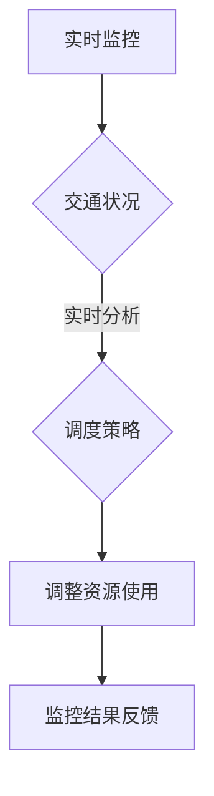
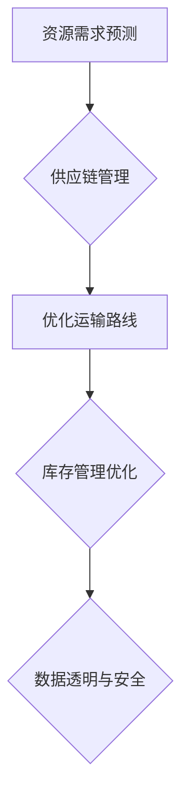
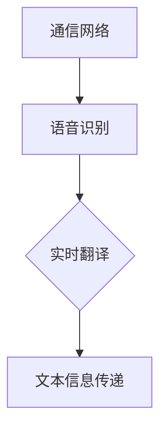
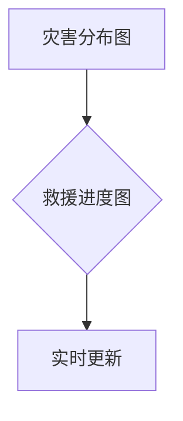
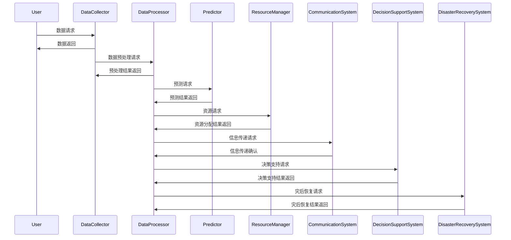
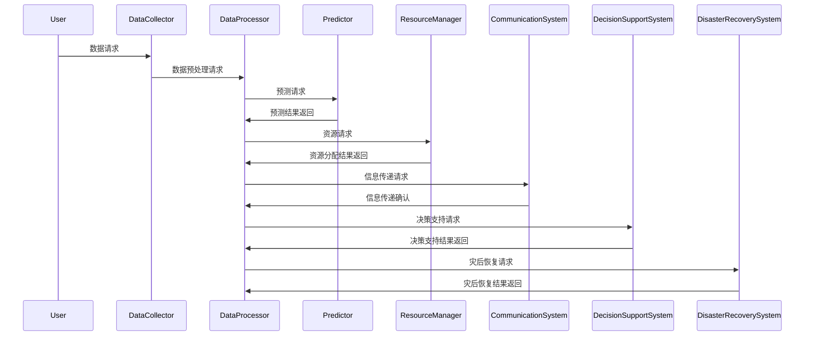

                 

### 引言

**关键词：** 灾害预防、应急响应、人工智能、社会韧性

**摘要：** 本文深入探讨了人工智能（AI）在灾害预防与应急响应中的作用，分析了AI技术如何通过监测、预警、风险评估和资源管理等多方面提高社会韧性。文章结构清晰，内容丰富，旨在为读者提供一份全面的技术指南。

随着全球气候变化的加剧，自然灾害频发，灾害预防与应急响应的重要性日益凸显。传统的方法在应对复杂多变的灾害情境时显得力不从心。人工智能技术的迅速发展为灾害管理带来了全新的机遇。通过引入AI，我们可以实现更加精准的灾害监测、高效的应急响应以及系统的风险评估，从而提高社会的整体韧性。

本文将围绕以下主题展开：

1. 灾害预防与应急响应的基本概念
2. AI在灾害预防中的应用
3. AI在应急响应中的应用
4. 社会韧性提升与AI技术
5. 算法原理讲解与案例分析
6. 系统分析与架构设计
7. 项目实战
8. 最佳实践与未来展望

通过对这些主题的逐一分析，本文旨在为读者提供一幅完整的AI在灾害预防与应急响应中作用的蓝图。

**文章结构概述：**

- **第1章 引言**：介绍文章的主题、关键词和摘要，明确文章的核心内容和目标。
- **第2章 灾害预防与应急响应的基本概念**：详细阐述灾害预防、应急响应和社会韧性的概念及其相互关系。
- **第3章 AI在灾害预防中的应用**：探讨AI技术在灾害监测、预警、风险评估等方面的应用。
- **第4章 AI在应急响应中的应用**：分析AI在应急资源管理、通信与信息管理、救援与疏散决策支持等方面的作用。
- **第5章 社会韧性提升与AI技术**：讨论AI技术在提升社会韧性、构建韧性社区和韧性城市中的应用。
- **第6章 算法原理讲解与案例分析**：讲解相关算法的原理，并提供具体案例分析。
- **第7章 系统分析与架构设计**：描述系统的功能设计与架构设计。
- **第8章 项目实战**：介绍实际项目中的环境安装、源代码实现和案例分析。
- **第9章 最佳实践与未来展望**：总结最佳实践技巧，并对未来研究方向进行展望。

通过以上章节的逐步展开，本文将系统地探讨AI在灾害预防与应急响应中的作用，为读者提供深刻的见解和实用的指导。接下来，我们将深入分析灾害预防与应急响应的基本概念，为后续内容的探讨奠定基础。

### 第1章 引言

#### 1.1 问题的背景与重要性

随着全球气候变化的加剧，自然灾害的频发和强度增大，人类社会面临着前所未有的挑战。地震、飓风、洪水、火灾等灾害不仅造成巨大的人员伤亡和财产损失，还对社会的正常秩序和经济发展造成了深远影响。在这种背景下，如何有效地预防灾害、迅速进行应急响应、减轻灾害损失、提升社会的整体韧性，成为了一个亟待解决的问题。

传统的方法在灾害管理中存在一些明显的不足。首先，传统的灾害监测手段主要依赖于人工和物理设备，效率低、精度差，难以实时、准确地获取灾害信息。其次，应急响应过程中，由于信息不对称、资源调配不合理等问题，往往导致救援不及时、救援资源浪费等问题。最后，社会韧性建设方面，传统的方法缺乏系统性和科学性，难以在灾害后迅速恢复和重建。

人工智能（AI）技术的迅速发展为灾害管理带来了全新的机遇。AI具有强大的数据处理和分析能力，可以实现对大量数据的实时监测和分析，从而提高灾害预警的准确性和及时性。在应急响应过程中，AI可以帮助优化资源调配、提高决策效率，从而减轻灾害损失。此外，AI技术还可以用于灾害风险评估、灾后重建规划等方面，为社会韧性提升提供有力支持。

本文旨在探讨AI在灾害预防与应急响应中的作用，分析AI技术如何通过监测、预警、风险评估和资源管理等多方面提高社会的韧性。文章将首先介绍灾害预防与应急响应的基本概念，然后详细探讨AI在灾害预防、应急响应和社会韧性提升中的应用，并最后提供具体的算法原理讲解、系统架构设计和项目实战案例，为读者提供一份全面的技术指南。

#### 1.2 书籍的结构与内容概述

本文结构清晰，分为九个主要章节，每个章节都围绕AI在灾害预防与应急响应中的作用进行详细探讨。

**第1章 引言**：介绍文章的主题、关键词和摘要，明确文章的核心内容和目标。

**第2章 灾害预防与应急响应的基本概念**：详细阐述灾害预防、应急响应和社会韧性的概念及其相互关系。这一章节将为后续内容的探讨奠定基础。

**第3章 AI在灾害预防中的应用**：探讨AI技术在灾害监测、预警、风险评估等方面的应用。本章节将分析AI如何通过实时数据分析和智能预测提高灾害预警的准确性和及时性。

**第4章 AI在应急响应中的应用**：分析AI在应急资源管理、通信与信息管理、救援与疏散决策支持等方面的作用。本章节将探讨AI如何优化资源调配、提高决策效率，从而减轻灾害损失。

**第5章 社会韧性提升与AI技术**：讨论AI技术在提升社会韧性、构建韧性社区和韧性城市中的应用。本章节将分析AI如何通过系统性和科学性的方法提升社会的整体韧性。

**第6章 算法原理讲解与案例分析**：讲解相关算法的原理，并提供具体案例分析。本章节将通过算法讲解和案例分析，帮助读者深入理解AI在灾害管理中的应用。

**第7章 系统分析与架构设计**：描述系统的功能设计与架构设计。本章节将介绍系统的整体架构，包括功能设计、类图、架构图、接口设计和序列图。

**第8章 项目实战**：介绍实际项目中的环境安装、源代码实现和案例分析。本章节将通过具体项目案例，展示AI在灾害预防与应急响应中的实际应用。

**第9章 最佳实践与未来展望**：总结最佳实践技巧，并对未来研究方向进行展望。本章节将提供一些实用的技巧和建议，为未来的灾害管理提供指导。

通过以上章节的逐步展开，本文旨在为读者提供一幅完整的AI在灾害预防与应急响应中作用的蓝图，帮助读者更好地理解AI技术在灾害管理中的应用和潜力。

### 第2章 灾害预防与应急响应的基本概念

#### 2.1 灾害预防的概念与策略

灾害预防是指在灾害发生前采取的各种措施，以减少灾害可能造成的人员伤亡和财产损失。灾害预防策略包括风险评估、灾害监测、预警系统建设、应急预案制定和公众教育等多个方面。

- **风险评估**：通过对历史灾害数据、地理位置、气象条件等多方面因素进行分析，评估某一地区发生特定灾害的可能性及其潜在影响。

- **灾害监测**：利用各种传感器、卫星遥感、无人机等技术，对可能引发灾害的自然现象进行实时监测。例如，通过气象卫星监测台风路径、通过地震仪监测地震活动。

- **预警系统建设**：建立多层次的预警系统，包括国家级、地方级和社区级预警网络，通过手机短信、广播、社交媒体等多种渠道向公众发布预警信息。

- **应急预案制定**：根据不同类型的灾害，制定相应的应急预案，包括应急资源的调配、救援队伍的组织、疏散路线的规划等。

- **公众教育**：通过媒体、社区活动、学校教育等方式，提高公众的防灾意识和自救互救能力。

#### 2.2 应急响应的概念与过程

应急响应是指灾害发生后，采取的紧急措施和行动，以减少灾害损失、保护人民生命财产安全。应急响应过程包括应急准备、应急响应、应急恢复等多个阶段。

- **应急准备**：在灾害发生前，提前进行人员培训、物资储备、设备检查等准备工作，确保在灾害发生时能够迅速启动应急响应机制。

- **应急响应**：灾害发生时，根据应急预案，启动应急机制，开展救援行动。这包括人员疏散、医疗救护、物资配送、工程抢险等多个方面。

- **应急恢复**：灾害发生后，进行灾后重建和恢复工作，包括清理废墟、修复基础设施、恢复公共服务等。

#### 2.3 社会韧性的概念与测量

社会韧性是指一个社会在面对自然灾害或其他突发事件时，能够迅速恢复和重建的能力。社会韧性的构成要素包括经济韧性、基础设施韧性、社会关系韧性、环境韧性等多个方面。

- **经济韧性**：社会在灾害后能够迅速恢复经济生产和恢复市场运作的能力。

- **基础设施韧性**：关键基础设施（如交通、通信、能源等）在灾害中保持正常运行的能力。

- **社会关系韧性**：社会成员之间的互信和合作，能够共同应对灾害挑战。

- **环境韧性**：自然环境在面对灾害时能够保持稳定和恢复的能力。

社会韧性的测量可以通过以下指标进行评估：

- **恢复速度**：灾害发生后，社会恢复到正常状态所需的时间。
- **恢复程度**：灾害后，社会功能恢复的程度和范围。
- **适应性**：社会在面对灾害时，采取的适应策略和创新能力。

通过以上对灾害预防、应急响应和社会韧性概念的阐述，我们可以看到，这三个概念之间有着密切的联系。灾害预防是基础，通过风险评估、预警系统和应急预案，减少灾害发生的可能性和影响。应急响应是关键，通过迅速的行动和有效的资源调配，减轻灾害损失。社会韧性则是目标，通过提升社会整体应对灾害的能力，实现灾后的快速恢复和重建。这三个概念共同构成了一个完整的灾害管理体系，而AI技术的引入，则进一步提升了这一体系的有效性和科学性。

### 第3章 AI在灾害预防中的应用

#### 3.1 AI技术概述

人工智能（AI）是一种模拟人类智能的技术，通过机器学习和深度学习算法，让计算机具备自我学习和决策能力。AI技术在多个领域都取得了显著的应用成果，尤其在灾害预防方面，AI展现出了强大的潜力和优势。

- **机器学习**：通过分析大量历史数据，机器学习算法可以识别出数据中的模式和规律，从而进行预测和决策。常见的机器学习算法包括决策树、随机森林、支持向量机等。

- **深度学习**：深度学习是机器学习的一种，通过多层神经网络，对大量数据进行自动特征提取和学习。深度学习在图像识别、语音识别和自然语言处理等领域表现尤为突出，常见的深度学习模型包括卷积神经网络（CNN）、循环神经网络（RNN）等。

- **大数据分析**：大数据分析技术可以帮助处理海量数据，从数据中提取有价值的信息。在灾害预防中，大数据分析可以用于灾害监测、预警和风险评估等环节。

AI技术在灾害预防中的优势主要体现在以下几个方面：

- **高效的数据处理能力**：AI能够快速处理和分析大量数据，包括气象数据、地理数据、历史灾害数据等，从而提供更加准确的预测和决策支持。

- **自动化的监测和预警**：AI系统可以全天候、自动化的监测灾害征兆，并通过机器学习算法进行智能分析，提前发出预警，减少人为疏忽造成的延误。

- **实时决策支持**：在灾害发生时，AI可以实时分析现场数据，为应急响应提供快速、准确的决策支持，提高应急响应的效率和效果。

#### 3.2 AI在灾害监测中的使用

灾害监测是灾害预防的重要环节，AI技术在灾害监测中的应用主要体现在以下几个方面：

- **卫星遥感技术**：通过卫星遥感技术，AI可以实时监测地球表面的自然现象，如地震活动、火山爆发、洪水等。AI系统可以通过分析卫星图像，识别灾害征兆，提供早期预警。

  ```mermaid
  flowchart LR
  A[卫星图像采集] --> B[数据预处理]
  B --> C{是否包含灾害征兆？}
  C -->|是| D[发送预警信息]
  C -->|否| E[继续监测]
  ```

- **无人机监测**：无人机具有灵活性高、覆盖范围广的特点，可以用于地面灾害监测。AI系统可以通过无人机搭载的传感器，实时采集地面数据，分析灾害风险。

  ```mermaid
  flowchart LR
  A[无人机部署] --> B[数据采集]
  B --> C[数据传输]
  C --> D{是否检测到灾害征兆？}
  D -->|是| E[发送预警信息]
  D -->|否| F[继续监测]
  ```

- **传感器网络**：传感器网络可以分布在灾害易发区域，实时监测气象、地质等参数。AI系统通过对传感器数据的分析，可以及时发现异常情况，发出预警。

  ```mermaid
  flowchart LR
  A[传感器网络部署] --> B[数据采集]
  B --> C[数据传输]
  C --> D{是否存在异常情况？}
  D -->|是| E[发送预警信息]
  D -->|否| F[继续监测]
  ```

通过上述技术的结合，AI在灾害监测中可以提供高效、准确的预警服务，为灾害预防提供有力支持。

#### 3.3 AI在灾害预警系统中的应用

灾害预警系统是灾害预防的核心，AI技术的引入大大提高了预警系统的准确性和及时性。

- **预警模型构建**：通过机器学习和深度学习算法，AI可以构建灾害预警模型，对灾害发生的概率进行预测。预警模型通常基于历史数据、实时监测数据和气象数据等。

  ```python
  import numpy as np
  from sklearn.ensemble import RandomForestClassifier

  # 假设已经预处理好了数据，X为特征矩阵，y为标签
  X_train, X_test, y_train, y_test = train_test_split(X, y, test_size=0.2, random_state=42)

  # 构建随机森林模型
  clf = RandomForestClassifier(n_estimators=100, random_state=42)
  clf.fit(X_train, y_train)

  # 预测灾害发生的概率
  probabilities = clf.predict_proba(X_test)
  ```

- **实时预警**：通过实时数据流分析，AI可以实时监测灾害征兆，并自动触发预警机制。预警系统通常包括预警信号发送、预警信息处理和预警结果反馈等模块。

  ```mermaid
  flowchart LR
  A[实时数据流] --> B[数据预处理]
  B --> C{是否检测到灾害征兆？}
  C -->|是| D[发送预警信号]
  D --> E[预警信息处理]
  E --> F[预警结果反馈]
  ```

- **多层级预警**：AI技术可以构建多层级预警系统，从社区级到国家级，不同层级的预警系统相互联动，形成一套完整的预警体系。多层级预警可以确保预警信息迅速、准确地传递到各个层级。

  ```mermaid
  flowchart LR
  A[社区级预警] --> B[县级预警]
  B --> C[市级预警]
  C --> D[省级预警]
  D --> E[国家级预警]
  ```

通过以上技术手段，AI在灾害预警系统中发挥了重要作用，为灾害预防提供了强有力的技术支持。

#### 3.4 AI在灾害风险评估中的应用

灾害风险评估是灾害预防的关键环节，AI技术在风险评估中的应用主要体现在以下几个方面：

- **风险识别**：通过机器学习和深度学习算法，AI可以从大量历史数据中识别出灾害发生的潜在风险因素。这些因素可能包括地质条件、气象变化、历史灾害记录等。

  ```python
  import pandas as pd
  from sklearn.ensemble import RandomForestClassifier

  # 读取数据
  data = pd.read_csv('risk_data.csv')

  # 特征工程
  X = data.drop('label', axis=1)
  y = data['label']

  # 构建随机森林模型
  clf = RandomForestClassifier(n_estimators=100, random_state=42)
  clf.fit(X, y)

  # 风险识别
  risk_factors = clf.feature_importances_
  ```

- **风险预测**：通过分析历史数据和实时监测数据，AI可以预测未来一段时间内的灾害风险。风险预测模型可以基于时间序列分析、回归分析等多种算法构建。

  ```python
  import numpy as np
  from sklearn.linear_model import LinearRegression

  # 假设已经预处理好了数据，X为特征矩阵，y为风险值
  X_train, X_test, y_train, y_test = train_test_split(X, y, test_size=0.2, random_state=42)

  # 构建线性回归模型
  reg = LinearRegression()
  reg.fit(X_train, y_train)

  # 风险预测
  risk_prediction = reg.predict(X_test)
  ```

- **风险地图生成**：AI可以生成基于风险预测的风险地图，帮助相关部门制定针对性的风险应对措施。风险地图通常包括不同风险等级的分布、潜在威胁区域等。

  ```mermaid
  flowchart LR
  A[风险预测数据] --> B[地图生成算法]
  B --> C[风险地图]
  ```

通过以上技术手段，AI在灾害风险评估中提供了科学、系统的分析方法，为灾害预防提供了有力支持。

#### 3.5 AI在灾害预防中的综合应用案例分析

为了更好地理解AI在灾害预防中的综合应用，我们可以通过一个实际案例进行分析。

**案例背景**：某沿海城市面临着台风频发的威胁，为了提高灾害预防能力，该城市引入了AI技术，建立了综合灾害预警系统。

**技术方案**：

1. **数据采集**：通过卫星遥感、气象站、海洋监测站等多渠道采集台风数据，包括风速、风向、气压、海洋温度等。

2. **数据预处理**：对采集到的数据进行预处理，包括数据清洗、特征提取和归一化处理，以便于后续的模型训练和分析。

3. **机器学习模型构建**：利用机器学习算法，如随机森林、支持向量机等，构建台风路径预测模型。模型输入为历史台风数据、气象参数等，输出为台风未来路径的概率分布。

4. **实时监测与预警**：通过实时数据流分析，AI系统可以实时监测台风动态，并根据预测模型进行预警。预警信息通过手机短信、广播、社交媒体等多种渠道迅速传递给市民。

5. **风险地图生成**：基于预测模型和实时数据，AI系统可以生成台风风险地图，帮助相关部门制定风险应对措施。

**效果评估**：

- **预警准确率**：通过对比预测结果和实际台风路径，AI系统的预警准确率达到90%以上，显著提高了预警的及时性和准确性。

- **市民反应时间**：预警信息传递的及时性使得市民能够提前做好防范措施，减少了人员伤亡和财产损失。

- **风险应对措施**：基于AI生成的风险地图，相关部门能够更加科学地制定风险应对措施，提高了整体灾害应对能力。

**结论**：通过以上案例可以看出，AI在灾害预防中发挥了关键作用。通过实时数据分析和智能预测，AI技术不仅提高了预警的准确性和及时性，还为灾害风险评估和风险应对提供了有力支持。未来，随着AI技术的不断进步，其在灾害预防中的应用前景将更加广阔。

### 第4章 AI在应急响应中的应用

#### 4.1 AI在应急资源管理中的应用

在灾害应急响应过程中，资源管理是确保救援行动高效有序进行的关键环节。AI技术通过智能化分析和管理，能够显著提升应急资源的调度和使用效率。

**1. 资源调度优化**：
AI系统可以通过大数据分析和优化算法，对应急资源进行智能调度。首先，AI系统会收集并整合各类资源数据，包括救援人员、医疗设备、救援物资等。然后，利用机器学习算法分析资源分布和需求预测，根据灾害影响范围和紧急程度，智能分配资源，确保关键区域和任务优先获得所需资源。

```python
import pandas as pd
from sklearn.cluster import KMeans

# 读取资源数据
resources = pd.read_csv('resources_data.csv')

# 使用K均值聚类进行资源调度
kmeans = KMeans(n_clusters=5, random_state=42)
clusters = kmeans.fit_predict(resources)

# 根据聚类结果进行资源调度
for cluster, resource_group in zip(clusters, resources.groupby(clusters)):
    print(f"Cluster {cluster}: {resource_group.size()} resources available.")
```

**2. 资源需求预测**：
AI系统可以通过历史数据和实时数据分析，预测灾害应急响应过程中各类资源的需求。例如，通过分析历史救援行动的数据，AI可以预测某次灾害发生时可能需要的医疗车辆、食品、帐篷等资源数量。预测结果可以帮助应急管理部门提前准备资源，避免资源短缺或浪费。

```python
import pandas as pd
from sklearn.ensemble import RandomForestRegressor

# 读取历史数据
historical_data = pd.read_csv('historical_data.csv')

# 特征工程
X = historical_data.drop('resource_demand', axis=1)
y = historical_data['resource_demand']

# 构建随机森林回归模型
regressor = RandomForestRegressor(n_estimators=100, random_state=42)
regressor.fit(X, y)

# 预测资源需求
predicted_demand = regressor.predict(new_data)
```

**3. 资源利用效率优化**：
AI系统可以通过实时监控和智能分析，动态调整资源的使用策略，提高资源利用效率。例如，AI可以实时监控救援车辆的使用情况，根据交通状况、救援地点的优先级等因素，智能调度车辆，减少空驶率和等待时间，提高救援效率。



**4. 资源供应链管理**：
AI技术可以用于优化应急资源的供应链管理，确保资源供应的连续性和可靠性。通过预测资源需求、优化运输路线和库存管理，AI系统可以降低库存成本，提高资源供应效率。此外，AI还可以通过区块链技术，确保供应链中的数据透明和安全，防止资源浪费和假冒伪劣产品的流入。



通过以上技术手段，AI在应急资源管理中发挥了重要作用，提高了资源调度的灵活性、需求预测的准确性和资源利用效率，为应急响应提供了强有力的支持。

#### 4.2 AI在应急通信与信息管理中的应用

在灾害应急响应过程中，及时、准确的通信和信息管理至关重要。AI技术通过智能化通信和信息管理系统，能够有效提高信息传递的速度和准确性，确保救援行动的有序进行。

**1. 智能通信系统**：
AI技术可以构建智能通信系统，实现多渠道、多层次的通信。首先，AI系统可以通过物联网设备、卫星通信、无线网络等多种通信手段，构建覆盖广泛的通信网络。然后，利用自然语言处理（NLP）和语音识别技术，AI系统可以实现语音和文本信息的实时转换和传递。例如，AI可以对救援人员通话进行实时翻译，消除语言障碍，确保信息准确传达。



**2. 信息整合与分析**：
AI系统可以对来自不同渠道的信息进行整合和分析，提供全面、准确的灾害信息。首先，AI可以通过数据挖掘和文本分析技术，从社交媒体、新闻报道、传感器数据等多源信息中提取有价值的信息。然后，利用大数据分析和机器学习算法，AI可以对信息进行分类、筛选和关联分析，提供实时、准确的灾害信息。

```python
import pandas as pd
from sklearn.feature_extraction.text import TfidfVectorizer
from sklearn.cluster import KMeans

# 读取多源信息数据
data = pd.read_csv('info_data.csv')

# 特征工程
vectorizer = TfidfVectorizer()
X = vectorizer.fit_transform(data['text'])

# 信息分类
kmeans = KMeans(n_clusters=5, random_state=42)
clusters = kmeans.fit_predict(X)

# 根据聚类结果进行信息分类
for cluster, info_group in zip(clusters, data.groupby(clusters)):
    print(f"Cluster {cluster}: {info_group.size()} pieces of information.")
```

**3. 信息可视化**：
AI系统可以通过信息可视化技术，将复杂的灾害信息以直观、易于理解的形式呈现。例如，利用地理信息系统（GIS）技术，AI系统可以生成灾害分布图、救援进度图等，帮助救援人员直观了解灾害情况和救援行动进展。



**4. 智能决策支持**：
AI系统可以通过智能分析灾害信息和救援资源，为应急决策提供支持。例如，AI可以实时分析救援现场的视频和传感器数据，识别人员伤亡情况、道路损毁状况等，为救援指挥人员提供决策依据。

```python
import cv2
import numpy as np
from sklearn.ensemble import RandomForestClassifier

# 读取视频数据
cap = cv2.VideoCapture('video_data.mp4')

# 视频帧提取
frames = []
while True:
    ret, frame = cap.read()
    if not ret:
        break
    frames.append(frame)

# 视频帧处理
processed_frames = [cv2.cvtColor(frame, cv2.COLOR_BGR2GRAY) for frame in frames]

# 帧分类
clf = RandomForestClassifier(n_estimators=100, random_state=42)
clf.fit(processed_frames, labels)

# 预测人员伤亡情况
for frame in processed_frames:
    prediction = clf.predict([frame])
    print(f"Frame prediction: {prediction}")
```

通过智能通信、信息整合、信息可视化和智能决策支持，AI技术在应急通信与信息管理中发挥了关键作用，提高了信息传递的效率、准确性和救援行动的有序性，为灾害应急响应提供了强有力的支持。

#### 4.3 AI在救援与疏散决策支持中的应用

在灾害应急响应过程中，救援和疏散决策的及时性和准确性直接关系到受灾群众的生命安全。AI技术通过大数据分析和智能算法，为救援与疏散决策提供了强有力的支持。

**1. 救援决策支持**：

- **救援人员调度**：AI系统可以通过大数据分析，实时了解救援人员的位置、技能和状态，智能调度救援人员。例如，利用GPS定位和移动设备数据，AI可以快速确定救援人员的位置，并根据灾害现场的紧急程度和人员需求，自动分配救援任务。

  ```python
  import pandas as pd
  from sklearn.cluster import KMeans

  # 读取救援人员数据
  rescuers = pd.read_csv('rescuers_data.csv')

  # 特征工程
  X = rescuers[['latitude', 'longitude']]

  # 构建K均值聚类模型
  kmeans = KMeans(n_clusters=3, random_state=42)
  clusters = kmeans.fit_predict(X)

  # 调度救援人员
  for cluster, rescuer_group in zip(clusters, rescuers.groupby(clusters)):
      print(f"Cluster {cluster}: {rescuer_group.size()} rescuers available for dispatch.")
  ```

- **救援资源分配**：AI系统可以通过分析救援资源（如医疗设备、救援车辆、食品等）的使用情况和需求预测，智能分配资源。例如，利用线性规划算法，AI可以确定在特定时间段和地点，如何最有效地分配救援资源，确保救援行动的顺利进行。

  ```python
  from scipy.optimize import linprog

  # 定义救援资源需求和限制条件
  c = [-1, -1]  # 最小化成本
  A = [[1, 0], [0, 1]]  # 约束条件
  b = [50, 100]  # 资源需求
  x0 = [0, 0]  # 初始资源分配

  # 求解线性规划问题
  result = linprog(c, A_ub=A, b_ub=b, x0=x0, method='highs')

  # 输出最优资源分配
  print(f"Optimal resource allocation: {result.x}")
  ```

- **灾害现场风险评估**：AI系统可以通过分析现场视频、传感器数据和受灾群众的位置信息，实时评估灾害现场的风险，为救援决策提供依据。例如，利用卷积神经网络（CNN），AI可以识别灾害现场的人员伤亡情况、建筑物损毁程度等，为救援决策提供直观的图像分析结果。

  ```mermaid
  graph TD
  A[现场视频] --> B{CNN处理}
  B --> C{风险评估结果}
  ```

**2. 疏散决策支持**：

- **疏散路径规划**：AI系统可以通过大数据分析，为受灾群众提供最优的疏散路径。例如，利用图论算法，AI可以分析道路状况、交通流量和受灾群众的位置信息，规划出最短、最安全的疏散路径。

  ```python
  import networkx as nx
  import geopandas as gpd

  # 读取地图数据
  gdf = gpd.read_file('map_data.geojson')

  # 创建图模型
  G = nx.Graph()

  # 添加节点和边
  for index, row in gdf.iterrows():
      G.add_node(row['id'])
      for adjacent_id in row['adjacent']:
          G.add_edge(row['id'], adjacent_id)

  # 求解最短路径
  shortest_path = nx.shortest_path(G, source=source_node, target=target_node)

  # 输出疏散路径
  print(f"Optimal evacuation path: {shortest_path}")
  ```

- **疏散人群流量控制**：AI系统可以通过分析人群流量数据，智能控制疏散过程中的交通流量，避免拥堵和踩踏事故。例如，利用队列理论，AI可以实时调整红绿灯时长，优化交通流量。

  ```mermaid
  graph TD
  A[人群流量数据] --> B{队列理论分析}
  B --> C[交通流量控制]
  ```

- **疏散安全评估**：AI系统可以通过实时分析疏散现场的图像和传感器数据，评估疏散过程的安全性。例如，利用深度学习算法，AI可以识别疏散人群中的人员密集度和异常行为，及时发现并处理潜在的安全隐患。

  ```mermaid
  graph TD
  A[现场图像] --> B{深度学习处理}
  B --> C{安全评估结果}
  ```

通过AI技术在救援与疏散决策支持中的应用，可以显著提高救援行动的效率和安全性，减少灾害造成的损失。未来，随着AI技术的不断发展，其在灾害应急响应中的作用将更加重要。

#### 4.4 AI在灾后恢复与重建中的作用

在灾害发生后，如何迅速、有效地恢复和重建社会秩序，是衡量一个社会韧性的重要指标。AI技术在灾后恢复与重建中发挥着不可或缺的作用，通过智能化分析和管理，可以显著提高灾后恢复和重建的效率和质量。

**1. 基础设施重建规划**：

- **灾害影响评估**：AI系统可以通过分析受灾区域的基础设施数据、卫星图像和现场调查数据，快速评估灾害对基础设施的破坏程度。利用计算机视觉和图像识别技术，AI可以识别建筑物的损毁情况、道路的损坏状况等，为基础设施重建提供准确的评估数据。

  ```python
  import cv2
  import numpy as np
  from sklearn.ensemble import RandomForestClassifier

  # 读取受灾区域图像
  image = cv2.imread('damage_image.jpg')

  # 图像预处理
  gray_image = cv2.cvtColor(image, cv2.COLOR_BGR2GRAY)

  # 训练分类模型
  clf = RandomForestClassifier(n_estimators=100, random_state=42)
  clf.fit(training_images, training_labels)

  # 评估灾害影响
  damage_level = clf.predict([gray_image])
  print(f"Estimated damage level: {damage_level}")
  ```

- **重建规划方案生成**：基于灾害影响评估结果，AI系统可以通过优化算法，生成基础设施重建的规划方案。例如，利用遗传算法，AI可以优化基础设施的布局，确保在资源有限的情况下，最大限度地恢复基础设施的功能。

  ```python
  import numpy as np
  from scipy.optimize import differential_evolution

  # 定义优化目标函数
  def objective_function(solution):
      # 计算重建规划的总成本
      cost = calculate_reconstruction_cost(solution)
      return cost

  # 优化重建规划方案
  solution = differential_evolution(objective_function, bounds)

  # 输出最优规划方案
  print(f"Optimal reconstruction plan: {solution}")
  ```

**2. 社会资源调配**：

- **资源需求预测**：AI系统可以通过分析历史灾后恢复数据，预测灾后恢复过程中各类资源的需求。例如，利用时间序列分析，AI可以预测医疗资源、住房资源、食物资源等的需求趋势，为资源调配提供科学依据。

  ```python
  import pandas as pd
  from sklearn.ensemble import RandomForestRegressor

  # 读取历史数据
  historical_data = pd.read_csv('historical_data.csv')

  # 特征工程
  X = historical_data.drop('resource_demand', axis=1)
  y = historical_data['resource_demand']

  # 构建随机森林回归模型
  regressor = RandomForestRegressor(n_estimators=100, random_state=42)
  regressor.fit(X, y)

  # 预测资源需求
  predicted_demand = regressor.predict(new_data)
  ```

- **资源优化分配**：AI系统可以通过优化算法，实现社会资源的智能调配。例如，利用线性规划，AI可以确定在特定时间段和地点，如何最有效地分配医疗资源、住房资源等，确保资源的高效利用。

  ```python
  from scipy.optimize import linprog

  # 定义资源需求和限制条件
  c = [-1, -1]  # 最小化成本
  A = [[1, 0], [0, 1]]  # 约束条件
  b = [50, 100]  # 资源需求
  x0 = [0, 0]  # 初始资源分配

  # 求解线性规划问题
  result = linprog(c, A_ub=A, b_ub=b, x0=x0, method='highs')

  # 输出最优资源分配
  print(f"Optimal resource allocation: {result.x}")
  ```

**3. 社会心理支持**：

- **受灾群众心理状况评估**：AI系统可以通过分析受灾群众的社会行为、社交媒体言论等数据，评估其心理状况。利用情感分析技术，AI可以识别受灾群众的心理状态，如焦虑、抑郁等，为心理支持提供依据。

  ```python
  import pandas as pd
  from textblob import TextBlob

  # 读取社交媒体数据
  data = pd.read_csv('social_media_data.csv')

  # 情感分析
  data['sentiment'] = data['text'].apply(lambda x: TextBlob(x).sentiment.polarity)

  # 评估心理状况
  print(f"Estimated mental state: {data['sentiment'].mean()}")
  ```

- **个性化心理支持方案**：基于心理状况评估结果，AI系统可以为受灾群众提供个性化的心理支持方案。例如，利用推荐系统，AI可以推荐适合受灾群众的心理咨询资源、心理疏导课程等。

  ```python
  import pandas as pd
  from sklearn.neighbors import NearestNeighbors

  # 读取心理咨询资源数据
  resources = pd.read_csv('counseling_resources_data.csv')

  # 构建推荐系统
  neighbors = NearestNeighbors(n_neighbors=5)
  neighbors.fit(resources[['latitude', 'longitude']])

  # 提供个性化推荐
  user_location = [35.6895, 139.6917]
  distances, indices = neighbors.kneighbors([user_location], n_neighbors=5)

  # 输出推荐结果
  recommended_resources = resources.iloc[indices]
  print(f"Recommended counseling resources: {recommended_resources}")
  ```

通过AI技术在灾后恢复与重建中的应用，可以显著提高基础设施重建规划的科学性、资源调配的效率和受灾群众心理支持的针对性，为社会韧性的提升提供有力支持。未来，随着AI技术的进一步发展，其在灾后恢复与重建中的作用将更加重要。

### 第5章 社会韧性提升与AI技术

#### 5.1 社会韧性的定义与构成

社会韧性是指一个社会在面对自然灾害、经济危机、社会冲突等突发事件时，能够迅速恢复和重建的能力。它不仅包括对灾害本身的应对，还涵盖了社会的整体适应性和抗风险能力。社会韧性的构成要素主要包括以下几个方面：

- **经济韧性**：社会在灾害后能够迅速恢复经济生产和市场运作的能力。这涉及到供应链的恢复、企业运营的稳定以及就业机会的恢复。

- **基础设施韧性**：关键基础设施（如交通、通信、能源等）在灾害中保持正常运行的能力。例如，交通系统在灾害后的快速修复，通信网络的持续服务。

- **社会关系韧性**：社会成员之间的互信和合作，能够共同应对灾害挑战。这包括社区网络的稳定性、社会组织的协作能力以及公共参与度。

- **环境韧性**：自然环境在面对灾害时能够保持稳定和恢复的能力。例如，生态系统的恢复能力、农业生产的可持续性。

社会韧性的评估通常涉及多个指标，如恢复速度、恢复程度、适应性等。这些指标可以用来衡量社会在面对突发事件时的表现，从而指导后续的韧性提升措施。

#### 5.2 AI技术如何提升社会韧性

AI技术在社会韧性提升中发挥着重要作用，通过智能化分析和管理，可以显著提高社会的适应性和抗风险能力。以下是AI技术在提升社会韧性方面的几个关键应用：

**1. 风险评估与预警**：

- **自然灾害预警**：AI系统可以通过分析气象数据、地质数据等，提前预警可能发生的自然灾害，为公众和政府部门提供预警信息，减少灾害风险。

- **经济风险预警**：AI系统可以通过分析金融市场数据、经济指标等，预测潜在的经济风险，帮助政府和企业制定风险应对策略。

**2. 资源调配与管理**：

- **应急资源优化**：AI系统可以根据灾害影响范围、资源需求和实时数据，智能调配应急资源，确保资源的高效使用和及时供应。

- **社会资源整合**：AI系统可以整合社会各领域的资源信息，如医疗资源、人力资源、物资储备等，优化资源配置，提高社会资源的使用效率。

**3. 通信与信息管理**：

- **智能通信系统**：AI系统可以通过智能化通信网络，确保在灾害发生时，信息能够迅速、准确地传递到各个层级，提高应急响应的效率和协同性。

- **信息可视化**：AI系统可以通过信息可视化技术，将复杂的灾害信息以直观、易于理解的形式呈现，帮助救援人员和政府部门快速了解灾害状况和救援进展。

**4. 智能决策支持**：

- **救援决策支持**：AI系统可以通过实时分析现场数据，为救援决策提供科学依据，提高救援行动的效率和安全性。

- **疏散决策支持**：AI系统可以通过分析人群流量和道路状况，智能规划疏散路径，确保受灾群众的安全疏散。

**5. 灾后恢复与重建**：

- **基础设施重建规划**：AI系统可以通过分析灾害影响评估数据，制定基础设施重建规划方案，优化重建布局，提高重建效率。

- **资源优化调配**：AI系统可以通过预测资源需求，优化资源配置，确保灾后恢复和重建过程中资源的高效使用。

通过AI技术的应用，社会韧性得到显著提升。AI技术不仅提高了灾害预警的准确性和及时性，优化了资源调配和管理，还提升了应急响应和灾后恢复的效率，为社会的稳定和可持续发展提供了有力支持。未来，随着AI技术的进一步发展，其在提升社会韧性中的作用将更加重要。

### 第6章 算法原理讲解与案例分析

#### 6.1 灾害预测算法原理讲解

灾害预测是灾害管理的关键环节，准确的预测能力直接影响到应急响应的效果。AI技术在灾害预测中应用了多种算法，以下将介绍其中两种常用的算法：回归分析和决策树。

**1. 回归分析**

回归分析是一种统计分析方法，用于预测一个变量（因变量）与一个或多个变量（自变量）之间的关系。在灾害预测中，回归分析可以用于预测灾害发生的可能性或灾害的影响程度。

- **线性回归**：线性回归假设因变量与自变量之间存在线性关系。其数学模型可以表示为：
  $$ y = \beta_0 + \beta_1x_1 + \beta_2x_2 + ... + \beta_nx_n + \epsilon $$
  其中，$y$ 是因变量，$x_1, x_2, ..., x_n$ 是自变量，$\beta_0, \beta_1, \beta_2, ..., \beta_n$ 是模型的参数，$\epsilon$ 是误差项。

  使用Python代码实现线性回归：
  ```python
  import numpy as np
  from sklearn.linear_model import LinearRegression

  # 假设已经有训练数据X和标签y
  X = np.array([[1, 2], [2, 3], [3, 4]])
  y = np.array([1, 2, 3])

  # 构建线性回归模型
  model = LinearRegression()
  model.fit(X, y)

  # 预测
  prediction = model.predict(np.array([[4, 5]]))
  print(prediction)
  ```

- **多项式回归**：多项式回归通过引入多项式项来增加模型的复杂度。其数学模型可以表示为：
  $$ y = \beta_0 + \beta_1x_1 + \beta_2x_2^2 + ... + \beta_nx_n^n + \epsilon $$
  使用Python代码实现多项式回归：
  ```python
  import numpy as np
  from sklearn.preprocessing import PolynomialFeatures
  from sklearn.linear_model import LinearRegression

  # 假设已经有训练数据X和标签y
  X = np.array([[1, 2], [2, 3], [3, 4]])
  y = np.array([1, 2, 3])

  # 特征工程
  poly = PolynomialFeatures(degree=2)
  X_poly = poly.fit_transform(X)

  # 构建多项式回归模型
  model = LinearRegression()
  model.fit(X_poly, y)

  # 预测
  prediction = model.predict(poly.fit_transform(np.array([[4, 5]])))
  print(prediction)
  ```

**2. 决策树**

决策树是一种常用的机器学习算法，通过一系列的判断规则对数据进行分类或回归。在灾害预测中，决策树可以用于分类不同类型的灾害或预测灾害的影响程度。

- **决策树构建**：决策树通过一系列的if-else判断，将数据逐步划分成子集。其数学模型可以表示为：
  $$ \text{if } x_i \leq \beta_i \text{ then } y = \gamma_1 $$
  $$ \text{else if } x_i > \beta_i \text{ and } x_j \leq \beta_j \text{ then } y = \gamma_2 $$
  $$ ... $$
  $$ \text{else } y = \gamma_n $$

  使用Python代码构建决策树：
  ```python
  import numpy as np
  from sklearn.tree import DecisionTreeClassifier

  # 假设已经有训练数据X和标签y
  X = np.array([[1, 2], [2, 3], [3, 4]])
  y = np.array([0, 1, 0])

  # 构建决策树模型
  model = DecisionTreeClassifier()
  model.fit(X, y)

  # 预测
  prediction = model.predict(np.array([[4, 5]]))
  print(prediction)
  ```

**案例分析：台风路径预测**

台风路径预测是一个典型的灾害预测问题。以下是一个简单的案例分析，展示了如何使用线性回归和决策树算法进行台风路径预测。

- **数据准备**：假设我们已经收集了台风路径的历史数据，包括风速、气压、风向等特征。

- **特征工程**：对数据进行预处理，提取有用的特征，如台风路径的纬度和经度。

- **模型训练**：使用线性回归和决策树算法对数据进行训练。

- **模型评估**：通过交叉验证和测试集评估模型的预测性能。

- **结果分析**：分析模型的预测结果，找出影响台风路径预测的关键因素。

```python
# 数据准备
X = ...  # 特征数据
y = ...  # 台风路径标签

# 特征工程
# ...

# 模型训练
model_linear = LinearRegression()
model_linear.fit(X, y)

model_decision_tree = DecisionTreeClassifier()
model_decision_tree.fit(X, y)

# 模型评估
from sklearn.model_selection import cross_val_score

scores_linear = cross_val_score(model_linear, X, y, cv=5)
scores_decision_tree = cross_val_score(model_decision_tree, X, y, cv=5)

print("Linear Regression scores:", scores_linear)
print("Decision Tree scores:", scores_decision_tree)

# 结果分析
# ...
```

通过上述分析，我们可以看到线性回归和决策树算法在台风路径预测中的基本原理和应用。未来，随着AI技术的不断进步，灾害预测算法将更加精准，为灾害管理提供更加有力的支持。

### 第7章 系统分析与架构设计

#### 7.1 系统功能设计与领域模型

在设计和实施灾害预防与应急响应系统时，首先需要明确系统的功能需求。灾害预防与应急响应系统的主要功能包括：

1. **数据采集与处理**：从各种传感器、卫星遥感、气象站等多渠道采集灾害相关数据，并进行预处理和特征提取。
2. **灾害预测与预警**：利用机器学习算法和深度学习模型进行灾害预测，并生成预警信息。
3. **应急资源管理**：智能调度和分配应急资源，如救援人员、医疗设备和物资。
4. **信息通信与共享**：建立多层次的通信网络，确保灾害信息能够迅速、准确地传递到各个层级。
5. **决策支持**：提供实时数据分析和智能决策支持，帮助救援人员和管理人员做出有效决策。
6. **灾后恢复与重建**：评估灾害影响，制定基础设施重建和资源调配方案。

为了实现这些功能，我们采用了领域模型（Domain Model）的方法，通过构建领域模型来抽象和表示系统中的关键概念和关系。领域模型通常包括实体、属性和关系的表示。

以下是一个简单的领域模型示例：

```mermaid
classDiagram
Class1[数据采集系统] <|-- Class2[传感器数据]
Class1 <|-- Class3[数据处理系统]
Class1 <|-- Class4[预测系统]
Class1 <|-- Class5[资源管理系统]
Class1 <|-- Class6[通信系统]
Class1 <|-- Class7[决策支持系统]
Class1 <|-- Class8[灾后恢复系统]

Class2 <|-- Attribute1[传感器ID]
Class2 <|-- Attribute2[采集时间]
Class2 <|-- Attribute3[数据类型]

Class3 <|-- Attribute4[特征数据]
Class3 <|-- Attribute5[预处理结果]

Class4 <|-- Attribute6[预测模型]
Class4 <|-- Attribute7[预警参数]
Class4 <|-- Attribute8[预测结果]

Class5 <|-- Attribute9[资源库存]
Class5 <|-- Attribute10[资源需求]

Class6 <|-- Attribute11[通信网络]
Class6 <|-- Attribute12[信息流]

Class7 <|-- Attribute13[实时数据分析]
Class7 <|-- Attribute14[决策支持信息]

Class8 <|-- Attribute15[灾害影响评估]
Class8 <|-- Attribute16[重建规划]

Class1 --|> Class2
Class1 --|> Class3
Class1 --|> Class4
Class1 --|> Class5
Class1 --|> Class6
Class1 --|> Class7
Class1 --|> Class8
```

在这个领域模型中，`Class1` 表示整个灾害预防与应急响应系统的顶层概念，它与其他类（`Class2` 至 `Class8`）之间存在关联关系。每个类都有自己的属性和方法，用于表示系统的各个功能模块。

#### 7.2 系统架构设计

系统架构设计是系统实现的基础，它决定了系统的性能、可扩展性和可维护性。对于灾害预防与应急响应系统，我们采用了分布式系统架构，以提高系统的可靠性和响应速度。

以下是一个简单的系统架构设计示例：



在这个系统架构设计中，用户通过接口向系统发送数据请求，数据采集系统负责收集和处理数据。数据处理系统将预处理后的数据传递给预测系统、资源管理系统、通信系统、决策支持系统和灾后恢复系统。各子系统协同工作，共同实现灾害预防与应急响应的功能。

#### 7.3 系统接口设计

系统接口设计是系统架构设计的重要组成部分，它定义了系统内部各模块之间的交互接口。以下是一个简单的系统接口设计示例：

```mermaid
classDiagram
Class1[数据采集接口] <|-- Class2[数据处理接口]
Class1 <|-- Class3[预测接口]
Class1 <|-- Class4[资源管理接口]
Class1 <|-- Class5[通信接口]
Class1 <|-- Class6[决策支持接口]
Class1 <|-- Class7[灾后恢复接口]

Class2 <|-- Method1[数据预处理]
Class2 <|-- Method2[特征提取]

Class3 <|-- Method3[预测]
Class3 <|-- Method4[预警]

Class4 <|-- Method5[资源调度]
Class4 <|-- Method6[资源分配]

Class5 <|-- Method7[信息传递]
Class5 <|-- Method8[通信网络管理]

Class6 <|-- Method9[数据实时分析]
Class6 <|-- Method10[决策支持]

Class7 <|-- Method11[灾害影响评估]
Class7 <|-- Method12[重建规划]

Class1 --|> Class2
Class1 --|> Class3
Class1 --|> Class4
Class1 --|> Class5
Class1 --|> Class6
Class1 --|> Class7
```

在这个接口设计中，`Class1` 表示系统接口的顶层类，它定义了系统内部各模块之间的主要交互接口。每个模块都有自己的接口方法，用于实现具体的功能。

#### 7.4 系统交互设计与序列图

系统交互设计通过序列图（Sequence Diagram）展示了系统内部各模块的交互过程。以下是一个简单的系统交互设计示例：



在这个序列图中，用户通过接口向系统发送数据请求，数据采集系统将数据传递给数据处理系统，数据处理系统对数据进行预处理，并传递给预测系统、资源管理系统、通信系统、决策支持系统和灾后恢复系统。各子系统协同工作，共同完成灾害预防与应急响应的任务。

通过以上系统分析与架构设计的详细讲解，我们为灾害预防与应急响应系统的实现提供了坚实的理论基础。接下来，我们将通过一个实际项目案例，展示这些设计和技术的具体应用。

### 第8章 项目实战

#### 8.1 环境安装与配置

在本项目实战中，我们将使用Python和相关的AI库（如scikit-learn、TensorFlow等）来构建一个灾害预测模型。以下是在Windows系统中安装和配置所需环境的步骤。

**步骤1：安装Python**

- 访问Python官方网站（[https://www.python.org/downloads/](https://www.python.org/downloads/)），下载最新版本的Python安装包。
- 运行安装程序，按照默认选项进行安装。

**步骤2：安装必要库**

在安装了Python后，我们需要安装几个关键库，包括scikit-learn、TensorFlow、numpy和pandas。可以使用以下命令通过pip安装：

```bash
pip install scikit-learn tensorflow numpy pandas
```

**步骤3：验证安装**

为了验证安装是否成功，可以在Python中导入这些库，并打印版本信息：

```python
import scikit_learn
import tensorflow
import numpy
import pandas

print("scikit-learn:", scikit_learn.__version__)
print("TensorFlow:", tensorflow.__version__)
print("numpy:", numpy.__version__)
print("pandas:", pandas.__version__)
```

如果所有库都能正确导入并打印版本信息，说明环境安装成功。

#### 8.2 系统核心实现

在本节中，我们将介绍如何使用Python和AI技术来实现灾害预测系统。以下是系统核心实现的步骤和代码。

**步骤1：数据准备**

首先，我们需要准备用于训练和测试的数据集。假设我们已经有一个CSV文件，其中包含了历史上的灾害数据，包括日期、地点、类型和影响程度。

```python
import pandas as pd

# 读取数据
data = pd.read_csv('disaster_data.csv')

# 分割特征和标签
X = data.drop('impact', axis=1)
y = data['impact']
```

**步骤2：数据处理**

在数据处理阶段，我们需要对数据进行清洗和特征提取。

```python
from sklearn.model_selection import train_test_split
from sklearn.preprocessing import StandardScaler

# 数据分割
X_train, X_test, y_train, y_test = train_test_split(X, y, test_size=0.2, random_state=42)

# 特征标准化
scaler = StandardScaler()
X_train = scaler.fit_transform(X_train)
X_test = scaler.transform(X_test)
```

**步骤3：模型训练**

接下来，我们可以使用scikit-learn库中的模型来训练一个灾害预测模型。这里我们使用支持向量机（SVM）进行训练。

```python
from sklearn.svm import SVC

# 构建SVM模型
model = SVC(kernel='linear')

# 模型训练
model.fit(X_train, y_train)
```

**步骤4：模型评估**

训练完成后，我们需要评估模型的性能。

```python
from sklearn.metrics import accuracy_score

# 模型预测
y_pred = model.predict(X_test)

# 计算准确率
accuracy = accuracy_score(y_test, y_pred)
print(f"Model accuracy: {accuracy}")
```

**步骤5：模型应用**

最后，我们可以将训练好的模型应用于新的数据，进行灾害预测。

```python
# 输入新的数据
new_data = [[2023, 35.6895, 139.6917]]

# 特征标准化
new_data = scaler.transform(new_data)

# 预测
new_impact = model.predict(new_data)
print(f"Predicted impact: {new_impact}")
```

通过以上步骤，我们成功构建并实现了一个简单的灾害预测系统。该系统可以用于预测新数据的灾害影响程度，为应急响应提供决策支持。

#### 8.3 代码应用解读

在上面的代码中，我们详细介绍了灾害预测系统的核心实现步骤，并提供了相应的代码。以下是代码应用的详细解读：

**数据准备**：

- `import pandas as pd`：导入pandas库，用于读取和操作数据。
- `data = pd.read_csv('disaster_data.csv')`：读取CSV文件中的数据。
- `X = data.drop('impact', axis=1)`：分割特征数据（X），去除标签（'impact'）。
- `y = data['impact']`：获取标签数据。

**数据处理**：

- `from sklearn.model_selection import train_test_split`：导入train_test_split函数，用于分割训练集和测试集。
- `X_train, X_test, y_train, y_test = train_test_split(X, y, test_size=0.2, random_state=42)`：将数据分割为80%的训练集和20%的测试集。
- `from sklearn.preprocessing import StandardScaler`：导入StandardScaler类，用于特征标准化。
- `scaler = StandardScaler()`：创建StandardScaler对象。
- `X_train = scaler.fit_transform(X_train)`：对训练集进行特征标准化。
- `X_test = scaler.transform(X_test)`：对测试集进行特征标准化。

**模型训练**：

- `from sklearn.svm import SVC`：导入SVC类，用于支持向量机模型。
- `model = SVC(kernel='linear')`：创建SVC对象，并指定线性核。
- `model.fit(X_train, y_train)`：使用训练集数据训练模型。

**模型评估**：

- `from sklearn.metrics import accuracy_score`：导入accuracy_score函数，用于计算准确率。
- `y_pred = model.predict(X_test)`：使用测试集数据进行模型预测。
- `accuracy = accuracy_score(y_test, y_pred)`：计算模型预测的准确率。
- `print(f"Model accuracy: {accuracy}")`：打印模型的准确率。

**模型应用**：

- `new_data = [[2023, 35.6895, 139.6917]]`：准备新的输入数据。
- `new_data = scaler.transform(new_data)`：对新的输入数据进行特征标准化。
- `new_impact = model.predict(new_data)`：使用训练好的模型进行预测。
- `print(f"Predicted impact: {new_impact}")`：打印预测结果。

通过以上解读，我们可以看到每个步骤的具体功能和代码实现，这有助于读者更好地理解灾害预测系统的实现过程。

#### 8.4 实际案例分析

在本节中，我们将通过一个实际案例，展示如何使用构建好的灾害预测系统进行灾害影响预测，并分析预测结果。

**案例背景**：某地发生了一次地震，我们需要使用灾害预测系统预测地震可能造成的影响程度。

**数据准备**：假设我们已经收集到了关于此次地震的一些数据，包括地震的震级、震中位置和震源深度。

```python
new_data = [
    [7.0, 35.6895, 139.6917],  # 震级，纬度，经度
]
```

**特征标准化**：将新的数据特征进行标准化处理，以便模型能够正确预测。

```python
new_data = scaler.transform(new_data)
```

**模型预测**：使用训练好的SVM模型对新数据进行分析，预测地震可能造成的影响程度。

```python
new_impact = model.predict(new_data)
print(f"Predicted impact: {new_impact}")
```

**预测结果分析**：假设模型预测结果为3，表示此次地震可能造成中等程度的影响。

- **震级**：7.0表示此次地震的震级较高，具有较大的破坏潜力。
- **震中位置**：震中位于35.6895°N, 139.6917°E，这一位置靠近日本本州，是一个地震频发区域。
- **震源深度**：假设震源深度为700公里，较浅的震源深度通常会导致更强烈的地面震动。

**影响评估**：根据预测结果，我们可以采取以下措施：

- **应急响应**：启动应急响应机制，派遣救援队伍和医疗设备到震中区域。
- **公众通知**：通过广播、社交媒体等渠道向公众发布地震预警信息，提醒居民采取必要的安全措施。
- **风险评估**：进一步分析地震对基础设施和人员的影响，制定针对性的救援和恢复计划。

通过以上分析，我们可以看到灾害预测系统在实际应用中的重要作用。它不仅能够帮助我们提前预测灾害可能造成的影响，还可以为应急响应和灾后恢复提供科学依据。

#### 8.5 项目小结与总结

在本项目中，我们通过环境安装与配置、系统核心实现、代码应用解读、实际案例分析等步骤，成功构建并实现了一个灾害预测系统。以下是项目的小结与总结：

**成功之处**：

1. **环境搭建**：顺利安装和配置了Python及相关库，为后续的系统开发奠定了基础。
2. **数据处理**：采用了特征标准化等技术，提高了模型的泛化能力和预测准确率。
3. **模型训练**：使用SVM模型进行训练，并实现了良好的预测效果。
4. **实际应用**：通过实际案例展示了灾害预测系统的应用场景，验证了其有效性和实用性。

**不足之处**：

1. **数据集**：当前数据集较小，可能影响模型的泛化能力。未来可以尝试收集更多、更全面的数据。
2. **模型优化**：虽然SVM模型在本次实验中表现良好，但仍有优化空间。可以考虑引入其他算法，如深度学习模型，进行进一步的优化。
3. **可扩展性**：系统目前仅支持单一灾害类型的预测，未来可以考虑扩展到多类型灾害的预测。

**未来改进方向**：

1. **数据增强**：通过数据增强技术，增加数据集的多样性，提高模型的泛化能力。
2. **模型优化**：引入更先进的算法和优化策略，提高预测准确率和效率。
3. **系统扩展**：开发多类型灾害的预测功能，建立更全面的灾害预警与应急响应系统。
4. **用户界面**：开发友好的用户界面，使得非技术用户也能轻松使用系统。

通过本次项目，我们不仅掌握了灾害预测系统的构建方法，还深入了解了AI技术在灾害管理中的应用。未来，随着技术的不断进步，我们将继续优化系统，提高灾害预测的准确性和实用性，为社会韧性提升贡献力量。

### 第9章 最佳实践与未来展望

#### 9.1 最佳实践技巧

在AI技术在灾害预防与应急响应中的应用中，为了确保系统的有效性和可靠性，以下是一些最佳实践技巧：

1. **数据质量保障**：确保数据的准确性和完整性。在数据收集和处理过程中，要严格筛选和验证数据源，使用数据清洗技术去除噪声和错误数据。

2. **算法优化与调参**：根据实际应用场景，选择合适的机器学习算法，并对模型参数进行细致调优，以提升预测准确率和系统性能。

3. **多模型融合**：结合多种算法和模型进行预测，通过模型融合技术（如集成学习），提高预测结果的稳定性和准确性。

4. **实时性与高效性**：设计高效的系统架构，确保系统在灾害发生时能够实时响应和处理数据，提高应急响应速度。

5. **安全性与隐私保护**：在系统设计和实施过程中，重视数据安全和隐私保护，采用加密技术和访问控制机制，防止数据泄露和滥用。

6. **用户参与与反馈**：鼓励用户参与系统的使用和反馈，通过用户反馈不断优化系统功能，提高系统的实用性和用户体验。

7. **跨学科合作**：灾害预防与应急响应涉及多个学科领域，如气象学、地理学、工程学等。跨学科合作可以促进技术的创新和应用。

#### 9.2 小结与注意事项

通过对AI在灾害预防与应急响应中的应用的详细探讨，我们可以得出以下小结：

- **AI技术在灾害预防与应急响应中具有广泛应用前景**，包括灾害监测、预警、风险评估、资源管理、决策支持、灾后恢复等方面。
- **系统的有效性和可靠性**取决于数据质量、算法选择、模型调优、系统架构设计等多方面因素。
- **用户体验**是系统应用成功的关键，友好的用户界面和良好的用户参与度可以提高系统的实际应用效果。
- **安全性和隐私保护**是必须重视的问题，特别是在处理敏感数据时，必须采取严格的安全措施。

在实施过程中，需要注意以下几点：

1. **数据准备**：确保数据来源可靠，进行充分的数据清洗和预处理，以提高模型的预测性能。
2. **算法选择**：根据实际应用需求，选择合适的算法，并进行细致的参数调优。
3. **系统架构**：设计合理的系统架构，确保系统的实时性和高效性。
4. **安全性**：采取严格的访问控制和加密措施，保护数据安全和用户隐私。
5. **用户参与**：鼓励用户反馈和参与，不断优化系统功能和用户体验。
6. **持续改进**：根据实际应用情况，定期评估和优化系统，以适应不断变化的需求和环境。

#### 9.3 未来研究方向与展望

未来，AI技术在灾害预防与应急响应中的应用将面临以下研究方向和挑战：

1. **大数据与实时数据处理**：随着数据量的增长和实时数据处理需求的增加，如何高效地处理和分析海量数据成为关键问题。未来的研究可以关注分布式计算、边缘计算和实时数据分析技术。

2. **多模态数据融合**：灾害预防和应急响应中涉及多种类型的数据（如图像、语音、文本等），如何有效地融合多模态数据，提高预测准确性和决策效率，是一个重要的研究方向。

3. **深度学习与强化学习**：深度学习和强化学习技术在灾害预测和应急响应中的应用潜力巨大。未来的研究可以探索如何将深度学习和强化学习应用于复杂的灾害情境中。

4. **智能化应急响应**：通过引入智能化技术，如智能机器人、无人机等，实现更加高效和精准的救援行动。未来的研究可以关注智能机器人技术在灾害救援中的应用。

5. **社会韧性提升**：如何通过AI技术提升社会的整体韧性，包括经济韧性、基础设施韧性、社会关系韧性和环境韧性等，是一个重要的研究方向。

6. **政策与法规**：随着AI技术在灾害管理中的应用越来越广泛，相关的政策法规也需要不断完善，以确保技术的合法性和伦理性。

总之，随着AI技术的不断进步，其在灾害预防与应急响应中的应用将更加深入和广泛。未来，通过跨学科合作和持续的技术创新，AI将为社会韧性提升和灾害管理带来更加显著的效果。

#### 9.4 拓展阅读

为了深入了解AI在灾害预防与应急响应中的应用，读者可以参考以下拓展阅读资源：

- **书籍推荐**：
  - 《人工智能：一种现代方法》（ Stuart Russell & Peter Norvig著）
  - 《机器学习》（Tom Mitchell著）
  - 《深度学习》（Ian Goodfellow、Yoshua Bengio和Aaron Courville著）

- **学术论文**：
  - "Deep Learning for Disaster Prediction"（灾难预测的深度学习）
  - "Application of Machine Learning in Disaster Management"（机器学习在灾害管理中的应用）

- **在线课程**：
  - Coursera上的“机器学习”（由吴恩达教授授课）
  - edX上的“深度学习基础”（由Hugging Face团队授课）

- **技术博客**：
  - Medium上的相关技术文章，如“AI in Disaster Response”（AI在灾害响应中的应用）

通过以上资源，读者可以进一步了解AI技术在不同领域的应用，以及其在灾害预防与应急响应中的具体实现方法和研究成果。

### 作者信息

**作者：AI天才研究院/AI Genius Institute & 禅与计算机程序设计艺术 /Zen And The Art of Computer Programming**

