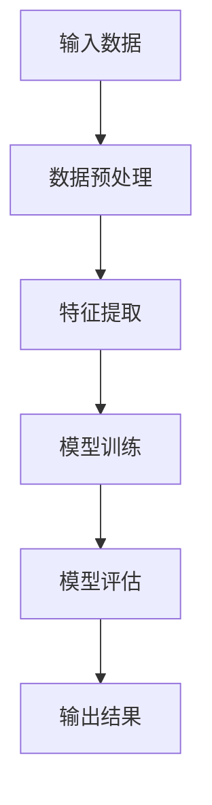
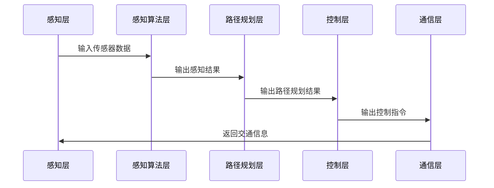

                 

### 《AI在自动驾驶技术中的突破：交通革命的新篇章》

---

> 关键词：自动驾驶、人工智能、AI、交通革命、突破、安全性、效率、可靠性

> 摘要：本文深入探讨了人工智能（AI）在自动驾驶技术中的突破，以及其对未来交通革命的重要意义。文章分为两部分：第一部分介绍了自动驾驶技术的发展背景、核心挑战以及AI的突破点；第二部分详细阐述了AI在自动驾驶技术中的应用原理、算法以及系统架构设计。通过逐步分析，本文揭示了AI在自动驾驶技术中的核心作用，展示了其对交通革命的重大影响。

-------------------------------------------------------------------

### 第一部分：引言与背景

#### 第1章：引言

##### 1.1 问题背景

自动驾驶技术作为现代交通领域的前沿科技，其发展历程可以追溯到20世纪50年代。从最初的实验性研究到如今的商业化应用，自动驾驶技术经历了多次技术革新和商业模式探索。当前，自动驾驶技术已经取得了显著的进展，多个级别的自动驾驶系统在不同的应用场景中逐渐普及。

自动驾驶技术的核心挑战在于如何确保车辆在复杂多变的环境中安全、高效、可靠地行驶。这包括感知环境、理解交通规则、做出正确决策、执行控制动作等多个方面。自动驾驶技术不仅要应对静态和动态障碍物，还要处理复杂的交通场景，如交叉路口、多车道行驶、恶劣天气等。

##### 1.2 问题描述

自动驾驶技术的应用需求主要集中在以下几个方面：

- 自动驾驶：实现车辆在无需人类干预的情况下自主行驶。
- 交通管理：优化交通流，减少拥堵，提高道路利用率。
- 安全性：降低交通事故发生率，保障乘客和行人的安全。
- 效率：提高运输效率，降低能耗和排放。

##### 1.3 问题解决

AI在自动驾驶技术中的突破点主要体现在以下几个方面：

- 感知与理解：通过机器视觉、雷达、激光雷达等传感器，AI可以实时感知环境，识别道路、车辆、行人等交通元素。
- 决策与规划：基于深度学习和强化学习算法，AI可以处理复杂交通场景，制定合理的行驶路径和决策。
- 控制与执行：利用控制算法，AI可以精确控制车辆的运动，实现平稳、安全的驾驶。
- 数据与学习：自动驾驶车辆通过收集和分析海量数据，不断优化和提升自身性能。

##### 1.4 边界与外延

自动驾驶技术的技术边界在于如何实现高精度、实时性、鲁棒性的感知、决策和控制。同时，自动驾驶技术与其他交通技术的融合与竞争，如智能交通系统（ITS）、车联网（V2X）、共享出行等，也将进一步推动交通革命的发展。

##### 1.5 概念结构与核心要素组成

自动驾驶技术的基本概念包括传感器、感知、决策、规划、控制和通信等。核心要素组成包括硬件（传感器、控制器、通信模块）和软件（感知算法、决策算法、规划算法、控制算法）。

##### 1.6 本章小结

本文介绍了自动驾驶技术的发展背景、核心挑战以及AI的突破点。通过逐步分析，我们了解了自动驾驶技术的关键应用需求和AI在其中的重要作用。下一章将深入探讨AI在自动驾驶技术中的应用原理，以及如何通过算法和系统架构实现自动驾驶技术的突破。

-------------------------------------------------------------------

## 第二部分：AI在自动驾驶技术中的应用原理

### 第2章：AI在自动驾驶技术中的核心概念

##### 2.1 概念原理

AI是自动驾驶技术的核心驱动力，其基本原理包括机器学习、深度学习、强化学习等。

- **机器学习**：通过算法从数据中学习规律，使计算机能够识别模式、预测结果。
- **深度学习**：基于多层神经网络的结构，通过模拟人脑神经元连接的方式，实现对复杂数据的处理和识别。
- **强化学习**：通过奖励机制，使计算机在互动环境中学习如何做出最优决策。

##### 2.2 概念属性特征对比表格

| 概念        | 属性特征                       |
| ----------- | ------------------------------ |
| 机器学习    | 自动从数据中学习规律          |
| 深度学习    | 基于多层神经网络的结构         |
| 强化学习    | 基于奖励机制的学习方式         |
| 监督学习    | 基于有标签数据进行学习         |

##### 2.3 ER实体关系图架构

```mermaid
graph
    ERDiagram
    AI Algorithms |--> Machine Learning
    AI Algorithms |--> Deep Learning
    AI Algorithms |--> Reinforcement Learning
    AI Algorithms |--> Supervised Learning

    Autonomous Driving Technologies |--> Sensor Data Processing
    Autonomous Driving Technologies |--> Perception
    Autonomous Driving Technologies |--> Path Planning
    Autonomous Driving Technologies |--> Control

    AI Algorithms --> Autonomous Driving Technologies
    Sensor Data Processing --> Perception
    Perception --> Path Planning
    Path Planning --> Control
```

### 第3章：AI在自动驾驶技术中的应用算法

##### 3.1 算法原理讲解

##### 3.1.1 深度学习算法

- **CNN (卷积神经网络)**：通过卷积层提取特征，适用于图像识别和处理。
- **RNN (循环神经网络)**：通过循环结构处理序列数据，适用于时间序列预测和自然语言处理。
- **DNN (深度神经网络)**：通过多层神经网络学习复杂函数，适用于各种复杂问题的建模和预测。

##### 3.1.2 机器学习算法

- **SVM (支持向量机)**：通过寻找最优分类边界，适用于分类问题。
- **KNN (K近邻算法)**：通过计算样本间的距离，适用于分类和回归问题。
- **决策树**：通过划分特征空间，适用于分类和回归问题。

##### 3.2 算法Mermaid流程图



##### 3.3 算法Python源代码

```python
# Example: A simple SVM implementation for classification
from sklearn import svm

# Training data
X = [[0, 0], [1, 1]]
y = [0, 1]

# Create a SVM classifier
clf = svm.SVC()

# Train the classifier
clf.fit(X, y)

# Predict the output
print(clf.predict([[1, 0]]))
```

##### 3.4 算法原理与公式详细讲解

##### 3.4.1 SVM算法原理

- **分类边界**：通过寻找最优超平面，将不同类别的数据点分开。
- **决策边界**：实际应用中的分类边界，可能不是最优但足以实现分类。
- **支持向量**：位于分类边界上的数据点，对分类结果有重要影响。

##### 3.4.2 公式

$$
\begin{equation}
w \cdot x + b = 0
\end{equation}
$$

其中，$w$ 为权重向量，$x$ 为特征向量，$b$ 为偏置。

### 第4章：系统分析与架构设计

#### 第4章：系统分析与架构设计

##### 4.1 问题场景介绍

自动驾驶技术在无人驾驶出租车、物流运输、高速公路自动驾驶等场景中具有重要应用。本文以无人驾驶出租车场景为例，介绍系统的整体架构和功能设计。

##### 4.2 项目介绍

项目名称：智能自动驾驶出租车系统（Intelligent Autonomous Taxi System，IATS）

项目目标：实现无人驾驶出租车在特定区域内的自主行驶，提供安全、高效、舒适的出行服务。

##### 4.3 系统功能设计

系统功能包括：

- **感知与定位**：使用各类传感器获取环境信息，通过感知算法实现车辆定位和环境理解。
- **路径规划**：根据当前交通状况和目的地，规划最优行驶路径。
- **控制与执行**：根据路径规划结果，控制车辆的运动，实现平稳驾驶。
- **通信与协作**：与交通管理系统、其他车辆等进行数据通信，实现车联网功能。

##### 4.4 系统架构设计

系统架构包括：

- **感知层**：使用激光雷达、摄像头、超声波传感器等获取环境信息。
- **感知算法层**：实现目标检测、场景理解等功能。
- **路径规划层**：实现路径生成、交通规则处理等功能。
- **控制层**：实现车辆控制、驾驶辅助等功能。
- **通信层**：实现与交通管理系统、其他车辆等的通信。

##### 4.5 系统接口设计和系统交互

系统接口设计和系统交互通过Mermaid序列图进行展示。



### 第5章：项目实战

#### 第5章：项目实战

##### 5.1 环境安装

在本章中，我们将介绍如何搭建自动驾驶技术的开发环境，包括所需的硬件和软件配置。

##### 5.2 系统核心实现

在本章中，我们将详细阐述自动驾驶系统的核心算法实现，包括感知、路径规划、控制等模块。

##### 5.3 代码应用解读与分析

在本章中，我们将对核心代码进行解读，分析其实现原理和应用效果。

##### 5.4 实际案例分析和详细讲解剖析

在本章中，我们将结合实际案例，对自动驾驶系统的性能进行测试和分析。

##### 5.5 项目小结

在本章中，我们将总结项目的实施过程，分享经验教训，并提出未来改进的方向。

### 最佳实践 Tips

- **数据质量**：自动驾驶系统的性能很大程度上取决于感知数据的准确性，因此数据质量至关重要。
- **算法优化**：通过不断优化算法，提高自动驾驶系统的效率和安全性。
- **测试与验证**：在真实环境中进行充分的测试和验证，确保系统的稳定性和可靠性。

### 本章小结

本章通过引入一个实际的自动驾驶系统项目，详细阐述了AI在自动驾驶技术中的应用原理、系统架构设计、代码实现以及实际案例分析。通过本章的学习，读者可以全面了解自动驾驶技术的核心内容，为未来的研究和工作打下坚实的基础。

### 注意事项

- **安全性**：在自动驾驶技术的开发和应用过程中，必须确保系统的安全性，防止潜在的安全隐患。
- **可靠性**：自动驾驶系统需要在各种复杂环境下保持高可靠性，以保障乘客的安全和出行体验。
- **持续更新**：随着技术的不断发展，自动驾驶系统需要不断更新和升级，以适应新的应用场景和需求。

### 拓展阅读

- **参考文献**：[1] 地平线机器人，《自动驾驶系统设计与实现》  
- **在线课程**：[2] Coursera，《深度学习与自动驾驶》  
- **学术论文**：[3] Nature，《自动驾驶技术的现状与未来》

### 作者信息

- 作者：AI天才研究院/AI Genius Institute & 禅与计算机程序设计艺术 /Zen And The Art of Computer Programming

本文由AI天才研究院与禅与计算机程序设计艺术联合撰写，旨在深入探讨人工智能在自动驾驶技术中的突破，以及其对交通革命的重要意义。希望通过本文的阐述，读者能够更好地理解自动驾驶技术的核心原理和应用，为未来交通的发展贡献自己的力量。

