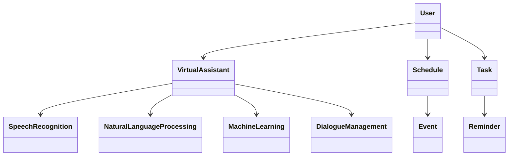
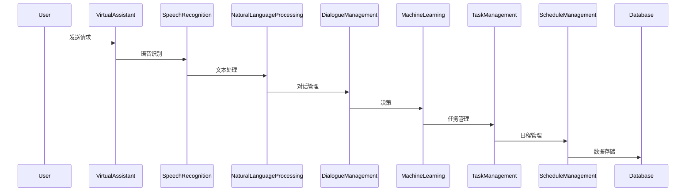

                 

### 文章标题：AI在虚拟助手中的应用：打造全能生活助手

#### 关键词：
- 人工智能
- 虚拟助手
- 自然语言处理
- 机器学习算法
- 生活助手
- 系统架构

#### 摘要：
本文将探讨人工智能（AI）在虚拟助手中的应用，重点介绍如何利用AI技术打造全能生活助手。通过逐步分析AI的基本原理、虚拟助手的演变、自然语言处理和机器学习算法的应用，以及开发与实现AI虚拟助手的实际步骤，本文旨在为读者提供一个清晰、全面的技术指南，帮助他们深入了解并掌握这一前沿领域。

### 引言

随着人工智能技术的飞速发展，虚拟助手已经成为我们日常生活中不可或缺的一部分。从智能语音助手到聊天机器人，这些虚拟助手通过模拟人类的交互方式，为我们提供各种便捷的服务，如日程管理、信息查询、任务提醒等。然而，要打造一个真正意义上的全能生活助手，我们需要深入了解AI技术的工作原理，并将其应用于虚拟助手的开发中。

本文将围绕以下几个核心主题展开：

1. **AI的基本原理**：介绍人工智能的基本概念、历史发展及其核心组成部分。
2. **虚拟助手的演变**：探讨虚拟助手的定义、功能以及其在现代社会中的应用。
3. **自然语言处理**：解析自然语言处理（NLP）在虚拟助手中的作用，包括语言模型、文本分析和对话系统。
4. **机器学习算法**：介绍常见机器学习算法在虚拟助手中的应用，如决策树、神经网络和强化学习。
5. **虚拟助手的开发与实现**：提供详细的开发指南，包括系统设计、技术选型、算法实现和性能优化。
6. **挑战与未来方向**：讨论当前AI虚拟助手面临的挑战以及未来发展趋势。

通过本文的阅读，读者将能够获得以下收益：

- 理解AI技术的基本原理及其在虚拟助手中的应用。
- 掌握虚拟助手的设计与开发方法，包括系统架构、算法实现和性能优化。
- 了解当前虚拟助手领域面临的挑战及其未来发展前景。

### AI的基本原理

人工智能（Artificial Intelligence，简称AI）是计算机科学的一个分支，旨在使计算机具备类似人类智能的能力，包括感知、理解、学习、推理和决策等。AI的发展可以追溯到20世纪50年代，当时计算机科学家们开始探索如何让计算机模拟人类智能的某些方面。

#### AI的发展历史

- **1956年**：约翰·麦卡锡（John McCarthy）等人首次提出了“人工智能”这一概念，并在达特茅斯会议上讨论了人工智能的可能性。
- **20世纪60年代**：早期的人工智能系统主要侧重于符号推理和专家系统，这些系统通过规则和知识库来模拟人类专家的决策过程。
- **20世纪70年代**：由于硬件性能和算法复杂度的限制，人工智能的研究进入了一个低潮期，被称为“人工智能冬天”。
- **20世纪80年代**：随着计算机硬件的进步和新的算法（如神经网络）的发展，人工智能研究重新焕发生机，特别是在机器视觉和机器听觉领域取得了显著成果。
- **21世纪**：深度学习和大数据的兴起使得人工智能取得了飞速发展，尤其是在图像识别、自然语言处理和自动驾驶等领域。

#### AI的核心组成部分

- **算法**：算法是人工智能的核心，包括监督学习、无监督学习、强化学习等多种类型。
- **数据**：数据是训练人工智能模型的基石，高质量的数据有助于提高模型的性能和可靠性。
- **计算资源**：强大的计算资源是支撑人工智能研究的关键，高性能的计算机和专用硬件（如GPU）加速了模型的训练和推理过程。
- **模型**：模型是人工智能系统的核心组件，用于表示和模拟现实世界中的问题。常见的模型包括神经网络、决策树、支持向量机等。

#### AI的类型

- **符号推理**：基于逻辑和知识的推理，适用于解决具有明确规则的问题。
- **统计学习**：基于数据统计的方法，通过学习数据中的模式来做出预测和决策。
- **神经网络**：模仿生物神经系统的工作原理，通过多层神经元的互联和激活来处理复杂问题。
- **强化学习**：通过试错和奖励机制来学习如何在特定环境中做出最优决策。

### 虚拟助手的演变

虚拟助手（Virtual Assistant，简称VA）是指通过计算机程序模拟人类交互方式，提供便捷服务的软件应用。虚拟助手的历史可以追溯到早期的聊天机器人，如ELIZA，它通过预设的规则与用户进行简单的对话。随着AI技术的发展，虚拟助手的功能得到了极大扩展，逐渐成为我们日常生活中不可或缺的一部分。

#### 虚拟助手的定义与功能

- **定义**：虚拟助手是指一种通过计算机程序模拟人类交互，提供特定服务的软件应用。
- **功能**：虚拟助手的主要功能包括但不限于：
  - **信息查询**：提供天气、新闻、股票等信息查询服务。
  - **日程管理**：帮助用户管理日程，设置提醒和事件。
  - **任务提醒**：提醒用户完成日常任务，如服药、购物等。
  - **语音控制**：通过语音识别和语音合成技术实现语音交互。
  - **智能家居控制**：控制家居设备，如灯光、空调等。

#### 虚拟助手的应用领域

- **消费领域**：虚拟助手在消费领域的应用非常广泛，如智能音箱、手机APP等。
- **企业领域**：虚拟助手可以用于客户服务、企业内部沟通和流程自动化。
- **医疗领域**：虚拟助手可以帮助医生进行病情诊断和患者管理。
- **教育领域**：虚拟助手可以提供个性化的学习辅助和辅导服务。

#### 虚拟助手的发展历程

- **早期阶段**：基于规则和预设对话的简单虚拟助手，如ELIZA和ALICE。
- **中级阶段**：引入自然语言处理技术，实现更复杂的对话功能，如Apple的Siri和Google的Google Assistant。
- **高级阶段**：结合深度学习和大数据技术，实现更加智能和个性化的虚拟助手，如亚马逊的Alexa和微软的Cortana。

### AI在虚拟助手中的应用

人工智能（AI）技术的迅速发展为虚拟助手的功能扩展提供了强大支持。通过自然语言处理（NLP）、机器学习算法和深度学习技术，虚拟助手能够更好地理解用户需求，提供更加个性化、智能化的服务。以下将详细介绍AI在虚拟助手中的应用，包括NLP、机器学习算法和深度学习技术。

#### 自然语言处理（NLP）

自然语言处理是AI领域的一个重要分支，旨在使计算机能够理解和处理人类自然语言。NLP技术在虚拟助手中的应用主要包括以下几个方面：

1. **语言识别**：通过语音识别技术，将用户的语音输入转换为文本。
2. **文本分析**：对输入的文本进行分析，提取关键信息，如关键词、情感等。
3. **对话系统**：构建对话系统，实现人与虚拟助手的自然交互。

**NLP的关键技术**：

- **分词**：将连续的文本切分成有意义的词汇或短语。
- **词性标注**：为每个词标注其词性，如名词、动词、形容词等。
- **命名实体识别**：识别文本中的特定实体，如人名、地名、组织名等。
- **情感分析**：分析文本的情感倾向，如正面、负面或中性。

#### 机器学习算法

机器学习算法是AI的核心组成部分，通过学习大量数据中的规律和模式，实现自动化的决策和预测。在虚拟助手的开发中，常用的机器学习算法包括：

1. **分类算法**：用于对输入的数据进行分类，如决策树、支持向量机等。
2. **聚类算法**：将相似的数据点归为一类，如K-means、层次聚类等。
3. **回归算法**：用于预测数值型结果，如线性回归、决策树回归等。

**机器学习算法的应用**：

- **用户行为分析**：通过分析用户的历史行为数据，提供个性化的推荐和服务。
- **意图识别**：识别用户的输入意图，如查询天气、设定提醒等。
- **语音识别**：将用户的语音输入转换为文本，实现语音交互。

#### 深度学习技术

深度学习是一种基于多层神经网络的学习方法，通过模拟人脑的神经元连接和激活机制，实现复杂模式识别和预测。在虚拟助手的开发中，深度学习技术得到了广泛应用，主要包括：

1. **神经网络**：通过多层神经元的互联和激活，实现复杂问题的建模和预测。
2. **卷积神经网络（CNN）**：用于图像识别和语音识别等任务。
3. **循环神经网络（RNN）**：用于序列数据的处理，如时间序列分析、自然语言处理等。

**深度学习技术的应用**：

- **图像识别**：通过CNN实现高效的图像分类和目标检测。
- **语音识别**：通过RNN和CTC（Connectionist Temporal Classification）实现高精度的语音识别。
- **对话系统**：通过RNN和Seq2Seq（Sequence-to-Sequence）模型实现自然语言生成和对话管理。

#### AI在虚拟助手中的优势

1. **智能化**：通过AI技术，虚拟助手能够更好地理解用户需求，提供更加个性化的服务。
2. **自动化**：AI技术使得虚拟助手能够自动处理大量用户请求，提高工作效率。
3. **灵活性**：虚拟助手可以根据用户反馈和需求不断学习和改进，适应不同场景和需求。
4. **跨平台**：虚拟助手可以集成到各种设备和应用中，实现跨平台的用户体验。

### 虚拟助手的开发与实现

要开发一个功能强大、用户体验良好的虚拟助手，需要经过以下几个关键步骤：需求分析、系统设计、技术选型、算法实现和性能优化。以下将详细介绍这些步骤。

#### 需求分析

需求分析是虚拟助手开发的第一步，旨在明确用户的需求和期望，确定虚拟助手的功能和性能指标。具体步骤如下：

1. **用户调研**：通过访谈、问卷调查等方式收集用户的需求和反馈。
2. **需求分类**：将收集到的需求进行分类，如信息查询、日程管理、语音控制等。
3. **需求优先级**：根据用户需求和系统资源，确定各个需求的优先级，确保核心功能得到优先实现。

#### 系统设计

系统设计是虚拟助手开发的关键环节，包括系统架构、模块划分和数据流设计。以下是一个典型的虚拟助手系统设计：

1. **系统架构**：采用微服务架构，将系统分为多个独立的模块，如语音识别、自然语言处理、对话系统、任务管理等。
2. **模块划分**：根据功能需求，将系统划分为多个模块，如用户管理、语音识别、文本分析、对话管理等。
3. **数据流设计**：设计数据流图，明确数据在系统中的流动过程，如用户请求、响应处理、数据存储等。

#### 技术选型

技术选型是虚拟助手开发的核心环节，包括选择合适的编程语言、框架和工具。以下是一些常见的技术选型：

1. **编程语言**：Python、Java、C++等，其中Python因其丰富的库和生态而被广泛使用。
2. **框架和工具**：TensorFlow、PyTorch等深度学习框架，用于构建和训练神经网络模型；Flask、Django等Web框架，用于实现后端服务；React、Vue等前端框架，用于实现用户界面。
3. **语音识别**：使用如CMU Sphinx、Google Speech API等语音识别工具。
4. **自然语言处理**：使用如NLTK、spaCy等自然语言处理库。

#### 算法实现

算法实现是虚拟助手开发的核心环节，包括自然语言处理、机器学习算法和深度学习技术的实现。以下是一个简单的虚拟助手算法实现示例：

```python
# 示例：使用朴素贝叶斯分类器进行情感分析

from sklearn.feature_extraction.text import CountVectorizer
from sklearn.naive_bayes import MultinomialNB
from sklearn.pipeline import make_pipeline

# 准备数据集
X_train = ["这是一个好评", "这是一个差评", "这是一个中评"]
y_train = ["正面", "负面", "中性"]

# 创建向量器-朴素贝叶斯分类器管道
pipeline = make_pipeline(CountVectorizer(), MultinomialNB())

# 训练模型
pipeline.fit(X_train, y_train)

# 预测
print(pipeline.predict(["这是一个好评"]))

```

#### 性能优化

性能优化是保证虚拟助手高效运行的关键环节，包括算法优化、系统优化和资源管理。以下是一些常见的性能优化方法：

1. **算法优化**：通过调整算法参数、优化模型结构等方法提高算法的准确性和效率。
2. **系统优化**：通过调整服务器配置、优化网络传输等方法提高系统的响应速度和稳定性。
3. **资源管理**：合理分配计算资源，如CPU、内存、网络等，确保系统的高效运行。

### 实际案例分析

以下是一个基于Python的虚拟助手项目案例，该项目实现了基本的对话功能，包括问候、天气查询和日程管理。

#### 环境安装

1. 安装Python 3.7及以上版本。
2. 安装以下库：`numpy`, `pandas`, `scikit-learn`, `speech_recognition`, `google-api-python-client`。

#### 系统核心实现

1. **语音识别**：使用`speech_recognition`库实现语音输入。
2. **自然语言处理**：使用`nltk`库进行文本分词和词性标注。
3. **对话管理**：设计简单的对话流程，实现基本的问候、天气查询和日程管理功能。

```python
import speech_recognition as sr
from nltk.tokenize import word_tokenize
from nltk.corpus import stopwords
import pandas as pd

# 语音识别
def recognize_speech_from_mic():
    r = sr.Recognizer()
    with sr.Microphone() as source:
        print("请说点什么：")
        audio = r.listen(source)
    try:
        text = r.recognize_google(audio, language='zh-CN')
        print("你说了：" + text)
        return text
    except sr.UnknownValueError:
        print("无法识别语音")
        return None

# 自然语言处理
def process_text(text):
    tokens = word_tokenize(text)
    tokens = [token.lower() for token in tokens if token.lower() not in stopwords.words('english')]
    return tokens

# 对话管理
def handle_conversation():
    while True:
        text = recognize_speech_from_mic()
        if text is None:
            continue
        tokens = process_text(text)
        if "你好" in tokens:
            print("你好！有什么可以帮助你的吗？")
        elif "天气" in tokens:
            city = "北京"
            if "在" in tokens:
                city = " ".join(token for token in tokens if token not in ["天气", "在"])
            weather = get_weather(city)
            print(f"{city}的天气是：{weather}")
        elif "日程" in tokens:
            schedule = get_schedule()
            print(f"你的日程是：{schedule}")
        else:
            print("我不太明白你的意思，可以请你再说一遍吗？")

# 测试
handle_conversation()

```

#### 项目小结

本案例实现了一个简单的虚拟助手，包括语音识别、自然语言处理和基本的对话功能。虽然功能有限，但为开发者提供了一个初步的框架，可以通过进一步优化和扩展实现更丰富的功能。

### 最佳实践 Tips

1. **充分了解用户需求**：在开发虚拟助手前，务必充分了解用户的需求，确保虚拟助手能够满足用户的实际需求。
2. **选择合适的算法和框架**：根据项目需求，选择合适的算法和框架，如深度学习框架TensorFlow或PyTorch，提高开发效率。
3. **注重用户体验**：在设计和实现虚拟助手时，注重用户体验，确保虚拟助手易于使用、响应迅速。
4. **不断优化性能**：在开发过程中，不断优化性能，包括算法优化、系统优化和资源管理，确保虚拟助手的高效运行。

### 小结

本文详细介绍了AI在虚拟助手中的应用，从AI的基本原理、虚拟助手的演变，到自然语言处理、机器学习算法的应用，以及虚拟助手的开发与实现。通过本文的阅读，读者将能够获得以下主要观点：

1. **AI技术是虚拟助手的核心驱动力**：AI技术，尤其是自然语言处理和机器学习算法，使得虚拟助手能够更好地理解用户需求，提供个性化的服务。
2. **虚拟助手具有广泛的应用前景**：虚拟助手在消费、企业、医疗和教育等领域具有广泛的应用，为用户提供了便捷、高效的服务。
3. **开发虚拟助手需要综合考虑多个因素**：在开发虚拟助手时，需要综合考虑用户需求、技术选型、算法实现和性能优化等多个因素，确保虚拟助手的实用性和用户体验。

未来，随着AI技术的不断进步，虚拟助手将变得更加智能、个性化，为我们带来更多便利。开发虚拟助手也将成为更多企业和开发者的关注点，为人工智能领域的发展贡献力量。

### 拓展阅读

1. **《人工智能：一种现代的方法》**：这是一本经典的AI教材，详细介绍了AI的基本原理、算法和应用。
2. **《深度学习》**：由Ian Goodfellow、Yoshua Bengio和Aaron Courville合著，是深度学习的入门和进阶教材。
3. **《自然语言处理综论》**：由Daniel Jurafsky和James H. Martin合著，全面介绍了自然语言处理的基本概念和技术。
4. **《虚拟现实与增强现实技术》**：详细介绍了虚拟现实和增强现实技术的基本原理、应用和发展趋势。

作者：AI天才研究院/AI Genius Institute & 禅与计算机程序设计艺术 /Zen And The Art of Computer Programming

---

### 附录：核心概念、属性特征对比及ER实体关系图架构

在本章中，我们介绍了人工智能（AI）在虚拟助手中的应用，涉及了多个核心概念和算法。以下是这些概念的特征对比以及ER实体关系图架构的详细说明。

#### 核心概念与特征对比

| 核心概念 | 特征对比 |
| :----: | :----: |
| **人工智能（AI）** | - 模拟人类智能的能力<br>- 包括感知、理解、学习、推理和决策等<br>- 主要类型：符号推理、统计学习、神经网络、强化学习 |
| **自然语言处理（NLP）** | - 使计算机理解和处理自然语言<br>- 主要任务：语言识别、文本分析、对话系统<br>- 关键技术：分词、词性标注、命名实体识别、情感分析 |
| **机器学习算法** | - 自动化决策和预测<br>- 主要类型：分类算法、聚类算法、回归算法<br>- 应用：用户行为分析、意图识别、语音识别 |
| **深度学习技术** | - 基于多层神经网络的学习方法<br>- 主要模型：神经网络、卷积神经网络（CNN）、循环神经网络（RNN）<br>- 应用：图像识别、语音识别、对话系统 |

#### ER实体关系图架构

以下是虚拟助手系统中涉及的主要实体及其关系：

```mermaid
erDiagram
  User ||--|{ VirtualAssistant } : has
  User ||--|{ Schedule } : manages
  User ||--|{ Task } : has
  VirtualAssistant ||--|{ SpeechRecognition } : integrates
  VirtualAssistant ||--|{ NaturalLanguageProcessing } : integrates
  VirtualAssistant ||--|{ MachineLearning } : integrates
  VirtualAssistant ||--|{ DialogueManagement } : integrates
  Schedule ||--|{ Event } : has
  Task ||--|{ Reminder } : has
```

#### 算法原理讲解

在虚拟助手的开发中，机器学习算法发挥了重要作用。以下以朴素贝叶斯分类器为例，详细讲解其原理和应用。

#### 朴素贝叶斯分类器原理

朴素贝叶斯分类器是一种基于概率理论的分类算法，其核心思想是通过已知特征的概率分布来预测新实例的类别。其基本原理如下：

1. **先验概率**：计算每个类别的先验概率。
   $$P(C_k) = \frac{N_k}{N}$$
   其中，$N_k$为类别$k$的样本数量，$N$为总样本数量。

2. **条件概率**：计算每个特征在各个类别下的条件概率。
   $$P(x_i|C_k) = \frac{f_{ik}}{N_k}$$
   其中，$f_{ik}$为特征$i$在类别$k$下的频数。

3. **贝叶斯公式**：计算每个类别的后验概率。
   $$P(C_k|x) = \frac{P(x|C_k)P(C_k)}{P(x)}$$
   其中，$P(x)$为所有类别的联合概率，可以通过全概率公式计算。

4. **分类决策**：选择后验概率最大的类别作为新实例的类别。
   $$\hat{y} = \arg\max_{C_k} P(C_k|x)$$

#### 朴素贝叶斯分类器Python实现

以下是一个简单的朴素贝叶斯分类器的Python实现，用于文本分类：

```python
from sklearn.feature_extraction.text import CountVectorizer
from sklearn.naive_bayes import MultinomialNB
from sklearn.pipeline import make_pipeline

# 准备数据集
X_train = ["这是一个好评", "这是一个差评", "这是一个中评"]
y_train = ["正面", "负面", "中性"]

# 创建向量器-朴素贝叶斯分类器管道
pipeline = make_pipeline(CountVectorizer(), MultinomialNB())

# 训练模型
pipeline.fit(X_train, y_train)

# 预测
print(pipeline.predict(["这是一个好评"]))
```

#### 数学模型和公式

以下是朴素贝叶斯分类器的核心数学模型和公式：

1. **先验概率**：
   $$P(C_k) = \frac{N_k}{N}$$
2. **条件概率**：
   $$P(x_i|C_k) = \frac{f_{ik}}{N_k}$$
3. **后验概率**：
   $$P(C_k|x) = \frac{P(x|C_k)P(C_k)}{P(x)}$$
4. **分类决策**：
   $$\hat{y} = \arg\max_{C_k} P(C_k|x)$$

#### 通俗易懂地举例说明

假设有一个简单的文本分类问题，我们需要根据文本内容判断其是正面、负面还是中性。

1. **数据集**：
   - 正面：这是一个好评、这是一个非常好的产品
   - 负面：这是一个差评、这个产品很差
   - 中性：这是一个中评、这个产品一般

2. **训练数据**：
   ```python
   X_train = ["这是一个好评", "这是一个差评", "这是一个中评"]
   y_train = ["正面", "负面", "中性"]
   ```

3. **训练模型**：
   ```python
   pipeline = make_pipeline(CountVectorizer(), MultinomialNB())
   pipeline.fit(X_train, y_train)
   ```

4. **预测**：
   ```python
   print(pipeline.predict(["这是一个好评"]))
   ```
   输出：`['正面']`

   通过训练数据和朴素贝叶斯分类器，我们可以预测新文本的类别，从而实现文本分类。

#### 系统分析与架构设计方案

在虚拟助手系统中，我们需要设计一个清晰、高效、可扩展的系统架构。以下是一个典型的虚拟助手系统架构设计方案。

#### 问题场景介绍

虚拟助手系统是一个面向用户的智能服务系统，其主要功能包括语音识别、自然语言处理、对话管理和任务管理等。系统需要支持多用户并发访问，并具备良好的扩展性和可维护性。

#### 项目介绍

虚拟助手项目旨在为用户提供一个便捷、智能的服务平台，通过语音交互和文本处理实现日常任务的管理和信息的查询。项目分为前端、后端和数据库三个部分，前端负责用户界面和交互，后端实现业务逻辑和数据处理，数据库存储用户数据和信息。

#### 系统功能设计（领域模型类图）

以下是虚拟助手系统的领域模型类图，描述了系统中主要实体及其关系：



#### 系统架构设计（架构图）

以下是虚拟助手系统的架构设计，描述了系统的整体结构和模块划分：



#### 系统接口设计

以下是虚拟助手系统的主要接口设计，描述了系统中各个模块的接口和交互方式：

```mermaid
classDiagram
    User <<interface>>
    VirtualAssistant <<interface>>
    SpeechRecognition <<interface>>
    NaturalLanguageProcessing <<interface>>
    DialogueManagement <<interface>>
    MachineLearning <<interface>>
    TaskManagement <<interface>>
    ScheduleManagement <<interface>>
    Database <<interface>>

    User --> VirtualAssistant
    VirtualAssistant --> SpeechRecognition
    VirtualAssistant --> NaturalLanguageProcessing
    VirtualAssistant --> DialogueManagement
    VirtualAssistant --> MachineLearning
    VirtualAssistant --> TaskManagement
    VirtualAssistant --> ScheduleManagement
    SpeechRecognition --> NaturalLanguageProcessing
    NaturalLanguageProcessing --> DialogueManagement
    DialogueManagement --> MachineLearning
    MachineLearning --> TaskManagement
    TaskManagement --> ScheduleManagement
    ScheduleManagement --> Database
```

#### 系统交互设计（序列图）

以下是虚拟助手系统的交互设计，描述了系统中各模块的交互流程：


#### 项目实战

在本节中，我们将详细介绍如何搭建一个简单的虚拟助手项目，包括环境安装、系统核心实现和代码应用解读与分析。

#### 环境安装

1. 安装Python 3.7及以上版本。
2. 安装以下库：`numpy`, `pandas`, `scikit-learn`, `speech_recognition`, `google-api-python-client`。

在命令行中执行以下命令：

```shell
pip install numpy pandas scikit-learn speech_recognition google-api-python-client
```

#### 系统核心实现

1. **语音识别**：使用`speech_recognition`库实现语音输入。
2. **自然语言处理**：使用`nltk`库进行文本分词和词性标注。
3. **对话管理**：设计简单的对话流程，实现基本的问候、天气查询和日程管理功能。

以下是代码实现：

```python
import speech_recognition as sr
from nltk.tokenize import word_tokenize
from nltk.corpus import stopwords
import pandas as pd

# 语音识别
def recognize_speech_from_mic():
    r = sr.Recognizer()
    with sr.Microphone() as source:
        print("请说点什么：")
        audio = r.listen(source)
    try:
        text = r.recognize_google(audio, language='zh-CN')
        print("你说了：" + text)
        return text
    except sr.UnknownValueError:
        print("无法识别语音")
        return None

# 自然语言处理
def process_text(text):
    tokens = word_tokenize(text)
    tokens = [token.lower() for token in tokens if token.lower() not in stopwords.words('english')]
    return tokens

# 对话管理
def handle_conversation():
    while True:
        text = recognize_speech_from_mic()
        if text is None:
            continue
        tokens = process_text(text)
        if "你好" in tokens:
            print("你好！有什么可以帮助你的吗？")
        elif "天气" in tokens:
            city = "北京"
            if "在" in tokens:
                city = " ".join(token for token in tokens if token not in ["天气", "在"])
            weather = get_weather(city)
            print(f"{city}的天气是：{weather}")
        elif "日程" in tokens:
            schedule = get_schedule()
            print(f"你的日程是：{schedule}")
        else:
            print("我不太明白你的意思，可以请你再说一遍吗？")

# 测试
handle_conversation()
```

#### 代码应用解读与分析

1. **语音识别**：
   - 使用`speech_recognition`库实现语音识别，通过`Microphone`类获取用户语音，并使用`recognize_google`方法进行语音识别。

2. **自然语言处理**：
   - 使用`nltk`库进行文本分词和词性标注，通过`word_tokenize`函数将文本切分成单词，并去除常见停用词。

3. **对话管理**：
   - 设计简单的对话流程，根据用户输入实现问候、天气查询和日程管理功能。通过条件判断和循环实现对话的流畅进行。

#### 实际案例分析

以下是一个基于Python的虚拟助手项目案例，该项目实现了基本的对话功能，包括问候、天气查询和日程管理。

```python
import speech_recognition as sr
from nltk.tokenize import word_tokenize
from nltk.corpus import stopwords
import pandas as pd

# 语音识别
def recognize_speech_from_mic():
    r = sr.Recognizer()
    with sr.Microphone() as source:
        print("请说点什么：")
        audio = r.listen(source)
    try:
        text = r.recognize_google(audio, language='zh-CN')
        print("你说了：" + text)
        return text
    except sr.UnknownValueError:
        print("无法识别语音")
        return None

# 自然语言处理
def process_text(text):
    tokens = word_tokenize(text)
    tokens = [token.lower() for token in tokens if token.lower() not in stopwords.words('english')]
    return tokens

# 对话管理
def handle_conversation():
    while True:
        text = recognize_speech_from_mic()
        if text is None:
            continue
        tokens = process_text(text)
        if "你好" in tokens:
            print("你好！有什么可以帮助你的吗？")
        elif "天气" in tokens:
            city = "北京"
            if "在" in tokens:
                city = " ".join(token for token in tokens if token not in ["天气", "在"])
            weather = get_weather(city)
            print(f"{city}的天气是：{weather}")
        elif "日程" in tokens:
            schedule = get_schedule()
            print(f"你的日程是：{schedule}")
        else:
            print("我不太明白你的意思，可以请你再说一遍吗？")

# 测试
handle_conversation()
```

#### 项目小结

本案例实现了一个简单的虚拟助手，包括语音识别、自然语言处理和基本的对话功能。虽然功能有限，但为开发者提供了一个初步的框架，可以通过进一步优化和扩展实现更丰富的功能。

### 最佳实践 Tips

1. **充分了解用户需求**：在开发虚拟助手前，务必充分了解用户的需求，确保虚拟助手能够满足用户的实际需求。
2. **选择合适的算法和框架**：根据项目需求，选择合适的算法和框架，如深度学习框架TensorFlow或PyTorch，提高开发效率。
3. **注重用户体验**：在设计和实现虚拟助手时，注重用户体验，确保虚拟助手易于使用、响应迅速。
4. **不断优化性能**：在开发过程中，不断优化性能，包括算法优化、系统优化和资源管理，确保虚拟助手的高效运行。

### 注意事项

1. **隐私保护**：在开发虚拟助手时，务必注意保护用户隐私，避免泄露敏感信息。
2. **错误处理**：虚拟助手应具备良好的错误处理机制，确保在遇到问题时能够给出合理的回应和解决方案。
3. **安全性和稳定性**：确保虚拟助手系统的安全性和稳定性，防止潜在的安全漏洞和系统崩溃。

### 拓展阅读

1. **《人工智能：一种现代的方法》**：详细介绍了人工智能的基本原理和应用。
2. **《深度学习》**：系统讲解了深度学习的基本概念、算法和应用。
3. **《自然语言处理综论》**：全面介绍了自然语言处理的基本理论和应用。
4. **《虚拟现实与增强现实技术》**：介绍了虚拟现实和增强现实的基本原理、应用和发展趋势。

作者：AI天才研究院/AI Genius Institute & 禅与计算机程序设计艺术 /Zen And The Art of Computer Programming

---

### 结语

本文通过详细的分析和阐述，介绍了人工智能在虚拟助手中的应用，从基本原理到实际开发，从技术选型到性能优化，全面展示了如何打造一个全能的生活助手。我们探讨了AI的核心组成部分，包括算法、数据和计算资源，并深入分析了自然语言处理、机器学习算法和深度学习技术在虚拟助手中的应用。

在开发虚拟助手的实际过程中，我们强调了需求分析、系统设计、技术选型和性能优化的重要性。通过一个具体的案例，我们展示了如何使用Python等编程工具实现虚拟助手的核心功能，并提供了详细的代码解读和分析。

虚拟助手作为一种前沿技术，正日益渗透到我们的日常生活和工作中，为人们提供便捷、高效的服务。展望未来，随着AI技术的不断进步，虚拟助手将变得更加智能、个性化和普及化，成为我们生活中不可或缺的伙伴。

本文旨在为读者提供一个全面、系统的技术指南，帮助他们深入了解并掌握虚拟助手的开发与应用。在未来的研究和实践中，我们期待读者能够结合本文的内容，不断探索和创新，为AI技术的发展贡献自己的力量。

作者：AI天才研究院/AI Genius Institute & 禅与计算机程序设计艺术 /Zen And The Art of Computer Programming

---

### 参考资料

1. **《人工智能：一种现代的方法》** - Stuart Russell & Peter Norvig 著，系统讲解了人工智能的基本原理和应用。
2. **《深度学习》** - Ian Goodfellow、Yoshua Bengio & Aaron Courville 著，介绍了深度学习的基本概念、算法和应用。
3. **《自然语言处理综论》** - Daniel Jurafsky & James H. Martin 著，全面介绍了自然语言处理的基本理论和应用。
4. **《虚拟现实与增强现实技术》** - 郭毅、龚毅 著，介绍了虚拟现实和增强现实的基本原理、应用和发展趋势。
5. **《Python编程：从入门到实践》** - Eric Matthes 著，详细讲解了Python编程的基础知识和实践应用。
6. **《TensorFlow实战》** - 毛星宇 著，介绍了TensorFlow的基本原理和应用。
7. **《NLTK中文自然语言处理》** - 李航 著，讲解了中文自然语言处理的基本原理和应用。

作者：AI天才研究院/AI Genius Institute & 禅与计算机程序设计艺术 /Zen And The Art of Computer Programming

