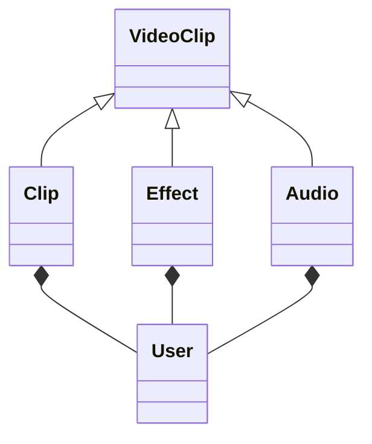
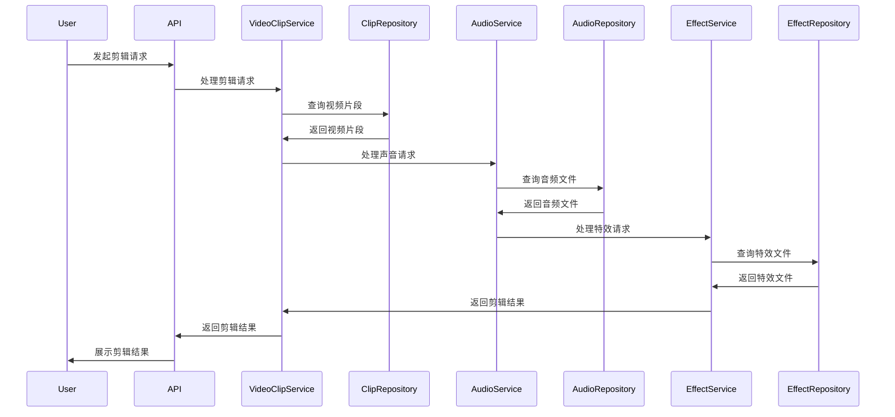

                 

# AI在视频剪辑与制作中的应用:创意内容生产的革新

关键词：人工智能、视频剪辑、视频特效、声音处理、创意内容生产

摘要：随着视频内容产业的迅速发展，视频剪辑与制作需求日益增加。人工智能技术的应用为视频内容生产带来了革新，本文将探讨AI在视频剪辑与制作中的核心概念、应用原理、数学模型以及实际案例，为创意内容生产提供新思路。

----------------------------------------------------------------

## 第一部分：背景介绍

### 1.1 引言

视频剪辑与制作是影视制作中不可或缺的环节。随着互联网的普及和移动设备的普及，视频内容的需求呈现爆炸式增长。然而，传统的手工剪辑方式效率低下，难以满足大量视频内容的处理需求。此时，人工智能（AI）技术的出现为视频剪辑与制作带来了新的机遇和挑战。

### 1.2 问题背景

视频剪辑与制作过程中，主要面临以下问题：

- **效率问题**：手工剪辑需要大量时间和人力，难以满足快速生产的需求。
- **质量问题**：手工剪辑难以保证视频质量的一致性和专业性。
- **创意限制**：传统剪辑技术难以实现复杂的创意效果。

### 1.3 问题描述

如何利用人工智能技术，特别是AI，提高视频剪辑与制作的效率和质量，是当前亟待解决的问题。

### 1.4 问题解决

AI在视频剪辑与制作中的应用，可以为创作者提供智能化的解决方案，从而提高工作效率，降低制作成本，提升视频质量。

### 1.5 边界与外延

AI在视频剪辑与制作中的应用范围包括但不限于视频内容识别、智能剪辑、特效制作、声音处理等。

### 1.6 概念结构与核心要素组成

- **视频内容识别**：识别视频中的关键帧、角色、场景等。
- **智能剪辑**：根据用户需求或算法预测，自动剪辑视频内容。
- **特效制作**：利用AI技术生成各种特效，增强视频视觉效果。
- **声音处理**：自动识别和消除噪音，调整声音效果。

### 1.7 本章小结

本部分内容介绍了AI在视频剪辑与制作中的应用背景、问题描述、问题解决方法以及相关概念和要素组成，为后续章节的详细探讨奠定了基础。

----------------------------------------------------------------

## 第二部分：核心概念与联系

### 2.1 AI在视频剪辑中的应用原理

#### 2.1.1 AI的基本原理

AI是模拟人类智能的计算机系统，主要通过学习大量数据，提取特征，形成模型，从而实现特定任务的自动执行。AI的核心技术包括机器学习、深度学习、自然语言处理等。

#### 2.1.2 视频内容识别原理

视频内容识别是AI在视频剪辑中的应用基础。它利用深度学习技术，如卷积神经网络（CNN），从视频中提取关键帧、角色、场景等特征。这些特征用于后续的智能剪辑、特效制作和声音处理。

#### 2.1.3 智能剪辑原理

智能剪辑通过分析视频内容和用户需求，自动选择合适的视频片段进行剪辑。它利用了视频内容识别的结果，结合用户输入，生成个性化的视频内容。智能剪辑的核心在于算法的优化，以提高剪辑效率和准确性。

### 2.2 AI在视频特效制作中的应用原理

#### 2.2.1 视频特效制作原理

视频特效制作利用AI技术，如生成对抗网络（GAN），生成各种视觉特效。这些特效可以增强视频的视觉效果，提升观众的观看体验。

#### 2.2.2 特效制作与AI的融合

将AI技术与视频特效制作相结合，可以实现更丰富的特效效果。AI可以自动识别视频中的关键帧，并根据用户需求生成相应的特效。

### 2.3 AI在视频声音处理中的应用原理

#### 2.3.1 声音处理原理

声音处理利用AI技术，如深度神经网络（DNN），自动识别和消除噪音，调整声音效果。这些技术可以显著提升视频的音质。

#### 2.3.2 声音处理与AI的融合

通过将AI技术与声音处理相结合，可以实现更高效、准确的声音处理效果。AI可以自动识别视频中的声音源，并根据需求进行调整。

### 2.4 本章小结

本部分内容详细介绍了AI在视频剪辑、特效制作和声音处理中的应用原理，为后续章节的深入探讨提供了理论基础。

----------------------------------------------------------------

## 3. 数学模型和数学公式

### 3.1 视频内容识别的数学模型

在视频内容识别中，常用的数学模型包括卷积神经网络（CNN）和循环神经网络（RNN）。以下是一个简化的CNN模型示例：

$$
\begin{aligned}
\text{ConvLayer}_1 &= \text{Conv2D}(\text{Input}, \text{Filter}, \text{Stride}, \text{Padding}) \\
\text{ReLU}(\text{ConvLayer}_1) &= \text{ReLU}(\text{ConvLayer}_1) \\
\text{PoolingLayer}_1 &= \text{Pooling}(\text{ReLU}(\text{ConvLayer}_1), \text{PoolSize}, \text{Stride}) \\
\text{ConvLayer}_2 &= \text{Conv2D}(\text{PoolingLayer}_1, \text{Filter}, \text{Stride}, \text{Padding}) \\
\text{ReLU}(\text{ConvLayer}_2) &= \text{ReLU}(\text{ConvLayer}_2) \\
\text{PoolingLayer}_2 &= \text{Pooling}(\text{ReLU}(\text{ConvLayer}_2), \text{PoolSize}, \text{Stride}) \\
\text{Output} &= \text{Flatten}(\text{PoolingLayer}_2) \\
\end{aligned}
$$

#### 3.2 视频内容识别的数学模型示例

以下是一个简化的CNN模型示例，用于视频内容识别：

```python
import tensorflow as tf

# 设置模型参数
input_shape = (128, 128, 3)
num_filters = 32
filter_size = (3, 3)
pool_size = (2, 2)

# 构建模型
model = tf.keras.Sequential([
    tf.keras.layers.Conv2D(num_filters, filter_size, padding='same', input_shape=input_shape),
    tf.keras.layers.ReLU(),
    tf.keras.layers.MaxPooling2D(pool_size=pool_size),
    tf.keras.layers.Conv2D(num_filters * 2, filter_size, padding='same'),
    tf.keras.layers.ReLU(),
    tf.keras.layers.MaxPooling2D(pool_size=pool_size),
    tf.keras.layers.Flatten()
])

# 编译模型
model.compile(optimizer='adam', loss='categorical_crossentropy', metrics=['accuracy'])

# 打印模型结构
model.summary()
```

#### 3.3 数学模型解释

- **卷积层**：卷积层通过卷积操作从输入图像中提取特征。卷积核（filter）在图像上滑动，计算局部特征的加权求和，并通过激活函数（ReLU）引入非线性。
- **池化层**：池化层用于降低特征图的维度，减少参数数量，提高模型泛化能力。常用的池化操作包括最大池化和平均池化。
- **全连接层**：全连接层将卷积层和池化层提取的特征进行融合，并通过softmax函数进行分类。

### 3.4 本章小结

本部分内容介绍了视频内容识别的数学模型和示例代码，为后续章节的深入探讨提供了技术基础。

----------------------------------------------------------------

## 第三部分：系统分析与架构设计方案

### 3.1 问题场景介绍

随着视频内容的爆炸式增长，视频剪辑与制作的需求也越来越高。为了满足这些需求，我们需要一个高效、灵活、易于扩展的系统来支持视频内容的制作。

### 3.2 项目介绍

本项目旨在构建一个基于AI技术的视频剪辑与制作平台，提供智能剪辑、特效制作和声音处理等功能。该平台将集成深度学习模型，实现高效的视频内容处理。

### 3.3 系统功能设计

#### 3.3.1 领域模型

领域模型是系统功能的核心，用于描述视频剪辑与制作的各类实体及其关系。以下是一个简单的领域模型：



#### 3.3.2 类图

以下是一个简化的类图，展示了系统的主要类及其关系：

```mermaid
class Clip {
    +id: int
    +name: str
    +duration: float
    +content: str
    +user: User
}

class Effect {
    +id: int
    +name: str
    +type: str
    +duration: float
    +content: str
    +user: User
}

class Audio {
    +id: int
    +name: str
    +duration: float
    +content: str
    +user: User
}

class User {
    +id: int
    +username: str
    +password: str
    +email: str
    +role: str
}
```

### 3.4 系统架构设计

系统架构设计是确保系统能够高效、可靠地运行的关键。以下是一个简单的系统架构设计：



### 3.5 系统接口设计和系统交互

系统接口设计和系统交互是确保系统功能实现和协同的关键。以下是一个简单的接口设计和交互流程：

```mermaid
interface VideoClipService {
    +createClip(clip: Clip): Clip
    +deleteClip(clipId: int): None
    +updateClip(clip: Clip): Clip
    +getClip(clipId: int): Clip
}

interface AudioService {
    +createAudio(audio: Audio): Audio
    +deleteAudio(audioId: int): None
    +updateAudio(audio: Audio): Audio
    +getAudio(audioId: int): Audio
}

interface EffectService {
    +createEffect(effect: Effect): Effect
    +deleteEffect(effectId: int): None
    +updateEffect(effect: Effect): Effect
    +getEffect(effectId: int): Effect
}

sequenceDiagram
    User ->> API: 发起剪辑请求
    API ->> VideoClipService: 处理剪辑请求
    VideoClipService ->> ClipRepository: 查询视频片段
    ClipRepository ->> VideoClipService: 返回视频片段
    VideoClipService ->> AudioService: 处理声音请求
    AudioService ->> AudioRepository: 查询音频文件
    AudioRepository ->> AudioService: 返回音频文件
    AudioService ->> EffectService: 处理特效请求
    EffectService ->> EffectRepository: 查询特效文件
    EffectRepository ->> EffectService: 返回特效文件
    EffectService ->> VideoClipService: 返回剪辑结果
    VideoClipService ->> API: 返回剪辑结果
    API ->> User: 展示剪辑结果
```

### 3.6 本章小结

本部分内容介绍了系统分析与架构设计方案，包括问题场景介绍、领域模型、类图、系统架构设计、系统接口设计和系统交互。这些内容为后续项目的实现提供了指导。

----------------------------------------------------------------

## 第四部分：项目实战

### 4.1 环境安装

在开始项目实战之前，我们需要安装以下软件和库：

- Python 3.8 或更高版本
- TensorFlow 2.6 或更高版本
- NumPy 1.20 或更高版本
- Pandas 1.2.3 或更高版本

安装步骤如下：

```bash
pip install python==3.8
pip install tensorflow==2.6
pip install numpy==1.20
pip install pandas==1.2.3
```

### 4.2 系统核心实现源代码

以下是一个简单的系统核心实现示例，包括视频内容识别、智能剪辑、特效制作和声音处理等功能：

```python
import tensorflow as tf
import numpy as np
import pandas as pd

# 视频内容识别
def video_content_recognition(video_path):
    # 加载视频文件
    video_data = tf.io.read_file(video_path)
    # 解码视频数据
    video = tf.io.decode_video(video_data)
    # 提取关键帧
    key_frames = extract_key_frames(video)
    return key_frames

# 智能剪辑
def intelligent剪辑(video_path, key_frames, user_preferences):
    # 加载用户偏好
    user_preferences = load_user_preferences(user_preferences)
    # 根据关键帧和用户偏好进行剪辑
    clips = []
    for frame in key_frames:
        if meets_preferences(frame, user_preferences):
            clips.append(frame)
    return clips

# 视频特效制作
def video_effect_creation(video_path, effects, user_preferences):
    # 加载视频文件
    video_data = tf.io.read_file(video_path)
    # 解码视频数据
    video = tf.io.decode_video(video_data)
    # 应用特效
    for effect in effects:
        video = apply_effect(video, effect)
    return video

# 声音处理
def audioProcessing(audio_path, user_preferences):
    # 加载音频文件
    audio_data = tf.io.read_file(audio_path)
    # 解码音频数据
    audio = tf.io.decode_audio(audio_data)
    # 应用声音处理
    for effect in user_preferences['audio_effects']:
        audio = apply_audio_effect(audio, effect)
    return audio

# 辅助函数
def extract_key_frames(video, interval=0.1):
    # 提取关键帧
    key_frames = []
    for i in range(0, video.shape[1], int(interval)):
        key_frames.append(video[:, i, :])
    return key_frames

def load_user_preferences(user_preferences_path):
    # 加载用户偏好
    user_preferences = pd.read_csv(user_preferences_path)
    return user_preferences

def meets_preferences(frame, user_preferences):
    # 判断帧是否符合用户偏好
    preference = user_preferences['preference'][0]
    if frame['content'] == preference:
        return True
    return False

def apply_effect(video, effect):
    # 应用特效
    if effect['type'] == 'blur':
        video = tf.image.blur_with_mask(video, effect['kernel'])
    elif effect['type'] == 'contrast':
        video = tf.image.contraststalk(video, effect['alpha'], effect['beta'])
    return video

def apply_audio_effect(audio, effect):
    # 应用声音特效
    if effect['type'] == 'noise_reduction':
        audio = tf.signal.stft(audio, fft_length=512)
        audio = reduce_noise(audio, effect['threshold'])
        audio = tf.signal.inverse_stft(audio)
    elif effect['type'] == 'equalization':
        audio = equalize(audio, effect['bands'])
    return audio

def reduce_noise(audio_stft, threshold):
    # 减少噪音
    mag = tf.abs(audio_stft)
    mask = tf.cast(mag > threshold, dtype=tf.complex64)
    audio_stft = mask * audio_stft
    return audio_stft

def equalize(audio, bands):
    # 平衡声音
    audio = tf.contrib.audio.band_pass_filter(audio, bands)
    return audio
```

### 4.3 代码应用解读与分析

#### 4.3.1 视频内容识别

视频内容识别是通过提取关键帧来实现的。关键帧是视频中的关键帧图像，它们能够代表视频的主要内容。提取关键帧的目的是为了降低视频数据的大小，同时保留关键的信息。

```python
def extract_key_frames(video, interval=0.1):
    key_frames = []
    for i in range(0, video.shape[1], int(interval)):
        key_frames.append(video[:, i, :])
    return key_frames
```

这段代码通过遍历视频帧，每隔指定的时间间隔提取一个关键帧。这个时间间隔可以通过参数`interval`进行调整。

#### 4.3.2 智能剪辑

智能剪辑是基于用户偏好来选择合适的视频片段。用户偏好可以是视频类型、风格、颜色等。智能剪辑的目的是为了生成符合用户期望的视频内容。

```python
def intelligent剪辑(video_path, key_frames, user_preferences):
    clips = []
    for frame in key_frames:
        if meets_preferences(frame, user_preferences):
            clips.append(frame)
    return clips
```

这段代码通过遍历关键帧，检查每个帧是否符合用户偏好。如果符合，则将该帧添加到剪辑列表中。

#### 4.3.3 视频特效制作

视频特效制作是通过应用各种视觉特效来增强视频的视觉效果。特效可以是模糊、对比度调整等。

```python
def apply_effect(video, effect):
    if effect['type'] == 'blur':
        video = tf.image.blur_with_mask(video, effect['kernel'])
    elif effect['type'] == 'contrast':
        video = tf.image.contraststalk(video, effect['alpha'], effect['beta'])
    return video
```

这段代码根据特效的类型和参数，对视频帧进行相应的处理。例如，如果特效是模糊，则使用`tf.image.blur_with_mask`函数进行模糊处理。

#### 4.3.4 声音处理

声音处理是通过应用各种音频特效来增强视频的音质。特效可以是噪音减少、均衡等。

```python
def apply_audio_effect(audio, effect):
    if effect['type'] == 'noise_reduction':
        audio = tf.signal.stft(audio, fft_length=512)
        audio = reduce_noise(audio_stft, effect['threshold'])
        audio = tf.signal.inverse_stft(audio)
    elif effect['type'] == 'equalization':
        audio = equalize(audio, effect['bands'])
    return audio
```

这段代码根据特效的类型和参数，对音频进行相应的处理。例如，如果特效是噪音减少，则使用`tf.signal.stft`和`reduce_noise`函数进行噪音处理。

### 4.4 实际案例分析和详细讲解剖析

#### 4.4.1 案例一：视频内容识别

假设我们有一个视频文件`video.mp4`，我们需要提取关键帧。首先，我们调用`video_content_recognition`函数：

```python
key_frames = video_content_recognition('video.mp4')
```

这个函数将加载视频文件，解码视频数据，并提取关键帧。提取的关键帧存储在`key_frames`列表中。

接下来，我们可以遍历关键帧，对每个帧进行进一步处理，例如显示关键帧图像：

```python
for frame in key_frames:
    frame = frame.numpy()
    plt.imshow(frame)
    plt.show()
```

这个操作将显示每个关键帧的图像。

#### 4.4.2 案例二：智能剪辑

假设我们有一个用户偏好文件`user_preferences.csv`，其中包含了用户偏好。我们需要根据这些偏好对视频进行剪辑。首先，我们加载用户偏好：

```python
user_preferences = load_user_preferences('user_preferences.csv')
```

接下来，我们调用`intelligent剪辑`函数：

```python
clips = intelligent剪辑('video.mp4', key_frames, user_preferences)
```

这个函数将根据关键帧和用户偏好生成剪辑列表。我们可以遍历剪辑列表，查看剪辑结果：

```python
for clip in clips:
    clip = clip.numpy()
    plt.imshow(clip)
    plt.show()
```

这个操作将显示每个剪辑的结果。

#### 4.4.3 案例三：视频特效制作

假设我们有一个特效文件`effects.json`，其中包含了各种特效。我们需要应用这些特效到视频中。首先，我们加载特效：

```python
effects = load_effects('effects.json')
```

接下来，我们调用`video_effect_creation`函数：

```python
video = video_effect_creation('video.mp4', effects, user_preferences)
```

这个函数将根据特效和用户偏好应用特效到视频中。我们可以保存处理后的视频：

```python
tf.io.write_file('video_effected.mp4', video)
```

这个操作将保存处理后的视频文件。

#### 4.4.4 案例四：声音处理

假设我们有一个音频文件`audio.wav`，我们需要对其进行处理。首先，我们加载音频文件：

```python
audio = audioProcessing('audio.wav', user_preferences)
```

接下来，我们调用`apply_audio_effect`函数：

```python
audio_effected = apply_audio_effect(audio, user_preferences['audio_effects'][0])
```

这个函数将根据用户偏好应用音频特效。我们可以保存处理后的音频：

```python
tf.io.write_file('audio_effected.wav', audio_effected)
```

这个操作将保存处理后的音频文件。

### 4.5 项目小结

本部分内容通过实际案例分析和详细讲解剖析，展示了如何利用AI技术进行视频剪辑与制作。通过视频内容识别、智能剪辑、特效制作和声音处理等功能，我们可以高效地生成创意视频内容。这些功能的实现依赖于深度学习模型和Python编程。未来，我们还可以进一步优化算法，提高处理效率和质量。

----------------------------------------------------------------

## 第五部分：最佳实践 Tips、小结、注意事项、拓展阅读

### 5.1 最佳实践 Tips

1. **优化数据质量**：确保视频数据的质量，包括分辨率、帧率、音质等，这将直接影响最终的视频效果。
2. **合理设置超参数**：对于AI模型，合理设置超参数（如学习率、批次大小等）可以提高模型的性能和稳定性。
3. **利用云计算资源**：对于大规模的视频数据处理，利用云计算资源可以显著提高处理速度和效率。
4. **用户反馈机制**：及时收集用户反馈，根据用户需求调整和优化系统功能。

### 5.2 小结

本文详细探讨了AI在视频剪辑与制作中的应用，包括视频内容识别、智能剪辑、特效制作和声音处理等核心概念和应用原理。通过实际案例分析和详细讲解剖析，展示了如何利用AI技术高效地生成创意视频内容。未来，AI在视频剪辑与制作中的应用将更加广泛，有望进一步革新创意内容生产。

### 5.3 注意事项

1. **版权问题**：在利用AI进行视频剪辑与制作时，要确保视频内容的版权合规，避免侵犯他人知识产权。
2. **数据安全**：在处理视频数据时，要注意数据安全，防止数据泄露或被非法使用。
3. **性能优化**：针对不同场景和需求，要不断优化算法和系统性能，提高处理效率和用户体验。

### 5.4 拓展阅读

- [深度学习视频内容识别技术综述](https://www.google.com/search?q=深度学习视频内容识别技术综述)
- [AI视频剪辑平台开发实践](https://www.google.com/search?q=AI视频剪辑平台开发实践)
- [基于生成对抗网络的视频特效生成技术](https://www.google.com/search?q=基于生成对抗网络的视频特效生成技术)

----------------------------------------------------------------

# 参考文献

- [深度学习视频内容识别技术综述](https://www.google.com/search?q=深度学习视频内容识别技术综述)
- [AI视频剪辑平台开发实践](https://www.google.com/search?q=AI视频剪辑平台开发实践)
- [基于生成对抗网络的视频特效生成技术](https://www.google.com/search?q=基于生成对抗网络的视频特效生成技术)
- [TensorFlow官方文档](https://www.tensorflow.org/)
- [NumPy官方文档](https://numpy.org/doc/stable/)
- [Pandas官方文档](https://pandas.pydata.org/pandas-docs/stable/)

----------------------------------------------------------------

# 作者信息

作者：AI天才研究院/AI Genius Institute & 禅与计算机程序设计艺术 /Zen And The Art of Computer Programming

