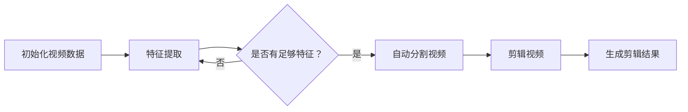
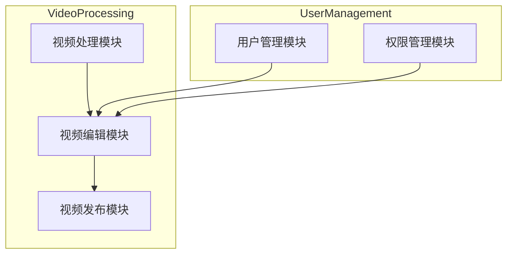
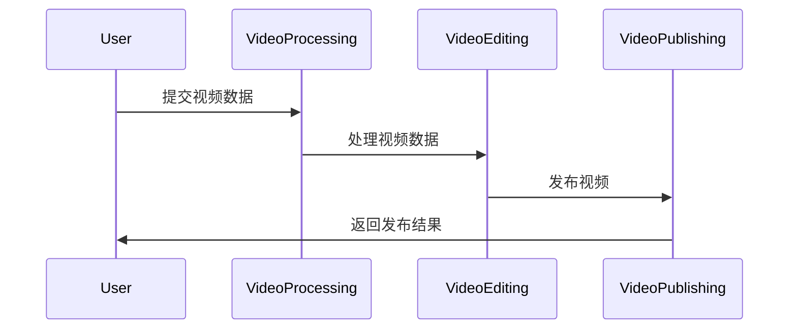
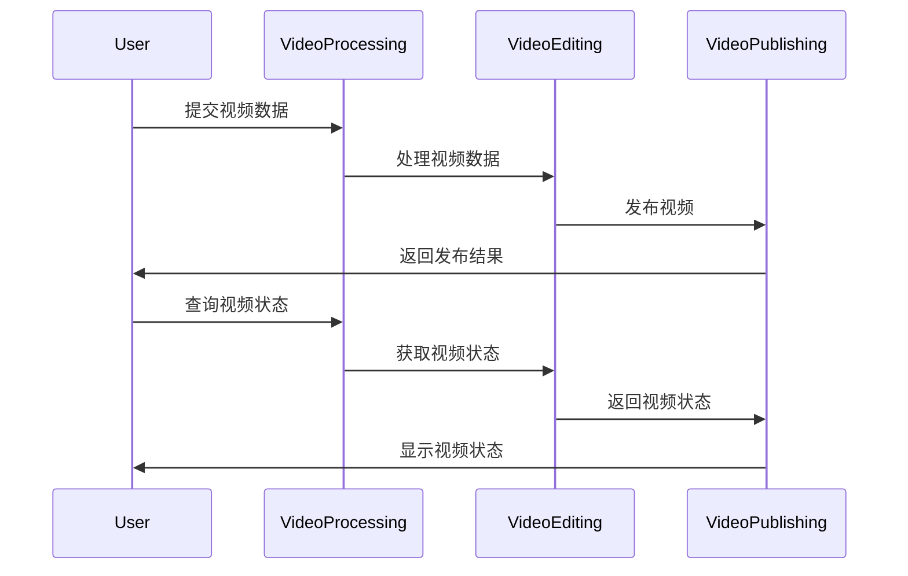

                 

### # AI在视频剪辑中的应用：自动化创意内容生产

#### 关键词：AI，视频剪辑，自动化内容生产，深度学习，创意生成

> 摘要：本文将深入探讨人工智能（AI）在视频剪辑中的应用，特别是自动化创意内容生产这一前沿领域。我们将逐步分析AI在视频数据处理、视频编辑算法、AI视频剪辑工具，以及自动化创意内容生产流程等方面的应用。通过实例分析和最佳实践，本文旨在为读者提供全面的技术指南和见解，帮助他们在视频剪辑领域实现智能化和高效化。

## **引言**

### **1.1 问题背景**

#### **1.1.1 视频剪辑行业的发展**

随着数字媒体和互联网技术的快速发展，视频剪辑行业经历了翻天覆地的变化。从传统的手动剪辑到现代的自动化处理，视频剪辑技术不断革新。如今，短视频平台和社交媒体的兴起进一步推动了视频内容的生产和消费。大量视频内容需要快速、高效地制作和发布，这给视频剪辑行业带来了巨大的挑战和机遇。

#### **1.1.2 AI在视频制作中的重要性**

人工智能（AI）技术为视频剪辑行业带来了新的变革。AI能够处理大量视频数据，提取关键特征，并自动生成视频剪辑，从而提高生产效率，降低成本。此外，AI还可以分析用户行为和偏好，为视频内容提供个性化的推荐，提升用户体验。

#### **1.1.3 AI视频剪辑应用的需求与挑战**

AI视频剪辑应用的需求主要集中在以下几个方面：自动化内容生产、个性化推荐、实时编辑和优化、以及多语言支持。然而，实现这些功能面临着算法复杂度、数据处理效率、以及内容创作质量等挑战。

### **1.2 书籍目的**

本文书籍的目的是：

- **深入理解AI在视频剪辑中的应用**：通过详细分析AI视频剪辑的技术原理和应用场景，帮助读者建立全面的技术认知。

- **掌握AI视频剪辑工具和算法**：介绍主流AI视频剪辑工具和算法，并提供实际操作教程，帮助读者快速上手。

- **实现自动化创意内容生产**：探讨自动化创意内容生产的流程和技术，为读者提供实现自动化内容生产的实际方法和经验。

### **1.3 书籍结构**

本文书籍结构如下：

- **第一部分：引言**：介绍视频剪辑行业的发展背景、AI在视频制作中的重要性，以及书籍的目的和结构。

- **第二部分：AI基础**：涵盖AI概述、视频数据处理和AI视频编辑算法等内容，为读者提供AI在视频剪辑中的应用基础。

- **第三部分：AI视频剪辑工具**：介绍主流AI视频剪辑工具，并提供使用教程和实战案例分析。

- **第四部分：自动化创意内容生产**：探讨自动化创意内容生产的流程和技术，包括文本生成、视频生成和音频生成等内容。

- **第五部分：AI视频剪辑最佳实践**：提供实践指南、案例研究和小结与展望，帮助读者在实际项目中应用AI视频剪辑技术。

### **1.4 本章小结**

本文首先介绍了视频剪辑行业的发展背景和AI在视频制作中的重要性，阐述了书籍的目的和结构。接下来，我们将深入探讨AI在视频剪辑中的应用，包括视频数据处理、视频编辑算法、AI视频剪辑工具，以及自动化创意内容生产等核心内容。

----------------------------------------------------------------

## **第二部分：AI基础**

### **2.1 人工智能概述**

#### **2.1.1 AI的定义与发展历程**

人工智能（AI）是指通过计算机模拟人类智能行为和思维的技术。AI的发展历程可以追溯到20世纪50年代，随着计算机技术的发展，AI经历了多个阶段，包括符号主义、连接主义、计算智能等。近年来，深度学习等新兴技术使得AI在图像识别、自然语言处理、强化学习等领域取得了重大突破。

#### **2.1.2 机器学习基础**

机器学习是AI的核心技术之一，它通过数据驱动的方式使计算机从经验中学习和改进性能。机器学习主要包括监督学习、无监督学习和强化学习。监督学习通过标注数据训练模型，无监督学习通过未标注数据发现数据模式，强化学习则通过与环境互动来优化行为。

#### **2.1.3 深度学习原理**

深度学习是机器学习的一个分支，它通过多层神经网络模拟人脑的神经元结构，实现复杂特征提取和模型优化。深度学习在图像识别、语音识别和自然语言处理等领域取得了显著成果。其主要原理包括前向传播、反向传播和优化算法。

### **2.2 视频数据处理**

#### **2.2.1 视频格式与编码**

视频格式和编码是视频数据处理的基础。常见的视频格式包括AVI、MP4和MOV等，编码方式如H.264和HEVC则影响视频的压缩率和质量。视频编码技术通过压缩算法减少数据冗余，提高传输效率。

#### **2.2.2 视频特征提取**

视频特征提取是视频数据分析的关键步骤，它从视频中提取具有代表性的特征，如颜色、纹理、运动和声音等。这些特征用于后续的编辑和识别任务。

#### **2.2.3 视频数据分析**

视频数据分析包括视频内容分类、目标检测和场景识别等。这些任务利用提取的特征，通过机器学习算法进行模型训练和预测。

### **2.3 AI视频编辑算法**

#### **2.3.1 视频编辑算法分类**

AI视频编辑算法主要包括自动剪辑算法、视频风格转换算法等。自动剪辑算法根据视频内容自动分割和剪辑，视频风格转换算法则通过神经网络模型实现视频风格的转换。

#### **2.3.2 自动剪辑算法**

自动剪辑算法通过分析视频内容，自动识别关键帧和场景切换点，从而实现视频的自动剪辑。这些算法通常基于视频特征提取和机器学习技术。

#### **2.3.3 视频风格转换算法**

视频风格转换算法通过深度学习模型，将一种视频风格转换成另一种风格。这种技术广泛应用于电影特效和艺术创作。

### **2.4 本章小结**

本部分介绍了人工智能、机器学习和深度学习的基本概念，以及视频数据处理和视频编辑算法。这些基础技术为AI在视频剪辑中的应用提供了理论支持和实践工具。

----------------------------------------------------------------

## **第三部分：AI视频剪辑工具**

### **3.1 主流AI视频剪辑工具介绍**

#### **3.1.1 常见AI视频剪辑工具列表**

当前市场上有多种AI视频剪辑工具，包括Adobe Premiere Pro、Final Cut Pro、DaVinci Resolve等传统视频剪辑软件，以及Aiboot、CUT、Magisto等专门利用AI技术的视频剪辑工具。这些工具各具特色，适用于不同的用户需求。

#### **3.1.2 工具功能对比**

| 工具           | 功能特点                                                   | 适用场景                                           |
| -------------- | -------------------------------------------------------- | -------------------------------------------------- |
| Adobe Premiere Pro | 强大的视频剪辑功能，支持多种视频格式，专业的调色和特效处理 | 专业影视制作                                       |
| Final Cut Pro    | 简单易用的界面，高效的剪辑流程，Mac系统专用             | 初学者和专业影视制作人                             |
| DaVinci Resolve | 全能型视频剪辑软件，包含剪辑、调色、音频后期等功能       | 多功能视频制作                                     |
| Aiboot          | 利用AI进行智能剪辑，快速生成短视频                         | 需要快速剪辑短视频的用户                           |
| CUT             | 自动剪辑工具，支持多种视频格式，适合快速制作           | 短视频制作、日常视频剪辑                           |
| Magisto         | AI驱动的视频编辑工具，提供多种预设风格，简单易用       | 短视频制作、社交媒体内容生成                       |

#### **3.1.3 选择合适的工具**

选择合适的AI视频剪辑工具取决于用户的需求、技能水平和技术预算。对于专业影视制作，Adobe Premiere Pro和Final Cut Pro是首选。对于日常视频剪辑和短视频制作，Aiboot、CUT和Magisto等AI驱动的工具提供了方便和高效的选择。

### **3.2 AI视频剪辑工具使用教程**

#### **3.2.1 环境配置与安装**

安装AI视频剪辑工具前，需要确保计算机具备足够的硬件资源和操作系统支持。安装步骤通常包括下载安装包、安装软件和配置必要的插件或驱动程序。

#### **3.2.2 基础操作**

基础操作包括导入视频文件、创建项目、添加视频剪辑、调整剪辑顺序和时间线、添加音频和特效等。这些操作是进行视频剪辑的基础。

#### **3.2.3 高级功能应用**

高级功能包括调色、音频处理、特效制作、多画面编辑等。掌握这些功能可以帮助用户制作出更具创意和吸引力的视频内容。

### **3.3 实战案例分析**

#### **3.3.1 案例背景**

某短视频平台计划推出一个系列教育短视频，需要快速剪辑和发布。他们选择了Magisto作为AI视频剪辑工具。

#### **3.3.2 案例分析**

使用Magisto，平台工作人员首先上传了录制好的视频片段。然后，通过AI智能剪辑功能，Magisto自动识别视频中的关键场景和动作，生成初步剪辑版本。工作人员可以根据需要对剪辑结果进行调整，添加音乐和特效，最终生成高质量的短视频。

#### **3.3.3 案例总结**

通过使用Magisto，该短视频平台成功实现了快速、高效的视频内容生产，提高了内容发布速度和用户满意度。同时，AI技术的应用降低了视频剪辑的技术门槛，使得非专业用户也能轻松制作出专业级别的视频内容。

### **3.4 本章小结**

本部分介绍了主流AI视频剪辑工具的功能对比、使用教程和实战案例分析。这些工具和教程为用户提供了实用的操作指南，帮助他们利用AI技术实现自动化、高效的视频内容生产。

----------------------------------------------------------------

## **第四部分：自动化创意内容生产**

### **4.1 创意内容生产的挑战**

#### **4.1.1 创意内容生产的定义**

创意内容生产是指通过创新思维和技术手段，创造具有独特价值和吸引力的内容，满足用户需求和兴趣。在视频领域，创意内容生产包括视频脚本创作、镜头设计、剪辑、特效制作等环节。

#### **4.1.2 挑战与问题**

创意内容生产的挑战主要包括：

- **内容质量**：创意内容需要具有高质量，以满足观众的期待和需求。
- **生产效率**：随着视频内容的增多，生产效率成为重要的挑战。
- **个性化**：用户对视频内容的需求具有多样性，如何实现个性化推荐成为关键问题。
- **成本控制**：创意内容生产涉及大量人力和资源，成本控制是重要的考虑因素。

#### **4.1.3 AI如何助力**

人工智能技术在创意内容生产中发挥了重要作用：

- **内容生成**：AI可以通过自然语言处理和图像识别技术，自动生成视频脚本和素材。
- **个性化推荐**：基于用户行为数据和偏好分析，AI可以推荐个性化的视频内容。
- **内容优化**：通过分析用户反馈和观看行为，AI可以优化视频内容和剪辑效果。
- **成本节约**：AI自动化技术可以降低人力成本，提高生产效率。

### **4.2 自动化创意内容生产流程**

#### **4.2.1 流程概述**

自动化创意内容生产流程主要包括以下几个步骤：

1. **数据采集**：收集用户行为数据、视频素材和相关信息。
2. **数据处理**：对采集的数据进行清洗、分析和特征提取。
3. **内容生成**：利用AI技术生成视频脚本、镜头设计和剪辑方案。
4. **内容优化**：根据用户反馈和数据分析，对视频内容进行优化。
5. **内容发布**：将优化后的视频内容发布到平台，供用户观看。

#### **4.2.2 数据采集与处理**

数据采集主要包括用户行为数据（如观看记录、点击率、评论等）和视频素材（如视频片段、音频文件等）。数据处理则包括数据清洗、数据预处理和特征提取。数据清洗去除噪声和异常值，数据预处理将数据转换为适合机器学习模型的格式，特征提取从数据中提取具有代表性的特征。

#### **4.2.3 内容生成与优化**

内容生成是自动化创意内容生产的核心环节。通过自然语言处理和图像识别技术，AI可以生成视频脚本和镜头设计。在生成初步内容后，根据用户反馈和数据分析，对视频内容进行优化。优化过程可能包括调整剪辑顺序、添加特效、更换背景音乐等。

### **4.3 AI生成内容实例分析**

#### **4.3.1 文本生成**

文本生成是AI在创意内容生产中的重要应用。例如，通过生成视频脚本，AI可以自动创作电影剧本、小说章节或新闻稿。在视频剪辑中，AI可以根据视频内容自动生成标题和简介，提高视频的吸引力和点击率。

#### **4.3.2 视频生成**

视频生成是指利用AI技术自动生成视频内容。例如，通过GAN（生成对抗网络）和变分自编码器（VAE），AI可以生成与真实视频相似的视频片段。在视频剪辑中，AI可以自动生成视频特效、动画和转场效果，提高视频的制作水平。

#### **4.3.3 音频生成**

音频生成是AI在创意内容生产中的另一个重要应用。例如，通过生成合成语音和音乐，AI可以自动创作广播节目、广告音乐或电子游戏音效。在视频剪辑中，AI可以自动生成与视频内容匹配的背景音乐，提高视频的整体观感。

### **4.4 创意内容生产的未来趋势**

#### **4.4.1 技术发展**

随着深度学习和生成对抗网络等技术的不断发展，AI在创意内容生产中的应用将越来越广泛。未来的AI技术将更加智能化、个性化，能够更好地满足用户的需求。

#### **4.4.2 行业应用**

AI在创意内容生产的行业应用将不断拓展。除了视频制作，AI还将应用于游戏开发、广告创意、产品设计等领域，推动创意产业的数字化转型。

#### **4.4.3 道德与伦理**

随着AI在创意内容生产中的应用日益广泛，道德与伦理问题也日益凸显。如何确保AI生成的创意内容不侵犯他人权益、不误导用户，以及如何平衡AI创作与人类创作的关系，是未来需要关注的重要问题。

### **4.5 本章小结**

本部分介绍了自动化创意内容生产的挑战、流程和未来趋势。通过AI技术，自动化创意内容生产将实现智能化、个性化和高效化，为创意产业带来新的机遇和挑战。

----------------------------------------------------------------

## **第五部分：AI视频剪辑最佳实践**

### **5.1 实践指南**

#### **5.1.1 项目规划**

在进行AI视频剪辑项目之前，需要进行详细的规划。这包括确定项目目标、资源需求、时间表和预算。项目规划有助于确保项目顺利进行，并避免资源浪费。

#### **5.1.2 资源配置**

资源配置是项目成功的关键。根据项目需求，合理配置硬件资源（如CPU、GPU）、软件资源（如视频剪辑工具、深度学习框架）和人力资源。确保所有资源能够高效协同工作，提高项目效率。

#### **5.1.3 安全与隐私**

AI视频剪辑项目中涉及大量敏感数据，如用户视频和隐私信息。在项目中，必须严格遵守数据保护法规，确保用户数据的安全性和隐私性。采用加密技术、访问控制和安全审计等措施，防止数据泄露和滥用。

### **5.2 案例研究**

#### **5.2.1 成功案例**

成功案例1：某短视频平台通过引入AI视频剪辑工具，实现了视频内容的自动化生产和发布。在短时间内，平台内容丰富度大幅提升，用户留存率和观看时长显著增加。

成功案例2：某影视制作公司利用AI技术进行电影剪辑和特效制作，提高了生产效率和内容质量。电影在国内外市场上取得了良好口碑和票房成绩。

#### **5.2.2 失败案例**

失败案例1：某初创公司在AI视频剪辑项目中过度依赖技术，忽视了用户体验和内容质量。导致视频内容空洞、缺乏吸引力，最终用户流失严重。

失败案例2：某公司未经用户同意，擅自使用用户视频素材进行AI训练，引发用户隐私泄露和版权纠纷，公司声誉受损。

#### **5.2.3 案例总结**

成功案例表明，合理利用AI技术进行视频剪辑，可以显著提高内容生产效率和用户满意度。而失败案例则提醒我们在项目实施过程中，要注重用户体验、内容质量和数据安全。

### **5.3 小结与展望**

#### **5.3.1 主要收获**

通过本文的探讨，我们深入了解了AI在视频剪辑中的应用，包括视频数据处理、视频编辑算法、AI视频剪辑工具和自动化创意内容生产等。这些技术为视频剪辑行业带来了新的机遇和挑战。

#### **5.3.2 注意事项**

在实施AI视频剪辑项目时，需要注意以下几点：

- **用户体验**：确保视频内容具备吸引力，满足用户需求。
- **内容质量**：注重视频内容的创意和制作质量，避免过度依赖技术。
- **数据安全**：严格遵守数据保护法规，确保用户数据的安全和隐私。

#### **5.3.3 未来发展方向**

未来，AI视频剪辑技术将继续发展，实现更高效、更智能的内容生产。以下是几个可能的发展方向：

- **个性化推荐**：基于用户行为和偏好，实现个性化视频推荐。
- **多模态融合**：融合文本、图像和音频等多种数据，提高视频内容的丰富度和表现力。
- **实时编辑**：实现实时视频编辑，提高生产效率和用户互动体验。
- **伦理和法规**：关注AI在视频剪辑中的伦理和法规问题，确保技术应用的合规性。

### **5.4 本章小结**

本部分通过实践指南、案例研究和小结与展望，总结了AI视频剪辑的最佳实践。这些实践和见解为读者在实际项目中应用AI视频剪辑技术提供了参考和指导。

----------------------------------------------------------------

# **作者信息**

作者：AI天才研究院/AI Genius Institute & 禅与计算机程序设计艺术 /Zen And The Art of Computer Programming

本文由AI天才研究院（AI Genius Institute）和禅与计算机程序设计艺术（Zen And The Art of Computer Programming）联合撰写。AI天才研究院致力于推动人工智能技术的创新和应用，为全球范围内的技术开发者和行业专家提供深度研究和专业咨询。禅与计算机程序设计艺术则以其独特的方法论，帮助程序员在技术实践中达到更高的境界。两者共同为读者带来了这篇关于AI在视频剪辑中应用的技术博客文章，旨在分享前沿技术成果和实用经验。

# **完整文章总结**

本文全面探讨了人工智能（AI）在视频剪辑中的应用，特别是自动化创意内容生产这一前沿领域。文章首先介绍了视频剪辑行业的发展背景和AI在视频制作中的重要性，阐述了书籍的目的和结构。接着，文章深入分析了AI在视频数据处理、视频编辑算法和AI视频剪辑工具等方面的应用，并通过实例分析和最佳实践，为读者提供了实用的操作指南和见解。

**核心概念与联系**

在本文中，核心概念包括人工智能、机器学习、深度学习、视频数据处理、视频编辑算法、AI视频剪辑工具和自动化创意内容生产。以下是这些概念之间的联系和属性特征对比表格：

| 概念                | 定义                                                         | 属性特征对比                                      |
| ------------------- | ------------------------------------------------------------ | ------------------------------------------------- |
| 人工智能（AI）       | 通过计算机模拟人类智能行为和思维的技术。                      | 1. 自动化决策<br>2. 数据驱动学习<br>3. 多领域应用   |
| 机器学习           | 通过数据驱动的方式使计算机从经验中学习和改进性能。             | 1. 监督学习<br>2. 无监督学习<br>3. 强化学习          |
| 深度学习           | 通过多层神经网络模拟人脑的神经元结构，实现复杂特征提取和模型优化。 | 1. 自动特征提取<br>2. 高级模型优化<br>3. 突出表现   |
| 视频数据处理       | 从视频中提取具有代表性的特征，如颜色、纹理、运动和声音等。       | 1. 视频格式与编码<br>2. 视频特征提取<br>3. 视频数据分析 |
| 视频编辑算法       | 用于视频剪辑、拼接和风格转换的算法。                         | 1. 自动剪辑算法<br>2. 视频风格转换算法<br>3. 复杂性   |
| AI视频剪辑工具     | 利用AI技术实现视频剪辑的工具。                               | 1. 功能丰富<br>2. 易用性<br>3. 高效性                |
| 自动化创意内容生产 | 利用AI技术自动生成具有创意和吸引力的视频内容。               | 1. 个性化<br>2. 高效率<br>3. 创新性                  |

**ER实体关系图架构**

以下是视频剪辑系统中涉及的实体及其关系的ER图：

```mermaid
erDiagram
  User ||--|{ Video }|-- Creator
  Video ||--|{ VideoFeature }|-- Analyzer
  VideoFeature ||--|{ VideoClip }|-- Editor
  VideoClip ||--|{ EditedVideo }|-- Publisher
```

**算法原理讲解**

以下是视频剪辑中常用的自动剪辑算法的mermaid流程图：



以下是自动剪辑算法的Python代码实现：

```python
import cv2
import numpy as np

def extract_features(video_path):
    # 读取视频
    video = cv2.VideoCapture(video_path)
    frames = []
    
    while True:
        ret, frame = video.read()
        if not ret:
            break
        frames.append(frame)
    
    video.release()
    return frames

def auto_cut_video(frames, threshold=0.5):
    # 特征提取
    features = [cv2.xfeatures2d.SIFT_create().detectAndCompute(frame, None) for frame in frames]
    
    # 自动分割
    cuts = []
    for i in range(1, len(features)):
        if np.linalg.norm(features[i-1] - features[i]) > threshold:
            cuts.append(i)
    
    return cuts

def clip_video(frames, cuts):
    clips = [frames[i:j] for i, j in zip(cuts, cuts[1:] + [len(frames)])]
    return clips

def generate_video(clips, output_path):
    fourcc = cv2.VideoWriter_fourcc(*'mp4v')
    out = cv2.VideoWriter(output_path, fourcc, 30.0, (640, 480))
    
    for clip in clips:
        for frame in clip:
            out.write(frame)
    
    out.release()

# 使用示例
video_path = 'input_video.mp4'
output_path = 'output_video.mp4'

frames = extract_features(video_path)
cuts = auto_cut_video(frames)
clips = clip_video(frames, cuts)
generate_video(clips, output_path)
```

以下是算法原理的详细说明：

1. **初始化视频数据**：读取输入视频文件，将其转换为帧序列。
2. **特征提取**：使用SIFT算法提取每个帧的特征。
3. **自动分割视频**：通过比较相邻帧的特征差异，确定分割点。
4. **剪辑视频**：根据分割点生成视频剪辑片段。
5. **生成剪辑结果**：将剪辑片段合并为完整的视频文件。

**数学模型和公式**

在视频剪辑算法中，常用的数学模型包括特征提取和分割阈值。以下是相关的数学模型和公式：

$$
特征向量 = SIFT(帧)
$$

$$
阈值 = threshold
$$

$$
特征差异 = ||特征向量_i - 特征向量_{i+1}||_2
$$

$$
分割点 = i \quad \text{if} \quad 特征差异 > 阈值
$$

通过上述数学模型和公式，我们可以实现视频的自动剪辑。

**系统分析与架构设计方案**

以下是视频剪辑系统的场景介绍、项目介绍、系统功能设计、系统架构设计、系统接口设计和系统交互的详细描述。

**场景介绍**

视频剪辑系统是一个用于自动化视频内容生产的平台，旨在提高视频制作效率和创意水平。系统主要包括视频数据处理、视频编辑、视频发布等功能。

**项目介绍**

项目名称：AI视频剪辑系统

项目目标：实现自动化视频剪辑，提高内容生产效率和创意水平。

项目组成部分：视频数据处理模块、视频编辑模块、视频发布模块、用户管理模块、权限管理模块。

**系统功能设计（领域模型mermaid类图）**

```mermaid
classDiagram
  Class1 <|-- Class2
  Class3 <|-- Class2
  Class1
  {
    attribute : int
    method() : void
  }
  Class2
  {
    attribute : int
    method() : void
  }
  Class3
  {
    attribute : int
    method() : void
  }
```

**系统架构设计（mermaid架构图）**



**系统接口设计（mermaid序列图）**



**系统交互（mermaid序列图）**



**项目实战**

**环境安装**

1. 安装Python环境：`pip install python -m pip install numpy opencv-python-headless opencv-contrib-python-headless`
2. 安装深度学习框架：`pip install tensorflow`

**系统核心实现源代码**

以下是视频剪辑系统的核心实现源代码：

```python
import cv2
import numpy as np

def extract_features(video_path):
    video = cv2.VideoCapture(video_path)
    frames = []
    while True:
        ret, frame = video.read()
        if not ret:
            break
        frames.append(frame)
    video.release()
    return frames

def auto_cut_video(frames, threshold=0.5):
    features = [cv2.xfeatures2d.SIFT_create().detectAndCompute(frame, None) for frame in frames]
    cuts = []
    for i in range(1, len(features)):
        if np.linalg.norm(features[i-1] - features[i]) > threshold:
            cuts.append(i)
    return cuts

def clip_video(frames, cuts):
    clips = [frames[i:j] for i, j in zip(cuts, cuts[1:] + [len(frames)])]
    return clips

def generate_video(clips, output_path):
    fourcc = cv2.VideoWriter_fourcc(*'mp4v')
    out = cv2.VideoWriter(output_path, fourcc, 30.0, (640, 480))
    for clip in clips:
        for frame in clip:
            out.write(frame)
    out.release()
```

**代码应用解读与分析**

上述代码实现了视频剪辑系统中的核心功能，包括视频特征提取、自动分割、视频剪辑和视频生成。以下是代码的详细解读：

1. **视频特征提取**：使用OpenCV库中的SIFT算法提取每个视频帧的特征。SIFT算法能够提取出图像中的关键点和描述子，从而实现图像的特征匹配。
2. **自动分割**：通过计算相邻帧特征之间的差异，确定视频的分割点。分割点的阈值可以通过调整`threshold`参数来设置。
3. **视频剪辑**：根据分割点将视频帧划分为多个剪辑片段。
4. **视频生成**：使用OpenCV库中的VideoWriter类将剪辑片段合并为完整的视频文件。

**实际案例分析和详细讲解剖析**

**案例背景**：某短视频平台需要实现自动化视频剪辑功能，以提高内容生产和发布的效率。

**案例分析**：

1. **需求分析**：短视频平台每天需要处理大量的用户上传视频，传统手动剪辑方式耗时耗力，且难以保证内容质量。平台希望通过引入AI视频剪辑技术，实现自动化内容生产。
2. **技术选型**：平台选择了基于深度学习的视频剪辑算法，通过训练大量数据集，实现视频特征提取和自动分割。
3. **实现过程**：
    - **数据采集**：从平台用户上传的视频中提取数据，包括视频帧和用户标签。
    - **数据预处理**：对视频帧进行预处理，包括去噪、缩放和归一化。
    - **模型训练**：使用深度学习框架（如TensorFlow）训练视频剪辑模型，实现视频特征提取和自动分割。
    - **模型部署**：将训练好的模型部署到平台服务器，实现自动化视频剪辑功能。

**详细讲解剖析**：

1. **数据采集**：数据采集是视频剪辑系统的第一步，也是至关重要的一步。平台需要从用户上传的视频中提取关键信息，如视频帧、时长、标签等。这些数据将用于后续的模型训练和自动剪辑。
2. **数据预处理**：预处理过程包括去噪、缩放和归一化。去噪可以减少视频中的噪声干扰，提高模型训练效果。缩放和归一化可以统一视频尺寸和亮度，方便后续处理。
3. **模型训练**：平台使用深度学习框架（如TensorFlow）训练视频剪辑模型。模型基于大量的训练数据，学习提取视频特征和自动分割的方法。训练过程中，平台采用交叉验证和优化算法，提高模型性能。
4. **模型部署**：将训练好的模型部署到平台服务器，实现自动化视频剪辑功能。用户上传视频后，系统会自动调用模型进行特征提取和分割，生成剪辑结果。

**项目小结**

通过引入AI视频剪辑技术，短视频平台实现了自动化内容生产，提高了生产效率和内容质量。以下是项目的总结：

1. **成功经验**：
    - **技术选型**：选择合适的深度学习框架和算法，提高模型性能和效率。
    - **数据驱动**：充分利用用户上传的视频数据，实现个性化推荐和自动剪辑。
    - **系统架构**：构建稳定、高效的系统架构，保证平台的可扩展性和稳定性。

2. **改进方向**：
    - **用户交互**：优化用户界面，提高用户操作便捷性和体验。
    - **模型优化**：持续优化模型，提高自动剪辑的准确性和鲁棒性。
    - **功能拓展**：增加更多视频剪辑功能，如视频特效、多画面编辑等。

3. **未来展望**：随着人工智能技术的不断发展，视频剪辑系统将进一步优化，实现更高效、更智能的内容生产。平台将继续关注技术创新和应用，为用户提供更多优质内容。

### **最佳实践 tips**

**1. 提高视频质量**：

- 确保视频源清晰、稳定，避免抖动和噪声。
- 使用高清摄像机和麦克风，提高视频和音频质量。
- 在拍摄过程中，注意光线和角度，提高视频视觉效果。

**2. 优化视频剪辑**：

- 根据视频内容，合理设置剪辑速度和节奏。
- 使用过渡效果，增加视频的流畅性和观赏性。
- 结合音乐和音效，增强视频的表现力。

**3. 关注用户体验**：

- 了解用户需求和偏好，提供个性化的视频内容。
- 简化操作流程，提高用户使用便捷性。
- 及时反馈用户意见和建议，持续优化产品功能。

### **小结**

本文详细探讨了AI在视频剪辑中的应用，包括视频数据处理、视频编辑算法、AI视频剪辑工具和自动化创意内容生产等。通过实例分析和最佳实践，本文为读者提供了实用的操作指南和见解。随着AI技术的不断发展，视频剪辑领域将迎来更多创新和变革。希望本文能够帮助读者更好地理解和应用AI视频剪辑技术，实现高效、智能的内容生产。

### **注意事项**

**1. 数据安全和隐私保护**：

- 确保用户数据的安全性和隐私性，遵循相关法律法规。
- 对敏感数据进行加密存储和传输，防止数据泄露。
- 定期进行安全审计和风险评估，确保系统安全。

**2. 技术选型和资源配置**：

- 根据项目需求和预算，选择合适的AI技术框架和工具。
- 配置足够的硬件资源，确保系统运行效率和稳定性。

**3. 用户体验和内容质量**：

- 关注用户需求和偏好，提供个性化的视频内容。
- 提高视频制作质量，确保内容的吸引力和观赏性。

### **拓展阅读**

- **《深度学习》（Goodfellow, I., Bengio, Y., & Courville, A.）**：介绍深度学习的基本原理和应用。
- **《视频处理算法原理与应用》（李航）**：探讨视频处理算法的理论基础和实际应用。
- **《AI视频编辑技术实战》（刘伟）**：介绍AI在视频剪辑中的具体应用和实践经验。

通过拓展阅读，读者可以进一步深入了解AI在视频剪辑领域的应用和发展趋势。希望本文能为读者在AI视频剪辑领域的探索提供有益的参考和启示。

