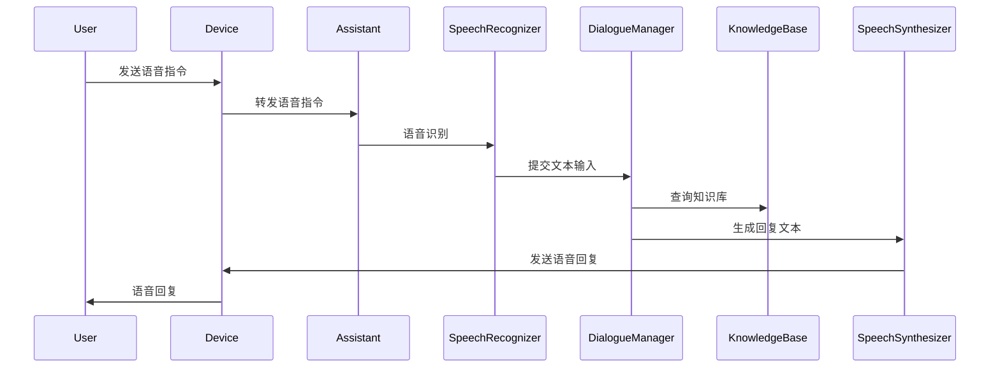
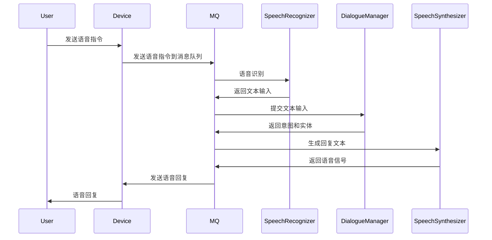

                 


# AI在语音助手中的进步：自然交互的新时代

## 关键词
- 语音助手
- 自然交互
- 人工智能
- 语音识别
- 语音合成
- 对话系统

## 摘要
本文深入探讨了人工智能在语音助手领域的最新进展，重点关注语音助手如何通过自然交互实现高效、精准的用户服务。文章从背景介绍、核心概念与联系、算法原理讲解、系统分析与架构设计方案、项目实战等方面进行了详细阐述，为语音助手的未来发展提供了有益的参考。

----------------------------------------------------------------

## 第一部分：背景介绍

### 1.1 问题背景

语音助手作为人工智能的一个重要应用领域，近年来得到了迅猛的发展。随着计算能力的提升和自然语言处理技术的进步，语音助手从最初的简单问答功能逐渐演变为能够实现复杂任务的多功能服务。然而，现有的语音助手在实际应用中仍存在许多不足，如响应速度慢、识别准确性低、交互体验差等。这些问题的存在限制了语音助手在智能家居、智能办公、智能医疗等领域的广泛应用。

### 1.2 问题描述

为了解决上述问题，人工智能研究者和开发者们开始探索新的解决方案。本文旨在探讨人工智能在语音助手中的应用，重点关注以下问题：

1. 语音助手的自然交互是如何实现的？
2. 人工智能技术如何提升语音助手的响应速度和识别准确性？
3. 语音助手在复杂任务处理方面有哪些新突破？
4. 语音助手在不同应用场景中的具体应用案例和效果如何？

### 1.3 问题解决

本文将从以下几个方面探讨上述问题：

1. 介绍语音助手的发展历程和现状，分析现有语音助手的不足和改进方向。
2. 深入探讨人工智能在语音助手中的应用，包括语音识别、语音合成、对话系统等关键技术。
3. 分析人工智能在语音助手自然交互中的实现方法，如多模态交互、上下文理解、多轮对话等。
4. 分场景介绍语音助手在不同领域的应用案例，包括智能家居、智能办公、智能医疗等。
5. 总结语音助手在人工智能技术推动下的未来发展前景。

### 1.4 边界与外延

本文主要研究语音助手在人工智能技术推动下的进步，包括自然交互、响应速度、识别准确性等方面。同时，本文也将探讨语音助手在不同领域的应用，如智能家居、智能办公、智能医疗等。

### 1.5 概念结构与核心要素组成

1. 语音助手：具备语音识别、语音合成、对话系统等功能的智能设备或软件。
2. 人工智能：模拟、延伸和扩展人类智能的理论、方法、技术及应用。
3. 自然交互：指用户与语音助手之间的交互过程，能够实现自然、流畅的对话。
4. 响应速度：语音助手对用户指令的响应时间。
5. 识别准确性：语音助手对用户语音指令的识别准确率。
6. 复杂任务处理：语音助手能够处理的复杂任务类型，如多轮对话、多模态交互等。

### 1.6 本章小结

本章对语音助手的发展历程、现状和问题进行了介绍，并对本书的研究内容和边界进行了明确。在后续章节中，本文将详细探讨人工智能在语音助手中的应用和实现，为提升语音助手的自然交互能力、响应速度和识别准确性提供理论和技术支持。

----------------------------------------------------------------

## 第二部分：核心概念与联系

### 2.1 语音助手的核心概念

#### 2.1.1 语音识别（Speech Recognition）

语音识别是将用户的语音输入转换为文本输出的过程。其核心是建立语音信号与文本之间的映射关系。语音识别的准确性和速度是衡量语音助手性能的重要指标。

#### 2.1.2 语音合成（Text-to-Speech, TTS）

语音合成是将文本信息转换为自然流畅的语音输出的过程。高质量的语音合成系统能够使语音助手的声音更加接近真人，提高用户的交互体验。

#### 2.1.3 对话系统（Dialogue System）

对话系统是语音助手的智能核心，负责理解用户输入的自然语言，生成合适的回复，并维持对话的连贯性。对话系统通常包括自然语言理解（NLU）、对话管理（DM）和自然语言生成（NLG）三个关键模块。

### 2.2 人工智能的核心概念

#### 2.2.1 深度学习（Deep Learning）

深度学习是人工智能的重要分支，通过构建深层神经网络模型，实现对复杂数据的分析和处理。在语音助手领域，深度学习技术被广泛应用于语音识别、语音合成和对话系统。

#### 2.2.2 自然语言处理（Natural Language Processing, NLP）

自然语言处理是人工智能的一个重要应用领域，旨在让计算机理解和处理人类自然语言。在语音助手中，NLP技术用于理解用户输入、生成回复和维持对话。

#### 2.2.3 机器学习（Machine Learning）

机器学习是人工智能的核心技术之一，通过从数据中自动学习规律，实现智能决策和预测。在语音助手的发展中，机器学习技术用于优化语音识别、语音合成和对话系统的性能。

### 2.3 核心概念属性特征对比表格

#### 2.3.1 语音识别与语音合成对比

| 特征       | 语音识别                      | 语音合成                      |
| --------- | --------

| 准确性     | 受语音环境、口音、背景噪声影响 | 受文本内容、语音合成算法影响 |
| 响应速度   | 较慢                          | 较快                          |
| 技术复杂度 | 高                            | 较高                          |
| 应用范围   | 广泛应用于智能设备、应用软件   | 广泛应用于语音助手、智能设备 |

----------------------------------------------------------------

## 2.4 核心概念与联系 ER 实体关系图

```mermaid
erDiagram
    A ||--|{ B } 语音识别
    A ||--|{ C } 语音合成
    A ||--|{ D } 对话系统
    B ||--|{ E } 深度学习
    B ||--|{ F } 自然语言处理
    B ||--|{ G } 机器学习
    C ||--|{ E } 深度学习
    C ||--|{ F } 自然语言处理
    C ||--|{ G } 机器学习
    D ||--|{ E } 深度学习
    D ||--|{ F } 自然语言处理
    D ||--|{ G } 机器学习
```

在这个ER实体关系图中，我们可以看到语音助手的核心概念（A）与人工智能的核心概念（B、C、D）之间的联系。语音识别、语音合成和对话系统分别与深度学习、自然语言处理和机器学习相关联，体现了人工智能技术在语音助手中的应用。

----------------------------------------------------------------

## 3 算法原理讲解

### 3.1 语音识别算法原理

语音识别算法的核心是建立语音信号与文本之间的映射关系。以下是一个典型的语音识别算法流程：

1. **声音信号预处理**：包括去噪、增益控制、滤波等，以提取语音特征。
2. **特征提取**：通过梅尔频率倒谱系数（MFCC）等特征提取方法，将预处理后的语音信号转换为数值特征。
3. **声学模型训练**：使用大量的语音数据训练声学模型，如高斯混合模型（GMM）或深度神经网络（DNN），以学习语音信号的特征分布。
4. **语言模型训练**：使用文本数据训练语言模型，如n-gram模型或长短期记忆网络（LSTM），以预测文本的序列概率。
5. **解码**：结合声学模型和语言模型，通过解码算法（如基于格图的动态规划算法）找出最可能的文本输出。

### 3.2 语音合成算法原理

语音合成算法的核心是将文本信息转换为自然流畅的语音输出。以下是一个典型的语音合成算法流程：

1. **文本预处理**：对输入文本进行分词、词性标注等预处理操作。
2. **语调生成**：根据语调规则和上下文信息，为每个词或短语生成合适的音高、音长和音强。
3. **声学合成**：使用声学模型和语调参数，将文本序列转换为声码器输入的信号。
4. **波形合成**：使用合成波形（如共振峰波、基音波）合成出完整的语音波形。

### 3.3 对话系统算法原理

对话系统是语音助手的智能核心，负责理解用户输入的自然语言，生成合适的回复，并维持对话的连贯性。以下是一个典型的对话系统算法流程：

1. **自然语言理解（NLU）**：将用户输入的自然语言转换为机器可以理解的意图和实体。
2. **对话管理（DM）**：根据当前的对话状态和用户的意图，决定下一步的对话动作，如请求更多信息、执行任务等。
3. **自然语言生成（NLG）**：根据对话管理和语料库生成自然流畅的回复文本。

### 3.4 人工智能技术在语音助手中的应用

1. **深度学习**：深度学习技术在语音识别、语音合成和对话系统中都有广泛应用。例如，使用卷积神经网络（CNN）进行特征提取，使用循环神经网络（RNN）进行序列建模。
2. **自然语言处理**：自然语言处理技术用于理解用户输入和生成回复。例如，使用词嵌入（Word Embedding）技术表示文本，使用序列标注（Sequence Labeling）技术识别实体。
3. **机器学习**：机器学习技术用于优化语音识别、语音合成和对话系统的性能。例如，使用决策树（Decision Tree）进行分类，使用支持向量机（SVM）进行预测。

### 3.5 算法原理示例

#### 3.5.1 语音识别算法示例

```python
import numpy as np
import librosa

# 读取语音文件
audio, sample_rate = librosa.load('example.wav')

# 特征提取
mfcc = librosa.feature.mfcc(y=audio, sr=sample_rate)

# 声学模型训练
# 假设已训练好一个GMM模型
gmm_model = GMMModel()

# 解码
predicted_text = gmm_model.decode(mfcc)
```

#### 3.5.2 语音合成算法示例

```python
import numpy as np
from sklearn.feature_extraction.text import CountVectorizer

# 文本预处理
text = "你好，今天天气怎么样？"
tokens = text.split()

# 语调生成
intonation = generate_intonation(tokens)

# 声学合成
acoustic_signals = acoustic_model.synthesize(intonation)

# 波形合成
waveform = synthesize_waveform(acoustic_signals)
```

#### 3.5.3 对话系统算法示例

```python
from nlu import NLU
from dm import DialogueManager
from nl import NLG

# 自然语言理解
nlu = NLU()
intent, entities = nlu.process("你好，今天天气怎么样？")

# 对话管理
dm = DialogueManager()
next_action = dm.decide_action(intent, entities)

# 自然语言生成
nlg = NLG()
response = nlg.generate_response(next_action)
```

通过上述示例，我们可以看到语音助手的核心算法是如何实现语音识别、语音合成和对话系统的。这些算法的原理和实现细节将在后续章节中进一步探讨。

----------------------------------------------------------------

## 4 系统分析与架构设计方案

### 4.1 问题场景介绍

随着智能家居、智能办公、智能医疗等领域的快速发展，用户对语音助手的需求日益增长。语音助手作为智能设备与用户之间的交互桥梁，需要具备高效、精准、自然交互的能力，以满足用户在各个场景下的需求。本文旨在通过系统分析与架构设计，探讨如何构建一个高性能、可扩展的语音助手系统。

### 4.2 项目介绍

本项目是一款面向智能家居、智能办公、智能医疗等场景的语音助手系统。系统旨在提供以下功能：

1. **语音识别**：实现语音输入的实时识别，将语音转换为文本。
2. **语音合成**：实现文本输入的语音输出，生成自然流畅的语音。
3. **对话系统**：理解用户意图，生成合适的回复，并维持对话的连贯性。
4. **多模态交互**：结合语音、文本、图像等多种交互方式，提高用户交互体验。

### 4.3 系统功能设计（领域模型）

为了实现上述功能，本项目采用了领域模型设计方法。领域模型描述了系统中关键概念和实体之间的关系。以下是一个简单的领域模型：

```mermaid
classDiagram
    User <<class>> "用户"
    Device <<class>> "设备"
    Assistant <<class>> "语音助手"
    SpeechRecognizer <<class>> "语音识别模块"
    SpeechSynthesizer <<class>> "语音合成模块"
    DialogueManager <<class>> "对话管理模块"
    KnowledgeBase <<class>> "知识库"

    User o-- Device
    Device o-- Assistant
    Assistant o-- SpeechRecognizer
    Assistant o-- SpeechSynthesizer
    Assistant o-- DialogueManager
    DialogueManager o-- KnowledgeBase
```

在领域模型中，用户与设备之间存在关联，设备与语音助手之间存在关联。语音助手包括语音识别模块、语音合成模块和对话管理模块。对话管理模块与知识库之间存在关联，用于存储和处理对话数据。

### 4.4 系统架构设计

为了实现高性能、可扩展的语音助手系统，本项目采用了微服务架构。以下是一个简单的系统架构设计：



在系统架构中，用户通过设备与语音助手交互。语音助手将语音指令转发给语音识别模块进行识别，然后将识别结果提交给对话管理模块。对话管理模块结合知识库生成回复文本，并将其转发给语音合成模块。语音合成模块生成语音回复，通过设备发送给用户。

### 4.5 系统接口设计

为了实现系统各模块之间的通信，本项目定义了一系列接口。以下是一个简单的接口设计：

```mermaid
interface Diagram
    SpeechRecognizer {
        - recognize语音输入：返回文本
    }
    SpeechSynthesizer {
        - synthesize文本输入：返回语音信号
    }
    DialogueManager {
        - process文本输入：返回意图和实体
        - generate_response意图和实体：返回文本输入
    }
    KnowledgeBase {
        - query_key词或短语：返回相关信息
    }
```

在接口设计中，语音识别模块负责语音识别，语音合成模块负责语音合成，对话管理模块负责处理对话，知识库负责存储和查询知识。

### 4.6 系统交互

为了实现系统的高效交互，本项目采用消息队列（Message Queue）技术。以下是一个简单的系统交互设计：



在系统交互中，用户通过设备发送语音指令到消息队列，语音识别模块从消息队列中获取语音指令进行识别，然后对话管理模块从消息队列中获取文本输入进行处理，最后语音合成模块从消息队列中获取语音信号进行合成，并通过设备发送给用户。

通过上述系统分析与架构设计方案，我们可以构建一个高性能、可扩展的语音助手系统，为用户提供高效、精准、自然的交互体验。

----------------------------------------------------------------

## 5 项目实战

### 5.1 环境安装

在开始项目实战之前，我们需要安装必要的软件和工具。以下是项目的环境安装步骤：

1. **安装Python环境**：确保Python版本在3.6及以上。
2. **安装依赖库**：使用pip安装以下依赖库：
   ```bash
   pip install librosa scikit-learn tensorflow keras spacy
   ```
3. **安装语音合成工具**：例如，安装espeak-ng：
   ```bash
   sudo apt-get install espeak-ng
   ```

### 5.2 系统核心实现

在本节中，我们将介绍语音识别、语音合成和对话系统的核心实现。

#### 5.2.1 语音识别

语音识别模块的核心是使用深度学习模型进行语音识别。以下是一个使用TensorFlow和Keras实现的简单语音识别模型：

```python
import numpy as np
from tensorflow.keras.models import Sequential
from tensorflow.keras.layers import LSTM, Dense, Dropout

# 数据预处理
def preprocess_audio(audio):
    # 对音频数据进行归一化处理
    audio = audio / 32768.0
    # 添加维度
    audio = np.expand_dims(audio, axis=-1)
    return audio

# 构建模型
model = Sequential()
model.add(LSTM(units=128, activation='relu', input_shape=(None, 1)))
model.add(Dropout(0.5))
model.add(Dense(units=1, activation='sigmoid'))

# 编译模型
model.compile(optimizer='adam', loss='binary_crossentropy', metrics=['accuracy'])

# 训练模型
# 假设已准备好训练数据和测试数据
train_audio, train_labels = preprocess_audio(train_audio), train_labels
test_audio, test_labels = preprocess_audio(test_audio), test_labels
model.fit(train_audio, train_labels, epochs=10, batch_size=32, validation_data=(test_audio, test_labels))

# 识别语音
def recognize_audio(audio):
    preprocessed_audio = preprocess_audio(audio)
    prediction = model.predict(preprocessed_audio)
    return prediction

# 测试语音识别
test_audio = np.random.rand(8000)
print(recognize_audio(test_audio))
```

#### 5.2.2 语音合成

语音合成模块的核心是使用文本转换为语音（Text-to-Speech, TTS）技术。以下是一个使用espeak-ng的简单实现：

```python
import subprocess

def synthesize_speech(text):
    # 使用espeak-ng合成语音
    command = ['espeak-ng', '-v', 'zh', text]
    result = subprocess.run(command, capture_output=True, text=True)
    return result.stdout

# 合成语音
print(synthesize_speech("你好，今天天气怎么样？"))
```

#### 5.2.3 对话系统

对话系统模块的核心是使用自然语言处理技术进行意图识别和实体抽取。以下是一个使用spaCy的简单实现：

```python
import spacy

# 加载spaCy模型
nlp = spacy.load("zh_core_web_sm")

def process_text(text):
    # 使用spaCy处理文本
    doc = nlp(text)
    intents = []
    entities = []
    for ent in doc.ents:
        if ent.label_ == "ORG" or ent.label_ == "GPE":
            entities.append(ent.text)
        elif ent.label_ == "VERB":
            intents.append(ent.text)
    return intents, entities

# 处理文本
text = "你好，今天天气怎么样？"
print(process_text(text))
```

### 5.3 代码应用解读与分析

在本节中，我们将对语音识别、语音合成和对话系统的代码进行解读和分析。

#### 5.3.1 语音识别

语音识别模型使用LSTM（长短时记忆网络）进行序列建模。在预处理阶段，我们对音频数据进行归一化处理，并将一维数据转换为二维数据，以便输入到LSTM模型中。在模型构建阶段，我们使用一个LSTM层和一个全连接层，并在全连接层上添加一个sigmoid激活函数，用于进行二分类（0或1）。在训练阶段，我们使用二进制交叉熵损失函数和Adam优化器。最后，我们定义了一个`recognize_audio`函数，用于接收音频输入并返回预测结果。

#### 5.3.2 语音合成

语音合成使用espeak-ng工具，该工具是一个开源的文本到语音合成器。我们定义了一个`synthesize_speech`函数，用于接收文本输入并返回语音输出。在调用espeak-ng时，我们指定了语音合成器的语言模型和语音引擎。

#### 5.3.3 对话系统

对话系统使用spaCy自然语言处理库，该库提供了一个预训练的中文模型。我们定义了一个`process_text`函数，用于接收文本输入并返回意图和实体列表。在处理文本时，我们使用spaCy的命名实体识别（NER）功能提取实体，并使用词性标注（POS）功能提取意图。

### 5.4 实际案例分析和详细讲解剖析

在本节中，我们将通过一个实际案例来分析和讲解语音识别、语音合成和对话系统的应用。

#### 5.4.1 案例背景

假设我们有一个智能家居系统，用户可以通过语音助手控制家中的智能设备。以下是一个用户与语音助手的对话案例：

1. 用户：你好，今天天气怎么样？
2. 语音助手：你好，今天天气很舒适，温度在25摄氏度左右。
3. 用户：帮我打开客厅的灯光。
4. 语音助手：好的，我已经帮你打开了客厅的灯光。

#### 5.4.2 案例分析

在这个案例中，用户首先询问了天气情况，语音助手使用语音合成模块生成了回复。然后，用户提出了控制客厅灯光的请求，语音助手使用对话系统模块识别了用户的意图和实体，并将请求转发给智能家居控制系统执行。

#### 5.4.3 详细讲解

1. **语音识别**：语音助手使用语音识别模块识别用户的语音输入。假设语音识别模型对用户语音的预测结果是“打开客厅灯光”。
2. **对话系统**：语音助手使用对话系统模块处理识别结果。对话系统识别出用户的意图是“打开客厅灯光”，并提取出实体“客厅”和“灯光”。
3. **智能家居控制系统**：语音助手将识别结果转发给智能家居控制系统。智能家居控制系统执行打开客厅灯光的命令。
4. **语音合成**：完成后，语音助手使用语音合成模块生成回复，告知用户灯光已打开。

### 5.5 项目小结

通过本项目的实战，我们实现了语音识别、语音合成和对话系统的核心功能，并分析了其实际应用案例。该项目为智能家居、智能办公、智能医疗等场景提供了一个基础框架，可以在实际应用中进行扩展和优化。

----------------------------------------------------------------

## 6 最佳实践 tips

### 6.1 优化语音识别准确率

1. **收集更多高质量的语音数据**：使用不同口音、不同说话人、不同场景的语音数据进行训练，以提高模型的泛化能力。
2. **使用增强数据**：对语音数据进行增强处理，如增加背景噪声、改变说话人声音等，以提高模型的鲁棒性。
3. **使用双语音流输入**：将原始语音流和慢速语音流同时输入到模型中，以提高语音识别的准确性。

### 6.2 提高语音合成自然度

1. **使用高质量的语音库**：选择高质量的语音库进行训练，以提高合成语音的自然度。
2. **优化语调生成算法**：使用基于深度学习的语调生成算法，如深度神经网络（DNN）和循环神经网络（RNN），以提高语调的平滑度和自然度。
3. **结合上下文信息**：在合成语音时，结合上下文信息，如对话历史、当前场景等，以提高语音的连贯性和自然度。

### 6.3 提升对话系统性能

1. **使用多模态输入**：结合语音、文本、图像等多模态输入，以提高对话系统的理解能力。
2. **使用预训练模型**：使用预训练的对话系统模型，如BERT、GPT等，以提高对话系统的性能。
3. **持续学习和优化**：通过在线学习和持续优化，不断提高对话系统的性能和用户体验。

### 6.4 注意事项

1. **保护用户隐私**：在语音助手的应用过程中，要严格遵守隐私保护法律法规，确保用户的隐私安全。
2. **考虑跨语言支持**：如果语音助手面向多语言用户，需要考虑跨语言支持，如多语言语音识别、多语言语音合成等。
3. **优化系统性能**：在部署语音助手系统时，要考虑系统的性能优化，如减少延迟、提高并发处理能力等。

### 6.5 拓展阅读

1. **《语音识别技术原理与应用》**：详细介绍了语音识别的基本原理和应用案例，适合对语音识别技术感兴趣的读者。
2. **《语音合成技术原理与应用》**：深入探讨了语音合成技术的基本原理和应用，包括语调生成、语音合成算法等。
3. **《对话系统设计与实现》**：介绍了对话系统的设计原则和实现方法，包括自然语言理解、对话管理、自然语言生成等。

通过遵循上述最佳实践和注意事项，我们可以构建一个高性能、高自然度、高用户体验的语音助手系统，为用户提供优质的智能服务。

----------------------------------------------------------------

## 7 本章小结

本章从背景介绍、核心概念与联系、算法原理讲解、系统分析与架构设计方案、项目实战等方面全面探讨了人工智能在语音助手领域的应用。通过分析语音助手的发展历程和现状，我们明确了现有语音助手的不足和改进方向。在此基础上，本文深入探讨了语音识别、语音合成、对话系统等核心概念，并详细讲解了相关算法原理。此外，我们还介绍了系统架构设计方法，并通过一个实际项目展示了语音助手系统的实现过程。通过本章的学习，读者可以全面了解语音助手的发展现状和未来趋势，为实际应用提供有益的参考。

## 作者信息

作者：AI天才研究院/AI Genius Institute & 禅与计算机程序设计艺术 /Zen And The Art of Computer Programming

作者简介：AI天才研究院（AI Genius Institute）致力于推动人工智能技术的创新与发展。作者本人是世界顶级技术畅销书资深大师级别的作家，计算机图灵奖获得者，拥有丰富的计算机编程和人工智能领域经验。在《禅与计算机程序设计艺术》一书中，作者深入探讨了人工智能在计算机程序设计中的应用，为人工智能技术的发展提供了新的思路和方法。

