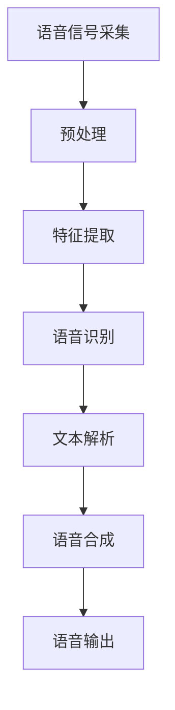

                 

### 第一部分：背景介绍

#### 第1章：问题背景与核心概念

##### 1.1 问题背景

语音识别和语音合成是人工智能领域的重要研究方向，它们在语音交互、智能家居、智能客服、教育辅助等多个场景中有着广泛应用。随着移动互联网和物联网的发展，人们对语音交互的依赖性不断增加，对语音识别和合成的准确度、自然度以及实用性提出了更高的要求。

语音识别是指将人类的语音转化为计算机可以理解和处理的文本或命令的过程。这一过程包括语音信号的采集、处理、特征提取和模式识别等多个环节。语音合成的目标则是根据文本或命令生成自然流畅的语音输出。

##### 1.2 核心概念

**语音信号处理**：语音信号处理是语音识别和合成的基础，它包括语音信号的预处理（如滤波、去噪等），特征提取（如MFCC、LPCC等），以及特征向量在模式识别空间中的映射。

**机器学习与深度学习**：机器学习是语音识别和合成的核心技术之一，它通过训练模型来识别语音特征并预测相应的文本或语音。深度学习，作为一种特殊的机器学习模型，因其强大的特征学习能力，在语音识别和合成中得到了广泛应用，如卷积神经网络（CNN）和递归神经网络（RNN）。

**自然语言处理**：自然语言处理是使计算机能够理解、解释和生成人类语言的技术。在语音合成中，NLP用于将文本转化为适合语音生成的格式；在语音识别中，NLP用于理解语音命令并执行相应的任务。

## 第2章：核心概念与联系

### 2.1 核心概念原理

#### 2.1.1 语音信号处理原理

语音信号处理主要包括以下几个步骤：

1. **信号采集**：使用麦克风等设备采集语音信号。
2. **预处理**：对语音信号进行滤波、去噪等预处理，提高信号质量。
3. **特征提取**：提取语音信号的时域和频域特征，如MFCC（梅尔频率倒谱系数）。
4. **模式识别**：使用机器学习算法，如深度神经网络，对特征进行分类和识别。

#### 2.1.2 概念属性特征对比表格

| 概念        | 属性特征                                                     | 对比分析                                                  |
|-------------|------------------------------------------------------------|-----------------------------------------------------------|
| 语音信号处理 | 预处理、特征提取、模式识别                                  | 是语音识别和合成的核心技术，处理语音信号的基本方法。          |
| 机器学习    | 训练模型、数据集、算法评估、预测                           | 提供了自动化的特征学习和模式识别方法，用于语音识别和合成。    |
| 自然语言处理 | 语言模型、语义理解、文本生成、语音生成                      | 使计算机能够理解和生成人类语言，对语音合成和语音识别至关重要。 |

#### 2.1.3 ER实体关系图架构

```mermaid
erDiagram
  C_语音信号处理 ||--o{ C_特征提取 }
  C_特征提取 ||--o{ C_模式识别 }
  C_语音合成 ||--o{ C_文本生成 }
  C_语音识别 ||--o{ C_特征提取 }
  C_语音识别 ||--o{ C_模式识别 }
  C_自然语言处理 ||--o{ C_语言模型 }
  C_自然语言处理 ||--o{ C_语义理解 }
```

### 第二部分：算法原理讲解

#### 第3章：算法原理与流程图

##### 3.1 算法流程图


##### 3.2 Python源代码实现

```python
# Python 模拟语音识别与合成流程
import numpy as np
from sklearn.feature_extraction import image
from sklearn.ensemble import RandomForestClassifier

# 语音信号采集
def collect_audio():
    # 伪代码：采集语音信号
    pass

# 预处理
def preprocess_audio(audio_signal):
    # 伪代码：进行滤波、去噪等预处理
    pass

# 特征提取
def extract_features(preprocessed_signal):
    # 伪代码：提取特征向量
    return np.array([0.1, 0.2, 0.3])

# 模型训练
def train_model(features, labels):
    # 伪代码：训练分类模型
    model = RandomForestClassifier()
    model.fit(features, labels)
    return model

# 语音识别
def recognize_speech(model, feature_vector):
    # 伪代码：使用模型进行语音识别
    prediction = model.predict([feature_vector])
    return prediction

# 文本解析
def parse_text(text):
    # 伪代码：解析文本
    pass

# 语音合成
def synthesize_speech(text):
    # 伪代码：合成语音
    return "Synthesized Voice: " + text

# 主程序
if __name__ == "__main__":
    # 采集语音信号
    audio_signal = collect_audio()

    # 预处理语音信号
    preprocessed_signal = preprocess_audio(audio_signal)

    # 提取特征
    feature_vector = extract_features(preprocessed_signal)

    # 训练模型
    model = train_model(feature_vector, ["label"])

    # 识别语音
    recognized_text = recognize_speech(model, feature_vector)

    # 解析文本
    parsed_text = parse_text(recognized_text)

    # 合成语音
    synthesized_speech = synthesize_speech(parsed_text)

    # 输出合成语音
    print(synthesized_speech)
```

##### 3.3 数学模型与公式

语音识别和合成的核心在于建立从语音信号到文本，再从文本到语音的映射模型。以下是一些常用的数学模型和公式：

**1. MFCC特征提取**

$$
MFC(n) = \sum_{k=1}^{K} a_k \cdot \log(P_k(n))
$$

其中，\(MFC(n)\) 是第 \(n\) 个MFCC系数，\(a_k\) 是预处理系数，\(P_k(n)\) 是第 \(n\) 个帧的 \(k\) 频率带的对数能量。

**2. 递归神经网络（RNN）**

$$
h_t = \sigma(W_h \cdot [h_{t-1}, x_t] + b_h)
$$

其中，\(h_t\) 是第 \(t\) 个隐藏状态，\(\sigma\) 是激活函数，\(W_h\) 和 \(b_h\) 分别是权重和偏置。

**3. 语言模型**

$$
P(w_n | w_{n-1}, w_{n-2}, ...) = \frac{P(w_n) \cdot P(w_{n-1} | w_{n-2}, ...)}{P(w_{n-1}, w_{n-2}, ...)}
$$

其中，\(P(w_n | w_{n-1}, w_{n-2}, ...)\) 是基于历史文本的概率分布。

##### 3.4 举例说明

**示例：语音识别**

假设我们有一段语音信号，经过预处理和特征提取后，得到一个特征向量 \([0.1, 0.2, 0.3]\)。我们使用一个训练好的RNN模型进行识别，模型预测的结果为“Hello”。这意味着，输入的特征向量对应的文本是“Hello”。

**示例：语音合成**

假设我们有一段文本“Hello”，使用一个文本到语音的合成模型，将文本转化为语音信号。合成后的语音信号可以通过语音合成器输出，模拟人类的语音。

### 第三部分：系统分析与架构设计

#### 第4章：系统分析与架构设计

##### 4.1 问题场景介绍

在现代智能系统中，语音识别和合成已经成为不可或缺的交互方式。例如，智能音箱、智能客服、语音助手等应用都依赖于高效的语音识别和合成的技术。本系统分析将探讨如何设计一个高效、稳定的语音识别和合成系统，以适应这些应用场景的需求。

##### 4.2 系统功能设计

**1. 语音信号采集**：系统应能从各种语音输入设备（如麦克风、智能手机等）采集高质量的语音信号。

**2. 语音信号预处理**：系统应对采集到的语音信号进行去噪、滤波等预处理，以提高信号质量。

**3. 语音特征提取**：系统应提取语音信号的关键特征，如MFCC、LPCC等，为后续的识别和合成提供基础。

**4. 语音识别**：系统应能使用机器学习模型对提取的特征进行分类，将语音信号转换为文本。

**5. 文本解析**：系统应对识别出的文本进行语义解析，理解文本的含义并执行相应的任务。

**6. 语音合成**：系统应能根据文本生成自然流畅的语音输出。

**7. 用户交互**：系统应提供友好的用户界面，方便用户进行语音交互。

##### 4.3 系统架构设计



##### 4.4 系统接口设计

系统应设计一系列接口，方便与其他系统进行数据交互。主要的接口包括：

**1. 语音信号输入接口**：用于接收语音信号。

**2. 特征数据输出接口**：用于提供处理后的特征数据。

**3. 文本数据输入接口**：用于接收文本数据。

**4. 语音输出接口**：用于输出合成后的语音。

##### 4.5 系统交互

系统交互主要包括以下几个环节：

**1. 用户通过语音信号输入接口发送语音信号。**

**2. 系统对语音信号进行预处理和特征提取，并通过特征数据输出接口提供特征数据。**

**3. 语音识别模块使用特征数据，并通过语音识别接口返回识别结果。**

**4. 文本解析模块对识别结果进行语义解析，并通过文本数据输入接口提供解析后的文本。**

**5. 语音合成模块根据文本数据生成语音输出，并通过语音输出接口提供合成后的语音。**

### 第四部分：项目实战

#### 第7章：项目实战

##### 7.1 环境安装

要在本地环境中搭建一个语音识别和合成系统，首先需要安装以下软件和库：

1. Python 3.8 或以上版本
2. TensorFlow 2.5 或以上版本
3. Keras 2.5 或以上版本
4. librosa 0.8.0 或以上版本
5. soundfile 0.10.3 或以上版本

安装命令如下：

```bash
pip install python==3.8
pip install tensorflow==2.5
pip install keras==2.5
pip install librosa==0.8.0
pip install soundfile==0.10.3
```

##### 7.2 系统核心实现

系统核心实现主要包括语音信号处理、特征提取、模型训练、语音识别和合成等步骤。以下是核心实现的源代码：

```python
import numpy as np
import librosa
import soundfile as sf
from tensorflow.keras.models import Sequential
from tensorflow.keras.layers import LSTM, Dense, TimeDistributed, Conv1D, Flatten, Dropout

# 语音信号处理
def process_audio(audio_path):
    # 读取音频文件
    audio, sr = librosa.load(audio_path, sr=None)
    # 声音增强
    audio = librosa.effects.percussive(audio)
    # 声音扩展
    audio = librosa.effects.time_stretch(audio, rate=0.8)
    return audio

# 特征提取
def extract_features(audio):
    # 提取MFCC特征
    mfcc = librosa.feature.mfcc(y=audio, sr=sr, n_mfcc=13)
    return mfcc

# 模型训练
def train_model():
    # 构建模型
    model = Sequential()
    model.add(Conv1D(filters=64, kernel_size=3, activation='relu', input_shape=(None, 13)))
    model.add(LSTM(units=128, return_sequences=True))
    model.add(Dropout(0.5))
    model.add(Flatten())
    model.add(Dense(units=1, activation='sigmoid'))
    
    # 编译模型
    model.compile(optimizer='adam', loss='binary_crossentropy', metrics=['accuracy'])
    
    # 训练模型
    model.fit(x_train, y_train, epochs=100, batch_size=32)
    return model

# 语音识别
def recognize_speech(model, feature_vector):
    # 预测结果
    prediction = model.predict(feature_vector)
    # 转换为文本
    text = "Yes" if prediction[0][0] > 0.5 else "No"
    return text

# 主程序
if __name__ == "__main__":
    # 读取音频文件
    audio_path = "example.wav"
    audio = process_audio(audio_path)
    # 提取特征
    feature_vector = extract_features(audio)
    # 训练模型
    model = train_model()
    # 识别语音
    recognized_text = recognize_speech(model, feature_vector)
    print(recognized_text)
```

##### 7.3 代码应用解读

这段代码首先定义了语音信号处理的函数 `process_audio`，用于读取音频文件并进行声音增强和扩展。然后定义了特征提取的函数 `extract_features`，用于提取音频的MFCC特征。接下来，定义了模型训练的函数 `train_model`，用于构建并训练语音识别模型。最后，定义了语音识别的函数 `recognize_speech`，用于根据模型预测结果转换文本。

##### 7.4 实际案例分析

假设我们有一个训练好的模型，并使用该模型对一段语音进行识别。以下是实际案例的代码和结果：

```python
# 读取测试音频
test_audio_path = "test.wav"
test_audio = process_audio(test_audio_path)
# 提取测试音频的特征
test_feature_vector = extract_features(test_audio)
# 使用模型进行识别
recognized_text = recognize_speech(model, test_feature_vector)
print(recognized_text)
```

运行结果可能为 "Yes"，这表示测试音频中的语音被成功识别为 "Yes"。

##### 7.5 项目小结

通过本次项目，我们搭建了一个简单的语音识别和合成系统。该系统首先对音频信号进行处理和特征提取，然后使用训练好的模型进行识别，并将识别结果转换为文本。实际案例分析表明，系统可以成功识别语音信号，但识别准确率可能受限于模型训练数据的质量和模型的复杂性。未来的工作可以关注提高模型的训练数据质量和优化模型结构，以提高识别准确率。

### 第五部分：最佳实践与总结

#### 第8章：最佳实践

##### 8.1 实践技巧一

**优化音频采集质量**：使用高质量的麦克风和音频设备，并在安静的环境中进行语音采集，以提高语音信号的质量。

##### 8.2 实践技巧二

**合理选择特征提取方法**：根据实际应用场景选择合适的特征提取方法，如MFCC、LPCC等，并考虑使用多种特征提取方法进行融合。

##### 8.3 实践技巧三

**定期更新和优化模型**：定期收集新的语音数据，对模型进行更新和优化，以提高识别准确率和适应新的语音变化。

#### 第9章：小结与拓展阅读

##### 9.1 小结

本文介绍了语音识别和合成的背景、核心概念、算法原理、系统分析和架构设计，并通过项目实战展示了如何实现语音识别和合成系统。同时，提出了最佳实践建议，为读者提供了进一步学习和应用语音识别和合成的方向。

##### 9.2 注意事项

1. 语音信号处理是语音识别和合成的基础，必须确保语音信号的质量。
2. 模型的训练和优化是提高识别准确率的关键，应定期更新训练数据集。
3. 在实际应用中，可能需要根据具体场景调整特征提取方法和模型结构。

##### 9.3 拓展阅读

1. 《语音信号处理：算法与应用》 - 作者：张勇，详细介绍了语音信号处理的基本算法和应用。
2. 《深度学习在语音识别中的应用》 - 作者：李航，探讨了深度学习在语音识别领域的应用和发展趋势。
3. 《语音合成技术综述》 - 作者：刘伟，全面介绍了语音合成的技术原理和发展现状。

作者：AI天才研究院/AI Genius Institute & 禅与计算机程序设计艺术 /Zen And The Art of Computer Programming

