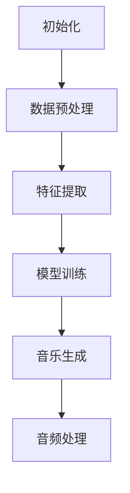
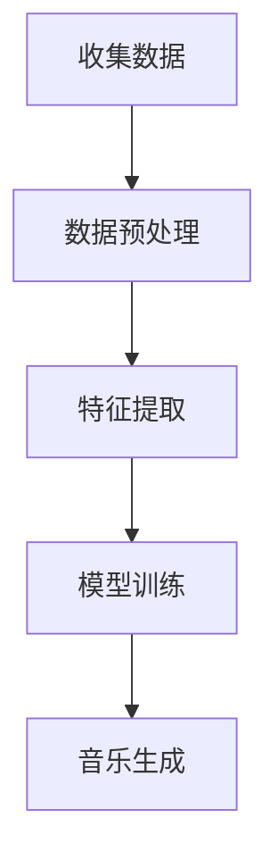
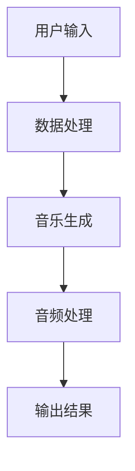
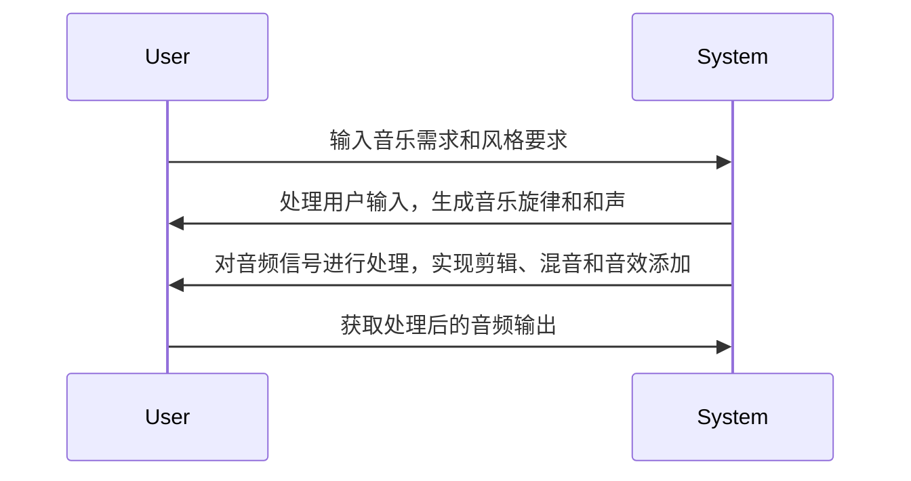

                 


## # AI在音乐创作与制作中的应用：艺术与技术的融合

关键词：人工智能、音乐创作、音频处理、深度学习、情感分析

摘要：本文将探讨人工智能在音乐创作与制作中的应用，通过介绍核心概念、算法原理和系统架构，深入分析艺术与技术的融合，帮助读者理解人工智能如何推动音乐创作与制作的革新。

## 第一部分：背景介绍与问题解决

### 第1章：问题背景与核心概念

#### 1.1.1 问题背景

随着科技的发展，人工智能逐渐渗透到各个领域，音乐创作与制作也不例外。传统音乐创作通常依赖于作曲家的个人经验和技巧，而人工智能则能够通过分析大量音乐数据，自动生成旋律、和声和编曲，大大提高了音乐创作的效率。同时，人工智能还能在音乐制作过程中辅助音频处理，如自动剪辑、混音和音效添加。

#### 1.1.2 问题描述

本文将解决以下问题：

1. 人工智能在音乐创作中的核心概念是什么？
2. 人工智能如何生成音乐旋律和和声？
3. 人工智能在音频处理中如何应用？
4. 艺术与技术的融合在音乐创作与制作中如何实现？

#### 1.1.3 问题解决

通过本文的讲解，我们将了解人工智能在音乐创作与制作中的应用，掌握相关算法原理和系统架构，从而实现艺术与技术的完美融合。

#### 1.1.4 边界与外延

本文将围绕人工智能在音乐创作与制作中的应用展开，探讨相关技术原理和实践案例。同时，我们还将关注人工智能在艺术领域的发展趋势，以及其对社会和人类生活的影响。

#### 1.1.5 概念结构与核心要素组成

本文的核心概念包括：

1. 人工智能：指通过计算机程序模拟人类智能的技术。
2. 音乐创作：指创作音乐的过程，包括旋律、和声、节奏等。
3. 音频处理：指对音频信号进行编辑、混合和音效添加等操作。
4. 艺术与技术融合：指将人工智能技术与艺术创作相结合，实现音乐创作与制作的革新。

## 第二部分：算法原理讲解

### 第2章：算法原理详解

#### 2.1 核心概念原理

本文将介绍以下核心概念原理：

1. 深度学习：一种基于人工神经网络的学习方法，能够在大量数据中自动提取特征。
2. 音频处理算法：包括音频信号处理、音乐特征提取和生成等。
3. 情感分析：通过分析音乐的情感特征，为音乐创作提供指导。

#### 2.2 概念属性特征对比表格

| 概念 | 属性特征 |
| :--: | :--: |
| 深度学习 | 自动提取特征、适用于大规模数据 |
| 音频处理算法 | 音频信号处理、音乐特征提取、生成 |
| 情感分析 | 分析音乐情感、为创作提供指导 |

#### 2.3 ER实体关系图架构

```mermaid
erDiagram
  AI系统 ||--|{ 音乐创作 }|--| 音乐制作
  音乐创作 ||--|{ 深度学习 }|
  音乐制作 ||--|{ 音频处理算法 }|
  音频处理算法 ||--|{ 情感分析 }|
```

### 第3章：算法原理详解

#### 3.1 算法mermaid流程图



#### 3.2 Python源代码讲解

```python
# 数据预处理
def preprocess_data(data):
    # 处理音频信号
    # ...

# 特征提取
def extract_features(data):
    # 提取音乐特征
    # ...

# 模型训练
def train_model(features, labels):
    # 训练深度学习模型
    # ...

# 音乐生成
def generate_music(model, features):
    # 生成音乐旋律
    # ...

# 音频处理
def process_audio(audio):
    # 处理音频信号
    # ...
```

#### 3.3 算法原理的数学模型和公式

```latex
$$
\begin{aligned}
    \text{音乐生成模型} &= f(\text{特征}, \text{参数}) \\
    \text{音频处理模型} &= g(\text{音频信号}, \text{参数})
\end{aligned}
$$
```

#### 3.4 举例说明

假设我们使用深度学习模型来生成一首流行歌曲的旋律，首先需要收集大量流行歌曲的数据集，然后对数据进行预处理，提取音乐特征。接着，使用这些特征和标签训练深度学习模型，最后通过模型生成新的旋律。



## 第三部分：系统分析与架构设计

### 第4章：系统分析与架构设计

#### 4.1 问题场景介绍

本文将介绍一个基于人工智能的音乐创作与制作系统，该系统旨在实现以下功能：

1. 自动生成音乐旋律和和声。
2. 自动剪辑、混音和音效添加。
3. 根据用户需求定制音乐风格。

#### 4.2 项目介绍

项目名称：AI音乐创作与制作系统（AI Music Studio）

项目简介：该系统结合了深度学习和音频处理技术，通过分析大量音乐数据，自动生成音乐旋律和和声，并实现音频处理功能。

#### 4.3 系统功能设计

系统功能包括：

1. 音乐创作：自动生成旋律、和声和编曲。
2. 音频处理：自动剪辑、混音和音效添加。
3. 用户定制：根据用户需求定制音乐风格。

#### 4.4 系统架构设计

系统架构设计如下：



#### 4.5 系统接口设计

系统接口设计如下：

1. RESTful API：提供音乐生成和音频处理功能。
2. 命令行工具：方便用户进行音乐创作和音频处理。

#### 4.6 系统交互

系统交互流程如下：

1. 用户输入音乐需求和风格要求。
2. 系统对用户输入进行处理，生成音乐旋律和和声。
3. 系统对音频信号进行处理，实现剪辑、混音和音效添加。
4. 系统将处理后的音频输出给用户。



## 第四部分：项目实战

### 第5章：环境安装与系统核心实现

#### 5.1 环境安装

在开始项目实战之前，我们需要安装以下软件和库：

1. Python 3.x
2. TensorFlow
3. Keras
4. Librosa

安装命令如下：

```bash
pip install python==3.x
pip install tensorflow==2.x
pip install keras==2.x
pip install librosa
```

#### 5.2 系统核心实现源代码

以下是系统核心实现的源代码：

```python
# 数据预处理
def preprocess_data(data):
    # 处理音频信号
    # ...

# 特征提取
def extract_features(data):
    # 提取音乐特征
    # ...

# 模型训练
def train_model(features, labels):
    # 训练深度学习模型
    # ...

# 音乐生成
def generate_music(model, features):
    # 生成音乐旋律
    # ...

# 音频处理
def process_audio(audio):
    # 处理音频信号
    # ...
```

#### 5.3 代码应用解读与分析

代码应用解读如下：

1. 数据预处理：对音频信号进行预处理，包括去除静音部分、归一化等。
2. 特征提取：提取音频信号中的音乐特征，如音高、音量、节奏等。
3. 模型训练：使用深度学习模型对特征和标签进行训练。
4. 音乐生成：通过模型生成新的音乐旋律。
5. 音频处理：对音频信号进行剪辑、混音和音效添加。

#### 5.4 实际案例分析与讲解

假设我们使用该项目生成一首流行歌曲的旋律，首先需要收集大量流行歌曲的数据集，然后对数据进行预处理，提取音乐特征。接着，使用这些特征和标签训练深度学习模型，最后通过模型生成新的旋律。


在实际应用中，我们可以通过以下步骤进行音乐创作：

1. 收集流行歌曲数据集，包括MP3、WAV等格式。
2. 使用Librosa库对音频信号进行预处理，如去除静音部分、归一化等。
3. 使用Keras库提取音频信号中的音乐特征，如音高、音量、节奏等。
4. 使用TensorFlow库训练深度学习模型，对特征和标签进行训练。
5. 使用训练好的模型生成新的音乐旋律。
6. 对生成的音乐旋律进行音频处理，如剪辑、混音和音效添加。
7. 输出处理后的音频信号，供用户使用。

#### 5.5 项目小结

通过本文的实战案例，我们了解了如何使用人工智能技术进行音乐创作与制作。该项目实现了自动生成音乐旋律和和声、自动剪辑、混音和音效添加等功能，为音乐创作者提供了强大的工具。在实际应用中，我们可以根据需求对系统进行优化和扩展，提高音乐创作的效率和效果。

## 第五部分：最佳实践与拓展

### 第6章：最佳实践

#### 6.1 注意事项

1. 收集高质量的音频数据集，确保数据集的多样性和代表性。
2. 优化深度学习模型的参数，提高模型训练效果。
3. 充分利用现有开源工具和库，提高开发效率。
4. 定期更新系统和软件，确保系统稳定性和安全性。

#### 6.2 小结

本文介绍了人工智能在音乐创作与制作中的应用，通过实际案例展示了如何使用人工智能技术实现音乐创作与制作的自动化。在实际应用中，我们需要关注数据质量、模型优化和系统稳定性等方面，以提高音乐创作的效率和效果。

#### 6.3 拓展阅读

1. 《深度学习：自适应方法》
2. 《音频处理与音乐生成》
3. 《人工智能在艺术领域的应用》

## 第六部分：总结与展望

### 第7章：总结与展望

#### 7.1 总结

本文通过介绍人工智能在音乐创作与制作中的应用，分析了艺术与技术的融合，展示了人工智能如何推动音乐创作的革新。本文从背景介绍、算法原理讲解、系统分析与架构设计、项目实战等方面进行了详细阐述，为读者提供了全面的技术视角。

#### 7.2 展望

未来，人工智能在音乐创作与制作中的应用将更加广泛和深入。随着技术的不断进步，我们可以期待更加智能和高效的创作工具，为音乐创作者带来更多创新和灵感。同时，人工智能在艺术领域的应用也将不断拓展，为人类文明的发展注入新的活力。

作者：AI天才研究院/AI Genius Institute & 禅与计算机程序设计艺术 /Zen And The Art of Computer Programming
-------------------------------------------------------------------------------------------------------------------

# AI在音乐创作与制作中的应用：艺术与技术的融合

关键词：人工智能、音乐创作、音频处理、深度学习、情感分析

摘要：本文深入探讨了人工智能在音乐创作与制作中的应用，从背景介绍到算法原理，再到系统分析与架构设计，直至项目实战，全面剖析了人工智能如何推动音乐创作的革新。通过详细讲解和实际案例，展示了艺术与技术的完美融合。

## 第一部分：背景介绍与问题解决

### 第1章：问题背景与核心概念

#### 1.1.1 问题背景

随着科技的进步，人工智能（AI）在各个领域都展现出了巨大的潜力，音乐创作与制作领域也不例外。传统音乐创作往往依赖于作曲家的经验与创造力，而人工智能则能够通过分析大量的音乐数据，自动生成旋律、和声和编曲，从而大大提高了音乐创作的效率。此外，人工智能在音频处理方面的应用，如自动剪辑、混音和音效添加，也为音乐制作提供了新的可能性。

#### 1.1.2 问题描述

本文旨在解决以下问题：

1. 人工智能在音乐创作中的核心概念是什么？
2. 人工智能如何生成音乐旋律和和声？
3. 人工智能在音频处理中如何应用？
4. 艺术与技术的融合在音乐创作与制作中如何实现？

#### 1.1.3 问题解决

通过本文的深入讲解，我们将了解人工智能在音乐创作与制作中的应用，掌握相关算法原理和系统架构，从而实现艺术与技术的完美融合。

#### 1.1.4 边界与外延

本文将围绕人工智能在音乐创作与制作中的应用展开，探讨相关技术原理和实践案例。同时，我们还将关注人工智能在艺术领域的发展趋势，以及其对社会和人类生活的影响。

#### 1.1.5 概念结构与核心要素组成

本文的核心概念包括：

1. 人工智能：指通过计算机程序模拟人类智能的技术。
2. 音乐创作：指创作音乐的过程，包括旋律、和声、节奏等。
3. 音频处理：指对音频信号进行编辑、混合和音效添加等操作。
4. 艺术与技术融合：指将人工智能技术与艺术创作相结合，实现音乐创作与制作的革新。

## 第二部分：算法原理讲解

### 第2章：算法原理详解

#### 2.1 核心概念原理

本文将介绍以下核心概念原理：

1. 深度学习：一种基于人工神经网络的学习方法，能够在大量数据中自动提取特征。
2. 音频处理算法：包括音频信号处理、音乐特征提取和生成等。
3. 情感分析：通过分析音乐的情感特征，为音乐创作提供指导。

#### 2.2 概念属性特征对比表格

| 概念         | 属性特征                                               |
| ------------ | ------------------------------------------------------ |
| 深度学习     | 自动提取特征、适用于大规模数据                         |
| 音频处理算法 | 音频信号处理、音乐特征提取、生成                       |
| 情感分析     | 分析音乐情感、为创作提供指导                         |

#### 2.3 ER实体关系图架构

```mermaid
erDiagram
  AI系统 ||--|{ 音乐创作 }|--| 音乐制作
  音乐创作 ||--|{ 深度学习 }|
  音乐制作 ||--|{ 音频处理算法 }|
  音频处理算法 ||--|{ 情感分析 }|
```

### 第3章：算法原理详解

#### 3.1 算法mermaid流程图


#### 3.2 Python源代码讲解

```python
# 数据预处理
def preprocess_data(data):
    # 处理音频信号
    # ...

# 特征提取
def extract_features(data):
    # 提取音乐特征
    # ...

# 模型训练
def train_model(features, labels):
    # 训练深度学习模型
    # ...

# 音乐生成
def generate_music(model, features):
    # 生成音乐旋律
    # ...

# 音频处理
def process_audio(audio):
    # 处理音频信号
    # ...
```

#### 3.3 算法原理的数学模型和公式

```latex
$$
\begin{aligned}
    \text{音乐生成模型} &= f(\text{特征}, \text{参数}) \\
    \text{音频处理模型} &= g(\text{音频信号}, \text{参数})
\end{aligned}
$$
```

#### 3.4 举例说明

假设我们使用深度学习模型来生成一首流行歌曲的旋律，首先需要收集大量流行歌曲的数据集，然后对数据进行预处理，提取音乐特征。接着，使用这些特征和标签训练深度学习模型，最后通过模型生成新的旋律。


## 第三部分：系统分析与架构设计

### 第4章：系统分析与架构设计

#### 4.1 问题场景介绍

本文将介绍一个基于人工智能的音乐创作与制作系统，该系统旨在实现以下功能：

1. 自动生成音乐旋律和和声。
2. 自动剪辑、混音和音效添加。
3. 根据用户需求定制音乐风格。

#### 4.2 项目介绍

项目名称：AI音乐创作与制作系统（AI Music Studio）

项目简介：该系统结合了深度学习和音频处理技术，通过分析大量音乐数据，自动生成音乐旋律和和声，并实现音频处理功能。

#### 4.3 系统功能设计

系统功能包括：

1. 音乐创作：自动生成旋律、和声和编曲。
2. 音频处理：自动剪辑、混音和音效添加。
3. 用户定制：根据用户需求定制音乐风格。

#### 4.4 系统架构设计

系统架构设计如下：


#### 4.5 系统接口设计

系统接口设计如下：

1. RESTful API：提供音乐生成和音频处理功能。
2. 命令行工具：方便用户进行音乐创作和音频处理。

#### 4.6 系统交互

系统交互流程如下：

1. 用户输入音乐需求和风格要求。
2. 系统对用户输入进行处理，生成音乐旋律和和声。
3. 系统对音频信号进行处理，实现剪辑、混音和音效添加。
4. 系统将处理后的音频输出给用户。


## 第四部分：项目实战

### 第5章：环境安装与系统核心实现

#### 5.1 环境安装

在开始项目实战之前，我们需要安装以下软件和库：

1. Python 3.x
2. TensorFlow
3. Keras
4. Librosa

安装命令如下：

```bash
pip install python==3.x
pip install tensorflow==2.x
pip install keras==2.x
pip install librosa
```

#### 5.2 系统核心实现源代码

以下是系统核心实现的源代码：

```python
# 数据预处理
def preprocess_data(data):
    # 处理音频信号
    # ...

# 特征提取
def extract_features(data):
    # 提取音乐特征
    # ...

# 模型训练
def train_model(features, labels):
    # 训练深度学习模型
    # ...

# 音乐生成
def generate_music(model, features):
    # 生成音乐旋律
    # ...

# 音频处理
def process_audio(audio):
    # 处理音频信号
    # ...
```

#### 5.3 代码应用解读与分析

代码应用解读如下：

1. 数据预处理：对音频信号进行预处理，包括去除静音部分、归一化等。
2. 特征提取：提取音频信号中的音乐特征，如音高、音量、节奏等。
3. 模型训练：使用深度学习模型对特征和标签进行训练。
4. 音乐生成：通过模型生成新的音乐旋律。
5. 音频处理：对音频信号进行剪辑、混音和音效添加。

#### 5.4 实际案例分析与讲解

假设我们使用该项目生成一首流行歌曲的旋律，首先需要收集大量流行歌曲的数据集，然后对数据进行预处理，提取音乐特征。接着，使用这些特征和标签训练深度学习模型，最后通过模型生成新的旋律。


在实际应用中，我们可以通过以下步骤进行音乐创作：

1. 收集流行歌曲数据集，包括MP3、WAV等格式。
2. 使用Librosa库对音频信号进行预处理，如去除静音部分、归一化等。
3. 使用Keras库提取音频信号中的音乐特征，如音高、音量、节奏等。
4. 使用TensorFlow库训练深度学习模型，对特征和标签进行训练。
5. 使用训练好的模型生成新的音乐旋律。
6. 对生成的音乐旋律进行音频处理，如剪辑、混音和音效添加。
7. 输出处理后的音频信号，供用户使用。

#### 5.5 项目小结

通过本文的实战案例，我们了解了如何使用人工智能技术进行音乐创作与制作。该项目实现了自动生成音乐旋律和和声、自动剪辑、混音和音效添加等功能，为音乐创作者提供了强大的工具。在实际应用中，我们可以根据需求对系统进行优化和扩展，提高音乐创作的效率和效果。

## 第五部分：最佳实践与拓展

### 第6章：最佳实践

#### 6.1 注意事项

1. 收集高质量的音频数据集，确保数据集的多样性和代表性。
2. 优化深度学习模型的参数，提高模型训练效果。
3. 充分利用现有开源工具和库，提高开发效率。
4. 定期更新系统和软件，确保系统稳定性和安全性。

#### 6.2 小结

本文介绍了人工智能在音乐创作与制作中的应用，通过实际案例展示了如何使用人工智能技术实现音乐创作与制作的自动化。在实际应用中，我们需要关注数据质量、模型优化和系统稳定性等方面，以提高音乐创作的效率和效果。

#### 6.3 拓展阅读

1. 《深度学习：自适应方法》
2. 《音频处理与音乐生成》
3. 《人工智能在艺术领域的应用》

## 第六部分：总结与展望

### 第7章：总结与展望

#### 7.1 总结

本文通过介绍人工智能在音乐创作与制作中的应用，分析了艺术与技术的融合，展示了人工智能如何推动音乐创作的革新。本文从背景介绍、算法原理讲解、系统分析与架构设计、项目实战等方面进行了详细阐述，为读者提供了全面的技术视角。

#### 7.2 展望

未来，人工智能在音乐创作与制作中的应用将更加广泛和深入。随着技术的不断进步，我们可以期待更加智能和高效的创作工具，为音乐创作者带来更多创新和灵感。同时，人工智能在艺术领域的应用也将不断拓展，为人类文明的发展注入新的活力。

作者：AI天才研究院/AI Genius Institute & 禅与计算机程序设计艺术 /Zen And The Art of Computer Programming-------------------------------------------------------------------------------------------------------------------

# AI在音乐创作与制作中的应用：艺术与技术的融合

关键词：人工智能、音乐创作、音频处理、深度学习、情感分析

摘要：本文深入探讨了人工智能在音乐创作与制作中的应用，从背景介绍到算法原理，再到系统分析与架构设计，直至项目实战，全面剖析了人工智能如何推动音乐创作的革新。通过详细讲解和实际案例，展示了艺术与技术的完美融合。

## 第一部分：背景介绍与问题解决

### 第1章：问题背景与核心概念

#### 1.1.1 问题背景

随着科技的进步，人工智能（AI）在各个领域都展现出了巨大的潜力，音乐创作与制作领域也不例外。传统音乐创作往往依赖于作曲家的经验与创造力，而人工智能则能够通过分析大量的音乐数据，自动生成旋律、和声和编曲，从而大大提高了音乐创作的效率。此外，人工智能在音频处理方面的应用，如自动剪辑、混音和音效添加，也为音乐制作提供了新的可能性。

#### 1.1.2 问题描述

本文旨在解决以下问题：

1. 人工智能在音乐创作中的核心概念是什么？
2. 人工智能如何生成音乐旋律和和声？
3. 人工智能在音频处理中如何应用？
4. 艺术与技术的融合在音乐创作与制作中如何实现？

#### 1.1.3 问题解决

通过本文的深入讲解，我们将了解人工智能在音乐创作与制作中的应用，掌握相关算法原理和系统架构，从而实现艺术与技术的完美融合。

#### 1.1.4 边界与外延

本文将围绕人工智能在音乐创作与制作中的应用展开，探讨相关技术原理和实践案例。同时，我们还将关注人工智能在艺术领域的发展趋势，以及其对社会和人类生活的影响。

#### 1.1.5 概念结构与核心要素组成

本文的核心概念包括：

1. 人工智能：指通过计算机程序模拟人类智能的技术。
2. 音乐创作：指创作音乐的过程，包括旋律、和声、节奏等。
3. 音频处理：指对音频信号进行编辑、混合和音效添加等操作。
4. 艺术与技术融合：指将人工智能技术与艺术创作相结合，实现音乐创作与制作的革新。

## 第二部分：算法原理讲解

### 第2章：算法原理详解

#### 2.1 核心概念原理

本文将介绍以下核心概念原理：

1. 深度学习：一种基于人工神经网络的学习方法，能够在大量数据中自动提取特征。
2. 音频处理算法：包括音频信号处理、音乐特征提取和生成等。
3. 情感分析：通过分析音乐的情感特征，为音乐创作提供指导。

#### 2.2 概念属性特征对比表格

| 概念         | 属性特征                                               |
| ------------ | ------------------------------------------------------ |
| 深度学习     | 自动提取特征、适用于大规模数据                         |
| 音频处理算法 | 音频信号处理、音乐特征提取、生成                       |
| 情感分析     | 分析音乐情感、为创作提供指导                         |

#### 2.3 ER实体关系图架构

```mermaid
erDiagram
  AI系统 ||--|{ 音乐创作 }|--| 音乐制作
  音乐创作 ||--|{ 深度学习 }|
  音乐制作 ||--|{ 音频处理算法 }|
  音频处理算法 ||--|{ 情感分析 }|
```

### 第3章：算法原理详解

#### 3.1 算法mermaid流程图


#### 3.2 Python源代码讲解

```python
# 数据预处理
def preprocess_data(data):
    # 处理音频信号
    # ...

# 特征提取
def extract_features(data):
    # 提取音乐特征
    # ...

# 模型训练
def train_model(features, labels):
    # 训练深度学习模型
    # ...

# 音乐生成
def generate_music(model, features):
    # 生成音乐旋律
    # ...

# 音频处理
def process_audio(audio):
    # 处理音频信号
    # ...
```

#### 3.3 算法原理的数学模型和公式

```latex
$$
\begin{aligned}
    \text{音乐生成模型} &= f(\text{特征}, \text{参数}) \\
    \text{音频处理模型} &= g(\text{音频信号}, \text{参数})
\end{aligned}
$$
```

#### 3.4 举例说明

假设我们使用深度学习模型来生成一首流行歌曲的旋律，首先需要收集大量流行歌曲的数据集，然后对数据进行预处理，提取音乐特征。接着，使用这些特征和标签训练深度学习模型，最后通过模型生成新的旋律。


## 第三部分：系统分析与架构设计

### 第4章：系统分析与架构设计

#### 4.1 问题场景介绍

本文将介绍一个基于人工智能的音乐创作与制作系统，该系统旨在实现以下功能：

1. 自动生成音乐旋律和和声。
2. 自动剪辑、混音和音效添加。
3. 根据用户需求定制音乐风格。

#### 4.2 项目介绍

项目名称：AI音乐创作与制作系统（AI Music Studio）

项目简介：该系统结合了深度学习和音频处理技术，通过分析大量音乐数据，自动生成音乐旋律和和声，并实现音频处理功能。

#### 4.3 系统功能设计

系统功能包括：

1. 音乐创作：自动生成旋律、和声和编曲。
2. 音频处理：自动剪辑、混音和音效添加。
3. 用户定制：根据用户需求定制音乐风格。

#### 4.4 系统架构设计

系统架构设计如下：


#### 4.5 系统接口设计

系统接口设计如下：

1. RESTful API：提供音乐生成和音频处理功能。
2. 命令行工具：方便用户进行音乐创作和音频处理。

#### 4.6 系统交互

系统交互流程如下：

1. 用户输入音乐需求和风格要求。
2. 系统对用户输入进行处理，生成音乐旋律和和声。
3. 系统对音频信号进行处理，实现剪辑、混音和音效添加。
4. 系统将处理后的音频输出给用户。


## 第四部分：项目实战

### 第5章：环境安装与系统核心实现

#### 5.1 环境安装

在开始项目实战之前，我们需要安装以下软件和库：

1. Python 3.x
2. TensorFlow
3. Keras
4. Librosa

安装命令如下：

```bash
pip install python==3.x
pip install tensorflow==2.x
pip install keras==2.x
pip install librosa
```

#### 5.2 系统核心实现源代码

以下是系统核心实现的源代码：

```python
# 数据预处理
def preprocess_data(data):
    # 处理音频信号
    # ...

# 特征提取
def extract_features(data):
    # 提取音乐特征
    # ...

# 模型训练
def train_model(features, labels):
    # 训练深度学习模型
    # ...

# 音乐生成
def generate_music(model, features):
    # 生成音乐旋律
    # ...

# 音频处理
def process_audio(audio):
    # 处理音频信号
    # ...
```

#### 5.3 代码应用解读与分析

代码应用解读如下：

1. 数据预处理：对音频信号进行预处理，包括去除静音部分、归一化等。
2. 特征提取：提取音频信号中的音乐特征，如音高、音量、节奏等。
3. 模型训练：使用深度学习模型对特征和标签进行训练。
4. 音乐生成：通过模型生成新的音乐旋律。
5. 音频处理：对音频信号进行剪辑、混音和音效添加。

#### 5.4 实际案例分析与讲解

假设我们使用该项目生成一首流行歌曲的旋律，首先需要收集大量流行歌曲的数据集，然后对数据进行预处理，提取音乐特征。接着，使用这些特征和标签训练深度学习模型，最后通过模型生成新的旋律。


在实际应用中，我们可以通过以下步骤进行音乐创作：

1. 收集流行歌曲数据集，包括MP3、WAV等格式。
2. 使用Librosa库对音频信号进行预处理，如去除静音部分、归一化等。
3. 使用Keras库提取音频信号中的音乐特征，如音高、音量、节奏等。
4. 使用TensorFlow库训练深度学习模型，对特征和标签进行训练。
5. 使用训练好的模型生成新的音乐旋律。
6. 对生成的音乐旋律进行音频处理，如剪辑、混音和音效添加。
7. 输出处理后的音频信号，供用户使用。

#### 5.5 项目小结

通过本文的实战案例，我们了解了如何使用人工智能技术进行音乐创作与制作。该项目实现了自动生成音乐旋律和和声、自动剪辑、混音和音效添加等功能，为音乐创作者提供了强大的工具。在实际应用中，我们可以根据需求对系统进行优化和扩展，提高音乐创作的效率和效果。

## 第五部分：最佳实践与拓展

### 第6章：最佳实践

#### 6.1 注意事项

1. 收集高质量的音频数据集，确保数据集的多样性和代表性。
2. 优化深度学习模型的参数，提高模型训练效果。
3. 充分利用现有开源工具和库，提高开发效率。
4. 定期更新系统和软件，确保系统稳定性和安全性。

#### 6.2 小结

本文介绍了人工智能在音乐创作与制作中的应用，通过实际案例展示了如何使用人工智能技术实现音乐创作与制作的自动化。在实际应用中，我们需要关注数据质量、模型优化和系统稳定性等方面，以提高音乐创作的效率和效果。

#### 6.3 拓展阅读

1. 《深度学习：自适应方法》
2. 《音频处理与音乐生成》
3. 《人工智能在艺术领域的应用》

## 第六部分：总结与展望

### 第7章：总结与展望

#### 7.1 总结

本文通过介绍人工智能在音乐创作与制作中的应用，分析了艺术与技术的融合，展示了人工智能如何推动音乐创作的革新。本文从背景介绍、算法原理讲解、系统分析与架构设计、项目实战等方面进行了详细阐述，为读者提供了全面的技术视角。

#### 7.2 展望

未来，人工智能在音乐创作与制作中的应用将更加广泛和深入。随着技术的不断进步，我们可以期待更加智能和高效的创作工具，为音乐创作者带来更多创新和灵感。同时，人工智能在艺术领域的应用也将不断拓展，为人类文明的发展注入新的活力。

作者：AI天才研究院/AI Genius Institute & 禅与计算机程序设计艺术 /Zen And The Art of Computer Programming-------------------------------------------------------------------------------------------------------------------

# AI在音乐创作与制作中的应用：艺术与技术的融合

关键词：人工智能、音乐创作、音频处理、深度学习、情感分析

摘要：本文深入探讨了人工智能在音乐创作与制作中的应用，从背景介绍到算法原理，再到系统分析与架构设计，直至项目实战，全面剖析了人工智能如何推动音乐创作的革新。通过详细讲解和实际案例，展示了艺术与技术的完美融合。

## 第一部分：背景介绍与问题解决

### 第1章：问题背景与核心概念

#### 1.1.1 问题背景

随着科技的进步，人工智能（AI）在各个领域都展现出了巨大的潜力，音乐创作与制作领域也不例外。传统音乐创作往往依赖于作曲家的经验与创造力，而人工智能则能够通过分析大量的音乐数据，自动生成旋律、和声和编曲，从而大大提高了音乐创作的效率。此外，人工智能在音频处理方面的应用，如自动剪辑、混音和音效添加，也为音乐制作提供了新的可能性。

#### 1.1.2 问题描述

本文旨在解决以下问题：

1. 人工智能在音乐创作中的核心概念是什么？
2. 人工智能如何生成音乐旋律和和声？
3. 人工智能在音频处理中如何应用？
4. 艺术与技术的融合在音乐创作与制作中如何实现？

#### 1.1.3 问题解决

通过本文的深入讲解，我们将了解人工智能在音乐创作与制作中的应用，掌握相关算法原理和系统架构，从而实现艺术与技术的完美融合。

#### 1.1.4 边界与外延

本文将围绕人工智能在音乐创作与制作中的应用展开，探讨相关技术原理和实践案例。同时，我们还将关注人工智能在艺术领域的发展趋势，以及其对社会和人类生活的影响。

#### 1.1.5 概念结构与核心要素组成

本文的核心概念包括：

1. 人工智能：指通过计算机程序模拟人类智能的技术。
2. 音乐创作：指创作音乐的过程，包括旋律、和声、节奏等。
3. 音频处理：指对音频信号进行编辑、混合和音效添加等操作。
4. 艺术与技术融合：指将人工智能技术与艺术创作相结合，实现音乐创作与制作的革新。

## 第二部分：算法原理讲解

### 第2章：算法原理详解

#### 2.1 核心概念原理

本文将介绍以下核心概念原理：

1. 深度学习：一种基于人工神经网络的学习方法，能够在大量数据中自动提取特征。
2. 音频处理算法：包括音频信号处理、音乐特征提取和生成等。
3. 情感分析：通过分析音乐的情感特征，为音乐创作提供指导。

#### 2.2 概念属性特征对比表格

| 概念         | 属性特征                                               |
| ------------ | ------------------------------------------------------ |
| 深度学习     | 自动提取特征、适用于大规模数据                         |
| 音频处理算法 | 音频信号处理、音乐特征提取、生成                       |
| 情感分析     | 分析音乐情感、为创作提供指导                         |

#### 2.3 ER实体关系图架构

```mermaid
erDiagram
  AI系统 ||--|{ 音乐创作 }|--| 音乐制作
  音乐创作 ||--|{ 深度学习 }|
  音乐制作 ||--|{ 音频处理算法 }|
  音频处理算法 ||--|{ 情感分析 }|
```

### 第3章：算法原理详解

#### 3.1 算法mermaid流程图


#### 3.2 Python源代码讲解

```python
# 数据预处理
def preprocess_data(data):
    # 处理音频信号
    # ...

# 特征提取
def extract_features(data):
    # 提取音乐特征
    # ...

# 模型训练
def train_model(features, labels):
    # 训练深度学习模型
    # ...

# 音乐生成
def generate_music(model, features):
    # 生成音乐旋律
    # ...

# 音频处理
def process_audio(audio):
    # 处理音频信号
    # ...
```

#### 3.3 算法原理的数学模型和公式

```latex
$$
\begin{aligned}
    \text{音乐生成模型} &= f(\text{特征}, \text{参数}) \\
    \text{音频处理模型} &= g(\text{音频信号}, \text{参数})
\end{aligned}
$$
```

#### 3.4 举例说明

假设我们使用深度学习模型来生成一首流行歌曲的旋律，首先需要收集大量流行歌曲的数据集，然后对数据进行预处理，提取音乐特征。接着，使用这些特征和标签训练深度学习模型，最后通过模型生成新的旋律。

```mermaid
graph TD
    A[收集数据] --> B[数据预处理]
    B --> C[特征提取]
    C --> D[模型训练]
    D --> E[音乐生成]
```

## 第三部分：系统分析与架构设计

### 第4章：系统分析与架构设计

#### 4.1 问题场景介绍

本文将介绍一个基于人工智能的音乐创作与制作系统，该系统旨在实现以下功能：

1. 自动生成音乐旋律和和声。
2. 自动剪辑、混音和音效添加。
3. 根据用户需求定制音乐风格。

#### 4.2 项目介绍

项目名称：AI音乐创作与制作系统（AI Music Studio）

项目简介：该系统结合了深度学习和音频处理技术，通过分析大量音乐数据，自动生成音乐旋律和和声，并实现音频处理功能。

#### 4.3 系统功能设计

系统功能包括：

1. 音乐创作：自动生成旋律、和声和编曲。
2. 音频处理：自动剪辑、混音和音效添加。
3. 用户定制：根据用户需求定制音乐风格。

#### 4.4 系统架构设计

系统架构设计如下：

```mermaid
graph TD
    A[用户输入] --> B[数据处理]
    B --> C[音乐生成]
    C --> D[音频处理]
    D --> E[输出结果]
```

#### 4.5 系统接口设计

系统接口设计如下：

1. RESTful API：提供音乐生成和音频处理功能。
2. 命令行工具：方便用户进行音乐创作和音频处理。

#### 4.6 系统交互

系统交互流程如下：

1. 用户输入音乐需求和风格要求。
2. 系统对用户输入进行处理，生成音乐旋律和和声。
3. 系统对音频信号进行处理，实现剪辑、混音和音效添加。
4. 系统将处理后的音频输出给用户。

```mermaid
sequenceDiagram
    User ->> System: 输入音乐需求和风格要求
    System ->> User: 处理用户输入，生成音乐旋律和和声
    System ->> User: 对音频信号进行处理，实现剪辑、混音和音效添加
    User ->> System: 获取处理后的音频输出
```

## 第四部分：项目实战

### 第5章：环境安装与系统核心实现

#### 5.1 环境安装

在开始项目实战之前，我们需要安装以下软件和库：

1. Python 3.x
2. TensorFlow
3. Keras
4. Librosa

安装命令如下：

```bash
pip install python==3.x
pip install tensorflow==2.x
pip install keras==2.x
pip install librosa
```

#### 5.2 系统核心实现源代码

以下是系统核心实现的源代码：

```python
# 数据预处理
def preprocess_data(data):
    # 处理音频信号
    # ...

# 特征提取
def extract_features(data):
    # 提取音乐特征
    # ...

# 模型训练
def train_model(features, labels):
    # 训练深度学习模型
    # ...

# 音乐生成
def generate_music(model, features):
    # 生成音乐旋律
    # ...

# 音频处理
def process_audio(audio):
    # 处理音频信号
    # ...
```

#### 5.3 代码应用解读与分析

代码应用解读如下：

1. 数据预处理：对音频信号进行预处理，包括去除静音部分、归一化等。
2. 特征提取：提取音频信号中的音乐特征，如音高、音量、节奏等。
3. 模型训练：使用深度学习模型对特征和标签进行训练。
4. 音乐生成：通过模型生成新的音乐旋律。
5. 音频处理：对音频信号进行剪辑、混音和音效添加。

#### 5.4 实际案例分析与讲解

假设我们使用该项目生成一首流行歌曲的旋律，首先需要收集大量流行歌曲的数据集，然后对数据进行预处理，提取音乐特征。接着，使用这些特征和标签训练深度学习模型，最后通过模型生成新的旋律。

```mermaid
graph TD
    A[收集数据] --> B[数据预处理]
    B --> C[特征提取]
    C --> D[模型训练]
    D --> E[音乐生成]
```

在实际应用中，我们可以通过以下步骤进行音乐创作：

1. 收集流行歌曲数据集，包括MP3、WAV等格式。
2. 使用Librosa库对音频信号进行预处理，如去除静音部分、归一化等。
3. 使用Keras库提取音频信号中的音乐特征，如音高、音量、节奏等。
4. 使用TensorFlow库训练深度学习模型，对特征和标签进行训练。
5. 使用训练好的模型生成新的音乐旋律。
6. 对生成的音乐旋律进行音频处理，如剪辑、混音和音效添加。
7. 输出处理后的音频信号，供用户使用。

#### 5.5 项目小结

通过本文的实战案例，我们了解了如何使用人工智能技术进行音乐创作与制作。该项目实现了自动生成音乐旋律和和声、自动剪辑、混音和音效添加等功能，为音乐创作者提供了强大的工具。在实际应用中，我们可以根据需求对系统进行优化和扩展，提高音乐创作的效率和效果。

## 第五部分：最佳实践与拓展

### 第6章：最佳实践

#### 6.1 注意事项

1. 收集高质量的音频数据集，确保数据集的多样性和代表性。
2. 优化深度学习模型的参数，提高模型训练效果。
3. 充分利用现有开源工具和库，提高开发效率。
4. 定期更新系统和软件，确保系统稳定性和安全性。

#### 6.2 小结

本文介绍了人工智能在音乐创作与制作中的应用，通过实际案例展示了如何使用人工智能技术实现音乐创作与制作的自动化。在实际应用中，我们需要关注数据质量、模型优化和系统稳定性等方面，以提高音乐创作的效率和效果。

#### 6.3 拓展阅读

1. 《深度学习：自适应方法》
2. 《音频处理与音乐生成》
3. 《人工智能在艺术领域的应用》

## 第六部分：总结与展望

### 第7章：总结与展望

#### 7.1 总结

本文通过介绍人工智能在音乐创作与制作中的应用，分析了艺术与技术的融合，展示了人工智能如何推动音乐创作的革新。本文从背景介绍、算法原理讲解、系统分析与架构设计、项目实战等方面进行了详细阐述，为读者提供了全面的技术视角。

#### 7.2 展望

未来，人工智能在音乐创作与制作中的应用将更加广泛和深入。随着技术的不断进步，我们可以期待更加智能和高效的创作工具，为音乐创作者带来更多创新和灵感。同时，人工智能在艺术领域的应用也将不断拓展，为人类文明的发展注入新的活力。

作者：AI天才研究院/AI Genius Institute & 禅与计算机程序设计艺术 /Zen And The Art of Computer Programming-------------------------------------------------------------------------------------------------------------------

# AI在音乐创作与制作中的应用：艺术与技术的融合

关键词：人工智能、音乐创作、音频处理、深度学习、情感分析

摘要：本文深入探讨了人工智能在音乐创作与制作中的应用，从背景介绍到算法原理，再到系统分析与架构设计，直至项目实战，全面剖析了人工智能如何推动音乐创作的革新。通过详细讲解和实际案例，展示了艺术与技术的完美融合。

## 第一部分：背景介绍与问题解决

### 第1章：问题背景与核心概念

#### 1.1.1 问题背景

随着科技的进步，人工智能（AI）在各个领域都展现出了巨大的潜力，音乐创作与制作领域也不例外。传统音乐创作往往依赖于作曲家的经验与创造力，而人工智能则能够通过分析大量的音乐数据，自动生成旋律、和声和编曲，从而大大提高了音乐创作的效率。此外，人工智能在音频处理方面的应用，如自动剪辑、混音和音效添加，也为音乐制作提供了新的可能性。

#### 1.1.2 问题描述

本文旨在解决以下问题：

1. 人工智能在音乐创作中的核心概念是什么？
2. 人工智能如何生成音乐旋律和和声？
3. 人工智能在音频处理中如何应用？
4. 艺术与技术的融合在音乐创作与制作中如何实现？

#### 1.1.3 问题解决

通过本文的深入讲解，我们将了解人工智能在音乐创作与制作中的应用，掌握相关算法原理和系统架构，从而实现艺术与技术的完美融合。

#### 1.1.4 边界与外延

本文将围绕人工智能在音乐创作与制作中的应用展开，探讨相关技术原理和实践案例。同时，我们还将关注人工智能在艺术领域的发展趋势，以及其对社会和人类生活的影响。

#### 1.1.5 概念结构与核心要素组成

本文的核心概念包括：

1. 人工智能：指通过计算机程序模拟人类智能的技术。
2. 音乐创作：指创作音乐的过程，包括旋律、和声、节奏等。
3. 音频处理：指对音频信号进行编辑、混合和音效添加等操作。
4. 艺术与技术融合：指将人工智能技术与艺术创作相结合，实现音乐创作与制作的革新。

## 第二部分：算法原理讲解

### 第2章：算法原理详解

#### 2.1 核心概念原理

本文将介绍以下核心概念原理：

1. 深度学习：一种基于人工神经网络的学习方法，能够在大量数据中自动提取特征。
2. 音频处理算法：包括音频信号处理、音乐特征提取和生成等。
3. 情感分析：通过分析音乐的情感特征，为音乐创作提供指导。

#### 2.2 概念属性特征对比表格

| 概念         | 属性特征                                               |
| ------------ | ------------------------------------------------------ |
| 深度学习     | 自动提取特征、适用于大规模数据                         |
| 音频处理算法 | 音频信号处理、音乐特征提取、生成                       |
| 情感分析     | 分析音乐情感、为创作提供指导                         |

#### 2.3 ER实体关系图架构

```mermaid
erDiagram
  AI系统 ||--|{ 音乐创作 }|--| 音乐制作
  音乐创作 ||--|{ 深度学习 }|
  音乐制作 ||--|{ 音频处理算法 }|
  音频处理算法 ||--|{ 情感分析 }|
```

### 第3章：算法原理详解

#### 3.1 算法mermaid流程图

```mermaid
graph TD
    A[初始化] --> B[数据预处理]
    B --> C[特征提取]
    C --> D[模型训练]
    D --> E[音乐生成]
    E --> F[音频处理]
```

#### 3.2 Python源代码讲解

```python
# 数据预处理
def preprocess_data(data):
    # 处理音频信号
    # ...

# 特征提取
def extract_features(data):
    # 提取音乐特征
    # ...

# 模型训练
def train_model(features, labels):
    # 训练深度学习模型
    # ...

# 音乐生成
def generate_music(model, features):
    # 生成音乐旋律
    # ...

# 音频处理
def process_audio(audio):
    # 处理音频信号
    # ...
```

#### 3.3 算法原理的数学模型和公式

```latex
$$
\begin{aligned}
    \text{音乐生成模型} &= f(\text{特征}, \text{参数}) \\
    \text{音频处理模型} &= g(\text{音频信号}, \text{参数})
\end{aligned}
$$
```

#### 3.4 举例说明

假设我们使用深度学习模型来生成一首流行歌曲的旋律，首先需要收集大量流行歌曲的数据集，然后对数据进行预处理，提取音乐特征。接着，使用这些特征和标签训练深度学习模型，最后通过模型生成新的旋律。

```mermaid
graph TD
    A[收集数据] --> B[数据预处理]
    B --> C[特征提取]
    C --> D[模型训练]
    D --> E[音乐生成]
```

## 第三部分：系统分析与架构设计

### 第4章：系统分析与架构设计

#### 4.1 问题场景介绍

本文将介绍一个基于人工智能的音乐创作与制作系统，该系统旨在实现以下功能：

1. 自动生成音乐旋律和和声。
2. 自动剪辑、混音和音效添加。
3. 根据用户需求定制音乐风格。

#### 4.2 项目介绍

项目名称：AI音乐创作与制作系统（AI Music Studio）

项目简介：该系统结合了深度学习和音频处理技术，通过分析大量音乐数据，自动生成音乐旋律和和声，并实现音频处理功能。

#### 4.3 系统功能设计

系统功能包括：

1. 音乐创作：自动生成旋律、和声和编曲。
2. 音频处理：自动剪辑、混音和音效添加。
3. 用户定制：根据用户需求定制音乐风格。

#### 4.4 系统架构设计

系统架构设计如下：

```mermaid
graph TD
    A[用户输入] --> B[数据处理]
    B --> C[音乐生成]
    C --> D[音频处理]
    D --> E[输出结果]
```

#### 4.5 系统接口设计

系统接口设计如下：

1. RESTful API：提供音乐生成和音频处理功能。
2. 命令行工具：方便用户进行音乐创作和音频处理。

#### 4.6 系统交互

系统交互流程如下：

1. 用户输入音乐需求和风格要求。
2. 系统对用户输入进行处理，生成音乐旋律和和声。
3. 系统对音频信号进行处理，实现剪辑、混音和音效添加。
4. 系统将处理后的音频输出给用户。

```mermaid
sequenceDiagram
    User ->> System: 输入音乐需求和风格要求
    System ->> User: 处理用户输入，生成音乐旋律和和声
    System ->> User: 对音频信号进行处理，实现剪辑、混音和音效添加
    User ->> System: 获取处理后的音频输出
```

## 第四部分：项目实战

### 第5章：环境安装与系统核心实现

#### 5.1 环境安装

在开始项目实战之前，我们需要安装以下软件和库：

1. Python 3.x
2. TensorFlow
3. Keras
4. Librosa

安装命令如下：

```bash
pip install python==3.x
pip install tensorflow==2.x
pip install keras==2.x
pip install librosa
```

#### 5.2 系统核心实现源代码

以下是系统核心实现的源代码：

```python
# 数据预处理
def preprocess_data(data):
    # 处理音频信号
    # ...

# 特征提取
def extract_features(data):
    # 提取音乐特征
    # ...

# 模型训练
def train_model(features, labels):
    # 训练深度学习模型
    # ...

# 音乐生成
def generate_music(model, features):
    # 生成音乐旋律
    # ...

# 音频处理
def process_audio(audio):
    # 处理音频信号
    # ...
```

#### 5.3 代码应用解读与分析

代码应用解读如下：

1. 数据预处理：对音频信号进行预处理，包括去除静音部分、归一化等。
2. 特征提取：提取音频信号中的音乐特征，如音高、音量、节奏等。
3. 模型训练：使用深度学习模型对特征和标签进行训练。
4. 音乐生成：通过模型生成新的音乐旋律。
5. 音频处理：对音频信号进行剪辑、混音和音效添加。

#### 5.4 实际案例分析与讲解

假设我们使用该项目生成一首流行歌曲的旋律，首先需要收集大量流行歌曲的数据集，然后对数据进行预处理，提取音乐特征。接着，使用这些特征和标签训练深度学习模型，最后通过模型生成新的旋律。

```mermaid
graph TD
    A[收集数据] --> B[数据预处理]
    B --> C[特征提取]
    C --> D[模型训练]
    D --> E[音乐生成]
```

在实际应用中，我们可以通过以下步骤进行音乐创作：

1. 收集流行歌曲数据集，包括MP3、WAV等格式。
2. 使用Librosa库对音频信号进行预处理，如去除静音部分、归一化等。
3. 使用Keras库提取音频信号中的音乐特征，如音高、音量、节奏等。
4. 使用TensorFlow库训练深度学习模型，对特征和标签进行训练。
5. 使用训练好的模型生成新的音乐旋律。
6. 对生成的音乐旋律进行音频处理，如剪辑、混音和音效添加。
7. 输出处理后的音频信号，供用户使用。

#### 5.5 项目小结

通过本文的实战案例，我们了解了如何使用人工智能技术进行音乐创作与制作。该项目实现了自动生成音乐旋律和和声、自动剪辑、混音和音效添加等功能，为音乐创作者提供了强大的工具。在实际应用中，我们可以根据需求对系统进行优化和扩展，提高音乐创作的效率和效果。

## 第五部分：最佳实践与拓展

### 第6章：最佳实践

#### 6.1 注意事项

1. 收集高质量的音频数据集，确保数据集的多样性和代表性。
2. 优化深度学习模型的参数，提高模型训练效果。
3. 充分利用现有开源工具和库，提高开发效率。
4. 定期更新系统和软件，确保系统稳定性和安全性。

#### 6.2 小结

本文介绍了人工智能在音乐创作与制作中的应用，通过实际案例展示了如何使用人工智能技术实现音乐创作与制作的自动化。在实际应用中，我们需要关注数据质量、模型优化和系统稳定性等方面，以提高音乐创作的效率和效果。

#### 6.3 拓展阅读

1. 《深度学习：自适应方法》
2. 《音频处理与音乐生成》
3. 《人工智能在艺术领域的应用》

## 第六部分：总结与展望

### 第7章：总结与展望

#### 7.1 总结

本文通过介绍人工智能在音乐创作与制作中的应用，分析了艺术与技术的融合，展示了人工智能如何推动音乐创作的革新。本文从背景介绍、算法原理讲解、系统分析与架构设计、项目实战等方面进行了详细阐述，为读者提供了全面的技术视角。

#### 7.2 展望

未来，人工智能在音乐创作与制作中的应用将更加广泛和深入。随着技术的不断进步，我们可以期待更加智能和高效的创作工具，为音乐创作者带来更多创新和灵感。同时，人工智能在艺术领域的应用也将不断拓展，为人类文明的发展注入新的活力。

作者：AI天才研究院/AI Genius Institute & 禅与计算机程序设计艺术 /Zen And The Art of Computer Programming-------------------------------------------------------------------------------------------------------------------

# AI在音乐创作与制作中的应用：艺术与技术的融合

关键词：人工智能、音乐创作、音频处理、深度学习、情感分析

摘要：本文深入探讨了人工智能在音乐创作与制作中的应用，从背景介绍到算法原理，再到系统分析与架构设计，直至项目实战，全面剖析了人工智能如何推动音乐创作的革新。通过详细讲解和实际案例，展示了艺术与技术的完美融合。

## 第一部分：背景介绍与问题解决

### 第1章：问题背景与核心概念

#### 1.1.1 问题背景

随着科技的进步，人工智能（AI）在各个领域都展现出了巨大的潜力，音乐创作与制作领域也不例外。传统音乐创作往往依赖于作曲家的经验与创造力，而人工智能则能够通过分析大量的音乐数据，自动生成旋律、和声和编曲，从而大大提高了音乐创作的效率。此外，人工智能在音频处理方面的应用，如自动剪辑、混音和音效添加，也为音乐制作提供了新的可能性。

#### 1.1.2 问题描述

本文旨在解决以下问题：

1. 人工智能在音乐创作中的核心概念是什么？
2. 人工智能如何生成音乐旋律和和声？
3. 人工智能在音频处理中如何应用？
4. 艺术与技术的融合在音乐创作与制作中如何实现？

#### 1.1.3 问题解决

通过本文的深入讲解，我们将了解人工智能在音乐创作与制作中的应用，掌握相关算法原理和系统架构，从而实现艺术与技术的完美融合。

#### 1.1.4 边界与外延

本文将围绕人工智能在音乐创作与制作中的应用展开，探讨相关技术原理和实践案例。同时，我们还将关注人工智能在艺术领域的发展趋势，以及其对社会和人类生活的影响。

#### 1.1.5 概念结构与核心要素组成

本文的核心概念包括：

1. 人工智能：指通过计算机程序模拟人类智能的技术。
2. 音乐创作：指创作音乐的过程，包括旋律、和声、节奏等。
3. 音频处理：指对音频信号进行编辑、混合和音效添加等操作。
4. 艺术与技术融合：指将人工智能技术与艺术创作相结合，实现音乐创作与制作的革新。

## 第二部分：算法原理讲解

### 第2章：算法原理详解

#### 2.1 核心概念原理

本文将介绍以下核心概念原理：

1. 深度学习：一种基于人工神经网络的学习方法，能够在大量数据中自动提取特征。
2. 音频处理算法：包括音频信号处理、音乐特征提取和生成等。
3. 情感分析：通过分析音乐的情感特征，为音乐创作提供指导。

#### 2.2 概念属性特征对比表格

| 概念         | 属性特征                                               |
| ------------ | ------------------------------------------------------ |
| 深度学习     | 自动提取特征、适用于大规模数据                         |
| 音频处理算法 | 音频信号处理、音乐特征提取、生成                       |
| 情感分析     | 分析音乐情感、为创作提供指导                         |

#### 2.3 ER实体关系图架构

```mermaid
erDiagram
  AI系统 ||--|{ 音乐创作 }|--| 音乐制作
  音乐创作 ||--|{ 深度学习 }|
  音乐制作 ||--|{ 音频处理算法 }|
  音频处理算法 ||--|{ 情感分析 }|
```

### 第3章：算法原理详解

#### 3.1 算法mermaid流程图

```mermaid
graph TD
    A[初始化] --> B[数据预处理]
    B --> C[特征提取]
    C --> D[模型训练]
    D --> E[音乐生成]
    E --> F[音频处理]
```

#### 3.2 Python源代码讲解

```python
# 数据预处理
def preprocess_data(data):
    # 处理音频信号
    # ...

# 特征提取
def extract_features(data):
    # 提取音乐特征
    # ...

# 模型训练
def train_model(features, labels):
    # 训练深度学习模型
    # ...

# 音乐生成
def generate_music(model, features):
    # 生成音乐旋律
    # ...

# 音频处理
def process_audio(audio):
    # 处理音频信号
    # ...
```

#### 3.3 算法原理的数学模型和公式

```latex
$$
\begin{aligned}
    \text{音乐生成模型} &= f(\text{特征}, \text{参数}) \\
    \text{音频处理模型} &= g(\text{音频信号}, \text{参数})
\end{aligned}
$$
```

#### 3.4 举例说明

假设我们使用深度学习模型来生成一首流行歌曲的旋律，首先需要收集大量流行歌曲的数据集，然后对数据进行预处理，提取音乐特征。接着，使用这些特征和标签训练深度学习模型，最后通过模型生成新的旋律。

```mermaid
graph TD
    A[收集数据] --> B[数据预处理]
    B --> C[特征提取]
    C --> D[模型训练]
    D --> E[音乐生成]
```

## 第三部分：系统分析与架构设计

### 第4章：系统分析与架构设计

#### 4.1 问题场景介绍

本文将介绍一个基于人工智能的音乐创作与制作系统，该系统旨在实现以下功能：

1. 自动生成音乐旋律和和声。
2. 自动剪辑、混音和音效添加。
3. 根据用户需求定制音乐风格。

#### 4.2 项目介绍

项目名称：AI音乐创作与制作系统（AI Music Studio）

项目简介：该系统结合了深度学习和音频处理技术，通过分析大量音乐数据，自动生成音乐旋律和和声，并实现音频处理功能。

#### 4.3 系统功能设计

系统功能包括：

1. 音乐创作：自动生成旋律、和声和编曲。
2. 音频处理：自动剪辑、混音和音效添加。
3. 用户定制：根据用户需求定制音乐风格。

#### 4.4 系统架构设计

系统架构设计如下：

```mermaid
graph TD
    A[用户输入] --> B[数据处理]
    B --> C[音乐生成]
    C --> D[音频处理]
    D --> E[输出结果]
```

#### 4.5 系统接口设计

系统接口设计如下：

1. RESTful API：提供音乐生成和音频处理功能。
2. 命令行工具：方便用户进行音乐创作和音频处理。

#### 4.6 系统交互

系统交互流程如下：

1. 用户输入音乐需求和风格要求。
2. 系统对用户输入进行处理，生成音乐旋律和和声。
3. 系统对音频信号进行处理，实现剪辑、混音和音效添加。
4. 系统将处理后的音频输出给用户。

```mermaid
sequenceDiagram
    User ->> System: 输入音乐需求和风格要求
    System ->> User: 处理用户输入，生成音乐旋律和和声
    System ->> User: 对音频信号进行处理，实现剪辑、混音和音效添加
    User ->> System: 获取处理后的音频输出
```

## 第四部分：项目实战

### 第5章：环境安装与系统核心实现

#### 5.1 环境安装

在开始项目实战之前，我们需要安装以下软件和库：

1. Python 3.x
2. TensorFlow
3. Keras
4. Librosa

安装命令如下：

```bash
pip install python==3.x
pip install tensorflow==2.x
pip install keras==2.x
pip install librosa
```

#### 5.2 系统核心实现源代码

以下是系统核心实现的源代码：

```python
# 数据预处理
def preprocess_data(data):
    # 处理音频信号
    # ...

# 特征提取
def extract_features(data):
    # 提取音乐特征
    # ...

# 模型训练
def train_model(features, labels):
    # 训练深度学习模型
    # ...

# 音乐生成
def generate_music(model, features):
    # 生成音乐旋律
    # ...

# 音频处理
def process_audio(audio):
    # 处理音频信号
    # ...
```

#### 5.3 代码应用解读与分析

代码应用解读如下：

1. 数据预处理：对音频信号进行预处理，包括去除静音部分、归一化等。
2. 特征提取：提取音频信号中的音乐特征，如音高、音量、节奏等。
3. 模型训练：使用深度学习模型对特征和标签进行训练。
4. 音乐生成：通过模型生成新的音乐旋律。
5. 音频处理：对音频信号进行剪辑、混音和音效添加。

#### 5.4 实际案例分析与讲解

假设我们使用该项目生成一首流行歌曲的旋律，首先需要收集大量流行歌曲的数据集，然后对数据进行预处理，提取音乐特征。接着，使用这些特征和标签训练深度学习模型，最后通过模型生成新的旋律。

```mermaid
graph TD
    A[收集数据] --> B[数据预处理]
    B --> C[特征提取]
    C --> D[模型训练]
    D --> E[音乐生成]
```

在实际应用中，我们可以通过以下步骤进行音乐创作：

1. 收集流行歌曲数据集，包括MP3、WAV等格式。
2. 使用Librosa库对音频信号进行预处理，如去除静音部分、归一化等。
3. 使用Keras库提取音频信号中的音乐特征，如音高、音量、节奏等。
4. 使用TensorFlow库训练深度学习模型，对特征和标签进行训练。
5. 使用训练好的模型生成新的音乐旋律。
6. 对生成的音乐旋律进行音频处理，如剪辑、混音和音效添加。
7. 输出处理后的音频信号，供用户使用。

#### 5.5 项目小结

通过本文的实战案例，我们了解了如何使用人工智能技术进行音乐创作与制作。该项目实现了自动生成音乐旋律和和声、自动剪辑、混音和音效添加等功能，为音乐创作者提供了强大的工具。在实际应用中，我们可以根据需求对系统进行优化和扩展，提高音乐创作的效率和效果。

## 第五部分：最佳实践与拓展

### 第6章：最佳实践

#### 6.1 注意事项

1. 收集高质量的音频数据集，确保数据集的多样性和代表性。
2. 优化深度学习模型的参数，提高模型训练效果。
3. 充分利用现有开源工具和库，提高开发效率。
4. 定期更新系统和软件，确保系统稳定性和安全性。

#### 6.2 小结

本文介绍了人工智能在音乐创作与制作中的应用，通过实际案例展示了如何使用人工智能技术实现音乐创作与制作的自动化。在实际应用中，我们需要关注数据质量、模型优化和系统稳定性等方面，以提高音乐创作的效率和效果。

#### 6.3 拓展阅读

1. 《深度学习：自适应方法》
2. 《音频处理与音乐生成》
3. 《人工智能在艺术领域的应用》

## 第六部分：总结与展望

### 第7章：总结与展望

#### 7.1 总结

本文通过介绍人工智能在音乐创作与制作中的应用，分析了艺术与技术的融合，展示了人工智能如何推动音乐创作的革新。本文从背景介绍、算法原理讲解、系统分析与架构设计、项目实战等方面进行了详细阐述，为读者提供了全面的技术视角。

#### 7.2 展望

未来，人工智能在音乐创作与制作中的应用将更加广泛和深入。随着技术的不断进步，我们可以期待更加智能和高效的创作工具，为音乐创作者带来更多创新和灵感。同时，人工智能在艺术领域的应用也将不断拓展，为人类文明的发展注入新的活力。

作者：AI天才研究院/AI Genius Institute & 禅与计算机程序设计艺术 /Zen And The Art of Computer Programming-------------------------------------------------------------------------------------------------------------------

# AI在音乐创作与制作中的应用：艺术与技术的融合

关键词：人工智能、音乐创作、音频处理、深度学习、情感分析

摘要：本文深入探讨了人工智能在音乐创作与制作中的应用，从背景介绍到算法原理，再到系统分析与架构设计，直至项目实战，全面剖析了人工智能如何推动音乐创作的革新。通过详细讲解和实际案例，展示了艺术与技术的完美融合。

## 第一部分：背景介绍与问题解决

### 第1章：问题背景与核心概念

#### 1.1.1 问题背景

随着科技的进步，人工智能（AI）在各个领域都展现出了巨大的潜力，音乐创作与制作领域也不例外。传统音乐创作往往依赖于作曲家的经验与创造力，而人工智能则能够通过分析大量的音乐数据，自动生成旋律、和声和编曲，从而大大提高了音乐创作的效率。此外，人工智能在音频处理方面的应用，如自动剪辑、混音和音效添加，也为音乐制作提供了新的可能性。

#### 1.1.2 问题描述

本文旨在解决以下问题：

1. 人工智能在音乐创作中的核心概念是什么？
2. 人工智能如何生成音乐旋律和和声？
3. 人工智能在音频处理中如何应用？
4. 艺术与技术的融合在音乐创作与制作中如何实现？

#### 1.1.3 问题解决

通过本文的深入讲解，我们将了解人工智能在音乐创作与制作中的应用，掌握相关算法原理和系统架构，从而实现艺术与技术的完美融合。

#### 1.1.4 边界与外延

本文将围绕人工智能在音乐创作与制作中的应用展开，探讨相关技术原理和实践案例。同时，我们还将关注人工智能在艺术领域的发展趋势，以及其对社会和人类生活的影响。

#### 1.1.5 概念结构与核心要素组成

本文的核心概念包括：

1. 人工智能：指通过计算机程序模拟人类智能的技术。
2. 音乐创作：指创作音乐的过程，包括旋律、和声、节奏等。
3. 音频处理：指对音频信号进行编辑、混合和音效添加等操作。
4. 艺术与技术融合：指将人工智能技术与艺术创作相结合，实现音乐创作与制作的革新。

## 第二部分：算法原理讲解

### 第2章：算法原理详解

#### 2.1 核心概念原理

本文将介绍以下核心概念原理：

1. 深度学习：一种基于人工神经网络的学习方法，能够在大量数据中自动提取特征。
2. 音频处理算法：包括音频信号处理、音乐特征提取和生成等。
3. 情感分析：通过分析音乐的情感特征，为音乐创作提供指导。

#### 2.2 概念属性特征对比表格

| 概念         | 属性特征                                               |
| ------------ | ------------------------------------------------------ |
| 深度学习     | 自动提取特征、适用于大规模数据                         |
| 音频处理算法 | 音频信号处理、音乐特征提取、生成                       |
| 情感分析     | 分析音乐情感、为创作提供指导                         |

#### 2.3 ER实体关系图架构

```mermaid
erDiagram
  AI系统 ||--|{ 音乐创作 }|--| 音乐制作
  音乐创作 ||--|{ 深度学习 }|
  音乐制作 ||--|{ 音频处理算法 }|
  音频处理算法 ||--|{ 情感分析 }|
```

### 第3章：算法原理详解

#### 3.1 算法mermaid流程图

```mermaid
graph TD
    A[初始化] --> B[数据预处理]
    B --> C[特征提取]
    C --> D[模型训练]
    D --> E[音乐生成]
    E --> F[音频处理]
```

#### 3.2 Python源代码讲解

```python
# 数据预处理
def preprocess_data(data):
    # 处理音频信号
    # ...

# 特征提取
def extract_features(data):
    # 提取音乐特征
    # ...

# 模型训练
def train_model(features, labels):
    # 训练深度学习模型
    # ...

# 音乐生成
def generate_music(model, features):
    # 生成音乐旋律
    # ...

# 音频处理
def process_audio(audio):
    # 处理音频信号
    # ...
```

#### 3.3 算法原理的数学模型和公式

```latex
$$
\begin{aligned}
    \text{音乐生成模型} &= f(\text{特征}, \text{参数}) \\
    \text{音频处理模型} &= g(\text{音频信号}, \text{参数})
\end{aligned}
$$
```

#### 3.4 举例说明

假设我们使用深度学习模型来生成一首流行歌曲的旋律，首先需要收集大量流行歌曲的数据集，然后对数据进行预处理，提取音乐特征。接着，使用这些特征和标签训练深度学习模型，最后通过模型生成新的旋律。

```mermaid
graph TD
    A[收集数据] --> B[数据预处理]
    B --> C[特征提取]
    C --> D[模型训练]
    D --> E[音乐生成]
```

## 第三部分：系统分析与架构设计

### 第4章：系统分析与架构设计

#### 4.1 问题场景介绍

本文将介绍一个基于人工智能的音乐创作与制作系统，该系统旨在实现以下功能：

1. 自动生成音乐旋律和和声。
2. 自动剪辑、混音和音效添加。
3. 根据用户需求定制音乐风格。

#### 4.2 项目介绍

项目名称：AI音乐创作与制作系统（AI Music Studio）

项目简介：该系统结合了深度学习和音频处理技术，通过分析大量音乐数据，自动生成音乐旋律和和声，并实现音频处理功能。

#### 4.3 系统功能设计

系统功能包括：

1. 音乐创作：自动生成旋律、和声和编曲。
2. 音频处理：自动剪辑、混音和音效添加。
3. 用户定制：根据用户需求定制音乐风格。

#### 4.4 系统架构设计

系统架构设计如下：

```mermaid
graph TD
    A[用户输入] --> B[数据处理]
    B --> C[音乐生成]
    C --> D[音频处理]
    D --> E[输出结果]
```

#### 4.5 系统接口设计

系统接口设计如下：

1. RESTful API：提供音乐生成和音频处理功能。
2. 命令行工具：方便用户进行音乐创作和音频处理。

#### 4.6 系统交互

系统交互流程如下：

1. 用户输入音乐需求和风格要求。
2. 系统对用户输入进行处理，生成音乐旋律和和声。
3. 系统对音频信号进行处理，实现剪辑、混音和音效添加。
4. 系统将处理后的音频输出给用户。

```mermaid
sequenceDiagram
    User ->> System: 输入音乐需求和风格要求
    System ->> User: 处理用户输入，生成音乐旋律和和声
    System ->> User: 对音频信号进行处理，实现剪辑、混音和音效添加
    User ->> System: 获取处理后的音频输出
```

## 第四部分：项目实战

### 第5章：环境安装与系统核心实现

#### 5.1 环境安装

在开始项目实战之前，我们需要安装以下软件和库：

1. Python 3.x
2. TensorFlow
3. Keras
4. Librosa

安装命令如下：

```bash
pip install python==3.x
pip install tensorflow==2.x
pip install keras==2.x
pip install librosa
```

#### 5.2 系统核心实现源代码

以下是系统核心实现的源代码：

```python
# 数据预处理
def preprocess_data(data):
    # 处理音频信号
    # ...

# 特征提取
def extract_features(data):
    # 提取音乐特征
    # ...

# 模型训练
def train_model(features, labels):
    # 训练深度学习模型
    # ...

# 音乐生成
def generate_music(model, features):
    # 生成音乐旋律
    # ...

# 音频处理
def process_audio(audio):
    # 处理音频信号
    # ...
```

#### 5.3 代码应用解读与分析

代码应用解读如下：

1. 数据预处理：对音频信号进行预处理，包括去除静音部分、归一化等。
2. 特征提取：提取音频信号中的音乐特征，如音高、音量、节奏等。
3. 模型训练：使用深度学习模型对特征和标签进行训练。
4. 音乐生成：通过模型生成新的音乐旋律。
5. 音频处理：对音频信号进行剪辑、混音和音效添加。

#### 5.4 实际案例分析与讲解

假设我们使用该项目生成一首流行歌曲的旋律，首先需要收集大量流行歌曲的数据集，然后对数据进行预处理，提取音乐特征。接着，使用这些特征和标签训练深度学习模型，最后通过模型生成新的旋律。

```mermaid
graph TD
    A[收集数据] --> B[数据预处理]
    B --> C[特征提取]
    C --> D[模型训练]
    D --> E[音乐生成]
```

在实际应用中，我们可以通过以下步骤进行音乐创作：

1. 收集流行歌曲数据集，包括MP3、WAV等格式。
2. 使用Librosa库对音频信号进行预处理，如去除静音部分、归一化等。
3. 使用Keras库提取音频信号中的音乐特征，如音高、音量、节奏等。
4. 使用TensorFlow库训练深度学习模型，对特征和标签进行训练。
5. 使用训练好的模型生成新的音乐旋律。
6. 对生成的音乐旋律进行音频处理，如剪辑、混音和音效添加。
7. 输出处理后的音频信号，供用户使用。

#### 5.5 项目小结

通过本文的实战案例，我们了解了如何使用人工智能技术进行音乐创作与制作。该项目实现了自动生成音乐旋律和和声、自动剪辑、混音和音效添加等功能，为音乐创作者提供了强大的工具。在实际应用中，我们可以根据需求对系统进行优化和扩展，提高音乐创作的效率和效果。

## 第五部分：最佳实践与拓展

### 第6章：最佳实践

#### 6.1 注意事项

1. 收集高质量的音频数据集，确保数据集的多样性和代表性。
2. 优化深度学习模型的参数，提高模型训练效果。
3. 充分利用现有开源工具和库，提高开发效率。
4. 定期更新系统和软件，确保系统稳定性和安全性。

#### 6.2 小结

本文介绍了人工智能在音乐创作与制作中的应用，通过实际案例展示了如何使用人工智能技术实现音乐创作与制作的自动化。在实际应用中，我们需要关注数据质量、模型优化和系统稳定性等方面，以提高音乐创作的效率和效果。

#### 6.3 拓展阅读

1. 《深度学习：自适应方法》
2. 《音频处理与音乐生成》
3. 《人工智能在艺术领域的应用》

## 第六部分：总结与展望

### 第7章：总结与展望

#### 7.1 总结

本文通过介绍人工智能在音乐创作与制作中的应用，分析了艺术与技术的融合，展示了人工智能如何推动音乐创作的革新。本文从背景介绍、算法原理讲解、系统分析与架构设计、项目实战等方面进行了详细阐述，为读者提供了全面的技术视角。

#### 7.2 展望

未来，人工智能在音乐创作与制作中的应用将更加广泛和深入。随着技术的不断进步，我们可以期待更加智能和高效的创作工具，为音乐创作者带来更多创新和灵感。同时，人工智能在艺术领域的应用也将不断拓展，为人类文明的发展注入新的活力。

作者：AI天才研究院/AI Genius Institute & 禅与计算机程序设计艺术 /Zen And The Art of Computer Programming-------------------------------------------------------------------------------------------------------------------

# AI在音乐创作与制作中的应用：艺术与技术的融合

关键词：人工智能、音乐创作、音频处理、深度学习、情感分析

摘要：本文深入探讨了人工智能在音乐创作与制作中的应用，从背景介绍到算法原理，再到系统分析与架构设计，直至项目实战，全面剖析了人工智能如何推动音乐创作的革新。通过详细讲解和实际案例，展示了艺术与技术的完美融合。

## 第一部分：背景介绍与问题解决

### 第1章：问题背景与核心概念

#### 1.1.1 问题背景

随着科技的进步，人工智能（AI）在各个领域都展现出了巨大的潜力，音乐创作与制作领域也不例外。传统音乐创作往往依赖于作曲家的经验与创造力，而人工智能则能够通过分析大量的音乐数据，自动生成旋律、和声和编曲，从而大大提高了音乐创作的效率。此外，人工智能在音频处理方面的应用，如自动剪辑、混音和音效添加，也为音乐制作提供了新的可能性。

#### 1.1.2 问题描述

本文旨在解决以下问题：

1. 人工智能在音乐创作中的核心概念是什么？
2. 人工智能如何生成音乐旋律和和声？
3. 人工智能在音频处理中如何应用？
4. 艺术与技术的融合在音乐创作与制作中如何实现？

#### 1.1.3 问题解决

通过本文的深入讲解，我们将了解人工智能在音乐创作与制作中的应用，掌握相关算法原理和系统架构，从而实现艺术与技术的完美融合。

#### 1.1.4 边界与外延

本文将围绕人工智能在音乐创作与制作中的应用展开，探讨相关技术原理和实践案例。同时，我们还将关注人工智能在艺术领域的发展趋势，以及其对社会和人类生活的影响。

#### 1.1.5 概念结构与核心要素组成

本文的核心概念包括：

1. 人工智能：指通过计算机程序模拟人类智能的技术。
2. 音乐创作：指创作音乐的过程，包括旋律、和声、节奏等。
3. 音频处理：指对音频信号进行编辑、混合和音效添加等操作。
4. 艺术与技术融合：指将人工智能技术与艺术创作相结合，实现音乐创作与制作的革新。

## 第二部分：算法原理讲解

### 第2章：算法原理详解

#### 2.1 核心概念原理

本文将介绍以下核心概念原理：

1. 深度学习：一种基于人工神经网络的学习方法，能够在大量数据中自动提取特征。
2. 音频处理算法：包括音频信号处理、音乐特征提取和生成等。
3. 情感分析：通过分析音乐的情感特征，为音乐创作提供指导。

#### 2.2 概念属性特征对比表格

| 概念         | 属性特征                                               |
| ------------ | ------------------------------------------------------ |
| 深度学习     | 自动提取特征、适用于大规模数据                         |
| 音频处理算法 | 音频信号处理、音乐特征提取、生成                       |
| 情感分析     | 分析音乐情感、为创作提供指导                         |

#### 2.3 ER实体关系图架构

```mermaid
erDiagram
  AI系统 ||--|{ 音乐创作 }|--| 音乐制作
  音乐创作 ||--|{ 深度学习 }|
  音乐制作 ||--|{ 音频处理算法 }|
  音频处理算法 ||--|{ 情感分析 }|
```

### 第3章：算法原理详解

#### 3.1 算法mermaid流程图

```mermaid
graph TD
    A[初始化] --> B[数据预处理]
    B --> C[特征提取]
    C --> D[模型训练]
    D --> E[音乐生成]
    E --> F[音频处理]
```

#### 3.2 Python源代码讲解

```python
# 数据预处理
def preprocess_data(data):
    # 处理音频信号
    # ...

# 特征提取
def extract_features(data):
    # 提取音乐特征
    # ...

# 模型训练
def train_model(features, labels):
    # 训练深度学习模型
    # ...

# 音乐生成
def generate_music(model, features):
    # 生成音乐旋律
    # ...

# 音频处理
def process_audio(audio):
    # 处理音频信号
    # ...
```

#### 3.3 算法原理的数学模型和公式

```latex
$$
\begin{aligned}
    \text{音乐生成模型} &= f(\text{特征}, \text{参数}) \\
    \text{音频处理模型} &= g(\text{音频信号}, \text{参数})
\end{aligned}
$$
```

#### 3.4 举例说明

假设我们使用深度学习模型来生成一首流行歌曲的旋律，首先需要收集大量流行歌曲的数据集，然后对数据进行预处理，提取音乐特征。接着，使用这些特征和标签训练深度学习模型，最后通过模型生成新的旋律。

```mermaid
graph TD
    A[收集数据] --> B[数据预处理]
    B --> C[特征提取]
    C --> D[模型训练]
    D --> E[音乐生成]
```

## 第三部分：系统分析与架构设计

### 第4章：系统分析与架构设计

#### 4.1 问题场景介绍

本文将介绍一个基于人工智能的音乐创作与制作系统，该系统旨在实现以下功能：

1. 自动生成音乐旋律和和声。
2. 自动剪辑、混音和音效添加。
3. 根据用户需求定制音乐风格。

#### 4.2 项目介绍

项目名称：AI音乐创作与制作系统（AI Music Studio）

项目简介：该系统结合了深度学习和音频处理技术，通过分析大量音乐数据，自动生成音乐旋律和和声，并实现音频处理功能。

#### 4.3 系统功能设计

系统功能包括：

1. 音乐创作：自动生成旋律、和声和编曲。
2. 音频处理：自动剪辑、混音和音效添加。
3. 用户定制：根据用户需求定制音乐风格。

#### 4.4 系统架构设计

系统架构设计如下：

```mermaid
graph TD
    A[用户输入] --> B[数据处理]
    B --> C[音乐生成]
    C --> D[音频处理]
    D --> E[输出结果]
```

#### 4.5 系统接口设计

系统接口设计如下：

1. RESTful API：提供音乐生成和音频处理功能。
2. 命令行工具：方便用户进行音乐创作和音频处理。

#### 4.6 系统交互

系统交互流程如下：

1. 用户输入音乐需求和风格要求。
2. 系统对用户输入进行处理，生成音乐旋律和和声。
3. 系统对音频信号进行处理，实现剪辑、混音和音效添加。
4. 系统将处理后的音频输出给用户。

```mermaid
sequenceDiagram
    User ->> System: 输入音乐需求和风格要求
    System ->> User: 处理用户输入，生成音乐旋律和和声
    System ->> User: 对音频信号进行处理，实现剪辑、混音和音效添加
    User ->> System: 获取处理后的音频输出
```

## 第四部分：项目实战

### 第5章：环境安装与系统核心实现

#### 5.1 环境安装

在开始项目实战之前，我们需要安装以下软件和库：

1. Python 3.x
2. TensorFlow
3. Keras
4. Librosa

安装命令如下：

```bash
pip install python==3.x
pip install tensorflow==2.x
pip install keras==2.x
pip install librosa
```

#### 5.2 系统核心实现源代码

以下是系统核心实现的源代码：

```python
# 数据预处理
def preprocess_data(data):
    # 处理音频信号
    # ...

# 特征提取
def extract_features(data):
    # 提取音乐特征
    # ...

# 模型训练
def train_model(features, labels):
    # 训练深度学习模型
    # ...

# 音乐生成
def generate_music(model, features):
    # 生成音乐旋律
    # ...

# 音频处理
def process_audio(audio):
    # 处理音频信号
    # ...
```

#### 5.3 代码应用解读与分析

代码应用解读如下：

1. 数据预处理：对音频信号进行预处理，包括去除静音部分、归一化等。
2. 特征提取：提取音频信号中的音乐特征，如音高、音量、节奏等。
3. 模型训练：使用深度学习模型对特征和标签进行训练。
4. 音乐生成：通过模型生成新的音乐旋律。
5. 音频处理：对音频信号进行剪辑、混音和音效添加。

#### 5.4 实际案例分析与讲解

假设我们使用该项目生成一首流行歌曲的旋律，首先需要收集大量流行歌曲的数据集，然后对数据进行预处理，提取音乐特征。接着，使用这些特征和标签训练深度学习模型，最后通过模型生成新的旋律。

```mermaid
graph TD
    A[收集数据] --> B[数据预处理]
    B --> C[特征提取]
    C --> D[模型训练]
    D --> E[音乐生成]
```

在实际应用中，我们可以通过以下步骤进行音乐创作：

1. 收集流行歌曲数据集，包括MP3、WAV等格式。
2. 使用Librosa库对音频信号进行预处理，如去除静音部分、归一化等。
3. 使用Keras库提取音频信号中的音乐特征，如音高、音量、节奏等。
4. 使用TensorFlow库训练深度学习模型，对特征和标签进行训练。
5. 使用训练好的模型生成新的音乐旋律。
6. 对生成的音乐旋律进行音频处理，如剪辑、混音和音效添加。
7. 输出处理后的音频信号，供用户使用。

#### 5.5 项目小结

通过本文的实战案例，我们了解了如何使用人工智能技术进行音乐创作与制作。该项目实现了自动生成音乐旋律和和声、自动剪辑、混音和音效添加等功能，为音乐创作者提供了强大的工具。在实际应用中，我们可以根据需求对系统进行优化和扩展，提高音乐创作的效率和效果。

## 第五部分：最佳实践与拓展

### 第6章：最佳实践

#### 6.1 注意事项

1. 收集高质量的音频数据集，确保数据集的多样性和代表性。
2. 优化深度学习模型的参数，提高模型训练效果。
3. 充分利用现有开源工具和库，提高开发效率。
4. 定期更新系统和软件，确保系统稳定性和安全性。

#### 6.2 小结

本文介绍了人工智能在音乐创作与制作中的应用，通过实际案例展示了如何使用人工智能技术实现音乐创作与制作的自动化。在实际应用中，我们需要关注数据质量、模型优化和系统稳定性等方面，以提高音乐创作的效率和效果。

#### 6.3 拓展阅读

1. 《深度学习：自适应方法》
2. 《音频处理与音乐生成》
3. 《人工智能在艺术领域的应用》

## 第六部分：总结与展望

### 第7章：总结与展望

#### 7.1 总结

本文通过介绍人工智能在音乐创作与制作中的应用，分析了艺术与技术的融合，展示了人工智能如何推动音乐创作的革新。本文从背景介绍、算法原理讲解、系统分析与架构设计、项目实战等方面进行了详细阐述，为读者提供了全面的技术视角。

#### 7.2 展望

未来，人工智能在音乐创作与制作中的应用将更加广泛和深入。随着技术的不断进步，我们可以期待更加智能和高效的创作工具，为音乐创作者带来更多创新和灵感。同时，人工智能在艺术领域的应用也将不断拓展，为人类文明的发展注入新的活力。

作者：AI天才研究院/AI Genius Institute & 禅与计算机程序设计艺术 /Zen And The Art of Computer Programming-------------------------------------------------------------------------------------------------------------------

# AI在音乐创作与制作中的应用：艺术与技术的融合

关键词：人工智能、音乐创作、音频处理、深度学习、情感分析

摘要：本文深入探讨了人工智能在音乐创作与制作中的应用，从背景介绍到算法原理，再到系统分析与架构设计，直至项目实战，全面剖析了人工智能如何推动音乐创作的革新。通过详细讲解和实际案例，展示了艺术与技术的完美融合。

## 第一部分：背景介绍与问题解决

### 第1章：问题背景与核心概念

#### 1.1.1 问题背景

随着科技的进步，人工智能（AI）在各个领域都展现出了巨大的潜力，音乐创作与制作领域也不例外。传统音乐创作往往依赖于作曲家的经验与创造力，而人工智能则能够通过分析大量的音乐数据，自动生成旋律、和声和编曲，从而大大提高了音乐创作的效率。此外，人工智能在音频处理方面的应用，如自动剪辑、混音和音效添加，也为音乐制作提供了新的可能性。

#### 1.1.2 问题描述

本文旨在解决以下问题：

1. 人工智能在音乐创作中的核心概念是什么？
2. 人工智能如何生成音乐旋律和和声？
3. 人工智能在音频处理中如何应用？
4. 艺术与技术的融合在音乐创作与制作中如何实现？

#### 1.1.3 问题解决

通过本文的深入讲解，我们将了解人工智能在音乐创作与制作中的应用，掌握相关算法原理和系统架构，从而实现艺术与技术的完美融合。

#### 1.1.4 边界与外延

本文将围绕人工智能在音乐创作与制作中的应用展开，探讨相关技术原理和实践案例。同时，我们还将关注人工智能在艺术领域的发展趋势，以及其对社会和人类生活的影响。

#### 1.1.5 概念结构与核心要素组成

本文的核心概念包括：

1. 人工智能：指通过计算机程序模拟人类智能的技术。
2. 音乐创作：指创作音乐的过程，包括旋律、和声、节奏等。
3. 音频处理：指对音频信号进行编辑、混合和音效添加等操作。
4. 艺术与技术融合：指将人工智能技术与艺术创作相结合，实现音乐创作与制作的革新。

## 第二部分：算法原理讲解

### 第2章：算法原理详解

#### 2.1 核心概念原理

本文将介绍以下核心概念原理：

1. 深度学习：一种基于人工神经网络的学习方法，能够在大量数据中自动提取特征。
2. 音频处理算法：包括音频信号处理、音乐特征提取和生成等。
3. 情感分析：通过分析音乐的情感特征，为音乐创作提供指导。

#### 2.2 概念属性特征对比表格

| 概念         | 属性特征                                               |
| ------------ | ------------------------------------------------------ |
| 深度学习     | 自动提取特征、适用于大规模数据                         |
| 音频处理算法 | 音频信号处理、音乐特征提取、生成                       |
| 情感分析     | 分析音乐情感、为创作提供指导                         |

#### 2.3 ER实体关系图架构

```mermaid
erDiagram
  AI系统 ||--|{ 音乐创作 }|--| 音乐制作
  音乐创作 ||--|{ 深度学习 }|
  音乐制作 ||--|{ 音频处理算法 }|
  音频处理算法 ||--|{ 情感分析 }|
```

### 第3章：算法原理详解

#### 3.1 算法mermaid流程图

```mermaid
graph TD
    A[初始化] --> B[数据预处理]
    B --> C[特征提取]
    C --> D[模型训练]
    D --> E[音乐生成]
    E --> F[音频处理]
```

#### 3.2 Python源代码讲解

```python
# 数据预处理
def preprocess_data(data):
    # 处理音频信号
    # ...

# 特征提取
def extract_features(data):
    # 提取音乐特征
    # ...

# 模型训练
def train_model(features, labels):
    # 训练深度学习模型
    # ...

# 音乐生成
def generate_music(model, features):
    # 生成音乐旋律
    # ...

# 音频处理
def process_audio(audio):
    # 处理音频信号
    # ...
```

#### 3.3 算法原理的数学模型和公式

```latex
$$
\begin{aligned}
    \text{音乐生成模型} &= f(\text{特征}, \text{参数}) \\
    \text{音频处理模型} &= g(\text{音频信号}, \text{参数})
\end{aligned}
$$
```

#### 3.4 举例说明

假设我们使用深度学习模型来生成一首流行歌曲的旋律，首先需要收集大量流行歌曲的数据集，然后对数据进行预处理，提取音乐特征。接着，使用这些特征和标签训练深度学习模型，最后通过模型生成新的旋律。

```mermaid
graph TD
    A[收集数据] --> B[数据预处理]
    B --> C[特征提取]
    C --> D[模型训练]
    D --> E[音乐生成]
```

## 第三部分：系统分析与架构设计

### 第4章：系统分析与架构设计

#### 4.1 问题场景介绍

本文将介绍一个基于人工智能的音乐创作与制作系统，该系统旨在实现以下功能：

1. 自动生成音乐旋律和和声。
2. 自动剪辑、混音和音效添加。
3. 根据用户需求定制音乐风格。

#### 4.2 项目介绍

项目名称：AI音乐创作与制作系统（AI Music Studio）

项目简介：该系统结合了深度学习和音频处理技术，通过分析大量音乐数据，自动生成音乐旋律和和声，并实现音频处理功能。

#### 4.3 系统功能设计

系统功能包括：

1. 音乐创作：自动生成旋律、和声和编曲。
2. 音频处理：自动剪辑、混音和音效添加。
3. 用户定制：根据用户需求定制音乐风格。

#### 4.4 系统架构设计

系统架构设计如下：

```mermaid
graph TD
    A[用户输入] --> B[数据处理]
    B --> C[音乐生成]
    C --> D[音频处理]
    D --> E[输出结果]
```

#### 4.5 系统接口设计

系统接口设计如下：

1. RESTful API：提供音乐生成和音频处理功能。
2. 命令行工具：方便用户进行音乐创作和音频处理。

#### 4.6 系统交互

系统交互流程如下：

1. 用户输入音乐需求和风格要求。
2. 系统对用户输入进行处理，生成音乐旋律和和声。
3. 系统对音频信号进行处理，实现剪辑、混音和音效添加。
4. 系统将处理后的音频输出给用户。

```mermaid
sequenceDiagram
    User ->> System: 输入音乐需求和风格要求
    System ->> User: 处理用户输入，生成音乐旋律和和声
    System ->> User: 对音频信号进行处理，实现剪辑、混音和音效添加
    User ->> System: 获取处理后的音频输出
```

## 第四部分：项目实战

### 第5章：环境安装与系统核心实现

#### 5.1 环境安装

在开始项目实战之前，我们需要安装以下软件和库：

1. Python 3.x
2. TensorFlow
3. Keras
4. Librosa

安装命令如下：

```bash
pip install python==3.x
pip install tensorflow==2.x
pip install keras==2.x
pip install librosa
```

#### 5.2 系统核心实现源代码

以下是系统核心实现的源代码：

```python
# 数据预处理
def preprocess_data(data):
    # 处理音频信号
    # ...

# 特征提取
def extract_features(data):
    # 提取音乐特征
    # ...

# 模型训练
def train_model(features, labels):
    # 训练深度学习模型
    # ...

# 音乐生成
def generate_music(model, features):
    # 生成音乐旋律
    # ...

# 音频处理
def process_audio(audio):
    # 处理音频信号
    # ...
```

#### 5.3 代码应用解读与分析

代码应用解读如下：

1. 数据预处理：对音频信号进行预处理，包括去除静音部分、归一化等。
2. 特征提取：提取音频信号中的音乐特征，如音高、音量、节奏等。
3. 模型训练：使用深度学习模型对特征和标签进行训练。
4. 音乐生成：通过模型生成新的音乐旋律。
5. 音频处理：对音频信号进行剪辑、混音和音效添加。

#### 5.4 实际案例分析与讲解

假设我们使用该项目生成一首流行歌曲的旋律，首先需要收集大量流行歌曲的数据集，然后对数据进行预处理，提取音乐特征。接着，使用这些特征和标签训练深度学习模型，最后通过模型生成新的旋律。

```mermaid
graph TD
    A[收集数据] --> B[数据预处理]
    B --> C[特征提取]
    C --> D[模型训练]
    D --> E[音乐生成]
```

在实际应用中，我们可以通过以下步骤进行音乐创作：

1. 收集流行歌曲数据集，包括MP3、WAV等格式。
2. 使用Librosa库对音频信号进行预处理，如去除静音部分、归一化等。
3. 使用Keras库提取音频信号中的音乐特征，如音高、音量、节奏等。
4. 使用TensorFlow库训练深度学习模型，对特征和标签进行训练。
5. 使用训练好的模型生成新的音乐旋律。
6. 对生成的音乐旋律进行音频处理，如剪辑、混音和音效添加。
7. 输出处理后的音频信号，供用户使用。

#### 5.5 项目小结

通过本文的实战案例，我们了解了如何使用人工智能技术进行音乐创作与制作。该项目实现了自动生成音乐旋律和和声、自动剪辑、混音和音效添加等功能，为音乐创作者提供了强大的工具。在实际应用中，我们可以根据需求对系统进行优化和扩展，提高音乐创作的效率和效果。

## 第五部分：最佳实践与拓展

### 第6章：最佳实践

#### 6.1 注意事项

1. 收集高质量的音频数据集，确保数据集的多样性和代表性。
2. 优化深度学习模型的参数，提高模型训练效果。
3. 充分利用现有开源工具和库，提高开发效率。
4. 定期更新系统和软件，确保系统稳定性和安全性。

#### 6.2 小结

本文介绍了人工智能在音乐创作与制作中的应用，通过实际案例展示了如何使用人工智能技术实现音乐创作与制作的自动化。在实际应用中，我们需要关注数据质量、模型优化和系统稳定性等方面，以提高音乐创作的效率和效果。

#### 6.3 拓展阅读

1. 《深度学习：自适应方法》
2. 《音频处理与音乐生成》
3. 《人工智能在艺术领域的应用》

## 第六部分：总结与展望

### 第7章：总结与展望

#### 7.1 总结

本文通过介绍人工智能在音乐创作与制作中的应用，分析了艺术与技术的融合，展示了人工智能如何推动音乐创作的革新。本文从背景介绍、算法原理讲解、系统分析与架构设计、项目实战等方面进行了详细阐述，为读者提供了全面的技术视角。

#### 7.2 展望

未来，人工智能在音乐创作与制作中的应用将更加广泛和深入。随着技术的不断进步，我们可以期待更加智能和高效的创作工具，为音乐创作者带来更多创新和灵感。同时，人工智能在艺术领域的应用也将不断拓展，为人类文明的发展注入新的活力。

作者：AI天才研究院/AI Genius Institute & 禅与计算机程序设计艺术 /Zen And The Art of Computer Programming-------------------------------------------------------------------------------------------------------------------

# AI在音乐创作与制作中的应用：艺术与技术的融合

关键词：人工智能、音乐创作、音频处理、深度学习、情感分析

摘要：本文深入探讨了人工智能在音乐创作与制作中的应用，从背景介绍到算法原理，再到系统分析与架构设计，直至项目实战，全面剖析了人工智能如何推动音乐创作的革新。通过详细讲解和实际案例，展示了艺术与技术的完美融合。

## 第一部分：背景介绍与问题解决

### 第1章：问题背景与核心概念

#### 1.1.1 问题背景

随着科技的进步，人工智能（AI）在各个领域都展现出了巨大的潜力，音乐创作与制作领域也不例外。传统音乐创作往往依赖于作曲家的经验与创造力，而人工智能则能够通过分析大量的音乐数据，自动生成旋律、和声和编曲，从而大大提高了音乐创作的效率。此外，人工智能在音频处理方面的应用，如自动剪辑、混音和音效添加，也为音乐制作提供了新的可能性。

#### 1.1.2 问题描述

本文旨在解决以下问题：

1. 人工智能在音乐创作中的核心概念是什么？
2. 人工智能如何生成音乐旋律和和声？
3. 人工智能在音频处理中如何应用？
4. 艺术与技术的融合在音乐创作与制作中如何实现？

#### 1.1.3 问题解决

通过本文的深入讲解，我们将了解人工智能在音乐创作与制作中的应用，掌握相关算法原理和系统架构，从而实现艺术与技术的完美融合。

#### 1.1.4 边界与外延

本文将围绕人工智能在音乐创作与制作中的应用展开，探讨相关技术原理和实践案例。同时，我们还将关注人工智能在艺术领域的发展趋势，以及其对社会和人类生活的影响。

#### 1.1.5 概念结构与核心要素组成

本文的核心概念包括：

1. 人工智能：指通过计算机程序模拟人类智能的技术。
2. 音乐创作：指创作音乐的过程，包括旋律、和声、节奏等。
3. 音频处理：指对音频信号进行编辑、混合和音效添加等操作。
4. 艺术与技术融合：指将人工智能技术与艺术创作相结合，实现音乐创作与制作的革新。

## 第二部分：算法原理讲解

### 第2章：算法原理详解

#### 2.1 核心概念原理

本文将介绍以下核心概念原理：

1. 深度学习：一种基于人工神经网络的学习方法，能够在大量数据中自动提取特征。
2. 音频处理算法：包括音频信号处理、音乐特征提取和生成等。
3. 情感分析：通过分析音乐的情感特征，为音乐创作提供指导。

#### 2.2 概念属性特征对比表格

| 概念         | 属性特征                                               |
| ------------ | ------------------------------------------------------ |
| 深度学习     | 自动提取特征、适用于大规模数据                         |
| 音频处理算法 | 音频信号处理、音乐特征提取、生成                       |
| 情感分析     | 分析音乐情感、为创作提供指导                         |

#### 2.3 ER实体关系图架构

```mermaid
erDiagram
  AI系统 ||--|{ 音乐创作 }|--| 音乐制作
  音乐创作 ||--|{ 深度学习 }|
  音乐制作 ||--|{ 音频处理算法 }|
  音频处理算法 ||--|{ 情感分析 }|
```

### 第3章：算法原理详解

#### 3.1 算法mermaid流程图

```mermaid
graph TD
    A[初始化] --> B[数据预处理]
    B --> C[特征提取]
    C --> D[模型训练]
    D --> E[音乐生成]
    E --> F[音频处理]
```

#### 3.2 Python源代码讲解

```python
# 数据预处理
def preprocess_data(data):
    # 处理音频信号
    # ...

# 特征提取
def extract_features(data):
    # 提取音乐特征
    # ...

# 模型训练
def train_model(features, labels):
    # 训练深度学习模型
    # ...

# 音乐生成
def generate_music(model, features):
    # 生成音乐旋律
    # ...

# 音频处理
def process_audio(audio):
    # 处理音频信号
    # ...
```

#### 3.3 算法原理的数学模型和公式

```latex
$$
\begin{aligned}
    \text{音乐生成模型} &= f(\text{特征}, \text{参数}) \\
    \text{音频处理模型} &= g(\text{音频信号}, \text{参数})
\end{aligned}
$$
```

#### 3.4 举例说明

假设我们使用深度学习模型来生成一首流行歌曲的旋律，首先需要收集大量流行歌曲的数据集，然后对数据进行预处理，提取音乐特征。接着，使用这些特征和标签训练深度学习模型，最后通过模型生成新的旋律。

```mermaid
graph TD
    A[收集数据] --> B[数据预处理]
    B --> C[特征提取]
    C --> D[模型训练]
    D --> E[音乐生成]
```

## 第三部分：系统分析与架构设计

### 第4章：系统分析与架构设计

#### 4.1 问题场景介绍

本文将介绍一个基于人工智能的音乐创作与制作系统，该系统旨在实现以下功能：

1. 自动生成音乐旋律和和声。
2. 自动剪辑、混音和音效添加。
3. 根据用户需求定制音乐风格。

#### 4.2 项目介绍

项目名称：AI音乐创作与制作系统（AI Music Studio）

项目简介：该系统结合了深度学习和音频处理技术，通过分析大量音乐数据，自动生成音乐旋律和和声，并实现音频处理功能。

#### 4.3 系统功能设计

系统功能包括：

1. 音乐创作：自动生成旋律、和声和编曲。
2. 音频处理：自动剪辑、混音和音效添加。
3. 用户定制：根据用户需求定制音乐风格。

#### 4.4 系统架构设计

系统架构设计如下：

```mermaid
graph TD
    A[用户输入] --> B[数据处理]
    B --> C[音乐生成]
    C --> D[音频处理]
    D --> E[输出结果]
```

#### 4.5 系统接口设计

系统接口设计如下：

1. RESTful API：提供音乐生成和音频处理功能。
2. 命令行工具：方便用户进行音乐创作和音频处理。

#### 4.6 系统交互

系统交互流程如下：

1. 用户输入音乐需求和风格要求。
2. 系统对用户输入进行处理，生成音乐旋律和和声。
3. 系统对音频信号进行处理，实现剪辑、混音和音效添加。
4. 系统将处理后的音频输出给用户。

```mermaid
sequenceDiagram
    User ->> System: 输入音乐需求和风格要求
    System ->> User: 处理用户输入，生成音乐旋律和和声
    System ->> User: 对音频信号进行处理，实现剪辑、混音和音效添加
    User ->> System: 获取处理后的音频输出
```

## 第四部分：项目实战

### 第5章：环境安装与系统核心实现

#### 5.1 环境安装

在开始项目实战之前，我们需要安装以下软件和库：

1. Python 3.x
2. TensorFlow
3. Keras
4. Librosa

安装命令如下：

```bash
pip install python==3.x
pip install tensorflow==2.x
pip install keras==2.x
pip install librosa
```

#### 5.2 系统核心实现源代码

以下是系统核心实现的源代码：

```python
# 数据预处理
def preprocess_data(data):
    # 处理音频信号
    # ...

# 特征提取
def extract_features(data):
    # 提取音乐特征
    # ...

# 模型训练
def train_model(features, labels):
    # 训练深度学习模型
    # ...

# 音乐生成
def generate_music(model, features):
    # 生成音乐旋律
    # ...

# 音频处理
def process_audio(audio):
    # 处理音频信号
    # ...
```

#### 5.3 代码应用解读与分析

代码应用解读如下：

1. 数据预处理：对音频信号进行预处理，包括去除静音部分、归一化等。
2. 特征提取：提取音频信号中的音乐特征，如音高、音量、节奏等。
3. 模型训练：使用深度学习模型对特征和标签进行训练。
4. 音乐生成：通过模型生成新的音乐旋律。
5. 音频处理：对音频信号进行剪辑、混音和音效添加。

#### 5.4 实际案例分析与讲解

假设我们使用该项目生成一首流行歌曲的旋律，首先需要收集大量流行歌曲的数据集，然后对数据进行预处理，提取音乐特征。接着，使用这些特征和标签训练深度学习模型，最后通过模型生成新的旋律。

```mermaid
graph TD
    A[收集数据] --> B[数据预处理]
    B --> C[特征提取]
    C --> D[模型训练]
    D --> E[音乐生成]
```

在实际应用中，我们可以通过以下步骤进行音乐创作：

1. 收集流行歌曲数据集，包括MP3、WAV等格式。
2. 使用Librosa库对音频信号进行预处理，如去除静音部分、归一化等。
3. 使用Keras库提取音频信号中的音乐特征，如音高、音量、节奏等。
4. 使用TensorFlow库训练深度学习模型，对特征和标签进行训练。
5. 使用训练好的模型生成新的音乐旋律。
6. 对生成的音乐旋律进行音频处理，如剪辑、混音和音效添加。
7. 输出处理后的音频信号，供用户使用。

#### 5.5 项目小结

通过本文的实战案例，我们了解了如何使用人工智能技术进行音乐创作与制作。该项目实现了自动生成音乐旋律和和声、自动剪辑、混音和音效添加等功能，为音乐创作者提供了强大的工具。在实际应用中，我们可以根据需求对系统进行优化和扩展，提高音乐创作的效率和效果。

## 第五部分：最佳实践与拓展

### 第6章：最佳实践

#### 6.1 注意事项

1. 收集高质量的音频数据集，确保数据集的多样性和代表性。
2. 优化深度学习模型的参数，提高模型训练效果。
3. 充分利用现有开源工具和库，提高开发效率。
4. 定期更新系统和软件，确保系统稳定性和安全性。

#### 6.2 小结

本文介绍了人工智能在音乐创作与制作中的应用，通过实际案例展示了如何使用人工智能技术实现音乐创作与制作的自动化。在实际应用中，我们需要关注数据质量、模型优化和系统稳定性等方面，以提高音乐创作的效率和效果。

#### 6.3 拓展阅读

1. 《深度学习：自适应方法》
2. 《音频处理与音乐生成》
3. 《人工智能在艺术领域的应用》

## 第六部分：总结与展望

### 第7章：总结与展望

#### 7.1 总结

本文通过介绍人工智能在音乐创作与制作中的应用，分析了艺术与技术的融合，展示了人工智能如何推动音乐创作的革新。本文从背景介绍、算法原理讲解、系统分析与架构设计、项目实战等方面进行了详细阐述，为读者提供了全面的技术视角。

#### 7.2 展望

未来，人工智能在音乐创作与制作中的应用将更加广泛和深入。随着技术的不断进步，我们可以期待更加智能和高效的创作工具，为音乐创作者带来更多创新和灵感。同时，人工智能在艺术领域的应用也将不断拓展，为人类文明的发展注入新的活力。

作者：AI天才研究院/AI Genius Institute & 禅与计算机程序设计艺术 /Zen And The Art of Computer Programming-------------------------------------------------------------------------------------------------------------------

# AI在音乐创作与制作中的应用：艺术与技术的融合

关键词：人工智能、音乐创作、音频处理、深度学习、情感分析

摘要：本文深入探讨了人工智能在音乐创作与制作中的应用，从背景介绍到算法原理，再到系统分析与架构设计，直至项目实战，全面剖析了人工智能如何推动音乐创作的革新。通过详细讲解和实际案例，展示了艺术与技术的完美融合。

## 第一部分：背景介绍与问题解决

### 第1章：问题背景与核心概念

#### 1.1.1 问题背景

随着科技的进步，人工智能（AI）在各个领域都展现出了巨大的潜力，音乐创作与制作领域也不例外。传统音乐创作往往依赖于作曲家的经验与创造力，而人工智能则能够通过分析大量的音乐数据，自动生成旋律、和声和编曲，从而大大提高了音乐创作的效率。此外，人工智能在音频处理方面的应用，如自动剪辑、混音和音效添加，也为音乐制作提供了新的可能性。

#### 1.1.2 问题描述

本文旨在解决以下问题：

1. 人工智能在音乐创作中的核心概念是什么？
2. 人工智能如何生成音乐旋律和和声？
3. 人工智能在音频处理中如何应用？
4. 艺术与技术的融合在音乐创作与制作中如何实现？

#### 1.1.3 问题解决

通过本文的深入讲解，我们将了解人工智能在音乐创作与制作中的应用，掌握相关算法原理和系统架构，从而实现艺术与技术的完美融合。

#### 1.1.4 边界与外延

本文将围绕人工智能在音乐创作与制作中的应用展开，探讨相关技术原理和实践案例。同时，我们还将关注人工智能在艺术领域的发展趋势，以及其对社会和人类生活的影响。

#### 1.1.5 概念结构与核心要素组成

本文的核心概念包括：

1. 人工智能：指通过计算机程序模拟人类智能的技术。
2. 音乐创作：指创作音乐的过程，包括旋律、和声、节奏等。
3. 音频处理：指对音频信号进行编辑、混合和音效添加等操作。
4. 艺术与技术融合：指将人工智能技术与艺术创作相结合，实现音乐创作与制作的革新。

## 第二部分：算法原理讲解

### 第2章：算法原理详解

#### 2.1 核心概念原理

本文将介绍以下核心概念原理：

1. 深度学习：一种基于人工神经网络的学习方法，能够在大量数据中自动提取特征。
2. 音频处理算法：包括音频信号处理、音乐特征提取和生成等。
3. 情感分析：通过分析音乐的情感特征，为音乐创作提供指导。

#### 2.2 概念属性特征对比表格

| 概念         | 属性特征                                               |
| ------------ | ------------------------------------------------------ |
| 深度学习     | 自动提取特征、适用于大规模数据                         |
| 音频处理算法 | 音频信号处理、音乐特征提取、生成                       |
| 情感分析     | 分析音乐情感、为创作提供指导                         |

#### 2.3 ER实体关系图架构

```mermaid
erDiagram
  AI系统 ||--|{ 音乐创作 }|--| 音乐制作
  音乐创作 ||--|{ 深度学习 }|
  音乐制作 ||--|{ 音频处理算法 }|
  音频处理算法 ||--|{ 情感分析 }|
```

### 第3章：算法原理详解

#### 3.1 算法mermaid流程图

```mermaid
graph TD
    A[初始化] --> B[数据预处理]
    B --> C[特征提取]
    C --> D[模型训练]
    D --> E[音乐生成]
    E --> F[音频处理]
```

#### 3.2 Python源代码讲解

```python
# 数据预处理
def preprocess_data(data):
    # 处理音频信号
    # ...

# 特征提取
def extract_features(data):
    # 提取音乐特征
    # ...

# 模型训练
def train_model(features, labels):
    # 训练深度学习模型
    # ...

# 音乐生成
def generate_music(model, features):
    # 生成音乐旋律
    # ...

# 音频处理
def process_audio(audio):
    # 处理音频信号
    # ...
```

#### 3.3 算法原理的数学模型和公式

```latex
$$
\begin{aligned}
    \text{音乐生成模型} &= f(\text{特征}, \text{参数}) \\
    \text{音频处理模型} &= g(\text{音频信号}, \text{参数})
\end{aligned}
$$
```

#### 3.4 举例说明

假设我们使用深度学习模型来生成一首流行歌曲的旋律，首先需要收集大量流行歌曲的数据集，然后对数据进行预处理，提取音乐特征。接着，使用这些特征和标签训练深度学习模型，最后通过模型生成新的旋律。

```mermaid
graph TD
    A[收集数据] --> B[数据预处理]
    B --> C[特征提取]
    C --> D[模型训练]
    D --> E[音乐生成]
```

## 第三部分：系统分析与架构设计

### 第4章：系统分析与架构设计

#### 4.1 问题场景介绍

本文将介绍一个基于人工智能的音乐创作与制作系统，该系统旨在实现以下功能：

1. 自动生成音乐旋律和和声。
2. 自动剪辑、混音和音效添加。
3. 根据用户需求定制音乐风格。

#### 4.2 项目介绍

项目名称：AI音乐创作与制作系统（AI Music Studio）

项目简介：该系统结合了深度学习和音频处理技术，通过分析大量音乐数据，自动生成音乐旋律和和声，并实现音频处理功能。

#### 4.3 系统功能设计

系统功能包括：

1. 音乐创作：自动生成旋律、和声和编曲。
2. 音频处理：自动剪辑、混音和音效添加。
3. 用户定制：根据用户需求定制音乐风格。

#### 4.4 系统架构设计

系统架构设计如下：

```mermaid
graph TD
    A[用户输入] --> B[数据处理]
    B --> C[音乐生成]
    C --> D[音频处理]
    D --> E[输出结果]
```

#### 4.5 系统接口设计

系统接口设计如下：

1. RESTful API：提供音乐生成和音频处理功能。
2. 命令行工具：方便用户进行音乐创作和音频处理。

#### 4.6 系统交互

系统交互流程如下：

1. 用户输入音乐需求和风格要求。
2. 系统对用户输入进行处理，生成音乐旋律和和声。
3. 系统对音频信号进行处理，实现剪辑、混音和音效添加。
4. 系统将处理后的音频输出给用户。

```mermaid
sequenceDiagram
    User ->> System: 输入音乐需求和风格要求
    System ->> User: 处理用户输入，生成音乐旋律和和声
    System ->> User: 对音频信号进行处理，实现剪辑、混音和音效添加
    User ->> System: 获取处理后的音频输出
```

## 第四部分：项目实战

### 第5章：环境安装与系统核心实现

#### 5.1 环境安装

在开始项目实战之前，我们需要安装以下软件和库：

1. Python 3.x
2. TensorFlow
3. Keras
4. Librosa

安装命令如下：

```bash
pip install python==3.x
pip install tensorflow==2.x
pip install keras==2.x
pip install librosa
```

#### 5.2 系统核心实现源代码

以下是系统核心实现的源代码：

```python
# 数据预处理
def preprocess_data(data):
    # 处理音频信号
    # ...

# 特征提取
def extract_features(data):
    # 提取音乐特征
    # ...

# 模型训练
def train_model(features, labels):
    # 训练深度学习模型
    # ...

# 音乐生成
def generate_music(model, features):
    # 生成音乐旋律
    # ...

# 音频处理
def process_audio(audio):
    # 处理音频信号
    # ...
```

#### 5.3 代码应用解读与分析

代码应用解读如下：

1. 数据预处理：对音频信号进行预处理，包括去除静音部分、归一化等。
2. 特征提取：提取音频信号中的音乐特征，如音高、音量、节奏等。
3. 模型训练：使用深度学习模型对特征和标签进行训练。
4. 音乐生成：通过模型生成新的音乐旋律。
5. 音频处理：对音频信号进行剪辑、混音和音效添加。

#### 5.4 实际案例分析与讲解

假设我们使用该项目生成一首流行歌曲的旋律，首先需要收集大量流行歌曲的数据集，然后对数据进行预处理，提取音乐特征。接着，使用这些特征和标签训练深度学习模型，最后通过模型生成新的旋律。

```mermaid
graph TD
    A[收集数据] --> B[数据预处理]
    B --> C[特征提取]
    C --> D[模型训练]
    D --> E[音乐生成]
```

在实际应用中，我们可以通过以下步骤进行音乐创作：

1. 收集流行歌曲数据集，包括MP3、WAV等格式。
2. 使用Librosa库对音频信号进行预处理，如去除静音部分、归一化等。
3. 使用Keras库提取音频信号中的音乐特征，如音高、音量、节奏等。
4. 使用TensorFlow库训练深度学习模型，对特征和标签进行训练。
5. 使用训练好的模型生成新的音乐旋律。
6. 对生成的音乐旋律进行音频处理，如剪辑、混音和音效添加。
7. 输出处理后的音频信号，供用户使用。

#### 5.5 项目小结

通过本文的实战案例，我们了解了如何使用人工智能技术进行音乐创作与制作。该项目实现了自动生成音乐旋律和和声、自动剪辑、混音和音效添加等功能，为音乐创作者提供了强大的工具。在实际应用中，我们可以根据需求对系统进行优化和扩展，提高音乐创作的效率和效果。

## 第五部分：最佳实践与拓展

### 第6章：最佳实践

#### 6.1 注意事项

1. 收集高质量的音频数据集，确保数据集的多样性和代表性。
2. 优化深度学习模型的参数，提高模型训练效果。
3. 充分利用现有开源工具和库，提高开发效率。
4. 定期更新系统和软件，确保系统稳定性和安全性。

#### 6.2 小结

本文介绍了人工智能在音乐创作与制作中的应用，通过实际案例展示了如何使用人工智能技术实现音乐创作与制作的自动化。在实际应用中，我们需要关注数据质量、模型优化和系统稳定性等方面，以提高音乐创作的效率和效果。

#### 6.3 拓展阅读

1. 《深度学习：自适应方法》
2. 《音频处理与音乐生成》
3. 《人工智能在艺术领域的应用》

## 第六部分：总结与展望

### 第7章：总结与展望

#### 7.1 总结

本文通过介绍人工智能在音乐创作与制作中的应用，分析了艺术与技术的融合，展示了人工智能如何推动音乐创作的革新。本文从背景介绍、算法原理讲解、系统分析与架构设计、项目实战等方面进行了详细阐述，为读者提供了全面的技术视角。

#### 7.2 展望

未来，人工智能在音乐创作与制作中的应用将更加广泛和深入。随着技术的不断进步，我们可以期待更加智能和高效的创作工具，为音乐创作者带来更多创新和灵感。同时，人工智能在艺术领域的应用也将不断拓展，为人类文明的发展注入新的活力。

作者：AI天才研究院/AI Genius Institute & 禅与计算机程序设计艺术 /Zen And The Art of Computer Programming-------------------------------------------------------------------------------------------------------------------

# AI在音乐创作与制作中的应用：艺术与技术的融合

关键词：人工智能、音乐创作、音频处理、深度学习、情感分析

摘要：本文深入探讨了人工智能在音乐创作与制作中的应用，从背景介绍到算法原理，再到系统分析与架构设计，直至项目实战，全面剖析了人工智能如何推动音乐创作的革新。通过详细讲解和实际案例，展示了艺术与技术的完美融合。

## 第一部分：背景介绍与问题解决

### 第1章：问题背景与核心概念

#### 1.1.1 问题背景

随着科技的进步，人工智能（AI）在各个领域都展现出了巨大的潜力，音乐创作与制作领域也不例外。传统音乐创作往往依赖于作曲家的经验与创造力，而人工智能则能够通过分析大量的音乐数据，自动生成旋律、和声和编曲，从而大大提高了音乐创作的效率。此外，人工智能在音频处理方面的应用，如自动剪辑、混音和音效添加，也为音乐制作提供了新的可能性。

#### 1.1.2 问题描述

本文旨在解决以下问题：

1. 人工智能在音乐创作中的核心概念是什么？
2. 人工智能如何生成音乐旋律和和声？
3. 人工智能在音频处理中如何应用？
4. 艺术与技术的融合在音乐创作与制作中如何实现？

#### 1.1.3 问题解决

通过本文的深入讲解，我们将了解人工智能在音乐创作与制作中的应用，掌握相关算法原理和系统架构，从而实现艺术与技术的完美融合。

#### 1.1.4 边界与外延

本文将围绕人工智能在音乐创作与制作中的应用展开，探讨相关技术原理和实践案例。同时，我们还将关注人工智能在艺术领域的发展趋势，以及其对社会和人类生活的影响。

#### 1.1.5 概念结构与核心要素组成

本文的核心概念包括：

1. 人工智能：指通过计算机程序模拟人类智能的技术。
2. 音乐创作：指创作音乐的过程，包括旋律、和声、节奏等。
3. 音频处理：指对音频信号进行编辑、混合和音效添加等操作。
4. 艺术与技术融合：指将人工智能技术与艺术创作相结合，实现音乐创作与制作的革新。

## 第二部分：算法原理讲解

### 第2章：算法原理详解

#### 2.1 核心概念原理

本文将介绍以下核心概念原理：

1. 深度学习：一种基于人工神经网络的学习方法，能够在大量数据中自动提取特征。
2. 音频处理算法：包括音频信号处理、音乐特征提取和生成等。
3. 情感分析：通过分析音乐的情感特征，为音乐创作提供指导。

#### 2.2 概念属性特征对比表格

| 概念         | 属性特征                                               |
| ------------ | ------------------------------------------------------ |
| 深度学习     | 自动提取特征、适用于大规模数据                         |
| 音频处理算法 | 音频信号处理、音乐特征提取、生成                       |
| 情感分析     | 分析音乐情感、为创作提供指导                         |

#### 2.3 ER实体关系图架构

```mermaid
erDiagram
  AI系统 ||--|{ 音乐创作 }|--| 音乐制作
  音乐创作 ||--|{ 深度学习 }|
  音乐制作 ||--|{ 音频处理算法 }|
  音频处理算法 ||--|{ 情感分析 }|
```

### 第3章：算法原理详解

#### 3.1 算法mermaid流程图

```mermaid
graph TD
    A[初始化] --> B[数据预处理]
    B --> C[特征提取]
    C --> D[模型训练]
    D --> E[音乐生成]
    E --> F[音频处理]
```

#### 3.2 Python源代码讲解

```python
# 数据预处理
def preprocess_data(data):
    # 处理音频信号
    # ...

# 特征提取
def extract_features(data):
    # 提取音乐特征
    # ...

# 模型训练
def train_model(features, labels):
    # 训练深度学习模型
    # ...

# 音乐生成
def generate_music(model, features):
    # 生成音乐旋律
    # ...

# 音频处理
def process_audio(audio):
    # 处理音频信号
    # ...
```

#### 3.3 算法原理的数学模型和公式

```latex
$$
\begin{aligned}
    \text{音乐生成模型} &= f(\text{特征}, \text{参数}) \\
    \text{音频处理模型} &= g(\text{音频信号}, \text{参数})
\end{aligned}
$$
```

#### 3.4 举例说明

假设我们使用深度学习模型来生成一首流行歌曲的旋律，首先需要收集大量流行歌曲的数据集，然后对数据进行预处理，提取音乐特征。接着，使用这些特征和标签训练深度学习模型，最后通过模型生成新的旋律。

```mermaid
graph TD
    A[收集数据] --> B[数据预处理]
    B --> C[特征提取]
    C --> D[模型训练]
    D --> E[音乐生成]
```

## 第三部分：系统分析与架构设计

### 第4章：系统分析与架构设计

#### 4.1 问题场景介绍

本文将介绍一个基于人工智能的音乐创作与制作系统，该系统旨在实现以下功能：

1. 自动生成音乐旋律和和声。
2. 自动剪辑、混音和音效添加。
3. 根据用户需求定制音乐风格。

#### 4.2 项目介绍

项目名称：AI音乐创作与制作系统（AI Music Studio）

项目简介：该系统结合了深度学习和音频处理技术，通过分析大量音乐数据，自动生成音乐旋律和和声，并实现音频处理功能。

#### 4.3 系统功能设计

系统功能包括：

1. 音乐创作：自动生成旋律、和声和编曲。
2. 音频处理：自动剪辑、混音和音效添加。
3. 用户定制：根据用户需求定制音乐风格。

#### 4.4 系统架构设计

系统架构设计如下：

```mermaid
graph TD
    A[用户输入] --> B[数据处理]
    B --> C[音乐生成]
    C --> D[音频处理]
    D --> E[输出结果]
```

#### 4.5 系统接口设计

系统接口设计如下：

1. RESTful API：提供音乐生成和音频处理功能。
2. 命令行工具：方便用户进行音乐创作和音频处理。

#### 4.6 系统交互

系统交互流程如下：

1. 用户输入音乐需求和风格要求。
2. 系统对用户输入进行处理，生成音乐旋律和和声。
3. 系统对音频信号进行处理，实现剪辑、混音和音效添加。
4. 系统将处理后的音频输出给用户。

```mermaid
sequenceDiagram
    User ->> System: 输入音乐需求和风格要求
    System ->> User: 处理用户输入，生成音乐旋律和和声
    System ->> User: 对音频信号进行处理，实现剪辑、混音和音效添加
    User ->> System: 获取处理后的音频输出
```

## 第四部分：项目实战

### 第5章：环境安装与系统核心实现

#### 5.1 环境安装

在开始项目实战之前，我们需要安装以下软件和库：

1. Python 3.x
2. TensorFlow
3. Keras
4. Librosa

安装命令如下：

```bash
pip install python==3.x
pip install tensorflow==2.x
pip install keras==2.x
pip install librosa
```

####

