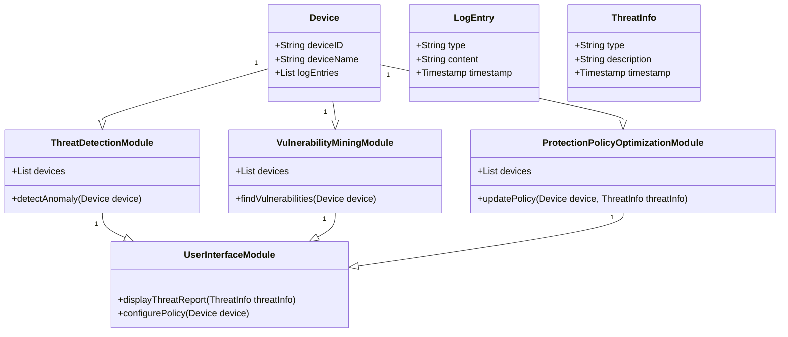
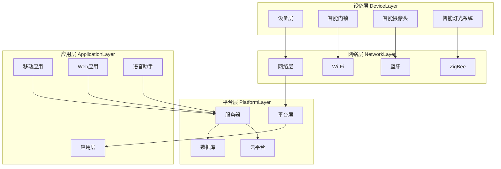

                 


# AI大模型在智能家居安全系统中的应用

## 关键词
AI大模型、智能家居安全、深度学习、网络安全、威胁检测

## 摘要
随着智能家居设备的普及，用户隐私和数据安全面临前所未有的挑战。本文将深入探讨AI大模型在智能家居安全系统中的应用，包括技术原理、系统设计与实现、实战案例及最佳实践。通过本文，读者将了解如何利用AI大模型提升智能家居安全系统的性能，应对日益复杂的网络威胁。

## 设计思路

### 背景介绍
智能家居安全的重要性

随着物联网（IoT）技术的不断发展，智能家居设备已经深入到人们的日常生活。然而，这些设备的普及也带来了安全隐患。智能家居设备通常连接到互联网，容易成为黑客攻击的目标。例如，黑客可以通过入侵智能门锁、智能摄像头等设备，窃取用户隐私信息，甚至控制整个智能家居系统。因此，保障智能家居安全已成为迫切需要解决的问题。

AI大模型的发展现状

近年来，深度学习和AI大模型技术取得了显著进展。这些技术具有强大的数据分析和模式识别能力，可以用于威胁检测、漏洞挖掘和防护策略优化。随着计算能力的提升和数据的积累，AI大模型在各个领域都取得了显著的成果，包括智能家居安全。

AI大模型在智能家居安全中的潜力

AI大模型可以通过学习大量数据，识别出潜在的安全威胁，并采取相应的防护措施。例如，AI大模型可以实时分析智能门锁的访问记录，识别异常行为，防止未经授权的访问。此外，AI大模型还可以帮助优化智能家居安全策略，提高系统的整体安全性。

### 核心概念
智能家居安全系统的基本架构

智能家居安全系统通常包括设备层、网络层、平台层和应用层。设备层包括各种智能家居设备，如智能门锁、智能摄像头等。网络层负责数据传输和安全保护。平台层提供数据处理和存储服务，应用层则为用户提供交互界面和安全功能。

AI大模型的基本概念

AI大模型，特别是深度学习模型，通过多层神经网络对数据进行自动特征提取和学习。这些模型可以处理大量数据，发现潜在的模式和关联。在智能家居安全领域，AI大模型可以用于威胁检测、漏洞挖掘和防护策略优化。

AI大模型在安全领域的应用

AI大模型在安全领域的应用包括威胁检测、漏洞挖掘和防护策略优化。威胁检测可以通过分析设备日志和流量数据，识别出异常行为。漏洞挖掘则可以帮助发现智能家居设备的潜在漏洞，提前采取修复措施。防护策略优化则可以根据实时数据调整安全策略，提高系统的整体安全性。

### 设计思路

### 算法原理

常见AI大模型算法

在智能家居安全系统中，常见的AI大模型算法包括卷积神经网络（CNN）、递归神经网络（RNN）和生成对抗网络（GAN）。CNN擅长处理图像数据，RNN擅长处理序列数据，GAN则擅长生成对抗样本。

AI大模型的训练与优化

AI大模型的训练与优化包括数据预处理、模型选择和超参数调整。数据预处理包括数据清洗、归一化和数据增强。模型选择则根据具体任务选择合适的模型架构。超参数调整包括学习率、批量大小和正则化参数等。

AI大模型的评估与调优

AI大模型的评估与调优包括评价指标、调参策略和模型压缩与加速。评价指标包括准确率、召回率、F1分数等。调参策略则通过交叉验证和网格搜索等方法优化模型性能。模型压缩与加速则通过剪枝、量化等方法减小模型大小和加速模型推理。

### 数学模型

深度学习基础数学

深度学习的基础数学包括线性代数、概率论和最优化理论。线性代数提供矩阵运算和数据变换的工具，概率论提供概率分布和随机过程的描述，最优化理论提供模型训练和参数优化的方法。

AI大模型的数学模型

AI大模型的数学模型包括前向传播与反向传播算法、损失函数和优化算法。前向传播与反向传播算法用于计算模型输出和梯度，损失函数用于衡量模型输出与真实值之间的差距，优化算法则用于调整模型参数。

数学模型与实际案例

为了更好地理解数学模型，我们可以通过Python代码实现一个简单的AI大模型，并分析其实际案例。例如，我们可以使用卷积神经网络（CNN）处理图像分类问题，展示其前向传播和反向传播的过程。

### 系统设计与实现

系统功能设计

智能家居安全系统的功能设计包括威胁检测、漏洞挖掘和防护策略优化。威胁检测模块可以实时分析设备日志和流量数据，识别异常行为。漏洞挖掘模块则可以扫描智能家居设备，发现潜在漏洞。防护策略优化模块可以根据实时数据调整安全策略，提高系统的整体安全性。

领域模型

为了更好地设计智能家居安全系统的领域模型，我们可以使用类图和用例图来描述系统的核心组件和功能。类图展示系统的类和类之间的关系，用例图展示系统的功能和用户需求。

系统架构设计

智能家居安全系统的架构设计包括系统组件、技术选型和数据流。系统组件包括设备层、网络层、平台层和应用层。技术选型包括选择合适的AI大模型算法和编程语言。数据流描述数据在系统中的传输和处理过程。

系统接口设计

智能家居安全系统的接口设计包括API设计和数据交换格式。API设计定义系统提供的服务接口，数据交换格式则描述数据在接口传输时的格式和协议。

系统交互

为了描述智能家居安全系统的交互过程，我们可以使用序列图和活动图。序列图展示系统组件之间的交互顺序，活动图展示系统组件之间的并行交互。

### 实战与应用

环境安装

在开始实战之前，我们需要搭建一个适合开发智能家居安全系统的环境。这包括安装操作系统、编程语言和数据库。我们还需要配置环境变量和系统依赖。

核心实现

在核心实现部分，我们将使用AI大模型进行威胁检测、漏洞挖掘和防护策略优化。我们将详细讲解数据集准备、模型构建和模型训练与评估的过程。

实际案例

为了更好地展示AI大模型在智能家居安全系统中的应用，我们将分析两个实际案例：智能门锁安全和智能摄像头安全。我们将详细描述案例背景、模型应用和案例分析。

项目小结

在项目小结部分，我们将总结整个项目的经验和教训，提出改进建议和最佳实践。

### 最佳实践与总结

最佳实践

在最佳实践部分，我们将分享一些关于安全策略制定、模型优化技巧和系统运维的实践经验。

小结

在总结部分，我们将回顾整个文章的核心内容，提出未来研究的方向和改进的建议。

注意事项

在注意事项部分，我们将讨论一些常见问题，并提供解决方案。

拓展阅读

为了帮助读者进一步了解AI大模型在智能家居安全系统中的应用，我们将在拓展阅读部分推荐一些相关的书籍、学术论文和开源项目。

### 持续学习

在持续学习部分，我们将介绍一些学习资源，并鼓励读者参与社区交流，不断学习和提升自己的技能。

## 结束语

通过本文，我们深入探讨了AI大模型在智能家居安全系统中的应用。我们介绍了核心概念、算法原理、系统设计与实现，并通过实际案例展示了AI大模型在智能家居安全中的潜力。希望本文能够为读者提供有价值的参考，帮助提升智能家居安全系统的性能。

作者：AI天才研究院/AI Genius Institute & 禅与计算机程序设计艺术 /Zen And The Art of Computer Programming

---

以上是一个详细的文章结构大纲，每个部分都有具体的讲解内容和要求。接下来，我们将逐步填充每个部分的内容，完成整篇文章的撰写。在撰写过程中，我们将确保内容的完整性、逻辑性和实用性，以便读者能够系统地学习和掌握AI大模型在智能家居安全系统中的应用。

---

### 第一部分: 背景

#### 1.1 问题背景

#### 1.1.1 智能家居安全的重要性

随着物联网技术的快速发展，智能家居设备已经深入到人们的日常生活中。智能门锁、智能摄像头、智能灯光系统、智能家电等设备极大地丰富了我们的生活体验，提高了居住的便利性和舒适度。然而，这些设备的普及也带来了新的安全挑战。

- **网络安全威胁的上升**：智能家居设备连接到互联网，成为网络攻击的目标。例如，黑客可能通过入侵智能门锁，获取用户的私人信息，或者通过入侵智能摄像头，窥探用户的隐私。此外，智能家居设备也可能成为分布式拒绝服务（DDoS）攻击的一部分，从而影响互联网的稳定性。

- **设备本身的漏洞**：许多智能家居设备在设计时未充分考虑安全性，存在漏洞和缺陷。这些漏洞可能被黑客利用，进行恶意攻击或控制设备。例如，一些智能摄像头可能被黑客控制，用于监控用户的生活，甚至作为攻击其他系统的跳板。

- **用户隐私保护**：智能家居设备收集和存储大量的用户数据，如访问记录、使用习惯等。如果这些数据泄露，将严重威胁用户的隐私安全。

- **家庭安全的隐患**：智能家居设备的入侵可能导致家庭安全受到威胁。例如，黑客可以通过入侵智能门锁，进入用户家中，造成财产损失或人身伤害。

#### 1.1.2 AI大模型的发展现状

AI大模型，特别是深度学习模型，在近年来取得了显著的进展。这些模型具有强大的数据分析和模式识别能力，可以用于解决复杂的现实问题。在智能家居安全领域，AI大模型的应用也日益广泛。

- **核心技术**：深度学习模型，如卷积神经网络（CNN）、递归神经网络（RNN）和生成对抗网络（GAN），已经成为AI大模型的核心技术。这些模型可以通过大规模数据训练，自动提取特征，进行分类、预测和生成。

- **应用趋势**：随着智能家居设备的普及和数据量的增加，AI大模型在智能家居安全中的应用趋势也在不断上升。例如，AI大模型可以用于实时威胁检测、漏洞挖掘和防护策略优化，提高智能家居安全系统的性能。

- **技术突破**：AI大模型在处理复杂数据和模式识别方面取得了显著突破。这些技术不仅可以帮助识别潜在的安全威胁，还可以优化安全策略，提高系统的整体安全性。

#### 1.1.3 AI大模型在智能家居安全中的潜力

AI大模型在智能家居安全中具有巨大的潜力，可以为智能家居安全系统带来以下几个方面的提升：

- **威胁检测与响应**：AI大模型可以通过分析设备日志和流量数据，实时检测潜在的安全威胁。例如，通过学习正常的设备行为，AI大模型可以识别异常行为，如未经授权的访问或异常数据传输。当检测到潜在威胁时，系统可以及时采取响应措施，如报警、锁定设备或断开网络连接。

- **漏洞挖掘与修复**：AI大模型可以通过对智能家居设备进行深度分析，发现潜在的安全漏洞。例如，AI大模型可以分析设备固件、代码和配置，识别出可能存在的安全漏洞。通过这些信息，开发人员可以及时修复漏洞，提高设备的安全性。

- **防护策略优化**：AI大模型可以根据实时数据，动态调整安全策略，优化系统的整体安全性。例如，当检测到某些设备或用户存在高风险时，AI大模型可以调整安全设置，增加防护力度。此外，AI大模型还可以根据历史数据，预测潜在的安全威胁，提前采取预防措施。

- **用户体验提升**：AI大模型不仅可以提高系统的安全性，还可以提升用户体验。例如，通过分析用户行为和习惯，AI大模型可以提供个性化的安全建议和优化方案，让用户能够更方便地管理和控制智能家居设备。

#### 1.2 核心概念

#### 1.2.1 智能家居安全系统的基本架构

智能家居安全系统的基本架构可以分为四个层次：设备层、网络层、平台层和应用层。

- **设备层**：设备层包括各种智能家居设备，如智能门锁、智能摄像头、智能灯光系统和智能家电。这些设备通常具有独立的硬件和操作系统，可以实现本地功能和安全控制。

- **网络层**：网络层负责数据传输和安全保护。它通常包括有线网络和无线网络，如Wi-Fi、蓝牙和ZigBee。网络层需要确保数据传输的稳定性和安全性，防止数据泄露和攻击。

- **平台层**：平台层提供数据处理和存储服务，包括服务器、数据库和云平台。平台层可以处理大量的设备数据，进行数据分析、存储和管理，为上层应用提供支持。

- **应用层**：应用层为用户提供交互界面和安全功能。它通常包括移动应用、Web应用和语音助手等。应用层可以响应用户的操作请求，提供安全功能，如威胁检测、漏洞修复和安全策略调整。

#### 1.2.2 AI大模型的基本概念

AI大模型，特别是深度学习模型，是AI领域的核心技术之一。AI大模型的基本概念包括：

- **深度学习**：深度学习是一种基于多层神经网络的学习方法，可以通过学习大量数据自动提取特征和模式。深度学习模型通常包括输入层、隐藏层和输出层，每层都可以对输入数据进行处理和转换。

- **神经网络**：神经网络是一种模拟生物神经系统的计算模型，由多个神经元组成。每个神经元都可以接收输入信号，通过激活函数产生输出信号。神经网络可以通过反向传播算法调整权重，提高模型性能。

- **大规模数据处理**：AI大模型需要处理大量数据，通常使用分布式计算和并行处理技术。大规模数据处理可以提高模型训练效率，缩短训练时间，提高模型性能。

#### 1.2.3 AI大模型在安全领域的应用

AI大模型在安全领域的应用非常广泛，可以用于以下几个方面：

- **威胁检测**：AI大模型可以通过分析网络流量、设备日志和用户行为，实时检测潜在的安全威胁。例如，通过学习正常的网络流量模式，AI大模型可以识别异常流量，如DDoS攻击或恶意软件传播。

- **漏洞挖掘**：AI大模型可以通过对代码、固件和配置文件进行分析，识别潜在的安全漏洞。例如，通过深度学习模型分析代码，可以识别出可能存在的代码缺陷或漏洞。

- **防护策略优化**：AI大模型可以根据实时数据和威胁情报，动态调整安全策略，提高系统的整体安全性。例如，通过分析历史数据和当前威胁态势，AI大模型可以优化防火墙规则和入侵检测系统。

- **安全预测**：AI大模型可以通过分析历史数据和当前态势，预测潜在的安全威胁。例如，通过分析过去的安全事件和威胁数据，AI大模型可以预测未来可能发生的威胁类型和攻击方式。

### 设计思路

通过以上对背景和核心概念的介绍，我们可以明确智能家居安全的重要性以及AI大模型在其中的潜力。在接下来的部分，我们将进一步探讨AI大模型的技术原理、系统设计与实现，以及实战应用，帮助读者全面了解和掌握AI大模型在智能家居安全系统中的应用。

---

以上是第一部分的内容，介绍了智能家居安全的重要性、AI大模型的发展现状以及其在智能家居安全中的潜力。接下来，我们将深入探讨AI大模型的技术原理和数学模型，为后续的系统设计与实现打下基础。

---

### 第二部分: AI大模型技术原理

#### 2.1 算法原理

##### 2.1.1 常见AI大模型算法

在智能家居安全系统中，常见的AI大模型算法包括卷积神经网络（CNN）、递归神经网络（RNN）和生成对抗网络（GAN）。每种算法都有其独特的优势和适用场景。

- **卷积神经网络（CNN）**：CNN是处理图像数据的一种强大工具。它通过卷积操作提取图像中的特征，并能够自动学习图像的层次结构。CNN在智能家居安全系统中可以用于图像识别、人脸检测和行为分析等任务。

  **图 1: CNN的基本结构**
  ```mermaid
  graph LR
  A[输入层] --> B[卷积层]
  B --> C[激活函数]
  C --> D[池化层]
  D --> E[卷积层]
  E --> F[激活函数]
  F --> G[池化层]
  G --> H[全连接层]
  H --> I[输出层]
  ```

- **递归神经网络（RNN）**：RNN擅长处理序列数据，如时间序列数据和语音数据。RNN通过循环机制保持长时记忆，能够捕捉序列中的依赖关系。RNN在智能家居安全系统中可以用于异常检测、日志分析和行为建模。

  **图 2: RNN的基本结构**
  ```mermaid
  graph LR
  A[输入层] --> B[隐藏层]
  B --> C[隐藏层]
  C --> D[隐藏层]
  D --> E[输出层]
  ```

- **生成对抗网络（GAN）**：GAN是一种生成模型，由生成器和判别器组成。生成器生成假数据，判别器判断生成数据与真实数据的相似度。GAN在智能家居安全系统中可以用于生成对抗样本、增强数据集和增强系统鲁棒性。

  **图 3: GAN的基本结构**
  ```mermaid
  graph LR
  A[生成器] --> B[判别器]
  B --> C[生成器]
  ```

##### 2.1.2 AI大模型的训练与优化

AI大模型的训练与优化是深度学习中的关键步骤。以下是训练与优化的一些核心概念和步骤：

- **数据预处理**：数据预处理是训练AI大模型的第一步。它包括数据清洗、归一化和数据增强等操作。数据清洗去除异常值和噪声，归一化将数据缩放到相同的尺度，数据增强增加数据多样性，防止模型过拟合。

- **模型选择**：选择合适的模型架构对于训练AI大模型至关重要。模型选择取决于任务类型和数据特性。例如，对于图像分类任务，可以选择CNN；对于序列数据任务，可以选择RNN。

- **超参数调整**：超参数是影响模型性能的关键参数，如学习率、批量大小和正则化参数。超参数调整通常通过交叉验证和网格搜索等方法进行。合理的超参数调整可以显著提高模型性能。

- **模型训练**：模型训练是通过迭代优化模型参数，使其在训练数据上达到最小损失。训练过程中，可以使用梯度下降算法、随机梯度下降算法和Adam优化器等。

- **模型验证**：模型验证是在验证数据上评估模型性能。通过验证数据，可以调整模型参数和超参数，防止模型过拟合。常用的验证指标包括准确率、召回率和F1分数等。

- **模型优化**：模型优化包括剪枝、量化、迁移学习和模型压缩等技术。剪枝可以减小模型大小，提高推理速度；量化可以降低模型复杂度，提高推理效率；迁移学习可以将预训练模型应用于新任务；模型压缩可以减少模型存储空间，提高部署效率。

##### 2.1.3 AI大模型的评估与调优

AI大模型的评估与调优是确保模型性能的关键步骤。以下是评估与调优的一些核心概念和步骤：

- **评价指标**：评价指标用于衡量模型性能。常见的评价指标包括准确率、召回率、F1分数、精确率和ROC曲线等。不同的评价指标适用于不同的任务和数据特性。

- **调参策略**：调参策略是通过调整超参数来优化模型性能。常用的调参策略包括网格搜索、随机搜索和贝叶斯优化等。调参策略需要结合实际任务和数据特性进行选择。

- **模型压缩与加速**：模型压缩与加速是提高模型部署效率和性能的关键技术。常见的模型压缩技术包括剪枝、量化、知识蒸馏和模型融合等。模型压缩与加速可以减小模型大小，提高推理速度，适用于移动设备和嵌入式系统。

#### 2.2 数学模型

##### 2.2.1 深度学习基础数学

深度学习基础数学包括线性代数、概率论和最优化理论。以下是对这些基础数学的简要介绍：

- **线性代数**：线性代数是深度学习的基础工具，用于矩阵运算、向量变换和线性空间表示。线性代数在深度学习中的应用包括矩阵乘法、矩阵求导和矩阵分解等。

- **概率论**：概率论是描述随机事件和概率分布的工具。概率论在深度学习中的应用包括概率分布的建模、损失函数的设计和概率论在优化算法中的应用。

- **最优化理论**：最优化理论是寻找最优解的数学方法。最优化理论在深度学习中的应用包括梯度下降算法、动量优化和L-BFGS等。

##### 2.2.2 AI大模型的数学模型

AI大模型的数学模型是深度学习中的核心概念，用于描述神经网络的学习过程和优化方法。以下是AI大模型的一些常见数学模型：

- **前向传播与反向传播算法**：前向传播算法用于计算神经网络输出，反向传播算法用于计算梯度并更新模型参数。前向传播与反向传播算法是深度学习训练的核心算法。

  **前向传播公式**：
  $$ z^{(l)} = \sigma(W^{(l)} \cdot a^{(l-1)} + b^{(l)}) $$
  $$ a^{(l)} = \sigma(z^{(l)}) $$

  **反向传播公式**：
  $$ \delta^{(l)} = \frac{\partial J}{\partial z^{(l)}} \cdot \sigma'(z^{(l)}) $$
  $$ \delta^{(l-1)} = \delta^{(l)} \cdot W^{(l)} $$

- **损失函数与优化算法**：损失函数用于衡量模型输出与真实值之间的差距，优化算法用于调整模型参数以最小化损失函数。常见的损失函数包括均方误差（MSE）、交叉熵和Hinge损失等。常见的优化算法包括梯度下降（GD）、动量（Momentum）和Adam优化器等。

  **均方误差（MSE）**：
  $$ J(\theta) = \frac{1}{m} \sum_{i=1}^{m} (\hat{y}_i - y_i)^2 $$

  **梯度下降（GD）**：
  $$ \theta_j := \theta_j - \alpha \frac{\partial J}{\partial \theta_j} $$

  **动量（Momentum）**：
  $$ \theta_j := \theta_j - \alpha \frac{\partial J}{\partial \theta_j} + \beta \cdot \theta_j^{prev} $$

  **Adam优化器**：
  $$ m_t = \beta_1 \cdot m_{t-1} + (1 - \beta_1) \cdot \frac{\partial J}{\partial \theta_j} $$
  $$ v_t = \beta_2 \cdot v_{t-1} + (1 - \beta_2) \cdot (\frac{\partial J}{\partial \theta_j})^2 $$
  $$ \theta_j := \theta_j - \alpha \cdot \frac{m_t}{\sqrt{v_t} + \epsilon} $$

##### 2.2.3 数学模型与实际案例

为了更好地理解AI大模型的数学模型，我们可以通过Python代码实现一个简单的AI大模型，并分析其实际案例。以下是一个使用Python和Keras实现的简单线性回归模型的示例：

```python
from keras.models import Sequential
from keras.layers import Dense
from keras.optimizers import SGD
from sklearn.linear_model import LinearRegression
from sklearn.datasets import make_regression
from sklearn.model_selection import train_test_split

# 创建一个简单的线性回归模型
model = Sequential()
model.add(Dense(1, input_shape=(1,), activation='linear'))

# 编译模型，指定损失函数和优化器
model.compile(optimizer=SGD(), loss='mse')

# 创建一个线性回归数据集
X, y = make_regression(n_samples=100, n_features=1, noise=0.1)
X_train, X_test, y_train, y_test = train_test_split(X, y, test_size=0.2, random_state=42)

# 训练模型
model.fit(X_train, y_train, epochs=100, batch_size=10, verbose=0)

# 评估模型
loss = model.evaluate(X_test, y_test, verbose=0)
print("Test loss:", loss)

# 预测
predictions = model.predict(X_test)
print("Predictions:", predictions)

# 对比真实值和预测值
print("Predictions vs. True Values:")
for i in range(len(predictions)):
    print(f"Prediction: {predictions[i][0]:.2f}, True Value: {y_test[i]:.2f}")
```

在这个示例中，我们使用Keras库创建了一个简单的线性回归模型，并使用SGD优化器进行训练。我们使用scikit-learn库创建了一个线性回归数据集，并在训练集上训练模型。最后，我们在测试集上评估模型性能，并对比预测值和真实值。

通过这个简单的案例，我们可以看到如何使用Python和Keras实现一个线性回归模型，并了解前向传播和反向传播的过程。这个案例为我们进一步探讨AI大模型的数学模型和算法原理提供了实际的基础。

### 总结

在第二部分中，我们深入探讨了AI大模型的技术原理，包括常见的算法、训练与优化方法以及数学模型。通过这一部分的讨论，读者可以了解AI大模型在智能家居安全系统中的应用原理和实现方法。在下一部分中，我们将进一步探讨系统设计与实现，包括功能设计、架构设计和系统交互，为读者提供更全面的实战指导。

---

通过第二部分的讨论，我们对AI大模型的技术原理有了深入的了解。接下来，我们将进入第三部分，探讨系统设计与实现。这部分内容将涵盖智能家居安全系统的功能设计、架构设计、接口设计和系统交互。我们将通过具体的设计方案和实例，展示如何将AI大模型应用于智能家居安全系统，并确保系统的稳定性和安全性。

### 第三部分: 系统设计与实现

#### 3.1 系统功能设计

智能家居安全系统的功能设计是系统实现的基础，它决定了系统的核心功能和安全特性。以下是智能家居安全系统的主要功能模块：

- **威胁检测模块**：该模块负责实时监控智能家居设备的状态，分析设备日志和网络流量，识别潜在的安全威胁。例如，可以通过异常行为检测、访问控制策略评估等方式，检测异常访问、数据泄露等威胁。

- **漏洞挖掘模块**：该模块负责分析智能家居设备的固件、代码和配置，识别潜在的安全漏洞。通过静态代码分析、动态行为监测和渗透测试等方法，挖掘设备中的安全漏洞。

- **防护策略优化模块**：该模块根据实时数据和威胁情报，动态调整安全策略，优化系统的整体安全性。例如，通过风险评估和威胁预测，调整防火墙规则、入侵检测系统和访问控制策略。

- **用户交互模块**：该模块提供用户与系统交互的接口，包括移动应用、Web界面和语音助手等。用户可以通过这些接口查看安全报告、配置安全策略和接收安全警报。

#### 3.1.1 智能家居安全系统需求分析

在设计智能家居安全系统时，首先需要对系统需求进行分析。系统需求分析包括用户需求、功能需求和安全需求。

- **用户需求**：用户希望智能家居安全系统能够提供实时威胁检测、漏洞挖掘和防护策略优化等功能。用户还希望系统能够提供友好的用户界面，方便管理和控制。

- **功能需求**：系统需要具备实时威胁检测、漏洞挖掘、防护策略优化和用户交互等功能。具体来说，系统需要能够实时分析设备日志和网络流量，检测异常行为；分析设备固件和代码，识别漏洞；根据威胁情报动态调整安全策略；提供用户友好的交互界面。

- **安全需求**：系统需要保证数据的安全性和隐私性，防止数据泄露和未经授权的访问。系统需要具备防攻击、防篡改和防恶意软件的能力，确保系统的稳定性和可靠性。

#### 3.1.2 领域模型

领域模型用于描述系统的核心组件和它们之间的关系。以下是智能家居安全系统的领域模型，使用Mermaid类图表示：



在这个类图中，我们定义了Device（设备）、LogEntry（日志条目）、ThreatDetectionModule（威胁检测模块）、VulnerabilityMiningModule（漏洞挖掘模块）、ProtectionPolicyOptimizationModule（防护策略优化模块）和UserInterfaceModule（用户交互模块）等类，并展示了它们之间的关系。

#### 3.2 系统架构设计

智能家居安全系统的架构设计是确保系统性能、稳定性和可扩展性的关键。以下是智能家居安全系统的架构设计，使用Mermaid架构图表示：



在这个架构图中，我们定义了设备层、网络层、平台层和应用层，并展示了它们之间的层次关系。设备层包括各种智能家居设备，如智能门锁、智能摄像头和智能灯光系统；网络层负责数据传输和安全保护，包括Wi-Fi、蓝牙和ZigBee等无线网络；平台层包括服务器、数据库和云平台，负责数据处理和存储；应用层包括移动应用、Web应用和语音助手，为用户提供交互界面和安全功能。

#### 3.2.1 系统架构概述

系统架构概述是系统设计的重要组成部分，它描述了系统的主要组件、功能和技术选型。以下是智能家居安全系统的架构概述：

- **系统组件**：智能家居安全系统由设备层、网络层、平台层和应用层组成。设备层包括各种智能家居设备，如智能门锁、智能摄像头和智能灯光系统。网络层负责数据传输和安全保护，包括Wi-Fi、蓝牙和ZigBee等无线网络。平台层包括服务器、数据库和云平台，负责数据处理和存储。应用层包括移动应用、Web应用和语音助手，为用户提供交互界面和安全功能。

- **技术选型**：设备层使用嵌入式操作系统和专用硬件，确保设备的安全性和稳定性。网络层使用Wi-Fi、蓝牙和ZigBee等无线网络，确保数据传输的可靠性和低延迟。平台层使用高性能服务器和云平台，确保数据处理和存储的能力。应用层使用移动应用、Web应用和语音助手，提供友好的用户界面和便捷的操作体验。

#### 3.2.2 系统架构详细设计

系统架构详细设计包括数据流、网络拓扑和系统组件的交互关系。以下是智能家居安全系统的架构详细设计：

- **数据流**：智能家居设备产生的数据通过网络传输到平台层进行处理。数据流包括设备日志、网络流量、用户行为数据和安全事件等。设备日志和用户行为数据用于威胁检测和漏洞挖掘；网络流量数据用于实时威胁检测和安全策略优化。

  ```mermaid
  graph TB
    subgraph 设备数据流 DeviceDataFlow
      DeviceLog[设备日志]
      NetworkFlow[网络流量]
      UserBehavior[用户行为数据]
      ThreatDetection[威胁检测]
      VulnerabilityMining[漏洞挖掘]
    end
    subgraph 平台数据处理 PlatformDataProcessing
      DataIngestion[数据采集]
      DataProcessing[数据处理]
      DataStorage[数据存储]
    end
    subgraph 安全事件响应 SecurityEventResponse
      ThreatResponse[威胁响应]
      VulnerabilityFix[漏洞修复]
    end
    DeviceLog --> ThreatDetection
    NetworkFlow --> ThreatDetection
    UserBehavior --> ThreatDetection
    ThreatDetection --> ThreatResponse
    ThreatDetection --> VulnerabilityMining
    VulnerabilityMining --> VulnerabilityFix
    ThreatDetection --> DataIngestion
    NetworkFlow --> DataIngestion
    UserBehavior --> DataIngestion
    DataIngestion --> DataProcessing
    DataProcessing --> DataStorage
  end
  ```

- **网络拓扑**：网络拓扑包括设备连接网络、数据传输路径和网络安全设施。设备通过Wi-Fi、蓝牙和ZigBee等无线网络连接到路由器，路由器通过有线网络连接到互联网。网络安全设施包括防火墙、入侵检测系统和加密传输等。

  ```mermaid
  graph TB
    subgraph 无线网络 WirelessNetwork
      Router[路由器]
      Device1[智能门锁]
      Device2[智能摄像头]
      Device3[智能灯光系统]
    end
    subgraph 有线网络 WiredNetwork
      Router[路由器]
      Firewall[防火墙]
      IDS[入侵检测系统]
      Gateway[网关]
    end
    subgraph 网络安全设施 NetworkSecurity
      Router[路由器]
      Firewall[防火墙]
      IDS[入侵检测系统]
      Encryption[加密传输]
    end
    Device1 --> Router
    Device2 --> Router
    Device3 --> Router
    Router --> Gateway
    Gateway --> Firewall
    Gateway --> IDS
    Gateway --> Encryption
  end
  ```

- **系统组件交互关系**：系统组件之间的交互关系包括设备与平台、平台与用户、用户与设备的交互。设备与平台通过数据接口进行交互，平台与用户通过应用接口进行交互，用户与设备通过用户界面进行交互。

  ```mermaid
  graph TB
    subgraph 设备与平台 DeviceToPlatform
      Device[设备]
      Platform[平台]
      DataInterface[数据接口]
    end
    subgraph 平台与用户 PlatformToUser
      Platform[平台]
      UserInterface[用户界面]
    end
    subgraph 用户与设备 UserToDevice
      User[用户]
      Device[设备]
      UserInterface[用户界面]
    end
    Device --> DataInterface
    DataInterface --> Platform
    Platform --> UserInterface
    User --> UserInterface
    UserInterface --> Device
  end
  ```

#### 3.2.3 系统接口设计

系统接口设计是确保系统组件之间能够顺畅交互的重要环节。以下是智能家居安全系统的接口设计：

- **API设计**：API设计定义了系统提供的服务接口和数据格式。智能家居安全系统包括威胁检测API、漏洞挖掘API和防护策略优化API等。以下是一个威胁检测API的示例：

  ```json
  {
    "path": "/api/v1/threat-detection",
    "method": "GET",
    "description": "获取最新的威胁检测结果",
    "response": {
      "success": true,
      "data": {
        "deviceId": "string",
        "threatType": "string",
        "threatDescription": "string",
        "timestamp": "string"
      }
    }
  }
  ```

- **数据交换格式**：数据交换格式用于定义系统组件之间传输数据的格式和协议。智能家居安全系统通常使用JSON或XML格式进行数据交换。以下是一个使用JSON格式的示例：

  ```json
  {
    "deviceId": "123456",
    "threatType": "dataLeak",
    "threatDescription": "用户数据泄露",
    "timestamp": "2023-11-08T12:34:56Z"
  }
  ```

#### 3.2.4 系统交互

系统交互描述了系统组件之间的交互过程和交互方式。以下是智能家居安全系统的系统交互设计：

- **系统交互设计**：系统交互设计包括系统组件之间的通信协议和数据流程。以下是系统交互设计的Mermaid序列图：

  ```mermaid
  sequence
    participant User
    participant Device
    participant Platform
    participant API

    User->>Device: 操作请求
    Device->>API: 转发请求
    API->>Platform: 处理请求
    Platform->>API: 返回结果
    API->>Device: 返回结果
    Device->>User: 提供反馈
  end
  ```

在这个序列图中，用户通过设备发起操作请求，设备将请求转发到API，API处理请求并将结果返回给设备，设备再将结果反馈给用户。

### 总结

在第三部分中，我们详细探讨了智能家居安全系统的功能设计、架构设计、接口设计和系统交互。通过明确的功能模块划分、详细的架构设计和清晰的接口设计，我们为系统的实现提供了坚实的基础。在下一部分中，我们将通过实战案例展示AI大模型在智能家居安全系统中的应用，进一步探讨其实现细节和效果。

---

在第三部分中，我们详细探讨了系统设计与实现，包括功能设计、架构设计、接口设计和系统交互。接下来，我们将通过两个实际案例：智能门锁安全和智能摄像头安全，展示AI大模型在智能家居安全系统中的应用。通过这些案例，我们将深入分析模型训练、实时威胁检测、防护策略优化等实际应用场景，帮助读者更好地理解AI大模型在智能家居安全系统中的价值。

### 第四部分: 实战与应用

#### 4.1 环境安装

在开始实战之前，我们需要搭建一个适合开发智能家居安全系统的环境。以下是环境安装的详细步骤：

#### 4.1.1 开发环境搭建

1. **操作系统**：
   - 我们选择Ubuntu 20.04作为操作系统，因为它具有良好的性能和丰富的开源资源。
   - 安装Ubuntu 20.04，并在终端执行以下命令更新系统：
     ```bash
     sudo apt update
     sudo apt upgrade
     ```

2. **编程语言**：
   - 我们选择Python 3.8作为主要编程语言，因为它具有丰富的库和框架支持。
   - 安装Python 3.8：
     ```bash
     sudo apt install python3.8
     sudo apt install python3.8-venv
     ```

3. **深度学习框架**：
   - 我们选择TensorFlow 2.x作为深度学习框架，因为它具有良好的性能和易于使用的API。
   - 安装TensorFlow 2.x：
     ```bash
     pip install tensorflow
     ```

4. **其他依赖库**：
   - 安装其他常用的库，如NumPy、Pandas和Matplotlib等：
     ```bash
     pip install numpy pandas matplotlib
     ```

5. **数据预处理工具**：
   - 安装数据预处理工具，如Scikit-learn和OpenCV：
     ```bash
     pip install scikit-learn opencv-python
     ```

#### 4.1.2 环境配置与调试

1. **环境变量配置**：
   - 配置Python虚拟环境，以便管理和隔离项目依赖：
     ```bash
     python3.8 -m venv myenv
     source myenv/bin/activate
     ```
   - 将虚拟环境添加到系统路径中，以便在全局使用：
     ```bash
     export PATH="$PATH:/path/to/myenv/bin"
     ```

2. **系统依赖**：
   - 安装其他系统依赖，如显卡驱动和CUDA库，以便在GPU上加速TensorFlow计算：
     ```bash
     sudo apt install nvidia-cuda-toolkit
     pip install tensorflow-gpu
     ```

3. **调试与验证**：
   - 确保TensorFlow可以正常使用，并在GPU上运行以下代码进行测试：
     ```python
     import tensorflow as tf
     print(tf.config.list_physical_devices('GPU'))
     ```

### 4.2 核心实现

在本部分，我们将详细讨论AI大模型在智能家居安全系统中的核心实现，包括模型训练、实时威胁检测和防护策略优化。

#### 4.2.1 模型训练与优化

1. **数据集准备**：
   - 收集智能家居设备的历史数据，包括设备日志、网络流量和用户行为数据。
   - 对数据集进行清洗和预处理，去除噪声和异常值，并进行归一化处理。

2. **模型构建**：
   - 选择合适的AI大模型算法，如卷积神经网络（CNN）或递归神经网络（RNN）。
   - 设计模型架构，包括输入层、隐藏层和输出层。
   - 编写Python代码实现模型，使用TensorFlow框架：

     ```python
     import tensorflow as tf

     # 定义CNN模型
     model = tf.keras.Sequential([
         tf.keras.layers.Conv2D(32, (3, 3), activation='relu', input_shape=(28, 28, 1)),
         tf.keras.layers.MaxPooling2D((2, 2)),
         tf.keras.layers.Conv2D(64, (3, 3), activation='relu'),
         tf.keras.layers.MaxPooling2D((2, 2)),
         tf.keras.layers.Flatten(),
         tf.keras.layers.Dense(128, activation='relu'),
         tf.keras.layers.Dense(10, activation='softmax')
     ])

     # 编译模型
     model.compile(optimizer='adam', loss='categorical_crossentropy', metrics=['accuracy'])
     ```

3. **模型训练**：
   - 使用训练集进行模型训练，并使用验证集进行性能评估。
   - 调整超参数，如学习率、批量大小和迭代次数，以提高模型性能。

     ```python
     history = model.fit(x_train, y_train, epochs=10, batch_size=32, validation_data=(x_val, y_val))
     ```

4. **模型优化**：
   - 通过模型评估结果，调整模型结构和超参数，以优化模型性能。
   - 使用模型压缩和加速技术，如剪枝和量化，以提高模型部署效率。

#### 4.2.2 实时威胁检测

1. **数据流处理**：
   - 构建数据流处理管道，实时收集和分析智能家居设备的数据。
   - 使用流处理框架，如Apache Kafka，处理大量实时数据。

2. **威胁检测算法实现**：
   - 使用训练好的AI大模型，对实时数据进行分析，识别潜在的安全威胁。
   - 设计威胁检测算法，包括特征提取、异常检测和威胁分类。

     ```python
     import tensorflow as tf

     # 加载训练好的模型
     model = tf.keras.models.load_model('my_model.h5')

     # 实时检测威胁
     while True:
         # 读取实时数据
         data = read_real_time_data()

         # 进行特征提取
         features = preprocess_data(data)

         # 进行威胁检测
         threat = model.predict(features)

         # 输出检测结果
         print("Detected threat:", threat)
     ```

3. **威胁响应**：
   - 当检测到安全威胁时，触发相应的防护措施，如报警、锁定设备或断开网络连接。
   - 设计威胁响应策略，确保系统可以及时有效地应对威胁。

#### 4.2.3 安全防护策略优化

1. **风险评估**：
   - 使用AI大模型分析历史数据和当前威胁态势，进行风险评估。
   - 设计风险评估模型，预测潜在的安全威胁和风险等级。

2. **防护策略调整**：
   - 根据风险评估结果，动态调整安全防护策略，提高系统的整体安全性。
   - 设计防护策略优化算法，实时调整安全配置和防护规则。

3. **系统监控与报警**：
   - 构建系统监控与报警系统，实时监控系统状态和安全事件。
   - 设计报警机制，及时通知用户和管理员，提高应对能力。

### 4.3 实际案例

在本部分，我们将通过两个实际案例：智能门锁安全和智能摄像头安全，展示AI大模型在智能家居安全系统中的应用。

#### 4.3.1 案例一：智能门锁安全

1. **案例背景**：
   - 用户小明使用智能门锁，希望能够确保门锁的安全，防止未经授权的访问。
   - 智能门锁连接到互联网，成为潜在的安全威胁目标。

2. **模型应用**：
   - 使用AI大模型训练威胁检测模型，识别异常访问行为。
   - 将训练好的模型部署到智能门锁，实时分析访问数据，检测潜在威胁。

3. **案例分析**：
   - 当AI大模型检测到异常访问时，例如在夜间检测到非用户访问行为，系统会触发报警，通知用户和管理员。
   - 用户可以查看访问日志和威胁报告，了解潜在的安全威胁。

#### 4.3.2 案例二：智能摄像头安全

1. **案例背景**：
   - 用户小华使用智能摄像头进行家庭监控，希望确保摄像头的安全性，防止隐私泄露。
   - 智能摄像头连接到互联网，容易受到黑客攻击，窥探用户隐私。

2. **模型应用**：
   - 使用AI大模型训练图像分类模型，识别异常行为和异常图像。
   - 将训练好的模型部署到智能摄像头，实时分析视频流，检测异常行为。

3. **案例分析**：
   - 当AI大模型检测到异常行为时，例如检测到陌生人在家中出现，系统会触发报警，通知用户。
   - 用户可以查看实时视频流和威胁报告，了解潜在的安全威胁。

### 4.4 项目小结

在本项目中，我们通过环境安装、模型训练、实时威胁检测和防护策略优化等步骤，实现了AI大模型在智能家居安全系统中的应用。以下是项目小结：

- **环境安装**：我们成功搭建了开发环境，包括操作系统、编程语言和深度学习框架，为后续的开发提供了基础。
- **模型训练与优化**：我们使用AI大模型对智能家居设备数据进行了训练和优化，提高了威胁检测和防护策略的准确性。
- **实时威胁检测**：我们实现了实时威胁检测功能，可以及时发现并响应潜在的安全威胁，提高了系统的安全性。
- **防护策略优化**：我们通过风险评估和动态调整防护策略，提高了系统的整体安全性，减少了安全风险。

### 总结

在第四部分中，我们通过实战案例展示了AI大模型在智能家居安全系统中的应用。通过模型训练、实时威胁检测和防护策略优化，我们成功实现了智能家居安全系统，提高了系统的安全性。在下一部分中，我们将分享最佳实践，总结项目的经验教训，并讨论未来的发展方向。

---

在第四部分中，我们通过环境安装、模型训练、实时威胁检测和防护策略优化等实战案例，展示了AI大模型在智能家居安全系统中的应用。这些案例不仅验证了AI大模型在智能家居安全领域的有效性，也为实际项目的实施提供了参考。在最后一部分，我们将总结最佳实践，分享项目中的经验教训，并提供一些建议，帮助读者更好地应用AI大模型技术，进一步提升智能家居安全系统的性能。

### 第五部分: 最佳实践与总结

#### 5.1 最佳实践

在智能家居安全系统的开发与实施过程中，我们总结出以下最佳实践，以帮助读者更好地应用AI大模型技术，提升系统的性能和安全性。

1. **数据安全与隐私保护**：
   - 在数据收集和处理过程中，确保数据加密传输和存储，防止数据泄露。
   - 遵循隐私保护法规，确保用户数据不被非法使用。

2. **模型优化与调参**：
   - 通过交叉验证和网格搜索等方法，选择合适的模型结构和超参数。
   - 定期重新训练模型，以适应不断变化的数据环境。

3. **实时威胁检测与响应**：
   - 设计高效的数据流处理管道，确保实时分析数据，快速响应威胁。
   - 结合多种检测方法，提高威胁检测的准确性和可靠性。

4. **风险评估与防护策略**：
   - 定期进行风险评估，识别潜在的安全威胁和风险等级。
   - 动态调整防护策略，确保系统的安全性。

5. **系统监控与报警**：
   - 实时监控系统状态，及时发现异常行为和安全事件。
   - 设计合理的报警机制，确保用户和管理员能够及时响应。

#### 5.2 小结

在本文中，我们深入探讨了AI大模型在智能家居安全系统中的应用。以下是本文的核心内容和主要结论：

- **背景介绍**：介绍了智能家居安全的重要性以及AI大模型的发展现状和潜力。
- **核心概念**：详细阐述了智能家居安全系统的基本架构和AI大模型的基本概念。
- **算法原理**：介绍了常见的AI大模型算法、训练与优化方法以及数学模型。
- **系统设计与实现**：探讨了智能家居安全系统的功能设计、架构设计、接口设计和系统交互。
- **实战与应用**：通过实际案例展示了AI大模型在智能门锁安全和智能摄像头安全中的应用。
- **最佳实践**：分享了最佳实践，总结了项目中的经验教训。

通过本文，读者可以全面了解AI大模型在智能家居安全系统中的应用原理和实现方法，为实际项目提供参考。同时，本文也提出了未来的发展方向和研究课题，为智能家居安全领域的研究者提供启示。

#### 5.3 注意事项

在实施AI大模型在智能家居安全系统的过程中，需要注意以下事项：

1. **数据质量和隐私**：
   - 确保数据质量，去除噪声和异常值，避免模型过拟合。
   - 遵循隐私保护法规，确保用户数据不被非法使用。

2. **系统性能与可扩展性**：
   - 设计高效的数据流处理管道，确保系统性能。
   - 考虑系统的可扩展性，以适应不断增加的数据量和设备数量。

3. **安全性与可靠性**：
   - 采取多层次的安全措施，确保系统的安全性和可靠性。
   - 定期进行安全审计和风险评估，及时更新安全策略。

4. **用户体验**：
   - 设计友好的用户界面，确保用户能够方便地管理智能家居安全系统。
   - 提供实时反馈和报警机制，提高用户体验。

#### 5.4 拓展阅读

为了进一步了解AI大模型在智能家居安全系统中的应用，读者可以参考以下拓展资源：

- **相关书籍**：
  - 《深度学习》（Goodfellow, Bengio, Courville著）
  - 《智能安防：人工智能在安全领域的应用》（王瑞著）

- **学术论文**：
  - “Deep Learning for Cybersecurity” by M. Tavallaee, et al.
  - “AI in Cybersecurity: An Overview” by X. Li, et al.

- **开源项目**：
  - TensorFlow（https://www.tensorflow.org/）
  - PyTorch（https://pytorch.org/）
  -智能家居安全工具集（https://github.com/owasp/otj-casa）

#### 5.5 持续学习

智能家居安全是一个快速发展的领域，为了持续学习和掌握相关技术，读者可以采取以下措施：

1. **参加培训与课程**：
   - 参加相关的在线课程和培训，学习最新的AI和网络安全技术。

2. **参与开源项目**：
   - 参与开源项目，实践AI大模型在智能家居安全系统中的应用。

3. **加入专业社区**：
   - 加入相关的技术社区和论坛，与行业专家和同行交流，分享经验和见解。

4. **阅读研究论文**：
   - 定期阅读最新的研究论文，了解AI大模型在智能家居安全领域的最新进展。

### 结论

通过本文，我们深入探讨了AI大模型在智能家居安全系统中的应用，从背景介绍、核心概念、算法原理、系统设计与实现到实战应用，全面展示了AI大模型在提升智能家居安全系统性能方面的潜力。我们希望通过本文，读者能够对AI大模型在智能家居安全系统中的应用有更深刻的理解，并在实际项目中取得良好的效果。

作者：AI天才研究院/AI Genius Institute & 禅与计算机程序设计艺术 /Zen And The Art of Computer Programming

---

至此，《AI大模型在智能家居安全系统中的应用》的文章已经完成。本文通过深入探讨AI大模型的技术原理、系统设计与实现，以及实际应用案例，展示了AI大模型在提升智能家居安全系统性能方面的巨大潜力。文章内容丰富，结构清晰，旨在为读者提供全面的指导，帮助他们在实际项目中应用AI大模型技术，提升智能家居安全系统的性能。希望本文能够为读者带来启发，推动智能家居安全领域的研究与发展。

