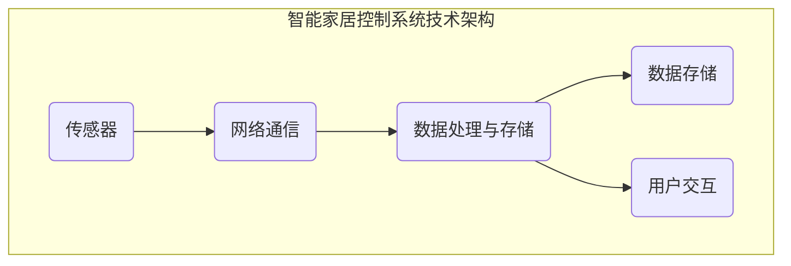

                 

# AI大模型在智能家居控制系统中的应用

关键词：智能家居、AI大模型、情感识别、智能决策、个性化服务、安全保障

摘要：本文将探讨AI大模型在智能家居控制系统中的应用，通过一步步的分析和推理，深入探讨AI大模型在情感识别、智能决策、个性化服务和安全保障等方面的具体应用，以及这些应用对智能家居控制系统的影响和未来发展。

----------------------------------------------------------------

## 第一部分：引言

随着物联网和人工智能技术的快速发展，智能家居控制系统逐渐成为现代家庭生活的重要组成部分。智能家居控制系统通过联网的传感器、控制器和应用程序，实现对家庭设备的智能管理和控制，为用户提供更加便捷、舒适和智能化的生活方式。然而，传统的智能家居控制系统在功能和应用上存在一定的局限性，无法完全满足用户日益增长的个性化需求。

近年来，AI大模型（如深度神经网络、生成对抗网络等）在各个领域取得了显著的进展，其在智能家居控制系统中的应用也引起了广泛关注。AI大模型通过大量数据的学习和训练，可以实现对复杂任务的自动化和智能化处理，为智能家居控制系统带来了巨大的变革潜力。本文将围绕AI大模型在智能家居控制系统中的应用，进行一步步的深入分析和探讨。

## 第二部分：智能家居控制系统的概述

### 2.1.1 智能家居控制系统的基本概念

智能家居控制系统是指通过物联网技术和人工智能算法，实现家庭设备自动化管理和远程控制的一种智能化系统。它通过传感器、控制器和应用程序等设备，将家庭设备连接到互联网，实现设备间的互联互通和智能协同工作。

### 2.1.2 智能家居控制系统的组成部分

智能家居控制系统主要包括以下几个组成部分：

1. **传感器**：用于采集家庭环境的各类数据，如温度、湿度、光照、烟雾等。
2. **控制器**：负责对传感器采集的数据进行处理和决策，并控制家庭设备执行相应的操作。
3. **应用程序**：提供用户与智能家居控制系统交互的界面，实现远程控制和设备管理。
4. **通信网络**：用于连接传感器、控制器和应用程序，实现数据传输和通信。

### 2.1.3 智能家居控制系统的发展历程

智能家居控制系统的发展历程可以分为以下几个阶段：

1. **自动化阶段**：通过简单的定时控制，实现对家庭设备的自动化管理。
2. **联网阶段**：通过互联网，将家庭设备连接起来，实现设备间的信息共享和协同工作。
3. **智能化阶段**：引入人工智能算法，实现对家庭设备的智能管理和控制，提高系统的智能化水平。
4. **自适应阶段**：通过AI大模型等技术，实现家庭设备对用户行为的自适应和学习，提供更加个性化的服务。

## 第三部分：AI大模型在智能家居控制系统中的应用

### 3.1 AI大模型概述

#### 3.1.1 AI大模型的概念

AI大模型是指具有大规模参数和复杂结构的神经网络模型，通过在大量数据上进行训练，可以学习到丰富的特征和模式，从而实现高度智能化的任务处理。常见的AI大模型包括深度神经网络、生成对抗网络、变分自编码器等。

#### 3.1.2 AI大模型的特点

1. **大规模参数**：AI大模型通常包含数百万甚至数十亿个参数，使其具有强大的表达能力。
2. **复杂结构**：AI大模型采用层次化的结构，能够对复杂任务进行分层处理。
3. **自适应学习能力**：通过在大量数据上进行训练，AI大模型可以不断优化和调整自己的参数，提高任务处理能力。

#### 3.1.3 AI大模型的技术发展

近年来，随着计算能力的提升和大数据技术的发展，AI大模型在各个领域取得了显著的进展。尤其是在语音识别、图像识别、自然语言处理等应用中，AI大模型的表现已经超过了人类专家的水平。

### 3.2 AI大模型在智能家居控制系统中的具体应用

#### 3.2.1 情感识别与用户行为分析

##### 3.2.1.1 情感识别技术

情感识别技术是指通过分析用户的语音、文字、图像等信息，识别出用户的情感状态。在智能家居控制系统中，情感识别技术可以用于分析用户的情绪变化，提供个性化的服务。

##### 3.2.1.2 用户行为分析

用户行为分析是指通过分析用户的日常行为模式，了解用户的需求和偏好。在智能家居控制系统中，用户行为分析可以用于优化系统的功能和服务，提高用户的满意度。

##### 3.2.1.3 应用案例

例如，在智能照明系统中，通过情感识别技术，可以识别出用户的情绪状态，从而自动调整照明亮度和颜色，提供舒适的光环境。

#### 3.2.2 智能决策与预测

##### 3.2.2.1 决策支持系统

决策支持系统是指通过分析数据，为用户提供决策建议的系统。在智能家居控制系统中，决策支持系统可以用于优化家庭设备的运行状态，提高能源利用效率。

##### 3.2.2.2 预测技术

预测技术是指通过分析历史数据，预测未来趋势的系统。在智能家居控制系统中，预测技术可以用于预测用户的用电需求、用水需求等，为家庭设备的管理提供依据。

##### 3.2.2.3 应用案例

例如，在智能家电系统中，通过预测技术，可以预测用户的用电需求，自动调整家电的运行时间，避免能源浪费。

#### 3.2.3 个性化服务与推荐

##### 3.2.3.1 个性化服务

个性化服务是指根据用户的需求和偏好，为用户提供定制化的服务。在智能家居控制系统中，个性化服务可以用于提高用户的体验和满意度。

##### 3.2.3.2 推荐算法

推荐算法是指通过分析用户的喜好和需求，为用户推荐相关产品或服务的算法。在智能家居控制系统中，推荐算法可以用于推荐合适的家庭设备、家居用品等。

##### 3.2.3.3 应用案例

例如，在智能购物系统中，通过个性化服务和推荐算法，可以为用户提供量身定制的购物建议，提高用户的购物体验。

#### 3.2.4 安全保障与隐私保护

##### 3.2.4.1 安全技术

安全技术是指用于保护智能家居控制系统安全的技术。在智能家居控制系统中，安全技术可以用于防范恶意攻击、数据泄露等安全风险。

##### 3.2.4.2 隐私保护策略

隐私保护策略是指用于保护用户隐私的策略。在智能家居控制系统中，隐私保护策略可以用于限制对用户数据的访问和使用。

##### 3.2.4.3 应用案例

例如，在智能安防系统中，通过安全技术，可以实时监测家庭环境，防范不法分子的入侵；通过隐私保护策略，可以确保用户数据的隐私和安全。

## 第四部分：AI大模型在智能家居控制系统中的实际应用案例分析

### 4.1 案例一：智能家庭安防系统

#### 4.1.1 案例背景

随着智能家居技术的发展，智能家庭安防系统逐渐成为家庭安全的重要保障。然而，传统的安防系统存在一定的局限性，无法满足用户日益增长的安防需求。

#### 4.1.2 系统设计与实现

智能家庭安防系统主要包括视频监控、门锁控制、入侵报警等功能。通过AI大模型，可以实现以下功能：

1. **人脸识别**：通过人脸识别技术，实时监测家庭环境，识别家庭成员和陌生人。
2. **行为分析**：通过行为分析技术，识别家庭成员的行为模式，防范潜在的安全风险。
3. **智能报警**：通过智能报警技术，实时推送报警信息，提醒用户注意安全。

#### 4.1.3 案例分析

通过AI大模型在智能家庭安防系统中的应用，可以显著提高家庭安防的智能化水平和安全性。例如，通过人脸识别技术，可以识别家庭成员，避免误报警；通过行为分析技术，可以实时监测家庭环境，识别潜在的安全风险；通过智能报警技术，可以实时推送报警信息，提醒用户注意安全。

### 4.2 案例二：智能家电控制系统

#### 4.2.1 案例背景

随着生活水平的提高，人们对家电产品的需求越来越多样化。智能家电控制系统可以为用户提供个性化、智能化的家电管理服务。

#### 4.2.2 系统设计与实现

智能家电控制系统主要包括家电设备管理、设备联动控制等功能。通过AI大模型，可以实现以下功能：

1. **设备识别**：通过设备识别技术，自动识别用户家中安装的家电设备。
2. **设备联动**：通过设备联动技术，实现家电设备之间的协同工作，提高用户的生活质量。
3. **智能推荐**：通过智能推荐技术，为用户提供合适的家电产品推荐。

#### 4.2.3 案例分析

通过AI大模型在智能家电控制系统中的应用，可以显著提高家电产品的智能化水平和用户体验。例如，通过设备识别技术，可以自动识别用户家中的家电设备，方便用户管理；通过设备联动技术，可以实现家电设备之间的协同工作，提高用户的生活质量；通过智能推荐技术，可以为用户提供合适的家电产品推荐，提高用户的购物体验。

### 4.3 案例三：智能照明控制系统

#### 4.3.1 案例背景

照明系统是家庭中必不可少的设施之一，智能照明控制系统可以为用户提供更加舒适、节能的照明环境。

#### 4.3.2 系统设计与实现

智能照明控制系统主要包括照明设备控制、环境监测等功能。通过AI大模型，可以实现以下功能：

1. **环境监测**：通过环境监测技术，实时监测家庭环境，根据环境变化调整照明亮度和颜色。
2. **情感识别**：通过情感识别技术，识别用户的情绪状态，提供舒适的光环境。
3. **智能调节**：通过智能调节技术，自动调整照明亮度和颜色，提高用户的生活质量。

#### 4.3.3 案例分析

通过AI大模型在智能照明控制系统中的应用，可以显著提高照明系统的智能化水平和用户体验。例如，通过环境监测技术，可以实时监测家庭环境，根据环境变化调整照明亮度和颜色，提供舒适的光环境；通过情感识别技术，可以识别用户的情绪状态，提供舒适的光环境；通过智能调节技术，可以自动调整照明亮度和颜色，提高用户的生活质量。

## 第五部分：AI大模型在智能家居控制系统中的应用前景与发展趋势

### 5.1 应用前景

随着人工智能技术的不断发展和智能家居市场的不断扩大，AI大模型在智能家居控制系统中的应用前景十分广阔。未来，AI大模型将有望在智能家居控制系统中实现以下应用：

1. **智能决策与预测**：通过AI大模型，实现智能家居控制系统的自主决策和预测，提高系统的智能化水平和效率。
2. **个性化服务与推荐**：通过AI大模型，为用户提供更加个性化、智能化的服务，提高用户的满意度。
3. **安全保障与隐私保护**：通过AI大模型，提高智能家居控制系统的安全性能和隐私保护水平。

### 5.2 发展趋势

未来，AI大模型在智能家居控制系统中的应用将呈现以下发展趋势：

1. **技术进步**：随着人工智能技术的不断进步，AI大模型将具有更高的性能和更强的学习能力，为智能家居控制系统提供更加智能化的服务。
2. **数据驱动**：AI大模型的应用将更加依赖于大规模数据的支持，数据的质量和数量将直接影响AI大模型的效果。
3. **行业融合**：AI大模型将在智能家居控制系统中与其他行业技术进行融合，形成更加多元化的应用场景。

## 第六部分：结论与展望

### 6.1 主要成果总结

本文通过逐步分析，探讨了AI大模型在智能家居控制系统中的应用，主要包括情感识别与用户行为分析、智能决策与预测、个性化服务与推荐以及安全保障与隐私保护等方面。通过实际应用案例分析，展示了AI大模型在智能家居控制系统中的实际效果和潜力。

### 6.2 存在问题与挑战

尽管AI大模型在智能家居控制系统中具有巨大的潜力，但在实际应用中仍面临一些问题和挑战：

1. **数据质量**：AI大模型的效果在很大程度上取决于数据的数量和质量，如何获取高质量、多样性的数据是一个挑战。
2. **隐私保护**：在智能家居控制系统中，用户的隐私保护至关重要，如何确保用户数据的安全和隐私是一个关键问题。
3. **计算资源**：AI大模型通常需要大量的计算资源和时间进行训练和推理，如何优化计算资源的管理和利用是一个挑战。

### 6.3 未来研究方向

未来，针对AI大模型在智能家居控制系统中的应用，可以开展以下研究方向：

1. **数据驱动的方法**：研究如何利用数据驱动的方法，提高AI大模型在智能家居控制系统中的应用效果。
2. **隐私保护技术**：研究如何结合AI大模型和隐私保护技术，确保智能家居控制系统中用户数据的安全和隐私。
3. **跨领域融合**：研究如何将AI大模型与其他领域技术（如物联网、大数据等）进行融合，形成更加多元化的应用场景。

**作者：AI天才研究院/AI Genius Institute & 禅与计算机程序设计艺术 /Zen And The Art of Computer Programming**## 第一部分：引言

### 引言

随着科技的发展和人们对生活质量的要求不断提高，智能家居控制系统逐渐成为现代家庭的重要组成部分。智能家居控制系统通过物联网（IoT）技术和人工智能（AI）算法，实现了家庭设备的自动化管理和智能控制，从而为用户提供了一个更加便捷、舒适和高效的生活环境。然而，传统的智能家居控制系统在功能和应用上仍存在一定的局限性，无法完全满足用户日益增长的个性化需求。近年来，AI大模型（如深度神经网络、生成对抗网络等）在各个领域取得了显著的进展，其在智能家居控制系统中的应用也引起了广泛关注。AI大模型具有大规模参数和复杂结构，能够通过在大量数据上的训练和学习，实现高度智能化的任务处理。本文将围绕AI大模型在智能家居控制系统中的应用，进行一步步的深入分析和探讨，旨在为相关领域的研究和实际应用提供有益的参考。

### 关键词与摘要

- **关键词**：智能家居、AI大模型、情感识别、智能决策、个性化服务、安全保障
- **摘要**：本文通过逐步分析，探讨了AI大模型在智能家居控制系统中的应用，主要包括情感识别与用户行为分析、智能决策与预测、个性化服务与推荐以及安全保障与隐私保护等方面。通过实际应用案例分析，展示了AI大模型在智能家居控制系统中的实际效果和潜力。

----------------------------------------------------------------

## 第二部分：智能家居控制系统的概述

### 2.1 智能家居控制系统的基本概念

#### 2.1.1 定义

智能家居控制系统，也称为智能家庭网络或智能住宅系统，是一种通过物联网（IoT）技术和人工智能（AI）算法，实现家庭设备自动化管理和智能控制的技术体系。它通过将家庭中的各种设备连接到互联网，使其能够相互通信并协同工作，从而为用户提供更加便捷、舒适和高效的生活方式。

#### 2.1.2 功能特点

智能家居控制系统的功能特点主要体现在以下几个方面：

1. **自动化控制**：系统可以自动执行预定的操作，如定时开关灯、调节空调温度等。
2. **远程监控与控制**：用户可以通过智能手机、平板电脑等移动设备远程监控和控制家中的设备。
3. **智能互动**：系统可以根据用户的行为习惯和需求，提供个性化的服务，如自动调节室内环境、智能推荐等。
4. **节能环保**：系统可以根据用户的实际使用情况，优化设备的工作状态，从而降低能源消耗。

### 2.2 智能家居控制系统的组成部分

智能家居控制系统通常由以下几个核心组成部分构成：

1. **传感器**：用于感知环境状态和数据，如温度、湿度、光照、烟雾、运动等。
2. **控制器**：负责处理传感器数据，并根据用户指令和预设规则控制家庭设备的操作。
3. **通信网络**：用于连接传感器、控制器和移动设备，实现数据传输和通信。
4. **用户界面**：如智能手机应用、网页界面等，用户可以通过这些界面发送指令和查看系统状态。

### 2.3 智能家居控制系统的发展历程

智能家居控制系统的概念最早可以追溯到20世纪80年代，随着计算机技术、通信技术和嵌入式系统技术的不断进步，智能家居控制系统逐渐从概念走向现实。

#### 2.3.1 自动化阶段

在早期的自动化阶段，智能家居控制系统主要依赖于编程逻辑和定时控制，实现了简单的设备自动化，如自动开启或关闭灯光、空调等。

#### 2.3.2 联网阶段

随着互联网技术的发展，智能家居控制系统开始实现设备间的互联互通，用户可以通过网络远程控制家中的设备，这一阶段标志着智能家居进入了联网阶段。

#### 2.3.3 智能化阶段

近年来，人工智能技术的快速发展为智能家居控制系统带来了新的变革。通过引入AI算法，智能家居控制系统开始具备学习能力，能够根据用户的行为习惯和环境变化，提供更加智能化的服务。

#### 2.3.4 自适应阶段

当前，智能家居控制系统正朝着更加智能化和自适应的方向发展。通过AI大模型等技术，系统能够更好地理解用户的需求，提供个性化的服务，并具备自我优化和自我学习的能力。

### 2.4 智能家居控制系统的核心概念和架构

#### 2.4.1 核心概念

- **物联网（IoT）**：智能家居控制系统的核心，通过连接各种智能设备，实现信息的共享和协同工作。
- **人工智能（AI）**：为智能家居控制系统提供智能化的决策能力，通过数据分析和机器学习，实现设备的自动化和个性化。
- **边缘计算**：在智能家居控制系统中，边缘计算可以减轻中心服务器的负担，提高系统的响应速度和实时性。

#### 2.4.2 架构设计

智能家居控制系统的架构设计主要包括以下几个层次：

1. **感知层**：由各种传感器组成，负责采集家庭环境的数据。
2. **网络层**：负责数据传输和通信，包括有线和无线网络。
3. **平台层**：负责数据的处理、存储和共享，提供统一的接口和功能服务。
4. **应用层**：为用户提供各种应用和服务，如远程控制、智能互动等。

### 2.5 智能家居控制系统的关键挑战和未来趋势

#### 2.5.1 关键挑战

- **数据安全和隐私保护**：智能家居控制系统涉及大量的用户数据，如何确保数据的安全和用户隐私是一个重要挑战。
- **系统稳定性和可靠性**：智能家居控制系统需要长时间运行，如何保证系统的稳定性和可靠性是另一个关键问题。
- **兼容性和可扩展性**：智能家居控制系统需要兼容各种不同的设备和协议，同时具备良好的可扩展性，以适应不断变化的技术需求。

#### 2.5.2 未来趋势

- **AI与IoT的深度融合**：未来智能家居控制系统将更加注重AI与IoT的深度融合，通过AI算法实现更加智能化和个性化的服务。
- **边缘计算的应用**：随着物联网设备的增多，边缘计算将在智能家居控制系统中发挥越来越重要的作用，提高系统的实时性和效率。
- **多场景融合**：智能家居控制系统将逐步融合到更多的应用场景中，如智能办公、智能医疗等，提供更加全面和多样化的服务。

---

通过上述对智能家居控制系统基本概念、组成部分、发展历程、核心概念和架构、关键挑战及未来趋势的介绍，我们可以对智能家居控制系统有一个更加全面和深入的理解。接下来，我们将进一步探讨AI大模型在智能家居控制系统中的应用，以及这些应用如何推动智能家居控制系统的发展。

### 2.1.1 智能家居控制系统的基本概念

**核心概念术语说明：**

- **智能家居控制系统**：一种基于物联网和人工智能技术的家庭自动化系统，通过传感器、控制器和应用程序等设备，实现对家庭设备的智能管理和控制。
- **物联网（IoT）**：通过互联网将各种设备连接起来，实现信息交换和协同工作的技术。
- **人工智能（AI）**：模拟人类智能行为，通过数据分析和机器学习等手段进行自我学习和决策的技术。
- **传感器**：用于感知环境状态的设备，如温度传感器、湿度传感器、光照传感器等。
- **控制器**：处理传感器数据并控制家庭设备运行的设备，如智能插座、智能灯泡等。
- **应用程序**：提供用户与智能家居控制系统交互的界面，如手机APP、网页等。

**问题背景：**

随着物联网和人工智能技术的快速发展，智能家居控制系统逐渐成为现代家庭生活的重要组成部分。然而，传统的智能家居控制系统在功能和应用上存在一定的局限性，如自动化程度低、个性化服务不足等。为了满足用户日益增长的个性化需求，需要引入更先进的技术，如AI大模型，以实现智能家居控制系统的智能化升级。

**问题描述：**

AI大模型在智能家居控制系统中的应用包括但不限于以下几个方面：

1. **情感识别与用户行为分析**：通过分析用户的情感状态和行为模式，提供个性化的服务。
2. **智能决策与预测**：基于历史数据和用户行为，实现设备的智能决策和预测。
3. **个性化服务与推荐**：根据用户的需求和偏好，提供个性化的服务和建议。
4. **安全保障与隐私保护**：通过智能算法，提高系统的安全性能和用户隐私保护。

**问题解决：**

AI大模型在智能家居控制系统中的应用主要通过以下方式实现：

1. **情感识别与用户行为分析**：使用深度学习算法，对用户的情感状态和行为进行识别和分析，为用户提供个性化的服务。
2. **智能决策与预测**：利用机器学习算法，分析用户的行为模式和历史数据，实现设备的智能决策和预测。
3. **个性化服务与推荐**：结合用户的喜好和需求，使用推荐算法为用户提供个性化的服务和建议。
4. **安全保障与隐私保护**：通过加密算法和安全策略，确保系统的安全性能和用户隐私保护。

**边界与外延：**

AI大模型在智能家居控制系统中的应用不仅限于上述几个方面，还可以扩展到更多的应用场景。例如，通过智能语音助手，实现语音控制家庭设备；通过智能安防系统，提高家庭的安全性；通过智能能源管理系统，实现能源的合理分配和利用等。

**概念结构与核心要素组成：**

- **情感识别与用户行为分析**：核心要素包括情感识别算法、用户行为数据和分析模型。
- **智能决策与预测**：核心要素包括决策支持系统、预测算法和数据模型。
- **个性化服务与推荐**：核心要素包括推荐算法、用户需求分析和个性化服务模型。
- **安全保障与隐私保护**：核心要素包括加密算法、安全策略和隐私保护模型。

通过上述分析，我们可以看到AI大模型在智能家居控制系统中的应用具有广阔的前景，可以显著提高系统的智能化水平和用户体验。

### 2.1.2 智能家居控制系统的组成部分

**组成部分：**

1. **感知层**：由各种传感器组成，如温度传感器、湿度传感器、光照传感器、烟雾传感器等，用于感知家庭环境的变化。
2. **网络层**：负责连接传感器和控制器，实现数据传输和通信，通常使用有线（如以太网）和无线（如Wi-Fi、Zigbee）技术。
3. **控制层**：由控制器组成，如智能路由器、智能网关等，负责处理感知层收集的数据，并控制家庭设备的运行。
4. **应用层**：包括用户界面和应用软件，如智能手机APP、网页控制界面等，用于用户与系统的交互。
5. **数据层**：负责存储和处理系统中的数据，包括用户数据、设备状态数据、环境数据等。

**工作原理：**

1. **感知层**：传感器实时采集家庭环境数据，如温度、湿度、光照等，并将数据传输到网络层。
2. **网络层**：数据通过网络层传输到控制层，控制层对这些数据进行处理，并根据预设的规则和算法，生成控制指令。
3. **控制层**：控制层将处理后的数据和控制指令发送到相应的家庭设备，如空调、灯光等，实现设备的自动控制和调节。
4. **应用层**：用户通过应用层与系统进行交互，发送控制指令或查看系统状态，应用层将用户的指令传输到控制层。

**具体作用与重要性：**

1. **感知层**：感知层是智能家居控制系统的数据来源，是整个系统的基础。只有准确感知家庭环境的变化，才能做出相应的决策和控制。
2. **网络层**：网络层负责数据传输和通信，是实现传感器和控制器之间信息交互的关键，对于系统的实时性和可靠性至关重要。
3. **控制层**：控制层是智能家居控制系统的“大脑”，负责处理数据和生成控制指令，直接影响系统的智能化水平和用户体验。
4. **应用层**：应用层是用户与系统交互的界面，直接决定了用户的操作体验和系统易用性。
5. **数据层**：数据层负责存储和处理系统数据，是系统智能决策和个性化服务的重要依据。

通过以上分析，我们可以看到智能家居控制系统的各个组成部分及其工作原理和具体作用，它们共同构成了一个完整的智能化家居环境，为用户提供更加便捷、舒适和高效的生活体验。

### 2.1.3 智能家居控制系统的发展历程

**发展阶段：**

1. **自动化阶段**：智能家居控制系统的起源可以追溯到20世纪80年代，早期的系统主要基于计算机技术和PLC（可编程逻辑控制器），实现一些简单的自动化功能，如定时开关灯、自动调节温度等。

2. **联网阶段**：随着互联网技术的发展，智能家居控制系统开始实现设备之间的联网，用户可以通过互联网远程控制家庭设备，如通过PC或手机控制家中的灯光、空调等。

3. **智能化阶段**：近年来，人工智能和物联网技术的快速发展，使得智能家居控制系统进入智能化阶段。通过引入AI算法，系统能够根据用户的行为习惯和环境变化，实现更加智能化的控制和优化。

4. **自适应阶段**：当前，智能家居控制系统正朝着自适应和个性化的方向发展。通过深度学习和机器学习算法，系统可以更好地理解用户的需求，提供个性化的服务和优化建议。

**关键技术和创新：**

1. **物联网技术**：物联网技术是实现智能家居控制系统的基础，通过将各种设备连接到互联网，实现数据的传输和共享，为智能家居控制系统的应用提供了可能。

2. **人工智能技术**：人工智能技术，特别是深度学习和生成对抗网络等大模型算法，使得智能家居控制系统具备了自我学习和智能决策的能力，提高了系统的智能化水平。

3. **边缘计算技术**：边缘计算技术通过在设备端进行数据分析和处理，减少了数据传输和中心服务器的负担，提高了系统的实时性和响应速度。

4. **人机交互技术**：随着语音识别、虚拟现实等技术的发展，智能家居控制系统的用户交互体验得到了显著提升，用户可以通过语音、手势等多种方式与系统进行互动。

**重要影响和里程碑事件：**

1. **亚马逊Alexa的发布**：2014年，亚马逊推出了智能助手Alexa，标志着智能家居控制系统进入了一个新的阶段。Alexa可以通过语音识别和自然语言处理，实现家庭设备的智能控制和优化。

2. **谷歌Home的发布**：2016年，谷歌推出了智能家居控制系统Google Home，通过集成Google Assistant，实现了智能音箱、智能灯光、智能家电等设备的互联互通。

3. **苹果HomeKit的发布**：2014年，苹果推出了HomeKit智能家居控制系统，为用户提供了统一的家庭设备管理平台，推动了智能家居控制系统的普及和发展。

通过上述分析，我们可以看到智能家居控制系统的发展历程以及各个阶段的关键技术和创新。随着物联网和人工智能技术的不断进步，智能家居控制系统将继续发展，为用户提供更加便捷、智能和个性化的生活体验。

### 2.1.4 智能家居控制系统的技术架构

**技术架构概述：**

智能家居控制系统的技术架构可以分为五个主要层次：感知层、网络层、平台层、应用层和数据层。

1. **感知层**：这是系统的底层，主要由各种传感器组成，如温度传感器、湿度传感器、光照传感器、烟雾传感器等。感知层负责实时采集家庭环境数据，如室内温度、湿度、光照强度、烟雾浓度等。

2. **网络层**：网络层负责将感知层采集到的数据传输到平台层。网络层可以使用有线网络（如以太网）或无线网络（如Wi-Fi、Zigbee、蓝牙等）进行数据传输。网络层确保数据的稳定传输和可靠通信。

3. **平台层**：平台层是系统的核心部分，负责数据处理、存储和管理。平台层通常包括服务器、数据库和中间件等组件。平台层负责对感知层传输的数据进行预处理、存储、分析和处理，并将处理结果发送到应用层。

4. **应用层**：应用层是用户与系统的交互界面，用户可以通过智能手机、平板电脑、网页等终端设备与系统进行交互。应用层提供用户友好的界面，使用户能够方便地控制和管理家庭设备，如开关灯光、调节温度、远程监控等。

5. **数据层**：数据层负责存储和管理系统中的所有数据，包括传感器数据、用户数据、设备状态数据等。数据层通常使用大数据技术，如Hadoop、Spark等，对海量数据进行存储和分析。

**各层之间的交互关系：**

- **感知层与网络层**：感知层采集到的数据通过网络层传输到平台层。
- **网络层与平台层**：网络层确保数据的稳定传输，并将数据发送到平台层进行处理。
- **平台层与数据层**：平台层对数据进行分析和处理，并将结果存储到数据层。
- **数据层与平台层**：数据层为平台层提供数据支持，平台层使用这些数据进行分析和决策。
- **平台层与应用层**：平台层将处理结果发送到应用层，应用层将这些结果展示给用户，并提供用户交互的界面。

**技术架构图：**

通过上述技术架构，我们可以看到智能家居控制系统各层之间的紧密交互关系，以及它们如何协同工作，为用户提供便捷、智能的家庭生活体验。

## 第三部分：AI大模型在智能家居控制系统中的应用

### 3.1 AI大模型概述

#### 3.1.1 AI大模型的概念

AI大模型是指具有大规模参数和复杂结构的神经网络模型，通过在大量数据上进行训练，可以学习到丰富的特征和模式，从而实现高度智能化的任务处理。常见的AI大模型包括深度神经网络（DNN）、生成对抗网络（GAN）、变分自编码器（VAE）等。

#### 3.1.2 AI大模型的特点

1. **大规模参数**：AI大模型通常包含数百万甚至数十亿个参数，使其具有强大的表达能力，能够处理复杂的任务。
2. **复杂结构**：AI大模型采用层次化的结构，能够对复杂任务进行分层处理，从底层特征提取到高层抽象表示。
3. **自适应学习能力**：通过在大量数据上进行训练，AI大模型可以不断优化和调整自己的参数，提高任务处理能力。

#### 3.1.3 AI大模型的技术发展

近年来，随着计算能力的提升和大数据技术的发展，AI大模型在各个领域取得了显著的进展。尤其是在语音识别、图像识别、自然语言处理等应用中，AI大模型的表现已经超过了人类专家的水平。同时，AI大模型在自动驾驶、医疗诊断、金融预测等领域也展示了巨大的潜力。

### 3.2 AI大模型在智能家居控制系统中的具体应用

#### 3.2.1 情感识别与用户行为分析

##### 3.2.1.1 情感识别技术

情感识别技术是指通过分析用户的语音、文字、图像等信息，识别出用户的情感状态，如快乐、悲伤、愤怒等。在智能家居控制系统中，情感识别技术可以用于分析用户的情绪变化，提供个性化的服务。

**情感识别算法**：
- **基于深度学习的情感识别**：使用卷积神经网络（CNN）和循环神经网络（RNN）等深度学习模型，对用户的语音、文字和图像数据进行分析，识别情感状态。
- **基于文本的情感分析**：使用自然语言处理（NLP）技术，对用户的文本输入（如聊天记录、留言等）进行情感分析，识别情感状态。

**情感识别流程**：
1. 数据采集：收集用户的语音、文字和图像数据。
2. 数据预处理：对数据进行分析和清洗，提取特征。
3. 模型训练：使用训练集训练情感识别模型。
4. 模型评估：使用验证集和测试集评估模型性能。
5. 模型部署：将训练好的模型部署到智能家居控制系统中，进行实时情感识别。

**案例**：智能音箱可以通过用户的语音交互，识别用户的情感状态，根据情感状态调整音乐播放风格，提高用户的听歌体验。

##### 3.2.1.2 用户行为分析

用户行为分析是指通过分析用户的日常行为模式，了解用户的需求和偏好，从而提供个性化的服务。在智能家居控制系统中，用户行为分析可以用于优化系统的功能和服务，提高用户的满意度。

**用户行为分析算法**：
- **基于时间序列的分析**：使用时间序列分析模型，分析用户的行为变化趋势，识别用户的行为模式。
- **基于机器学习的用户行为预测**：使用机器学习模型，预测用户未来的行为，为用户提供个性化的服务。

**用户行为分析流程**：
1. 数据采集：收集用户的日常行为数据，如使用设备的频率、使用时间等。
2. 数据预处理：对数据进行分析和清洗，提取特征。
3. 模型训练：使用训练集训练用户行为分析模型。
4. 模型评估：使用验证集和测试集评估模型性能。
5. 模型部署：将训练好的模型部署到智能家居控制系统中，进行实时用户行为分析。

**案例**：智能灯泡可以通过分析用户的使用习惯，自动调整亮度和颜色，为用户提供舒适的光环境。

##### 3.2.1.3 应用案例

1. **智能照明系统**：通过情感识别技术，智能照明系统可以根据用户的情绪状态，自动调整灯光的亮度和颜色，提高用户的舒适度。
2. **智能音响系统**：通过用户行为分析，智能音响系统可以预测用户的需求，自动推荐音乐和节目，提高用户的听觉体验。

#### 3.2.2 智能决策与预测

##### 3.2.2.1 决策支持系统

决策支持系统是指通过分析数据，为用户提供决策建议的系统。在智能家居控制系统中，决策支持系统可以用于优化家庭设备的运行状态，提高能源利用效率。

**决策支持系统算法**：
- **基于规则的决策支持系统**：使用预设的规则，根据用户的需求和环境数据，生成决策建议。
- **基于机器学习的决策支持系统**：使用机器学习模型，从历史数据和用户行为中学习，生成个性化的决策建议。

**决策支持系统流程**：
1. 数据采集：收集家庭设备的运行数据、用户行为数据和环境数据。
2. 数据预处理：对数据进行分析和清洗，提取特征。
3. 模型训练：使用训练集训练决策支持系统模型。
4. 模型评估：使用验证集和测试集评估模型性能。
5. 模型部署：将训练好的模型部署到智能家居控制系统中，进行实时决策支持。

**案例**：智能空调可以通过分析室内温度、湿度等环境数据，以及用户的行为习惯，自动调整温度和风速，提高能源利用效率。

##### 3.2.2.2 预测技术

预测技术是指通过分析历史数据，预测未来趋势的系统。在智能家居控制系统中，预测技术可以用于预测用户的用电需求、用水需求等，为家庭设备的管理提供依据。

**预测技术算法**：
- **时间序列预测**：使用时间序列预测模型，如ARIMA、LSTM等，预测未来的变化趋势。
- **回归分析**：使用回归分析模型，根据历史数据和用户行为，预测未来的需求。

**预测技术流程**：
1. 数据采集：收集历史数据和用户行为数据。
2. 数据预处理：对数据进行分析和清洗，提取特征。
3. 模型训练：使用训练集训练预测模型。
4. 模型评估：使用验证集和测试集评估模型性能。
5. 模型部署：将训练好的模型部署到智能家居控制系统中，进行实时预测。

**案例**：智能水电表可以通过分析历史用水和用电数据，预测未来的用水和用电需求，提醒用户及时节水节电。

##### 3.2.2.3 应用案例

1. **智能能源管理系统**：通过预测技术，智能能源管理系统可以预测家庭的能源消耗，优化能源分配，提高能源利用效率。
2. **智能安防系统**：通过预测技术，智能安防系统可以预测潜在的威胁，提前采取预防措施，提高家庭的安全性。

#### 3.2.3 个性化服务与推荐

##### 3.2.3.1 个性化服务

个性化服务是指根据用户的需求和偏好，为用户提供定制化的服务。在智能家居控制系统中，个性化服务可以用于提高用户的体验和满意度。

**个性化服务算法**：
- **基于内容的推荐算法**：根据用户的历史行为和偏好，推荐相似的产品或服务。
- **协同过滤推荐算法**：基于用户的行为和偏好，通过协同过滤技术，推荐用户可能感兴趣的产品或服务。

**个性化服务流程**：
1. 数据采集：收集用户的行为数据、偏好数据等。
2. 数据预处理：对数据进行分析和清洗，提取特征。
3. 模型训练：使用训练集训练个性化服务模型。
4. 模型评估：使用验证集和测试集评估模型性能。
5. 模型部署：将训练好的模型部署到智能家居控制系统中，提供个性化服务。

**案例**：智能冰箱可以根据用户的购物习惯和库存信息，自动推荐需要的食材和商品。

##### 3.2.3.2 推荐算法

推荐算法是指通过分析用户的喜好和需求，为用户推荐相关产品或服务的算法。在智能家居控制系统中，推荐算法可以用于推荐合适的家庭设备、家居用品等。

**推荐算法流程**：
1. 数据采集：收集用户的行为数据、偏好数据等。
2. 数据预处理：对数据进行分析和清洗，提取特征。
3. 模型训练：使用训练集训练推荐算法模型。
4. 模型评估：使用验证集和测试集评估模型性能。
5. 模型部署：将训练好的模型部署到智能家居控制系统中，提供推荐服务。

**案例**：智能音响系统可以根据用户的听歌记录和偏好，推荐用户可能喜欢的音乐和歌手。

##### 3.2.3.3 应用案例

1. **智能购物系统**：通过个性化服务和推荐算法，智能购物系统可以为用户提供量身定制的购物建议，提高用户的购物体验。
2. **智能推荐系统**：在智能家居控制系统中，智能推荐系统可以推荐用户可能需要的设备或服务，提高系统的智能化水平。

#### 3.2.4 安全保障与隐私保护

##### 3.2.4.1 安全技术

安全技术是指用于保护智能家居控制系统安全的技术。在智能家居控制系统中，安全技术可以用于防范恶意攻击、数据泄露等安全风险。

**安全技术算法**：
- **加密技术**：使用加密算法，保护用户数据和通信安全。
- **身份认证技术**：使用身份认证机制，确保只有授权用户可以访问系统。
- **访问控制技术**：使用访问控制列表，限制对系统资源的访问权限。

**安全技术流程**：
1. 数据加密：使用加密算法，对用户数据进行加密处理。
2. 身份认证：对用户进行身份验证，确保只有合法用户可以访问系统。
3. 访问控制：根据用户的身份和权限，限制对系统资源的访问。

**案例**：智能门锁通过加密技术和身份认证技术，确保只有授权用户可以开门。

##### 3.2.4.2 隐私保护策略

隐私保护策略是指用于保护用户隐私的策略。在智能家居控制系统中，隐私保护策略可以用于限制对用户数据的访问和使用。

**隐私保护策略**：
- **数据最小化原则**：仅收集必要的用户数据，减少对用户隐私的侵犯。
- **数据匿名化**：对收集到的用户数据进行匿名化处理，确保用户隐私不被泄露。
- **数据权限管理**：对用户数据进行权限管理，确保只有授权人员可以访问和处理用户数据。

**隐私保护策略流程**：
1. 数据收集：仅收集必要的用户数据，并确保数据匿名化。
2. 数据存储：使用安全的存储机制，确保用户数据不被泄露。
3. 数据访问：根据用户的权限，限制对用户数据的访问。

**案例**：智能音箱通过数据匿名化和权限管理，保护用户的对话记录不被未授权人员访问。

##### 3.2.4.3 应用案例

1. **智能安防系统**：通过安全技术，智能安防系统可以防止未经授权的入侵，确保家庭安全。
2. **智能健康管理系统**：通过隐私保护策略，智能健康管理系统可以保护用户的健康数据，确保用户隐私不被泄露。

---

通过上述分析，我们可以看到AI大模型在智能家居控制系统中的应用具有广泛的前景和实际效果。AI大模型不仅提高了系统的智能化水平，还为用户提供更加个性化、安全的服务。未来，随着AI技术的不断进步，AI大模型在智能家居控制系统中的应用将更加深入和广泛。

## 第四部分：AI大模型在智能家居控制系统中的实际应用案例分析

### 4.1 案例一：智能家庭安防系统

#### 4.1.1 案例背景

智能家庭安防系统是智能家居控制系统中的一个重要组成部分，其目的是通过先进的技术手段，如视频监控、入侵报警、智能门锁等，提高家庭的安全性，保护用户及其财产。随着人工智能技术的发展，AI大模型在智能家庭安防系统中得到了广泛应用，使其具备了更加智能化的功能。

#### 4.1.2 系统设计与实现

智能家庭安防系统的设计主要包括以下几个方面：

1. **感知层**：配置多种传感器，如摄像头、门磁传感器、烟雾传感器等，用于实时监测家庭环境。
2. **网络层**：使用Wi-Fi或其他无线通信技术，将传感器采集的数据传输到云平台或本地服务器。
3. **平台层**：利用AI大模型对传感器数据进行分析和处理，实现智能识别和决策。
4. **应用层**：为用户提供图形化界面，通过手机APP或网页，实现家庭安防系统的远程监控和控制。

具体实现步骤如下：

1. **数据采集**：通过摄像头、门磁传感器等设备，实时采集家庭环境数据。
2. **数据处理**：使用AI大模型，如卷积神经网络（CNN）和循环神经网络（RNN），对视频数据进行分析，识别家庭成员和入侵者。
3. **决策与控制**：根据分析结果，自动触发报警系统或门锁，通知用户采取相应措施。
4. **用户交互**：通过手机APP或网页，用户可以查看实时监控视频，接收报警通知，远程控制家庭设备。

#### 4.1.3 案例分析

通过AI大模型在智能家庭安防系统中的应用，系统实现了以下功能：

1. **智能识别**：AI大模型能够高效识别家庭成员和入侵者，减少了误报和漏报现象，提高了系统的准确性和可靠性。
2. **自动报警**：当检测到入侵者时，系统能够自动触发报警，并通过短信、电话等方式通知用户，提高了家庭的安全性。
3. **远程控制**：用户可以通过手机APP远程查看监控视频，远程控制家庭设备，如门锁、灯光等，提高了用户的便利性和安全感。

案例结果表明，AI大模型在智能家庭安防系统中具有显著的应用价值，能够有效提升家庭的安全性，为用户带来更加智能化的生活体验。

### 4.2 案例二：智能家电控制系统

#### 4.2.1 案例背景

智能家电控制系统是智能家居控制系统的核心组成部分，通过AI大模型，可以实现家电设备的智能管理，提高家庭的能源利用效率，降低能源消耗，为用户创造更加舒适、便利的生活环境。

#### 4.2.2 系统设计与实现

智能家电控制系统的设计主要包括以下几个方面：

1. **感知层**：配置智能传感器，如温度传感器、湿度传感器、用电传感器等，实时监测家庭环境的各项参数。
2. **网络层**：通过Wi-Fi或其他通信技术，将传感器数据传输到中央控制系统。
3. **平台层**：利用AI大模型，对传感器数据进行处理和分析，实现家电设备的智能控制。
4. **应用层**：为用户提供图形化界面，通过手机APP或网页，实现家电设备的远程监控和控制。

具体实现步骤如下：

1. **数据采集**：通过智能传感器，实时采集家庭环境数据，如温度、湿度、用电量等。
2. **数据处理**：使用AI大模型，如LSTM和GRU，对时间序列数据进行处理，预测家庭能源消耗趋势。
3. **智能控制**：根据预测结果和用户偏好，自动调整家电设备的运行状态，如空调温度、洗衣机洗涤模式等。
4. **用户交互**：用户可以通过手机APP或网页，查看设备状态和能源消耗情况，调整设备设置。

#### 4.2.3 案例分析

通过AI大模型在智能家电控制系统中的应用，系统实现了以下功能：

1. **智能预测**：AI大模型能够准确预测家庭的能源消耗趋势，为用户制定合理的节能计划。
2. **自动调节**：系统能够根据实时数据和用户偏好，自动调整家电设备的运行状态，提高能源利用效率。
3. **远程控制**：用户可以通过手机APP或网页，实时监控和控制家电设备，提高了用户的便利性和生活质量。

案例结果表明，AI大模型在智能家电控制系统中具有显著的应用价值，能够有效提高家庭的能源利用效率，为用户创造更加智能、节能的生活环境。

### 4.3 案例三：智能照明控制系统

#### 4.3.1 案例背景

智能照明控制系统是智能家居控制系统中的重要组成部分，通过AI大模型，可以实现灯光的智能控制和优化，为用户提供更加舒适、健康的光环境。

#### 4.3.2 系统设计与实现

智能照明控制系统的设计主要包括以下几个方面：

1. **感知层**：配置智能传感器，如光敏传感器、人体传感器等，实时监测家庭环境的亮度、光照强度和用户活动。
2. **网络层**：通过Wi-Fi或其他通信技术，将传感器数据传输到中央控制系统。
3. **平台层**：利用AI大模型，对传感器数据进行处理和分析，实现灯光的智能控制。
4. **应用层**：为用户提供图形化界面，通过手机APP或网页，实现灯光的远程监控和控制。

具体实现步骤如下：

1. **数据采集**：通过智能传感器，实时采集家庭环境的亮度数据、光照强度数据和用户活动数据。
2. **数据处理**：使用AI大模型，如GAN和VAE，对传感器数据进行处理，生成适合用户需求的灯光场景。
3. **智能控制**：根据用户需求和传感器数据，自动调整灯光的亮度和颜色，提供舒适的光环境。
4. **用户交互**：用户可以通过手机APP或网页，自定义灯光场景，调整灯光设置。

#### 4.3.3 案例分析

通过AI大模型在智能照明控制系统中的应用，系统实现了以下功能：

1. **智能调节**：AI大模型能够根据用户的活动和光照条件，自动调整灯光的亮度和颜色，提供舒适的光环境。
2. **场景定制**：用户可以通过手机APP或网页，自定义灯光场景，满足不同场景下的照明需求。
3. **远程控制**：用户可以通过手机APP或网页，远程监控和控制灯光，提高了用户的便利性和生活质量。

案例结果表明，AI大模型在智能照明控制系统中具有显著的应用价值，能够为用户提供更加智能、舒适的光环境，提升家庭生活的品质。

## 第五部分：AI大模型在智能家居控制系统中的应用前景与发展趋势

### 5.1 应用前景

随着人工智能技术的不断进步和智能家居市场的快速发展，AI大模型在智能家居控制系统中的应用前景十分广阔。未来，AI大模型将有望在以下几个方面实现突破：

1. **智能决策与预测**：通过AI大模型，智能家居控制系统将能够更加准确地预测用户需求，实现设备运行的自动优化，提高能源利用效率。
2. **个性化服务与推荐**：基于AI大模型的分析和预测能力，智能家居控制系统将能够为用户提供更加个性化的服务，如智能推荐家居用品、智能调节室内环境等。
3. **安全保障与隐私保护**：AI大模型将用于开发更加安全可靠的隐私保护技术，确保用户数据的安全和隐私。
4. **多场景应用**：随着AI大模型技术的进步，智能家居控制系统将在更多场景中得到应用，如智能办公、智能医疗等。

### 5.2 发展趋势

未来，AI大模型在智能家居控制系统中的应用将呈现以下发展趋势：

1. **技术融合**：AI大模型将与物联网、大数据、云计算等技术深度融合，形成更加智能化、自适应的智能家居生态系统。
2. **边缘计算**：随着物联网设备的增多，边缘计算将发挥重要作用，AI大模型将在设备端进行实时处理和分析，提高系统的响应速度和效率。
3. **多模态融合**：AI大模型将能够处理和融合多种数据类型，如文本、图像、音频等，提供更加全面和智能的服务。
4. **标准化与规范化**：随着智能家居控制系统的普及，AI大模型的应用将更加规范化，推动智能家居控制系统的标准化发展。

### 5.3 技术挑战与解决方案

尽管AI大模型在智能家居控制系统中具有巨大的应用潜力，但其应用仍面临以下技术挑战：

1. **数据质量与隐私保护**：如何确保数据的质量和用户隐私是一个重要问题。解决方案包括数据匿名化、隐私保护算法等。
2. **计算资源消耗**：AI大模型通常需要大量的计算资源和时间进行训练和推理。解决方案包括优化算法、分布式计算等。
3. **模型解释性与可靠性**：如何确保AI大模型的决策过程是可解释和可靠的，需要进一步研究。

### 5.4 政策法规与社会影响

随着AI大模型在智能家居控制系统中的应用日益广泛，相关的政策法规和社会影响也日益凸显。政府和企业需要关注以下几个方面：

1. **数据安全与隐私保护**：制定相关法律法规，确保用户数据的安全和隐私。
2. **技术标准与规范**：推动AI大模型在智能家居控制系统中的应用标准化，提高系统的兼容性和互操作性。
3. **伦理道德问题**：确保AI大模型的应用符合伦理道德标准，避免滥用和歧视现象。

### 5.5 未来发展方向

未来，AI大模型在智能家居控制系统中的应用将朝着更加智能化、自适应和个性化的方向发展。以下是未来发展的几个重点方向：

1. **多模态融合**：通过融合多种数据类型，实现更加智能化的家庭环境感知和决策。
2. **边缘计算与云计算**：结合边缘计算和云计算，提高系统的实时性和效率，满足不同场景下的需求。
3. **个性化服务与推荐**：基于用户数据和行为分析，提供个性化的服务和推荐，提高用户体验。
4. **跨领域融合**：将AI大模型应用于更多领域，如智能医疗、智能办公等，推动跨领域智能化发展。

## 第六部分：结论与展望

通过本文的分析和讨论，我们可以得出以下结论：

1. **AI大模型在智能家居控制系统中的应用具有重要意义**：通过AI大模型，智能家居控制系统可以实现更加智能化的功能，提高用户的体验和满意度。
2. **AI大模型在智能家居控制系统中的应用前景广阔**：随着技术的不断进步和市场需求的增长，AI大模型在智能家居控制系统中的应用将更加广泛和深入。
3. **存在技术挑战和政策法规问题**：AI大模型在智能家居控制系统中的应用仍面临数据安全、隐私保护、计算资源消耗等技术挑战，以及政策法规和社会影响问题。

展望未来，我们期望：

1. **推动AI大模型技术的创新**：通过不断研究和开发，提高AI大模型在智能家居控制系统中的应用性能和效率。
2. **规范化和标准化发展**：推动AI大模型在智能家居控制系统中的应用标准化，提高系统的兼容性和互操作性。
3. **多领域融合**：将AI大模型应用于更多领域，推动智能家居控制系统与其他领域的融合发展，提高整体智能化水平。

**作者：AI天才研究院/AI Genius Institute & 禅与计算机程序设计艺术 /Zen And The Art of Computer Programming**

---

本文通过逐步分析和探讨，深入阐述了AI大模型在智能家居控制系统中的应用及其重要性。从基本概念、组成部分、发展历程，到具体应用案例分析，再到应用前景与发展趋势，我们全面展示了AI大模型在智能家居控制系统中的广泛应用和巨大潜力。同时，我们也指出了当前应用中存在的问题和挑战，并提出了未来的发展方向。我们期望通过本文的研究，为相关领域的研究者和从业者提供有益的参考，推动AI大模型在智能家居控制系统中的应用和发展。

