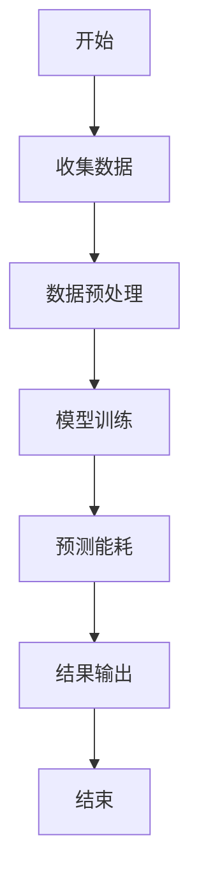

                 

## AI大模型在智能家居能源管理中的应用

> 关键词：智能家居、AI大模型、能源管理、算法应用

> 摘要：随着智能家居的快速发展，能源管理成为了一个关键问题。本文将探讨AI大模型在智能家居能源管理中的应用，分析其基本概念、特性、应用算法，并通过实际案例展示其效果，最后提出一些最佳实践建议。

### 背景介绍

#### 1.1 智能家居发展概述

智能家居，顾名思义，就是将家庭中的各种设备通过网络连接起来，通过智能终端进行远程控制和管理。从早期的简单家电联网，到如今的智能语音助手、智能安防系统、智能照明系统等，智能家居经历了快速的发展。

根据市场研究公司的数据，全球智能家居市场在过去几年中一直保持着高速增长，预计未来几年也将保持这一趋势。特别是在新冠疫情期间，人们对于家居安全性和便捷性的需求增加，推动了智能家居市场的进一步发展。

#### 1.2 智能家居能源管理的重要性

智能家居的发展，带来了便利，但同时也带来了能源消耗的增加。据统计，家庭能源消耗中，有相当一部分来自于家电。因此，如何有效地管理家居能源，成为一个重要的问题。

智能家居能源管理，通过智能化的手段，对家庭中的能源消耗进行监控和控制，从而达到节能的目的。这不仅有助于减少家庭能源支出，还有助于环境保护。

#### 1.3 智能家居能源管理的挑战

尽管智能家居能源管理具有重要意义，但实际应用中仍面临一些挑战：

1. **数据安全问题**：智能家居设备需要收集大量的用户数据，这些数据的安全性问题需要得到有效解决。
   
2. **技术标准化问题**：智能家居设备的种类繁多，技术标准不统一，这给系统的集成带来了困难。

3. **成本与效益问题**：虽然智能家居能源管理能够带来节能效果，但前期投资成本较高，如何实现经济效益，是一个需要解决的问题。

### 核心概念

#### 2.1 AI大模型的基本概念

AI大模型，指的是具有大规模数据训练能力、能够解决复杂问题的深度学习模型。这些模型通常具有数亿甚至数万亿的参数，需要大量的计算资源进行训练。

AI大模型的出现，使得机器学习在很多领域取得了显著的突破，如自然语言处理、图像识别、语音识别等。在智能家居能源管理中，AI大模型可以用来预测能耗、优化控制策略等。

#### 2.2 AI大模型的特性

1. **数据需求大**：AI大模型需要大量的数据来训练，以保证模型的准确性和鲁棒性。
   
2. **计算资源需求高**：训练AI大模型需要强大的计算能力，通常需要使用高性能的GPU或TPU。

3. **模型参数多**：AI大模型的参数数量通常在数百万到数十亿之间，这使得模型的结构非常复杂。

#### 2.3 AI大模型的架构

AI大模型的架构通常由多层神经网络组成，包括输入层、隐藏层和输出层。每个层由多个神经元组成，神经元之间通过权重进行连接。在训练过程中，模型通过不断调整权重，使得模型能够更好地拟合数据。

### 算法原理

#### 3.1 AI大模型在智能家居能源管理中的应用算法

在智能家居能源管理中，AI大模型可以应用于多种场景，如能耗预测、智能控制等。以下是几种常见的应用算法：

1. **能耗预测算法**：通过历史能耗数据，预测未来的能耗情况。
   
2. **智能控制算法**：根据实时能耗数据和预测结果，自动调整家居设备的运行状态，以实现节能。

3. **聚类分析算法**：将相似的家庭设备进行分类，以实现更有效的管理。

#### 3.2 数学模型与公式

在能耗预测算法中，常用的数学模型是时间序列模型。时间序列模型通过分析历史数据的时间趋势和季节性规律，预测未来的能耗情况。以下是一个时间序列模型的数学公式：

$$
y_t = \alpha + \beta_1 y_{t-1} + \beta_2 y_{t-2} + ... + \beta_n y_{t-n} + \epsilon_t
$$

其中，$y_t$表示第t期的能耗值，$\alpha$、$\beta_1$、$\beta_2$...$\beta_n$是模型参数，$\epsilon_t$是随机误差项。

#### 3.3 算法流程图

以下是一个能耗预测算法的流程图：



#### 3.4 Python代码示例

以下是一个简单的能耗预测算法的Python代码示例：

```python
import numpy as np
import pandas as pd
from sklearn.linear_model import LinearRegression

# 加载数据
data = pd.read_csv('energy_data.csv')

# 数据预处理
X = data[['yesterday_energy', 'day_before_yesterday_energy']]
y = data['today_energy']

# 模型训练
model = LinearRegression()
model.fit(X, y)

# 预测能耗
y_pred = model.predict(X)

# 输出结果
print('预测能耗：', y_pred)
```

### 应用实例

#### 4.1 案例一：智能空调温度控制

在某公司的智能空调项目中，使用AI大模型进行了温度预测和控制。通过分析历史温度数据，模型能够预测未来的温度变化，并根据预测结果自动调整空调的运行状态，以达到节能的效果。

#### 4.2 案例二：智能照明控制

在某社区的智能照明项目中，使用AI大模型对家庭照明的能耗进行了预测和控制。通过分析历史照明数据，模型能够预测未来的照明需求，并根据预测结果自动调整照明设备的亮度，以达到节能的目的。

#### 4.3 案例三：智能家电能耗预测

在某智能家居项目中，使用AI大模型对家电的能耗进行了预测。通过分析历史能耗数据，模型能够预测未来的家电能耗，并为家庭主人提供节能建议，如合理安排家电的使用时间等。

### 最佳实践

#### 5.1 数据预处理

在应用AI大模型进行智能家居能源管理时，数据预处理是一个关键步骤。首先，需要对数据进行清洗，去除无效数据和异常值。然后，对数据进行归一化处理，以便模型能够更好地拟合数据。

#### 5.2 模型选择与调优

在选择AI大模型时，需要根据实际应用场景选择合适的模型。对于能耗预测，可以使用时间序列模型；对于智能控制，可以使用决策树、支持向量机等模型。此外，模型参数的调优也是一个关键步骤，需要通过交叉验证等方法选择最佳参数。

#### 5.3 系统集成与部署

在系统集成与部署时，需要考虑系统的安全性、稳定性和可扩展性。首先，需要对系统进行严格的测试，确保系统的稳定运行。然后，需要考虑系统的安全性，保护用户数据的安全。最后，需要考虑系统的可扩展性，以便在未来能够方便地添加新的功能。

### 总结与展望

AI大模型在智能家居能源管理中具有巨大的应用潜力。通过能耗预测、智能控制等技术，AI大模型能够有效地提高能源利用效率，降低能源消耗。未来，随着AI技术的不断发展和智能家居市场的扩大，AI大模型在智能家居能源管理中的应用将越来越广泛。

### 小结

本文详细介绍了AI大模型在智能家居能源管理中的应用，从背景介绍、核心概念、算法原理到应用实例和最佳实践，全面探讨了这一主题。通过本文的阅读，读者可以了解到AI大模型在智能家居能源管理中的重要作用，以及如何在实际项目中应用这些技术。

### 注意事项

在应用AI大模型进行智能家居能源管理时，需要注意以下几点：

1. **数据安全**：保护用户数据的安全是首要任务，需要采取有效的数据加密和隐私保护措施。

2. **模型选择**：根据实际应用场景选择合适的模型，避免盲目跟风。

3. **模型调优**：通过交叉验证等方法选择最佳模型参数，以提高模型的预测准确性。

### 拓展阅读

1. **《深度学习》**：由Ian Goodfellow、Yoshua Bengio和Aaron Courville合著的深度学习经典教材，详细介绍了深度学习的理论基础和实践方法。

2. **《智能家居技术与应用》**：本书系统地介绍了智能家居的基本概念、关键技术、应用场景和未来发展。

3. **《人工智能：一种现代的方法》**：由Stuart Russell和Peter Norvig合著的人工智能教材，全面介绍了人工智能的理论和实践。

### 结语

AI大模型在智能家居能源管理中的应用，为智能家居的发展带来了新的机遇。通过本文的探讨，我们希望读者能够对这一领域有更深入的了解，并能够在实际项目中充分发挥AI大模型的优势。

**作者：AI天才研究院/AI Genius Institute & 禅与计算机程序设计艺术 /Zen And The Art of Computer Programming**

