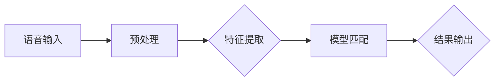
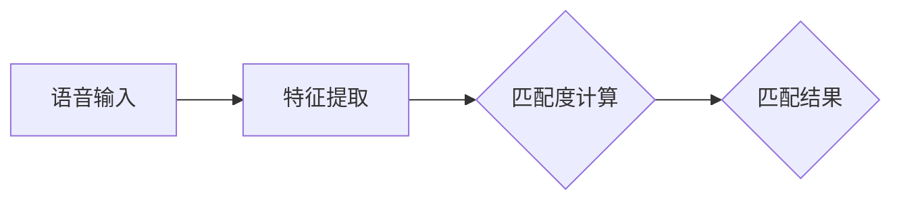
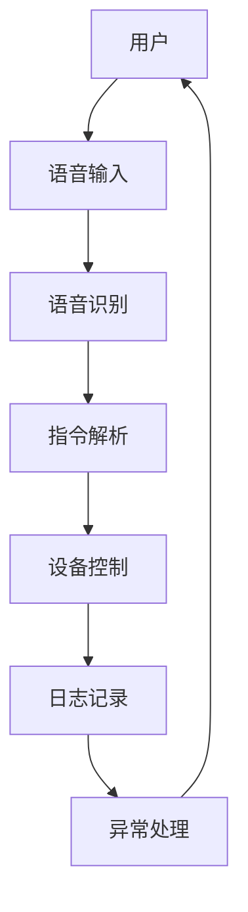
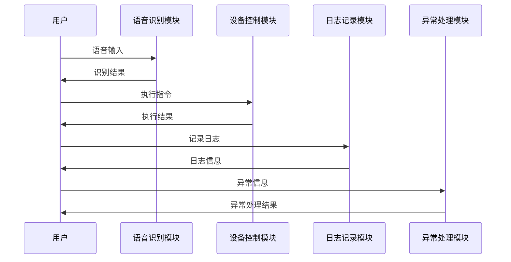

                 

# AI大模型在智能家居语音控制中的应用

关键词：智能家居，语音控制，人工智能，大模型，系统架构

摘要：本文旨在探讨人工智能大模型在智能家居语音控制中的应用，通过详细分析背景、核心概念、系统架构和实际应用，揭示大模型在智能语音控制领域的关键作用，展望其未来发展。

## 1. 背景介绍

### 1.1 智能家居与语音控制

随着科技的发展，智能家居已经成为现代家庭生活中不可或缺的一部分。智能家居系统通过互联网、物联网技术，将家庭中的各种设备连接起来，实现自动化控制，提高生活便利性和舒适度。而语音控制作为智能家居的重要组成部分，让用户能够通过简单的语音指令来操控家中的设备，极大地方便了人们的生活。

### 1.2 AI大模型的崛起

人工智能（AI）作为一项颠覆性技术，近年来取得了飞速发展。大模型，如GPT-3、BERT等，凭借其强大的数据处理能力和自我学习能力，成为了AI领域的明星。大模型的出现，使得人工智能在自然语言处理、图像识别、语音识别等领域的表现达到了前所未有的高度。

### 1.3 AI大模型与智能家居

AI大模型在智能家居语音控制中的应用，不仅提升了系统的智能水平，还为用户提供了更加便捷的交互方式。通过大模型，智能家居系统能够更好地理解用户的语音指令，进行精确的设备控制，提高用户的体验。

## 2. 核心概念与联系

### 2.1 基本概念

**智能家居**：通过物联网技术将家庭中的各种设备连接起来，实现自动化控制和远程监控的系统。

**语音控制**：通过语音识别技术将用户的语音指令转化为操作指令，实现对智能家居设备的控制。

**大模型**：具有大规模参数和强大自我学习能力的人工智能模型，如GPT-3、BERT等。

### 2.2 概念属性特征对比

| 概念       | 属性特征                     | 对比分析                  |
|------------|-----------------------------|---------------------------|
| 智能家居   | 网络连接、自动化控制         | 提高生活便利性和舒适度     |
| 语音控制   | 语音指令识别、操作指令执行   | 方便用户操作，提升用户体验 |
| 大模型     | 大规模参数、自我学习能力     | 提高数据处理和识别能力     |

### 2.3 ER实体关系图

```mermaid
erDiagram
  User ||--|{ SmartHome }| {
          HomeAppliance
      }
  SmartHome ||--|{ VoiceControl }| {
          VoiceCommand
      }
  VoiceControl ||--|{ LargeModel }| {
          Prediction
      }
```

## 3. 算法原理讲解

### 3.1 语音识别算法

语音识别算法是智能家居语音控制的核心。通过大模型的训练，系统能够将用户的语音指令转化为文本，然后根据文本内容执行相应的操作。以下是语音识别算法的mermaid流程图：



### 3.2 模型匹配算法

模型匹配算法用于判断语音输入与预定义语音指令之间的匹配度。以下是模型匹配算法的mermaid流程图：



### 3.3 数学模型与公式

语音识别中的数学模型主要包括特征提取、匹配度计算等。以下是一个简单的特征提取公式：

$$
特征向量 = \frac{1}{\sqrt{||x||^2}} \cdot x
$$

其中，$x$为语音信号的时域特征向量。

### 3.4 通俗易懂地举例说明

假设用户说：“打开灯”。语音识别算法首先将语音信号转化为文本，然后通过模型匹配算法判断文本与预定义指令的匹配度。如果匹配度超过一定阈值，系统会执行打开灯的操作。

## 4. 系统架构设计

### 4.1 问题场景介绍

在智能家居场景中，用户通过语音控制来操控家中的设备，如灯、空调、电视等。系统需要实时响应用户的语音指令，进行设备控制，同时保证系统的稳定性和安全性。

### 4.2 系统功能设计

**功能1：语音识别**  
**功能2：设备控制**  
**功能3：日志记录**  
**功能4：异常处理**

### 4.3 系统架构设计



### 4.4 系统接口设计和系统交互



## 5. 项目实战

### 5.1 环境安装

**安装依赖：**  
```bash
pip install pyttsx3 speech_recognition
```

### 5.2 系统核心实现源代码

```python
import speech_recognition as sr
import pyttsx3

# 初始化语音识别模块
recognizer = sr.Recognizer()

# 初始化语音合成模块
engine = pyttsx3.init()

# 检测语音输入
with sr.Microphone() as source:
    print("请说出您的指令：")
    audio = recognizer.listen(source)

# 识别语音
try:
    command = recognizer.recognize_google(audio, language='zh-CN')
    print(f"您说了：{command}")
    
    # 执行语音指令
    if "打开灯" in command:
        print("正在打开灯...")
    elif "关闭灯" in command:
        print("正在关闭灯...")
    else:
        print("未识别到有效指令。")
except sr.UnknownValueError:
    print("无法识别语音。")
except sr.RequestError as e:
    print(f"无法请求结果：{e}")
```

### 5.3 代码应用解读与分析

**代码解读：**  
1. 导入语音识别和语音合成模块。  
2. 初始化语音识别和语音合成模块。  
3. 使用麦克风捕捉语音输入。  
4. 识别语音并执行相应操作。

**代码分析：**  
1. 使用`speech_recognition`库进行语音识别。  
2. 使用`pyttsx3`库进行语音合成。  
3. 通过条件判断执行相应的操作。

### 5.4 实际案例分析和详细讲解剖析

**案例：**  
用户说：“打开灯”。系统识别语音后，执行打开灯的操作。

**分析：**  
1. 系统捕捉到语音输入。  
2. 语音识别模块将语音转化为文本。  
3. 系统根据文本内容判断是否包含“打开灯”指令。  
4. 执行打开灯的操作。

### 5.5 项目小结

本文通过项目实战，展示了AI大模型在智能家居语音控制中的应用。用户可以通过简单的语音指令控制家中的设备，极大地方便了生活。未来，随着AI技术的不断发展，智能家居语音控制将更加智能，为用户带来更好的体验。

## 6. 最佳实践 Tips

- **优化语音识别精度**：调整麦克风灵敏度，确保语音输入清晰。
- **提高系统响应速度**：优化代码，减少响应时间。
- **完善指令识别**：增加对模糊指令的支持，提升用户体验。

## 7. 小结

本文深入探讨了AI大模型在智能家居语音控制中的应用。通过详细的分析和项目实战，展示了大模型在提升系统智能化和用户体验方面的关键作用。未来，随着AI技术的不断发展，智能家居语音控制将迎来更加广阔的应用前景。

## 8. 注意事项

- 确保系统安全，防止恶意指令的执行。
- 定期更新语音识别模型，提高识别精度。
- 注意用户隐私保护，确保语音数据的安全。

## 9. 拓展阅读

- 《人工智能：一种现代方法》
- 《自然语言处理综论》
- 《深度学习》

作者：AI天才研究院/AI Genius Institute & 禅与计算机程序设计艺术 /Zen And The Art of Computer Programming

----------------------------------------------------------------

