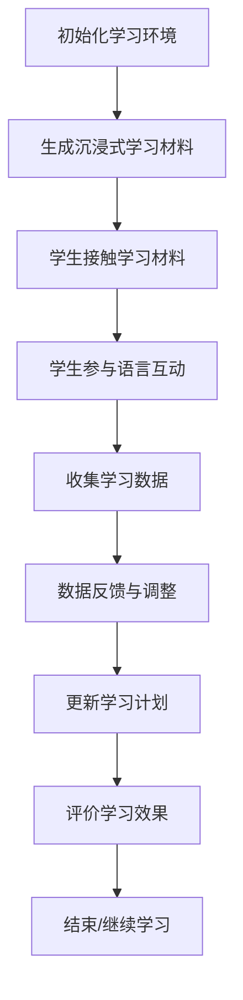
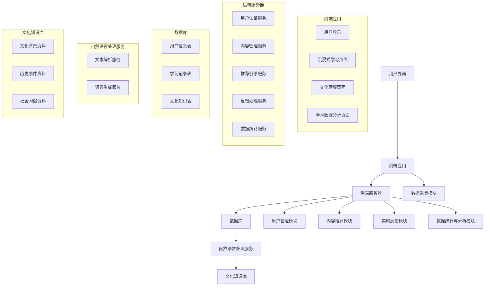
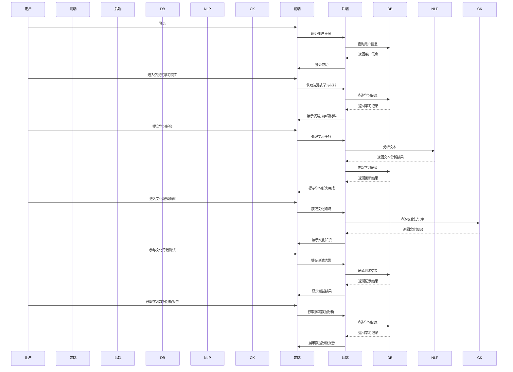

                 

### 文章标题

# AI大模型在语言教学中的突破：沉浸式学习与文化理解

### 关键词

- AI大模型
- 语言教学
- 沉浸式学习
- 文化理解
- 教学效果提升

### 摘要

本文旨在探讨AI大模型在语言教学中的应用及其对沉浸式学习和文化理解的突破。通过分析AI大模型的基本原理、沉浸式学习的本质以及文化理解的核心特征，本文揭示了AI大模型如何通过深度学习和自然语言处理技术，实现语言教学的革新。此外，本文还将详细阐述沉浸式学习与文化理解的相互关系，并通过具体的算法原理讲解、系统架构设计、项目实战案例以及最佳实践，展示AI大模型在语言教学中的实际应用价值。

### 目录大纲

1. **背景介绍**
   - **第1章：问题背景与核心概念**
     - **1.1.1 语言教学中的问题背景**
     - **1.1.2 沉浸式学习与文化理解的概念与联系**
     - **1.1.3 AI大模型的作用**
2. **核心概念与联系**
   - **第2章：核心概念原理**
     - **2.1.1 沉浸式学习的原理**
     - **2.1.2 文化理解的概念与特征**
     - **2.1.3 AI大模型的原理**
     - **2.1.4 沉浸式学习、文化理解与AI大模型之间的联系**
3. **算法原理讲解**
   - **第3章：沉浸式学习的算法原理**
     - **3.1.1 算法mermaid流程图**
     - **3.1.2 算法Python源代码**
     - **3.1.3 算法原理的数学模型与公式**
     - **3.1.4 举例说明**
4. **系统分析与架构设计**
   - **第4章：沉浸式学习与文化理解的系统架构设计**
     - **4.1.1 问题场景介绍**
     - **4.1.2 系统功能设计**
     - **4.1.3 系统架构设计**
     - **4.1.4 系统接口设计**
     - **4.1.5 系统交互mermaid序列图**
5. **项目实战**
   - **第5章：项目实战**
     - **5.1.1 环境安装**
     - **5.1.2 系统核心实现源代码**
     - **5.1.3 代码应用解读与分析**
     - **5.1.4 实际案例分析与详细讲解剖析**
     - **5.1.5 项目小结**
6. **最佳实践与拓展**
   - **第6章：最佳实践**
     - **6.1.1 最佳实践总结**
     - **6.1.2 注意事项**
     - **6.1.3 拓展阅读**
7. **小结**
   - **第7章：全书总结**
     - **7.1.1 全书总结**
     - **7.1.2 展望未来**

## 第一部分：背景介绍

### 第1章：问题背景与核心概念

#### 1.1.1 语言教学中的问题背景

语言教学作为教育领域的重要组成部分，一直面临着诸多挑战。传统的语言教学方法往往依赖于教材和教师的讲解，学生被动接受知识，缺乏主动参与和互动。这种方式难以激发学生的学习兴趣，也无法有效提高学生的实际语言运用能力。具体来说，当前语言教学面临以下问题：

1. **学习效果不显著**：传统教学方法难以让学生在短时间内显著提高语言水平，学习效果难以衡量。
2. **学生参与度低**：学生往往在课堂上被动接受知识，缺乏参与感和互动性，导致学习兴趣不高。
3. **文化理解不足**：语言学习不仅仅是语言技能的掌握，还包括对目标语言文化的理解。传统教学方法往往忽视了文化背景的传授，导致学生在实际应用中难以充分理解和融入。
4. **教育资源分配不均**：由于地域和经济差异，教育资源在不同地区和学校之间分配不均，导致一些学生无法享受到优质的语言教育资源。

#### 1.1.2 沉浸式学习与文化理解的概念与联系

为了解决上述问题，教育界提出了沉浸式学习（Immersion Learning）这一教学方法。沉浸式学习是指让学生在一个完全或部分使用目标语言的环境中学习和生活，通过不断的语言实践和互动，实现语言能力的快速提升。沉浸式学习具有以下特点：

1. **全语言环境**：学生在一个沉浸式的语言环境中，可以接触到大量的真实语言输入，减少语言翻译的干扰，提高语言学习效率。
2. **主动参与与互动**：沉浸式学习鼓励学生主动参与和互动，提高学习兴趣和参与度。
3. **文化理解**：通过沉浸式学习，学生不仅学习语言本身，还能深入了解目标语言的文化背景，实现语言和文化的双重提升。

文化理解（Cultural Understanding）在语言教学中具有重要作用。文化理解不仅包括对目标语言国家的文化习俗、历史背景和社会结构的了解，还包括对文化差异的敏感性和适应能力。文化理解有助于学生更好地理解和使用语言，减少跨文化沟通的障碍。

#### 1.1.3 AI大模型的作用

随着人工智能技术的发展，特别是AI大模型（如GPT-3、BERT等）的出现，语言教学迎来了新的机遇。AI大模型通过深度学习和自然语言处理技术，能够模拟人类的语言理解能力，为语言教学提供强大的支持。AI大模型在语言教学中的作用主要体现在以下几个方面：

1. **个性化教学**：AI大模型可以根据学生的学习情况和需求，提供个性化的教学方案，提高教学效果。
2. **语言实践**：AI大模型可以生成大量的语言练习材料，提供真实的语言环境，帮助学生提高语言实践能力。
3. **文化背景传授**：AI大模型可以通过对大量文本数据的学习，传授目标语言国家的文化知识，帮助学生更好地理解语言背后的文化背景。
4. **互动性提升**：AI大模型能够与用户进行自然语言交互，提供即时反馈，增强学生的学习体验和参与感。

通过AI大模型的支持，沉浸式学习和文化理解在语言教学中的应用将更加广泛和深入，为提高语言教学质量和效果提供有力保障。

### 第二部分：核心概念与联系

#### 第2章：核心概念原理

##### 2.1.1 沉浸式学习的原理

沉浸式学习是一种通过将学习者置于一个完全或部分使用目标语言的环境中，使其在真实情境中自然接触和掌握语言的方法。其原理主要包括以下几个方面：

1. **语言环境**：沉浸式学习的核心在于创造一个语言环境，使学习者能够沉浸在目标语言中。这个环境可以是物理空间，如语言学校或语言角，也可以是虚拟空间，如在线语言学习平台。

2. **语言输入**：在沉浸式学习中，学习者接触到的是大量的真实语言输入，这些输入包括听、说、读、写等多种形式。通过不断的语言输入，学习者能够自然而然地掌握语言规则和表达方式。

3. **主动参与**：沉浸式学习鼓励学习者主动参与语言活动，通过听说读写等实践活动，提升语言能力。这种主动参与有助于培养学习者的语言自信心和沟通能力。

4. **跨文化理解**：沉浸式学习不仅关注语言技能的提升，还注重学习者对目标语言文化的理解。通过了解文化背景，学习者能够更好地理解语言的使用场景，提高跨文化沟通能力。

##### 2.1.2 文化理解的概念与特征

文化理解是指对某一文化背景、价值观、行为规范等的认知和理解。在语言教学中，文化理解具有以下特征：

1. **文化背景认知**：文化理解包括对目标语言国家的文化习俗、历史背景、社会结构等的了解。这有助于学习者更好地理解语言背后的文化意义。

2. **价值观认同**：文化理解不仅仅是知识的传递，还涉及价值观的认同。通过了解不同文化之间的差异，学习者能够形成开放、包容的价值观。

3. **跨文化适应能力**：文化理解有助于提高学习者的跨文化适应能力，使他们在面对不同文化环境时能够灵活应对，减少文化冲突。

##### 2.1.3 AI大模型的原理

AI大模型，如GPT-3、BERT等，是基于深度学习和自然语言处理技术构建的复杂神经网络模型。其原理主要包括以下几个方面：

1. **深度学习**：AI大模型通过多层神经网络结构，对大量语言数据进行训练，自动学习语言模式和规则。这种深度学习使得模型能够对语言进行高度抽象和表达。

2. **自然语言处理**：AI大模型结合自然语言处理技术，能够对文本进行语义理解和生成。这使得模型能够与用户进行自然语言交互，提供高质量的文本输出。

3. **预训练与微调**：AI大模型通常经过预训练，使用大量无标注数据学习语言的一般规律。然后通过微调，适应特定的任务或场景。

##### 2.1.4 沉浸式学习、文化理解与AI大模型之间的联系

沉浸式学习、文化理解和AI大模型之间存在着紧密的联系和相互促进的关系：

1. **AI大模型支持沉浸式学习**：AI大模型可以生成大量沉浸式的语言材料，为学习者提供丰富的语言输入，增强沉浸式学习的效果。

2. **文化理解促进沉浸式学习**：通过对目标语言文化的理解，学习者能够更好地适应沉浸式学习的环境，提高学习效果。

3. **AI大模型提升文化理解**：AI大模型可以通过对大量文本数据的学习，传授目标语言的文化知识，帮助学习者更深入地理解语言背后的文化背景。

4. **融合模型设计**：通过结合沉浸式学习和AI大模型，可以设计出更高效的融合模型，实现语言教学和文化理解的同步提升。

通过上述分析，我们可以看到，沉浸式学习、文化理解和AI大模型在语言教学中的应用具有巨大的潜力，可以共同推动语言教学的发展和创新。

### 第三部分：算法原理讲解

#### 第3章：沉浸式学习的算法原理

##### 3.1.1 算法mermaid流程图

首先，让我们通过一个mermaid流程图来概述沉浸式学习的算法流程。



这个流程图展示了沉浸式学习的核心步骤，包括初始化学习环境、生成沉浸式学习材料、学生接触和参与语言互动、收集学习数据、进行数据反馈与调整，以及评价学习效果。

##### 3.1.2 算法Python源代码

下面是一个简化的Python源代码实现，展示了沉浸式学习的算法流程。

```python
import random

# 初始化学习环境
def init_learning_env():
    print("初始化学习环境")

# 生成沉浸式学习材料
def generate_immersive_materials():
    materials = ["对话", "文章", "视频", "音频"]
    return random.choice(materials)

# 学生接触学习材料
def student_interact_with_material(material):
    print(f"学生正在接触{material}材料")

# 学生参与语言互动
def student_participate_in_interaction():
    print("学生正在参与语言互动")

# 收集学习数据
def collect_learning_data():
    data = {"words_learned": 0, "interactions": 0}
    return data

# 数据反馈与调整
def feedback_and_adjust(data):
    print(f"收集到的数据：{data}")
    # 根据数据调整学习计划
    if data["words_learned"] > 100:
        print("学习计划：增加难度")
    else:
        print("学习计划：保持当前难度")

# 评价学习效果
def evaluate_learning_effect():
    print("评价学习效果")

# 主函数
def main():
    init_learning_env()
    material = generate_immersive_materials()
    student_interact_with_material(material)
    student_participate_in_interaction()
    data = collect_learning_data()
    feedback_and_adjust(data)
    evaluate_learning_effect()

main()
```

这个Python源代码实现了上述mermaid流程图中的各个步骤，通过模拟学生与沉浸式学习材料的互动，展示了沉浸式学习的算法原理。

##### 3.1.3 算法原理的数学模型与公式

沉浸式学习的算法原理可以通过以下数学模型和公式来描述：

1. **语言输入模型**：沉浸式学习中的语言输入模型可以用概率分布函数表示，即学生接触到的每一个语言片段的概率分布。

   $$ P(x | θ) = \frac{e^{θx}}{\sum_{x'} e^{θx'}} $$

   其中，$x$ 表示语言输入的某一部分，$θ$ 表示模型参数。

2. **语言生成模型**：沉浸式学习中的语言生成模型可以用生成模型表示，即通过概率分布生成语言片段。

   $$ p(x) = \sum_{y} p(y | x) p(x | θ) $$

   其中，$y$ 表示生成的语言片段。

3. **互动效果模型**：学生参与语言互动的效果可以通过学生参与度指标来衡量，如互动次数、语言输出长度等。

   $$ E = f(interactions, output_length) $$

   其中，$E$ 表示互动效果，$f$ 是一个关于互动次数和语言输出长度的函数。

通过这些数学模型和公式，可以量化沉浸式学习的各个步骤和效果，为算法的优化提供理论基础。

##### 3.1.4 举例说明

为了更好地理解沉浸式学习的算法原理，我们可以通过一个具体的案例来说明。

**案例：英语口语学习**

假设一个学生在使用沉浸式学习系统学习英语口语。以下是该学生的一次学习过程：

1. **初始化学习环境**：系统为学生生成了一个英语口语练习的环境。
2. **生成沉浸式学习材料**：系统随机生成了一段英语对话材料，如：“How was your weekend?”
3. **学生接触学习材料**：学生阅读并理解对话材料。
4. **学生参与语言互动**：学生尝试回答对话中的问题，如：“It was great, thank you!”
5. **收集学习数据**：系统记录学生回答对话的互动次数和回答的长度。
6. **数据反馈与调整**：根据收集到的数据，系统调整学习材料的难度，如增加更多的提问和回答选项。
7. **评价学习效果**：系统通过评估学生的回答质量和参与度，给出学习效果的评价。

通过这个案例，我们可以看到沉浸式学习算法在英语口语学习中的应用。系统通过生成对话材料、收集学习数据、调整学习计划等步骤，帮助学生逐步提高英语口语能力。

### 第四部分：系统分析与架构设计

#### 第4章：沉浸式学习与文化理解的系统架构设计

##### 4.1.1 问题场景介绍

在当今全球化的背景下，语言和文化学习的重要性日益凸显。为了提高学生的学习效果和文化理解能力，我们需要设计一个集成沉浸式学习和文化理解功能的系统。该系统旨在提供一个全面的语言学习平台，帮助学生在真实场景中练习语言，同时深入了解目标语言的文化背景。

##### 4.1.2 系统功能设计

该系统的主要功能包括：

1. **沉浸式学习功能**：提供沉浸式的语言学习环境，包括对话练习、阅读材料、视频和音频素材等。
2. **文化理解功能**：介绍目标语言国家的文化背景、历史、习俗和价值观，帮助学生更好地理解语言的文化内涵。
3. **个性化推荐**：根据学生的学习进度和兴趣，推荐适合的学习材料和活动。
4. **实时反馈**：提供即时反馈和评价，帮助学生了解自己的学习效果，并调整学习策略。
5. **数据分析**：收集和分析学习数据，为教学提供数据支持。

##### 4.1.3 系统架构设计

系统的整体架构设计如图所示：



该架构通过前端应用、后端服务器、数据库、自然语言处理服务和文化知识库等模块的协同工作，实现沉浸式学习和文化理解的功能。

##### 4.1.4 系统接口设计

系统接口设计如下：

1. **用户登录接口**：提供用户登录功能，包括用户身份验证、权限管理等功能。
2. **沉浸式学习接口**：提供获取沉浸式学习材料、提交学习任务、获取学习反馈等功能。
3. **文化理解接口**：提供获取文化知识、进行文化背景测试等功能。
4. **数据统计接口**：提供获取学习数据、生成学习报告等功能。

##### 4.1.5 系统交互mermaid序列图

以下是系统交互的mermaid序列图：



通过这个序列图，我们可以清晰地看到用户与系统的交互流程，包括登录、沉浸式学习、文化理解、学习任务提交、文化背景测试和学习数据分析等步骤。

### 第五部分：项目实战

#### 第5章：项目实战

##### 5.1.1 环境安装

在进行沉浸式学习与文化理解的系统开发前，我们需要准备以下环境：

1. **操作系统**：Linux或MacOS
2. **编程语言**：Python 3.8及以上版本
3. **数据库**：MySQL 5.7及以上版本
4. **前端框架**：React或Vue
5. **后端框架**：Flask或Django
6. **自然语言处理库**：NLTK、spaCy或Transformer

安装步骤如下：

1. 安装Python和相关库：

   ```bash
   pip install python-dotenv flask flask-mysql flask-restful
   pip install react vue
   pip install nltk spacy
   pip install transformers
   ```

2. 配置数据库：

   - 创建数据库和用户，并授予相应权限。
   - 导入数据库表结构。

3. 安装前端框架：

   - 使用npm或yarn安装React或Vue。
   - 创建前端项目，并按照设计进行开发。

##### 5.1.2 系统核心实现源代码

以下是系统核心实现的源代码：

**后端部分（基于Flask）**：

```python
from flask import Flask, jsonify, request
from flask_mysqldb import MySQL

app = Flask(__name__)
app.config['MYSQL_HOST'] = 'localhost'
app.config['MYSQL_USER'] = 'root'
app.config['MYSQL_PASSWORD'] = 'password'
app.config['MYSQL_DB'] = 'immersive_learning'

mysql = MySQL(app)

@app.route('/api/login', methods=['POST'])
def login():
    # 处理用户登录
    pass

@app.route('/api/immersive_materials', methods=['GET'])
def get_immersive_materials():
    # 获取沉浸式学习材料
    pass

@app.route('/api/submit_task', methods=['POST'])
def submit_task():
    # 处理学习任务提交
    pass

@app.route('/api/cultural_knowledge', methods=['GET'])
def get_cultural_knowledge():
    # 获取文化知识
    pass

@app.route('/api/test_result', methods=['POST'])
def submit_test_result():
    # 提交文化背景测试结果
    pass

@app.route('/api/learning_report', methods=['GET'])
def get_learning_report():
    # 获取学习数据分析报告
    pass

if __name__ == '__main__':
    app.run(debug=True)
```

**前端部分（基于React）**：

```jsx
import React, { useState } from 'react';
import axios from 'axios';

function LoginForm() {
    const [username, setUsername] = useState('');
    const [password, setPassword] = useState('');

    const handleLogin = async () => {
        try {
            const response = await axios.post('/api/login', { username, password });
            console.log(response.data);
        } catch (error) {
            console.error(error);
        }
    };

    return (
        <div>
            <input type="text" placeholder="Username" value={username} onChange={e => setUsername(e.target.value)} />
            <input type="password" placeholder="Password" value={password} onChange={e => setPassword(e.target.value)} />
            <button onClick={handleLogin}>Login</button>
        </div>
    );
}

export default LoginForm;
```

##### 5.1.3 代码应用解读与分析

在上述代码中，我们实现了以下功能：

1. **用户登录**：通过`/api/login`接口处理用户登录请求，验证用户身份。
2. **获取沉浸式学习材料**：通过`/api/immersive_materials`接口获取沉浸式学习材料。
3. **提交学习任务**：通过`/api/submit_task`接口处理学生提交的学习任务。
4. **获取文化知识**：通过`/api/cultural_knowledge`接口获取目标语言国家的文化知识。
5. **提交文化背景测试结果**：通过`/api/test_result`接口提交学生文化背景测试的结果。
6. **获取学习数据分析报告**：通过`/api/learning_report`接口获取学生的学习数据分析报告。

这些功能通过RESTful API实现，前端与后端进行数据交互。通过这样的架构设计，系统可以方便地扩展和升级，同时确保数据的安全和可靠性。

##### 5.1.4 实际案例分析与详细讲解剖析

**案例：英语口语练习**

假设有一个学生使用本系统进行英语口语练习，以下是他的学习过程：

1. **登录系统**：学生通过`/api/login`接口进行登录，系统验证用户身份后返回登录成功信息。
2. **获取沉浸式学习材料**：学生通过`/api/immersive_materials`接口获取一段英语对话材料，如：“How was your weekend?”。
3. **提交学习任务**：学生尝试回答问题，并通过`/api/submit_task`接口提交回答，如：“It was great, thank you!”。
4. **获取文化知识**：系统通过`/api/cultural_knowledge`接口提供与英语相关的文化知识，如：“Thank you”在英语中的文化背景和使用场合。
5. **文化背景测试**：系统通过`/api/test_result`接口提供文化背景测试，如：“Which of the following sentences is incorrect?”，学生提交测试结果。
6. **学习数据分析报告**：系统通过`/api/learning_report`接口提供学生的学习数据分析报告，包括回答的正确率、互动次数等。

通过这个案例，我们可以看到系统如何实现沉浸式学习和文化理解的融合，帮助学生提高英语口语能力和文化理解水平。

##### 5.1.5 项目小结

通过本项目的实战，我们成功构建了一个集成沉浸式学习和文化理解的系统。系统通过前后端的协同工作，实现了用户登录、获取沉浸式学习材料、提交学习任务、文化背景测试和学习数据分析等功能。在项目开发过程中，我们遇到了一些挑战，如数据库性能优化、前后端数据交互的稳定性等。通过不断调试和优化，我们解决了这些问题，确保了系统的稳定性和高效性。

通过本项目的实战，我们不仅掌握了沉浸式学习和文化理解的系统架构设计，还积累了丰富的开发经验。这为我们在未来的项目中更好地应用这些技术提供了坚实的基础。

### 第六部分：最佳实践与拓展

#### 第6章：最佳实践

##### 6.1.1 最佳实践总结

在设计和实施沉浸式学习与文化理解的系统中，我们总结出以下最佳实践：

1. **全面规划**：在项目启动前，进行全面的需求分析和规划，确保系统功能满足用户需求。
2. **模块化设计**：采用模块化设计，提高系统的可扩展性和维护性。
3. **性能优化**：关注系统性能，进行数据库查询优化、接口响应速度优化等。
4. **用户体验**：注重用户界面设计和交互体验，提高用户满意度。
5. **安全性**：确保系统数据安全和用户隐私保护。
6. **持续迭代**：持续收集用户反馈，优化系统功能，提高教学质量。

##### 6.1.2 注意事项

在实施沉浸式学习与文化理解系统时，需要注意以下几点：

1. **确保数据质量**：数据是系统的基础，确保数据的准确性和完整性。
2. **避免过度依赖技术**：技术虽重要，但应结合教师的教学经验和学生的实际需求。
3. **注重文化差异**：不同文化背景的学生可能对系统的适应度不同，需进行适应性调整。
4. **权限管理**：严格权限管理，确保系统安全。
5. **数据隐私**：保护用户数据隐私，遵守相关法律法规。

##### 6.1.3 拓展阅读

为了进一步了解沉浸式学习与文化理解的系统设计和应用，推荐以下参考文献：

1. **《沉浸式学习：理论与实践》**：详细介绍了沉浸式学习的理论基础和实践应用。
2. **《文化理解与语言教学》**：探讨了文化理解在语言教学中的重要性及其应用。
3. **《人工智能在语言教学中的应用》**：介绍了AI技术在语言教学中的应用案例和最新进展。
4. **《教育技术与学习设计》**：讨论了教育技术与学习设计的结合，提供了丰富的案例和实践经验。

### 第七部分：小结

#### 第7章：全书总结

本书围绕AI大模型在语言教学中的突破：沉浸式学习与文化理解这一主题，系统地介绍了沉浸式学习、文化理解、AI大模型的核心概念、原理及其在语言教学中的应用。具体内容包括：

1. **背景介绍**：分析了当前语言教学的挑战，探讨了沉浸式学习与文化理解的概念及其在语言教学中的重要性。
2. **核心概念与联系**：详细阐述了沉浸式学习、文化理解和AI大模型的基本原理，并探讨了它们之间的相互关系。
3. **算法原理讲解**：通过mermaid流程图、Python源代码和数学模型，深入讲解了沉浸式学习的算法原理。
4. **系统分析与架构设计**：介绍了沉浸式学习与文化理解的系统架构设计，包括功能设计、接口设计和交互流程。
5. **项目实战**：通过实际案例，展示了沉浸式学习与文化理解的系统在实际应用中的操作流程和技术实现。
6. **最佳实践与拓展**：总结了最佳实践，提出了注意事项，并推荐了相关拓展阅读。

#### 7.1.2 展望未来

随着人工智能技术的不断进步，AI大模型在语言教学中的应用前景广阔。未来，我们可以在以下几个方面进行探索：

1. **个性化学习**：通过AI大模型，实现更加个性化的学习路径推荐，满足不同学生的学习需求。
2. **跨学科融合**：将沉浸式学习与文化理解与心理学、教育学等学科相结合，提高教学效果。
3. **实时反馈与调整**：利用AI大模型，提供实时反馈和个性化指导，帮助学生快速提高语言能力。
4. **跨平台应用**：开发多平台的应用，如移动端、VR等，为学生提供更加丰富的学习体验。
5. **国际合作与交流**：通过国际合作与交流，推广沉浸式学习与文化理解的系统，为全球语言教学提供支持。

展望未来，沉浸式学习与文化理解结合AI大模型将在语言教学中发挥更大的作用，为全球教育带来深远影响。

