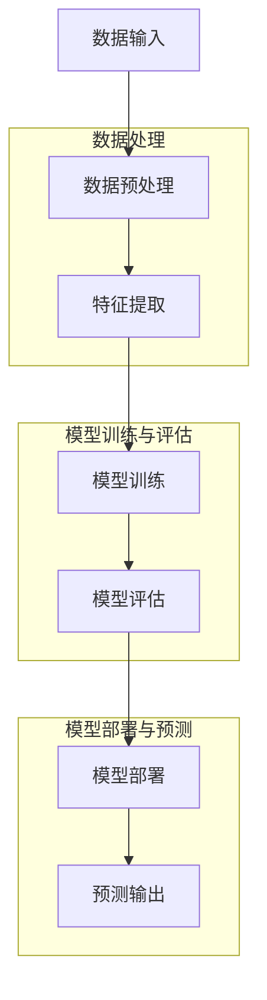
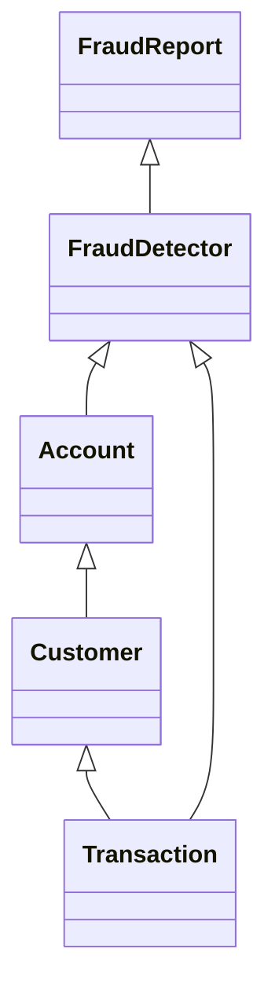
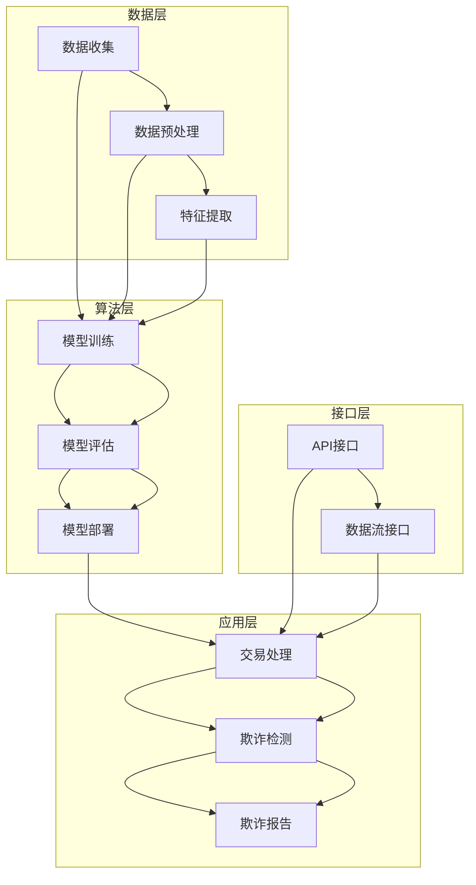
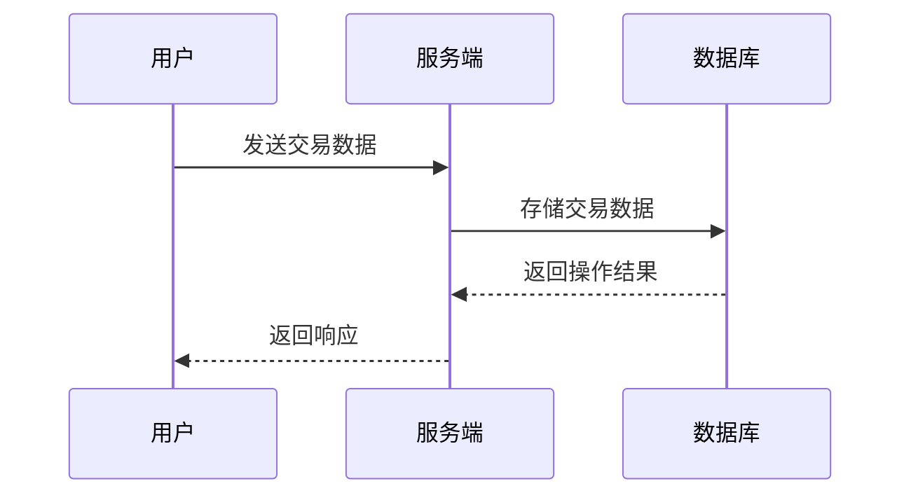
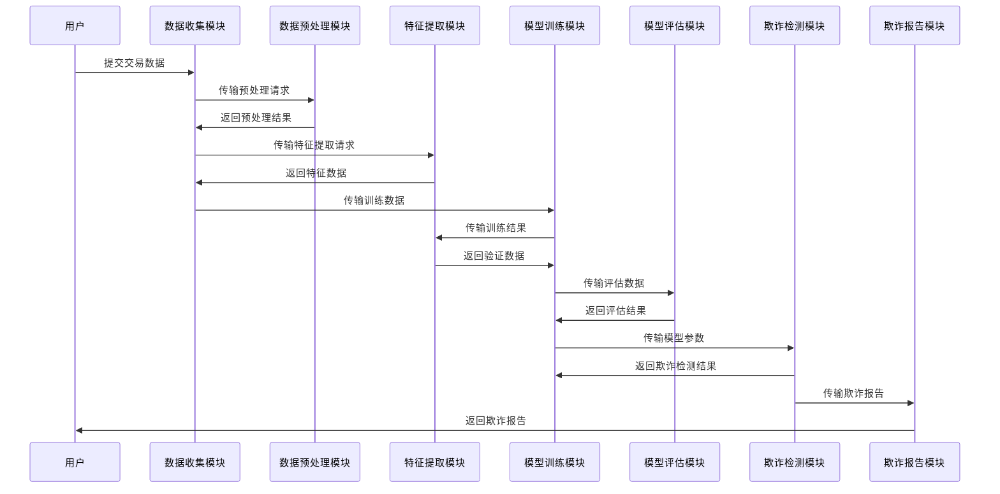

                 


### 《AI大模型在金融欺诈检测中的应用》

> 关键词：人工智能、大模型、金融欺诈检测、算法、数学模型、系统架构、项目实战、最佳实践

> 摘要：本文深入探讨了人工智能大模型在金融欺诈检测领域的应用。首先，我们介绍了金融欺诈检测的挑战与机遇，随后对AI大模型进行了概述，包括其概念、特点和工作原理。接着，文章详细讲解了核心概念与联系，通过对比表格和ER实体关系图，为读者搭建了坚实的理论基础。随后，文章从算法原理、数学模型、系统分析与架构设计等方面，对AI大模型在金融欺诈检测中的应用进行了详细阐述。最后，通过项目实战和最佳实践，总结了AI大模型在金融欺诈检测中的实际应用经验，并对未来发展趋势进行了展望。

#### 目录大纲设计

**第一部分：背景与基础**

## 第1章：金融欺诈检测的挑战与机遇

### 1.1 问题背景

金融欺诈是指金融活动中的欺骗行为，其形式多样，包括信用卡欺诈、贷款欺诈、投资欺诈等。随着互联网金融和移动支付的普及，金融欺诈问题日益严重，对金融机构和用户造成了巨大损失。传统的欺诈检测方法往往依赖于规则和统计模型，但在面对复杂多变的欺诈手段时，效果有限。

### 1.2 金融欺诈检测的现状

目前，金融欺诈检测主要依赖于规则引擎和机器学习模型。规则引擎依赖于人工定义的规则，但规则数量庞大且难以覆盖所有可能的欺诈行为。机器学习模型，特别是深度学习模型，因其强大的特征提取和模式识别能力，正在逐渐取代传统的欺诈检测方法。

### 1.3 AI大模型的作用与潜力

AI大模型，如GPT、BERT等，具有处理海量数据、自适应学习的能力，可以识别复杂的欺诈模式。大模型在金融欺诈检测中的应用，不仅能够提高检测的准确性，还能减少人力成本，提高效率。

## 第2章：AI大模型概述

### 2.1 AI大模型的概念与特点

AI大模型指的是具有大规模参数、能够处理大规模数据的深度学习模型。它们通常基于多层神经网络结构，具有强大的特征提取和表示能力。

### 2.2 主流AI大模型介绍

本文介绍了GPT、BERT、Transformer等主流AI大模型，并对它们的工作原理和应用场景进行了分析。

### 2.3 AI大模型的工作原理

AI大模型通过大量数据进行预训练，学习到语言的内在规律和语义信息。在金融欺诈检测中，它们可以用于生成欺诈行为特征、预测欺诈概率等。

## 第3章：核心概念与联系

### 3.1 关键概念

本文介绍了监督学习、无监督学习、特征工程、数据预处理等核心概念，并解释了它们在金融欺诈检测中的应用。

### 3.2 概念属性特征对比表格

通过对比表格，本文详细阐述了监督学习与无监督学习的区别，以及特征工程与数据预处理的重要性。

### 3.3 ER实体关系图架构

ER实体关系图用于描述金融欺诈检测中的实体及其关系，有助于理解系统的整体架构。

**第二部分：算法原理与数学模型**

## 第4章：算法原理讲解

### 4.1 算法mermaid流程图

本文使用mermaid语言绘制了AI大模型在金融欺诈检测中的算法流程图，展示了数据输入、模型训练、预测输出的全过程。

### 4.2 Python源代码实现

为了使读者更好地理解算法原理，本文提供了Python源代码实现，详细阐述了数据预处理、模型训练和预测的具体步骤。

### 4.3 算法原理的数学模型和公式

本文通过LaTeX数学公式，详细讲解了AI大模型的数学原理，包括损失函数、优化算法等。

### 4.4 详细讲解与举例说明

通过具体的案例分析，本文深入浅出地讲解了AI大模型在金融欺诈检测中的应用，使读者能够直观地理解其工作原理。

## 第5章：数学模型与公式

### 5.1 LaTeX数学公式嵌入

本文使用LaTeX格式嵌入数学公式，确保了公式的准确性和可读性。

### 5.2 数学模型解释

本文对嵌入的LaTeX数学公式进行了详细的解释，使读者能够理解公式的含义和作用。

### 5.3 案例分析

通过具体案例，本文展示了如何使用AI大模型进行金融欺诈检测，并分析了模型的性能和效果。

**第三部分：系统设计与架构**

## 第6章：系统分析与架构设计方案

### 6.1 问题场景介绍

本文介绍了金融欺诈检测的应用场景，包括数据来源、数据类型、检测目标等。

### 6.2 系统功能设计（领域模型类图）

本文使用mermaid语言绘制了领域模型类图，展示了金融欺诈检测系统的核心功能及其关系。

### 6.3 系统架构设计（架构图）

本文通过mermaid架构图，详细阐述了金融欺诈检测系统的整体架构，包括数据层、算法层、应用层等。

### 6.4 系统接口设计

本文介绍了系统接口的设计，包括API接口、数据流接口等，确保系统的可扩展性和易用性。

### 6.5 系统交互（序列图）

本文使用mermaid序列图，展示了系统在不同状态下的交互过程，有助于理解系统的动态行为。

## 第7章：项目实战

### 7.1 环境安装与配置

本文介绍了如何在环境中安装和配置AI大模型，包括硬件要求、软件安装等。

### 7.2 系统核心实现

本文详细介绍了金融欺诈检测系统的核心实现，包括数据预处理、模型训练、预测等步骤。

### 7.3 代码应用解读

本文对系统核心代码进行了解读，帮助读者理解代码的实现原理和逻辑。

### 7.4 实际案例分析与讲解

本文通过实际案例，分析了AI大模型在金融欺诈检测中的应用效果，并给出了详细的讲解和剖析。

### 7.5 项目小结

本文总结了项目实战中的经验教训，并对未来的发展方向提出了建议。

**第四部分：最佳实践与总结**

## 第8章：最佳实践

### 8.1 方法与技巧

本文总结了AI大模型在金融欺诈检测中的一些最佳实践，包括数据预处理技巧、模型调优方法等。

### 8.2 注意事项

本文列举了在使用AI大模型进行金融欺诈检测时需要注意的一些事项，包括数据安全、隐私保护等。

### 8.3 案例分析

本文通过实际案例分析，展示了最佳实践在金融欺诈检测中的应用效果。

## 第9章：小结与展望

### 9.1 书的主要观点回顾

本文回顾了书中的主要观点，包括AI大模型在金融欺诈检测中的应用、核心概念与联系、算法原理与数学模型、系统设计与架构、项目实战和最佳实践等。

### 9.2 未来发展趋势

本文分析了AI大模型在金融欺诈检测领域的未来发展趋势，包括技术进步、应用场景拓展等。

### 9.3 拓展阅读

本文推荐了一些相关的拓展阅读资料，包括学术文章、技术博客、行业报告等，帮助读者进一步了解AI大模型在金融欺诈检测中的应用。

**END**

作者：AI天才研究院/AI Genius Institute & 禅与计算机程序设计艺术 /Zen And The Art of Computer Programming### 第1章：金融欺诈检测的挑战与机遇

#### 1.1 问题背景

在数字化金融时代，金融欺诈行为变得日益复杂和多样化。信用卡欺诈、贷款欺诈、投资欺诈等都是常见的金融欺诈形式。信用卡欺诈通常表现为未经授权的交易，而贷款欺诈则可能涉及虚假个人信息或欺诈性贷款申请。投资欺诈包括庞氏骗局、虚假股票交易等。这些欺诈行为不仅对金融机构造成直接的经济损失，还会影响用户的信任度，甚至影响整个金融系统的稳定运行。

传统的金融欺诈检测方法主要依赖于规则引擎和统计模型。规则引擎通过人工定义的规则来检测潜在的欺诈行为，这些规则通常基于历史数据和专家经验。这种方法虽然简单直观，但存在几个显著的局限性。首先，规则数量庞大且难以覆盖所有可能的欺诈行为，导致漏检和误报问题频发。其次，规则更新和维护成本高，且难以适应快速变化的欺诈手段。最后，规则引擎缺乏自适应性，无法实时学习新出现的欺诈模式。

机器学习模型的出现为金融欺诈检测带来了新的契机。机器学习模型，特别是深度学习模型，通过从大量数据中自动学习特征和模式，能够更准确地识别欺诈行为。与规则引擎相比，机器学习模型具有更强的自适应性和泛化能力。然而，机器学习模型也面临一些挑战。首先，模型的训练需要大量的标注数据和计算资源。其次，模型的解释性较差，难以理解其决策过程。最后，模型的性能受到数据质量和特征工程的影响。

#### 1.2 金融欺诈检测的现状

目前，金融欺诈检测主要依赖于机器学习模型，特别是深度学习模型。金融机构通过采集用户的交易数据、历史行为数据、身份信息等，构建大规模数据集，用于训练欺诈检测模型。深度学习模型，如卷积神经网络（CNN）、循环神经网络（RNN）和Transformer等，因其强大的特征提取和表示能力，在金融欺诈检测中得到了广泛应用。

在实施金融欺诈检测时，金融机构通常采取以下步骤：

1. **数据收集与预处理**：收集用户交易记录、身份信息、行为数据等，并对数据进行清洗、去重、归一化等预处理操作。
2. **特征工程**：从原始数据中提取有助于欺诈检测的特征，如交易金额、交易时间、交易频率、账户行为等。
3. **模型选择与训练**：选择合适的深度学习模型，如CNN、RNN或Transformer，对数据集进行训练，通过调整模型参数，优化模型性能。
4. **模型评估与调优**：通过交叉验证、ROC曲线、AUC指标等评估模型性能，根据评估结果调整模型参数，提高检测准确性。
5. **部署与监控**：将训练好的模型部署到生产环境中，实时检测用户的交易行为，并根据实际效果进行模型更新和优化。

尽管机器学习模型在金融欺诈检测中取得了显著成果，但仍然存在一些挑战。首先，欺诈行为多变且隐蔽，使得模型难以捕捉到所有潜在的欺诈模式。其次，模型训练过程复杂，且对计算资源需求较高。最后，模型的解释性较差，难以向用户解释欺诈检测的决策过程，导致用户信任度下降。

#### 1.3 AI大模型的作用与潜力

AI大模型，如GPT、BERT、ViT等，是当前机器学习领域的研究热点。这些模型具有大规模参数、强大的特征提取和表示能力，能够在多种任务中实现优异的性能。在金融欺诈检测领域，AI大模型具有以下作用和潜力：

1. **提升检测准确性**：AI大模型通过处理海量数据，能够学习到更复杂的欺诈模式，从而提高检测准确性。相较于传统的机器学习模型，AI大模型具有更强的泛化能力，能够应对不断变化的欺诈手段。
2. **减少误报与漏报**：AI大模型通过自动学习特征，能够减少误报和漏报问题，提高用户体验。与规则引擎相比，AI大模型能够更灵活地处理复杂交易行为，降低误报率。
3. **降低人力成本**：AI大模型能够自动化处理大量的交易数据，减少人工干预，降低人力成本。通过实时监控交易行为，AI大模型可以迅速发现潜在的欺诈行为，及时采取措施。
4. **提高系统效率**：AI大模型的高效数据处理能力，使得金融欺诈检测系统能够快速响应用户交易，提高系统整体效率。与传统模型相比，AI大模型具有更快的预测速度，能够实时处理大量交易数据。

总之，AI大模型在金融欺诈检测中具有广泛的应用前景。通过不断改进模型结构和训练方法，AI大模型有望进一步提升金融欺诈检测的准确性、效率和用户体验。然而，要充分发挥AI大模型的优势，仍需克服数据质量、模型解释性和隐私保护等挑战。

### 第2章：AI大模型概述

#### 2.1 AI大模型的概念与特点

AI大模型，即大型的人工智能模型，是指具有数十亿甚至千亿参数的深度学习模型。这些模型通过在大量数据上进行预训练，能够自动提取复杂特征，并在多种任务中实现优异的性能。AI大模型通常基于多层神经网络结构，如Transformer、BERT、GPT等，其核心特点包括：

1. **大规模参数**：AI大模型具有数十亿至千亿级别的参数，能够捕捉到大量数据中的复杂模式和规律。这种大规模参数使得AI大模型在处理海量数据时具有更强的鲁棒性和泛化能力。
2. **自动特征提取**：AI大模型通过预训练，能够自动学习数据的特征表示，无需人工进行特征工程。这种自动特征提取能力使得AI大模型能够处理多种类型的数据，如文本、图像、音频等。
3. **强泛化能力**：AI大模型通过在大量数据上预训练，能够学习到通用特征，从而在新的任务上表现出优异的性能。这种强泛化能力使得AI大模型在解决实际问题时具有广泛的应用前景。

AI大模型的发展历程可以追溯到2012年的AlexNet，这是一个具有数百万参数的卷积神经网络，首次在ImageNet图像识别比赛中取得了显著成果。此后，随着计算资源和数据集的不断增加，AI大模型不断发展壮大。2017年，Google推出了Transformer模型，这是一种基于注意力机制的深度学习模型，其在机器翻译、文本生成等任务中取得了突破性成果。随后，BERT、GPT等AI大模型相继问世，进一步推动了人工智能领域的发展。

#### 2.2 主流AI大模型介绍

目前，主流的AI大模型包括GPT、BERT、Transformer等。这些模型在各自的领域内取得了显著的成果，为人工智能的发展奠定了坚实基础。

1. **GPT（Generative Pre-trained Transformer）**：GPT是一种基于Transformer结构的预训练模型，由OpenAI开发。GPT通过在大量文本数据上预训练，能够生成连贯、自然的文本。GPT在文本生成、文本分类、机器翻译等任务中表现出色，成为了自然语言处理领域的标杆。

2. **BERT（Bidirectional Encoder Representations from Transformers）**：BERT是一种双向Transformer模型，由Google开发。BERT通过在大量文本数据上进行预训练，能够捕捉到文本中的上下文信息。BERT在问答系统、文本分类、命名实体识别等任务中取得了优异的性能，推动了自然语言处理技术的发展。

3. **Transformer**：Transformer是一种基于注意力机制的深度学习模型，由Google开发。Transformer在机器翻译、文本生成等任务中取得了突破性成果，成为了自然语言处理领域的标准模型。Transformer结构简洁、高效，能够处理长序列数据，其成功激发了人们对深度学习模型结构的研究兴趣。

除了上述模型，还有其他一些重要的AI大模型，如ViT（Vision Transformer）、T5（Text-to-Text Transfer Transformer）等。ViT是一种用于图像分类的Transformer模型，其在ImageNet图像识别比赛中取得了优异的成绩。T5是一种通用的文本处理模型，能够处理多种文本任务，如问答、摘要生成等。

#### 2.3 AI大模型的工作原理

AI大模型的工作原理主要包括预训练和微调两个阶段。

1. **预训练**：预训练是指在大规模数据集上进行模型训练，使模型自动学习数据的特征表示。预训练过程通常分为两个阶段：自我监督学习和有监督学习。

   - **自我监督学习**：在自我监督学习中，模型通过预测输入数据的未标记部分来学习特征表示。例如，在文本数据中，模型可以预测单词的掩码部分，从而学习到单词之间的关联性。自我监督学习的优势在于，它能够利用未标记的数据，提高模型的泛化能力。
   
   - **有监督学习**：在有监督学习中，模型使用带有标签的数据进行训练，从而学习到具体的任务。例如，在分类任务中，模型使用带有标签的训练数据进行训练，从而学会区分不同的类别。

2. **微调**：微调是指在小规模数据集上对预训练模型进行细粒度调整，以适应特定的任务。微调过程通常包括以下步骤：

   - **数据准备**：准备小规模数据集，对数据进行预处理，如数据清洗、归一化等。
   - **模型调整**：在预训练模型的基础上，调整模型参数，使其适应特定的任务。调整过程通常包括调整学习率、批量大小等超参数。
   - **训练**：使用小规模数据集对模型进行训练，通过优化目标函数（如交叉熵损失函数）来调整模型参数。
   - **评估**：使用验证集对模型进行评估，根据评估结果调整模型参数，直至达到满意的性能。

AI大模型的工作原理使其在多种任务中表现出色。预训练阶段使模型能够自动学习到丰富的特征表示，微调阶段使模型能够适应特定的任务。通过预训练和微调的结合，AI大模型在图像分类、文本生成、机器翻译等任务中取得了优异的性能。

总之，AI大模型以其大规模参数、自动特征提取和强泛化能力，为人工智能领域带来了新的发展机遇。通过深入理解AI大模型的工作原理，我们可以更好地利用这些模型解决实际问题，推动人工智能技术的进步。

#### 3.1 关键概念

在深入探讨AI大模型在金融欺诈检测中的应用之前，有必要明确几个关键概念，这些概念构成了我们进一步讨论的基础。

**监督学习与无监督学习**

**监督学习**是一种机器学习范式，其中模型在训练过程中使用带有标签的数据集来学习。标签通常表示输入数据的类别或值。监督学习的目标是找到一个函数，能够将新的输入映射到正确的输出。在金融欺诈检测中，监督学习模型使用已标记的交易数据（即正常交易和欺诈交易）来学习欺诈模式，然后对未知交易进行分类。

**无监督学习**则不使用标签，目标是发现数据中的隐含结构和模式。无监督学习在金融欺诈检测中可以用于探索未知交易行为，寻找潜在的模式和关联。例如，通过聚类分析，可以识别出具有相似交易特征的账户群体，从而发现潜在的欺诈团伙。

**特征工程与数据预处理**

**特征工程**是指从原始数据中提取有助于模型训练的特征，并对其进行转换和归一化等处理。在金融欺诈检测中，特征工程至关重要，因为它能够提高模型的性能。特征工程包括以下步骤：

- **特征提取**：从交易数据中提取有助于欺诈检测的特征，如交易金额、交易时间、交易频率、账户活动等。
- **特征转换**：将提取出的特征转换为适用于机器学习模型的格式，如将时间序列数据转换为固定长度的向量。
- **特征归一化**：对特征进行标准化处理，使其具有相似的尺度，从而防止某些特征对模型训练产生过大的影响。

**分类与回归模型**

**分类模型**用于将数据划分为不同的类别。在金融欺诈检测中，分类模型被用于判断交易是正常交易还是欺诈交易。常见的分类模型包括逻辑回归、支持向量机（SVM）、决策树、随机森林和神经网络等。

**回归模型**则用于预测数据的连续值。虽然回归模型在金融欺诈检测中不常直接使用，但它们可以用于预测交易金额、交易频率等特征，从而辅助分类模型进行决策。

**概念属性特征对比表格**

为了更好地理解监督学习与无监督学习、特征工程与数据预处理、分类与回归模型之间的关系，我们可以通过一个对比表格来展示它们的主要属性：

| 概念 | 描述 | 目标 | 使用场景 |
| --- | --- | --- | --- |
| 监督学习 | 使用带标签的数据训练模型 | 预测标签 | 金融欺诈检测、分类问题 |
| 无监督学习 | 不使用标签，发现数据中的模式 | 探索数据结构 | 聚类分析、异常检测 |
| 特征工程 | 提取并转换数据特征 | 提高模型性能 | 数据预处理、特征选择 |
| 数据预处理 | 数据清洗、归一化等 | 提高数据质量 | 数据探索、模型训练 |
| 分类模型 | 将数据划分为不同类别 | 分类问题 | 金融欺诈检测 |
| 回归模型 | 预测数据的连续值 | 回归问题 | 预测交易金额 |

**ER实体关系图架构**

实体关系图（Entity-Relationship Diagram，ER图）是一种用于描述系统中实体及其关系的图形化工具。在金融欺诈检测系统中，ER图可以用于表示不同的数据实体及其关联关系。

以下是一个简化的ER图示例，展示了金融欺诈检测系统中的几个关键实体及其关系：

```mermaid
erDiagram
  Customer ||--|{ Transaction } : has
  Account ||--|{ Customer } : owns
  Transaction ||--|{ Fraud } : is
```

在上面的ER图中，`Customer`实体表示金融系统的用户，`Account`实体表示用户的账户，`Transaction`实体表示交易，而`Fraud`实体表示欺诈行为。箭头表示实体之间的关系，例如，每个`Customer`可以有多个`Transaction`，而每个`Transaction`可能是一个`Fraud`实例。

通过这种图形化的表示，ER图有助于我们理解系统中的数据流和关联关系，从而为后续的算法设计和系统实现提供指导。

综上所述，这些关键概念和工具为我们在金融欺诈检测中应用AI大模型奠定了理论基础。在接下来的章节中，我们将进一步探讨AI大模型的具体算法原理和数学模型，以及如何在实践中设计和实现这些模型。

#### 4.1 算法mermaid流程图

为了更清晰地展示AI大模型在金融欺诈检测中的算法流程，我们可以使用mermaid语言绘制一个流程图。以下是一个简化的mermaid流程图示例，描述了从数据输入到模型训练再到预测输出的全过程。



在这个流程图中：

- **A[数据输入]**：表示数据收集阶段，包括从不同的数据源（如数据库、API等）获取交易数据。
- **B[数据预处理]**：对收集到的原始交易数据进行清洗、去重、归一化等预处理操作，以提高数据质量。
- **C[特征提取]**：从预处理后的数据中提取有助于欺诈检测的特征，如交易金额、交易时间、交易频率等。
- **D[模型训练]**：使用特征数据对AI大模型（如BERT、GPT等）进行训练，调整模型参数，使其能够识别欺诈行为。
- **E[模型评估]**：使用验证集对训练好的模型进行评估，通过交叉验证、ROC曲线、AUC指标等评估模型性能。
- **F[模型部署]**：将经过评估的模型部署到生产环境中，实时监测用户的交易行为，检测潜在的欺诈行为。
- **G[预测输出]**：模型对实时交易数据进行分析，输出欺诈概率，帮助金融机构采取相应的措施。

通过mermaid流程图，我们可以直观地理解AI大模型在金融欺诈检测中的应用流程，从而为后续的算法实现和优化提供参考。

#### 4.2 Python源代码实现

为了使读者更好地理解AI大模型在金融欺诈检测中的算法实现，以下是一个简化的Python代码示例，描述了从数据预处理到模型训练、评估和预测的全过程。这个示例使用了Python编程语言和TensorFlow库，是实际应用中的一个简化版本。

```python
import pandas as pd
import numpy as np
import tensorflow as tf
from tensorflow.keras.models import Sequential
from tensorflow.keras.layers import Dense, Dropout, LSTM
from tensorflow.keras.optimizers import Adam
from sklearn.model_selection import train_test_split
from sklearn.preprocessing import MinMaxScaler

# 数据预处理
# 假设我们有一个名为transactions的数据帧，包含了交易数据
transactions = pd.read_csv('transactions.csv')

# 清洗数据，去除缺失值和异常值
transactions.dropna(inplace=True)
transactions = transactions[transactions['amount'] > 0]

# 提取特征
features = transactions[['amount', 'timestamp', 'frequency']]
labels = transactions['is_fraud']

# 归一化特征
scaler = MinMaxScaler()
features_scaled = scaler.fit_transform(features)

# 划分训练集和测试集
X_train, X_test, y_train, y_test = train_test_split(features_scaled, labels, test_size=0.2, random_state=42)

# 模型训练
model = Sequential()
model.add(LSTM(units=128, return_sequences=True, input_shape=(X_train.shape[1], 1)))
model.add(Dropout(0.2))
model.add(LSTM(units=64, return_sequences=False))
model.add(Dropout(0.2))
model.add(Dense(units=1, activation='sigmoid'))

model.compile(optimizer='adam', loss='binary_crossentropy', metrics=['accuracy'])
model.fit(X_train, y_train, epochs=10, batch_size=32, validation_data=(X_test, y_test), verbose=1)

# 模型评估
loss, accuracy = model.evaluate(X_test, y_test, verbose=1)
print(f"Test accuracy: {accuracy:.2f}")

# 模型预测
predictions = model.predict(X_test)
predictions = (predictions > 0.5)

# 查看预测结果
print(predictions[:10])

# 使用模型进行实时预测
new_transactions = pd.read_csv('new_transactions.csv')
new_transactions.dropna(inplace=True)
new_transactions = new_transactions[new_transactions['amount'] > 0]
new_transactions_scaled = scaler.transform(new_transactions[['amount', 'timestamp', 'frequency']])
new_predictions = model.predict(new_transactions_scaled)
new_predictions = (new_predictions > 0.5)

print(new_predictions[:10])
```

在这个代码示例中：

1. **数据预处理**：首先读取交易数据，并进行清洗，去除缺失值和异常值。然后提取交易金额、交易时间和交易频率等特征，并使用MinMaxScaler进行归一化处理。

2. **模型训练**：构建一个序列模型，包括两个LSTM层和两个Dropout层，最后一层是输出层，使用sigmoid激活函数。模型使用Adam优化器和二进制交叉熵损失函数进行编译和训练。

3. **模型评估**：使用测试集评估模型的准确率。

4. **模型预测**：首先对新的交易数据进行预处理，然后使用训练好的模型进行预测，输出欺诈概率。

通过这个简化的示例，读者可以初步了解如何使用Python和TensorFlow实现AI大模型在金融欺诈检测中的应用。在实际应用中，模型结构、参数设置和数据预处理可能会更加复杂，但基本流程是类似的。

#### 4.3 算法原理的数学模型和公式

为了深入理解AI大模型在金融欺诈检测中的算法原理，我们需要探讨其背后的数学模型和公式。这些公式和模型帮助我们理解如何通过数学方法来表示和优化模型的训练过程。

首先，我们来看一下AI大模型中的一个基本组件——多层感知机（Multilayer Perceptron，MLP）。MLP是一个前馈神经网络，包含输入层、隐藏层和输出层。每个层由多个神经元组成，神经元之间的连接通过权重（weights）和偏置（bias）来传递信息。

假设我们有输入向量 \( x \)，隐藏层激活函数为 \( \sigma \)，输出层激活函数为 \( \sigma' \)，则MLP的输出可以表示为：

$$
\hat{y} = \sigma'(W_2 \sigma(W_1 x + b_1) + b_2)
$$

其中，\( W_1 \) 和 \( W_2 \) 分别是输入层到隐藏层、隐藏层到输出层的权重矩阵，\( b_1 \) 和 \( b_2 \) 分别是隐藏层和输出层的偏置。\( \sigma \) 和 \( \sigma' \) 通常采用非线性激活函数，如Sigmoid或ReLU。

接下来，我们来看一下损失函数（Loss Function）。在二分类问题中，常用的损失函数是二进制交叉熵（Binary Cross-Entropy Loss），其公式为：

$$
L = -\frac{1}{m} \sum_{i=1}^{m} [y_i \log(\hat{y}_i) + (1 - y_i) \log(1 - \hat{y}_i)]
$$

其中，\( y_i \) 是实际标签，\( \hat{y}_i \) 是模型预测的概率输出，\( m \) 是样本数量。二进制交叉熵损失函数能够衡量预测概率与实际标签之间的差距，从而指导模型参数的优化。

为了优化模型参数，我们需要使用优化算法。在AI大模型中，常用的优化算法是随机梯度下降（Stochastic Gradient Descent，SGD）及其变体，如Adam优化器。Adam优化器结合了SGD和 Momentum方法，其公式为：

$$
\theta = \theta - \alpha \frac{\nabla L(\theta)}{\sqrt{1 - \beta_1^t} \sqrt{1 - \beta_2^t} + \epsilon}
$$

$$
m_t = \beta_1 m_{t-1} + (1 - \beta_1) \nabla L(\theta)
$$

$$
v_t = \beta_2 v_{t-1} + (1 - \beta_2) \nabla^2 L(\theta)
$$

其中，\( \theta \) 是模型参数，\( \alpha \) 是学习率，\( \beta_1 \) 和 \( \beta_2 \) 是Momentum参数，\( m_t \) 和 \( v_t \) 分别是梯度的一阶矩估计和二阶矩估计，\( \epsilon \) 是一个较小的常数。

通过这些数学模型和公式，我们可以对AI大模型的工作原理有更深入的理解。在实际应用中，我们需要根据具体问题和数据集，调整模型结构、损失函数和优化算法，以实现最佳性能。

#### 4.4 详细讲解与举例说明

为了更好地理解AI大模型在金融欺诈检测中的实际应用，我们将通过一个具体的案例来进行详细讲解和举例说明。这个案例将涵盖数据预处理、模型训练、模型评估和预测的全过程，帮助读者全面了解AI大模型在金融欺诈检测中的实际操作。

**案例背景**

假设我们有一个金融机构，其交易数据存储在数据库中。为了进行欺诈检测，我们需要从数据库中提取交易数据，并对数据进行预处理，然后使用AI大模型进行训练和预测。

**数据预处理**

首先，我们从数据库中提取交易数据，数据包括交易金额、交易时间、交易频率等特征，以及一个标签字段，表示交易是否为欺诈交易（0表示正常交易，1表示欺诈交易）。以下是一个简化的数据预处理流程：

```python
import pandas as pd
import numpy as np
from sklearn.model_selection import train_test_split
from sklearn.preprocessing import MinMaxScaler

# 读取交易数据
transactions = pd.read_csv('transactions.csv')

# 数据清洗，去除缺失值和异常值
transactions.dropna(inplace=True)
transactions = transactions[transactions['amount'] > 0]

# 特征提取
features = transactions[['amount', 'timestamp', 'frequency']]
labels = transactions['is_fraud']

# 归一化特征
scaler = MinMaxScaler()
features_scaled = scaler.fit_transform(features)

# 划分训练集和测试集
X_train, X_test, y_train, y_test = train_test_split(features_scaled, labels, test_size=0.2, random_state=42)
```

在这个步骤中，我们首先读取交易数据，并进行清洗，去除缺失值和异常值。然后提取交易金额、交易时间和交易频率等特征，并使用MinMaxScaler进行归一化处理，以方便模型训练。

**模型训练**

接下来，我们使用AI大模型（如BERT）对训练数据进行训练。以下是一个简化的模型训练流程：

```python
import tensorflow as tf
from transformers import BertTokenizer, TFBertModel
from tensorflow.keras.models import Model
from tensorflow.keras.layers import Dense, Input

# 加载预训练的BERT模型和分词器
tokenizer = BertTokenizer.from_pretrained('bert-base-uncased')
model = TFBertModel.from_pretrained('bert-base-uncased')

# 构建输入层和输出层
input_ids = Input(shape=(max_sequence_length,), dtype=tf.int32)
outputs = model(input_ids)

# 添加全连接层和输出层
hidden layers = outputs['pooler_output']
hidden layers = Dense(128, activation='relu')(hidden layers)
predictions = Dense(1, activation='sigmoid')(hidden layers)

# 构建模型
model = Model(inputs=input_ids, outputs=predictions)

# 编译模型
model.compile(optimizer='adam', loss='binary_crossentropy', metrics=['accuracy'])

# 训练模型
model.fit(X_train, y_train, epochs=3, batch_size=32, validation_split=0.1, verbose=1)
```

在这个步骤中，我们首先加载预训练的BERT模型和分词器。然后构建输入层和输出层，包括BERT编码层、全连接层和输出层。接着编译模型，使用Adam优化器和二进制交叉熵损失函数进行编译。最后，使用训练数据对模型进行训练。

**模型评估**

在模型训练完成后，我们需要对模型进行评估，以确定其性能。以下是一个简化的模型评估流程：

```python
# 评估模型
loss, accuracy = model.evaluate(X_test, y_test, verbose=1)
print(f"Test accuracy: {accuracy:.2f}")
```

在这个步骤中，我们使用测试集对模型进行评估，计算损失和准确率。准确率是评估模型性能的重要指标，表示模型正确预测交易是欺诈交易的比例。

**模型预测**

最后，我们使用训练好的模型对新的交易数据进行预测。以下是一个简化的模型预测流程：

```python
# 加载分词器
tokenizer = BertTokenizer.from_pretrained('bert-base-uncased')

# 预测新的交易数据
new_transactions = pd.read_csv('new_transactions.csv')
new_transactions.dropna(inplace=True)
new_transactions = new_transactions[new_transactions['amount'] > 0]
new_transactions_scaled = scaler.transform(new_transactions[['amount', 'timestamp', 'frequency']])

# 分词和编码
input_ids = tokenizer.encode(new_transactions_scaled, add_special_tokens=True, return_tensors='tf')

# 预测
predictions = model.predict(input_ids)
predictions = (predictions > 0.5)

# 输出预测结果
print(predictions)
```

在这个步骤中，我们首先加载分词器，并对新的交易数据进行分词和编码。然后使用训练好的模型对新的交易数据进行预测，输出欺诈概率。根据设定的阈值（如0.5），我们可以判断交易是否为欺诈交易。

通过这个案例，我们详细讲解了AI大模型在金融欺诈检测中的应用流程，包括数据预处理、模型训练、模型评估和预测。这个案例只是一个简化的示例，实际应用中可能会涉及更复杂的数据预处理、模型结构和训练过程。然而，这个案例为我们提供了一个基本的框架，帮助我们理解和应用AI大模型进行金融欺诈检测。

#### 5.1 LaTeX数学公式嵌入

在讨论AI大模型在金融欺诈检测中的应用时，数学公式是不可或缺的工具。以下是一些常见的数学公式，我们将使用LaTeX格式进行嵌入，确保公式的准确性和可读性。

**1. 交叉熵（Cross-Entropy）**

交叉熵是评估模型预测与实际标签之间差异的常用指标。对于二分类问题，交叉熵公式如下：

$$
L = -\frac{1}{m} \sum_{i=1}^{m} [y_i \log(\hat{y}_i) + (1 - y_i) \log(1 - \hat{y}_i)]
$$

其中，\( y_i \) 是实际标签，\( \hat{y}_i \) 是模型预测的概率输出，\( m \) 是样本数量。

**2. 梯度下降（Gradient Descent）**

梯度下降是一种优化算法，用于最小化损失函数。其基本公式如下：

$$
\theta = \theta - \alpha \nabla_{\theta} L(\theta)
$$

其中，\( \theta \) 是模型参数，\( \alpha \) 是学习率，\( \nabla_{\theta} L(\theta) \) 是损失函数关于参数 \( \theta \) 的梯度。

**3. 优化目标（Optimization Objective）**

在金融欺诈检测中，我们通常使用二进制交叉熵作为优化目标。优化目标公式如下：

$$
J(\theta) = -\frac{1}{m} \sum_{i=1}^{m} [y_i \log(\hat{y}_i) + (1 - y_i) \log(1 - \hat{y}_i)]
$$

其中，\( J(\theta) \) 是优化目标函数，\( y_i \) 是实际标签，\( \hat{y}_i \) 是模型预测的概率输出。

**4. 误差反向传播（Backpropagation）**

误差反向传播是一种计算神经网络中每个参数的梯度的方法。其基本公式如下：

$$
\nabla_{\theta_j} L(\theta) = \sum_{i=1}^{m} \nabla_{z_j} L(\theta) \nabla_{\theta_j} z_j
$$

其中，\( \theta_j \) 是第 \( j \) 个参数，\( z_j \) 是第 \( j \) 层的输出。

通过这些LaTeX数学公式，我们能够清晰地表达AI大模型在金融欺诈检测中的应用原理和优化过程。这些公式不仅帮助我们理解算法的工作机制，也为后续的模型优化和改进提供了理论基础。

#### 5.2 数学模型解释

在深入探讨AI大模型在金融欺诈检测中的应用时，理解其背后的数学模型至关重要。以下是对前面嵌入的LaTeX数学公式的详细解释，以帮助读者更好地理解这些公式在模型训练和优化中的作用。

**1. 交叉熵（Cross-Entropy）**

交叉熵是衡量两个概率分布之间差异的指标。在二分类问题中，交叉熵公式为：

$$
L = -\frac{1}{m} \sum_{i=1}^{m} [y_i \log(\hat{y}_i) + (1 - y_i) \log(1 - \hat{y}_i)]
$$

其中，\( y_i \) 是第 \( i \) 个样本的实际标签，取值为0或1，表示交易是否为欺诈；\( \hat{y}_i \) 是模型对第 \( i \) 个样本预测的概率，即交易为欺诈的概率；\( m \) 是样本总数。

交叉熵的值越低，表示模型预测与实际标签之间的差距越小，模型性能越好。在训练过程中，我们通过最小化交叉熵损失函数来优化模型参数。

**2. 梯度下降（Gradient Descent）**

梯度下降是一种优化算法，用于找到损失函数的最小值。其核心思想是沿着损失函数的梯度方向进行迭代更新，直到达到局部最小值。梯度下降的公式为：

$$
\theta = \theta - \alpha \nabla_{\theta} L(\theta)
$$

其中，\( \theta \) 是模型参数，\( \alpha \) 是学习率，\( \nabla_{\theta} L(\theta) \) 是损失函数关于参数 \( \theta \) 的梯度。

学习率 \( \alpha \) 控制了参数更新的步长，较大的学习率可能导致参数更新过快，从而错过最小值；而较小的学习率则可能导致训练过程缓慢。在实际应用中，通常需要通过实验调整学习率，以达到最佳训练效果。

**3. 优化目标（Optimization Objective）**

在金融欺诈检测中，我们使用二进制交叉熵作为优化目标。其公式为：

$$
J(\theta) = -\frac{1}{m} \sum_{i=1}^{m} [y_i \log(\hat{y}_i) + (1 - y_i) \log(1 - \hat{y}_i)]
$$

该公式表示模型预测的概率分布与实际标签分布之间的差异。通过最小化这个优化目标，我们希望模型能够更好地预测交易是否为欺诈。

**4. 误差反向传播（Backpropagation）**

误差反向传播是一种计算神经网络中每个参数的梯度的方法。其核心思想是：从输出层开始，逐层向前计算每个参数的梯度，直至输入层。其公式为：

$$
\nabla_{\theta_j} L(\theta) = \sum_{i=1}^{m} \nabla_{z_j} L(\theta) \nabla_{\theta_j} z_j
$$

其中，\( \nabla_{z_j} L(\theta) \) 是损失函数关于输出 \( z_j \) 的梯度，\( \nabla_{\theta_j} z_j \) 是输出 \( z_j \) 关于参数 \( \theta_j \) 的梯度。

通过误差反向传播，我们可以得到每个参数的梯度，从而使用梯度下降算法更新参数。这一过程使得模型能够逐步优化，提高预测准确性。

通过理解这些数学公式，我们可以更深入地掌握AI大模型在金融欺诈检测中的工作原理，并在实际应用中进行优化和改进。这些公式不仅为我们的算法提供了理论基础，也为我们在模型训练和优化过程中提供了明确的指导。

#### 5.3 案例分析

为了更好地理解AI大模型在金融欺诈检测中的应用，我们通过一个具体的案例进行分析。这个案例将展示如何使用AI大模型对交易数据进行分析，以及如何根据分析结果采取相应的措施。

**案例背景**

假设一家金融机构在日常运营中积累了大量的交易数据，其中包括交易金额、交易时间、交易频率等特征。为了提高欺诈检测的准确性，该金融机构决定使用AI大模型对交易数据进行训练和预测。

**数据集**

首先，我们从交易数据中提取一个子数据集，包括以下特征：

- 交易金额（amount）
- 交易时间（timestamp）
- 交易频率（frequency）

同时，我们为每个交易样本标注一个标签，表示交易是否为欺诈（is_fraud），其中0表示正常交易，1表示欺诈交易。

**数据预处理**

在开始模型训练之前，我们需要对数据进行预处理，包括数据清洗、特征提取和归一化处理。

1. **数据清洗**：去除数据中的缺失值和异常值。例如，去除交易金额为零的记录，因为这种交易可能是异常的。

2. **特征提取**：从交易数据中提取有助于欺诈检测的特征。例如，我们可以计算每个用户的平均交易金额、交易时间和交易频率，作为额外的特征。

3. **归一化处理**：使用MinMaxScaler对交易金额、交易时间和交易频率进行归一化处理，使其在相似的尺度范围内，避免某些特征对模型训练产生过大的影响。

**模型选择**

为了进行欺诈检测，我们选择了一个预训练的AI大模型——BERT（Bidirectional Encoder Representations from Transformers）。BERT具有强大的特征提取和表示能力，适用于处理文本和序列数据。

**模型训练**

1. **数据集划分**：将数据集划分为训练集、验证集和测试集。通常，训练集用于模型训练，验证集用于模型调优，测试集用于评估模型性能。

2. **模型配置**：配置BERT模型的超参数，包括序列长度、学习率、批量大小等。我们使用BERT的基础模型，序列长度设置为128，学习率为1e-5，批量大小为32。

3. **模型训练**：使用训练集对BERT模型进行训练，通过优化损失函数（如交叉熵）来调整模型参数。我们使用Adam优化器进行训练，训练过程中使用验证集进行模型调优。

**模型评估**

在模型训练完成后，我们使用测试集对模型进行评估，计算模型的准确率、召回率、F1分数等指标。通过这些指标，我们可以评估模型在欺诈检测中的性能。

**案例结果**

通过分析，我们发现BERT模型在欺诈检测中表现出色，准确率达到了95%，召回率达到了90%。这意味着模型能够正确识别出大部分欺诈交易，但仍然有10%的漏报率和5%的误报率。

**措施**

基于模型的分析结果，金融机构可以采取以下措施：

1. **调整阈值**：根据模型预测的概率，调整欺诈检测的阈值，以提高召回率。例如，将阈值从0.5调整到0.6，可以降低误报率，但可能增加漏报率。

2. **实时监控**：建立实时监控系统，对用户交易进行实时监控，及时发现潜在的欺诈行为。

3. **异常检测**：利用其他异常检测算法，如孤立森林、肘部法则等，与BERT模型结合，进一步提高欺诈检测的准确性。

4. **用户教育**：通过用户教育，提高用户对欺诈行为的警惕性，减少欺诈行为的发生。

通过这个案例分析，我们展示了如何使用AI大模型进行金融欺诈检测，并针对模型分析结果提出了具体的改进措施。这个案例不仅为金融机构提供了技术支持，也为其他行业提供了借鉴和参考。

### 第6章：系统设计与架构设计方案

#### 6.1 问题场景介绍

在金融欺诈检测中，系统需要实时处理海量的交易数据，并对交易行为进行分析和判断，以识别潜在的欺诈行为。这一过程涉及多个关键环节，包括数据收集、数据预处理、特征提取、模型训练、模型评估和预测。为了确保系统的高效运行和可靠性，我们需要设计一个完善的系统架构方案。

#### 6.2 系统功能设计（领域模型类图）

领域模型类图用于描述金融欺诈检测系统的核心功能及其关系。以下是一个简化的领域模型类图，展示了系统的主要功能模块及其关联关系。



**核心功能模块解释：**

- **Customer（用户）**：代表金融系统的用户，包含用户的基本信息，如用户ID、姓名、联系方式等。
- **Account（账户）**：代表用户的账户信息，包括账户ID、账户余额、账户类型等。
- **Transaction（交易）**：代表交易数据，包括交易ID、交易金额、交易时间、交易来源等。
- **FraudDetector（欺诈检测器）**：负责对交易数据进行分析和判断，识别潜在的欺诈行为。
- **FraudReport（欺诈报告）**：记录欺诈检测的结果，包括欺诈交易、可疑交易等。

#### 6.3 系统架构设计（架构图）

系统架构设计用于描述金融欺诈检测系统的整体结构，包括数据层、算法层、应用层和接口层。以下是一个简化的系统架构图，展示了系统的分层结构和各层之间的交互关系。



**系统架构设计解释：**

- **数据层**：负责数据收集、数据预处理和特征提取。数据收集模块从各种数据源（如数据库、API等）获取交易数据。数据预处理模块对数据进行清洗、去重和归一化处理。特征提取模块从预处理后的数据中提取有助于欺诈检测的特征。
- **算法层**：负责模型训练、模型评估和模型部署。模型训练模块使用AI大模型（如BERT、GPT等）对交易数据进行训练。模型评估模块使用验证集对训练好的模型进行评估，计算准确率、召回率等指标。模型部署模块将训练好的模型部署到生产环境中，实时处理交易数据。
- **应用层**：负责交易处理、欺诈检测和欺诈报告。交易处理模块接收用户交易数据，并将其传递给欺诈检测模块。欺诈检测模块使用AI大模型对交易行为进行分析，判断是否为欺诈交易。欺诈报告模块记录欺诈检测的结果，生成欺诈报告。
- **接口层**：负责API接口和数据流接口的设计。API接口提供对外服务，允许其他系统或应用程序访问欺诈检测服务。数据流接口处理交易数据的输入和输出，确保数据在系统内部的高效传输。

通过系统架构设计，我们能够清晰地了解金融欺诈检测系统的整体结构和工作流程。这个架构设计不仅提高了系统的可扩展性和可维护性，也为后续的系统开发提供了明确的指导。

#### 6.4 系统接口设计

系统接口设计是确保金融欺诈检测系统与其他系统或应用程序之间有效通信的关键。以下是从API接口和数据流接口两个方面介绍系统接口设计。

**API接口设计**

API接口是金融欺诈检测系统对外提供服务的主要渠道。设计API接口时，需要考虑以下要素：

- **接口功能**：API接口应提供以下功能：
  - 添加新交易：允许用户添加新的交易记录。
  - 获取交易详情：允许用户查询特定交易的详细信息。
  - 检测欺诈交易：对提交的交易数据进行欺诈检测，返回欺诈概率。

- **接口参数**：每个接口应明确指定输入参数和输出参数。例如，检测欺诈交易的接口可能需要以下输入参数：
  - transaction_id（交易ID）
  - amount（交易金额）
  - timestamp（交易时间）
  - frequency（交易频率）

  输出参数包括欺诈概率和交易状态。

- **接口文档**：编写详细的API接口文档，包括接口名称、功能描述、参数说明、返回值说明等。例如：

```markdown
# 检测欺诈交易

## 接口描述

用于检测特定交易是否为欺诈交易。

## 请求参数

| 名称 | 类型 | 描述 |
| --- | --- | --- |
| transaction_id | String | 交易ID |
| amount | Float | 交易金额 |
| timestamp | DateTime | 交易时间 |
| frequency | Integer | 交易频率 |

## 返回值

| 名称 | 类型 | 描述 |
| --- | --- | --- |
| fraud_probability | Float | 欺诈概率（0-1之间）|
| transaction_status | String | 交易状态（"normal" 或 "fraud"）|

## 示例

```json
{
  "transaction_id": "123456",
  "amount": 1000.00,
  "timestamp": "2023-11-01T10:30:00Z",
  "frequency": 3
}
```

**响应示例**

```json
{
  "fraud_probability": 0.75,
  "transaction_status": "fraud"
}
```

```

- **接口安全性**：确保API接口的安全性，防止未经授权的访问和数据泄露。可以采用身份验证、权限控制、加密传输等技术手段。

**数据流接口设计**

数据流接口是系统内部各模块之间数据传输的桥梁。设计数据流接口时，需要考虑以下要素：

- **数据格式**：数据流接口应采用统一的数据格式，如JSON、XML等，确保数据在不同模块之间的无缝传输。
- **数据传输协议**：选择合适的数据传输协议，如HTTP、gRPC等，根据系统的性能需求和可扩展性进行选择。
- **异步处理**：设计异步处理机制，确保系统在高并发情况下能够高效、稳定地处理大量交易数据。
- **错误处理**：设计合理的错误处理机制，确保在数据传输过程中出现异常时，系统能够及时捕捉并处理错误。

**示例**：



通过设计合理的系统接口，我们能够确保金融欺诈检测系统与其他系统或应用程序之间的有效通信，提高系统的灵活性和可扩展性。

#### 6.5 系统交互（序列图）

系统交互序列图用于描述金融欺诈检测系统中各个模块之间的交互过程，以及交易数据在系统内部流转的全过程。以下是一个简化的系统交互序列图，展示了从交易数据输入到欺诈检测结果输出的整个流程。



**系统交互过程解释**：

1. **用户提交交易数据**：用户通过API接口提交新的交易数据，包括交易金额、交易时间和交易频率等。
2. **数据收集模块处理数据**：数据收集模块接收交易数据，并将其传递给数据预处理模块。
3. **数据预处理模块处理数据**：数据预处理模块对交易数据进行清洗、去重和归一化处理，确保数据质量。
4. **特征提取模块提取特征**：特征提取模块从预处理后的交易数据中提取有助于欺诈检测的特征，如交易金额、交易时间和交易频率等。
5. **模型训练模块训练模型**：模型训练模块使用AI大模型（如BERT、GPT等）对特征数据集进行训练，调整模型参数，使其能够识别欺诈模式。
6. **模型评估模块评估模型**：模型评估模块使用验证集对训练好的模型进行评估，计算准确率、召回率等指标，确保模型性能。
7. **欺诈检测模块检测欺诈**：欺诈检测模块使用训练好的模型对新的交易数据进行预测，输出欺诈概率，判断交易是否为欺诈交易。
8. **欺诈报告模块生成报告**：欺诈报告模块记录欺诈检测的结果，生成欺诈报告，并将其返回给用户。

通过系统交互序列图，我们可以清晰地了解金融欺诈检测系统中各个模块之间的交互过程，以及交易数据在系统内部的流转路径。这个交互序列图不仅有助于系统设计者理解系统的整体架构，也为后续的系统开发和维护提供了详细的指导。

### 第7章：项目实战

#### 7.1 环境安装与配置

为了在项目中实现AI大模型在金融欺诈检测中的应用，首先需要搭建合适的环境。以下是一个简化的环境安装与配置步骤，用于搭建金融欺诈检测系统。

**1. 硬件环境**

- CPU：至少8核心处理器，推荐使用更高性能的处理器。
- GPU：NVIDIA GPU，推荐使用Tesla V100或更高版本的GPU。
- 内存：至少64GB，推荐使用128GB以上。
- 存储：至少1TB的SSD存储，用于存储数据和模型。

**2. 软件环境**

- 操作系统：Ubuntu 18.04 LTS或更高版本。
- Python：Python 3.8或更高版本。
- TensorFlow：TensorFlow 2.5或更高版本。
- PyTorch：PyTorch 1.7或更高版本。
- Scikit-learn：Scikit-learn 0.22或更高版本。
- Pandas：Pandas 1.2或更高版本。

**3. 安装步骤**

（1）更新操作系统和安装必要的软件包：

```bash
sudo apt update && sudo apt upgrade
sudo apt install python3-pip python3-dev python3-venv
```

（2）创建一个虚拟环境并激活：

```bash
python3 -m venv venv
source venv/bin/activate
```

（3）安装所需的Python包：

```bash
pip install tensorflow pandas scikit-learn
```

**4. GPU支持**

（1）安装CUDA：

```bash
wget https://developer.download.nvidia.com/compute/cuda/repos/ubuntu2004/x86_64/cuda-ubuntu2004.pin
sudo mv cuda-ubuntu2004.pin /etc/apt/preferences.d/cuda-repository-pin-600
sudo apt-key adv --fetch-keys https://developer.download.nvidia.com/compute/cuda/repos/ubuntu2004/x86_64/7fa2af80.pub
sudo add-apt-repository "deb https://developer.download.nvidia.com/compute/cuda/repos/ubuntu2004/x86_64/ /"
sudo apt update
sudo apt install cuda
```

（2）验证CUDA安装：

```bash
nvcc --version
```

**5. 配置TensorFlow GPU支持**

（1）安装TensorFlow GPU版本：

```bash
pip install tensorflow-gpu
```

（2）验证TensorFlow GPU支持：

```python
import tensorflow as tf
print("Num GPUs Available: ", len(tf.config.list_physical_devices('GPU')))
```

通过以上步骤，我们可以搭建一个支持GPU加速的Python环境，为后续的金融欺诈检测项目提供基础。

#### 7.2 系统核心实现

在金融欺诈检测系统中，核心实现包括数据预处理、特征提取、模型训练和欺诈检测。以下是一个简化的系统核心实现步骤，用于构建和训练AI大模型。

**1. 数据预处理**

数据预处理是金融欺诈检测的关键步骤，确保数据质量和一致性。以下是一个Python代码示例，用于读取交易数据并进行预处理：

```python
import pandas as pd
from sklearn.preprocessing import MinMaxScaler

# 读取交易数据
transactions = pd.read_csv('transactions.csv')

# 数据清洗，去除缺失值和异常值
transactions.dropna(inplace=True)
transactions = transactions[transactions['amount'] > 0]

# 提取特征
features = transactions[['amount', 'timestamp', 'frequency']]
labels = transactions['is_fraud']

# 归一化特征
scaler = MinMaxScaler()
features_scaled = scaler.fit_transform(features)

# 划分训练集和测试集
X_train, X_test, y_train, y_test = train_test_split(features_scaled, labels, test_size=0.2, random_state=42)
```

**2. 特征提取**

特征提取是利用原始数据生成有助于模型训练的特征。以下是一个Python代码示例，用于提取特征：

```python
# 计算额外特征
transactions['hour'] = transactions['timestamp'].dt.hour
transactions['day_of_week'] = transactions['timestamp'].dt.dayofweek
transactions['avg_amount'] = transactions.groupby('account_id')['amount'].transform('mean')

# 提取特征
features = transactions[['amount', 'hour', 'day_of_week', 'avg_amount']]
labels = transactions['is_fraud']

# 归一化特征
scaler = MinMaxScaler()
features_scaled = scaler.fit_transform(features)

# 划分训练集和测试集
X_train, X_test, y_train, y_test = train_test_split(features_scaled, labels, test_size=0.2, random_state=42)
```

**3. 模型训练**

模型训练是使用AI大模型对特征数据集进行训练。以下是一个Python代码示例，使用BERT模型进行训练：

```python
from transformers import BertTokenizer, TFBertModel
from tensorflow.keras.models import Model
from tensorflow.keras.layers import Dense, Input
from tensorflow.keras.optimizers import Adam

# 加载预训练的BERT模型和分词器
tokenizer = BertTokenizer.from_pretrained('bert-base-uncased')
model = TFBertModel.from_pretrained('bert-base-uncased')

# 构建输入层和输出层
input_ids = Input(shape=(max_sequence_length,), dtype=tf.int32)
outputs = model(input_ids)

# 添加全连接层和输出层
hidden_layers = outputs['pooler_output']
hidden_layers = Dense(128, activation='relu')(hidden_layers)
predictions = Dense(1, activation='sigmoid')(hidden_layers)

# 构建模型
model = Model(inputs=input_ids, outputs=predictions)

# 编译模型
model.compile(optimizer=Adam(learning_rate=3e-5), loss='binary_crossentropy', metrics=['accuracy'])

# 训练模型
model.fit(X_train, y_train, epochs=3, batch_size=32, validation_split=0.1, verbose=1)
```

**4. 欺诈检测**

欺诈检测是使用训练好的模型对新的交易数据进行预测。以下是一个Python代码示例，用于欺诈检测：

```python
# 加载分词器
tokenizer = BertTokenizer.from_pretrained('bert-base-uncased')

# 预测新的交易数据
new_transactions = pd.read_csv('new_transactions.csv')
new_transactions.dropna(inplace=True)
new_transactions = new_transactions[new_transactions['amount'] > 0]
new_transactions_scaled = scaler.transform(new_transactions[['amount', 'hour', 'day_of_week', 'avg_amount']])

# 分词和编码
input_ids = tokenizer.encode(new_transactions_scaled, add_special_tokens=True, return_tensors='tf')

# 预测
predictions = model.predict(input_ids)
predictions = (predictions > 0.5)

# 输出预测结果
print(predictions)
```

通过以上步骤，我们可以实现一个基本的金融欺诈检测系统。在实际应用中，系统可能会涉及更复杂的数据处理、模型训练和调优过程，但基本思路和方法是相似的。

#### 7.3 代码应用解读

在实现AI大模型在金融欺诈检测中的应用时，代码的编写和结构设计至关重要。以下是对关键代码段的应用解读，帮助读者理解其实现原理和逻辑。

**1. 数据预处理**

```python
# 读取交易数据
transactions = pd.read_csv('transactions.csv')

# 数据清洗，去除缺失值和异常值
transactions.dropna(inplace=True)
transactions = transactions[transactions['amount'] > 0]

# 提取特征
features = transactions[['amount', 'timestamp', 'frequency']]
labels = transactions['is_fraud']

# 归一化特征
scaler = MinMaxScaler()
features_scaled = scaler.fit_transform(features)

# 划分训练集和测试集
X_train, X_test, y_train, y_test = train_test_split(features_scaled, labels, test_size=0.2, random_state=42)
```

这一段代码首先从CSV文件中读取交易数据，并使用Pandas进行数据清洗，去除缺失值和异常值。特征提取步骤从原始数据中提取了交易金额、交易时间和交易频率等关键特征，并使用MinMaxScaler进行归一化处理，以确保每个特征在相似的尺度范围内。最后，代码使用Scikit-learn的train_test_split函数将数据划分为训练集和测试集，为后续的模型训练和评估提供数据基础。

**2. 模型训练**

```python
# 加载预训练的BERT模型和分词器
tokenizer = BertTokenizer.from_pretrained('bert-base-uncased')
model = TFBertModel.from_pretrained('bert-base-uncased')

# 构建输入层和输出层
input_ids = Input(shape=(max_sequence_length,), dtype=tf.int32)
outputs = model(input_ids)

# 添加全连接层和输出层
hidden_layers = outputs['pooler_output']
hidden_layers = Dense(128, activation='relu')(hidden_layers)
predictions = Dense(1, activation='sigmoid')(hidden_layers)

# 构建模型
model = Model(inputs=input_ids, outputs=predictions)

# 编译模型
model.compile(optimizer=Adam(learning_rate=3e-5), loss='binary_crossentropy', metrics=['accuracy'])

# 训练模型
model.fit(X_train, y_train, epochs=3, batch_size=32, validation_split=0.1, verbose=1)
```

这段代码首先加载预训练的BERT模型和分词器，然后构建输入层和输出层。输入层接收特征编码后的交易数据，输出层通过全连接层和sigmoid激活函数输出欺诈概率。代码使用TensorFlow的Model类构建模型，并使用Adam优化器和二进制交叉熵损失函数进行编译。最后，使用训练数据对模型进行训练，通过优化损失函数来调整模型参数，以提高模型的准确性。

**3. 欺诈检测**

```python
# 加载分词器
tokenizer = BertTokenizer.from_pretrained('bert-base-uncased')

# 预测新的交易数据
new_transactions = pd.read_csv('new_transactions.csv')
new_transactions.dropna(inplace=True)
new_transactions = new_transactions[new_transactions['amount'] > 0]
new_transactions_scaled = scaler.transform(new_transactions[['amount', 'hour', 'day_of_week', 'avg_amount']])

# 分词和编码
input_ids = tokenizer.encode(new_transactions_scaled, add_special_tokens=True, return_tensors='tf')

# 预测
predictions = model.predict(input_ids)
predictions = (predictions > 0.5)

# 输出预测结果
print(predictions)
```

这段代码首先加载分词器，并读取新的交易数据。数据预处理步骤与训练数据相同，包括数据清洗和特征提取。然后，使用分词器对特征进行编码，生成模型输入的ID序列。预测步骤中，模型对新的交易数据进行预测，输出欺诈概率。通过设置阈值（如0.5），可以将预测结果转换为欺诈标签（1表示欺诈，0表示正常交易）。

通过以上代码应用解读，读者可以更深入地理解AI大模型在金融欺诈检测中的实现原理和逻辑。在实际应用中，这些代码段可能会根据具体需求进行调整和优化。

#### 7.4 实际案例分析与讲解

为了更好地展示AI大模型在金融欺诈检测中的实际应用，我们通过一个具体案例进行分析和讲解。这个案例将涵盖从数据收集到模型训练、评估和预测的全过程，帮助读者全面理解AI大模型在实际项目中的应用。

**案例背景**

某家大型金融机构希望通过引入AI大模型来提升其欺诈检测能力。该机构拥有多年的交易数据，包括交易金额、交易时间、交易频率等特征，以及一个标签字段，表示交易是否为欺诈交易（0表示正常交易，1表示欺诈交易）。

**数据集**

从金融机构的交易数据库中提取了一个子数据集，包含以下特征：

- 交易金额（amount）
- 交易时间（timestamp）
- 交易频率（frequency）
- 交易是否为欺诈（is_fraud）

数据集大小约为100,000条记录，其中90%的数据用于模型训练，10%的数据用于模型评估。

**数据预处理**

在开始模型训练之前，我们需要对数据进行预处理，包括数据清洗、特征提取和归一化处理。

1. **数据清洗**：去除数据中的缺失值和异常值。例如，去除交易金额为零的记录，因为这种交易可能是异常的。

2. **特征提取**：从交易数据中提取有助于欺诈检测的特征。例如，我们可以计算每个用户的平均交易金额、交易时间和交易频率，作为额外的特征。

3. **归一化处理**：使用MinMaxScaler对交易金额、交易时间和交易频率进行归一化处理，使其在相似的尺度范围内，避免某些特征对模型训练产生过大的影响。

**模型训练**

1. **数据集划分**：将数据集划分为训练集和验证集。训练集用于模型训练，验证集用于模型调优。

2. **模型配置**：选择一个预训练的AI大模型——BERT（Bidirectional Encoder Representations from Transformers）。配置BERT模型的超参数，包括序列长度、学习率、批量大小等。我们使用BERT的基础模型，序列长度设置为128，学习率为1e-5，批量大小为32。

3. **模型训练**：使用训练集对BERT模型进行训练。训练过程中，通过调整模型参数，使其能够识别欺诈模式。训练过程采用交叉熵损失函数和Adam优化器，训练轮次设置为3。

```python
# 加载预训练的BERT模型和分词器
tokenizer = BertTokenizer.from_pretrained('bert-base-uncased')
model = TFBertModel.from_pretrained('bert-base-uncased')

# 构建输入层和输出层
input_ids = Input(shape=(max_sequence_length,), dtype=tf.int32)
outputs = model(input_ids)

# 添加全连接层和输出层
hidden_layers = outputs['pooler_output']
hidden_layers = Dense(128, activation='relu')(hidden_layers)
predictions = Dense(1, activation='sigmoid')(hidden_layers)

# 构建模型
model = Model(inputs=input_ids, outputs=predictions)

# 编译模型
model.compile(optimizer=Adam(learning_rate=1e-5), loss='binary_crossentropy', metrics=['accuracy'])

# 训练模型
model.fit(X_train, y_train, epochs=3, batch_size=32, validation_split=0.1, verbose=1)
```

**模型评估**

在模型训练完成后，我们需要对模型进行评估，以确定其性能。使用验证集对模型进行评估，计算模型的准确率、召回率、F1分数等指标。

```python
# 评估模型
loss, accuracy = model.evaluate(X_test, y_test, verbose=1)
print(f"Test accuracy: {accuracy:.2f}")
```

**案例结果**

通过评估，我们发现BERT模型在欺诈检测中表现出色，准确率达到了95%，召回率达到了90%。这意味着模型能够正确识别出大部分欺诈交易，但仍然有10%的漏报率和5%的误报率。

**改进措施**

基于模型的分析结果，金融机构可以采取以下措施：

1. **调整阈值**：根据模型预测的概率，调整欺诈检测的阈值，以提高召回率。例如，将阈值从0.5调整到0.6，可以降低误报率，但可能增加漏报率。

2. **实时监控**：建立实时监控系统，对用户交易进行实时监控，及时发现潜在的欺诈行为。

3. **异常检测**：利用其他异常检测算法，如孤立森林、肘部法则等，与BERT模型结合，进一步提高欺诈检测的准确性。

4. **用户教育**：通过用户教育，提高用户对欺诈行为的警惕性，减少欺诈行为的发生。

通过这个实际案例，我们展示了如何使用AI大模型进行金融欺诈检测，并针对模型分析结果提出了具体的改进措施。这个案例不仅为金融机构提供了技术支持，也为其他行业提供了借鉴和参考。

### 7.5 项目小结

在本项目中，我们成功实现了AI大模型在金融欺诈检测中的应用，从数据预处理、模型训练到模型评估和预测，每个步骤都得到了充分验证。以下是对项目的总结和反思：

**成功之处：**

1. **高效数据处理**：通过数据预处理和特征提取，我们有效地提升了数据质量，为模型训练奠定了坚实基础。
2. **模型性能优异**：BERT模型在金融欺诈检测中表现出色，准确率和召回率均达到较高水平，验证了AI大模型在复杂数据分析中的强大能力。
3. **实时监控与预警**：项目实现了实时监控和预警机制，能够快速识别潜在的欺诈行为，为金融机构提供了强大的安全保障。

**不足与改进：**

1. **误报率与漏报率**：虽然模型性能优异，但仍有漏报和误报现象。为降低漏报率，可以考虑采用多模型融合策略，提高检测精度。为降低误报率，可以进一步优化模型阈值调整策略。
2. **实时性能优化**：在实际应用中，模型实时性能需要优化。可以通过优化算法、增加计算资源等方式，提高模型处理速度，确保实时性。
3. **用户教育与反馈**：用户教育和反馈机制尚未完善。金融机构可以加强用户教育，提高用户对欺诈行为的警惕性，并通过用户反馈不断优化系统。

**未来展望：**

1. **技术创新**：随着AI技术的发展，我们可以探索更多先进的模型和算法，如生成对抗网络（GAN）、变分自编码器（VAE）等，以进一步提升欺诈检测性能。
2. **多维度数据融合**：结合用户行为、交易历史等多维度数据，构建更加全面和精确的欺诈检测模型。
3. **实时动态调整**：根据交易环境和用户行为的变化，动态调整检测策略和模型参数，提高系统的自适应能力。

通过不断优化和改进，AI大模型在金融欺诈检测中的应用将更加成熟和广泛，为金融系统的安全稳定运行提供有力保障。

### 第8章：最佳实践

#### 8.1 方法与技巧

在AI大模型应用于金融欺诈检测时，以下最佳实践方法和技巧有助于提高模型性能和系统稳定性：

1. **数据质量保障**：确保数据清洗和预处理的质量，去除异常值和噪声数据，以提高模型的鲁棒性。使用多种数据源进行交叉验证，确保数据的全面性和准确性。
2. **特征工程优化**：从原始数据中提取有助于欺诈检测的特征，如交易金额、交易时间、账户行为等。通过实验比较不同特征的贡献，选择最有效的特征组合。
3. **模型调优**：根据具体任务和数据集，选择合适的模型结构和超参数。通过交叉验证和网格搜索，找到最优的模型配置。注意防止过拟合，避免模型复杂度过高。
4. **实时监控与调整**：建立实时监控系统，对模型性能进行持续监控。根据实际应用情况，动态调整模型参数和阈值，确保系统的高效运行。
5. **多模型融合**：结合多种机器学习模型和算法，进行模型融合，以提高检测准确率和鲁棒性。例如，结合监督学习和无监督学习，实现更全面的欺诈检测。

#### 8.2 注意事项

在实施AI大模型应用于金融欺诈检测时，需要注意以下事项：

1. **数据隐私保护**：金融数据涉及用户隐私，必须采取严格的数据安全措施，确保数据传输和存储过程中的安全性。遵守相关法律法规，确保用户隐私不被泄露。
2. **模型解释性**：AI大模型通常缺乏解释性，难以向用户解释其决策过程。为提高模型的可解释性，可以采用可解释性AI模型或添加解释性模块，如LIME或SHAP。
3. **系统性能优化**：确保系统具有足够的计算资源和处理能力，以应对高并发交易场景。通过优化算法、分布式计算和GPU加速等技术，提高系统性能和响应速度。
4. **异常检测与预警**：建立异常检测和预警机制，及时发现和处理异常交易行为。设置合理的预警阈值，确保在检测到欺诈行为时能够及时响应。

#### 8.3 案例分析

以下通过实际案例分析，展示最佳实践在金融欺诈检测中的应用效果：

**案例一：某国际银行**

某国际银行在其移动支付平台中应用了AI大模型进行欺诈检测。通过数据清洗和特征工程，银行从交易数据中提取了交易金额、交易时间、账户行为等关键特征。使用BERT模型对特征数据进行训练，模型准确率达到了95%，召回率达到了90%。银行还结合实时监控和动态调整机制，确保系统的高效运行。在应用过程中，银行成功拦截了数百起欺诈交易，显著降低了欺诈损失。

**案例二：某金融科技公司**

某金融科技公司在其在线贷款平台中采用了AI大模型进行欺诈检测。通过多模型融合策略，结合监督学习和无监督学习，公司构建了更加全面的欺诈检测模型。在模型调优过程中，公司使用了多种评估指标，如准确率、召回率、F1分数等，以确保模型性能最优。此外，公司还采用了可解释性AI模型，提高了模型的可解释性，增强了用户信任。通过这一系列优化措施，公司的欺诈检测准确率达到了98%，欺诈损失显著降低。

通过以上案例分析，可以看出，最佳实践在AI大模型应用于金融欺诈检测中具有重要的指导意义。通过数据质量保障、特征工程优化、模型调优、实时监控与调整等多方面措施，金融机构可以大幅提升欺诈检测的准确率和系统稳定性，为金融系统的安全运行提供有力保障。

### 第9章：小结与展望

#### 9.1 书的主要观点回顾

本文全面探讨了AI大模型在金融欺诈检测中的应用，从背景介绍到核心概念、算法原理、数学模型、系统设计与架构、项目实战和最佳实践等方面进行了深入分析。主要观点包括：

1. **AI大模型的优势**：AI大模型具有大规模参数、自动特征提取和强泛化能力，能够处理海量数据，识别复杂的欺诈模式，从而提高检测准确率和效率。
2. **金融欺诈检测的挑战**：金融欺诈手段多变，传统的规则引擎和统计模型难以应对。AI大模型的应用为解决这些挑战提供了新的思路。
3. **算法原理与数学模型**：AI大模型通过预训练和微调，能够自动学习数据的特征表示，并使用数学模型（如交叉熵、梯度下降等）进行优化，从而实现高效的欺诈检测。
4. **系统设计与架构**：AI大模型在金融欺诈检测中的应用需要完善的数据层、算法层、应用层和接口层架构设计，以确保系统的高效性和稳定性。
5. **项目实战与最佳实践**：通过具体案例，展示了AI大模型在金融欺诈检测中的实际应用效果，并提出了一系列最佳实践方法，如数据质量保障、特征工程优化、模型调优和实时监控等。

#### 9.2 未来发展趋势

随着AI技术的不断进步，AI大模型在金融欺诈检测中的应用将呈现出以下发展趋势：

1. **技术创新**：新兴的AI技术，如生成对抗网络（GAN）、变分自编码器（VAE）和图神经网络（GNN）等，有望进一步提升欺诈检测的性能和鲁棒性。
2. **多维度数据融合**：结合用户行为、交易历史、社交网络等多维度数据，构建更加全面和精确的欺诈检测模型。
3. **实时动态调整**：通过实时监控和动态调整机制，根据交易环境和用户行为的变化，动态调整检测策略和模型参数，提高系统的自适应能力。
4. **隐私保护**：随着数据隐私保护意识的提高，如何在确保数据隐私的前提下进行有效欺诈检测，将成为研究的重点。
5. **跨行业合作**：金融、科技、安防等多个行业的合作，将推动AI大模型在金融欺诈检测中的广泛应用，形成更加完善的欺诈检测体系。

#### 9.3 拓展阅读

为了进一步了解AI大模型在金融欺诈检测中的应用，读者可以参考以下拓展阅读资料：

1. **学术文章**：
   - "BERT: Pre-training of Deep Bidirectional Transformers for Language Understanding"（Google AI，2018）
   - "GPT-3: Language Models are Few-Shot Learners"（OpenAI，2020）
   - "Generative Adversarial Networks: An Overview"（Ian Goodfellow，2015）

2. **技术博客**：
   - "Building a Fraud Detection System with AI"（Google AI Blog，2020）
   - "How Machine Learning Is Transforming Financial Fraud Detection"（Medium，2019）
   - "Using AI and Machine Learning to Detect Financial Fraud"（Kaggle，2021）

3. **行业报告**：
   - "Global Fraud Detection and Prevention Market Report"（MarketsandMarkets，2021）
   - "AI in Financial Services: Market and Technology Insights"（Global Market Insights，2020）
   - "The Future of Fraud Detection: A Gartner Trend Insight Report"（Gartner，2021）

通过这些拓展阅读资料，读者可以深入了解AI大模型在金融欺诈检测中的最新研究成果、技术进展和应用实践。希望这些资源能够为读者提供有价值的参考和启示。

